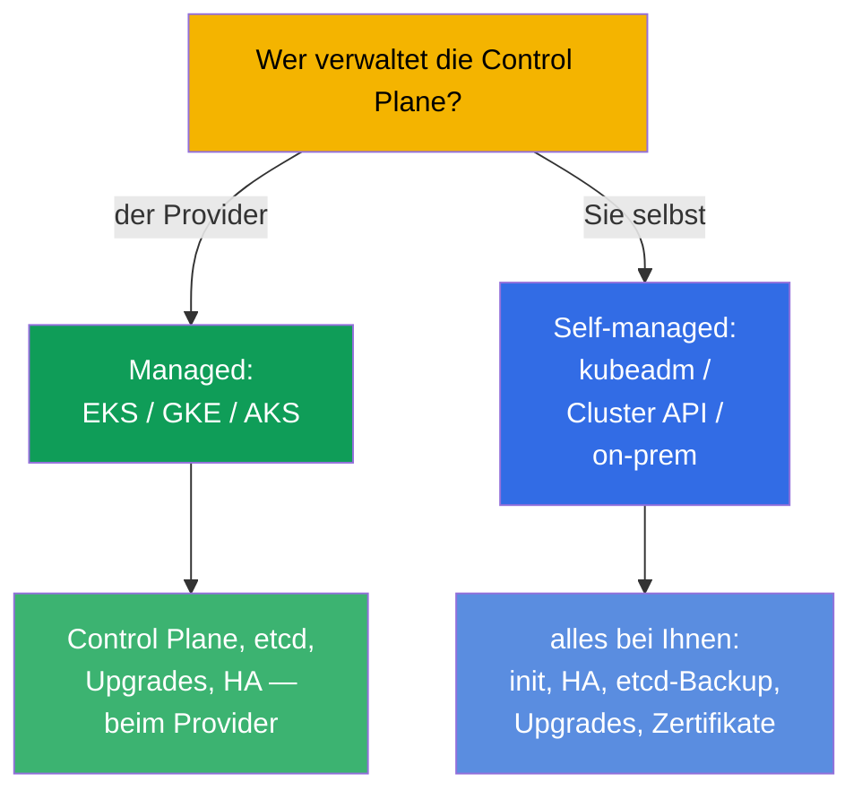
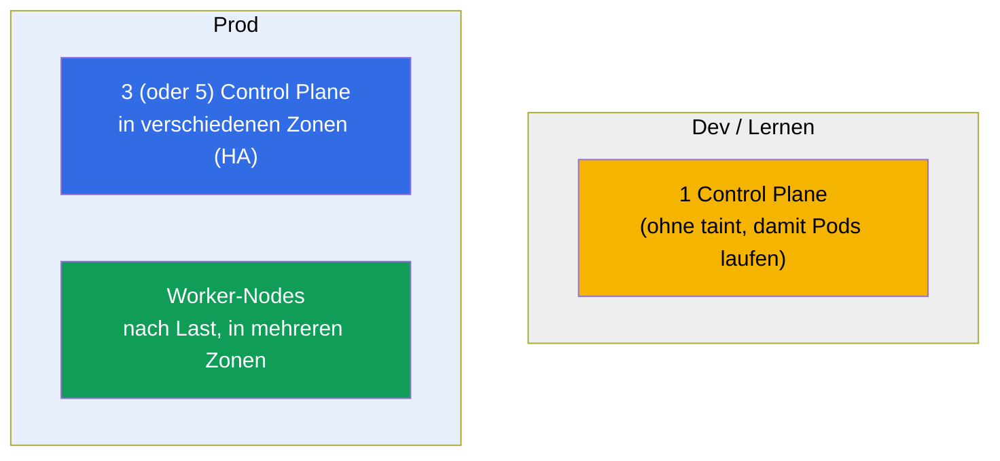
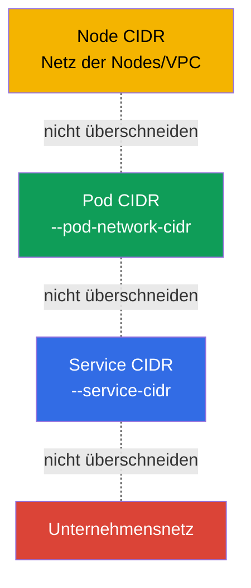
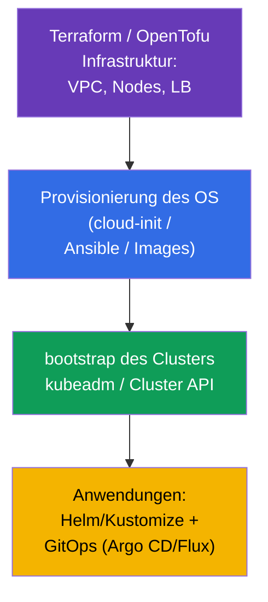

[Русская версия](ru.md) · [Eng version](README.md) · [Versión en español](es.md) · [Version française](fr.md) · [ქართული ვერსია](ge.md)

# Kapitel 35B. Cluster-Design und Sizing: Infrastruktur, Topologie, IaC

> 🟦 **Kapitel für CKA** (Domäne Cluster Architecture, Installation & Configuration, 25%).
> Für CKAD nicht erforderlich.
>
> **Was kommt.** In den Kapiteln 35 und 35A haben wir gelernt, einen Cluster aufzusetzen und
> ihn ausfallsicher zu machen. Aber vor der Installation muss ein Cluster **entworfen** werden:
> wo er lebt (managed oder self-managed), wie viele und welche Nodes, wie man die Adressräume
> plant, wie man das alles als Code beschreibt (IaC). Das ist Teil der Domäne Installation &
> Configuration und der Alltag eines Platform Engineers. Es baut auf den Kapiteln 0.1 (Netz/CIDR), 2
> (Architektur) und 35/35A (Installation/HA) auf.

## 35B.1. Managed oder self-managed: die erste Entscheidung

Die erste Design-Entscheidung ist, wer die Control Plane betreibt.

| | **Managed (EKS/GKE/AKS)** | **Self-managed (kubeadm/on-prem)** |
|--|---------------------------|-------------------------------------|
| Control Plane, etcd | betreibt der Provider (HA, Backup) | Ihre Verantwortung (Kapitel 35A, 37) |
| Upgrades der Control Plane | per Knopf/API | manuell (Kapitel 36) |
| Kontrolle und Anpassbarkeit | eingeschränkt | vollständig |
| Kosten | Gebühr für die Verwaltung | eigene Hardware/operativer Aufwand |
| Wann | die meisten Prod-Workloads in der Cloud | on-prem, spezifische Anforderungen, Lernen (CKA) |

Regel: in der Cloud nimmt man standardmäßig **managed** (weniger operatives Risiko);
self-managed wählt man, wenn volle Kontrolle, on-prem oder spezifische Installationen nötig sind.
Die CKA lehrt genau self-managed - denn dort macht man alles von Hand.

## 35B.2. Topologie: wie viele Control-Plane- und Worker-Nodes

Das Design der Ausfallsicherheit wiederholt Kapitel 35A, aber hier schauen wir auf den ganzen Cluster.

- **Control Plane:** dev - eine; prod - eine **ungerade** Anzahl (3/5) in verschiedenen
  Availability Zones (Kapitel 35A, etcd-Quorum).
- **Worker-Nodes:** Anzahl und Größe nach den summierten requests + Reserve; verteilt über Zonen,
  damit der Ausfall einer Zone nicht alle Replicas mitnimmt (topologySpread/antiAffinity, Kapitel 12).
- **Separate Node-Pools:** für unterschiedliche Profile (CPU-, Memory-, GPU-Nodes; spot vs
  on-demand) legt man verschiedene node pools mit Labels/taints an (Kapitel 6, 13).

## 35B.3. Sizing der Nodes: wenige große oder viele kleine

Eine der zentralen Design-Entscheidungen ist die Größe der Node.

| | Wenige **große** Nodes | Viele **kleine** Nodes |
|--|----------------------|-------------------------|
| Dichte/Effizienz | höher (weniger Overhead für OS/kubelet) | niedriger |
| Blast Radius | größer (fällt eine Node aus - viele Pods) | kleiner |
| Pod-Limit pro Node | stoßen an ~110 Pods/Node | verteilt |
| Große Pods | passen hinein | passen möglicherweise nicht |

Praxis: man vermeidet die Extreme. Zu berücksichtigen sind:
- das **Limit von ~110 Pods pro Node** (Voreinstellung) - die Obergrenze der Dichte;
- der **Overhead**: OS, kubelet, System-DaemonSets fressen einen Teil jeder Node
  (`Allocatable` < `Capacity`, Kapitel 14);
- der **Blast Radius**: zu große Nodes sind riskant - der Ausfall einer betrifft viel Last.

## 35B.4. Planung der Adressräume (im Voraus!)

Der häufigste irreversible Fehler sind unbedachte CIDR. Drei sich nicht überschneidende Räume
(Kapitel 0.1, 30):

- **Pod CIDR** muss `max_Pods × Nodes` mit Reserve für Wachstum aufnehmen - ein zu kleines
  stößt beim Skalieren an die Grenze, und es am laufenden Cluster zu wechseln ist extrem schmerzhaft.
- Node/Pod/Service CIDR **überschneiden sich nicht** untereinander und nicht mit dem
  Unternehmensnetz (sonst „die Pods sehen sich nicht“ und es gibt Routing-Konflikte).
- Man plant **vor** der Installation und stimmt sich mit dem Netzwerk-Team ab - das ist Teil
  des Designs und nicht „richten wir später“.

## 35B.5. Infrastructure as Code (IaC)

Cluster erstellt man nicht „mit Klicks“ - man beschreibt sie als Code, für Reproduzierbarkeit und Audit.

- **Infrastruktur** (VPC, Subnetze, Nodes, Load Balancer) - Terraform/OpenTofu (genau so sind
  die Labs des Kurses aufgebaut).
- **Vorbereitung des OS** (swap, Module, containerd, kube*) - cloud-init/Ansible/fertige Images
  (Kapitel 35), damit die Nodes gleich sind.
- **Bootstrap des Clusters** - kubeadm (in Automatisierung gehüllt) oder **Cluster API** (K8s
  verwaltet den Lebenszyklus von Clustern selbst deklarativ).
- **Anwendungen** - Helm/Kustomize (Kapitel 42, 43) über GitOps (Argo CD/Flux): git als
  einzige Quelle der Wahrheit.

Prinzip: alles ist aus Code reproduzierbar. Manuelle Änderungen an den Nodes - nur zum Debuggen,
danach führt man sie in den Code zurück (sonst „Konfigurationsdrift“).

## 35B.6. Wie man das in der Produktion anwendet

- **Managed als Standard, self-managed nach Bedarf.** Die meisten Teams nehmen
  EKS/GKE/AKS, um Control Plane und etcd nicht zu betreiben; self-managed - für on-prem,
  Regulatorik, edge und spezifische Kontrolle.
- **HA und Multi-Zonen-Betrieb sind für Prod zwingend.** 3+ Control Plane und Worker in
  verschiedenen Zonen; kritische Workloads verteilt man mit topologySpread.
- **Node-Pools für Lastprofile.** Separate Pools (CPU/mem/GPU, spot/on-demand) mit
  taints/Labels; Autoscaling der Pools über Cluster Autoscaler/Karpenter (Kapitel 16).
- **CIDR plant man einmal und mit Reserve.** Ein Fehler im Pod CIDR ist ein teurer Umbau; die
  Netze stimmt man vorab ab.
- **Alles über IaC + GitOps.** Terraform für die Infrastruktur, Cluster API/kubeadm für die
  Cluster, Argo CD/Flux für die Anwendungen - Reproduzierbarkeit, Review, Rollback, Audit.

## 35B.7. Mini-Glossar

- **Managed Cluster** - die Control Plane betreibt der Provider (EKS/GKE/AKS).
- **Self-managed** - die Control Plane setzen und betreiben Sie (kubeadm/on-prem).
- **Node pool** - Gruppe gleichartiger Nodes (Profil, Zone, spot/on-demand).
- **Blast radius** - wie viel Last der Ausfall eines Elements betrifft.
- **Allocatable** - Ressourcen der Node, die den Pods zur Verfügung stehen (Capacity minus Overhead, Kapitel 14).
- **Limit ~110 Pods/Node** - Obergrenze der Pod-Anzahl pro Node in der Voreinstellung.
- **IaC** - Infrastructure as Code (Terraform/OpenTofu, Ansible).
- **Cluster API** - deklarative Verwaltung des Lebenszyklus von Clustern.
- **GitOps** - git als Quelle der Wahrheit für den Zustand des Clusters (Argo CD/Flux).

## 35B.8. Zusammenfassung des Kapitels

- Die erste Entscheidung ist managed (EKS/GKE/AKS) oder self-managed (kubeadm/on-prem): je mehr
  beim Provider liegt, desto geringer das operative Risiko; die CKA dreht sich um self-managed.
- Topologie: dev - eine Control Plane; prod - eine ungerade Anzahl (3/5) in verschiedenen Zonen +
  Worker nach Last; separate node pools für Profile.
- Sizing der Nodes ist eine Balance: große Nodes sind dichter, haben aber einen größeren Blast
  Radius; ~110 Pods/Node und den Overhead (Allocatable) im Kopf behalten.
- CIDR (Node/Pod/Service) plant man im Voraus, mit Reserve und ohne Überschneidungen - das ist
  am laufenden Cluster irreversibel.
- Alles beschreibt man als Code: Terraform (Infra) → cloud-init/Ansible (OS) → kubeadm/Cluster API
  (Cluster) → Helm/Kustomize + GitOps (Anwendungen).

## 35B.9. Wofür das nützlich ist: in der Prüfung und in der echten Arbeit

**In der Prüfung (CKA).** Direkte Aufgaben „entwirf einen Cluster“ gibt es nicht, aber das
Verständnis der Topologie (wie viele Control Plane, warum eine ungerade Anzahl), des Sizings und
der CIDR-Planung braucht man für die Installation (Kapitel 35), HA (35A) und das Troubleshooting
des Netzes. Das ist Teil der Domäne Installation (25%).

**In der echten Arbeit.** Design ist die halbe Miete im Betrieb: die Wahl managed/self-managed,
Topologie und Zonen, Sizing der Pools, Planung der Adressräume und IaC/GitOps entscheiden darüber,
ob der Cluster zuverlässig und reproduzierbar ist oder eine „Schneeflocke“, die man nicht anfassen mag.

## 35B.10. Fragen zur Selbstüberprüfung

1. Wodurch unterscheidet sich ein managed Cluster von einem self-managed und wann wählt man welchen?
2. Wie viele Control-Plane-Nodes braucht man für dev und für prod und warum eine ungerade Anzahl?
3. Was sind die Vor- und Nachteile großer Nodes gegenüber kleinen? Was ist der Blast Radius?
4. Warum ist es wichtig, das Pod CIDR im Voraus und mit Reserve zu planen?
5. Aus welchen Schichten besteht der IaC-Stack eines Clusters (Infra → OS → Cluster → Anwendungen)?
6. Was ist ein node pool und wozu teilt man Nodes in Pools auf?

## Praxis

Wir haben den Cluster „auf dem Papier“ entworfen. Den HA-Aufbau übt Lab 124, die Installation von
null Lab 116; die Infrastruktur aller Labs des Kurses ist als IaC (Terraform/Terragrunt) beschrieben -
man kann in `tasks/cka/labs/*/` hineinschauen. Weiter (Kapitel 36) - das sichere Upgrade des Clusters.

🧪 Lab 116 (Installation) · Lab 124 (HA): [tasks/cka/labs/124](../../labs/124/README_DE.MD)

---
[Inhalt](../README_DE.md) · [Kapitel 35A](../35-2-ha/de.md) · [Kapitel 36](../36/de.md)
