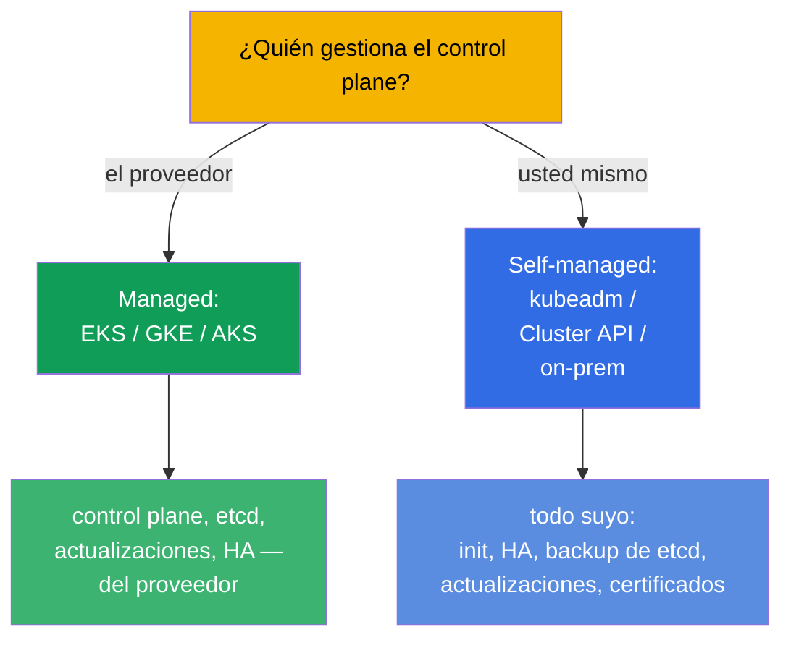
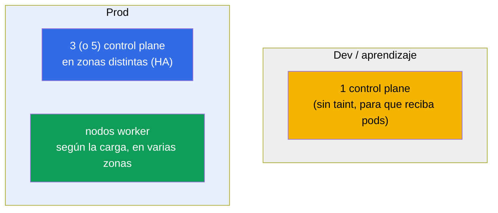
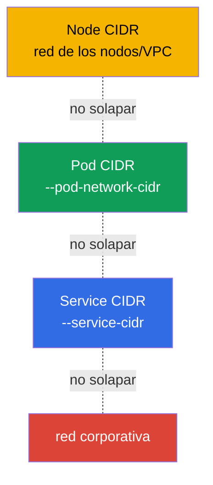
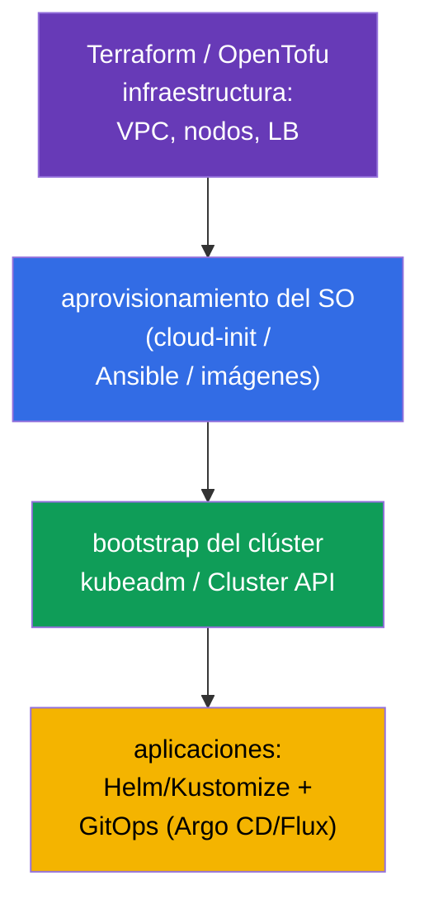

[Русская версия](ru.md) · [Eng version](README.md) · [Version française](fr.md) · [Deutsche Version](de.md) · [ქართული ვერსია](ge.md) · [繁體中文版](tw.md) · [日本語版](jp.md)

# Capítulo 35B. Diseño y sizing del clúster: infraestructura, topología, IaC

> 🟦 **Capítulo para CKA** (dominio Cluster Architecture, Installation & Configuration, 25%).
> Para CKAD no es necesario.
>
> **Qué viene ahora.** En los capítulos 35 y 35A aprendimos a montar un clúster y a hacerlo
> tolerante a fallos. Pero antes de instalarlo hay que **diseñarlo**: dónde vive
> (managed o self-managed), cuántos nodos y de qué tipo, cómo planificar los espacios de
> direcciones, cómo describir todo eso con código (IaC). Es parte del dominio Installation & Configuration
> y el trabajo diario de un ingeniero de plataforma. Se apoya en los capítulos 0.1 (red/CIDR), 2
> (arquitectura), 35/35A (instalación/HA).

## 35B.1. Managed o self-managed: la primera decisión

La primera decisión de diseño es quién mantiene el control plane.

| | **Managed (EKS/GKE/AKS)** | **Self-managed (kubeadm/on-prem)** |
|--|---------------------------|-------------------------------------|
| Control plane, etcd | los mantiene el proveedor (HA, backup) | su responsabilidad (capítulos 35A, 37) |
| Actualizaciones del control plane | con un botón/API | a mano (capítulo 36) |
| Control y personalización | limitados | totales |
| Coste | pago por la gestión | hardware propio/esfuerzo operativo |
| Cuándo | la mayoría de cargas de producción en la nube | on-prem, requisitos específicos, aprendizaje (CKA) |

Regla: en la nube por defecto se toma **managed** (menos riesgo operativo); se elige self-managed
cuando hace falta control total, on-prem o instalaciones específicas. El CKA enseña precisamente
self-managed - porque allí todo se hace a mano.

## 35B.2. Topología: cuántos nodos de control plane y worker

El diseño de la tolerancia a fallos repite el capítulo 35A, pero aquí miramos el clúster completo.

- **Control plane:** dev - uno; prod - número **impar** (3/5) en zonas de disponibilidad distintas
  (capítulo 35A, quórum de etcd).
- **Nodos worker:** número y tamaño - por la suma de los requests + margen; se reparten por zonas
  para que la caída de una zona no se lleve todas las réplicas (topologySpread/antiAffinity, capítulo 12).
- **Pools de nodos separados:** para perfiles distintos (nodos de CPU, de memoria, de GPU; spot vs
  on-demand) se crean node pools distintos con etiquetas/taints (capítulos 6, 13).

## 35B.3. Sizing de los nodos: pocos grandes o muchos pequeños

Una de las decisiones de diseño clave es el tamaño del nodo.

| | Pocos nodos **grandes** | Muchos nodos **pequeños** |
|--|----------------------|-------------------------|
| Densidad/eficiencia | mayor (menos sobrecarga de SO/kubelet) | menor |
| Radio de fallo | mayor (cae un nodo - muchos pods) | menor |
| Límite de pods por nodo | chocan con ~110 pods/nodo | repartido |
| Pods grandes | caben | pueden no entrar |

En la práctica: se evitan los extremos. Se tiene en cuenta:
- el **límite de ~110 pods por nodo** (por defecto) - el techo de densidad;
- la **sobrecarga**: el SO, el kubelet y los DaemonSet del sistema se comen parte de cada nodo
  (`Allocatable` < `Capacity`, capítulo 14);
- el **radio de fallo**: los nodos demasiado grandes son peligrosos - la caída de uno afecta a mucha carga.

## 35B.4. Planificación de los espacios de direcciones (¡de antemano!)

El error irreversible más frecuente son unos CIDR mal pensados. Tres espacios que no se solapan
(capítulos 0.1, 30):

- El **Pod CIDR** debe albergar `max_pods × nodos` con margen de crecimiento - uno demasiado pequeño
  chocará con el techo al escalar, y cambiarlo en un clúster vivo es extremadamente doloroso.
- Los Node/Pod/Service CIDR **no se solapan** entre sí ni con la red corporativa (si no, aparecen
  «los pods no se ven entre ellos» y conflictos de rutas).
- Se planifican **antes** de la instalación y se acuerdan con el equipo de red - es parte del diseño,
  no un «ya lo arreglamos luego».

## 35B.5. Infraestructura como código (IaC)

Los clústeres no se crean «a clics» - se describen con código para tener reproducibilidad y auditoría.

- **Infraestructura** (VPC, subredes, nodos, balanceador) - Terraform/OpenTofu (así están hechos
  precisamente los laboratorios del curso).
- **Preparación del SO** (swap, módulos, containerd, kube*) - cloud-init/Ansible/imágenes ya listas
  (capítulo 35), para que los nodos sean idénticos.
- **Bootstrap del clúster** - kubeadm (envuelto en automatización) o **Cluster API** (K8s gestiona
  él mismo el ciclo de vida de los clústeres de forma declarativa).
- **Aplicaciones** - Helm/Kustomize (capítulos 42, 43) mediante GitOps (Argo CD/Flux): git como
  única fuente de verdad.

Principio: todo es reproducible a partir del código. Los cambios manuales en los nodos son solo
para depurar, y después se devuelven al código (si no, aparece la «deriva de configuración»).

## 35B.6. Cómo se aplica esto en producción

- **Managed por defecto, self-managed cuando sea necesario.** La mayoría de los equipos toman
  EKS/GKE/AKS para no mantener el control plane ni etcd; self-managed - para on-prem,
  regulación, edge y control específico.
- **HA y multizona - obligatorios en producción.** 3+ control plane y workers en zonas distintas;
  las cargas críticas se reparten con topologySpread.
- **Node pools por perfiles de carga.** Pools separados (CPU/mem/GPU, spot/on-demand) con
  taints/etiquetas; autoescalado de los pools con Cluster Autoscaler/Karpenter (capítulo 16).
- **Los CIDR se planifican una vez y con margen.** Un error en el Pod CIDR es una reforma cara; las
  redes se acuerdan de antemano.
- **Todo mediante IaC + GitOps.** Terraform para la infraestructura, Cluster API/kubeadm para los
  clústeres, Argo CD/Flux para las aplicaciones - reproducibilidad, revisión, rollback, auditoría.

## 35B.7. Mini-glosario

- **Clúster managed** - el control plane lo mantiene el proveedor (EKS/GKE/AKS).
- **Self-managed** - el control plane lo instala y mantiene usted (kubeadm/on-prem).
- **Node pool** - grupo de nodos del mismo tipo (perfil, zona, spot/on-demand).
- **Radio de fallo (blast radius)** - cuánta carga afecta el fallo de un solo elemento.
- **Allocatable** - recursos del nodo disponibles para los pods (Capacity menos la sobrecarga, capítulo 14).
- **límite de ~110 pods/nodo** - techo del número de pods por nodo por defecto.
- **IaC** - infraestructura como código (Terraform/OpenTofu, Ansible).
- **Cluster API** - gestión declarativa del ciclo de vida de los clústeres.
- **GitOps** - git como fuente de verdad del estado del clúster (Argo CD/Flux).

## 35B.8. Resumen del capítulo

- La primera decisión es managed (EKS/GKE/AKS) o self-managed (kubeadm/on-prem): cuanto más recaiga
  en el proveedor, menor es el riesgo operativo; el CKA va de self-managed.
- Topología: dev - un control plane; prod - número impar (3/5) en zonas distintas +
  workers según la carga; node pools separados por perfiles.
- El sizing de los nodos es un equilibrio: los nodos grandes son más densos, pero tienen mayor radio
  de fallo; recordar el ~110 pods/nodo y la sobrecarga (Allocatable).
- Los CIDR (Node/Pod/Service) se planifican de antemano, con margen y sin solapamientos - es
  irreversible en un clúster vivo.
- Todo se describe con código: Terraform (infra) → cloud-init/Ansible (SO) → kubeadm/Cluster API
  (clúster) → Helm/Kustomize + GitOps (aplicaciones).

## 35B.9. Para qué sirve esto: en el examen y en el trabajo real

**En el examen (CKA).** No hay tareas directas de «diseñe un clúster», pero entender la topología
(cuántos control plane, para qué un número impar), el sizing y la planificación de los CIDR hace
falta para la instalación (capítulo 35), el HA (35A) y el troubleshooting de red. Es parte del
dominio Installation (25%).

**En el trabajo real.** El diseño es la mitad del éxito de la operación: la elección de managed/
self-managed, la topología y las zonas, el sizing de los pools, la planificación de las direcciones
y el IaC/GitOps determinan si el clúster será fiable y reproducible o un «copo de nieve» intocable.

## 35B.10. Preguntas de autocomprobación

1. ¿En qué se diferencia un clúster managed de uno self-managed y cuándo se elige cada uno?
2. ¿Cuántos nodos de control plane hacen falta para dev y para prod y por qué un número impar?
3. ¿Cuáles son las ventajas y los inconvenientes de los nodos grandes frente a los pequeños? ¿Qué es el radio de fallo?
4. ¿Por qué es importante planificar el Pod CIDR de antemano y con margen?
5. ¿De qué capas se compone el stack de IaC de un clúster (infra → SO → clúster → aplicaciones)?
6. ¿Qué es un node pool y para qué separar los nodos en pools?

## Práctica

Hemos diseñado el clúster «sobre el papel». El HA se practica en el laboratorio 124, la instalación
desde cero en el 116; la infraestructura de todos los laboratorios está descrita como IaC
(Terraform/Terragrunt) - mírela en `tasks/cka/labs/*/`. Después (capítulo 36): actualización segura.

🧪 Laboratorio 116 (instalación) · Laboratorio 124 (HA): [tasks/cka/labs/124](../../labs/124/README_ES.MD)

---
[Índice](../README_ES.md) · [Capítulo 35A](../35-2-ha/es.md) · [Capítulo 36](../36/es.md)
