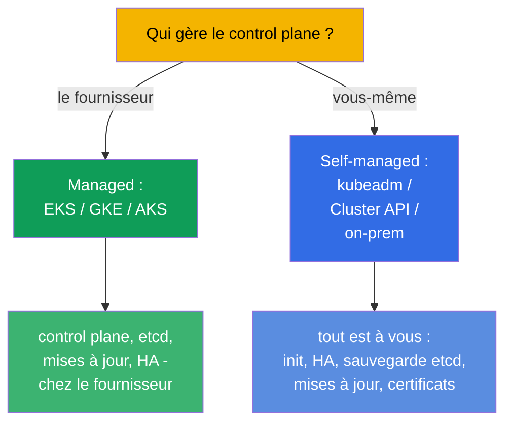
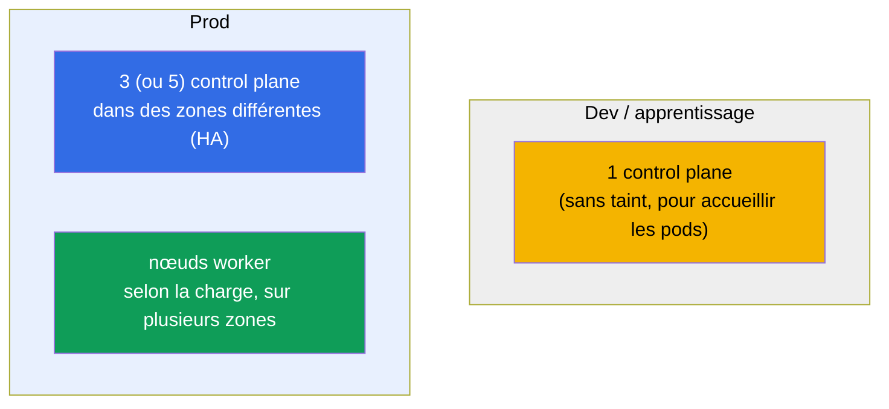
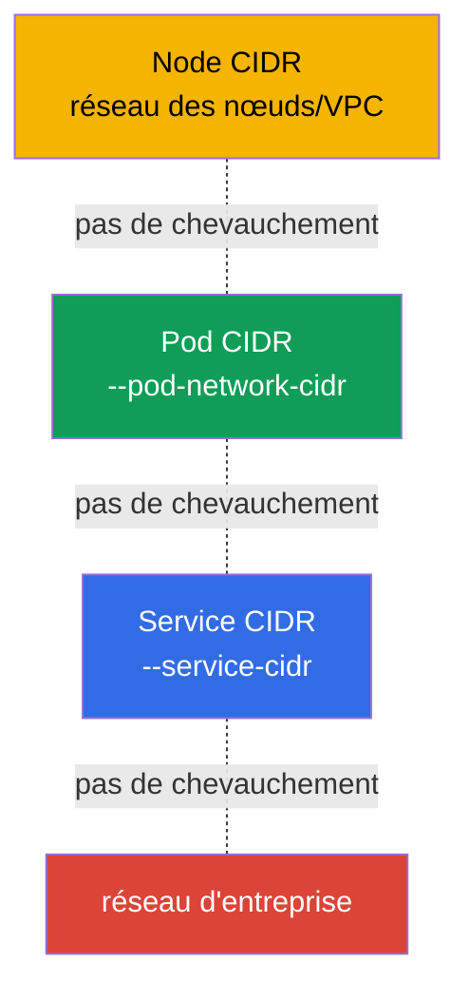
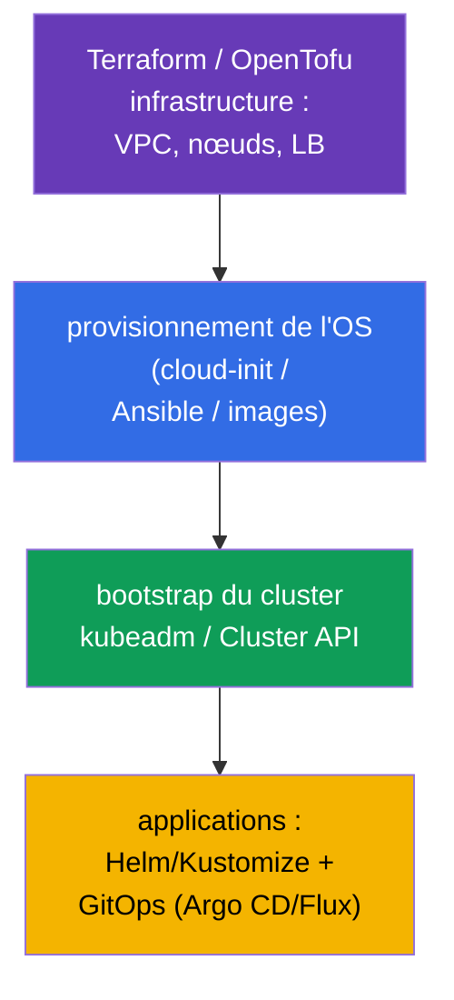

[Русская версия](ru.md) · [Eng version](README.md) · [Versión en español](es.md) · [Deutsche Version](de.md) · [ქართული ვერსია](ge.md)

# Chapitre 35B. Conception et dimensionnement du cluster : infrastructure, topologie, IaC

> 🟦 **Chapitre pour le CKA** (domaine Cluster Architecture, Installation & Configuration, 25 %).
> Non requis pour le CKAD.
>
> **Ce qui suit.** Aux chapitres 35 et 35A nous avons appris à installer un cluster et à le rendre
> tolérant aux pannes. Mais avant l'installation, il faut **concevoir** le cluster : où il vit
> (managed ou self-managed), combien de nœuds et de quel type, comment planifier les espaces
> d'adressage, comment décrire tout cela sous forme de code (IaC). Cela fait partie du domaine
> Installation & Configuration et du quotidien de l'ingénieur plateforme. S'appuie sur les
> chapitres 0.1 (réseau/CIDR), 2 (architecture), 35/35A (installation/HA).

## 35B.1. Managed ou self-managed : la première décision

La première décision de conception - qui exploite le control plane.

| | **Managed (EKS/GKE/AKS)** | **Self-managed (kubeadm/on-prem)** |
|--|---------------------------|-------------------------------------|
| Control plane, etcd | exploités par le fournisseur (HA, sauvegarde) | votre responsabilité (chapitres 35A, 37) |
| Mises à jour du control plane | par un bouton/l'API | à la main (chapitre 36) |
| Contrôle et personnalisation | limités | complets |
| Coût | frais de gestion | votre matériel/vos efforts opérationnels |
| Quand | la majorité des charges de prod dans le cloud | on-prem, exigences spécifiques, apprentissage (CKA) |

Règle : dans le cloud, on prend par défaut du **managed** (moins de risque opérationnel) ; le
self-managed se choisit quand il faut un contrôle total, de l'on-prem ou des installations
spécifiques. Le CKA enseigne justement le self-managed - parce que là, tout se fait à la main.

## 35B.2. Topologie : combien de nœuds control plane et worker

La conception de la tolérance aux pannes reprend le chapitre 35A, mais ici on regarde le cluster entier.

- **Control plane :** en dev - un seul ; en prod - un nombre **impair** (3/5) dans des zones de
  disponibilité différentes (chapitre 35A, quorum d'etcd).
- **Nœuds worker :** nombre et taille - selon la somme des requests des charges + une marge ; on les répartit
  sur les zones, pour que la panne d'une zone n'emporte pas toutes les répliques (topologySpread/antiAffinity, chapitre 12).
- **Pools de nœuds séparés :** pour les différents profils (nœuds CPU, mémoire, GPU ; spot vs
  on-demand) on crée des node pools distincts avec des labels/taints (chapitres 6, 13).

## 35B.3. Dimensionner les nœuds : peu de gros ou beaucoup de petits

L'un des choix de conception clés - la taille du nœud.

| | Peu de **gros** nœuds | Beaucoup de **petits** nœuds |
|--|----------------------|-------------------------|
| Densité/efficacité | plus élevée (moins de surcoût OS/kubelet) | plus faible |
| Rayon de panne | plus grand (un nœud tombe - beaucoup de pods) | plus petit |
| Limite de pods par nœud | on butte sur ~110 pods/nœud | réparti |
| Gros pods | tiennent | risquent de ne pas tenir |

En pratique : on évite les extrêmes. On tient compte de :
- la **limite ~110 pods par nœud** (par défaut) - le plafond de densité ;
- les **surcoûts** : l'OS, kubelet, les DaemonSet système mangent une part de chaque nœud
  (`Allocatable` < `Capacity`, chapitre 14) ;
- le **rayon de panne** : des nœuds trop gros sont dangereux - la chute d'un seul touche beaucoup de charge.

## 35B.4. Planifier les espaces d'adressage (à l'avance !)

L'erreur irréversible la plus fréquente - des CIDR mal réfléchis. Trois espaces qui ne se chevauchent pas
(chapitres 0.1, 30) :

- Le **Pod CIDR** doit contenir `max_pods × nœuds` avec de la marge pour la croissance - trop petit,
  il butera sur un plafond lors de la mise à l'échelle, et le changer sur un cluster vivant est extrêmement pénible.
- Les Node/Pod/Service CIDR **ne se chevauchent pas** entre eux ni avec le réseau d'entreprise (sinon
  « les pods ne se voient pas » et les routes entrent en conflit).
- On planifie **avant** l'installation et on valide avec l'équipe réseau - cela fait partie de la
  conception, et non du « on corrigera plus tard ».

## 35B.5. Infrastructure as code (IaC)

Les clusters ne se créent pas « par clics » - on les décrit par du code, pour la reproductibilité et l'audit.

- **L'infrastructure** (VPC, sous-réseaux, nœuds, répartiteur de charge) - Terraform/OpenTofu (c'est
  exactement ainsi que sont bâtis les TP du cours).
- **La préparation de l'OS** (swap, modules, containerd, kube*) - cloud-init/Ansible/images prêtes
  (chapitre 35), pour que les nœuds soient identiques.
- **Le bootstrap du cluster** - kubeadm (enveloppé dans de l'automatisation) ou **Cluster API** (K8s
  gère lui-même le cycle de vie des clusters de façon déclarative).
- **Les applications** - Helm/Kustomize (chapitres 42, 43) via GitOps (Argo CD/Flux) : git comme
  unique source de vérité.

Principe : tout est reproductible depuis le code. Les modifications manuelles sur les nœuds - uniquement
pour le débogage, ensuite on les reverse dans le code (sinon c'est la « dérive de configuration »).

## 35B.6. Comment cela s'applique en production

- **Managed par défaut, self-managed en cas de besoin.** La majorité des équipes prennent
  EKS/GKE/AKS pour ne pas exploiter le control plane et etcd ; le self-managed - pour l'on-prem,
  la réglementation, l'edge et un contrôle spécifique.
- **HA et multizone - obligatoires en prod.** 3+ control plane et des workers dans des zones
  différentes ; les charges critiques sont réparties par topologySpread.
- **Des node pools par profil de charge.** Des pools séparés (CPU/mem/GPU, spot/on-demand) avec
  taints/labels ; l'autoscaling des pools par Cluster Autoscaler/Karpenter (chapitre 16).
- **Les CIDR se planifient une fois et avec de la marge.** Une erreur de Pod CIDR - une refonte
  coûteuse ; les réseaux se valident à l'avance.
- **Tout passe par IaC + GitOps.** Terraform pour l'infrastructure, Cluster API/kubeadm pour les
  clusters, Argo CD/Flux pour les applications - reproductibilité, revue, retour arrière, audit.

## 35B.7. Mini-glossaire

- **Cluster managed** - le control plane est exploité par le fournisseur (EKS/GKE/AKS).
- **Self-managed** - c'est vous qui installez et exploitez le control plane (kubeadm/on-prem).
- **Node pool** - groupe de nœuds identiques (profil, zone, spot/on-demand).
- **Rayon de panne (blast radius)** - quelle part de la charge est touchée par la panne d'un élément.
- **Allocatable** - les ressources du nœud disponibles pour les pods (Capacity moins les surcoûts, chapitre 14).
- **limite ~110 pods/nœud** - le plafond par défaut du nombre de pods sur un nœud.
- **IaC** - infrastructure as code (Terraform/OpenTofu, Ansible).
- **Cluster API** - gestion déclarative du cycle de vie des clusters.
- **GitOps** - git comme source de vérité de l'état du cluster (Argo CD/Flux).

## 35B.8. Bilan du chapitre

- La première décision - managed (EKS/GKE/AKS) ou self-managed (kubeadm/on-prem) : plus il y a de
  choses chez le fournisseur, moins il y a de risque opérationnel ; le CKA - c'est du self-managed.
- Topologie : en dev - un seul control plane ; en prod - un nombre impair (3/5) dans des zones
  différentes + des workers selon la charge ; des node pools séparés par profil.
- Le dimensionnement des nœuds - un équilibre : les gros nœuds sont plus denses, mais le rayon de
  panne est plus grand ; se souvenir des ~110 pods/nœud et des surcoûts (Allocatable).
- Les CIDR (Node/Pod/Service) se planifient à l'avance, avec de la marge et sans chevauchement -
  c'est irréversible sur un cluster vivant.
- Tout se décrit par du code : Terraform (infra) → cloud-init/Ansible (OS) → kubeadm/Cluster API
  (cluster) → Helm/Kustomize + GitOps (applications).

## 35B.9. À quoi cela sert : à l'examen et dans le travail réel

**À l'examen (CKA).** Pas d'exercice direct « concevez un cluster », mais comprendre la topologie
(combien de control plane, pourquoi un nombre impair), le dimensionnement et la planification des CIDR
est utile pour l'installation (35), la HA (35A) et le troubleshooting réseau : domaine Installation (25 %).

**Dans le travail réel.** La conception - c'est la moitié du succès de l'exploitation : le choix
managed/self-managed, la topologie et les zones, le dimensionnement des pools, la planification des
espaces d'adressage et l'IaC/GitOps déterminent si le cluster sera fiable et reproductible ou un
« flocon de neige » qu'on a peur de toucher.

## 35B.10. Questions d'auto-évaluation

1. En quoi un cluster managed diffère-t-il d'un self-managed et quand choisit-on chacun ?
2. Combien de nœuds control plane faut-il pour le dev et pour la prod, et pourquoi un nombre impair ?
3. Quels sont les avantages et inconvénients des gros nœuds face aux petits ? Qu'est-ce que le rayon de panne ?
4. Pourquoi est-il important de planifier le Pod CIDR à l'avance et avec de la marge ?
5. De quelles couches est composée la pile IaC d'un cluster (infra → OS → cluster → applications) ?
6. Qu'est-ce qu'un node pool et pourquoi séparer les nœuds en pools ?

## Pratique

Nous avons conçu le cluster « sur le papier ». Le montage de la HA se travaille au TP 124, l'installation
depuis zéro - au TP 116 ; l'infrastructure de tous les TP du cours est décrite comme de l'IaC
(Terraform/Terragrunt) - jetez un œil dans `tasks/cka/labs/*/`. Ensuite (chapitre 36) - la mise à jour sécurisée du cluster.

🧪 TP 116 (installation) · TP 124 (HA) : [tasks/cka/labs/124](../../labs/124/README_FR.MD)

---
[Sommaire](../README_FR.md) · [Chapitre 35A](../35-2-ha/fr.md) · [Chapitre 36](../36/fr.md)
