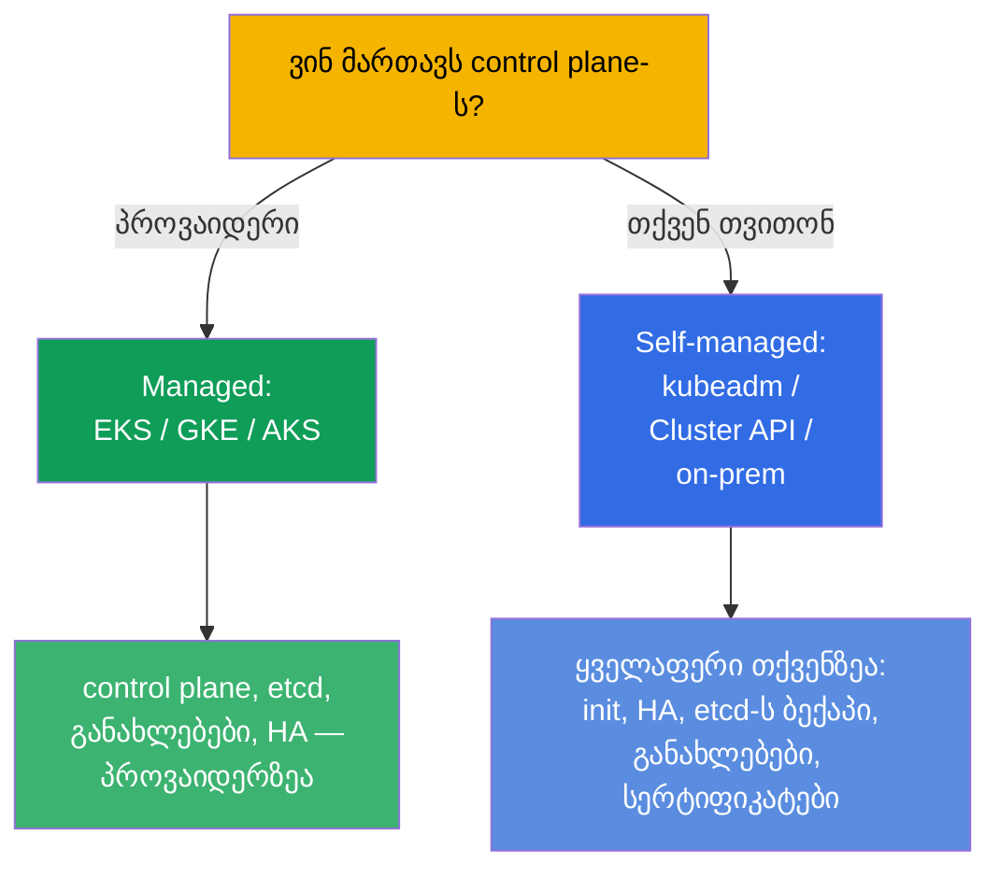
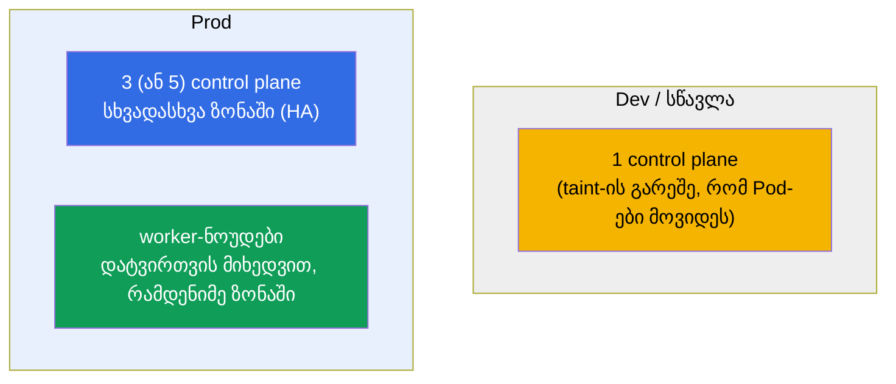
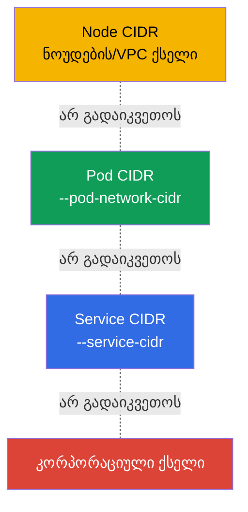
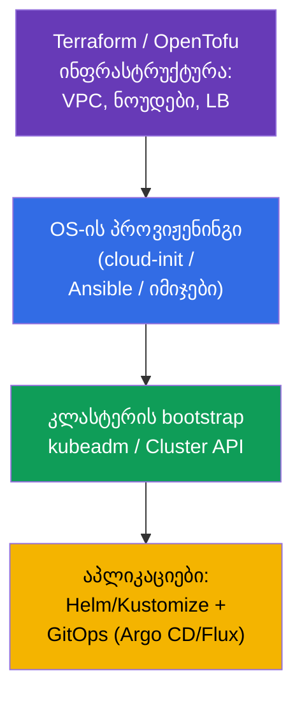

[Русская версия](ru.md) · [Eng version](README.md) · [Versión en español](es.md) · [Version française](fr.md) · [Deutsche Version](de.md) · [繁體中文版](tw.md) · [日本語版](jp.md)

# თავი 35B. კლასტერის დაპროექტება და საიზინგი: ინფრასტრუქტურა, ტოპოლოგია, IaC

> 🟦 **თავი CKA-სთვის** (დომენი Cluster Architecture, Installation & Configuration, 25%).
> CKAD-სთვის საჭირო არაა.
>
> **რა იქნება შემდეგ.** თავებში 35 და 35A ვისწავლეთ კლასტერის დაყენება და მისი
> უმტყუნებლად გახდომა. მაგრამ დაყენებამდე კლასტერი უნდა **დავაპროექტოთ**: სად ცხოვრობს ის
> (managed თუ self-managed), რამდენი და როგორი ნოუდი, როგორ დავგეგმოთ მისამართების
> სივრცეები, როგორ აღიწეროს ეს ყველაფერი კოდით (IaC). ეს Installation & Configuration დომენის
> და პლატფორმული ინჟინრის ყოველდღიური სამუშაოს ნაწილია. ეყრდნობა თავებს 0.1 (ქსელი/CIDR), 2
> (არქიტექტურა), 35/35A (ინსტალაცია/HA).

## 35B.1. Managed თუ self-managed: პირველი გადაწყვეტილება

პირველი საპროექტო გადაწყვეტილება - ვინ ემსახურება control plane-ს.

| | **Managed (EKS/GKE/AKS)** | **Self-managed (kubeadm/on-prem)** |
|--|---------------------------|-------------------------------------|
| Control plane, etcd | ემსახურება პროვაიდერი (HA, ბექაპი) | თქვენი პასუხისმგებლობა (თავები 35A, 37) |
| Control plane-ის განახლებები | ღილაკით/API-თ | ხელით (თავი 36) |
| კონტროლი და კასტომიზაცია | შეზღუდულია | სრული |
| ღირებულება | გადასახადი მართვისთვის | თქვენი აპარატურა/ოპერაციული ძალისხმევა |
| როდის | ღრუბელში პროდ-დატვირთვების უმრავლესობა | on-prem, სპეციფიკური მოთხოვნები, სწავლა (CKA) |

წესი: ღრუბელში ნაგულისხმევად იღებენ **managed**-ს (ნაკლები ოპერაციული რისკი); self-managed-ს
ირჩევენ, როცა საჭიროა სრული კონტროლი, on-prem ან სპეციფიკური ინსტალაციები. CKA სწორედ
self-managed-ს ასწავლის - რადგან იქ ყველაფერს ხელით აკეთებ.

## 35B.2. ტოპოლოგია: რამდენი control plane და worker-ნოუდი

უმტყუნებლობის დიზაინი იმეორებს თავ 35A-ს, მაგრამ აქ კლასტერს მთლიანობაში ვუყურებთ.

- **Control plane:** dev - ერთი; prod - **კენტი** რაოდენობა (3/5) სხვადასხვა ხელმისაწვდომობის ზონაში
  (თავი 35A, etcd-ს კვორუმი).
- **Worker-ნოუდები:** რაოდენობა და ზომა - დატვირთვების ჯამური requests + მარაგი; ანაწილებენ
  ზონებზე, რომ ზონის მტყუნებამ ყველა რეპლიკა არ წაიღოს (topologySpread/antiAffinity, თავი 12).
- **ცალკეული ნოუდების პულები:** სხვადასხვა პროფილისთვის (CPU-, memory-, GPU-ნოუდები; spot vs on-demand)
  აწყობენ სხვადასხვა node pool-ს ლეიბლებით/taint-ებით (თავები 6, 13).

## 35B.3. ნოუდების საიზინგი: ცოტა დიდი თუ ბევრი პატარა

ერთი საკვანძო საპროექტო არჩევანი - ნოუდის ზომა.

| | ცოტა **დიდი** ნოუდი | ბევრი **პატარა** ნოუდი |
|--|----------------------|-------------------------|
| სიმკვრივე/ეფექტიანობა | უფრო მაღალი (ნაკლები ზედნადები OS/kubelet-ზე) | უფრო დაბალი |
| მტყუნების რადიუსი | უფრო დიდი (ნოუდი დაეცა - ბევრი Pod) | უფრო მცირე |
| Pod-ების ლიმიტი ნოუდზე | აწყდებიან ~110 Pod/ნოუდს | გადანაწილებულია |
| მსხვილი Pod-ები | თავსდებიან | შეიძლება არ ჩაჯდნენ |

პრაქტიკა: ერიდებიან უკიდურესობებს. ითვალისწინებენ:
- **~110 Pod-ის ლიმიტი ნოუდზე** (ნაგულისხმევად) - სიმკვრივის ჭერი;
- **ზედნადები ხარჯები**: OS, kubelet, სისტემური DaemonSet-ები ჭამენ ყოველი ნოუდის ნაწილს
  (`Allocatable` < `Capacity`, თავი 14);
- **მტყუნების რადიუსი**: ძალიან დიდი ნოუდები საშიშია - ერთის დაცემა ბევრ დატვირთვას ეხება.

## 35B.4. მისამართების სივრცეების დაგეგმვა (წინასწარ!)

ყველაზე ხშირი შეუქცევადი შეცდომა - გაუაზრებელი CIDR. სამი ურთიერთგადაუკვეთელი სივრცე
(თავები 0.1, 30):

- **Pod CIDR** უნდა ატევდეს `max_Pod-ები × ნოუდები` ზრდის მარაგით - ძალიან პატარა
  მასშტაბირებისას ჭერს დაეჯახება, ხოლო ცოცხალ კლასტერზე მისი შეცვლა უკიდურესად მტკივნეულია.
- Node/Pod/Service CIDR **არ გადაიკვეთება** ერთმანეთთან და კორპორაციულ ქსელთან (თორემ
  „Pod-ები ერთმანეთს ვერ ხედავენ“ და მარშრუტების კონფლიქტები).
- გეგმავენ დაყენებამდე **მანამდე** და ათანხმებენ ქსელურ გუნდთან - ეს დიზაინის ნაწილია, და არა
  „მერე გავასწორებთ“.

## 35B.5. ინფრასტრუქტურა როგორც კოდი (IaC)

კლასტერებს „კლიკებით“ არ ქმნიან - მათ კოდით აღწერენ განმეორებადობისა და აუდიტისთვის.

- **ინფრასტრუქტურა** (VPC, ქვექსელები, ნოუდები, ბალანსერი) - Terraform/OpenTofu (სწორედ ასეა
  მოწყობილი კურსის ლაბები).
- **OS-ის მომზადება** (swap, მოდულები, containerd, kube*) - cloud-init/Ansible/მზა იმიჯები
  (თავი 35), რომ ნოუდები ერთნაირი იყოს.
- **კლასტერის Bootstrap** - kubeadm (ავტომატიზაციაში შეხვეული) ან **Cluster API** (K8s თვითონ
  მართავს კლასტერების სასიცოცხლო ციკლს დეკლარაციულად).
- **აპლიკაციები** - Helm/Kustomize (თავები 42, 43) GitOps-ის გავლით (Argo CD/Flux): git როგორც
  სიმართლის ერთადერთი წყარო.

პრინციპი: ყველაფერი განმეორებადია კოდიდან. ხელით ცვლილებები ნოუდებზე - მხოლოდ გამართვისთვის, მერე
მათ კოდში აბრუნებენ (თორემ „კონფიგურაციის დრიფტი“).

## 35B.6. როგორ იყენებენ ამას პროდაქშენში

- **Managed ნაგულისხმევად, self-managed საჭიროებისამებრ.** გუნდების უმრავლესობა იღებს
  EKS/GKE/AKS-ს, რომ control plane და etcd არ ემსახუროს; self-managed - on-prem-ისთვის,
  რეგულირებისთვის, edge-ისთვის და სპეციფიკური კონტროლისთვის.
- **HA და მრავალზონიანობა - სავალდებულოა პროდისთვის.** 3+ control plane და worker-ები სხვადასხვა
  ზონაში; კრიტიკულ დატვირთვებს topologySpread-ით ანაწილებენ.
- **Node pool-ები დატვირთვების პროფილებისთვის.** ცალკეული პულები (CPU/mem/GPU, spot/on-demand)
  taint-ებით/ლეიბლებით; პულების ავტოსკეილინგი Cluster Autoscaler/Karpenter-ით (თავი 16).
- **CIDR-ს ერთხელ და მარაგით გეგმავენ.** შეცდომა Pod CIDR-ში - ძვირი გადაკეთება; ქსელებს
  წინასწარ ათანხმებენ.
- **ყველაფერი IaC + GitOps-ის გავლით.** Terraform ინფრასტრუქტურისთვის, Cluster API/kubeadm
  კლასტერებისთვის, Argo CD/Flux აპლიკაციებისთვის - განმეორებადობა, რევიუ, უკან დაბრუნება, აუდიტი.

## 35B.7. მინი-ლექსიკონი

- **Managed კლასტერი** - control plane-ს ემსახურება პროვაიდერი (EKS/GKE/AKS).
- **Self-managed** - control plane-ს თქვენ აყენებთ და ემსახურებით (kubeadm/on-prem).
- **Node pool** - ერთგვაროვანი ნოუდების ჯგუფი (პროფილი, ზონა, spot/on-demand).
- **მტყუნების რადიუსი (blast radius)** - რამდენ დატვირთვას ეხება ერთი ელემენტის მტყუნება.
- **Allocatable** - ნოუდის რესურსები, ხელმისაწვდომი Pod-ებისთვის (Capacity მინუს ზედნადები, თავი 14).
- **~110 Pod/ნოუდის ლიმიტი** - ნოუდზე Pod-ების რაოდენობის ჭერი ნაგულისხმევად.
- **IaC** - ინფრასტრუქტურა როგორც კოდი (Terraform/OpenTofu, Ansible).
- **Cluster API** - კლასტერების სასიცოცხლო ციკლის დეკლარაციული მართვა.
- **GitOps** - git როგორც სიმართლის წყარო კლასტერის მდგომარეობისთვის (Argo CD/Flux).

## 35B.8. თავის შეჯამება

- პირველი გადაწყვეტილება - managed (EKS/GKE/AKS) თუ self-managed (kubeadm/on-prem): რაც მეტია
  პროვაიდერზე, მით ნაკლებია ოპერაციული რისკი; CKA - self-managed-ზეა.
- ტოპოლოგია: dev - ერთი control plane; prod - კენტი რაოდენობა (3/5) სხვადასხვა ზონაში +
  worker-ები დატვირთვის მიხედვით; ცალკეული node pool-ები პროფილებისთვის.
- ნოუდების საიზინგი - ბალანსია: დიდი ნოუდები უფრო მკვრივია, მაგრამ მტყუნების რადიუსი დიდია; გახსოვდეთ ~110
  Pod/ნოუდი და ზედნადები ხარჯები (Allocatable).
- CIDR-ს (Node/Pod/Service) წინასწარ, მარაგით და გადაკვეთების გარეშე გეგმავენ - ეს შეუქცევადია
  ცოცხალ კლასტერზე.
- ყველაფერს კოდით აღწერენ: Terraform (ინფრა) → cloud-init/Ansible (OS) → kubeadm/Cluster API
  (კლასტერი) → Helm/Kustomize + GitOps (აპლიკაციები).

## 35B.9. როგორ გამოგადგებათ: გამოცდაზე და რეალურ სამუშაოში

**გამოცდაზე (CKA).** პირდაპირი დავალებები „დააპროექტე კლასტერი“ არ არის, მაგრამ ტოპოლოგიის
(რამდენი control plane, რისთვის კენტი რაოდენობა), საიზინგისა და CIDR-ის დაგეგმვის გაგება საჭიროა
ინსტალაციისთვის (თავი 35), HA-სთვის (35A) და ქსელის troubleshooting-ისთვის. ეს Installation დომენის (25%) ნაწილია.

**რეალურ სამუშაოში.** დაპროექტება - ექსპლუატაციის წარმატების ნახევარია: managed/self-managed-ის
არჩევა, ტოპოლოგია და ზონები, პულების საიზინგი, მისამართების სივრცეების დაგეგმვა და IaC/
GitOps განსაზღვრავს, იქნება თუ არა კლასტერი საიმედო და განმეორებადი, თუ „ფიფქი“, რომლის
შეხებაც საშიშია.

## 35B.10. თვითშემოწმების კითხვები

1. რით განსხვავდება managed-კლასტერი self-managed-ისგან და როდის ირჩევენ თითოეულს?
2. რამდენი control plane ნოუდია საჭირო dev-ისთვის და prod-ისთვის და რატომ კენტი?
3. რა პლიუსები და მინუსები აქვს დიდ ნოუდებს პატარებთან შედარებით? რა არის მტყუნების რადიუსი?
4. რატომ არის მნიშვნელოვანი Pod CIDR-ის წინასწარ და მარაგით დაგეგმვა?
5. რომელი შრეებისგან შედგება კლასტერის IaC-სტეკი (ინფრა → OS → კლასტერი → აპლიკაციები)?
6. რა არის node pool და რისთვის ვყოფთ ნოუდებს პულებად?

## პრაქტიკა

კლასტერი „ქაღალდზე“ დავაპროექტეთ. HA-ს აწყობას ავარჯიშებს ლაბი 124, ნულიდან ინსტალაციას -
ლაბი 116; კურსის ყველა ლაბის ინფრასტრუქტურა აღწერილია როგორც IaC (Terraform/Terragrunt) - შეიძლება
ჩაიხედოთ `tasks/cka/labs/*/`-ში. შემდეგ (თავი 36) - კლასტერის უსაფრთხო განახლება.

🧪 ლაბი 116 (ინსტალაცია) · ლაბი 124 (HA): [tasks/cka/labs/124](../../labs/124/README_GE.MD)

---
[სარჩევი](../README_GE.md) · [თავი 35A](../35-2-ha/ge.md) · [თავი 36](../36/ge.md)
