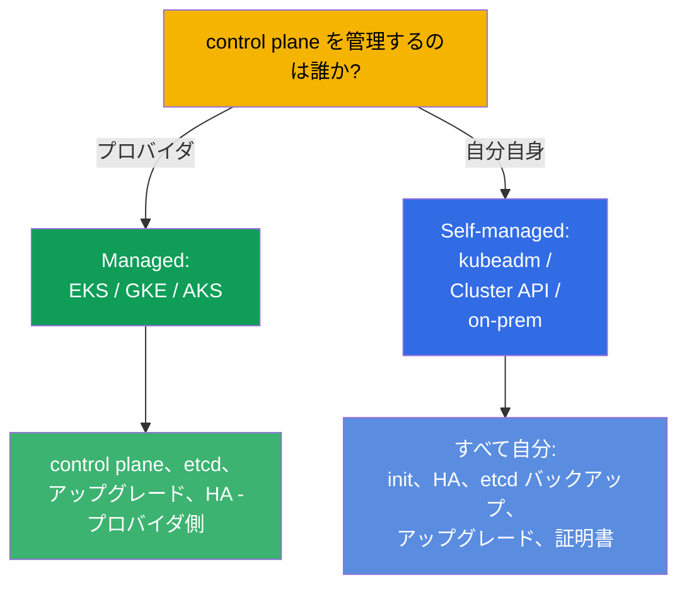
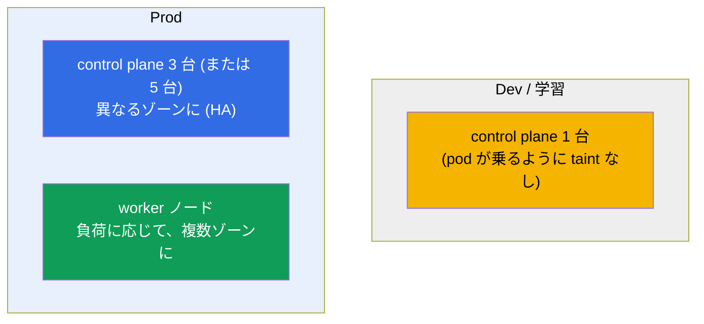
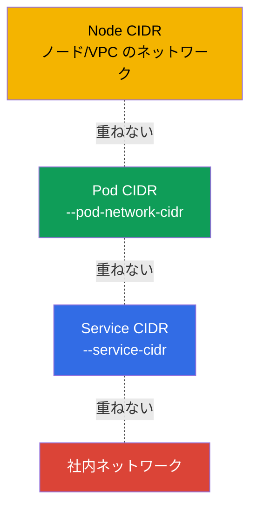
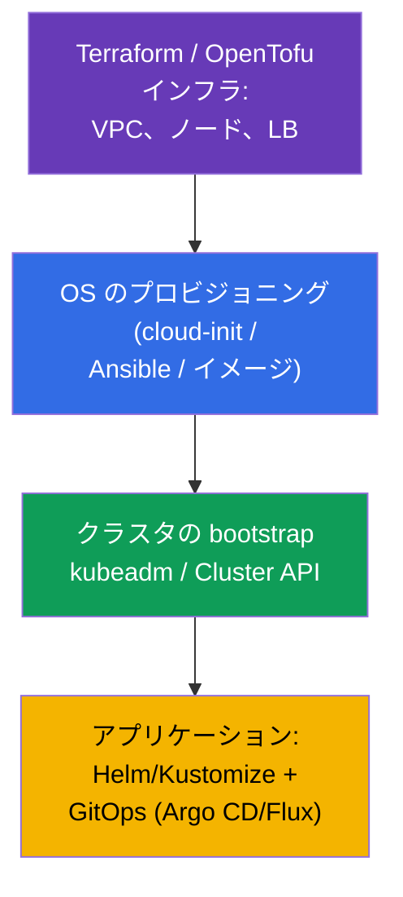

[Русская версия](ru.md) · [Eng version](README.md) · [Versión en español](es.md) · [Version française](fr.md) · [Deutsche Version](de.md) · [ქართული ვერსია](ge.md) · [繁體中文版](tw.md)

# 第 35B 章。クラスタの設計とサイジング：インフラ、トポロジー、IaC

> 🟦 **CKA 向けの章**（領域 Cluster Architecture, Installation & Configuration、25%）。
> CKAD には必要ありません。
>
> **次は何か。** 第 35 章と 35A 章では、クラスタをインストールし、それを耐障害性の
> あるものにする方法を学びました。しかしインストールの前に、クラスタは **設計** して
> おかなければなりません：どこに住むのか (managed か self-managed か)、ノードは
> いくつでどんなものか、アドレス空間をどう計画するか、それらすべてをどうコードで
> 記述するか (IaC)。これは Installation & Configuration 領域の一部であり、
> プラットフォームエンジニアの日常業務です。第 0.1 章（ネットワーク/CIDR）、第 2 章
> （アーキテクチャ）、第 35/35A 章（インストール/HA）を土台にしています。

## 35B.1. Managed か self-managed か：最初の決定

最初の設計上の決定は、誰が control plane を運用するのかということです。

| | **Managed (EKS/GKE/AKS)** | **Self-managed (kubeadm/on-prem)** |
|--|---------------------------|-------------------------------------|
| control plane、etcd | プロバイダが運用 (HA、バックアップ) | あなたの責任（第 35A、37 章） |
| control plane のアップグレード | ボタン/API で | 手動（第 36 章） |
| コントロールとカスタマイズ | 制限あり | 完全 |
| コスト | 管理料を支払う | 自前のハードウェア/運用の手間 |
| いつ使うか | クラウド上の本番負荷の大半 | on-prem、特殊な要件、学習 (CKA) |

ルール：クラウドではデフォルトで **managed** を選びます（運用リスクが小さい）。
self-managed は、完全なコントロールが必要なとき、on-prem、特殊なインストールが
必要なときに選びます。CKA が教えるのはまさに self-managed です - そこではすべてを
自分の手でやるからです。

## 35B.2. トポロジー：control plane と worker ノードをいくつにするか

耐障害性の設計は第 35A 章の繰り返しですが、ここではクラスタ全体を見ます。

- **control plane:** dev は 1 台。prod は **奇数** 台 (3/5) を異なるアベイラビリティ
  ゾーンに（第 35A 章、etcd の quorum）。
- **worker ノード:** 数とサイズは、負荷の requests の合計 + 余裕から決めます。ゾーンの
  障害がすべてのレプリカを持っていかないように、ゾーンに分散させます
  (topologySpread/antiAffinity、第 12 章)。
- **独立したノードプール:** 異なるプロファイル（CPU、memory、GPU ノード。spot か
  on-demand か）ごとに、ラベル/taints を付けた別の node pools を作ります
  （第 6、13 章）。

## 35B.3. ノードのサイジング：少数の大きいノードか、多数の小さいノードか

主要な設計上の選択のひとつが、ノードのサイズです。

| | 少数の **大きい** ノード | 多数の **小さい** ノード |
|--|----------------------|-------------------------|
| 密度/効率 | 高い（OS/kubelet のオーバーヘッドが少ない） | 低い |
| 障害半径 | 大きい（ノードが落ちると多くの pod が影響を受ける） | 小さい |
| ノードあたりの pod 上限 | 約 110 pod/ノードにぶつかる | 分散される |
| 大きな pod | 収まる | 入らないことがある |

実務：極端は避けます。次の点を考慮します：
- **ノードあたり約 110 pod の上限**（デフォルト）- 密度の天井。
- **オーバーヘッド**：OS、kubelet、システムの DaemonSet が各ノードの一部を食べます
  (`Allocatable` < `Capacity`、第 14 章)。
- **障害半径**：大きすぎるノードは危険です - 1 台落ちると多くの負荷に影響します。

## 35B.4. アドレス空間の計画（前もって!）

もっともよくある不可逆な失敗は、練られていない CIDR です。互いに重ならない 3 つの空間
（第 0.1、30 章）：

- **Pod CIDR** は `最大pod数 × ノード数` を成長分の余裕込みで収められる必要があります -
  小さすぎるとスケールしたときに天井にぶつかり、稼働中のクラスタで変更するのは
  きわめて痛みを伴います。
- Node/Pod/Service CIDR は互いに、そして社内ネットワークとも **重なりません**（さもないと
  「pod どうしが見えない」やルートの衝突が起きます）。
- 計画はインストールの **前** に行い、ネットワークチームと合意します - これは設計の一部で
  あり、「あとで直す」ものではありません。

## 35B.5. Infrastructure as Code (IaC)

クラスタは「クリック」で作るものではありません - 再現性と監査のためにコードで記述します。

- **インフラ**（VPC、サブネット、ノード、ロードバランサー）- Terraform/OpenTofu
  （コースのラボもまさにこう作られています）。
- **OS の準備**（swap、モジュール、containerd、kube*）- cloud-init/Ansible/用意した
  イメージ（第 35 章）。ノードを同一にするためです。
- **クラスタの bootstrap** - kubeadm（自動化で包んだもの）または **Cluster API**
  （K8s 自身がクラスタのライフサイクルを宣言的に管理します）。
- **アプリケーション** - Helm/Kustomize（第 42、43 章）を GitOps (Argo CD/Flux) 経由で。
  git が唯一の真実の source になります。

原則：すべてがコードから再現できること。ノード上での手作業の変更はデバッグのときだけで、
そのあとコードに戻します（さもないと「設定のドリフト」が起きます）。

## 35B.6. 本番環境でこれをどう使うか

- **デフォルトは managed、必要に応じて self-managed。** 大半のチームは control plane と
  etcd を運用しなくて済むように EKS/GKE/AKS を選びます。self-managed は on-prem、
  規制対応、edge、特殊なコントロールが必要な場合です。
- **HA とマルチゾーンは本番では必須。** control plane 3 台以上と worker を異なるゾーンに。
  重要な負荷は topologySpread で分散させます。
- **負荷のプロファイルごとの node pools。** 別々のプール (CPU/mem/GPU、spot/on-demand) を
  taints/ラベル付きで用意し、プールのオートスケーリングは Cluster Autoscaler/Karpenter
  （第 16 章）で行います。
- **CIDR は一度きり、余裕をもって計画する。** Pod CIDR の間違いは高くつく作り直しです。
  ネットワークは前もって合意しておきます。
- **すべて IaC + GitOps で。** インフラは Terraform、クラスタは Cluster API/kubeadm、
  アプリケーションは Argo CD/Flux - 再現性、レビュー、ロールバック、監査が得られます。

## 35B.7. ミニ用語集

- **Managed クラスタ** - control plane をプロバイダが運用します (EKS/GKE/AKS)。
- **Self-managed** - control plane を自分でインストールし運用します (kubeadm/on-prem)。
- **Node pool** - 同種のノードのグループ（プロファイル、ゾーン、spot/on-demand）。
- **障害半径 (blast radius)** - 1 つの要素の障害がどれだけの負荷に影響するか。
- **Allocatable** - pod が使えるノードのリソース（Capacity からオーバーヘッドを引いたもの、第 14 章）。
- **約 110 pod/ノードの上限** - デフォルトでのノードあたり pod 数の天井。
- **IaC** - Infrastructure as Code (Terraform/OpenTofu、Ansible)。
- **Cluster API** - クラスタのライフサイクルの宣言的な管理。
- **GitOps** - クラスタの状態にとって git が真実の source であること (Argo CD/Flux)。

## 35B.8. 本章のまとめ

- 最初の決定は managed (EKS/GKE/AKS) か self-managed (kubeadm/on-prem) か：プロバイダ側に
  任せる部分が多いほど運用リスクは小さくなります。CKA は self-managed の話です。
- トポロジー：dev は control plane 1 台。prod は奇数台 (3/5) を異なるゾーンに +
  worker は負荷に応じて。プロファイルごとに別の node pools を用意します。
- ノードのサイジングはバランスです：大きいノードは密度が高いが障害半径も大きい。
  約 110 pod/ノードとオーバーヘッド (Allocatable) を忘れないこと。
- CIDR (Node/Pod/Service) は前もって、余裕をもって、重ならないように計画します - 稼働中の
  クラスタではこれは不可逆です。
- すべてをコードで記述します：Terraform（インフラ）→ cloud-init/Ansible (OS) →
  kubeadm/Cluster API（クラスタ）→ Helm/Kustomize + GitOps（アプリケーション）。

## 35B.9. これがどう役に立つか：試験と実際の仕事で

**試験では (CKA)。** 「クラスタを設計せよ」という直接の問題はありませんが、トポロジー
（control plane をいくつにするか、なぜ奇数か）、サイジング、CIDR の計画の理解は、
インストール（第 35 章）、HA (35A)、ネットワークの troubleshooting に必要です。これは
Installation 領域 (25%) の一部です。

**実際の仕事では。** 設計は運用の成功の半分です：managed / self-managed の選択、トポロジー
とゾーン、プールのサイジング、アドレス空間の計画、IaC/GitOps が、クラスタが信頼できて
再現可能なものになるか、それとも触るのが怖い「スノーフレーク」になるかを決めます。

## 35B.10. 自己チェックの質問

1. managed クラスタは self-managed とどう違い、それぞれどんなときに選びますか？
2. dev と prod で control plane ノードはいくつ必要で、なぜ奇数なのですか？
3. 大きいノードと小さいノードの長所と短所は何ですか？障害半径とは何ですか？
4. なぜ Pod CIDR を前もって、余裕をもって計画することが重要なのですか？
5. クラスタの IaC スタックはどの層からなりますか（インフラ → OS → クラスタ → アプリケーション）？
6. node pool とは何で、なぜノードをプールに分けるのですか？

## 演習

私たちはクラスタを「紙の上で」設計しました。HA の構築はラボ 124 で、ゼロからのインストールは
ラボ 116 で練習します。コースのすべてのラボのインフラは IaC (Terraform/Terragrunt) として
記述されています - `tasks/cka/labs/*/` を覗いてみてください。次は（第 36 章）クラスタの
安全なアップグレードです。

🧪 ラボ 116（インストール）· ラボ 124 (HA)：[tasks/cka/labs/124](../../labs/124/README_JP.MD)

---
[目次](../README_JP.md) · [第 35A 章](../35-2-ha/jp.md) · [第 36 章](../36/jp.md)
