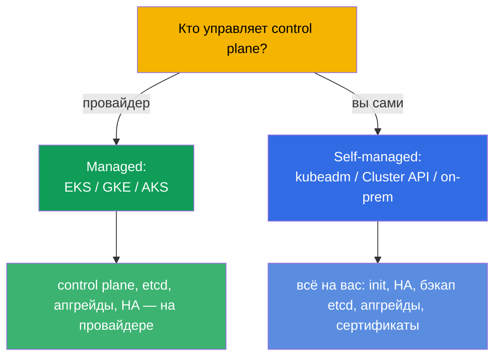
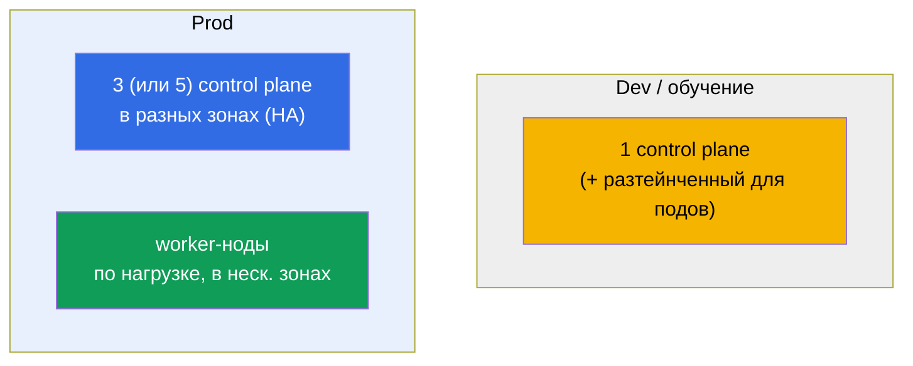
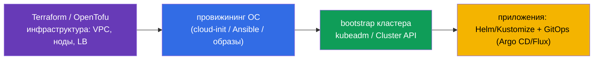

# Глава 35B. Проектирование и сайзинг кластера: инфраструктура, топология, IaC

> 🟦 **Глава для CKA** (домен Cluster Architecture, Installation & Configuration, 25%).
> Для CKAD не требуется.
>
> **Что дальше.** В главах 35 и 35A мы научились ставить кластер и делать его
> отказоустойчивым. Но перед установкой кластер надо **спроектировать**: где он живёт
> (managed или self-managed), сколько и каких нод, как спланировать адресные
> пространства, как всё это описать кодом (IaC). Это часть домена Installation & Configuration
> и повседневная работа платформенного инженера. Опирается на главы 0.1 (сеть/CIDR), 2
> (архитектура), 35/35A (установка/HA).

## 35B.1. Managed или self-managed: первое решение

Первое проектное решение - кто обслуживает control plane.

| | **Managed (EKS/GKE/AKS)** | **Self-managed (kubeadm/on-prem)** |
|--|---------------------------|-------------------------------------|
| Control plane, etcd | обслуживает провайдер (HA, бэкап) | ваша ответственность (главы 35A, 37) |
| Апгрейды control plane | кнопкой/API | вручную (глава 36) |
| Контроль и кастомизация | ограничены | полные |
| Стоимость | плата за управление | своё железо/операционные усилия |
| Когда | большинство прод-нагрузок в облаке | on-prem, специфичные требования, обучение (CKA) |

Правило: в облаке по умолчанию берут **managed** (меньше операционного риска); self-managed
выбирают, когда нужен полный контроль, on-prem или специфичные инсталляции. CKA учит именно
self-managed - потому что там всё делаешь руками.

## 35B.2. Топология: сколько control plane и worker-нод

Дизайн отказоустойчивости повторяет главу 35A, но здесь смотрим на кластер целиком.

- **Control plane:** dev - один; prod - **нечётное** число (3/5) в разных зонах доступности
  (глава 35A, кворум etcd).
- **Worker-ноды:** число и размер - по суммарным requests нагрузок + запас; разносят по
  зонам, чтобы отказ зоны не унёс все реплики (topologySpread/antiAffinity, глава 12).
- **Отдельные пулы нод:** под разные профили (CPU-, memory-, GPU-ноды; спот vs on-demand)
  заводят разные node pools с метками/taints (главы 6, 13).

## 35B.3. Сайзинг нод: мало больших или много маленьких

Один из ключевых проектных выборов - размер ноды.

| | Мало **больших** нод | Много **маленьких** нод |
|--|----------------------|-------------------------|
| Плотность/эффективность | выше (меньше накладных на ОС/kubelet) | ниже |
| Радиус отказа | больше (упала нода - много подов) | меньше |
| Лимит подов на ноду | упираются в ~110 подов/ноду | распределено |
| Крупные поды | помещаются | могут не влезть |

Практика: избегают крайностей. Учитывают:
- **лимит ~110 подов на ноду** (по умолчанию) - потолок плотности;
- **накладные расходы**: ОС, kubelet, системные DaemonSet'ы съедают часть каждой ноды
  (`Allocatable` < `Capacity`, глава 14);
- **радиус отказа**: слишком большие ноды опасны - падение одной затрагивает много нагрузки.

## 35B.4. Планирование адресных пространств (заранее!)

Самая частая необратимая ошибка - непродуманные CIDR. Три непересекающихся пространства
(глава 0.1, 30):

- **Pod CIDR** должен вмещать `max_подов × ноды` с запасом на рост - слишком маленький
  упрётся в потолок при масштабировании, а сменить его на живом кластере крайне больно.
- Node/Pod/Service CIDR **не пересекаются** между собой и с корпоративной сетью (иначе
  «поды не видят друг друга» и конфликты маршрутов).
- Планируют **до** установки и согласуют с сетевой командой - это часть дизайна, а не
  «поправим потом».

## 35B.5. Инфраструктура как код (IaC)

Кластеры не создают «кликами» - их описывают кодом для воспроизводимости и аудита.

- **Инфраструктура** (VPC, подсети, ноды, балансировщик) - Terraform/OpenTofu (именно так
  устроены лабы курса).
- **Подготовка ОС** (swap, модули, containerd, kube*) - cloud-init/Ansible/готовые образы
  (glava 35), чтобы ноды были одинаковыми.
- **Bootstrap кластера** - kubeadm (обёрнутый в автоматизацию) или **Cluster API** (K8s сам
  управляет жизненным циклом кластеров декларативно).
- **Приложения** - Helm/Kustomize (главы 42, 43) через GitOps (Argo CD/Flux): git как
  единственный источник правды.

Принцип: всё воспроизводимо из кода. Ручные изменения на нодах - только для отладки, потом
их возвращают в код (иначе «дрейф конфигурации»).

## 35B.6. Как это применяют в продакшене

- **Managed по умолчанию, self-managed по необходимости.** Большинство команд берут
  EKS/GKE/AKS, чтобы не обслуживать control plane и etcd; self-managed - для on-prem,
  регуляторики, edge и специфичного контроля.
- **HA и мультизональность - обязательны для прода.** 3+ control plane и worker'ы в разных
  зонах; критичные нагрузки разносят topologySpread'ом.
- **Node pools под профили нагрузок.** Отдельные пулы (CPU/mem/GPU, spot/on-demand) с
  taints/метками; автоскейлинг пулов Cluster Autoscaler/Karpenter (глава 16).
- **CIDR планируют один раз и с запасом.** Ошибка в Pod CIDR - дорогая переделка; сети
  согласуют заранее.
- **Всё через IaC + GitOps.** Terraform для инфраструктуры, Cluster API/kubeadm для
  кластеров, Argo CD/Flux для приложений - воспроизводимость, ревью, откат, аудит.

## 35B.7. Мини-глоссарий

- **Managed кластер** - control plane обслуживает провайдер (EKS/GKE/AKS).
- **Self-managed** - control plane ставите и обслуживаете вы (kubeadm/on-prem).
- **Node pool** - группа однотипных нод (профиль, зона, spot/on-demand).
- **Радиус отказа (blast radius)** - сколько нагрузки затрагивает отказ одного элемента.
- **Allocatable** - ресурсы ноды, доступные подам (Capacity минус накладные, глава 14).
- **лимит ~110 подов/ноду** - потолок числа подов на ноду по умолчанию.
- **IaC** - инфраструктура как код (Terraform/OpenTofu, Ansible).
- **Cluster API** - декларативное управление жизненным циклом кластеров.
- **GitOps** - git как источник правды для состояния кластера (Argo CD/Flux).

## 35B.8. Итоги главы

- Первое решение - managed (EKS/GKE/AKS) или self-managed (kubeadm/on-prem): чем больше
  на провайдере, тем меньше операционного риска; CKA - про self-managed.
- Топология: dev - один control plane; prod - нечётное число (3/5) в разных зонах +
  worker'ы по нагрузке; отдельные node pools под профили.
- Сайзинг нод - баланс: большие ноды плотнее, но больше радиус отказа; помнить про ~110
  подов/ноду и накладные расходы (Allocatable).
- CIDR (Node/Pod/Service) планируют заранее, с запасом и без пересечений - это необратимо
  на живом кластере.
- Всё описывают кодом: Terraform (инфра) → cloud-init/Ansible (ОС) → kubeadm/Cluster API
  (кластер) → Helm/Kustomize + GitOps (приложения).

## 35B.9. Как это пригодится: на экзамене и в реальной работе

**На экзамене (CKA).** Прямых заданий «спроектируй кластер» нет, но понимание топологии
(сколько control plane, зачем нечётное число), сайзинга и планирования CIDR нужно для
установки (глава 35), HA (35A) и troubleshooting сети. Это часть домена Installation (25%).

**В реальной работе.** Проектирование - половина успеха эксплуатации: выбор managed/
self-managed, топология и зоны, сайзинг пулов, планирование адресных пространств и IaC/
GitOps определяют, будет ли кластер надёжным и воспроизводимым или «снежинкой», которую
страшно трогать.

## 35B.10. Вопросы для самопроверки

1. Чем managed-кластер отличается от self-managed и когда выбирают каждый?
2. Сколько control plane нод нужно для dev и для prod и почему нечётное?
3. Каковы плюсы и минусы больших нод против маленьких? Что такое радиус отказа?
4. Почему важно планировать Pod CIDR заранее и с запасом?
5. Из каких слоёв состоит IaC-стек кластера (инфра → ОС → кластер → приложения)?
6. Что такое node pool и зачем разделять ноды на пулы?

## Практика

Мы спроектировали кластер «на бумаге». Сборку HA отрабатывает лаба 124, установку с нуля -
лаба 116; инфраструктура всех лаб курса описана как IaC (Terraform/Terragrunt) - можно
заглянуть в `tasks/cka/labs/*/`. Дальше (глава 36) - безопасное обновление кластера.

🧪 Лаба 116 (установка) · Лаба 124 (HA): [tasks/cka/labs/124](../../labs/124/README_RU.MD)

---
[Оглавление](../README_RU.md) · [Глава 35A](../35-2-ha/ru.md) · [Глава 36](../36/ru.md)
