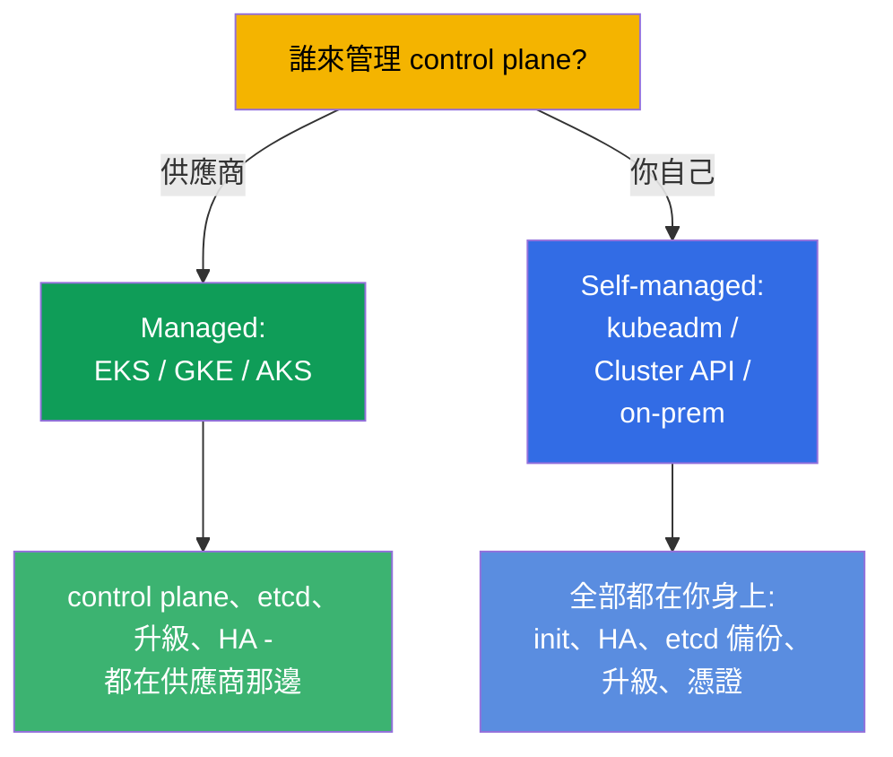
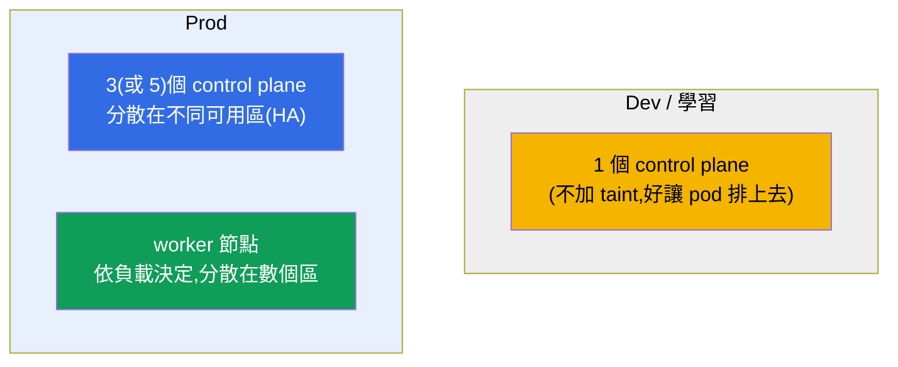
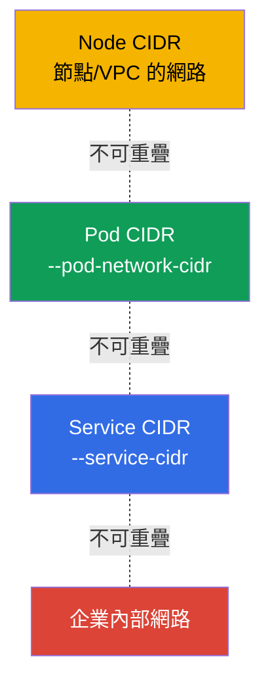
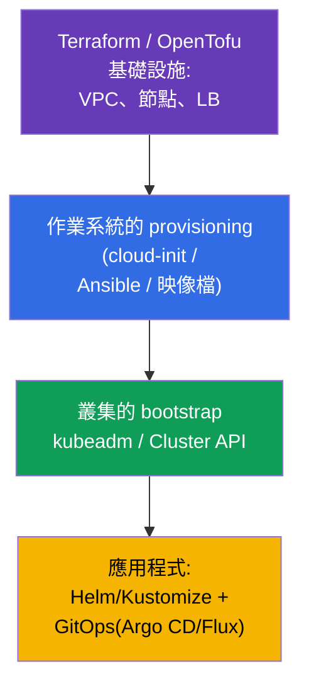

[Русская версия](ru.md) · [Eng version](README.md) · [Versión en español](es.md) · [Version française](fr.md) · [Deutsche Version](de.md) · [ქართული ვერსია](ge.md) · [日本語版](jp.md)

# 第 35B 章。叢集的設計與容量規劃:基礎設施、拓撲、IaC

> 🟦 **CKA 章節**(領域 Cluster Architecture, Installation & Configuration,25%)。
> CKAD 不需要。
>
> **接下來是什麼。** 在第 35 與 35A 章我們學會了安裝叢集並讓它具備容錯能力。
> 但在安裝之前,叢集必須先**設計**好:它住在哪裡(managed 或 self-managed)、
> 需要多少、什麼樣的節點、位址空間怎麼規劃、這一切怎麼用程式碼描述(IaC)。
> 這屬於 Installation & Configuration 領域,也是平台工程師的日常工作。本章依賴
> 第 0.1 章(網路/CIDR)、第 2 章(架構)、第 35/35A 章(安裝/HA)。

## 35B.1. Managed 還是 self-managed:第一個決策

第一個設計決策 - 誰來維運 control plane。

| | **Managed(EKS/GKE/AKS)** | **Self-managed(kubeadm/on-prem)** |
|--|---------------------------|-------------------------------------|
| control plane、etcd | 由供應商維運(HA、備份) | 你的責任(第 35A、37 章) |
| control plane 升級 | 按個按鈕/呼叫 API | 手動(第 36 章) |
| 控制權與客製化 | 受限 | 完整 |
| 成本 | 支付管理費用 | 自己的硬體/維運投入 |
| 什麼時候 | 雲端上大部分的生產負載 | on-prem、特殊需求、學習(CKA) |

規則:在雲端預設選 **managed**(維運風險較小);需要完整控制權、on-prem 或
特殊安裝方式時才選 self-managed。CKA 教的正是 self-managed - 因為那裡的一切
都要親手做。

## 35B.2. 拓撲:多少 control plane 與 worker 節點

容錯設計和第 35A 章一樣,但這裡我們看的是整個叢集。

- **control plane:** dev 一個;prod 用**奇數**個(3/5),放在不同可用區
  (第 35A 章,etcd 的 quorum)。
- **worker 節點:** 數量與大小 - 依負載的 requests 總和再加餘裕;分散到不同區,
  讓單一區故障不會帶走所有副本(topologySpread/antiAffinity,第 12 章)。
- **獨立的節點池:** 針對不同的設定檔(CPU、memory、GPU 節點;spot vs on-demand)
  建立不同的 node pools,加上標籤/taints(第 6、13 章)。

## 35B.3. 節點規模:少量大節點還是大量小節點

關鍵的設計選擇之一 - 節點的大小。

| | 少量**大**節點 | 大量**小**節點 |
|--|----------------------|-------------------------|
| 密度/效率 | 較高(作業系統/kubelet 的開銷較少) | 較低 |
| 故障半徑 | 較大(一個節點掛掉 - 很多 pod 受影響) | 較小 |
| 每節點 pod 上限 | 會撞到約 110 個 pod/節點 | 分散開來 |
| 大型 pod | 放得進去 | 可能塞不下 |

實務:避開兩個極端。要考慮:
- **每節點約 110 個 pod 的上限**(預設值)- 密度的天花板;
- **額外開銷**:作業系統、kubelet、系統 DaemonSet 會吃掉每個節點的一部分
  (`Allocatable` < `Capacity`,第 14 章);
- **故障半徑**:節點太大很危險 - 掛掉一個就影響很多負載。

## 35B.4. 位址空間的規劃(要提前做!)

最常見且不可逆的錯誤 - CIDR 沒想清楚。三個互不重疊的空間
(第 0.1、30 章):

- **Pod CIDR** 必須能容納 `max_pod 數 × 節點數` 並留下成長的餘裕 - 太小的話
  擴容時就會撞到天花板,而在運行中的叢集上更換它極其痛苦。
- Node/Pod/Service CIDR 彼此之間、以及和企業網路之間都**不可重疊**(否則會出現
  「pod 之間看不到彼此」以及路由衝突)。
- 要在安裝**之前**規劃好並與網路團隊確認 - 這是設計的一部分,不是
  「以後再修」。

## 35B.5. 基礎設施即程式碼(IaC)

叢集不是「點滑鼠」點出來的 - 要用程式碼描述,以取得可重現性與可稽核性。

- **基礎設施**(VPC、子網路、節點、負載平衡器)- Terraform/OpenTofu(本課程的
  實驗室作業就是這樣搭起來的)。
- **作業系統準備**(swap、模組、containerd、kube*)- cloud-init/Ansible/預先做好的
  映像檔(第 35 章),讓所有節點都一致。
- **叢集 bootstrap** - kubeadm(包在自動化裡)或 **Cluster API**(K8s 自己以宣告式
  管理叢集的生命週期)。
- **應用程式** - Helm/Kustomize(第 42、43 章)搭配 GitOps(Argo CD/Flux):git 作為
  唯一的真實來源。

原則:一切都能從程式碼重現。節點上的手動修改 - 只用於除錯,之後要把它們
放回程式碼(否則就是「設定漂移」)。

## 35B.6. 生產環境怎麼用

- **預設 managed,必要時才 self-managed。** 大部分團隊會選 EKS/GKE/AKS,
  避免自己維運 control plane 與 etcd;self-managed 則用於 on-prem、
  法規要求、edge 與需要特殊控制的場景。
- **HA 與多可用區 - 生產環境的必要條件。** 3 個以上 control plane,worker 分散在
  不同區;關鍵負載用 topologySpread 打散。
- **依負載設定檔劃分 node pools。** 獨立的池(CPU/mem/GPU、spot/on-demand)配上
  taints/標籤;用 Cluster Autoscaler/Karpenter 做池的自動擴縮(第 16 章)。
- **CIDR 只規劃一次,而且要留餘裕。** Pod CIDR 弄錯 - 重做的代價很高;網段要
  提前談好。
- **一切都走 IaC + GitOps。** Terraform 管基礎設施,Cluster API/kubeadm 管叢集,
  Argo CD/Flux 管應用程式 - 可重現、可審閱、可回滾、可稽核。

## 35B.7. 迷你詞彙表

- **Managed 叢集** - control plane 由供應商維運(EKS/GKE/AKS)。
- **Self-managed** - control plane 由你自己安裝與維運(kubeadm/on-prem)。
- **Node pool** - 一組同型的節點(設定檔、可用區、spot/on-demand)。
- **故障半徑(blast radius)** - 單一元件故障會影響多少負載。
- **Allocatable** - 節點上可以給 pod 使用的資源(Capacity 減去開銷,第 14 章)。
- **每節點約 110 個 pod 的上限** - 預設每個節點上 pod 數量的天花板。
- **IaC** - 基礎設施即程式碼(Terraform/OpenTofu、Ansible)。
- **Cluster API** - 以宣告式管理叢集的生命週期。
- **GitOps** - 用 git 作為叢集狀態的真實來源(Argo CD/Flux)。

## 35B.8. 本章總結

- 第一個決策 - managed(EKS/GKE/AKS)還是 self-managed(kubeadm/on-prem):
  丟給供應商的越多,維運風險就越小;CKA 講的是 self-managed。
- 拓撲:dev 一個 control plane;prod 用奇數個(3/5)分散在不同區,worker 依負載
  決定;針對不同設定檔建立獨立的 node pools。
- 節點規模是取捨:大節點密度高,但故障半徑也大;要記得每節點約 110 個 pod
  的限制與額外開銷(Allocatable)。
- CIDR(Node/Pod/Service)要提前規劃、留餘裕、不重疊 - 在運行中的叢集上這是
  不可逆的。
- 一切都用程式碼描述:Terraform(基礎設施)→ cloud-init/Ansible(作業系統)→
  kubeadm/Cluster API(叢集)→ Helm/Kustomize + GitOps(應用程式)。

## 35B.9. 這些在哪裡用得上:考試與實際工作

**考試上(CKA)。** 不會有「請設計一個叢集」這種直接題目,但理解拓撲
(要幾個 control plane、為什麼是奇數)、規模估算與 CIDR 規劃,對安裝
(第 35 章)、HA(35A)與網路 troubleshooting 都是必要的。這屬於 Installation
領域(25%)。

**實際工作中。** 設計是維運成功的一半:managed/self-managed 的選擇、拓撲與
可用區、節點池的規模、位址空間的規劃以及 IaC/GitOps,決定了叢集會是可靠且
可重現的,還是一片沒人敢碰的「雪花」。

## 35B.10. 自我檢查問題

1. managed 叢集和 self-managed 有什麼不同,各在什麼時候選?
2. dev 與 prod 分別需要幾個 control plane 節點,為什麼要奇數?
3. 大節點對小節點各有什麼優缺點?什麼是故障半徑?
4. 為什麼 Pod CIDR 要提前規劃並且留餘裕?
5. 叢集的 IaC 堆疊由哪些層組成(基礎設施 → 作業系統 → 叢集 → 應用程式)?
6. 什麼是 node pool,為什麼要把節點分成不同的池?

## 實踐

我們在「紙上」設計完了叢集。HA 的組建由實驗 124 演練,從零安裝由實驗 116 演練;
本課程所有實驗的基礎設施都以 IaC 描述(Terraform/Terragrunt)- 可以到
`tasks/cka/labs/*/` 裡看看。接下來(第 36 章)是叢集的安全升級。

🧪 實驗 116(安裝)· 實驗 124(HA):[tasks/cka/labs/124](../../labs/124/README_TW.MD)

---
[目錄](../README_TW.md) · [第 35A 章](../35-2-ha/tw.md) · [第 36 章](../36/tw.md)
