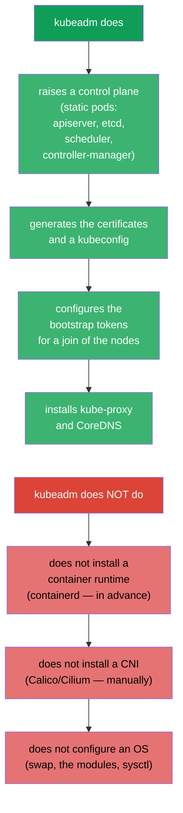
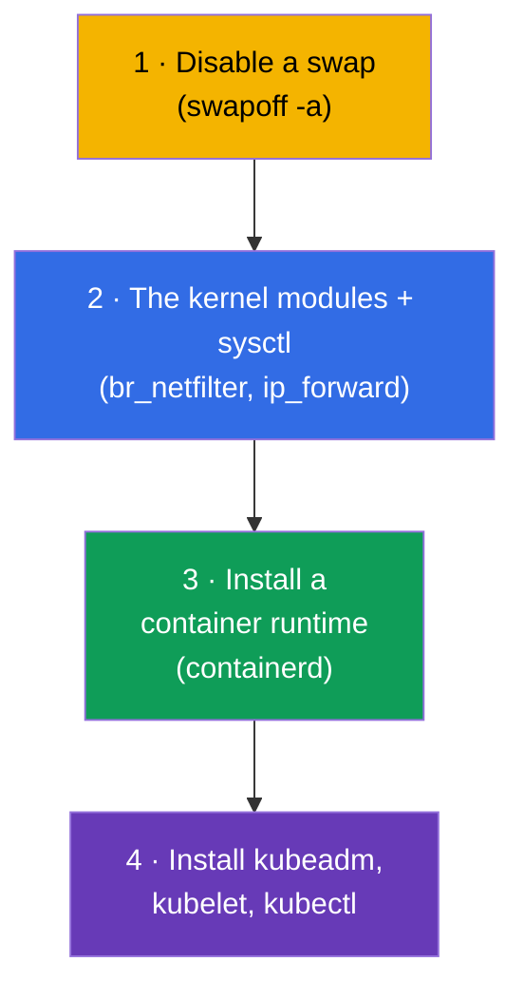
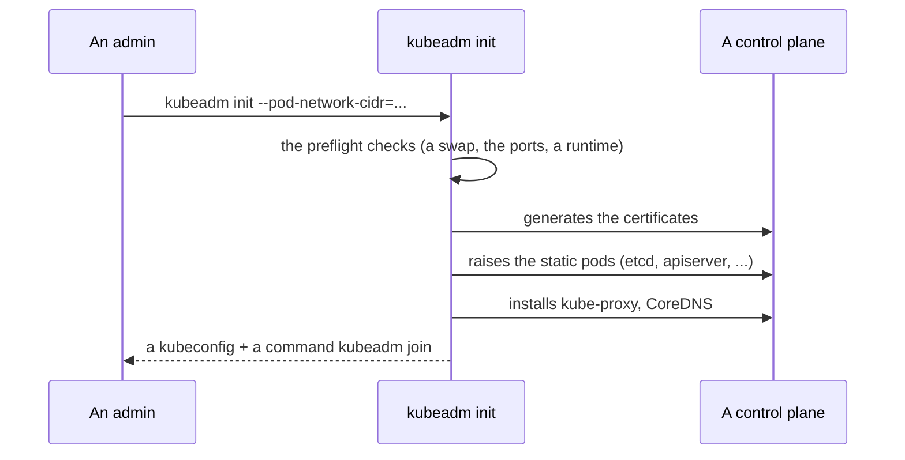
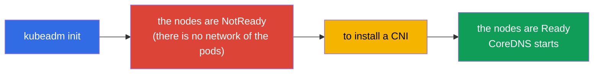
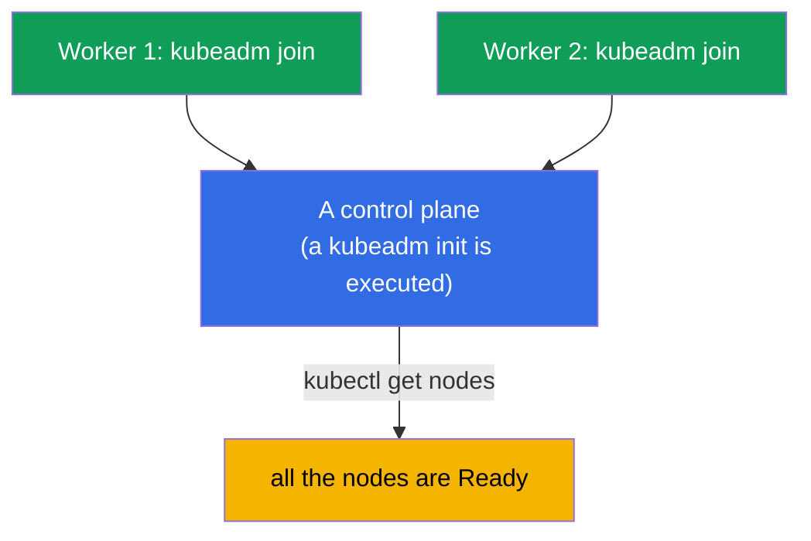
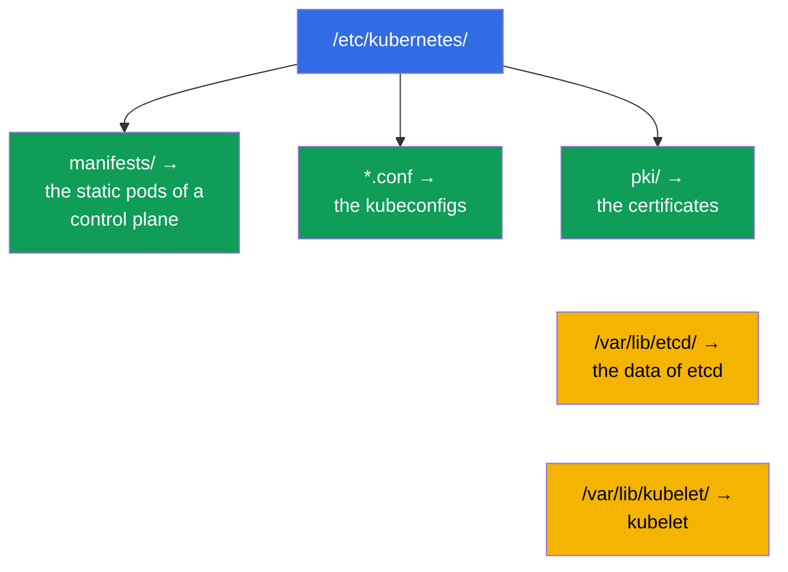
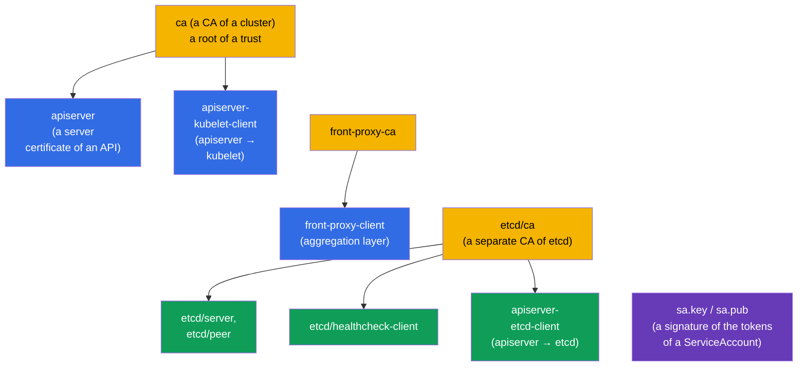
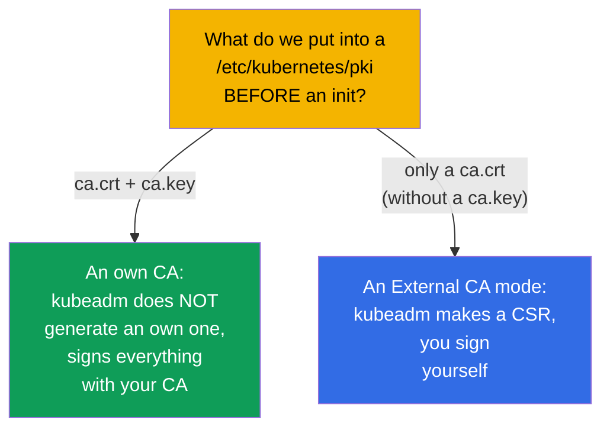

[Русская версия](ru.md) · [Versión en español](es.md) · [Version française](fr.md) · [Deutsche Version](de.md) · [ქართული ვერსია](ge.md)

# Chapter 35. An installation of a cluster with a help of kubeadm

> 🟦 **A chapter for the CKA** (a domain Cluster Architecture, Installation & Configuration, 25%).
> For the CKAD it is not required, but it is useful for an understanding.
>
> **What comes next.** We are beginning an administrator part. We have worked a lot in a ready cluster;
> now we will assemble it ourselves with a help of **kubeadm** - an official tool of an installation. This is
> a direct task of the CKA ("install a cluster", "add a node") and a foundation for the upgrades (the chapter
> 36), a backup of etcd (the chapter 37) and a troubleshooting of a control plane (the chapter 45). Everything, that we
> considered in the chapter 2 about the components, comes alive here by the hands.

## 35.1. What kubeadm does (and what it does not do)

**kubeadm** - a tool, which raises a control plane and joins the nodes by the "best
practices". It is important to understand the borders of its responsibility.



Remember the three things, which kubeadm does **not** do - they are prepared separately: a container runtime,
a CNI and a configuration of an OS. To forget about a CNI - a reason, because of which after a `kubeadm init` the nodes stay
`NotReady` (the chapter 30).

## 35.2. A preparation of the nodes (before kubeadm)

Before calling kubeadm, every node is prepared:



```bash
# 1. Disable a swap (Kubernetes requires it)
sudo swapoff -a
# and remove it from /etc/fstab, so that it does not return after a reboot

# 2. The modules and the parameters of a network
sudo modprobe br_netfilter
echo 'net.ipv4.ip_forward = 1' | sudo tee /etc/sysctl.d/k8s.conf
sudo sysctl --system

# 3. a container runtime — containerd (an installation through the packages)
# 4. a repository of Kubernetes and the packages
sudo apt-get install -y kubelet kubeadm kubectl
sudo apt-mark hold kubelet kubeadm kubectl    # to fix the versions
```

> **About a swap.** Kubernetes historically requires a disabled swap (kubelet by default does not
> start at an enabled swap). This is a first point of a preparation and a frequent reason, why
> a `kubeadm init` falls.

A full and an actual list of the requirements and the steps of a preparation of a node - in the official documentation:
[Installing kubeadm](https://kubernetes.io/docs/setup/production-environment/tools/kubeadm/install-kubeadm/)
(a swap, the kernel modules and sysctl, a container runtime, a repository and the packages kubeadm/kubelet/kubectl).

## 35.3. An initialization of a control plane: kubeadm init

On a future control plane node:

```bash
sudo kubeadm init \
  --pod-network-cidr=10.244.0.0/16 \        # a range of the pods (to coordinate with a CNI!)
  --control-plane-endpoint=<an address>     # a stable address of an API (for a HA)
```

> **Which address in a `--control-plane-endpoint`?** This is a **stable point of an entrance to an
> API server**, common for all the nodes and getting into the certificates. To indicate here an IP of a
> concrete node - a bad idea: if this is a single control plane, you will not be able already
> without a recreation to pass to several control plane. It is correct to indicate:
>
> - a **DNS name** (for example, `k8s-api.example.com`), which you control, - a most
>   flexible variant: later a balancer can be put behind it, without touching a cluster;
> - an **address of a balancer** (VIP/LB) in front of the control plane nodes - for a real HA
>   (several API servers behind one address).
>
> A port can be added: `--control-plane-endpoint=k8s-api.example.com:6443`. A flag
> is **not obligatory** for a one-node control plane, but to set it (through a DNS) at once -
> a good practice: it leaves a path to a HA open. Without a flag an address of a current node
> becomes an endpoint, and it will not turn out to "grow" into a HA later. The details -
> [Creating a cluster with kubeadm](https://kubernetes.io/docs/setup/production-environment/tools/kubeadm/create-cluster-kubeadm/)
> and [HA topology](https://kubernetes.io/docs/setup/production-environment/tools/kubeadm/high-availability/).



After a successful init kubeadm prints two important things:

1. the commands to configure a `kubectl` (to copy an admin.conf):
```bash
mkdir -p $HOME/.kube
sudo cp -i /etc/kubernetes/admin.conf $HOME/.kube/config
sudo chown $(id -u):$(id -g) $HOME/.kube/config
```
2. a command `kubeadm join ...` with a token - it is executed on the worker nodes.

### The certificates of a cluster: the terms, a renewal, an own CA

A `kubeadm init` itself generates all the PKI of a cluster in a `/etc/kubernetes/pki`. It is important to understand
the terms of a life, otherwise **on a prod a downtime can be caught**: when the certificates of an apiserver and of the
components expire, a control plane stops working, and a `kubectl` begins to answer
with the TLS errors.

The terms by default:

- the **leaf certificates** (apiserver, apiserver-kubelet-client, the client ones in an
  `admin.conf`/`controller-manager.conf`/`scheduler.conf` and so on) - **1 year**;
- the **certificates of a CA** (`ca`, `etcd-ca`, `front-proxy-ca`) - **10 years**;
- a client certificate of kubelet (`/var/lib/kubelet/pki`) **is rotated automatically** -
  it is not in the list below.

To check the terms:

```bash
kubeadm certs check-expiration     # a table EXPIRES / RESIDUAL TIME by all the certificates
```

A renewal:

- **automatically at an upgrade** of a control plane: a `kubeadm upgrade apply/node` renews
  all the certificates. If a cluster is updated regularly (more often than once a year), about an expiration one can
  not think;
- **manually** at any moment: a `kubeadm certs renew all` (to execute on **every** control
  plane node, then to restart the static pods of a control plane - for example, temporarily to remove and
  to return their manifests into a `/etc/kubernetes/manifests/`). After a renewal of an `admin.conf`
  do not forget to update a `~/.kube/config`.

The own and the external certificates (in order to set the terms and an own CA in advance):

- an **own CA**: put a `ca.crt` and a `ca.key` into a `/etc/kubernetes/pki` **before** a `kubeadm init` -
  kubeadm will not overwrite them and will sign the rest with your CA;
- the **custom terms** through a config of kubeadm (to pass a `kubeadm init --config`):

  ```yaml
  apiVersion: kubeadm.k8s.io/v1beta4
  kind: ClusterConfiguration
  certificateValidityPeriod: 8760h      # the leaf ones: by default 1 year
  caCertificateValidityPeriod: 87600h   # a CA: by default 10 years
  ```

  (the values - in a format of the Go durations, a largest unit - `h`);
- an **external CA** (an external CA mode): put only a `ca.crt` without a `ca.key` - kubeadm
  will recognize this and will not keep a key of a CA on a disk, and an issue/a renewal of the certificates you
  take on yourself (an own signer). At this a `kubeadm certs renew` **does not manage** such certificates
  already.

The details and the scenarios - in the documentation:
[Certificate Management with kubeadm](https://kubernetes.io/docs/tasks/administer-cluster/kubeadm/kubeadm-certs/).

> **A conclusion for a prod.** Either regularly upgrade a cluster (the certificates are renewed themselves),
> or monitor a `check-expiration` and renew in advance. "A cluster has all broken exactly
> a year after an installation" - a classics of the expired certificates of kubeadm.

## 35.4. An installation of a CNI (an obligatory step)

Right after an init the nodes are `NotReady` - there is no network of the pods. We install a CNI (the chapter 30):

```bash
# an example: Calico
kubectl apply -f https://raw.githubusercontent.com/projectcalico/calico/<a version>/manifests/calico.yaml
```



Only after an installation of a CNI the nodes become `Ready`, and the system pods (CoreDNS)
start. A `--pod-network-cidr` in an init has to coincide with that, what a CNI expects - otherwise
a network will not work.

## 35.5. A joining of the worker nodes: kubeadm join

On every worker node (prepared by a step 35.2) they execute a `kubeadm join`, which
an init has printed out:

```bash
sudo kubeadm join <control-plane>:6443 \
  --token <a token> \
  --discovery-token-ca-cert-hash sha256:<a hash>
```



If a token is lost or has expired (it lives 24 hours), a new one is created on a control plane:

```bash
kubeadm token create --print-join-command    # will print out a ready command join
```

A check of a result:

```bash
kubectl get nodes                             # all the nodes have to be Ready
kubectl get pods -n kube-system               # the components and CoreDNS are Running
```

## 35.6. What lies where after an installation

kubeadm lays out the files predictably - this needs to be known for a troubleshooting (the chapters 37,
45):

| A path | What is there |
|------|---------|
| `/etc/kubernetes/manifests/` | the static pods of a control plane (apiserver, etcd, scheduler, cm) |
| `/etc/kubernetes/*.conf` | the kubeconfigs (admin, kubelet, controller-manager, scheduler) |
| `/etc/kubernetes/pki/` | the certificates and the keys (incl. a CA, etcd) |
| `/var/lib/etcd/` | the data of etcd |
| `/var/lib/kubelet/` | a config and the data of kubelet |



## 35.7. Which certificates a kubeadm init creates

At a `kubeadm init` all the **PKI of a cluster** is generated automatically in a
`/etc/kubernetes/pki/`. This is that, on what all the trust stands (the chapters 0.3, 39). It is useful to know,
what exactly is created.



The key files in a `/etc/kubernetes/pki/`:

| A file | What this is |
|------|---------|
| `ca.crt` / `ca.key` | a **CA of a cluster** - signs an apiserver and the client certificates |
| `apiserver.crt/.key` | a server certificate of a kube-apiserver (SAN: a ClusterIP, the names, an endpoint) |
| `apiserver-kubelet-client.*` | a client certificate of an apiserver for an addressing to kubelet |
| `front-proxy-ca.*` / `front-proxy-client.*` | a CA and a client for an aggregation layer (the extensions of an API) |
| `etcd/ca.*` | a **separate CA for etcd** |
| `etcd/server.*`, `etcd/peer.*` | a server and a peer certificates of etcd |
| `etcd/healthcheck-client.*`, `apiserver-etcd-client.*` | the clients to etcd (the checks, an apiserver) |
| `sa.key` / `sa.pub` | a pair of the keys for a **signature of the tokens of a ServiceAccount** (not a certificate) |

Plus kubeadm creates the **kubeconfigs**, signed by a CA (in a `/etc/kubernetes/`):
`admin.conf`, `super-admin.conf`, `kubelet.conf`, `controller-manager.conf`,
`scheduler.conf`.

### The terms of a validity

| What | A term by default |
|-----|-------------------|
| a **CA** (of a cluster, of etcd, front-proxy) | **10 years** |
| The leaf certificates (apiserver, kubelet-client, etcd/* and so on) | **1 year** |
| The client certificates in a kubeconfig (admin and the others) | 1 year |

That is the root CA live long (10 years), and everything, what is signed by them, - **1 year** and requires
a renewal. A check and a renewal - a `kubeadm certs check-expiration` / a `kubeadm certs renew`
(the chapter 39); an upgrade of a cluster (the chapter 36) renews the certificates of a control plane automatically.

### Best practices

- **Update a cluster at least once a year** - an upgrade renews the leaf certificates of a
  control plane automatically, and they do not manage to expire.
- **Monitor the terms** (a `kubeadm certs check-expiration`) with an alert for N days - an expired
  certificate of a control plane drops a cluster (`x509: certificate has expired`).
- **Back up a `/etc/kubernetes/pki`** (especially the keys of a CA) together with etcd - without a CA a cluster can
  not be restored.
- **Take care of a `ca.key`**: an owner of a key of a CA can issue any identity, including
  an admin. An access is strictly limited.
- **The kubelet certificates - on an automatic rotation** (`rotateCertificates: true`,
  `serverTLSBootstrap`), in order not to renew manually.

## 35.8. An own PKI: to slip an own CA or an external signer

kubeadm can be forced to use **your** CA instead of a generation of an own one - for
a single root of a trust in an organization. The ways:



- **An own CA (a key + a certificate).** Put a `ca.crt` **and** a `ca.key` (if necessary also
  an `etcd/ca.*`, a `front-proxy-ca.*`, a `sa.key/sa.pub`) into a `/etc/kubernetes/pki/` **before**
  a `kubeadm init`. kubeadm will see a ready CA and will sign with it the rest of the certificates, without
  creating an own one. So all the cluster is built on your root of a trust.
- **An External CA mode (without a private key of a CA on a node).** Put only a **`ca.crt`**
  (a public one) without a `ca.key`. kubeadm will pass into a mode of an external CA: it will generate a **CSR** and
  will wait, that you sign them with your external CA and put the ready certificates. A plus -
  a private key of a CA is not stored on a node; a minus - **kubeadm itself will not be able to renew
  the certificates**, this is your task.
- **A fine tuning through a kubeadm config.** In a `ClusterConfiguration` they set:
  a `certificatesDir` (an own catalog of a PKI), an `apiServer.certSANs` (the additional names/addresses in a
  certificate of an apiserver - for example, a DNS of a balancer for a HA, the chapter 35A), and also
  an `etcd.external` with the paths to your certificates, if etcd is external.

```bash
# an example: an initialization with the custom SAN and with an own CA (lies in a pki/ in advance)
sudo kubeadm init --config kubeadm-config.yaml
# in a kubeadm-config.yaml:
#   apiServer:
#     certSANs: ["api.example.com", "10.0.0.100"]
```

> **On an exam** an own PKI is built rarely, but an understanding, that a CA can be put in advance and
> that an external-CA mode exists, - a frequent question and a real prod task (a single corporate
> root of a trust, a storage of a key of a CA in a HSM/Vault, and not on a node).

## 35.9. How this is applied in a production

- **kubeadm - for the self-managed clusters.** In a cloud more often the managed clusters are taken
  (EKS/GKE/AKS), where a control plane is installed and serviced by a provider. kubeadm is chosen for
  an on-prem, the private and the specific installations, where a full control is needed.
- **An automation on top of kubeadm.** Manually kubeadm is launched rarely - it is wrapped into
  an Ansible/Terraform/the images, and for a fleet of the clusters a Cluster API is used (kubeadm is inside).
  A manual init/join - mainly a learning, the labs and an analysis of the problems.
- **A HA control plane.** On a prod they raise several control plane nodes
  (a `--control-plane-endpoint` + a balancer) and an odd number of the etcd nodes - one control
  plane is admissible only in a dev. In a detail - in the chapter 35A.
- **The versions and a preparation of an OS are automated.** A disabling of a swap, the modules, sysctl, an installation
  of containerd and a fixation of the versions of kube* are made by a template of an image/a provisioning, so that the nodes
  would be identical and reproducible.
- **A knowledge of a layout of the files - a base of an operation.** The paths `/etc/kubernetes/...`,
  `/var/lib/etcd` are needed for a backup of etcd, an update of the certificates and a repair of a control plane -
  this is a daily reality of the CKA skills in the self-managed clusters.

## 35.10. A mini glossary

- **kubeadm** - an official tool of an installation of a cluster (init/join/upgrade).
- **kubeadm init** - an initialization of a control plane.
- **kubeadm join** - a joining of a node to a cluster.
- **a bootstrap token** - a temporary token for a join of the nodes (it lives ~24 hours).
- **--pod-network-cidr** - a range of the addresses of the pods (it is coordinated with a CNI).
- **--control-plane-endpoint** - a common address of a control plane (for a HA).
- **swapoff** - a disabling of a swap (a requirement of Kubernetes).
- **admin.conf** - a kubeconfig of an administrator after an init.
- **a PKI of a cluster** - a set of the CA and the certificates in a `/etc/kubernetes/pki/`, it is created at an init.
- **a CA of a cluster / an etcd CA / a front-proxy CA** - the three roots of a trust (a term ~10 years).
- **An External CA mode** - only a `ca.crt` without a key: kubeadm makes a CSR, a signature - on you.
- **certSANs** - the additional names/addresses in a certificate of an apiserver (e.g. a DNS of a balancer).
- **sa.key / sa.pub** - the keys of a signature of the tokens of a ServiceAccount.

## 35.11. The results of a chapter

- kubeadm raises a control plane (the static pods, the certificates, the tokens, kube-proxy, CoreDNS),
  but it does not install a container runtime, a CNI and does not configure an OS - this is done separately.
- A preparation of the nodes: to disable a swap, to enable the modules/sysctl, to install containerd and
  kubeadm/kubelet/kubectl (with a fixation of the versions).
- A `kubeadm init --pod-network-cidr=...` initializes a control plane and prints out a configuration of a
  kubectl and a command `kubeadm join`.
- Right after an init a CNI needs to be installed - otherwise the nodes are NotReady and CoreDNS does not start.
- The worker nodes are joined by a `kubeadm join` with a token; an expired token is recreated by a
  `kubeadm token create --print-join-command`.
- The files are predictable: the static pods in a `/etc/kubernetes/manifests/`, the certificates in a `pki/`,
  the data of etcd in a `/var/lib/etcd/` - this is a base for a backup and a troubleshooting.
- A kubeadm init generates a PKI of a cluster: the CA (of a cluster, of etcd, front-proxy) for ~10 years and the
  leaf certificates for 1 year; a renewal - an upgrade or a `kubeadm certs renew` (the chapter 39).
- An own CA can be used: to put a `ca.crt`+`ca.key` into a `pki/` before an init (or only a
  `ca.crt` for an external-CA mode, where a signature of a CSR - on you).

## 35.12. How this will come in handy: on an exam and in a real work

**On an exam (CKA).** "Install a cluster kubeadm", "add a worker node", "why are the nodes
NotReady" - the direct tasks of a domain Installation (25%). One needs to know the steps of a preparation (a swap!),
a sequence init → kubectl → CNI → join and a layout of the files. This is a foundation for the chapters
36-37 and 45.

**In a real work.** kubeadm - a base of the self-managed and the on-prem clusters. Even when it is
wrapped into an automation (Ansible, Cluster API), an understanding, what it does and where the files lie,
is necessary for the upgrades, the backups of etcd, a rotation of the certificates and a repair of a control
plane.

## 35.13. The questions for a self-check

1. What does kubeadm do at an installation and what does it NOT do?
2. Which steps of a preparation of a node are needed before kubeadm? Why is a swapoff important?
3. What happens after a `kubeadm init` and which two things does it print out?
4. Why right after an init are the nodes NotReady and what fixes this?
5. How to join a worker node and what to do, if a token has expired?
6. Where do the static pods of a control plane, the certificates and the data of etcd lie?
7. Why has a `--pod-network-cidr` to be coordinated with a CNI?
8. Which certificates does a `kubeadm init` create and for which term (a CA vs the leaf ones)?
9. How to force kubeadm to use your own CA? How does an external-CA mode differ?

## Practice

We have assembled a cluster. In the chapter 35A we will consider, how to make a control plane fault tolerant (a HA),
in the chapter 36 - to safely update a cluster (a lifecycle), and in the chapter 37 - to back up and
to restore etcd. An installation of a kubeadm cluster - this is that, what our laboratory
works do automatically (one can enter the nodes and see everything).

🧪 A lab 116 (kubeadm init + join from a scratch): [tasks/cka/labs/116](../../labs/116/README.MD)

---
[Contents](../README.md) · [Chapter 34](../34/README.md) · [Chapter 35A](../35-2-ha/README.md)
