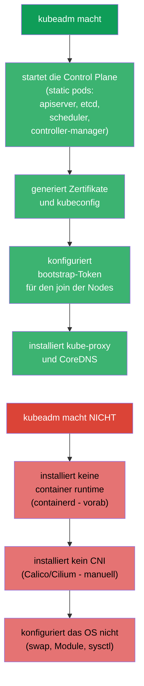
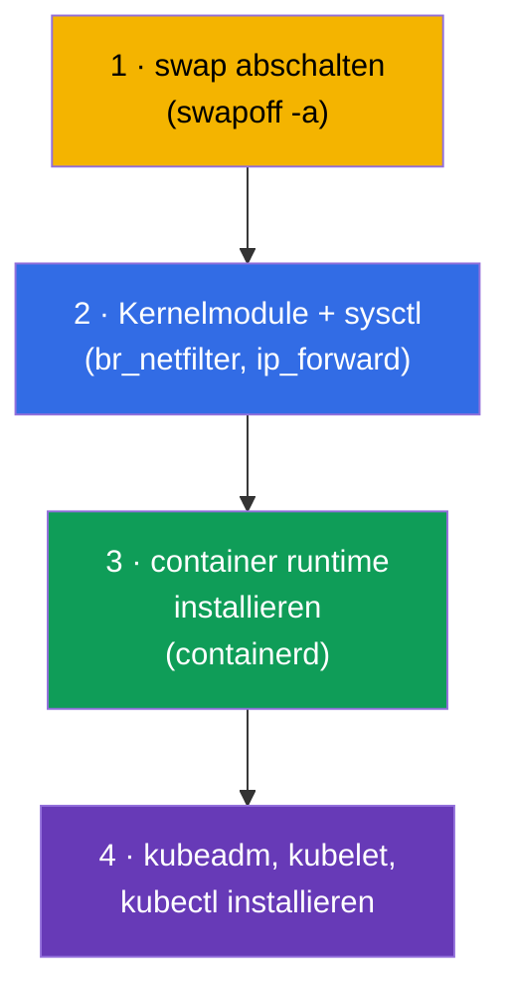
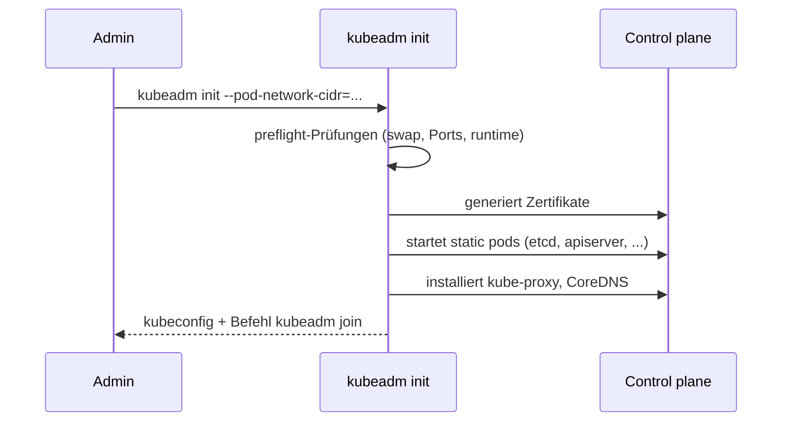
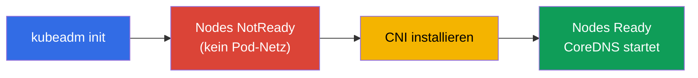
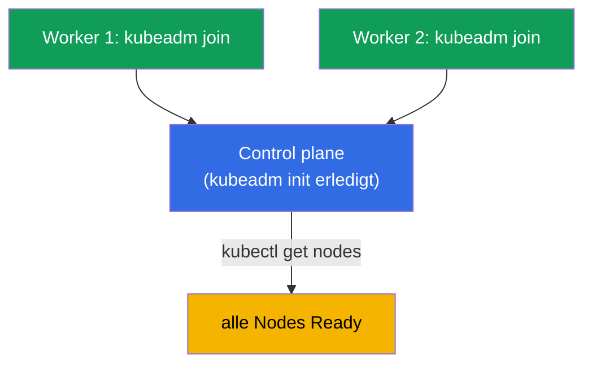
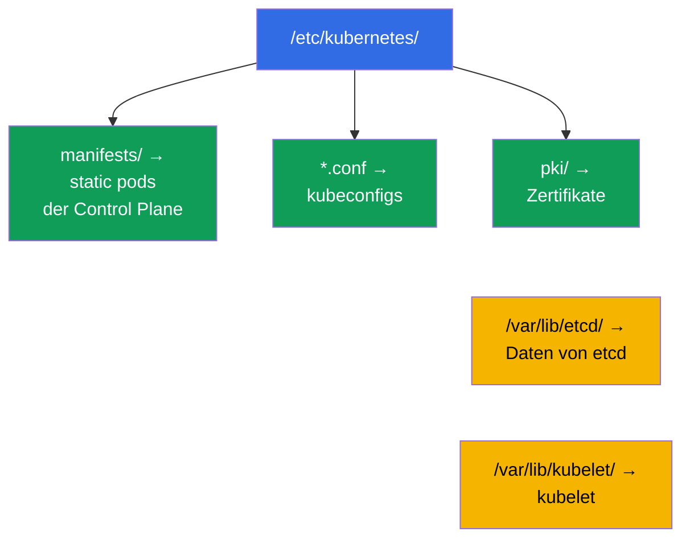
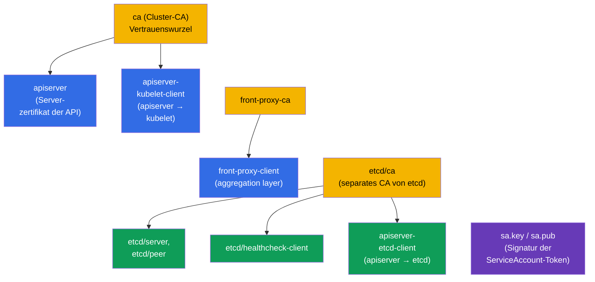
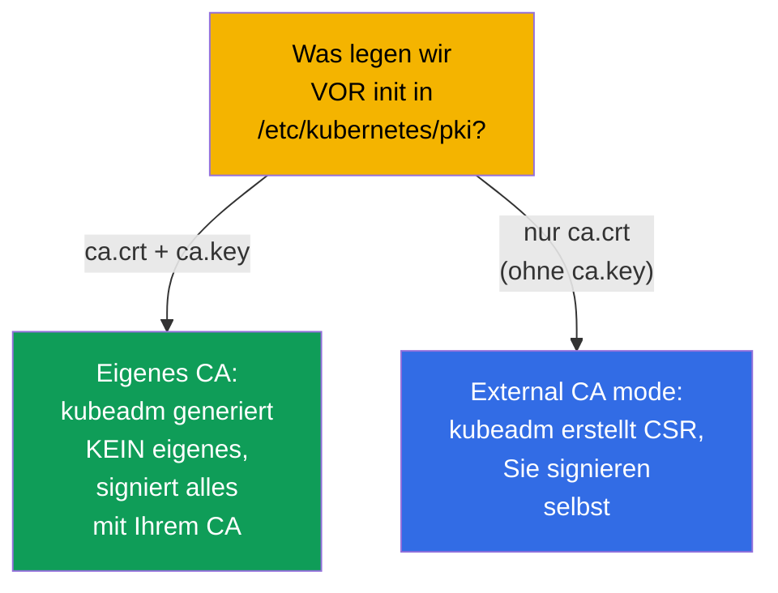

[Русская версия](ru.md) · [Eng version](README.md) · [Versión en español](es.md) · [Version française](fr.md) · [ქართული ვერსია](ge.md) · [繁體中文版](tw.md) · [日本語版](jp.md)

# Kapitel 35. Installation eines Clusters mit kubeadm

> 🟦 **Kapitel für CKA** (Domäne Cluster Architecture, Installation & Configuration, 25%).
> Für CKAD nicht erforderlich, aber zum Verständnis nützlich.
>
> **Was kommt.** Wir beginnen den Administratorteil. Wir haben viel in einem fertigen Cluster
> gearbeitet; jetzt bauen wir ihn selbst mit **kubeadm** - dem offiziellen
> Installationswerkzeug. Das ist eine direkte CKA-Aufgabe („installiere einen Cluster“, „füge
> eine Node hinzu“) und die Grundlage für Upgrades (Kapitel 36), etcd-Backup (Kapitel 37) und
> Troubleshooting der Control Plane (Kapitel 45). Alles, was wir in Kapitel 2 zu den
> Komponenten behandelt haben, wird hier mit den Händen lebendig.

## 35.1. Was kubeadm macht (und was nicht)

**kubeadm** ist ein Werkzeug, das die Control Plane hochzieht und Nodes nach „best practices“
anschließt. Es ist wichtig, die Grenzen seiner Verantwortung zu verstehen.



Behalten Sie die drei Dinge im Kopf, die kubeadm **nicht** macht - sie werden separat
vorbereitet: container runtime, CNI und die Konfiguration des OS. Das CNI zu vergessen ist
der Grund, warum die Nodes nach `kubeadm init` `NotReady` bleiben (Kapitel 30).

## 35.2. Vorbereitung der Nodes (vor kubeadm)

Bevor man kubeadm ruft, wird jede Node vorbereitet:



```bash
# 1. swap abschalten (Kubernetes verlangt es)
sudo swapoff -a
# und aus /etc/fstab entfernen, damit er nach dem Neustart nicht zurückkommt

# 2. Module und Netzparameter
sudo modprobe br_netfilter
echo 'net.ipv4.ip_forward = 1' | sudo tee /etc/sysctl.d/k8s.conf
sudo sysctl --system

# 3. container runtime - containerd (Installation über Pakete)
# 4. Kubernetes-Repository und Pakete
sudo apt-get install -y kubelet kubeadm kubectl
sudo apt-mark hold kubelet kubeadm kubectl    # Versionen fixieren
```

> **Zu swap.** Kubernetes verlangt historisch einen abgeschalteten swap (das kubelet startet
> standardmäßig bei eingeschaltetem swap nicht). Das ist der erste Punkt der Vorbereitung und
> ein häufiger Grund, warum `kubeadm init` fehlschlägt.

Die vollständige und aktuelle Liste der Anforderungen und Vorbereitungsschritte einer Node
steht in der offiziellen Dokumentation:
[Installing kubeadm](https://kubernetes.io/docs/setup/production-environment/tools/kubeadm/install-kubeadm/)
(swap, Kernelmodule und sysctl, container runtime, Repository und die Pakete
kubeadm/kubelet/kubectl).

## 35.3. Initialisierung der Control Plane: kubeadm init

Auf der künftigen Control-Plane-Node:

```bash
sudo kubeadm init \
  --pod-network-cidr=10.244.0.0/16 \        # Bereich der Pods (mit dem CNI abstimmen!)
  --control-plane-endpoint=<Adresse>        # stabile Adresse der API (für HA)
```

> **Welche Adresse in `--control-plane-endpoint`?** Das ist der **stabile Eingangspunkt zum
> API-Server**, gemeinsam für alle Nodes und Teil der Zertifikate. Hier die IP einer
> konkreten Node anzugeben ist eine schlechte Idee: wenn das die einzige Control Plane ist,
> können Sie ohne Neuaufbau nicht mehr auf mehrere Control Planes umsteigen. Richtig ist:
>
> - ein **DNS-Name** (zum Beispiel `k8s-api.example.com`), den Sie kontrollieren - die
>   flexibelste Variante: später kann man dahinter einen Load Balancer setzen, ohne den
>   Cluster anzufassen;
> - die **Adresse des Load Balancers** (VIP/LB) vor den Control-Plane-Nodes - für echtes HA
>   (mehrere API-Server hinter einer Adresse).
>
> Man kann einen Port hinzufügen: `--control-plane-endpoint=k8s-api.example.com:6443`. Das
> Flag ist für eine Control Plane mit einem Knoten **nicht zwingend**, aber es sofort (über
> DNS) zu setzen ist gute Praxis: das hält den Weg zu HA offen. Ohne das Flag wird die Adresse
> der aktuellen Node zum Endpoint, und ein späteres „Wachsen“ zu HA klappt nicht mehr.
> Details -
> [Creating a cluster with kubeadm](https://kubernetes.io/docs/setup/production-environment/tools/kubeadm/create-cluster-kubeadm/)
> und [HA topology](https://kubernetes.io/docs/setup/production-environment/tools/kubeadm/high-availability/).



Nach einem erfolgreichen init gibt kubeadm zwei wichtige Dinge aus:

1. die Befehle, um `kubectl` einzurichten (admin.conf kopieren):
```bash
mkdir -p $HOME/.kube
sudo cp -i /etc/kubernetes/admin.conf $HOME/.kube/config
sudo chown $(id -u):$(id -g) $HOME/.kube/config
```
2. den Befehl `kubeadm join ...` mit dem Token - er wird auf den Worker-Nodes ausgeführt.

### Zertifikate des Clusters: Laufzeiten, Verlängerung, eigenes CA

`kubeadm init` generiert selbst die komplette PKI des Clusters in `/etc/kubernetes/pki`. Es
ist wichtig, die Laufzeiten zu verstehen, sonst **kann man sich in der Produktion einen
Ausfall einfangen**: wenn die Zertifikate des apiserver und der Komponenten ablaufen, hört
die Control Plane auf zu arbeiten, und `kubectl` beginnt mit TLS-Fehlern zu antworten.

Standardlaufzeiten:

- **Blatt-Zertifikate** (apiserver, apiserver-kubelet-client, die Client-Zertifikate in
  `admin.conf`/`controller-manager.conf`/`scheduler.conf` usw.) - **1 Jahr**;
- **CA-Zertifikate** (`ca`, `etcd-ca`, `front-proxy-ca`) - **10 Jahre**;
- das Client-Zertifikat des kubelet (`/var/lib/kubelet/pki`) **rotiert automatisch** - es
  steht in der Liste unten nicht.

Laufzeiten prüfen:

```bash
kubeadm certs check-expiration     # Tabelle EXPIRES / RESIDUAL TIME für alle Zertifikate
```

Verlängerung:

- **automatisch beim Upgrade** der Control Plane: `kubeadm upgrade apply/node` verlängert
  alle Zertifikate. Wenn man den Cluster regelmäßig aktualisiert (häufiger als einmal im
  Jahr), muss man an den Ablauf nicht denken;
- **manuell** zu jedem Zeitpunkt: `kubeadm certs renew all` (auf **jeder**
  Control-Plane-Node ausführen, danach die static pods der Control Plane neu starten - zum
  Beispiel ihre Manifeste in `/etc/kubernetes/manifests/` kurz entfernen und zurücklegen).
  Nach der Verlängerung von `admin.conf` vergessen Sie nicht, `~/.kube/config` zu
  aktualisieren.

Eigene und externe Zertifikate (um Laufzeiten und ein eigenes CA vorab festzulegen):

- **eigenes CA**: legen Sie `ca.crt` und `ca.key` **vor** `kubeadm init` in
  `/etc/kubernetes/pki` - kubeadm überschreibt sie nicht und signiert den Rest mit Ihrem CA;
- **eigene Laufzeiten** über die kubeadm-Konfiguration (mit `kubeadm init --config`
  übergeben):

  ```yaml
  apiVersion: kubeadm.k8s.io/v1beta4
  kind: ClusterConfiguration
  certificateValidityPeriod: 8760h      # Blatt-Zertifikate: standardmäßig 1 Jahr
  caCertificateValidityPeriod: 87600h   # CA: standardmäßig 10 Jahre
  ```

  (die Werte sind im Format von Go-Dauern, die größte Einheit ist `h`);
- **externes CA** (external CA mode): legen Sie nur `ca.crt` ohne `ca.key` ab - kubeadm
  erkennt das und hält den CA-Schlüssel nicht auf der Platte, dafür übernehmen Sie
  Ausstellung und Verlängerung der Zertifikate selbst (eigener signer). Dabei verwaltet
  `kubeadm certs renew` solche Zertifikate **nicht mehr**.

Details und Szenarien stehen in der Dokumentation:
[Certificate Management with kubeadm](https://kubernetes.io/docs/tasks/administer-cluster/kubeadm/kubeadm-certs/).

> **Fazit für die Produktion.** Entweder upgraden Sie den Cluster regelmäßig (die Zertifikate
> verlängern sich selbst) oder überwachen `check-expiration` und verlängern vorab. „Der
> Cluster ist genau ein Jahr nach der Installation komplett kaputtgegangen“ - ein Klassiker
> abgelaufener kubeadm-Zertifikate.

## 35.4. Installation des CNI (zwingender Schritt)

Direkt nach init sind die Nodes `NotReady` - es gibt kein Pod-Netz. Wir installieren ein CNI
(Kapitel 30):

```bash
# Beispiel: Calico
kubectl apply -f https://raw.githubusercontent.com/projectcalico/calico/<Version>/manifests/calico.yaml
```



Erst nach der Installation des CNI werden die Nodes `Ready`, und die Systempods (CoreDNS)
starten. `--pod-network-cidr` in init muss mit dem übereinstimmen, was das CNI erwartet -
sonst funktioniert das Netz nicht.

## 35.5. Anschluss der Worker-Nodes: kubeadm join

Auf jeder Worker-Node (nach Schritt 35.2 vorbereitet) führt man `kubeadm join` aus, das init
ausgegeben hat:

```bash
sudo kubeadm join <control-plane>:6443 \
  --token <Token> \
  --discovery-token-ca-cert-hash sha256:<Hash>
```



Wenn der Token verloren oder abgelaufen ist (er lebt 24 Stunden), erzeugt man auf der Control
Plane einen neuen:

```bash
kubeadm token create --print-join-command    # gibt den fertigen join-Befehl aus
```

Prüfung des Ergebnisses:

```bash
kubectl get nodes                             # alle Nodes müssen Ready sein
kubectl get pods -n kube-system               # Komponenten und CoreDNS Running
```

## 35.6. Was nach der Installation wo liegt

kubeadm legt die Dateien vorhersagbar ab - das muss man für das Troubleshooting kennen
(Kapitel 37, 45):

| Pfad | Was dort liegt |
|------|---------|
| `/etc/kubernetes/manifests/` | static pods der Control Plane (apiserver, etcd, scheduler, cm) |
| `/etc/kubernetes/*.conf` | kubeconfigs (admin, kubelet, controller-manager, scheduler) |
| `/etc/kubernetes/pki/` | Zertifikate und Schlüssel (u. a. CA, etcd) |
| `/var/lib/etcd/` | Daten von etcd |
| `/var/lib/kubelet/` | Konfiguration und Daten des kubelet |



## 35.7. Welche Zertifikate kubeadm init erzeugt

Bei `kubeadm init` wird automatisch die komplette **PKI des Clusters** in
`/etc/kubernetes/pki/` generiert. Darauf steht das ganze Vertrauen (Kapitel 0.3, 39). Es ist
nützlich zu wissen, was genau erzeugt wird.



Die zentralen Dateien in `/etc/kubernetes/pki/`:

| Datei | Was das ist |
|------|---------|
| `ca.crt` / `ca.key` | **CA des Clusters** - signiert den apiserver und die Client-Zertifikate |
| `apiserver.crt/.key` | Serverzertifikat von kube-apiserver (SAN: ClusterIP, Namen, endpoint) |
| `apiserver-kubelet-client.*` | Client-Zertifikat des apiserver für den Zugriff auf das kubelet |
| `front-proxy-ca.*` / `front-proxy-client.*` | CA und Client für den aggregation layer (API-Erweiterungen) |
| `etcd/ca.*` | **separates CA für etcd** |
| `etcd/server.*`, `etcd/peer.*` | Server- und peer-Zertifikate von etcd |
| `etcd/healthcheck-client.*`, `apiserver-etcd-client.*` | Clients zu etcd (Prüfungen, apiserver) |
| `sa.key` / `sa.pub` | Schlüsselpaar zur **Signatur der ServiceAccount-Token** (kein Zertifikat) |

Zusätzlich erzeugt kubeadm die **kubeconfigs**, signiert mit dem CA (in
`/etc/kubernetes/`): `admin.conf`, `super-admin.conf`, `kubelet.conf`,
`controller-manager.conf`, `scheduler.conf`.

### Laufzeiten

| Was | Standardlaufzeit |
|-----|-------------------|
| **CA** (Cluster, etcd, front-proxy) | **10 Jahre** |
| Blatt-Zertifikate (apiserver, kubelet-client, etcd/* usw.) | **1 Jahr** |
| Client-Zertifikate in kubeconfig (admin u. a.) | 1 Jahr |

Das heißt, die Wurzel-CAs leben lange (10 Jahre), und alles, was mit ihnen signiert ist, -
**1 Jahr** und verlangt eine Verlängerung. Prüfung und Verlängerung -
`kubeadm certs check-expiration` / `kubeadm certs renew` (Kapitel 39); ein Upgrade des
Clusters (Kapitel 36) verlängert die Zertifikate der Control Plane automatisch.

### Best practices

- **Aktualisieren Sie den Cluster mindestens einmal im Jahr** - das Upgrade verlängert die
  Blatt-Zertifikate der Control Plane automatisch, und sie kommen nicht zum Ablaufen.
- **Überwachen Sie die Laufzeiten** (`kubeadm certs check-expiration`) mit einem Alert N Tage
  vorher - ein abgelaufenes Zertifikat der Control Plane legt den Cluster um
  (`x509: certificate has expired`).
- **Sichern Sie `/etc/kubernetes/pki`** (besonders die CA-Schlüssel) zusammen mit etcd - ohne
  CA lässt sich der Cluster nicht wiederherstellen.
- **Hüten Sie `ca.key`**: der Besitzer des CA-Schlüssels kann jede Identität ausstellen,
  einschließlich admin. Der Zugriff ist streng begrenzt.
- **kubelet-Zertifikate - auf automatische Rotation** (`rotateCertificates: true`,
  `serverTLSBootstrap`), um nicht manuell verlängern zu müssen.

## 35.8. Eigene PKI: ein eigenes CA oder einen externen signer unterschieben

Man kann kubeadm dazu bringen, **Ihr** CA statt der Generierung eines eigenen zu verwenden -
für eine einheitliche Vertrauenswurzel in der Organisation. Die Wege:



- **Eigenes CA (Schlüssel + Zertifikat).** Legen Sie `ca.crt` **und** `ca.key` (bei Bedarf
  auch `etcd/ca.*`, `front-proxy-ca.*`, `sa.key/sa.pub`) **vor** `kubeadm init` in
  `/etc/kubernetes/pki/`. kubeadm sieht das fertige CA und signiert damit die übrigen
  Zertifikate, ohne ein eigenes zu erstellen. So wird der ganze Cluster auf Ihrer
  Vertrauenswurzel aufgebaut.
- **External CA mode (ohne privaten CA-Schlüssel auf der Node).** Legen Sie nur **`ca.crt`**
  (den öffentlichen) ohne `ca.key` ab. kubeadm geht in den Modus des externen CA: es
  generiert **CSR** und wartet darauf, dass Sie sie mit Ihrem externen CA signieren und die
  fertigen Zertifikate ablegen. Plus - der private CA-Schlüssel liegt nicht auf der Node;
  minus - **kubeadm kann die Zertifikate nicht selbst verlängern**, das ist Ihre Aufgabe.
- **Feinabstimmung über kubeadm config.** In `ClusterConfiguration` setzt man:
  `certificatesDir` (eigenes PKI-Verzeichnis), `apiServer.certSANs` (zusätzliche
  Namen/Adressen im Zertifikat des apiserver - zum Beispiel der DNS-Name des Load Balancers
  für HA, Kapitel 35A), sowie `etcd.external` mit den Pfaden zu Ihren Zertifikaten, wenn etcd
  extern ist.

```bash
# Beispiel: Initialisierung mit eigenen SAN und eigenem CA (liegt vorab in pki/)
sudo kubeadm init --config kubeadm-config.yaml
# in kubeadm-config.yaml:
#   apiServer:
#     certSANs: ["api.example.com", "10.0.0.100"]
```

> **In der Prüfung** baut man selten eine eigene PKI, aber das Verständnis, dass man ein CA
> vorab unterlegen kann und dass es einen external-CA-Modus gibt, - eine häufige Frage und
> eine echte Produktionsaufgabe (einheitliche Vertrauenswurzel im Unternehmen, Ablage des
> CA-Schlüssels in HSM/Vault statt auf der Node).

## 35.9. Wie man das in der Produktion anwendet

- **kubeadm - für self-managed Cluster.** In der Cloud nimmt man häufiger managed Cluster
  (EKS/GKE/AKS), wo der Provider die Control Plane installiert und betreibt. kubeadm wählt man
  für on-prem, private und spezielle Installationen, wo man volle Kontrolle braucht.
- **Automatisierung über kubeadm.** Manuell startet man kubeadm selten - man verpackt es in
  Ansible/Terraform/Images, und für eine Flotte von Clustern nutzt man Cluster API (kubeadm
  darin). Manuelles init/join ist vor allem Lernen, Labs und Problemanalyse.
- **HA der Control Plane.** In der Produktion zieht man mehrere Control-Plane-Nodes hoch
  (`--control-plane-endpoint` + Load Balancer) und eine ungerade Anzahl von etcd-Knoten - eine
  einzige Control Plane ist nur in dev zulässig. Ausführlich - in Kapitel 35A.
- **Versionen und OS-Vorbereitung sind automatisiert.** Das Abschalten von swap, die Module,
  sysctl, die Installation von containerd und das Fixieren der kube*-Versionen macht man über
  ein Image-Template/Provisioning, damit die Nodes gleich und reproduzierbar sind.
- **Das Wissen um die Dateiablage ist die Basis des Betriebs.** Die Pfade
  `/etc/kubernetes/...`, `/var/lib/etcd` braucht man für das etcd-Backup, die Erneuerung der
  Zertifikate und die Reparatur der Control Plane - das ist die tägliche Realität der
  CKA-Fähigkeiten in self-managed Clustern.

## 35.10. Mini-Glossar

- **kubeadm** - das offizielle Werkzeug zur Installation eines Clusters (init/join/upgrade).
- **kubeadm init** - Initialisierung der Control Plane.
- **kubeadm join** - Anschluss einer Node an den Cluster.
- **bootstrap-Token** - temporärer Token für den join von Nodes (lebt ~24 Stunden).
- **--pod-network-cidr** - Adressbereich der Pods (wird mit dem CNI abgestimmt).
- **--control-plane-endpoint** - gemeinsame Adresse der Control Plane (für HA).
- **swapoff** - Abschalten von swap (Anforderung von Kubernetes).
- **admin.conf** - kubeconfig des Administrators nach init.
- **PKI des Clusters** - die Menge der CAs und Zertifikate in `/etc/kubernetes/pki/`, wird bei
  init erzeugt.
- **CA des Clusters / etcd CA / front-proxy CA** - drei Vertrauenswurzeln (Laufzeit ~10 Jahre).
- **External CA mode** - nur `ca.crt` ohne Schlüssel: kubeadm erstellt CSR, die Signatur liegt
  bei Ihnen.
- **certSANs** - zusätzliche Namen/Adressen im Zertifikat des apiserver (z. B. der DNS-Name des Load Balancers).
- **sa.key / sa.pub** - Schlüssel zur Signatur der ServiceAccount-Token.

## 35.11. Zusammenfassung des Kapitels

- kubeadm zieht die Control Plane hoch (static pods, Zertifikate, Token, kube-proxy, CoreDNS),
  installiert aber keine container runtime, kein CNI und konfiguriert das OS nicht - das macht
  man separat.
- Vorbereitung der Nodes: swap abschalten, Module/sysctl einschalten, containerd und
  kubeadm/kubelet/kubectl installieren (mit Fixierung der Versionen).
- `kubeadm init --pod-network-cidr=...` initialisiert die Control Plane und gibt die
  Einrichtung von kubectl und den Befehl `kubeadm join` aus.
- Direkt nach init muss man ein CNI installieren - sonst sind die Nodes NotReady und CoreDNS
  startet nicht.
- Worker-Nodes schließt man mit `kubeadm join` und Token an; einen abgelaufenen Token erzeugt
  man mit `kubeadm token create --print-join-command` neu.
- Die Dateien sind vorhersagbar: static pods in `/etc/kubernetes/manifests/`, Zertifikate in
  `pki/`, die Daten von etcd in `/var/lib/etcd/` - das ist die Basis für Backup und
  Troubleshooting.
- kubeadm init generiert die PKI des Clusters: CA (Cluster, etcd, front-proxy) für ~10 Jahre
  und Blatt-Zertifikate für 1 Jahr; Verlängerung - Upgrade oder `kubeadm certs renew`
  (Kapitel 39).
- Man kann ein eigenes CA verwenden: `ca.crt`+`ca.key` vor init in `pki/` legen (oder nur
  `ca.crt` für den external-CA-Modus, wo die Signatur der CSR bei Ihnen liegt).

## 35.12. Wofür das nützlich ist: in der Prüfung und in der echten Arbeit

**In der Prüfung (CKA).** „Installiere einen kubeadm-Cluster“, „füge eine Worker-Node hinzu“,
„warum sind die Nodes NotReady“ - direkte Aufgaben der Domäne Installation (25%). Man muss die
Vorbereitungsschritte kennen (swap!), die Reihenfolge init → kubectl → CNI → join und die
Dateiablage. Das ist die Grundlage für die Kapitel 36-37 und 45.

**In der echten Arbeit.** kubeadm ist die Basis von self-managed und on-prem Clustern. Auch
wenn man es in Automatisierung verpackt (Ansible, Cluster API), ist das Verständnis, was es
macht und wo die Dateien liegen, für Upgrades, etcd-Backups, die Rotation der Zertifikate und
die Reparatur der Control Plane notwendig.

## 35.13. Fragen zur Selbstüberprüfung

1. Was macht kubeadm bei der Installation und was macht es NICHT?
2. Welche Vorbereitungsschritte einer Node sind vor kubeadm nötig? Warum ist swapoff wichtig?
3. Was passiert nach `kubeadm init` und welche zwei Dinge gibt es aus?
4. Warum sind die Nodes direkt nach init NotReady und was behebt das?
5. Wie schließt man eine Worker-Node an und was macht man, wenn der Token abgelaufen ist?
6. Wo liegen die static pods der Control Plane, die Zertifikate und die Daten von etcd?
7. Warum muss `--pod-network-cidr` mit dem CNI abgestimmt sein?
8. Welche Zertifikate erzeugt `kubeadm init` und für welche Laufzeit (CA vs Blatt)?
9. Wie bringt man kubeadm dazu, Ihr eigenes CA zu verwenden? Wodurch unterscheidet sich der
   external-CA-Modus?

## Praxis

Wir haben einen Cluster aufgebaut. In Kapitel 35A behandeln wir, wie man die Control Plane
ausfallsicher macht (HA), in Kapitel 36 - wie man den Cluster sicher aktualisiert (lifecycle),
und in Kapitel 37 - wie man etcd sichert und wiederherstellt. Die Installation eines
kubeadm-Clusters ist genau das, was unsere Labs automatisch machen (man kann sich auf die
Nodes einloggen und alles ansehen).

🧪 Lab 116 (kubeadm init + join von null): [tasks/cka/labs/116](../../labs/116/README_DE.MD)

---
[Inhalt](../README_DE.md) · [Kapitel 34](../34/de.md) · [Kapitel 35A](../35-2-ha/de.md)
