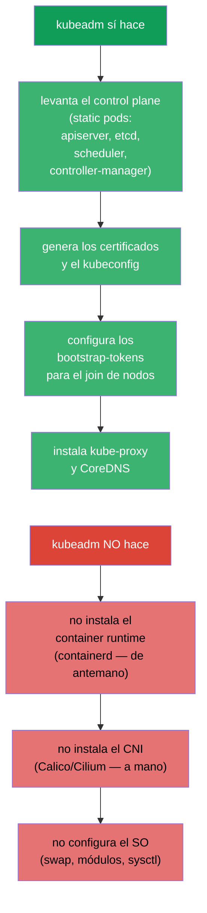
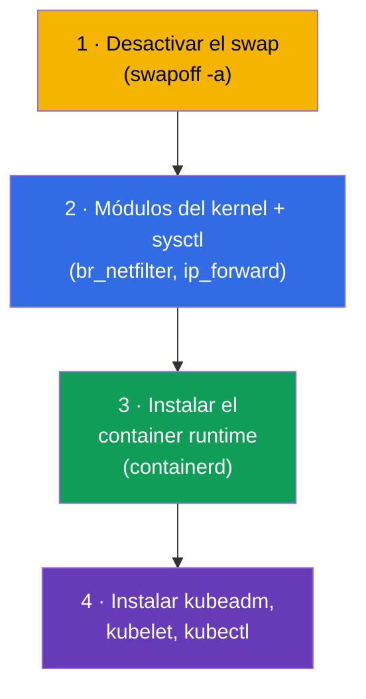
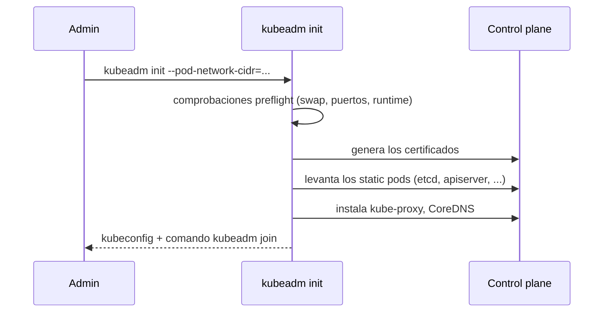
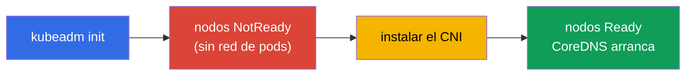
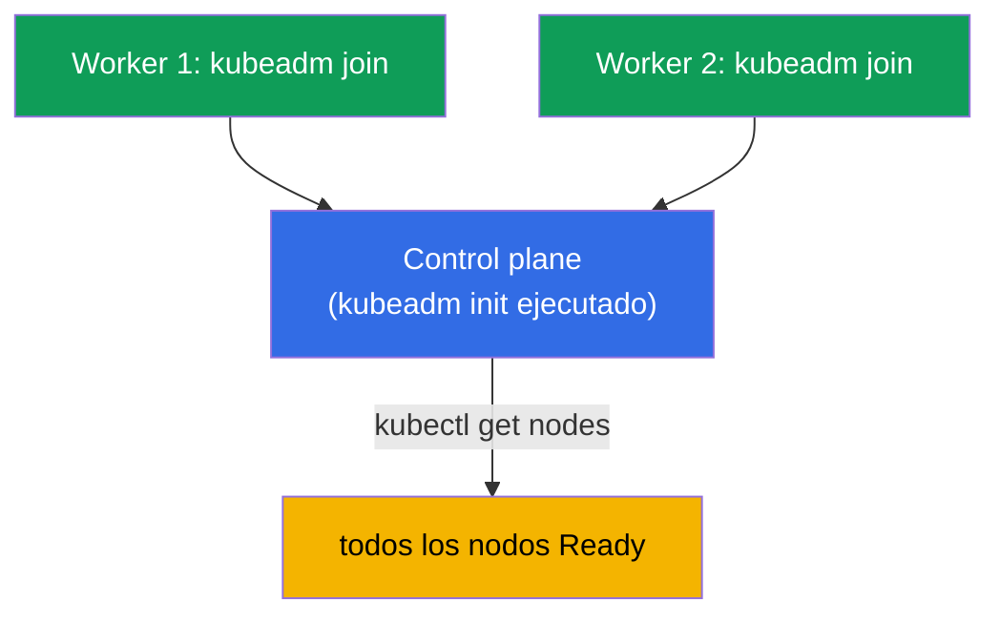
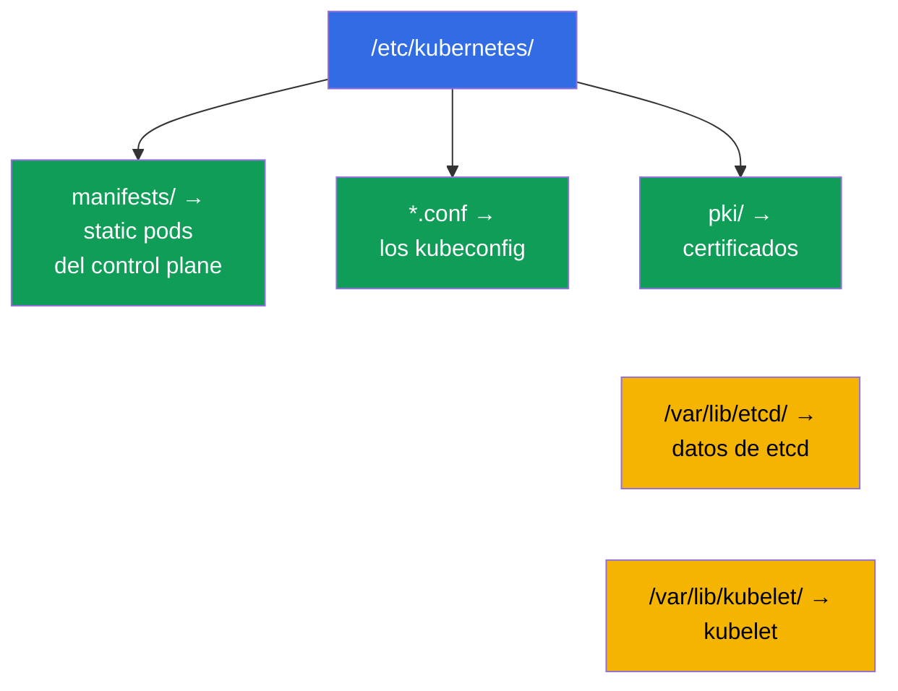
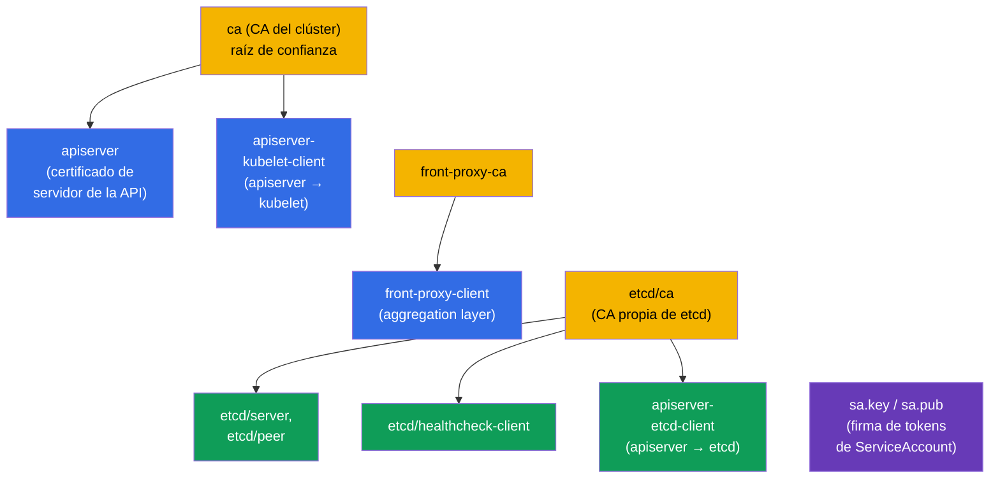
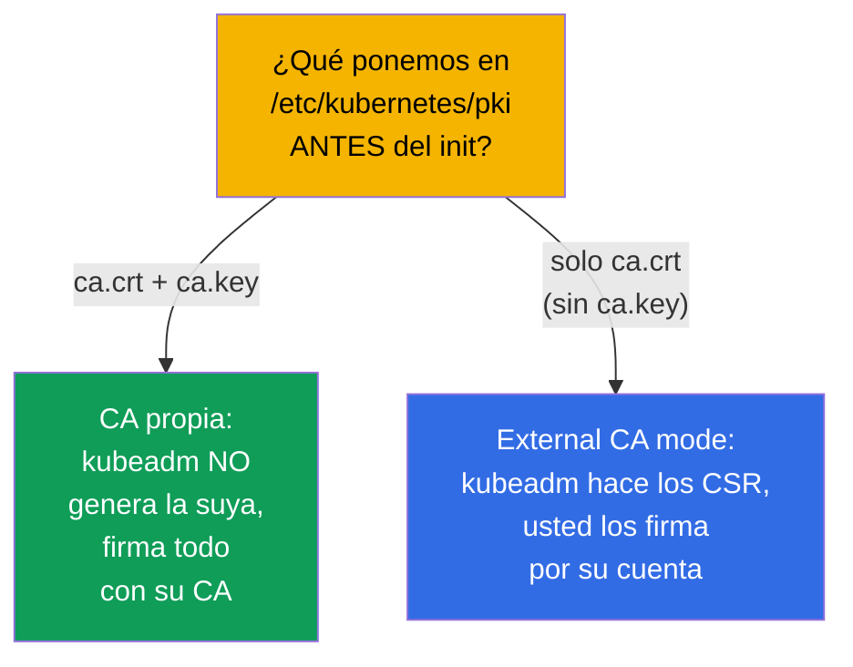

[Русская версия](ru.md) · [Eng version](README.md) · [Version française](fr.md) · [Deutsche Version](de.md) · [ქართული ვერსია](ge.md) · [繁體中文版](tw.md) · [日本語版](jp.md)

# Capítulo 35. Instalación del clúster con kubeadm

> 🟦 **Capítulo para CKA** (dominio Cluster Architecture, Installation & Configuration, 25%).
> Para CKAD no es necesario, pero ayuda a entender el conjunto.
>
> **Qué viene ahora.** Empezamos la parte de administración. Hemos trabajado mucho en un clúster
> ya montado; ahora lo construiremos nosotros mismos con **kubeadm**, la herramienta oficial de
> instalación. Es una tarea directa del CKA («instala un clúster», «añade un nodo») y la base para
> las actualizaciones (capítulo 36), el backup de etcd (capítulo 37) y el troubleshooting del
> control plane (capítulo 45). Todo lo que vimos en el capítulo 2 sobre los componentes cobra vida
> aquí con las manos.

## 35.1. Qué hace kubeadm (y qué no hace)

**kubeadm** es la herramienta que levanta el control plane y une los nodos siguiendo las «best
practices». Es importante entender los límites de su responsabilidad.



Recuerde las tres cosas que kubeadm **no** hace - se preparan por separado: container runtime,
CNI y la configuración del SO. Olvidarse del CNI es la razón por la que, tras `kubeadm init`, los
nodos se quedan en `NotReady` (capítulo 30).

## 35.2. Preparación de los nodos (antes de kubeadm)

Antes de llamar a kubeadm, cada nodo se prepara:



```bash
# 1. Desactivar el swap (Kubernetes lo exige)
sudo swapoff -a
# y quitarlo de /etc/fstab, para que no vuelva tras el reinicio

# 2. Módulos y parámetros de red
sudo modprobe br_netfilter
echo 'net.ipv4.ip_forward = 1' | sudo tee /etc/sysctl.d/k8s.conf
sudo sysctl --system

# 3. container runtime — containerd (instalación mediante paquetes)
# 4. repositorio de Kubernetes y paquetes
sudo apt-get install -y kubelet kubeadm kubectl
sudo apt-mark hold kubelet kubeadm kubectl    # fijar las versiones
```

> **Sobre el swap.** Kubernetes exige históricamente que el swap esté desactivado (kubelet, por
> defecto, no arranca con el swap activo). Es el primer punto de la preparación y una causa
> frecuente de que `kubeadm init` falle.

La lista completa y actualizada de requisitos y pasos de preparación del nodo está en la
documentación oficial:
[Installing kubeadm](https://kubernetes.io/docs/setup/production-environment/tools/kubeadm/install-kubeadm/)
(swap, módulos del kernel y sysctl, container runtime, repositorio y paquetes kubeadm/kubelet/kubectl).

## 35.3. Inicialización del control plane: kubeadm init

En el futuro nodo de control plane:

```bash
sudo kubeadm init \
  --pod-network-cidr=10.244.0.0/16 \        # rango de los pods (¡coordinarlo con el CNI!)
  --control-plane-endpoint=<dirección>      # dirección estable de la API (para HA)
```

> **¿Qué dirección va en `--control-plane-endpoint`?** Es el **punto de entrada estable al
> servidor de la API**, común a todos los nodos y que acaba dentro de los certificados. Poner ahí
> la IP de un nodo concreto es mala idea: si ese es el único control plane, ya no podrá pasar a
> varios control plane sin recrear el clúster. Lo correcto es indicar:
>
> - un **nombre DNS** (por ejemplo, `k8s-api.example.com`) que usted controle: la opción más
>   flexible, porque luego puede poner un balanceador detrás sin tocar el clúster;
> - la **dirección del balanceador** (VIP/LB) delante de los nodos de control plane, para un HA
>   real (varios servidores de API tras una misma dirección).
>
> Se puede añadir el puerto: `--control-plane-endpoint=k8s-api.example.com:6443`. El flag **no es
> obligatorio** para un control plane de un solo nodo, pero definirlo (vía DNS) desde el principio
> es una buena práctica: deja abierto el camino al HA. Sin el flag, el endpoint pasa a ser la
> dirección del nodo actual y luego no se podrá «crecer» hacia HA. Los detalles, en
> [Creating a cluster with kubeadm](https://kubernetes.io/docs/setup/production-environment/tools/kubeadm/create-cluster-kubeadm/)
> y [HA topology](https://kubernetes.io/docs/setup/production-environment/tools/kubeadm/high-availability/).



Tras un init correcto, kubeadm imprime dos cosas importantes:

1. los comandos para configurar `kubectl` (copiar admin.conf):
```bash
mkdir -p $HOME/.kube
sudo cp -i /etc/kubernetes/admin.conf $HOME/.kube/config
sudo chown $(id -u):$(id -g) $HOME/.kube/config
```
2. el comando `kubeadm join ...` con el token - se ejecuta en los nodos worker.

### Certificados del clúster: caducidad, renovación, CA propia

`kubeadm init` genera por sí mismo toda la PKI del clúster en `/etc/kubernetes/pki`. Es importante
entender los tiempos de vida, porque de lo contrario **en producción se puede provocar una caída**:
cuando los certificados del apiserver y de los componentes caducan, el control plane deja de
funcionar y `kubectl` empieza a responder con errores de TLS.

Plazos por defecto:

- **certificados hoja** (apiserver, apiserver-kubelet-client, los de cliente en
  `admin.conf`/`controller-manager.conf`/`scheduler.conf`, etc.) - **1 año**;
- **certificados de CA** (`ca`, `etcd-ca`, `front-proxy-ca`) - **10 años**;
- el certificado de cliente del kubelet (`/var/lib/kubelet/pki`) **rota automáticamente**, por eso
  no aparece en la lista de abajo.

Comprobar los plazos:

```bash
kubeadm certs check-expiration     # tabla EXPIRES / RESIDUAL TIME de todos los certificados
```

Renovación:

- **automática durante el upgrade** del control plane: `kubeadm upgrade apply/node` renueva todos
  los certificados. Si actualiza el clúster de forma regular (más de una vez al año), no hace falta
  pensar en la caducidad;
- **manual** en cualquier momento: `kubeadm certs renew all` (ejecutarlo en **cada** nodo de
  control plane y después reiniciar los static pods del control plane - por ejemplo, sacando y
  devolviendo temporalmente sus manifiestos a `/etc/kubernetes/manifests/`). Tras renovar
  `admin.conf` no olvide actualizar `~/.kube/config`.

Certificados propios y externos (para fijar los plazos y su propia CA de antemano):

- **CA propia**: coloque `ca.crt` y `ca.key` en `/etc/kubernetes/pki` **antes** de `kubeadm init` -
  kubeadm no los sobrescribirá y firmará el resto con su CA;
- **plazos personalizados** mediante el config de kubeadm (pasar `kubeadm init --config`):

  ```yaml
  apiVersion: kubeadm.k8s.io/v1beta4
  kind: ClusterConfiguration
  certificateValidityPeriod: 8760h      # hoja: por defecto 1 año
  caCertificateValidityPeriod: 87600h   # CA: por defecto 10 años
  ```

  (los valores van en formato de duraciones de Go, y la unidad mayor es `h`);
- **CA externa** (external CA mode): coloque solo `ca.crt` sin `ca.key` - kubeadm lo detectará y no
  mantendrá la clave de la CA en disco, mientras que la emisión y renovación de certificados pasa a
  ser suya (su propio signer). En ese caso `kubeadm certs renew` ya **no gestiona** esos
  certificados.

Los detalles y escenarios están en la documentación:
[Certificate Management with kubeadm](https://kubernetes.io/docs/tasks/administer-cluster/kubeadm/kubeadm-certs/).

> **Conclusión para producción.** O actualiza el clúster con regularidad (los certificados se
> renuevan solos), o monitoriza `check-expiration` y renueva con antelación. «El clúster se rompió
> justo un año después de instalarlo» es el clásico de los certificados de kubeadm caducados.

## 35.4. Instalación del CNI (paso obligatorio)

Justo después del init los nodos están `NotReady`: no hay red de pods. Instalamos el CNI (capítulo 30):

```bash
# ejemplo: Calico
kubectl apply -f https://raw.githubusercontent.com/projectcalico/calico/<versión>/manifests/calico.yaml
```



Solo después de instalar el CNI los nodos pasan a `Ready` y los pods del sistema (CoreDNS)
arrancan. El `--pod-network-cidr` del init debe coincidir con lo que espera el CNI; si no, la red
no funcionará.

## 35.5. Unir los nodos worker: kubeadm join

En cada nodo worker (preparado según el paso 35.2) se ejecuta el `kubeadm join` que imprimió el
init:

```bash
sudo kubeadm join <control-plane>:6443 \
  --token <token> \
  --discovery-token-ca-cert-hash sha256:<hash>
```



Si el token se pierde o caduca (vive 24 horas), se crea uno nuevo en el control plane:

```bash
kubeadm token create --print-join-command    # imprimirá el comando join ya listo
```

Comprobación del resultado:

```bash
kubectl get nodes                             # todos los nodos deben estar Ready
kubectl get pods -n kube-system               # componentes y CoreDNS en Running
```

## 35.6. Qué queda y dónde tras la instalación

kubeadm coloca los ficheros de forma predecible, y hay que conocerlo para el troubleshooting
(capítulos 37, 45):

| Ruta | Qué hay ahí |
|------|---------|
| `/etc/kubernetes/manifests/` | static pods del control plane (apiserver, etcd, scheduler, cm) |
| `/etc/kubernetes/*.conf` | los kubeconfig (admin, kubelet, controller-manager, scheduler) |
| `/etc/kubernetes/pki/` | certificados y claves (incluidas las de CA y etcd) |
| `/var/lib/etcd/` | datos de etcd |
| `/var/lib/kubelet/` | config y datos del kubelet |



## 35.7. Qué certificados crea kubeadm init

Con `kubeadm init` se genera automáticamente toda la **PKI del clúster** en
`/etc/kubernetes/pki/`. Es la base sobre la que se sostiene toda la confianza (capítulos 0.3, 39).
Conviene saber qué se crea exactamente.



Ficheros clave en `/etc/kubernetes/pki/`:

| Fichero | Qué es |
|------|---------|
| `ca.crt` / `ca.key` | **CA del clúster** - firma el apiserver y los certificados de cliente |
| `apiserver.crt/.key` | certificado de servidor de kube-apiserver (SAN: ClusterIP, nombres, endpoint) |
| `apiserver-kubelet-client.*` | certificado de cliente del apiserver para dirigirse al kubelet |
| `front-proxy-ca.*` / `front-proxy-client.*` | CA y cliente para el aggregation layer (extensiones de la API) |
| `etcd/ca.*` | **CA propia para etcd** |
| `etcd/server.*`, `etcd/peer.*` | certificados de servidor y peer de etcd |
| `etcd/healthcheck-client.*`, `apiserver-etcd-client.*` | clientes hacia etcd (comprobaciones, apiserver) |
| `sa.key` / `sa.pub` | par de claves para la **firma de tokens de ServiceAccount** (no es un certificado) |

Además, kubeadm crea los **kubeconfig** firmados por la CA (en `/etc/kubernetes/`):
`admin.conf`, `super-admin.conf`, `kubelet.conf`, `controller-manager.conf`,
`scheduler.conf`.

### Plazos de validez

| Qué | Plazo por defecto |
|-----|-------------------|
| **CA** (del clúster, de etcd, front-proxy) | **10 años** |
| Certificados hoja (apiserver, kubelet-client, etcd/*, etc.) | **1 año** |
| Certificados de cliente en los kubeconfig (admin y demás) | 1 año |

Es decir, las CA raíz viven mucho (10 años), y todo lo firmado por ellas dura **1 año** y requiere
renovación. Comprobación y renovación: `kubeadm certs check-expiration` / `kubeadm certs renew`
(capítulo 39); el upgrade del clúster (capítulo 36) renueva los certificados del control plane
automáticamente.

### Best practices

- **Actualice el clúster al menos una vez al año**: el upgrade renueva los certificados hoja del
  control plane automáticamente y no llegan a caducar.
- **Monitorice los plazos** (`kubeadm certs check-expiration`) con alerta N días antes: un
  certificado caducado del control plane tumba el clúster (`x509: certificate has expired`).
- **Haga backup de `/etc/kubernetes/pki`** (sobre todo de las claves de CA) junto con etcd: sin la
  CA el clúster no se puede restaurar.
- **Cuide `ca.key`**: quien tenga la clave de la CA puede emitir cualquier credencial, incluida la
  de admin. El acceso debe estar estrictamente limitado.
- **Certificados del kubelet en rotación automática** (`rotateCertificates: true`,
  `serverTLSBootstrap`), para no renovarlos a mano.

## 35.8. PKI propia: colocar su propia CA o un signer externo

Se puede obligar a kubeadm a usar **su** CA en lugar de generar una propia, para tener una única
raíz de confianza en la organización. Formas de hacerlo:



- **CA propia (clave + certificado).** Coloque `ca.crt` **y** `ca.key` (si hace falta, también
  `etcd/ca.*`, `front-proxy-ca.*`, `sa.key/sa.pub`) en `/etc/kubernetes/pki/` **antes** de
  `kubeadm init`. kubeadm verá la CA ya lista y firmará con ella el resto de los certificados, sin
  crear una propia. Así todo el clúster se construye sobre su raíz de confianza.
- **External CA mode (sin la clave privada de la CA en el nodo).** Coloque solo **`ca.crt`** (el
  público) sin `ca.key`. kubeadm pasará al modo de CA externa: generará los **CSR** y esperará que
  usted los firme con su CA externa y deposite los certificados resultantes. La ventaja es que la
  clave privada de la CA no se guarda en el nodo; la desventaja, que **kubeadm no podrá renovar los
  certificados** por sí mismo, eso queda de su parte.
- **Ajuste fino mediante kubeadm config.** En `ClusterConfiguration` se definen:
  `certificatesDir` (directorio propio de la PKI), `apiServer.certSANs` (nombres/direcciones
  adicionales en el certificado del apiserver - por ejemplo, el DNS del balanceador para HA,
  capítulo 35A) y también `etcd.external` con las rutas a sus certificados si etcd es externo.

```bash
# ejemplo: inicialización con SAN personalizados y CA propia (colocada en pki/ de antemano)
sudo kubeadm init --config kubeadm-config.yaml
# en kubeadm-config.yaml:
#   apiServer:
#     certSANs: ["api.example.com", "10.0.0.100"]
```

> **En el examen** la PKI propia se construye pocas veces, pero entender que la CA se puede
> colocar de antemano y que existe el modo external-CA es una pregunta frecuente y una tarea real
> de producción (raíz de confianza corporativa única, almacenar la clave de la CA en HSM/Vault y no
> en el nodo).

## 35.9. Cómo se aplica esto en producción

- **kubeadm es para clústeres self-managed.** En la nube se suelen usar clústeres gestionados
  (EKS/GKE/AKS), donde el control plane lo instala y mantiene el proveedor. kubeadm se elige para
  on-prem, instalaciones privadas y específicas donde se necesita control total.
- **Automatización por encima de kubeadm.** kubeadm se lanza a mano pocas veces: se envuelve en
  Ansible/Terraform/imágenes, y para una flota de clústeres se usa Cluster API (con kubeadm por
  dentro). El init/join manual es sobre todo aprendizaje, laboratorios y análisis de problemas.
- **Control plane en HA.** En producción se levantan varios nodos de control plane
  (`--control-plane-endpoint` + balanceador) y un número impar de nodos de etcd; un único control
  plane solo es admisible en dev. En detalle, en el capítulo 35A.
- **Versiones y preparación del SO automatizadas.** Desactivar el swap, los módulos, sysctl, la
  instalación de containerd y la fijación de versiones de kube* se hacen con una plantilla de
  imagen o provisioning, para que los nodos sean idénticos y reproducibles.
- **Conocer la disposición de los ficheros es la base de la operación.** Las rutas
  `/etc/kubernetes/...` y `/var/lib/etcd` se necesitan para el backup de etcd, la actualización de
  certificados y la reparación del control plane: es la realidad diaria de las habilidades CKA en
  clústeres self-managed.

## 35.10. Mini-glosario

- **kubeadm** - herramienta oficial de instalación del clúster (init/join/upgrade).
- **kubeadm init** - inicialización del control plane.
- **kubeadm join** - unión de un nodo al clúster.
- **bootstrap-token** - token temporal para el join de nodos (vive ~24 horas).
- **--pod-network-cidr** - rango de direcciones de los pods (se coordina con el CNI).
- **--control-plane-endpoint** - dirección común del control plane (para HA).
- **swapoff** - desactivación del swap (requisito de Kubernetes).
- **admin.conf** - kubeconfig del administrador tras el init.
- **PKI del clúster** - conjunto de CA y certificados en `/etc/kubernetes/pki/`, se crea en el init.
- **CA del clúster / CA de etcd / CA front-proxy** - las tres raíces de confianza (plazo ~10 años).
- **External CA mode** - solo `ca.crt` sin la clave: kubeadm hace los CSR, la firma queda de su parte.
- **certSANs** - nombres/direcciones adicionales en el certificado del apiserver (p. ej. el DNS del balanceador).
- **sa.key / sa.pub** - claves de firma de los tokens de ServiceAccount.

## 35.11. Resumen del capítulo

- kubeadm levanta el control plane (static pods, certificados, tokens, kube-proxy, CoreDNS), pero
  no instala el container runtime ni el CNI y no configura el SO: eso se hace por separado.
- Preparación de los nodos: desactivar el swap, activar los módulos/sysctl, instalar containerd y
  kubeadm/kubelet/kubectl (con las versiones fijadas).
- `kubeadm init --pod-network-cidr=...` inicializa el control plane e imprime la configuración de
  kubectl y el comando `kubeadm join`.
- Justo después del init hay que instalar el CNI; si no, los nodos quedan NotReady y CoreDNS no
  arranca.
- Los nodos worker se unen con `kubeadm join` y un token; un token caducado se recrea con
  `kubeadm token create --print-join-command`.
- Los ficheros son predecibles: static pods en `/etc/kubernetes/manifests/`, certificados en
  `pki/`, datos de etcd en `/var/lib/etcd/`: es la base para el backup y el troubleshooting.
- kubeadm init genera la PKI del clúster: las CA (del clúster, de etcd, front-proxy) para ~10 años y
  los certificados hoja para 1 año; la renovación es el upgrade o `kubeadm certs renew` (capítulo 39).
- Se puede usar una CA propia: poner `ca.crt`+`ca.key` en `pki/` antes del init (o solo `ca.crt`
  para el modo external-CA, donde la firma de los CSR queda de su parte).

## 35.12. Para qué sirve esto: en el examen y en el trabajo real

**En el examen (CKA).** «Instala un clúster con kubeadm», «añade un nodo worker», «por qué los
nodos están NotReady» son tareas directas del dominio Installation (25%). Hay que conocer los pasos
de preparación (¡el swap!), la secuencia init → kubectl → CNI → join y la disposición de los
ficheros. Es el cimiento de los capítulos 36-37 y 45.

**En el trabajo real.** kubeadm es la base de los clústeres self-managed y on-prem. Incluso cuando
se envuelve en automatización (Ansible, Cluster API), entender qué hace y dónde están los ficheros
es imprescindible para las actualizaciones, los backups de etcd, la rotación de certificados y la
reparación del control plane.

## 35.13. Preguntas de autocomprobación

1. ¿Qué hace kubeadm durante la instalación y qué NO hace?
2. ¿Qué pasos de preparación del nodo se necesitan antes de kubeadm? ¿Por qué importa el swapoff?
3. ¿Qué ocurre después de `kubeadm init` y cuáles son las dos cosas que imprime?
4. ¿Por qué justo después del init los nodos están NotReady y qué lo corrige?
5. ¿Cómo se une un nodo worker y qué hacer si el token ha caducado?
6. ¿Dónde están los static pods del control plane, los certificados y los datos de etcd?
7. ¿Por qué `--pod-network-cidr` debe coordinarse con el CNI?
8. ¿Qué certificados crea `kubeadm init` y con qué plazo (CA vs hoja)?
9. ¿Cómo obligar a kubeadm a usar su propia CA? ¿En qué se diferencia el modo external-CA?

## Práctica

Ya hemos montado el clúster. En el capítulo 35A veremos cómo hacer el control plane tolerante a
fallos (HA), en el capítulo 36 cómo actualizar el clúster de forma segura (lifecycle) y en el
capítulo 37 cómo hacer backup y restaurar etcd. La instalación de un clúster con kubeadm es lo que
hacen automáticamente nuestros laboratorios (se puede entrar en los nodos y verlo todo).

🧪 Laboratorio 116 (kubeadm init + join desde cero): [tasks/cka/labs/116](../../labs/116/README_ES.MD)

---
[Índice](../README_ES.md) · [Capítulo 34](../34/es.md) · [Capítulo 35A](../35-2-ha/es.md)
