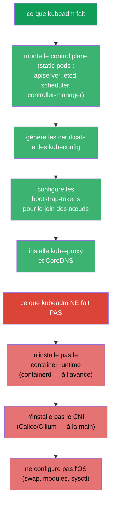
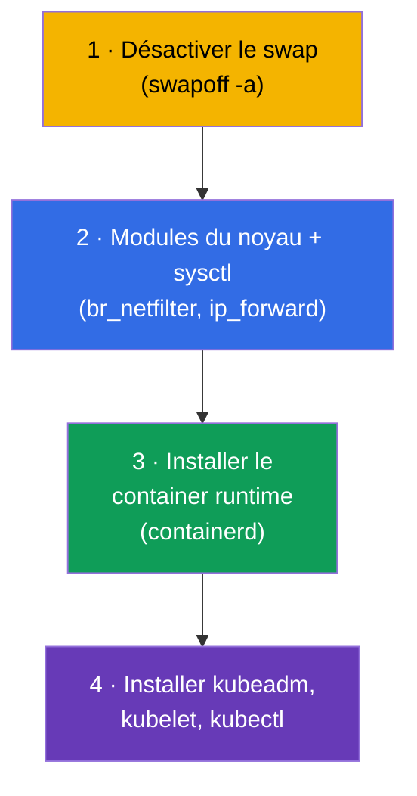
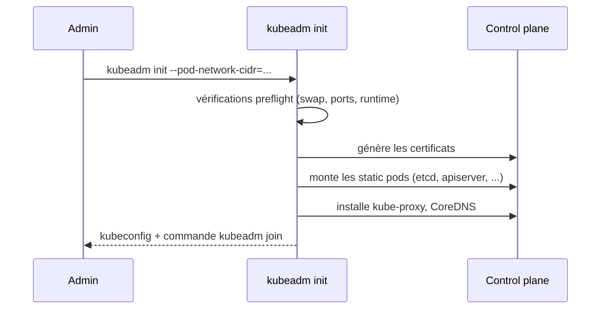
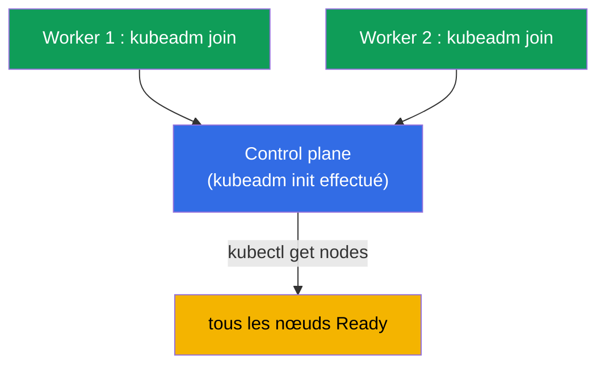
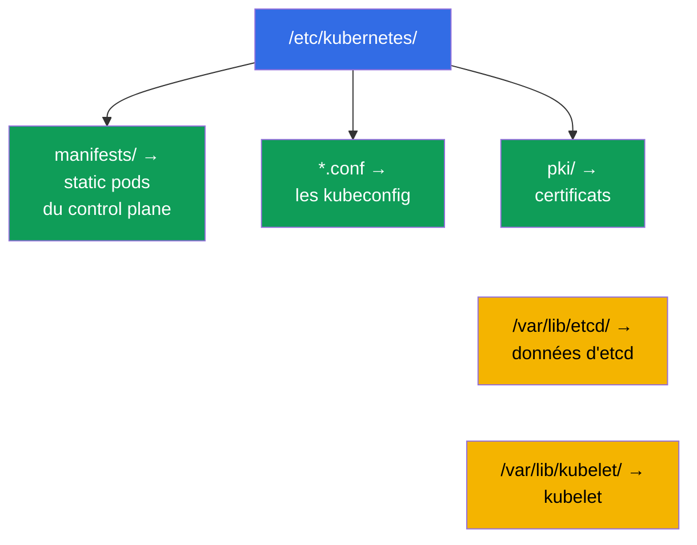
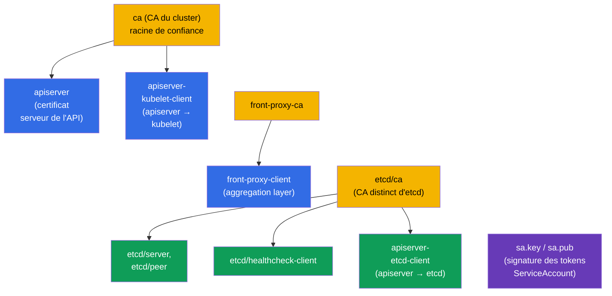
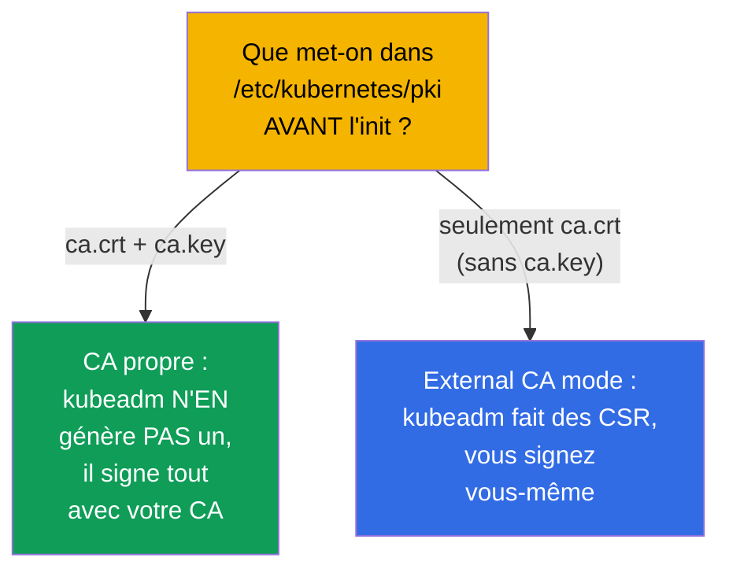

[Русская версия](ru.md) · [Eng version](README.md) · [Versión en español](es.md) · [Deutsche Version](de.md) · [ქართული ვერსია](ge.md)

# Chapitre 35. Installation d'un cluster avec kubeadm

> 🟦 **Chapitre pour le CKA** (domaine Cluster Architecture, Installation & Configuration, 25 %).
> Non requis pour le CKAD, mais utile à la compréhension.
>
> **Ce qui suit.** Nous entamons la partie administration. Nous avons beaucoup travaillé dans un
> cluster déjà prêt ; nous allons maintenant le monter nous-mêmes avec **kubeadm** - l'outil
> d'installation officiel. C'est un exercice CKA direct (« installe un cluster », « ajoute un
> nœud ») et le socle des mises à jour (chapitre 36), de la sauvegarde d'etcd (chapitre 37) et du
> troubleshooting du control plane (chapitre 45). Tout ce que nous avons vu au chapitre 2 sur les
> composants prend vie ici, entre nos mains.

## 35.1. Ce que fait kubeadm (et ce qu'il ne fait pas)

**kubeadm** est l'outil qui monte le control plane et rattache les nœuds selon les « best
practices ». Il est important de bien cerner les limites de sa responsabilité.



Retenez les trois choses que kubeadm ne fait **pas** - elles se préparent séparément : le container
runtime, le CNI et la configuration de l'OS. Oublier le CNI, c'est la raison pour laquelle après
`kubeadm init` les nœuds restent `NotReady` (chapitre 30).

## 35.2. Préparation des nœuds (avant kubeadm)

Avant d'appeler kubeadm, chaque nœud doit être préparé :



```bash
# 1. Désactiver le swap (Kubernetes l'exige)
sudo swapoff -a
# et le retirer de /etc/fstab pour qu'il ne revienne pas après un redémarrage

# 2. Modules et paramètres réseau
sudo modprobe br_netfilter
echo 'net.ipv4.ip_forward = 1' | sudo tee /etc/sysctl.d/k8s.conf
sudo sysctl --system

# 3. container runtime — containerd (installation via les paquets)
# 4. dépôt Kubernetes et paquets
sudo apt-get install -y kubelet kubeadm kubectl
sudo apt-mark hold kubelet kubeadm kubectl    # figer les versions
```

> **À propos du swap.** Kubernetes exige historiquement un swap désactivé (par défaut, kubelet ne
> démarre pas si le swap est actif). C'est le premier point de la préparation et une cause fréquente
> d'échec de `kubeadm init`.

La liste complète et à jour des prérequis et des étapes de préparation d'un nœud se trouve dans la
documentation officielle :
[Installing kubeadm](https://kubernetes.io/docs/setup/production-environment/tools/kubeadm/install-kubeadm/)
(swap, modules du noyau et sysctl, container runtime, dépôt et paquets kubeadm/kubelet/kubectl).

## 35.3. Initialisation du control plane : kubeadm init

Sur le futur nœud control plane :

```bash
sudo kubeadm init \
  --pod-network-cidr=10.244.0.0/16 \        # plage des pods (à accorder avec le CNI !)
  --control-plane-endpoint=<adresse>        # adresse stable de l'API (pour la HA)
```

> **Quelle adresse dans `--control-plane-endpoint` ?** C'est le **point d'entrée stable vers le
> serveur d'API**, commun à tous les nœuds et inscrit dans les certificats. Y mettre l'IP d'un nœud
> précis est une mauvaise idée : s'il s'agit de l'unique control plane, vous ne pourrez plus passer
> à plusieurs control plane sans recréer le cluster. Il faut indiquer :
>
> - un **nom DNS** (par exemple `k8s-api.example.com`) que vous contrôlez - l'option la plus
>   souple : vous pourrez plus tard placer un répartiteur de charge derrière lui sans toucher au
>   cluster ;
> - l'**adresse d'un répartiteur de charge** (VIP/LB) devant les nœuds control plane - pour une
>   vraie HA (plusieurs serveurs d'API derrière une seule adresse).
>
> On peut ajouter le port : `--control-plane-endpoint=k8s-api.example.com:6443`. Ce flag est
> **facultatif** pour un control plane à un seul nœud, mais le définir tout de suite (via DNS) est
> une bonne pratique : cela laisse la porte ouverte vers la HA. Sans ce flag, l'endpoint devient
> l'adresse du nœud courant, et il ne sera plus possible de « grandir » vers la HA. Détails -
> [Creating a cluster with kubeadm](https://kubernetes.io/docs/setup/production-environment/tools/kubeadm/create-cluster-kubeadm/)
> et [HA topology](https://kubernetes.io/docs/setup/production-environment/tools/kubeadm/high-availability/).



Après un init réussi, kubeadm affiche deux choses importantes :

1. les commandes pour configurer `kubectl` (copier admin.conf) :
```bash
mkdir -p $HOME/.kube
sudo cp -i /etc/kubernetes/admin.conf $HOME/.kube/config
sudo chown $(id -u):$(id -g) $HOME/.kube/config
```
2. la commande `kubeadm join ...` avec un token - à exécuter sur les nœuds worker.

### Certificats du cluster : durées, renouvellement, CA propre

`kubeadm init` génère lui-même toute la PKI du cluster dans `/etc/kubernetes/pki`. Il faut bien
comprendre les durées de vie, sinon **on peut se retrouver en panne en production** : quand les
certificats de l'apiserver et des composants expirent, le control plane cesse de fonctionner et
`kubectl` se met à répondre par des erreurs TLS.

Durées par défaut :

- **certificats feuilles** (apiserver, apiserver-kubelet-client, les certificats clients dans
  `admin.conf`/`controller-manager.conf`/`scheduler.conf`, etc.) - **1 an** ;
- **certificats de CA** (`ca`, `etcd-ca`, `front-proxy-ca`) - **10 ans** ;
- le certificat client de kubelet (`/var/lib/kubelet/pki`) est **rotationné automatiquement** - il
  n'apparaît pas dans la liste ci-dessous.

Vérifier les échéances :

```bash
kubeadm certs check-expiration     # tableau EXPIRES / RESIDUAL TIME pour tous les certificats
```

Renouvellement :

- **automatique lors d'un upgrade** du control plane : `kubeadm upgrade apply/node` renouvelle tous
  les certificats. Si le cluster est mis à jour régulièrement (plus d'une fois par an), l'expiration
  ne pose pas de problème ;
- **manuel** à tout moment : `kubeadm certs renew all` (à exécuter sur **chaque** nœud control
  plane, puis redémarrer les static pods du control plane - par exemple en retirant et remettant
  temporairement leurs manifestes dans `/etc/kubernetes/manifests/`). Après le renouvellement
  d'`admin.conf`, n'oubliez pas de mettre à jour `~/.kube/config`.

Certificats propres et externes (pour fixer les durées et votre CA à l'avance) :

- **CA propre** : placez `ca.crt` et `ca.key` dans `/etc/kubernetes/pki` **avant** `kubeadm init` -
  kubeadm ne les écrasera pas et signera le reste avec votre CA ;
- **durées personnalisées** via le config kubeadm (passer `kubeadm init --config`) :

  ```yaml
  apiVersion: kubeadm.k8s.io/v1beta4
  kind: ClusterConfiguration
  certificateValidityPeriod: 8760h      # feuilles : 1 an par défaut
  caCertificateValidityPeriod: 87600h   # CA : 10 ans par défaut
  ```

  (les valeurs sont au format des durées Go, la plus grande unité étant `h`) ;
- **CA externe** (external CA mode) : ne placez que `ca.crt` sans `ca.key` - kubeadm le détectera et
  ne gardera pas la clé de CA sur le disque, tandis que l'émission et le renouvellement des
  certificats vous incombent (votre propre signer). Dans ce cas, `kubeadm certs renew` ne **gère
  plus** ces certificats.

Détails et scénarios dans la documentation :
[Certificate Management with kubeadm](https://kubernetes.io/docs/tasks/administer-cluster/kubeadm/kubeadm-certs/).

> **Conclusion pour la production.** Soit vous faites régulièrement l'upgrade du cluster (les
> certificats se renouvellent d'eux-mêmes), soit vous surveillez `check-expiration` et renouvelez à
> l'avance. « Le cluster a tout cassé exactement un an après l'installation » - le classique des
> certificats kubeadm expirés.

## 35.4. Installation du CNI (étape obligatoire)

Juste après l'init, les nœuds sont `NotReady` - il n'y a pas de réseau de pods. On installe un CNI
(chapitre 30) :

```bash
# exemple : Calico
kubectl apply -f https://raw.githubusercontent.com/projectcalico/calico/<version>/manifests/calico.yaml
```


Ce n'est qu'après l'installation du CNI que les nœuds passent `Ready` et que les pods système
(CoreDNS) démarrent. Le `--pod-network-cidr` de l'init doit correspondre à ce qu'attend le CNI -
sinon le réseau ne fonctionnera pas.

## 35.5. Rattachement des nœuds worker : kubeadm join

Sur chaque nœud worker (préparé selon l'étape 35.2), on exécute le `kubeadm join` affiché par
l'init :

```bash
sudo kubeadm join <control-plane>:6443 \
  --token <token> \
  --discovery-token-ca-cert-hash sha256:<hash>
```



Si le token est perdu ou expiré (il vit 24 heures), on en crée un nouveau sur le control plane :

```bash
kubeadm token create --print-join-command    # affichera la commande join prête à l'emploi
```

Vérification du résultat :

```bash
kubectl get nodes                             # tous les nœuds doivent être Ready
kubectl get pods -n kube-system               # composants et CoreDNS en Running
```

## 35.6. Où se trouve quoi après l'installation

kubeadm répartit les fichiers de façon prévisible - il faut le savoir pour le troubleshooting
(chapitres 37, 45) :

| Chemin | Ce qu'on y trouve |
|------|---------|
| `/etc/kubernetes/manifests/` | static pods du control plane (apiserver, etcd, scheduler, cm) |
| `/etc/kubernetes/*.conf` | les kubeconfig (admin, kubelet, controller-manager, scheduler) |
| `/etc/kubernetes/pki/` | certificats et clés (y compris CA, etcd) |
| `/var/lib/etcd/` | données d'etcd |
| `/var/lib/kubelet/` | config et données de kubelet |



## 35.7. Quels certificats crée kubeadm init

Lors de `kubeadm init`, toute la **PKI du cluster** est générée automatiquement dans
`/etc/kubernetes/pki/`. C'est là-dessus que repose toute la confiance (chapitres 0.3, 39). Il est
utile de savoir ce qui est créé exactement.



Fichiers clés dans `/etc/kubernetes/pki/` :

| Fichier | De quoi il s'agit |
|------|---------|
| `ca.crt` / `ca.key` | **CA du cluster** - signe l'apiserver et les certificats clients |
| `apiserver.crt/.key` | certificat serveur de kube-apiserver (SAN : ClusterIP, noms, endpoint) |
| `apiserver-kubelet-client.*` | certificat client de l'apiserver pour s'adresser à kubelet |
| `front-proxy-ca.*` / `front-proxy-client.*` | CA et client pour l'aggregation layer (extensions de l'API) |
| `etcd/ca.*` | **CA distinct pour etcd** |
| `etcd/server.*`, `etcd/peer.*` | certificats serveur et peer d'etcd |
| `etcd/healthcheck-client.*`, `apiserver-etcd-client.*` | clients vers etcd (checks, apiserver) |
| `sa.key` / `sa.pub` | paire de clés pour la **signature des tokens ServiceAccount** (pas un certificat) |

En plus, kubeadm crée les **kubeconfig** signés par le CA (dans `/etc/kubernetes/`) :
`admin.conf`, `super-admin.conf`, `kubelet.conf`, `controller-manager.conf`,
`scheduler.conf`.

### Durées de validité

| Quoi | Durée par défaut |
|-----|-------------------|
| **CA** (du cluster, d'etcd, front-proxy) | **10 ans** |
| Certificats feuilles (apiserver, kubelet-client, etcd/*, etc.) | **1 an** |
| Certificats clients dans les kubeconfig (admin et autres) | 1 an |

Autrement dit, les CA racines vivent longtemps (10 ans), tandis que tout ce qu'ils signent dure
**1 an** et doit être renouvelé. Vérification et renouvellement -
`kubeadm certs check-expiration` / `kubeadm certs renew` (chapitre 39) ; l'upgrade du cluster
(chapitre 36) renouvelle automatiquement les certificats du control plane.

### Best practices

- **Mettez le cluster à jour au moins une fois par an** - l'upgrade renouvelle automatiquement les
  certificats feuilles du control plane, et ils n'ont pas le temps d'expirer.
- **Surveillez les échéances** (`kubeadm certs check-expiration`) avec une alerte N jours avant - un
  certificat de control plane expiré met le cluster à terre (`x509: certificate has expired`).
- **Sauvegardez `/etc/kubernetes/pki`** (surtout les clés de CA) en même temps qu'etcd - sans le CA,
  le cluster est irrécupérable.
- **Protégez `ca.key`** : le détenteur de la clé de CA peut émettre n'importe quelle identité, y
  compris admin. L'accès est strictement restreint.
- **Certificats kubelet - en rotation automatique** (`rotateCertificates: true`,
  `serverTLSBootstrap`), pour ne pas les renouveler à la main.

## 35.8. Votre PKI : glisser votre propre CA ou un signer externe

On peut forcer kubeadm à utiliser **votre** CA au lieu d'en générer un - pour avoir une racine de
confiance unique dans l'organisation. Les méthodes :



- **CA propre (clé + certificat).** Placez `ca.crt` **et** `ca.key` (et si besoin aussi
  `etcd/ca.*`, `front-proxy-ca.*`, `sa.key/sa.pub`) dans `/etc/kubernetes/pki/` **avant**
  `kubeadm init`. kubeadm verra le CA déjà présent et signera les autres certificats avec lui, sans
  en créer un à lui. Ainsi tout le cluster repose sur votre racine de confiance.
- **External CA mode (sans la clé privée du CA sur le nœud).** Ne placez que **`ca.crt`** (la partie
  publique) sans `ca.key`. kubeadm passera en mode CA externe : il générera des **CSR** et attendra
  que vous les signiez avec votre CA externe et déposiez les certificats prêts. L'avantage - la clé
  privée du CA n'est pas stockée sur le nœud ; l'inconvénient - **kubeadm ne pourra pas renouveler
  les certificats lui-même**, c'est à vous de le faire.
- **Réglage fin via kubeadm config.** Dans `ClusterConfiguration` on définit :
  `certificatesDir` (votre répertoire de PKI), `apiServer.certSANs` (noms/adresses supplémentaires
  dans le certificat de l'apiserver - par exemple le DNS du répartiteur de charge pour la HA,
  chapitre 35A), ainsi que `etcd.external` avec les chemins vers vos certificats si etcd est externe.

```bash
# exemple : initialisation avec des SAN personnalisés et son propre CA (déposé à l'avance dans pki/)
sudo kubeadm init --config kubeadm-config.yaml
# dans kubeadm-config.yaml :
#   apiServer:
#     certSANs: ["api.example.com", "10.0.0.100"]
```

> **À l'examen**, on construit rarement sa propre PKI, mais comprendre qu'un CA peut être déposé à
> l'avance et qu'il existe un mode external-CA est une question fréquente et une vraie tâche de
> production (racine de confiance d'entreprise unique, stockage de la clé de CA dans un HSM/Vault
> plutôt que sur le nœud).

## 35.9. Comment cela s'applique en production

- **kubeadm - pour les clusters self-managed.** Dans le cloud, on prend plus souvent des clusters
  managés (EKS/GKE/AKS), où le control plane est installé et maintenu par le fournisseur. On choisit
  kubeadm pour l'on-prem, les installations privées et spécifiques, là où il faut un contrôle total.
- **Automatisation par-dessus kubeadm.** kubeadm est rarement lancé à la main - on l'emballe dans
  Ansible/Terraform/des images, et pour un parc de clusters on utilise Cluster API (avec kubeadm à
  l'intérieur). L'init/join manuel sert surtout à l'apprentissage, aux TP et à l'analyse de
  problèmes.
- **Control plane en HA.** En prod, on monte plusieurs nœuds control plane
  (`--control-plane-endpoint` + répartiteur de charge) et un nombre impair de nœuds etcd - un seul
  control plane n'est acceptable qu'en dev. En détail - au chapitre 35A.
- **Versions et préparation de l'OS automatisées.** La désactivation du swap, les modules, sysctl,
  l'installation de containerd et le figeage des versions de kube* se font par un modèle
  d'image/provisioning, pour que les nœuds soient identiques et reproductibles.
- **Connaître la répartition des fichiers est la base de l'exploitation.** Les chemins
  `/etc/kubernetes/...`, `/var/lib/etcd` servent à la sauvegarde d'etcd, au renouvellement des
  certificats et à la réparation du control plane - c'est le quotidien des compétences CKA dans les
  clusters self-managed.

## 35.10. Mini-glossaire

- **kubeadm** - l'outil officiel d'installation d'un cluster (init/join/upgrade).
- **kubeadm init** - l'initialisation du control plane.
- **kubeadm join** - le rattachement d'un nœud au cluster.
- **bootstrap-token** - un token temporaire pour le join des nœuds (vit ~24 heures).
- **--pod-network-cidr** - la plage d'adresses des pods (accordée avec le CNI).
- **--control-plane-endpoint** - l'adresse commune du control plane (pour la HA).
- **swapoff** - la désactivation du swap (exigence de Kubernetes).
- **admin.conf** - le kubeconfig de l'administrateur après l'init.
- **PKI du cluster** - l'ensemble des CA et certificats dans `/etc/kubernetes/pki/`, créé lors de l'init.
- **CA du cluster / CA etcd / CA front-proxy** - les trois racines de confiance (durée ~10 ans).
- **External CA mode** - seulement `ca.crt` sans la clé : kubeadm fait des CSR, la signature vous revient.
- **certSANs** - noms/adresses supplémentaires dans le certificat de l'apiserver (p. ex. le DNS du répartiteur de charge).
- **sa.key / sa.pub** - les clés de signature des tokens ServiceAccount.

## 35.11. Bilan du chapitre

- kubeadm monte le control plane (static pods, certificats, tokens, kube-proxy, CoreDNS), mais il
  n'installe pas le container runtime ni le CNI et ne configure pas l'OS - cela se fait à part.
- Préparation des nœuds : désactiver le swap, activer les modules/sysctl, installer containerd et
  kubeadm/kubelet/kubectl (avec figeage des versions).
- `kubeadm init --pod-network-cidr=...` initialise le control plane et affiche la configuration de
  kubectl ainsi que la commande `kubeadm join`.
- Juste après l'init, il faut installer un CNI - sinon les nœuds restent NotReady et CoreDNS ne
  démarre pas.
- Les nœuds worker sont rattachés par `kubeadm join` avec un token ; un token expiré se recrée avec
  `kubeadm token create --print-join-command`.
- Les fichiers sont prévisibles : static pods dans `/etc/kubernetes/manifests/`, certificats dans
  `pki/`, données d'etcd dans `/var/lib/etcd/` - c'est la base de la sauvegarde et du troubleshooting.
- kubeadm init génère la PKI du cluster : les CA (du cluster, d'etcd, front-proxy) pour ~10 ans et
  les certificats feuilles pour 1 an ; le renouvellement se fait par upgrade ou
  `kubeadm certs renew` (chapitre 39).
- On peut utiliser son propre CA : déposer `ca.crt`+`ca.key` dans `pki/` avant l'init (ou seulement
  `ca.crt` pour le mode external-CA, où la signature des CSR vous revient).

## 35.12. À quoi cela sert : à l'examen et dans le travail réel

**À l'examen (CKA).** « Installe un cluster kubeadm », « ajoute un nœud worker », « pourquoi les
nœuds sont NotReady » - des exercices directs du domaine Installation (25 %). Il faut connaître les
étapes de préparation (le swap !), l'enchaînement init → kubectl → CNI → join et la répartition des
fichiers. C'est le socle des chapitres 36-37 et 45.

**Dans le travail réel.** kubeadm est la base des clusters self-managed et on-prem. Même quand il est
emballé dans de l'automatisation (Ansible, Cluster API), comprendre ce qu'il fait et où se trouvent
les fichiers est indispensable pour les mises à jour, les sauvegardes d'etcd, la rotation des
certificats et la réparation du control plane.

## 35.13. Questions d'auto-évaluation

1. Que fait kubeadm lors de l'installation et que NE fait-il PAS ?
2. Quelles étapes de préparation d'un nœud sont nécessaires avant kubeadm ? Pourquoi swapoff est-il important ?
3. Que se passe-t-il après `kubeadm init` et quelles deux choses affiche-t-il ?
4. Pourquoi les nœuds sont-ils NotReady juste après l'init et qu'est-ce qui corrige cela ?
5. Comment rattacher un nœud worker et que faire si le token a expiré ?
6. Où se trouvent les static pods du control plane, les certificats et les données d'etcd ?
7. Pourquoi `--pod-network-cidr` doit-il être accordé avec le CNI ?
8. Quels certificats crée `kubeadm init` et pour quelle durée (CA vs feuilles) ?
9. Comment forcer kubeadm à utiliser votre propre CA ? En quoi le mode external-CA diffère-t-il ?

## Pratique

Nous avons monté un cluster. Au chapitre 35A, nous verrons comment rendre le control plane tolérant
aux pannes (HA), au chapitre 36 comment mettre à jour le cluster en sécurité (lifecycle), et au
chapitre 37 comment sauvegarder et restaurer etcd. L'installation d'un cluster kubeadm est ce que
font automatiquement nos travaux pratiques (on peut se connecter aux nœuds et tout voir).

🧪 TP 116 (kubeadm init + join à partir de zéro) : [tasks/cka/labs/116](../../labs/116/README_FR.MD)

---
[Sommaire](../README_FR.md) · [Chapitre 34](../34/fr.md) · [Chapitre 35A](../35-2-ha/fr.md)
