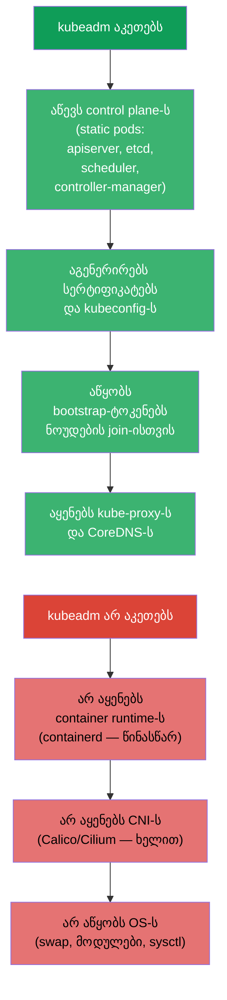
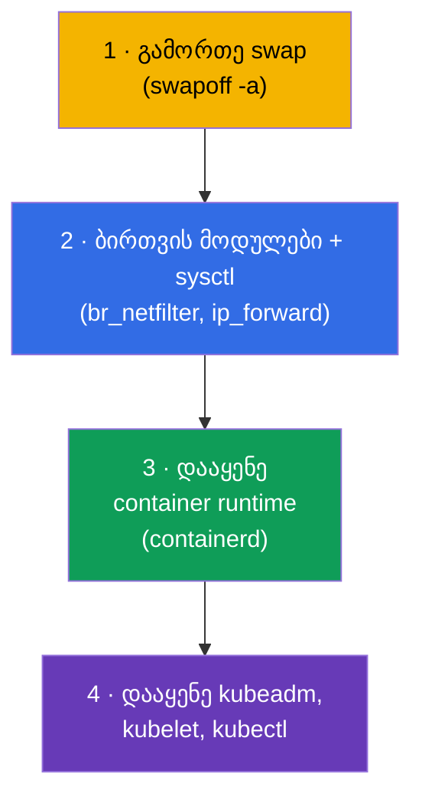
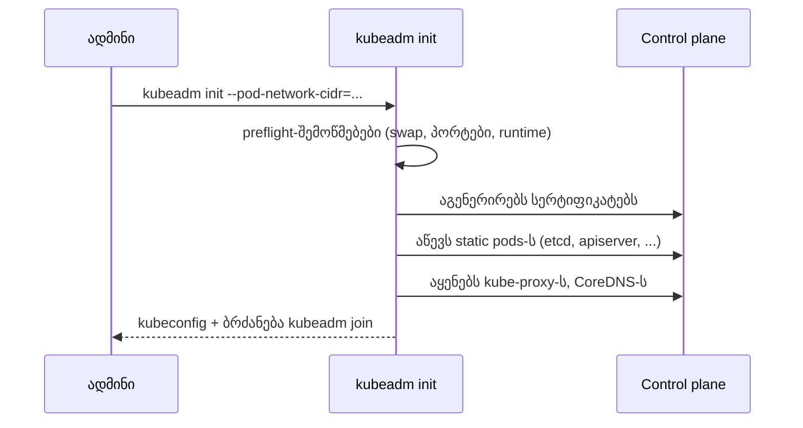
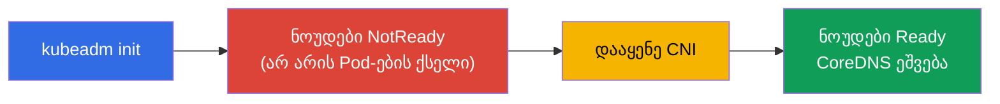
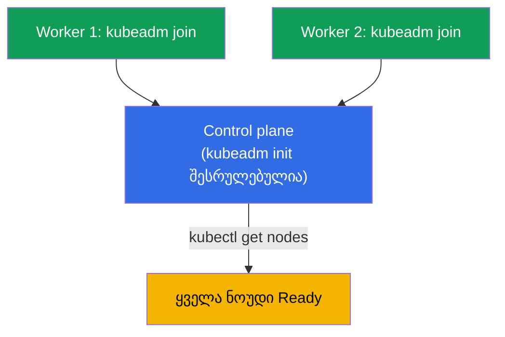
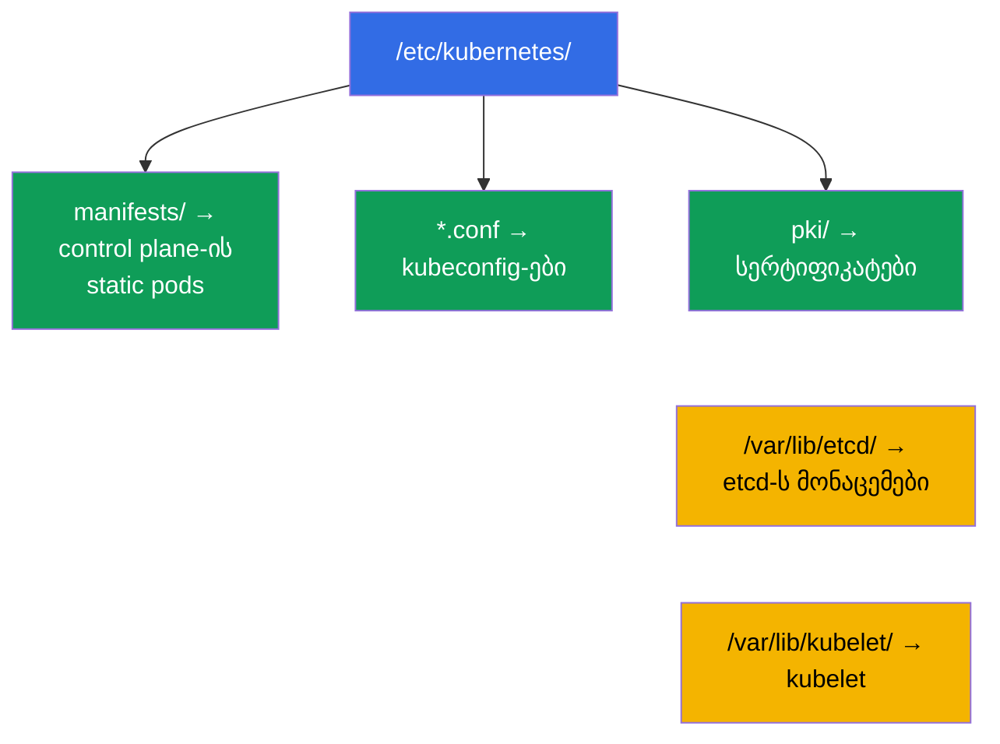
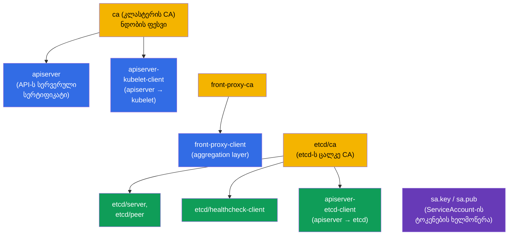
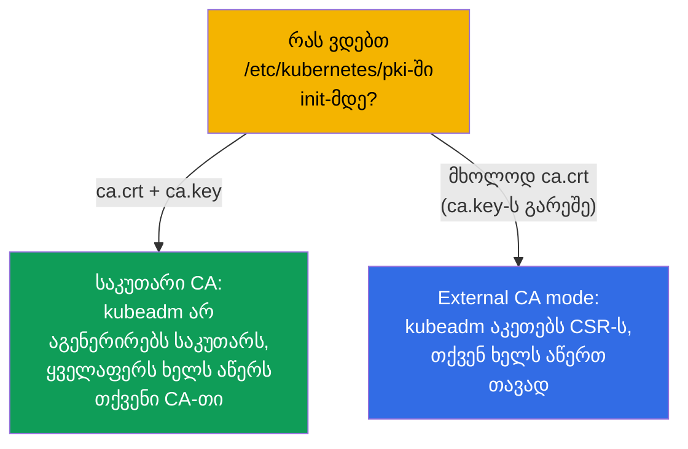

[Русская версия](ru.md) · [Eng version](README.md) · [Versión en español](es.md) · [Version française](fr.md) · [Deutsche Version](de.md) · [繁體中文版](tw.md) · [日本語版](jp.md)

# თავი 35. კლასტერის დაყენება kubeadm-ის დახმარებით

> 🟦 **თავი CKA-სთვის** (დომენი Cluster Architecture, Installation & Configuration, 25%).
> CKAD-სთვის საჭირო არაა, მაგრამ სასარგებლოა გაგებისთვის.
>
> **რა იქნება შემდეგ.** ვიწყებთ ადმინისტრატორულ ნაწილს. ბევრი ვიმუშავეთ მზა კლასტერში;
> ახლა თავად ავაწყობთ მას **kubeadm**-ის დახმარებით - ეს არის დაყენების ოფიციალური ინსტრუმენტი. ეს
> CKA-ს პირდაპირი დავალებაა („დააყენე კლასტერი“, „დაამატე ნოუდი“) და საფუძველია განახლებებისთვის (თავი
> 36), etcd-ს ბექაპისთვის (თავი 37) და control plane-ის troubleshooting-ისთვის (თავი 45). ყველაფერი, რაც
> თავ 2-ში კომპონენტებზე გავარჩიეთ, აქ ხელებით ცოცხლდება.

## 35.1. რას აკეთებს kubeadm (და რას არ აკეთებს)

**kubeadm** - ინსტრუმენტი, რომელიც აწევს control plane-ს და აერთებს ნოუდებს „best
practices“-ის მიხედვით. მნიშვნელოვანია გვესმოდეს მისი პასუხისმგებლობის საზღვრები.



დაიმახსოვრეთ სამი რამ, რასაც kubeadm **არ** აკეთებს - მათ ცალკე ამზადებენ: container runtime,
CNI და OS-ის კონფიგურაცია. CNI-ს დავიწყება - ეს არის მიზეზი, რის გამოც `kubeadm init`-ის შემდეგ ნოუდები რჩება
`NotReady` (თავი 30).

## 35.2. ნოუდების მომზადება (kubeadm-მდე)

სანამ kubeadm-ს დაუძახებთ, ყოველი ნოუდი მზადდება:



```bash
# 1. გამორთე swap (Kubernetes მოითხოვს)
sudo swapoff -a
# და ამოიღე /etc/fstab-იდან, რომ გადატვირთვის შემდეგ არ დაბრუნდეს

# 2. მოდულები და ქსელის პარამეტრები
sudo modprobe br_netfilter
echo 'net.ipv4.ip_forward = 1' | sudo tee /etc/sysctl.d/k8s.conf
sudo sysctl --system

# 3. container runtime — containerd (დაყენება პაკეტებით)
# 4. Kubernetes-ის რეპოზიტორი და პაკეტები
sudo apt-get install -y kubelet kubeadm kubectl
sudo apt-mark hold kubelet kubeadm kubectl    # ვერსიების დაფიქსირება
```

> **swap-ის შესახებ.** Kubernetes ისტორიულად მოითხოვს გამორთულ swap-ს (kubelet ნაგულისხმევად არ
> ეშვება ჩართული swap-ის დროს). ეს არის მომზადების პირველი პუნქტი და ხშირი მიზეზი, რის გამოც
> `kubeadm init` ვარდება.

ნოუდის მოთხოვნებისა და მომზადების ნაბიჯების სრული და აქტუალური სია - ოფიციალურ დოკუმენტაციაში:
[Installing kubeadm](https://kubernetes.io/docs/setup/production-environment/tools/kubeadm/install-kubeadm/)
(swap, ბირთვის მოდულები და sysctl, container runtime, რეპოზიტორი და პაკეტები kubeadm/kubelet/kubectl).

## 35.3. control plane-ის ინიციალიზაცია: kubeadm init

მომავალ control plane ნოუდზე:

```bash
sudo kubeadm init \
  --pod-network-cidr=10.244.0.0/16 \        # Pod-ების დიაპაზონი (შეათანხმე CNI-სთან!)
  --control-plane-endpoint=<მისამართი>      # API-ს სტაბილური მისამართი (HA-სთვის)
```

> **რომელი მისამართი `--control-plane-endpoint`-ში?** ეს არის **API-სერვერთან შესვლის სტაბილური
> წერტილი**, საერთო ყველა ნოუდისთვის და სერტიფიკატებში მოხვედრილი. აქ კონკრეტული ნოუდის IP-ს
> მითითება - ცუდი იდეაა: თუ ეს ერთადერთი control plane-ია, თავიდან შექმნის გარეშე ვეღარ
> გადაინაცვლებთ რამდენიმე control plane-ზე. სწორია მიუთითოთ:
>
> - **DNS-სახელი** (მაგალითად, `k8s-api.example.com`), რომელსაც აკონტროლებთ, - ყველაზე
>   მოქნილი ვარიანტი: მოგვიანებით მის უკან შეიძლება ბალანსერი დააყენოთ კლასტერის შეუხებლად;
> - **ბალანსერის მისამართი** (VIP/LB) control plane ნოუდების წინ - ნამდვილი HA-სთვის
>   (რამდენიმე API-სერვერი ერთი მისამართის უკან).
>
> შეიძლება პორტის დამატება: `--control-plane-endpoint=k8s-api.example.com:6443`. დროშა
> **არასავალდებულოა** ერთნოუდიანი control plane-სთვის, მაგრამ მისი მაშინვე დაყენება (DNS-ით) -
> კარგი პრაქტიკაა: ეს HA-სკენ გზას ღიად ტოვებს. დროშის გარეშე endpoint-ად ხდება
> მიმდინარე ნოუდის მისამართი, და მერე HA-მდე „გაზრდა“ ვერ გამოვა. დეტალები -
> [Creating a cluster with kubeadm](https://kubernetes.io/docs/setup/production-environment/tools/kubeadm/create-cluster-kubeadm/)
> და [HA topology](https://kubernetes.io/docs/setup/production-environment/tools/kubeadm/high-availability/).



წარმატებული init-ის შემდეგ kubeadm ბეჭდავს ორ მნიშვნელოვან რამეს:

1. ბრძანებებს `kubectl`-ის მოსაწყობად (დააკოპირე admin.conf):
```bash
mkdir -p $HOME/.kube
sudo cp -i /etc/kubernetes/admin.conf $HOME/.kube/config
sudo chown $(id -u):$(id -g) $HOME/.kube/config
```
2. ბრძანებას `kubeadm join ...` ტოკენით - მას worker-ნოუდებზე ასრულებენ.

### კლასტერის სერტიფიკატები: ვადები, გაგრძელება, საკუთარი CA

`kubeadm init` თავად აგენერირებს კლასტერის მთელ PKI-ს `/etc/kubernetes/pki`-ში. მნიშვნელოვანია გვესმოდეს
სიცოცხლის ვადები, თორემ **პროდზე შეიძლება შეფერხება მივიღოთ**: როცა apiserver-ისა და
კომპონენტების სერტიფიკატები იწურება, control plane წყვეტს მუშაობას, ხოლო `kubectl` იწყებს პასუხს
TLS-შეცდომებით.

ნაგულისხმევი ვადები:

- **ფოთლოვანი სერტიფიკატები** (apiserver, apiserver-kubelet-client, კლიენტური
  `admin.conf`/`controller-manager.conf`/`scheduler.conf`-ში და ა.შ.) - **1 წელი**;
- **CA-ს სერტიფიკატები** (`ca`, `etcd-ca`, `front-proxy-ca`) - **10 წელი**;
- kubelet-ის კლიენტური სერტიფიკატი (`/var/lib/kubelet/pki`) **ავტომატურად ბრუნავს** -
  ის ქვემოთ სიაში არაა.

ვადების შემოწმება:

```bash
kubeadm certs check-expiration     # ცხრილი EXPIRES / RESIDUAL TIME ყველა სერტიფიკატზე
```

გაგრძელება:

- **ავტომატურად control plane-ის აპგრეიდის დროს**: `kubeadm upgrade apply/node` აგრძელებს
  ყველა სერტიფიკატს. თუ კლასტერს რეგულარულად განაახლებთ (წელიწადში ერთზე ხშირად), ვადის გასვლაზე
  შეიძლება არ იფიქროთ;
- **ხელით** ნებისმიერ მომენტში: `kubeadm certs renew all` (შესრულდეს **ყოველ** control
  plane ნოუდზე, შემდეგ გადაიტვირთოს control plane-ის static-Pod-ები - მაგალითად, დროებით ამოიღოთ და
  დააბრუნოთ მათი მანიფესტები `/etc/kubernetes/manifests/`-ში). `admin.conf`-ის გაგრძელების შემდეგ
  არ დაგავიწყდეთ `~/.kube/config`-ის განახლება.

საკუთარი და გარე სერტიფიკატები (ვადებისა და საკუთარი CA-ს წინასწარ დასაყენებლად):

- **საკუთარი CA**: ჩადეთ `ca.crt` და `ca.key` `/etc/kubernetes/pki`-ში `kubeadm init`-**მდე** -
  kubeadm მათ არ გადააწერს და დანარჩენს თქვენი CA-თი მოაწერს ხელს;
- **მორგებული ვადები** kubeadm-ის კონფიგით (გადაეცემა `kubeadm init --config`):

  ```yaml
  apiVersion: kubeadm.k8s.io/v1beta4
  kind: ClusterConfiguration
  certificateValidityPeriod: 8760h      # ფოთლოვანი: ნაგულისხმევად 1 წელი
  caCertificateValidityPeriod: 87600h   # CA: ნაგულისხმევად 10 წელი
  ```

  (მნიშვნელობები - Go-ს ხანგრძლივობების ფორმატში, ყველაზე დიდი ერთეული - `h`);
- **გარე CA** (external CA mode): ჩადეთ მხოლოდ `ca.crt` `ca.key`-ს გარეშე - kubeadm
  ამას ამოიცნობს და CA-ს გასაღებს დისკზე არ დაიჭერს, ხოლო სერტიფიკატების გამოშვება/გაგრძელება თქვენ
  იკისრებთ (საკუთარი signer). ამასთან `kubeadm certs renew` ასეთ სერტიფიკატებს უკვე
  **არ მართავს**.

დეტალები და სცენარები - დოკუმენტაციაში:
[Certificate Management with kubeadm](https://kubernetes.io/docs/tasks/administer-cluster/kubeadm/kubeadm-certs/).

> **დასკვნა პროდისთვის.** ან რეგულარულად ააპგრეიდეთ კლასტერი (სერტიფიკატები თავად გრძელდება),
> ან მონიტორეთ `check-expiration` და წინასწარ გააგრძელეთ. „კლასტერი ზუსტად დაყენებიდან წელიწადში
> მთლიანად გატყდა“ - ეს kubeadm-ის ამოწურული სერტიფიკატების კლასიკაა.

## 35.4. CNI-ს დაყენება (სავალდებულო ნაბიჯი)

init-ის შემდეგ მაშინვე ნოუდები `NotReady`-ა - არ არის Pod-ების ქსელი. ვაყენებთ CNI-ს (თავი 30):

```bash
# მაგალითი: Calico
kubectl apply -f https://raw.githubusercontent.com/projectcalico/calico/<ვერსია>/manifests/calico.yaml
```



მხოლოდ CNI-ს დაყენების შემდეგ ნოუდები ხდება `Ready`, ხოლო სისტემური Pod-ები (CoreDNS)
ეშვება. `--pod-network-cidr` init-ში უნდა ემთხვეოდეს იმას, რასაც CNI მოელის - თორემ
ქსელი არ იმუშავებს.

## 35.5. worker-ნოუდების მიერთება: kubeadm join

ყოველ worker-ნოუდზე (ნაბიჯ 35.2-ის მიხედვით მომზადებულზე) ასრულებენ `kubeadm join`-ს, რომელიც
init-მა გამოიტანა:

```bash
sudo kubeadm join <control-plane>:6443 \
  --token <ტოკენი> \
  --discovery-token-ca-cert-hash sha256:<ჰეში>
```



თუ ტოკენი დაიკარგა ან ამოიწურა (ცოცხლობს 24 საათი), ახალს control plane-ზე ქმნიან:

```bash
kubeadm token create --print-join-command    # გამოიტანს მზა join ბრძანებას
```

შედეგის შემოწმება:

```bash
kubectl get nodes                             # ყველა ნოუდი უნდა იყოს Ready
kubectl get pods -n kube-system               # კომპონენტები და CoreDNS Running
```

## 35.6. რა სად ინახება დაყენების შემდეგ

kubeadm ფაილებს განჭვრეტადად ალაგებს - ეს უნდა ვიცოდეთ troubleshooting-ისთვის (თავები 37,
45):

| გზა | რა არის იქ |
|------|---------|
| `/etc/kubernetes/manifests/` | control plane-ის static pods (apiserver, etcd, scheduler, cm) |
| `/etc/kubernetes/*.conf` | kubeconfig-ები (admin, kubelet, controller-manager, scheduler) |
| `/etc/kubernetes/pki/` | სერტიფიკატები და გასაღებები (მათ შორის CA, etcd) |
| `/var/lib/etcd/` | etcd-ს მონაცემები |
| `/var/lib/kubelet/` | kubelet-ის კონფიგი და მონაცემები |



## 35.7. რომელ სერტიფიკატებს ქმნის kubeadm init

`kubeadm init`-ის დროს ავტომატურად გენერირდება კლასტერის მთელი **PKI**
`/etc/kubernetes/pki/`-ში. სწორედ ამაზე დგას მთელი ნდობა (თავი 0.3, 39). სასარგებლოა ვიცოდეთ,
კონკრეტულად რა იქმნება.



საკვანძო ფაილები `/etc/kubernetes/pki/`-ში:

| ფაილი | რა არის ეს |
|------|---------|
| `ca.crt` / `ca.key` | **კლასტერის CA** - ხელს აწერს apiserver-ისა და კლიენტურ სერტიფიკატებს |
| `apiserver.crt/.key` | kube-apiserver-ის სერვერული სერტიფიკატი (SAN: ClusterIP, სახელები, endpoint) |
| `apiserver-kubelet-client.*` | apiserver-ის კლიენტური სერტიფიკატი kubelet-თან მიმართვისთვის |
| `front-proxy-ca.*` / `front-proxy-client.*` | CA და კლიენტი aggregation layer-ისთვის (API-ს გაფართოებები) |
| `etcd/ca.*` | **ცალკე CA etcd-სთვის** |
| `etcd/server.*`, `etcd/peer.*` | etcd-ს სერვერული და peer-სერტიფიკატები |
| `etcd/healthcheck-client.*`, `apiserver-etcd-client.*` | კლიენტები etcd-სთან (შემოწმებები, apiserver) |
| `sa.key` / `sa.pub` | გასაღებების წყვილი **ServiceAccount-ის ტოკენების ხელმოწერისთვის** (არა სერტიფიკატი) |

გარდა ამისა kubeadm ქმნის CA-თი ხელმოწერილ **kubeconfig-ებს** (`/etc/kubernetes/`-ში):
`admin.conf`, `super-admin.conf`, `kubelet.conf`, `controller-manager.conf`,
`scheduler.conf`.

### მოქმედების ვადები

| რა | ნაგულისხმევი ვადა |
|-----|-------------------|
| **CA** (კლასტერის, etcd-ს, front-proxy-ს) | **10 წელი** |
| ფოთლოვანი სერტიფიკატები (apiserver, kubelet-client, etcd/* და ა.შ.) | **1 წელი** |
| კლიენტური სერტიფიკატები kubeconfig-ში (admin და სხვ.) | 1 წელი |

ანუ ძირეული CA-ები დიდხანს ცოცხლობს (10 წელი), ხოლო ყველაფერი, რაც მათით არის ხელმოწერილი, - **1 წელი** და საჭიროებს
გაგრძელებას. შემოწმება და გაგრძელება - `kubeadm certs check-expiration` / `kubeadm certs renew`
(თავი 39); კლასტერის აპგრეიდი (თავი 36) control plane-ის სერტიფიკატებს ავტომატურად აგრძელებს.

### Best practices

- **განაახლეთ კლასტერი წელიწადში ერთხელ მაინც** - აპგრეიდი control plane-ის ფოთლოვან სერტიფიკატებს
  ავტომატურად აგრძელებს, და მათ ამოწურვა არ ასწრებს.
- **მონიტორეთ ვადები** (`kubeadm certs check-expiration`) ალერტით N დღით ადრე - control plane-ის
  ამოწურული სერტიფიკატი კლასტერს აგდებს (`x509: certificate has expired`).
- **დაბექაპეთ `/etc/kubernetes/pki`** (განსაკუთრებით CA-ს გასაღებები) etcd-სთან ერთად - CA-ს გარეშე კლასტერი
  ვერ აღდგება.
- **დაიცავით `ca.key`**: CA-ს გასაღების მფლობელს შეუძლია ნებისმიერი მოწმობა გამოუშვას, admin-ის ჩათვლით.
  წვდომა მკაცრად შეზღუდულია.
- **kubelet-ის სერტიფიკატები - ავტომატურ როტაციაზე** (`rotateCertificates: true`,
  `serverTLSBootstrap`), რომ ხელით არ გაგრძელდეს.

## 35.8. საკუთარი PKI: საკუთარი CA-ს ან გარე signer-ის შეტენა

kubeadm-ს შეიძლება ვაიძულოთ გამოიყენოს **თქვენი** CA საკუთარის გენერაციის ნაცვლად - ორგანიზაციაში
ნდობის ერთიანი ფესვისთვის. ხერხები:



- **საკუთარი CA (გასაღები + სერტიფიკატი).** ჩადეთ `ca.crt` **და** `ca.key` (საჭიროებისას ასევე
  `etcd/ca.*`, `front-proxy-ca.*`, `sa.key/sa.pub`) `/etc/kubernetes/pki/`-ში `kubeadm init`-**მდე**.
  kubeadm დაინახავს მზა CA-ს და მისით მოაწერს ხელს დანარჩენ სერტიფიკატებს, საკუთარის
  შექმნის გარეშე. ასე მთელი კლასტერი შენდება თქვენს ნდობის ფესვზე.
- **External CA mode (ნოუდზე CA-ს პრივატული გასაღების გარეშე).** ჩადეთ მხოლოდ **`ca.crt`**
  (საჯარო) `ca.key`-ს გარეშე. kubeadm გადავა გარე CA-ს რეჟიმში: დააგენერირებს **CSR**-ს და
  დაელოდება, რომ თქვენ მათ ხელს მოაწერთ თქვენი გარე CA-თი და მზა სერტიფიკატებს ჩადებთ. პლიუსი -
  CA-ს პრივატული გასაღები ნოუდზე არ ინახება; მინუსი - **სერტიფიკატებს kubeadm თავად ვერ
  გააგრძელებს**, ეს თქვენი ამოცანაა.
- **ზუსტი მორგება kubeadm config-ით.** `ClusterConfiguration`-ში აყენებენ:
  `certificatesDir` (PKI-ს საკუთარი კატალოგი), `apiServer.certSANs` (დამატებითი სახელები/მისამართები
  apiserver-ის სერტიფიკატში - მაგალითად, ბალანსერის DNS HA-სთვის, თავი 35A), ასევე
  `etcd.external` თქვენი სერტიფიკატების გზებით, თუ etcd გარეა.

```bash
# მაგალითი: ინიციალიზაცია მორგებული SAN-ებით და საკუთარი CA-თი (წინასწარ pki/-ში დევს)
sudo kubeadm init --config kubeadm-config.yaml
# kubeadm-config.yaml-ში:
#   apiServer:
#     certSANs: ["api.example.com", "10.0.0.100"]
```

> **გამოცდაზე** საკუთარ PKI-ს იშვიათად აშენებენ, მაგრამ იმის გაგება, რომ CA წინასწარ შეიძლება ჩაიდოს და
> რომ არსებობს external-CA რეჟიმი, - ხშირი კითხვა და რეალური პროდ-ამოცანაა (ერთიანი კორპორატიული
> ნდობის ფესვი, CA-ს გასაღების შენახვა HSM/Vault-ში და არა ნოუდზე).

## 35.9. როგორ იყენებენ ამას პროდაქშენში

- **kubeadm - self-managed კლასტერებისთვის.** ღრუბელში უფრო ხშირად იღებენ მართულ კლასტერებს
  (EKS/GKE/AKS), სადაც control plane-ს აყენებს და ემსახურება პროვაიდერი. kubeadm-ს ირჩევენ
  on-prem, პრივატული და სპეციფიკური ინსტალაციებისთვის, სადაც სრული კონტროლია საჭირო.
- **ავტომატიზაცია kubeadm-ის ზემოთ.** ხელით kubeadm-ს იშვიათად უშვებენ - მას ახვევენ
  Ansible/Terraform/იმიჯებში, ხოლო კლასტერების პარკისთვის იყენებენ Cluster API-ს (kubeadm შიგნით).
  ხელით init/join - ძირითადად სწავლება, ლაბორატორიები და პრობლემების გარჩევაა.
- **HA control plane.** პროდში აწევენ რამდენიმე control plane ნოუდს
  (`--control-plane-endpoint` + ბალანსერი) და etcd-ს კვანძების კენტ რაოდენობას - ერთი control
  plane დასაშვებია მხოლოდ dev-ში. დეტალურად - თავ 35A-ში.
- **ვერსიები და OS-ის მომზადება ავტომატიზებულია.** swap-ის გამორთვა, მოდულები, sysctl, containerd-ის
  დაყენება და kube*-ის ვერსიების დაფიქსირება კეთდება იმიჯის შაბლონით/პროვიჟენინგით, რომ ნოუდები
  ერთნაირი და რეპროდუცირებადი იყოს.
- **ფაილების განლაგების ცოდნა - ექსპლუატაციის საფუძველია.** გზები `/etc/kubernetes/...`,
  `/var/lib/etcd` საჭიროა etcd-ს ბექაპისთვის, სერტიფიკატების განახლებისა და control plane-ის შეკეთებისთვის -
  ეს არის CKA-უნარების ყოველდღიური რეალობა self-managed კლასტერებში.

## 35.10. მინი-ლექსიკონი

- **kubeadm** - კლასტერის დაყენების ოფიციალური ინსტრუმენტი (init/join/upgrade).
- **kubeadm init** - control plane-ის ინიციალიზაცია.
- **kubeadm join** - ნოუდის მიერთება კლასტერთან.
- **bootstrap-ტოკენი** - დროებითი ტოკენი ნოუდების join-ისთვის (ცოცხლობს ~24 საათი).
- **--pod-network-cidr** - Pod-ების მისამართების დიაპაზონი (თანხმდება CNI-სთან).
- **--control-plane-endpoint** - control plane-ის საერთო მისამართი (HA-სთვის).
- **swapoff** - swap-ის გამორთვა (Kubernetes-ის მოთხოვნა).
- **admin.conf** - ადმინისტრატორის kubeconfig init-ის შემდეგ.
- **კლასტერის PKI** - CA-ებისა და სერტიფიკატების ნაკრები `/etc/kubernetes/pki/`-ში, იქმნება init-ის დროს.
- **კლასტერის CA / etcd CA / front-proxy CA** - ნდობის სამი ფესვი (ვადა ~10 წელი).
- **External CA mode** - მხოლოდ `ca.crt` გასაღების გარეშე: kubeadm აკეთებს CSR-ს, ხელმოწერა - თქვენზეა.
- **certSANs** - დამატებითი სახელები/მისამართები apiserver-ის სერტიფიკატში (მაგ. ბალანსერის DNS).
- **sa.key / sa.pub** - ServiceAccount-ის ტოკენების ხელმოწერის გასაღებები.

## 35.11. თავის შეჯამება

- kubeadm აწევს control plane-ს (static pods, სერტიფიკატები, ტოკენები, kube-proxy, CoreDNS),
  მაგრამ არ აყენებს container runtime-ს, CNI-ს და არ აწყობს OS-ს - ეს ცალკე კეთდება.
- ნოუდების მომზადება: გამორთე swap, ჩართე მოდულები/sysctl, დააყენე containerd და
  kubeadm/kubelet/kubectl (ვერსიების დაფიქსირებით).
- `kubeadm init --pod-network-cidr=...` ინიციალიზებს control plane-ს და ბეჭდავს kubectl-ის
  მოწყობასა და ბრძანებას `kubeadm join`.
- init-ის შემდეგ მაშინვე საჭიროა CNI-ს დაყენება - თორემ ნოუდები NotReady-ა და CoreDNS არ ეშვება.
- worker-ნოუდებს აერთებენ `kubeadm join`-ით ტოკენით; ამოწურულ ტოკენს თავიდან ქმნიან
  `kubeadm token create --print-join-command`-ით.
- ფაილები განჭვრეტადია: static pods `/etc/kubernetes/manifests/`-ში, სერტიფიკატები `pki/`-ში,
  etcd-ს მონაცემები `/var/lib/etcd/`-ში - ეს არის ბექაპისა და troubleshooting-ის საფუძველი.
- kubeadm init აგენერირებს კლასტერის PKI-ს: CA (კლასტერის, etcd-ს, front-proxy-ს) ~10 წლით და
  ფოთლოვან სერტიფიკატებს 1 წლით; გაგრძელება - აპგრეიდი ან `kubeadm certs renew` (თავი 39).
- შეიძლება საკუთარი CA-ს გამოყენება: ჩადეთ `ca.crt`+`ca.key` `pki/`-ში init-მდე (ან მხოლოდ
  `ca.crt` external-CA რეჟიმისთვის, სადაც CSR-ის ხელმოწერა თქვენზეა).

## 35.12. როგორ გამოგადგებათ: გამოცდაზე და რეალურ სამუშაოში

**გამოცდაზე (CKA).** „დააყენე kubeadm კლასტერი“, „დაამატე worker-ნოუდი“, „რატომ არის ნოუდები
NotReady“ - Installation დომენის (25%) პირდაპირი დავალებებია. საჭიროა ვიცოდეთ მომზადების ნაბიჯები (swap!),
თანმიმდევრობა init → kubectl → CNI → join და ფაილების განლაგება. ეს არის საფუძველი თავებისთვის
36-37 და 45.

**რეალურ სამუშაოში.** kubeadm - self-managed და on-prem კლასტერების საფუძველია. მაშინაც კი, როცა მას
ახვევენ ავტომატიზაციაში (Ansible, Cluster API), იმის გაგება, რას აკეთებს ის და სად ინახება
ფაილები, აუცილებელია განახლებებისთვის, etcd-ს ბექაპებისთვის, სერტიფიკატების როტაციისა და control
plane-ის შეკეთებისთვის.

## 35.13. თვითშემოწმების კითხვები

1. რას აკეთებს kubeadm დაყენებისას და რას არ აკეთებს?
2. ნოუდის მომზადების რომელი ნაბიჯებია საჭირო kubeadm-მდე? რატომ არის მნიშვნელოვანი swapoff?
3. რა ხდება `kubeadm init`-ის შემდეგ და რომელ ორ რამეს ბეჭდავს ის?
4. რატომ არის ნოუდები NotReady init-ის შემდეგ მაშინვე და რა ასწორებს ამას?
5. როგორ მივაერთოთ worker-ნოუდი და რა ვქნათ, თუ ტოკენი ამოიწურა?
6. სად ინახება control plane-ის static pods, სერტიფიკატები და etcd-ს მონაცემები?
7. რატომ უნდა თანხმდებოდეს `--pod-network-cidr` CNI-სთან?
8. რომელ სერტიფიკატებს ქმნის `kubeadm init` და რა ვადით (CA vs ფოთლოვანი)?
9. როგორ ვაიძულოთ kubeadm გამოიყენოს თქვენი საკუთარი CA? რით განსხვავდება external-CA რეჟიმი?

## პრაქტიკა

ჩვენ ავაწყვეთ კლასტერი. თავ 35A-ში გავარჩევთ, როგორ გავხადოთ control plane უმტყუნებელი (HA),
თავ 36-ში - როგორ განვაახლოთ კლასტერი უსაფრთხოდ (lifecycle), ხოლო თავ 37-ში - როგორ დავაბექაპოთ და
აღვადგინოთ etcd. kubeadm-კლასტერის დაყენება - ეს არის ის, რასაც ჩვენი ლაბორატორიული
სამუშაოები ავტომატურად აკეთებს (შეიძლება ნოუდებზე შესვლა და ყველაფრის დანახვა).

🧪 ლაბი 116 (kubeadm init + join ნულიდან): [tasks/cka/labs/116](../../labs/116/README_GE.MD)

---
[სარჩევი](../README_GE.md) · [თავი 34](../34/ge.md) · [თავი 35A](../35-2-ha/ge.md)
