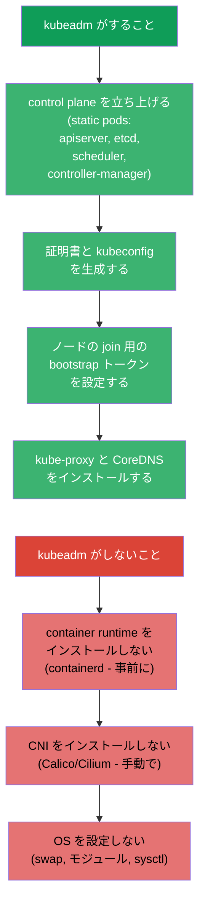
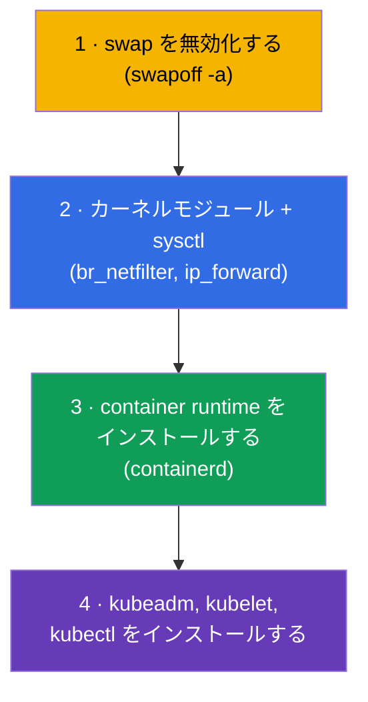
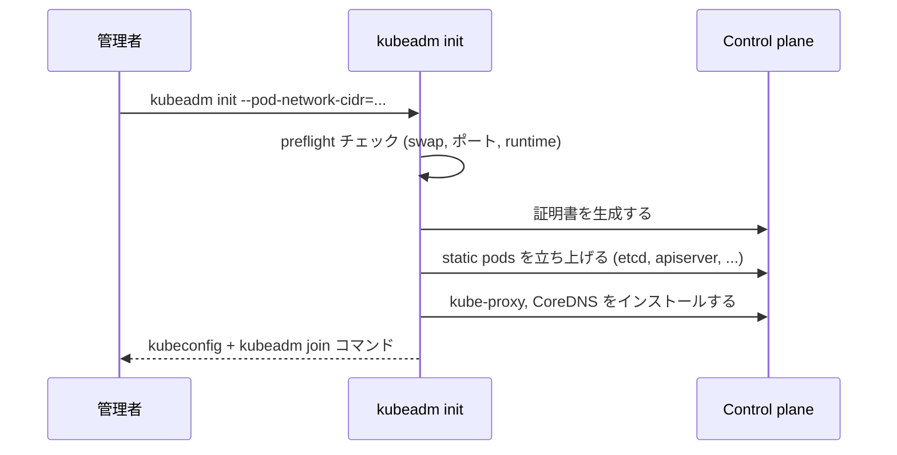
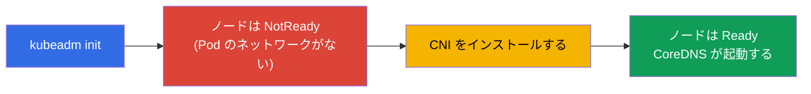
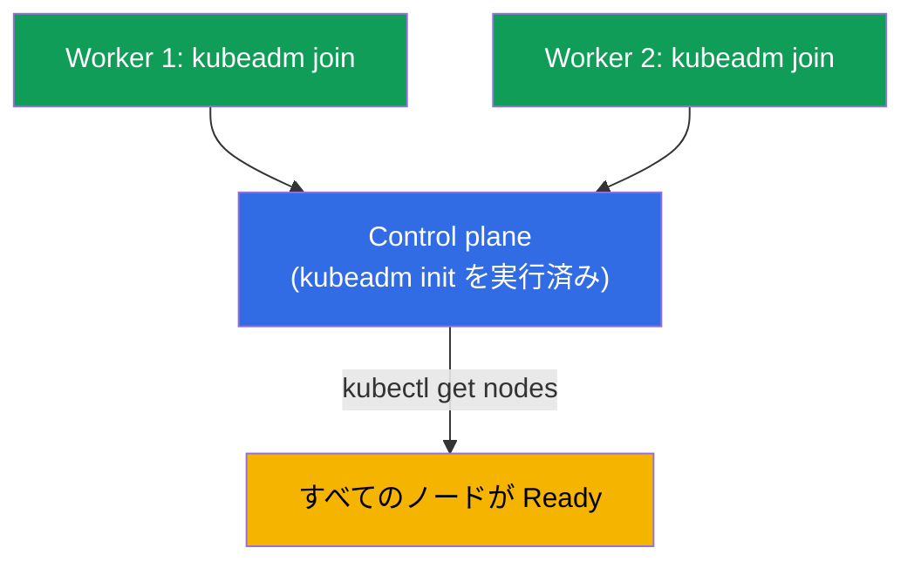
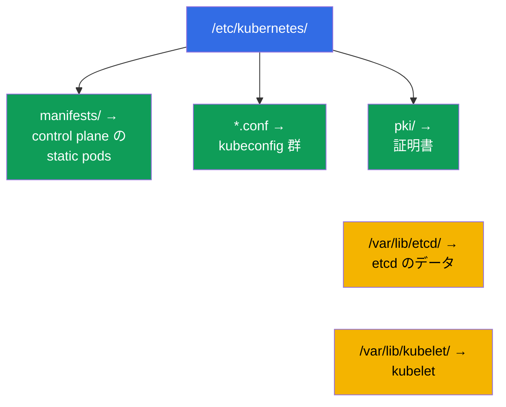
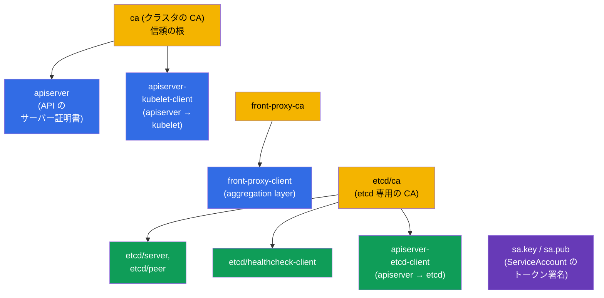
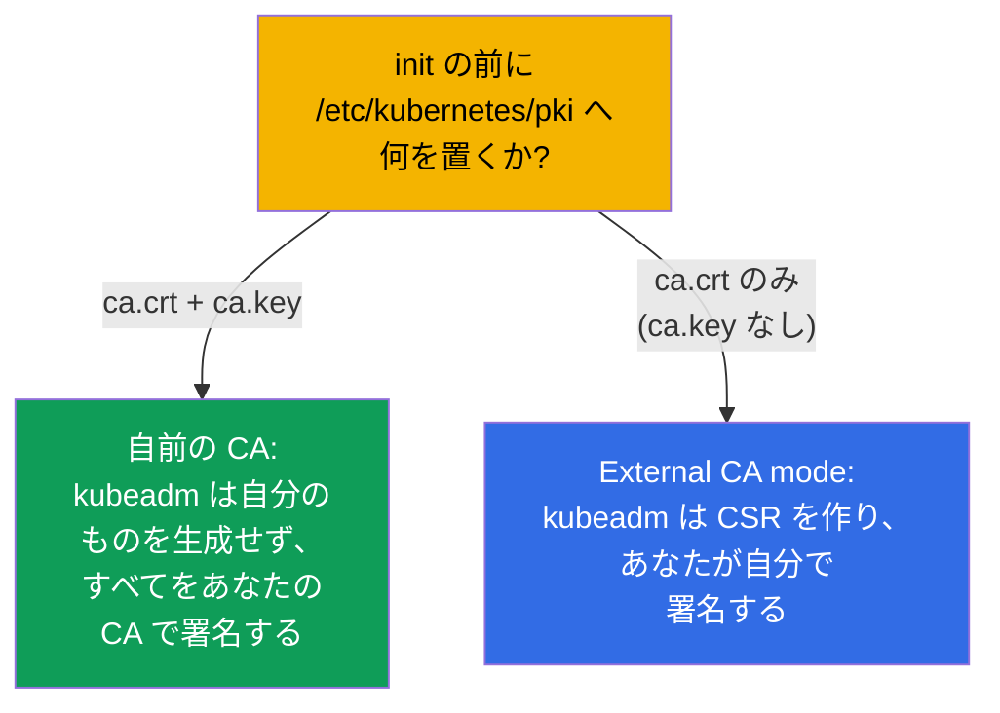

[Русская версия](ru.md) · [Eng version](README.md) · [Versión en español](es.md) · [Version française](fr.md) · [Deutsche Version](de.md) · [ქართული ვერსია](ge.md) · [繁體中文版](tw.md)

# 第 35 章。kubeadm を使ったクラスタのインストール

> 🟦 **CKA 向けの章**（領域 Cluster Architecture, Installation & Configuration、25%）。
> CKAD では必須ではありませんが、理解のために役立ちます。
>
> **次は何か。** ここから管理者向けのパートに入ります。私たちは出来上がったクラスタの中で
> たくさん作業してきました。今度は公式のインストールツールである **kubeadm** を使って、
> 自分でクラスタを組み立てます。これは CKA の直接の課題（「クラスタをインストールせよ」
> 「ノードを追加せよ」）であり、アップグレード（第 36 章）、etcd のバックアップ（第 37 章）、
> control plane の troubleshooting（第 45 章）の土台でもあります。第 2 章でコンポーネントに
> ついて分解した内容が、ここで自分の手を通して動き出します。

## 35.1. kubeadm がすること（と、しないこと）

**kubeadm** は control plane を立ち上げ、「best practices」に沿ってノードを参加させる
ツールです。その責任範囲の境界を理解しておくことが重要です。



kubeadm が **しない** 3 つのことを覚えておいてください - それらは別に準備します：
container runtime、CNI、そして OS の設定です。CNI を忘れることが、`kubeadm init` のあとに
ノードが `NotReady` のまま残る原因です（第 30 章）。

## 35.2. ノードの準備（kubeadm の前に）

kubeadm を呼ぶ前に、各ノードを次のように準備します：



```bash
# 1. swap を無効化する (Kubernetes の要件)
sudo swapoff -a
# 再起動後に戻ってこないよう /etc/fstab からも削除する

# 2. モジュールとネットワークのパラメータ
sudo modprobe br_netfilter
echo 'net.ipv4.ip_forward = 1' | sudo tee /etc/sysctl.d/k8s.conf
sudo sysctl --system

# 3. container runtime - containerd (パッケージからインストール)
# 4. Kubernetes のリポジトリとパッケージ
sudo apt-get install -y kubelet kubeadm kubectl
sudo apt-mark hold kubelet kubeadm kubectl    # バージョンを固定する
```

> **swap について。** Kubernetes は歴史的に swap の無効化を要求します（kubelet は既定では
> swap が有効なときに起動しません）。これは準備の最初の項目であり、`kubeadm init` が
> 失敗するよくある原因です。

ノード準備の要件と手順の完全で最新の一覧は公式ドキュメントにあります：
[Installing kubeadm](https://kubernetes.io/docs/setup/production-environment/tools/kubeadm/install-kubeadm/)
（swap、カーネルモジュールと sysctl、container runtime、リポジトリと kubeadm/kubelet/kubectl
のパッケージ）。

## 35.3. control plane の初期化：kubeadm init

将来 control plane になるノードで：

```bash
sudo kubeadm init \
  --pod-network-cidr=10.244.0.0/16 \        # Pod の範囲 (CNI と合わせること!)
  --control-plane-endpoint=<アドレス>        # API の安定したアドレス (HA 用)
```

> **`--control-plane-endpoint` にはどのアドレスを入れるのか。** これは **API サーバーへの
> 安定した入口** で、すべてのノードに共通で、証明書にも入ります。ここに特定のノードの IP を
> 指定するのは良くない考えです：それが唯一の control plane である場合、作り直しなしに
> 複数の control plane へ移行できなくなります。正しくはこう指定します：
>
> - あなたが管理する **DNS 名**（たとえば `k8s-api.example.com`）- 最も柔軟な選択肢です：
>   あとからその背後にバランサーを置いても、クラスタには触らずに済みます。
> - control plane ノードの前に置く **バランサーのアドレス**（VIP/LB）- 本物の HA 用です
>   （1 つのアドレスの背後に複数の API サーバー）。
>
> ポートを付けることもできます：`--control-plane-endpoint=k8s-api.example.com:6443`。この
> フラグは単一ノードの control plane では **必須ではありません** が、最初から（DNS で）
> 指定しておくのは良い習慣です：HA への道を開いたままにできます。フラグがない場合は現在の
> ノードのアドレスが endpoint になり、あとから HA に「成長する」ことはできません。詳しくは
> [Creating a cluster with kubeadm](https://kubernetes.io/docs/setup/production-environment/tools/kubeadm/create-cluster-kubeadm/)
> と [HA topology](https://kubernetes.io/docs/setup/production-environment/tools/kubeadm/high-availability/) を参照してください。



init が成功すると、kubeadm は 2 つの重要なものを表示します：

1. `kubectl` を設定するコマンド（admin.conf をコピーする）：
```bash
mkdir -p $HOME/.kube
sudo cp -i /etc/kubernetes/admin.conf $HOME/.kube/config
sudo chown $(id -u):$(id -g) $HOME/.kube/config
```
2. トークン付きの `kubeadm join ...` コマンド - これは worker ノードで実行します。

### クラスタの証明書：有効期限、更新、自前の CA

`kubeadm init` はクラスタの PKI をすべて `/etc/kubernetes/pki` に自分で生成します。有効
期限を理解しておくことが重要です。さもないと **本番で停止を食らうことがあります**：
apiserver とコンポーネントの証明書が期限切れになると control plane は動作しなくなり、
`kubectl` は TLS のエラーを返し始めます。

既定の有効期限：

- **リーフ証明書**（apiserver、apiserver-kubelet-client、`admin.conf`/
  `controller-manager.conf`/`scheduler.conf` の中のクライアント証明書など）- **1 年**。
- **CA の証明書**（`ca`、`etcd-ca`、`front-proxy-ca`）- **10 年**。
- kubelet のクライアント証明書（`/var/lib/kubelet/pki`）は **自動でローテーション** されます -
  下記の一覧には入っていません。

有効期限を確認する：

```bash
kubeadm certs check-expiration     # すべての証明書の EXPIRES / RESIDUAL TIME の表
```

更新：

- **control plane のアップグレード時に自動的に**：`kubeadm upgrade apply/node` がすべての
  証明書を更新します。クラスタを定期的に（年 1 回より頻繁に）更新していれば、期限切れに
  ついて考えなくて済みます。
- **手動で** いつでも：`kubeadm certs renew all`（**すべての** control plane ノードで実行し、
  そのあと control plane の static pod を再起動します - たとえば
  `/etc/kubernetes/manifests/` からマニフェストを一時的に外して戻します）。`admin.conf` を
  更新したあとは `~/.kube/config` の更新も忘れないでください。

自前および外部の証明書（有効期限と自分の CA を事前に決めるため）：

- **自前の CA**：`ca.crt` と `ca.key` を `kubeadm init` の **前** に `/etc/kubernetes/pki` に
  置きます - kubeadm はそれらを上書きせず、残りをあなたの CA で署名します。
- **カスタムの有効期限** は kubeadm の設定で（`kubeadm init --config` に渡します）：

  ```yaml
  apiVersion: kubeadm.k8s.io/v1beta4
  kind: ClusterConfiguration
  certificateValidityPeriod: 8760h      # リーフ: 既定は 1 年
  caCertificateValidityPeriod: 87600h   # CA: 既定は 10 年
  ```

  （値は Go の duration 形式で、最も大きい単位は `h` です）
- **外部 CA**（external CA mode）：`ca.key` なしで `ca.crt` だけを置きます - kubeadm はそれを
  認識して CA の鍵をディスク上に持たず、証明書の発行と更新はあなたが引き受けます（自前の
  signer）。この場合、`kubeadm certs renew` はそうした証明書を **管理しません**。

詳細とシナリオはドキュメントにあります：
[Certificate Management with kubeadm](https://kubernetes.io/docs/tasks/administer-cluster/kubeadm/kubeadm-certs/)。

> **本番向けの結論。** クラスタを定期的にアップグレードする（証明書は自動で更新されます）か、
> `check-expiration` を監視して前もって更新するかのどちらかです。「インストールから
> ちょうど 1 年後にクラスタが全部壊れた」は、期限切れの kubeadm 証明書の定番です。

## 35.4. CNI のインストール（必須のステップ）

init の直後、ノードは `NotReady` です - Pod のネットワークがありません。CNI を
インストールします（第 30 章）：

```bash
# 例: Calico
kubectl apply -f https://raw.githubusercontent.com/projectcalico/calico/<バージョン>/manifests/calico.yaml
```



CNI をインストールしたあとにだけノードは `Ready` になり、システムの Pod（CoreDNS）が
起動します。init の `--pod-network-cidr` は CNI が期待するものと一致していなければ
なりません - さもないとネットワークは動きません。

## 35.5. worker ノードの参加：kubeadm join

（35.2 の手順で準備した）各 worker ノードで、init が出力した `kubeadm join` を実行します：

```bash
sudo kubeadm join <control-plane>:6443 \
  --token <トークン> \
  --discovery-token-ca-cert-hash sha256:<ハッシュ>
```



トークンを失くした、または期限が切れた（24 時間で失効します）場合は、control plane で
新しいものを作ります：

```bash
kubeadm token create --print-join-command    # そのまま使える join コマンドを出力する
```

結果の確認：

```bash
kubectl get nodes                             # すべてのノードが Ready であるべき
kubectl get pods -n kube-system               # コンポーネントと CoreDNS が Running
```

## 35.6. インストール後、どこに何があるか

kubeadm はファイルを予測可能な形で配置します - これは troubleshooting のために知って
おく必要があります（第 37、45 章）：

| パス | そこにあるもの |
|------|---------|
| `/etc/kubernetes/manifests/` | control plane の static pods (apiserver, etcd, scheduler, cm) |
| `/etc/kubernetes/*.conf` | kubeconfig 群 (admin, kubelet, controller-manager, scheduler) |
| `/etc/kubernetes/pki/` | 証明書と鍵（CA、etcd のものを含む） |
| `/var/lib/etcd/` | etcd のデータ |
| `/var/lib/kubelet/` | kubelet の設定とデータ |



## 35.7. kubeadm init が作る証明書

`kubeadm init` を実行すると、**クラスタの PKI** がすべて `/etc/kubernetes/pki/` に自動で
生成されます。これはすべての信頼が立っている土台です（第 0.3 章、第 39 章）。何が正確に
作られるのかを知っておくと役に立ちます。



`/etc/kubernetes/pki/` の主要なファイル：

| ファイル | これは何か |
|------|---------|
| `ca.crt` / `ca.key` | **クラスタの CA** - apiserver とクライアント証明書を署名する |
| `apiserver.crt/.key` | kube-apiserver のサーバー証明書 (SAN: ClusterIP、名前、endpoint) |
| `apiserver-kubelet-client.*` | kubelet へアクセスするための apiserver のクライアント証明書 |
| `front-proxy-ca.*` / `front-proxy-client.*` | aggregation layer（API の拡張）用の CA とクライアント |
| `etcd/ca.*` | **etcd 専用の CA** |
| `etcd/server.*`, `etcd/peer.*` | etcd のサーバー証明書と peer 証明書 |
| `etcd/healthcheck-client.*`, `apiserver-etcd-client.*` | etcd へのクライアント（チェック、apiserver） |
| `sa.key` / `sa.pub` | **ServiceAccount のトークン署名** 用の鍵ペア（証明書ではない） |

さらに kubeadm は CA で署名された **kubeconfig 群** を（`/etc/kubernetes/` に）作ります：
`admin.conf`、`super-admin.conf`、`kubelet.conf`、`controller-manager.conf`、
`scheduler.conf`。

### 有効期限

| 何 | 既定の期限 |
|-----|-------------------|
| **CA**（クラスタ、etcd、front-proxy） | **10 年** |
| リーフ証明書（apiserver、kubelet-client、etcd/* など） | **1 年** |
| kubeconfig 内のクライアント証明書（admin など） | 1 年 |

つまりルートの CA は長生き（10 年）ですが、それで署名されたものはすべて **1 年** で、更新が
必要です。確認と更新は `kubeadm certs check-expiration` / `kubeadm certs renew`
（第 39 章）。クラスタのアップグレード（第 36 章）は control plane の証明書を自動で
更新します。

### Best practices

- **少なくとも年 1 回はクラスタを更新してください** - アップグレードは control plane の
  リーフ証明書を自動で更新するので、期限切れになる前に間に合います。
- **有効期限を監視してください**（`kubeadm certs check-expiration`）。N 日前のアラートを
  付けます - control plane の証明書が期限切れになるとクラスタは落ちます
  (`x509: certificate has expired`)。
- **`/etc/kubernetes/pki` をバックアップしてください**（とくに CA の鍵）。etcd といっしょに -
  CA なしではクラスタを復元できません。
- **`ca.key` を守ってください**：CA の鍵の持ち主は、admin を含むあらゆる資格情報を発行
  できます。アクセスは厳しく制限します。
- **kubelet の証明書は自動ローテーションに**（`rotateCertificates: true`、
  `serverTLSBootstrap`）。手動で更新しなくて済むようにします。

## 35.8. 自前の PKI：自分の CA や外部の signer を使わせる

kubeadm には、自分で CA を生成させる代わりに **あなたの** CA を使わせることができます -
組織内で信頼の根を 1 つにするためです。方法は次のとおりです：



- **自前の CA（鍵 + 証明書）。** `ca.crt` **と** `ca.key`（必要なら `etcd/ca.*`、
  `front-proxy-ca.*`、`sa.key/sa.pub` も）を `kubeadm init` の **前** に
  `/etc/kubernetes/pki/` に置きます。kubeadm は用意された CA を見つけ、自分のものを作らずに
  それで残りの証明書を署名します。こうしてクラスタ全体があなたの信頼の根の上に建ちます。
- **External CA mode（ノード上に CA の秘密鍵を置かない）。** **`ca.crt`**（公開のもの）だけを
  `ca.key` なしで置きます。kubeadm は外部 CA モードに入り、**CSR** を生成して、あなたが
  それを自分の外部 CA で署名し、出来上がった証明書を置くのを待ちます。利点は CA の秘密鍵が
  ノードに保存されないこと。欠点は **kubeadm 自身が証明書を更新できないこと** で、それは
  あなたの仕事になります。
- **kubeadm config での細かい設定。** `ClusterConfiguration` では次を指定します：
  `certificatesDir`（自前の PKI ディレクトリ）、`apiServer.certSANs`（apiserver の証明書に
  追加する名前/アドレス - たとえば HA 用のバランサーの DNS、第 35A 章）、さらに etcd が
  外部の場合はあなたの証明書へのパスを持つ `etcd.external`。

```bash
# 例: カスタム SAN と自前の CA (事前に pki/ に置いてある) での初期化
sudo kubeadm init --config kubeadm-config.yaml
# kubeadm-config.yaml の中身:
#   apiServer:
#     certSANs: ["api.example.com", "10.0.0.100"]
```

> **試験では** 自前の PKI を組むことはまれですが、CA を事前に置けること、external CA
> モードがあることの理解は、よく問われますし実際の本番の課題でもあります（企業で共通の
> 信頼の根、CA の鍵をノードではなく HSM/Vault に保管する、など）。

## 35.9. 本番環境でこれをどう使うか

- **kubeadm は self-managed クラスタ向け。** クラウドではマネージドクラスタ（EKS/GKE/AKS）を
  使うことが多く、そこでは control plane はプロバイダーがインストールして運用します。kubeadm は
  完全な制御が必要な on-prem、プライベート、特殊なインストールで選ばれます。
- **kubeadm の上に載せる自動化。** kubeadm を手で実行することはまれで、
  Ansible/Terraform/イメージにラップされ、クラスタ群には Cluster API（内部で kubeadm）を
  使います。手動の init/join は主に学習、ラボ、問題の切り分けのためです。
- **HA control plane。** 本番では複数の control plane ノード（`--control-plane-endpoint` +
  バランサー）と奇数個の etcd ノードを立てます - control plane が 1 つで許されるのは dev
  だけです。詳しくは第 35A 章で。
- **バージョンと OS の準備は自動化されている。** swap の無効化、モジュール、sysctl、
  containerd のインストール、kube* のバージョン固定は、イメージのテンプレートや
  プロビジョニングで行い、ノードが同一で再現可能になるようにします。
- **ファイル配置の知識は運用の基礎。** `/etc/kubernetes/...`、`/var/lib/etcd` のパスは、
  etcd のバックアップ、証明書の更新、control plane の修復に必要です - これは self-managed
  クラスタにおける CKA スキルの日常の現実です。

## 35.10. ミニ用語集

- **kubeadm** - クラスタの公式インストールツール (init/join/upgrade)。
- **kubeadm init** - control plane の初期化。
- **kubeadm join** - ノードをクラスタに参加させること。
- **bootstrap トークン** - ノードの join 用の一時的なトークン（寿命は約 24 時間）。
- **--pod-network-cidr** - Pod のアドレス範囲（CNI と合わせます）。
- **--control-plane-endpoint** - control plane の共通アドレス（HA 用）。
- **swapoff** - swap の無効化（Kubernetes の要件）。
- **admin.conf** - init のあとの管理者用 kubeconfig。
- **クラスタの PKI** - `/etc/kubernetes/pki/` にある CA と証明書の集合。init のときに作られます。
- **クラスタの CA / etcd CA / front-proxy CA** - 3 つの信頼の根（期限は約 10 年）。
- **External CA mode** - 鍵なしで `ca.crt` だけ：kubeadm が CSR を作り、署名はあなたの担当。
- **certSANs** - apiserver の証明書に追加する名前/アドレス（例：バランサーの DNS）。
- **sa.key / sa.pub** - ServiceAccount のトークン署名用の鍵。

## 35.11. 本章のまとめ

- kubeadm は control plane を立ち上げます（static pods、証明書、トークン、kube-proxy、
  CoreDNS）が、container runtime と CNI はインストールせず、OS の設定もしません - それらは
  別に行います。
- ノードの準備：swap を無効化し、モジュール/sysctl を有効にし、containerd と
  kubeadm/kubelet/kubectl を（バージョン固定して）インストールします。
- `kubeadm init --pod-network-cidr=...` が control plane を初期化し、kubectl の設定と
  `kubeadm join` コマンドを表示します。
- init の直後に CNI をインストールする必要があります - さもないとノードは NotReady で
  CoreDNS は起動しません。
- worker ノードはトークン付きの `kubeadm join` で参加させます。期限切れのトークンは
  `kubeadm token create --print-join-command` で作り直します。
- ファイルは予測可能です：static pods は `/etc/kubernetes/manifests/`、証明書は `pki/`、
  etcd のデータは `/var/lib/etcd/` - これがバックアップと troubleshooting の基礎です。
- kubeadm init はクラスタの PKI を生成します：CA（クラスタ、etcd、front-proxy）は約 10 年、
  リーフ証明書は 1 年。更新はアップグレードか `kubeadm certs renew`（第 39 章）。
- 自前の CA を使えます：init の前に `ca.crt`+`ca.key` を `pki/` に置きます（または CSR の
  署名があなたの担当となる external CA モード用に `ca.crt` だけ）。

## 35.12. これがどう役に立つか：試験と実際の仕事で

**試験では (CKA)。** 「kubeadm でクラスタをインストールせよ」「worker ノードを追加せよ」
「なぜノードが NotReady なのか」- これらは Installation 領域（25%）の直接の課題です。準備の
手順（swap!）、init → kubectl → CNI → join の順序、ファイルの配置を知っている必要が
あります。これは第 36-37 章と第 45 章の土台です。

**実際の仕事では。** kubeadm は self-managed と on-prem クラスタの基礎です。自動化
（Ansible、Cluster API）にラップされている場合でも、それが何をするのか、ファイルがどこに
あるのかの理解は、アップグレード、etcd のバックアップ、証明書のローテーション、control
plane の修復に必要です。

## 35.13. 自己チェックの質問

1. kubeadm はインストール時に何をして、何を **しません** か？
2. kubeadm の前に必要なノードの準備の手順は何ですか？なぜ swapoff が重要なのですか？
3. `kubeadm init` のあとに何が起こり、それは 2 つの何を表示しますか？
4. なぜ init の直後にノードは NotReady で、それを直すのは何ですか？
5. worker ノードはどう参加させますか。トークンが期限切れの場合はどうしますか？
6. control plane の static pods、証明書、etcd のデータはどこにありますか？
7. なぜ `--pod-network-cidr` は CNI と合わせる必要があるのですか？
8. `kubeadm init` はどの証明書を作り、期限はどれくらいですか（CA とリーフ）？
9. kubeadm に自分の CA を使わせるにはどうしますか？external CA モードは何が違いますか？

## 演習

私たちはクラスタを組み立てました。第 35A 章では control plane を耐障害性のあるもの（HA）に
する方法を、第 36 章では安全にクラスタを更新する方法（lifecycle）を、第 37 章では etcd の
バックアップと復元を扱います。kubeadm クラスタのインストールは、私たちのラボが自動で
行っていることです（ノードに入ってすべてを見ることができます）。

🧪 ラボ 116 (kubeadm init + join をゼロから): [tasks/cka/labs/116](../../labs/116/README_JP.MD)

🎮 Killercoda（ブラウザ内、セットアップ不要）：[Prepare for Kubeadm Install](https://killercoda.com/chadmcrowell/course/cka/prepare-kubeadm)

---
[目次](../README_JP.md) · [第 34 章](../34/jp.md) · [第 35A 章](../35-2-ha/jp.md)
