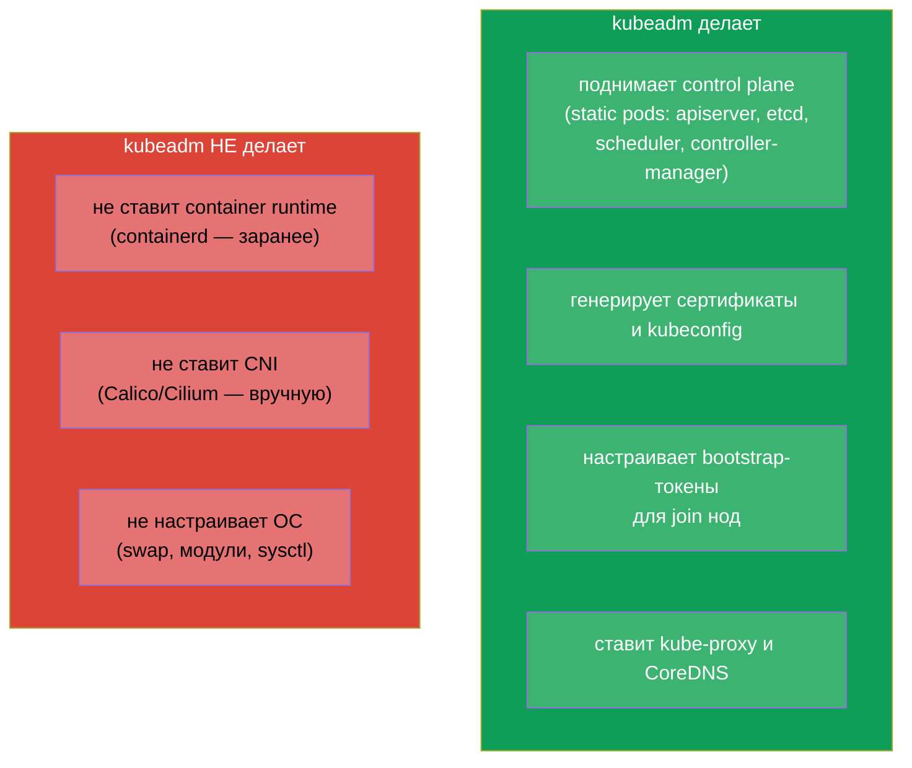
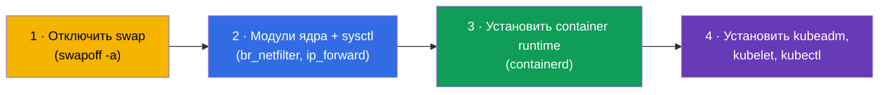
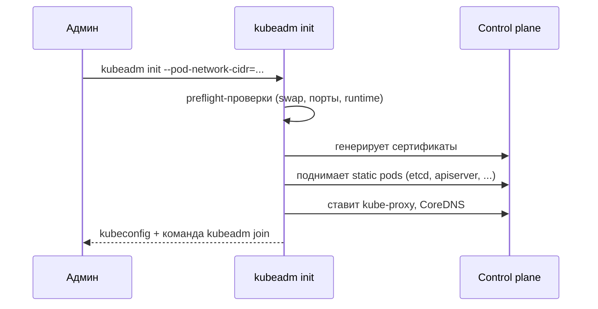
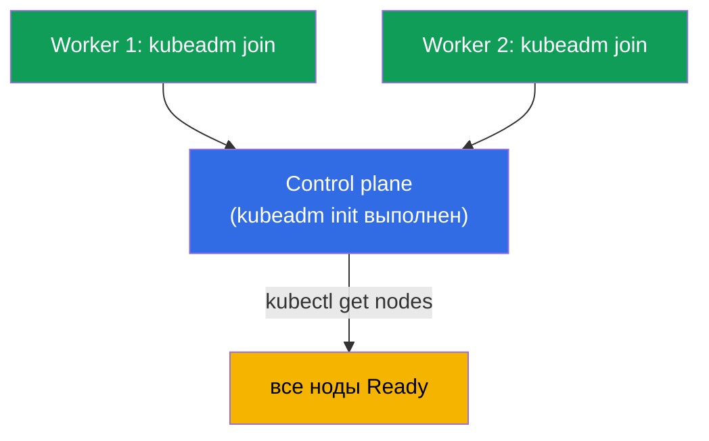
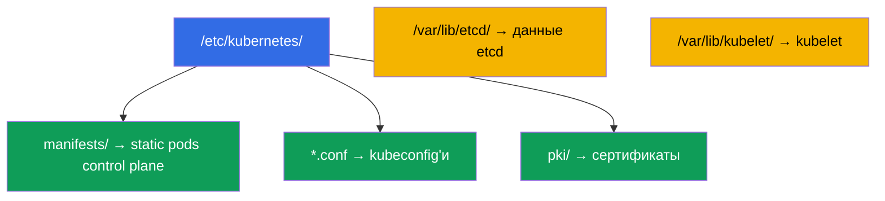
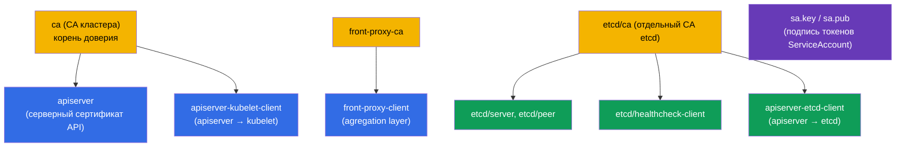
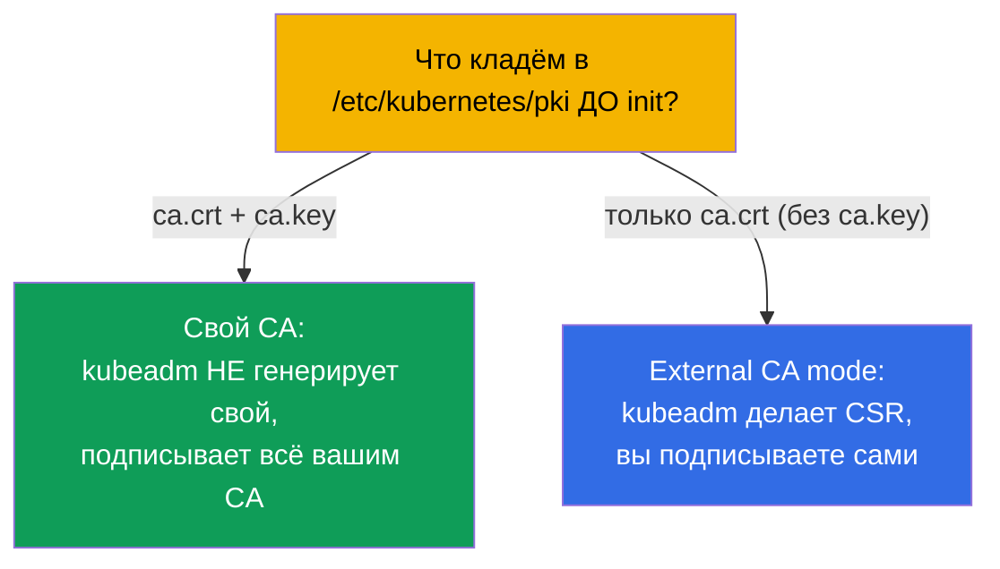

# Глава 35. Установка кластера с помощью kubeadm

> 🟦 **Глава для CKA** (домен Cluster Architecture, Installation & Configuration, 25%).
> Для CKAD не требуется, но полезна для понимания.
>
> **Что дальше.** Начинаем администраторскую часть. Мы много работали в готовом кластере;
> теперь соберём его сами с помощью **kubeadm** - официального инструмента установки. Это
> прямое задание CKA («установи кластер», «добавь ноду») и фундамент для обновлений (глава
> 36), бэкапа etcd (глава 37) и troubleshooting control plane (глава 45). Всё, что мы
> разбирали в главе 2 про компоненты, здесь оживает руками.

## 35.1. Что делает kubeadm (и чего не делает)

**kubeadm** - инструмент, который поднимает control plane и присоединяет ноды по «best
practices». Важно понимать границы его ответственности.



Запомните три вещи, которые kubeadm **не** делает - их готовят отдельно: container runtime,
CNI и настройку ОС. Забыть про CNI - причина, по которой после `kubeadm init` ноды остаются
`NotReady` (глава 30).

## 35.2. Подготовка нод (до kubeadm)

Прежде чем звать kubeadm, каждую ноду готовят:



```bash
# 1. Отключить swap (Kubernetes требует)
sudo swapoff -a
# и убрать из /etc/fstab, чтобы не вернулся после перезагрузки

# 2. Модули и параметры сети
sudo modprobe br_netfilter
echo 'net.ipv4.ip_forward = 1' | sudo tee /etc/sysctl.d/k8s.conf
sudo sysctl --system

# 3. container runtime — containerd (установка через пакеты)
# 4. репозиторий Kubernetes и пакеты
sudo apt-get install -y kubelet kubeadm kubectl
sudo apt-mark hold kubelet kubeadm kubectl    # зафиксировать версии
```

> **Про swap.** Kubernetes исторически требует отключённого swap (kubelet по умолчанию не
> стартует при включённом swap). Это первый пункт подготовки и частая причина, почему
> `kubeadm init` падает.

## 35.3. Инициализация control plane: kubeadm init

На будущей control plane ноде:

```bash
sudo kubeadm init \
  --pod-network-cidr=10.244.0.0/16 \        # диапазон подов (согласовать с CNI!)
  --control-plane-endpoint=<адрес>          # для HA (глава 2)
```



После успешного init kubeadm печатает две важные вещи:

1. команды настроить `kubectl` (скопировать admin.conf):
```bash
mkdir -p $HOME/.kube
sudo cp -i /etc/kubernetes/admin.conf $HOME/.kube/config
sudo chown $(id -u):$(id -g) $HOME/.kube/config
```
2. команду `kubeadm join ...` с токеном - её выполняют на worker-нодах.

## 35.4. Установка CNI (обязательный шаг)

Сразу после init ноды `NotReady` - нет сети подов. Ставим CNI (глава 30):

```bash
# пример: Calico
kubectl apply -f https://raw.githubusercontent.com/projectcalico/calico/<версия>/manifests/calico.yaml
```


Только после установки CNI ноды становятся `Ready`, а системные поды (CoreDNS)
запускаются. `--pod-network-cidr` в init должен совпадать с тем, что ожидает CNI - иначе
сеть не заработает.

## 35.5. Присоединение worker-нод: kubeadm join

На каждой worker-ноде (подготовленной по шагу 35.2) выполняют `kubeadm join`, который
вывел init:

```bash
sudo kubeadm join <control-plane>:6443 \
  --token <токен> \
  --discovery-token-ca-cert-hash sha256:<хеш>
```



Если токен потерян или истёк (живёт 24 часа), новый создают на control plane:

```bash
kubeadm token create --print-join-command    # выведет готовую команду join
```

Проверка результата:

```bash
kubectl get nodes                             # все ноды должны быть Ready
kubectl get pods -n kube-system               # компоненты и CoreDNS Running
```

## 35.6. Что где лежит после установки

kubeadm раскладывает файлы предсказуемо - это надо знать для troubleshooting (главы 37,
45):

| Путь | Что там |
|------|---------|
| `/etc/kubernetes/manifests/` | static pods control plane (apiserver, etcd, scheduler, cm) |
| `/etc/kubernetes/*.conf` | kubeconfig'и (admin, kubelet, controller-manager, scheduler) |
| `/etc/kubernetes/pki/` | сертификаты и ключи (в т.ч. CA, etcd) |
| `/var/lib/etcd/` | данные etcd |
| `/var/lib/kubelet/` | конфиг и данные kubelet |



## 35.7. Какие сертификаты создаёт kubeadm init

При `kubeadm init` автоматически генерируется вся **PKI кластера** в
`/etc/kubernetes/pki/`. Это то, на чём стоит всё доверие (глава 0.3, 39). Полезно знать,
что именно создаётся.



Ключевые файлы в `/etc/kubernetes/pki/`:

| Файл | Что это |
|------|---------|
| `ca.crt` / `ca.key` | **CA кластера** - подписывает apiserver и клиентские сертификаты |
| `apiserver.crt/.key` | серверный сертификат kube-apiserver (SAN: ClusterIP, имена, endpoint) |
| `apiserver-kubelet-client.*` | клиентский сертификат apiserver для обращения к kubelet |
| `front-proxy-ca.*` / `front-proxy-client.*` | CA и клиент для aggregation layer (расширения API) |
| `etcd/ca.*` | **отдельный CA для etcd** |
| `etcd/server.*`, `etcd/peer.*` | серверный и peer-сертификаты etcd |
| `etcd/healthcheck-client.*`, `apiserver-etcd-client.*` | клиенты к etcd (проверки, apiserver) |
| `sa.key` / `sa.pub` | пара ключей для **подписи токенов ServiceAccount** (не сертификат) |

Плюс kubeadm создаёт **kubeconfig'и**, подписанные CA (в `/etc/kubernetes/`):
`admin.conf`, `super-admin.conf`, `kubelet.conf`, `controller-manager.conf`,
`scheduler.conf`.

### Сроки действия

| Что | Срок по умолчанию |
|-----|-------------------|
| **CA** (кластера, etcd, front-proxy) | **10 лет** |
| Листовые сертификаты (apiserver, kubelet-client, etcd/* и т.д.) | **1 год** |
| Клиентские сертификаты в kubeconfig (admin и др.) | 1 год |

То есть корневые CA живут долго (10 лет), а всё, что ими подписано, - **1 год** и требует
продления. Проверка и продление - `kubeadm certs check-expiration` / `kubeadm certs renew`
(глава 39); апгрейд кластера (глава 36) продлевает сертификаты control plane автоматически.

### Best practices

- **Обновляйте кластер хотя бы раз в год** - апгрейд продлевает листовые сертификаты
  control plane автоматически, и они не успевают истечь.
- **Мониторьте сроки** (`kubeadm certs check-expiration`) с алертом за N дней - истёкший
  сертификат control plane роняет кластер (`x509: certificate has expired`).
- **Бэкапьте `/etc/kubernetes/pki`** (особенно ключи CA) вместе с etcd - без CA кластер не
  восстановить.
- **Берегите `ca.key`**: владелец ключа CA может выпустить любое удостоверение, включая
  admin. Доступ строго ограничен.
- **kubelet-сертификаты - на автоматическую ротацию** (`rotateCertificates: true`,
  `serverTLSBootstrap`), чтобы не продлевать вручную.

## 35.8. Свой PKI: подсунуть собственный CA или внешний signer

kubeadm можно заставить использовать **ваш** CA вместо генерации собственного - для
единого корня доверия в организации. Способы:



- **Свой CA (ключ + сертификат).** Положите `ca.crt` **и** `ca.key` (при необходимости и
  `etcd/ca.*`, `front-proxy-ca.*`, `sa.key/sa.pub`) в `/etc/kubernetes/pki/` **до**
  `kubeadm init`. kubeadm увидит готовый CA и подпишет им остальные сертификаты, не
  создавая собственный. Так весь кластер строится на вашем корне доверия.
- **External CA mode (без приватного ключа CA на ноде).** Положите только **`ca.crt`**
  (публичный) без `ca.key`. kubeadm перейдёт в режим внешнего CA: сгенерирует **CSR** и
  будет ждать, что вы подпишете их своим внешним CA и положите готовые сертификаты. Плюс -
  приватный ключ CA не хранится на ноде; минус - **продлевать сертификаты kubeadm сам не
  сможет**, это ваша задача.
- **Тонкая настройка через kubeadm config.** В `ClusterConfiguration` задают:
  `certificatesDir` (свой каталог PKI), `apiServer.certSANs` (доп. имена/адреса в
  сертификате apiserver - например, DNS балансировщика для HA, глава 35A), а также
  `etcd.external` с путями к вашим сертификатам, если etcd внешний.

```bash
# пример: инициализация с кастомными SAN и своим CA (лежит в pki/ заранее)
sudo kubeadm init --config kubeadm-config.yaml
# в kubeadm-config.yaml:
#   apiServer:
#     certSANs: ["api.example.com", "10.0.0.100"]
```

> **На экзамене** свой PKI строят редко, но понимание, что CA можно подложить заранее и
> что бывает external-CA режим, - частый вопрос и реальная прод-задача (единый корпоративный
> корень доверия, хранение ключа CA в HSM/Vault, а не на ноде).

## 35.9. Как это применяют в продакшене

- **kubeadm - для self-managed кластеров.** В облаке чаще берут управляемые кластеры
  (EKS/GKE/AKS), где control plane ставит и обслуживает провайдер. kubeadm выбирают для
  on-prem, приватных и специфичных инсталляций, где нужен полный контроль.
- **Автоматизация поверх kubeadm.** Вручную kubeadm запускают редко - его оборачивают в
  Ansible/Terraform/образы, а для парка кластеров используют Cluster API (kubeadm внутри).
  Ручной init/join - в основном обучение, лаборатории и разбор проблем.
- **HA control plane.** В проде поднимают несколько control plane нод
  (`--control-plane-endpoint` + балансировщик) и нечётное число узлов etcd - один control
  plane допустим только в dev. Подробно - в главе 35A.
- **Версии и подготовка ОС автоматизированы.** Отключение swap, модули, sysctl, установка
  containerd и фиксация версий kube* делаются шаблоном образа/провижинингом, чтобы ноды
  были одинаковыми и воспроизводимыми.
- **Знание раскладки файлов - основа эксплуатации.** Пути `/etc/kubernetes/...`,
  `/var/lib/etcd` нужны для бэкапа etcd, обновления сертификатов и починки control plane -
  это ежедневная реальность CKA-навыков в self-managed кластерах.

## 35.10. Мини-глоссарий

- **kubeadm** - официальный инструмент установки кластера (init/join/upgrade).
- **kubeadm init** - инициализация control plane.
- **kubeadm join** - присоединение ноды к кластеру.
- **bootstrap-токен** - временный токен для join нод (живёт ~24 часа).
- **--pod-network-cidr** - диапазон адресов подов (согласуется с CNI).
- **--control-plane-endpoint** - общий адрес control plane (для HA).
- **swapoff** - отключение swap (требование Kubernetes).
- **admin.conf** - kubeconfig администратора после init.
- **PKI кластера** - набор CA и сертификатов в `/etc/kubernetes/pki/`, создаётся при init.
- **CA кластера / etcd CA / front-proxy CA** - три корня доверия (срок ~10 лет).
- **External CA mode** - только `ca.crt` без ключа: kubeadm делает CSR, подпись - за вами.
- **certSANs** - дополнительные имена/адреса в сертификате apiserver (напр. DNS балансировщика).
- **sa.key / sa.pub** - ключи подписи токенов ServiceAccount.

## 35.11. Итоги главы

- kubeadm поднимает control plane (static pods, сертификаты, токены, kube-proxy, CoreDNS),
  но не ставит container runtime, CNI и не настраивает ОС - это делают отдельно.
- Подготовка нод: отключить swap, включить модули/sysctl, поставить containerd и
  kubeadm/kubelet/kubectl (с фиксацией версий).
- `kubeadm init --pod-network-cidr=...` инициализирует control plane и печатает настройку
  kubectl и команду `kubeadm join`.
- Сразу после init нужно установить CNI - иначе ноды NotReady и CoreDNS не стартует.
- Worker-ноды присоединяют `kubeadm join` с токеном; истёкший токен пересоздают
  `kubeadm token create --print-join-command`.
- Файлы предсказуемы: static pods в `/etc/kubernetes/manifests/`, сертификаты в `pki/`,
  данные etcd в `/var/lib/etcd/` - это основа для бэкапа и troubleshooting.
- kubeadm init генерирует PKI кластера: CA (кластера, etcd, front-proxy) на ~10 лет и
  листовые сертификаты на 1 год; продление - апгрейд или `kubeadm certs renew` (глава 39).
- Можно использовать свой CA: положить `ca.crt`+`ca.key` в `pki/` до init (или только
  `ca.crt` для external-CA режима, где подпись CSR - за вами).

## 35.12. Как это пригодится: на экзамене и в реальной работе

**На экзамене (CKA).** «Установи кластер kubeadm», «добавь worker-ноду», «почему ноды
NotReady» - прямые задания домена Installation (25%). Нужно знать шаги подготовки (swap!),
последовательность init → kubectl → CNI → join и раскладку файлов. Это фундамент для глав
36-37 и 45.

**В реальной работе.** kubeadm - основа self-managed и on-prem кластеров. Даже когда его
оборачивают в автоматизацию (Ansible, Cluster API), понимание, что он делает и где лежат
файлы, необходимо для обновлений, бэкапов etcd, ротации сертификатов и починки control
plane.

## 35.13. Вопросы для самопроверки

1. Что kubeadm делает при установке и чего он НЕ делает?
2. Какие шаги подготовки ноды нужны до kubeadm? Почему важен swapoff?
3. Что происходит после `kubeadm init` и какие две вещи он печатает?
4. Почему сразу после init ноды NotReady и что это исправляет?
5. Как присоединить worker-ноду и что делать, если токен истёк?
6. Где лежат static pods control plane, сертификаты и данные etcd?
7. Почему `--pod-network-cidr` должен согласовываться с CNI?
8. Какие сертификаты создаёт `kubeadm init` и на какой срок (CA vs листовые)?
9. Как заставить kubeadm использовать ваш собственный CA? Чем отличается external-CA режим?

## Практика

Мы собрали кластер. В главе 35A разберём, как сделать control plane отказоустойчивым (HA),
в главе 36 - безопасно обновлять кластер (lifecycle), а в главе 37 - бэкапить и
восстанавливать etcd. Установка kubeadm-кластера - это то, что делают наши лабораторные
работы автоматически (можно зайти на ноды и всё увидеть).

🧪 Лаба 116 (kubeadm init + join с нуля): [tasks/cka/labs/116](../../labs/116/README_RU.MD)

---
[Оглавление](../README_RU.md) · [Глава 34](../34/ru.md) · [Глава 35A](../35-2-ha/ru.md)
