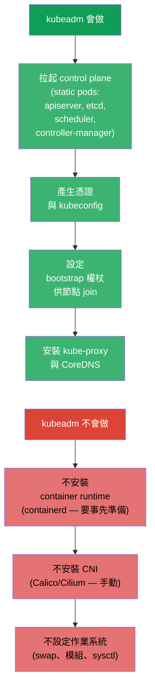
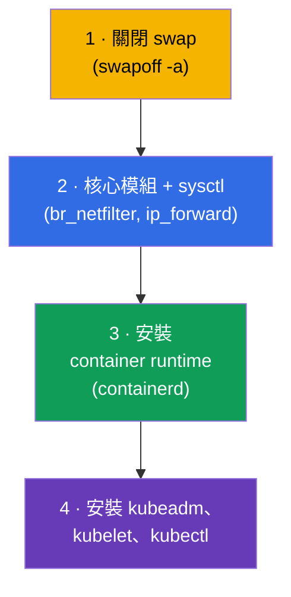
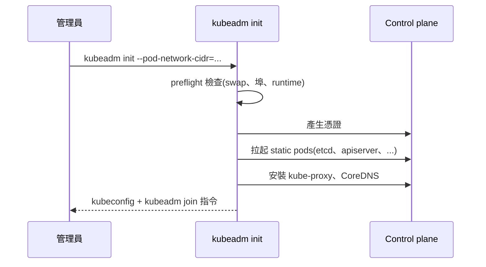
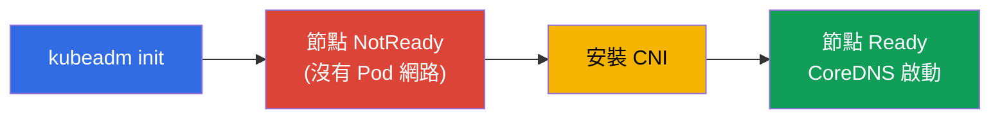
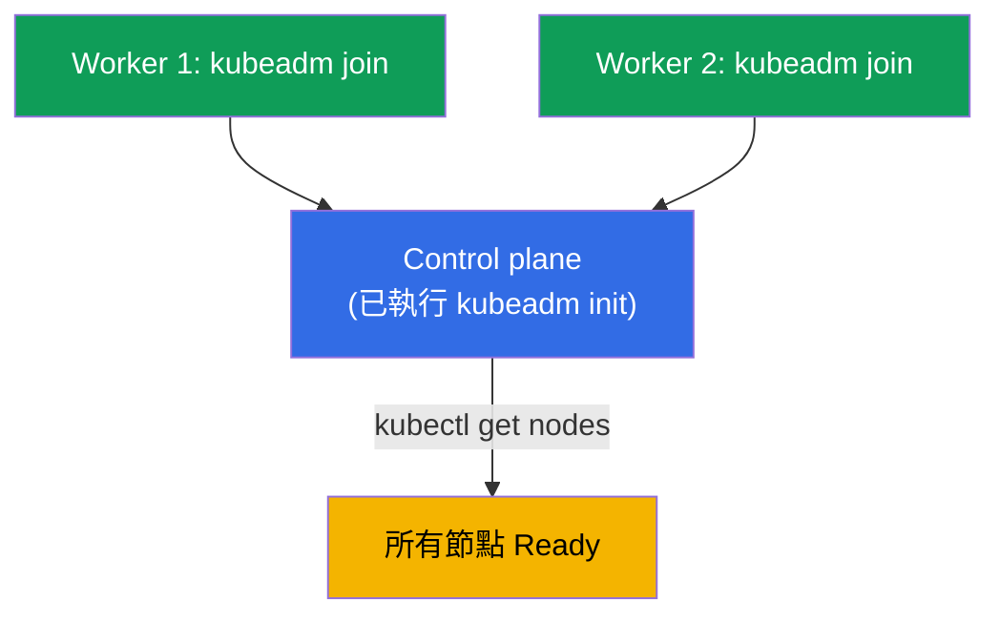
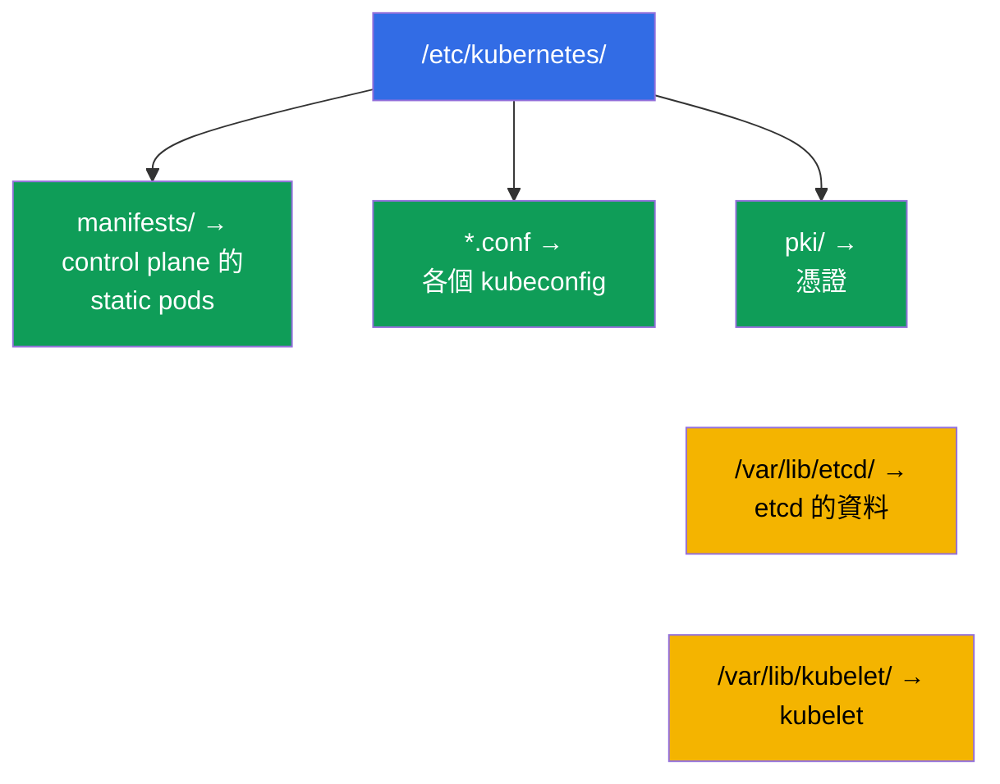
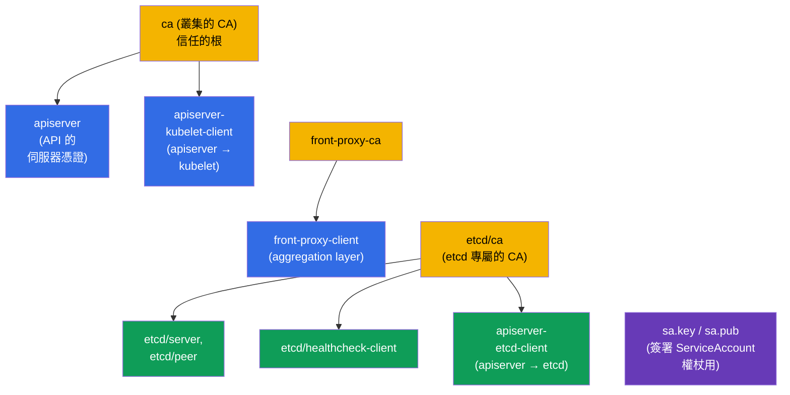
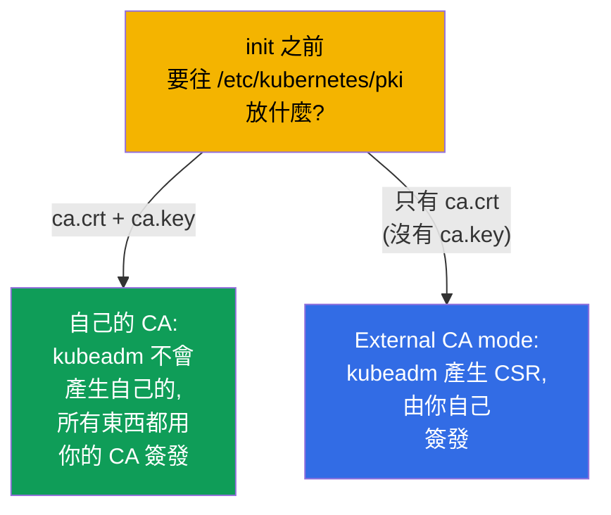

[Русская версия](ru.md) · [Eng version](README.md) · [Versión en español](es.md) · [Version française](fr.md) · [Deutsche Version](de.md) · [ქართული ვერსია](ge.md) · [日本語版](jp.md)

# 第 35 章。使用 kubeadm 安裝叢集

> 🟦 **CKA 章節**(領域 Cluster Architecture, Installation & Configuration,25%)。
> CKAD 不需要,但對理解很有幫助。
>
> **接下來是什麼。** 我們開始管理員的部分。之前我們一直在現成的叢集裡工作;
> 現在要用 **kubeadm** - 官方的安裝工具 - 親手把它組起來。這是 CKA 的直接
> 題目(「安裝叢集」、「加入一個節點」),也是升級(第 36 章)、etcd 備份
> (第 37 章)與 control plane troubleshooting(第 45 章)的基礎。我們在第 2 章
> 討論過的所有元件,在這裡都會由雙手變成現實。

## 35.1. kubeadm 做什麼(以及不做什麼)

**kubeadm** 是依照「best practices」把 control plane 拉起來、並把節點加進來的工具。
理解它責任的邊界很重要。



請記住 kubeadm **不會**做的三件事 - 它們要另外準備:container runtime、CNI 以及
作業系統的設定。忘記 CNI 正是 `kubeadm init` 之後節點停留在 `NotReady` 的原因
(第 30 章)。

## 35.2. 節點的準備(在 kubeadm 之前)

在呼叫 kubeadm 之前,每個節點都要先準備好:



```bash
# 1. 關閉 swap(Kubernetes 的要求)
sudo swapoff -a
# 並從 /etc/fstab 移除,避免重開機後又回來

# 2. 模組與網路參數
sudo modprobe br_netfilter
echo 'net.ipv4.ip_forward = 1' | sudo tee /etc/sysctl.d/k8s.conf
sudo sysctl --system

# 3. container runtime — containerd(透過套件安裝)
# 4. Kubernetes 套件庫與套件
sudo apt-get install -y kubelet kubeadm kubectl
sudo apt-mark hold kubelet kubeadm kubectl    # 固定版本
```

> **關於 swap。** Kubernetes 歷來要求關閉 swap(kubelet 預設在啟用 swap 時不會
> 啟動)。這是準備工作的第一項,也是 `kubeadm init` 失敗的常見原因。

節點準備的完整且最新的需求與步驟清單在官方文件裡:
[Installing kubeadm](https://kubernetes.io/docs/setup/production-environment/tools/kubeadm/install-kubeadm/)
(swap、核心模組與 sysctl、container runtime、套件庫以及 kubeadm/kubelet/kubectl 套件)。

## 35.3. control plane 的初始化:kubeadm init

在未來的 control plane 節點上:

```bash
sudo kubeadm init \
  --pod-network-cidr=10.244.0.0/16 \        # Pod 的位址範圍(要與 CNI 一致!)
  --control-plane-endpoint=<位址>           # API 的穩定位址(給 HA 用)
```

> **`--control-plane-endpoint` 要填什麼位址?** 這是 **API 伺服器的穩定入口**,
> 所有節點共用,並且會寫進憑證裡。在這裡填某個具體節點的 IP 是壞主意:如果它是
> 唯一的 control plane,那麼日後不重建就沒辦法轉成多個 control plane。正確的做法是填:
>
> - 你自己掌控的 **DNS 名稱**(例如 `k8s-api.example.com`)- 這是最靈活的做法:
>   之後可以在它後面擺一個負載平衡器,而完全不用動叢集;
> - control plane 節點前面的 **負載平衡器位址**(VIP/LB)- 這才是真正的 HA
>   (同一個位址後面有多個 API 伺服器)。
>
> 可以加上埠:`--control-plane-endpoint=k8s-api.example.com:6443`。對單節點的
> control plane 來說這個旗標**不是必需的**,但一開始就(用 DNS)設好是良好習慣:
> 它替 HA 留下了一條路。不加這個旗標時,endpoint 會變成目前節點的位址,之後就
> 「長不成」HA 了。細節見
> [Creating a cluster with kubeadm](https://kubernetes.io/docs/setup/production-environment/tools/kubeadm/create-cluster-kubeadm/)
> 與 [HA topology](https://kubernetes.io/docs/setup/production-environment/tools/kubeadm/high-availability/)。



init 成功之後,kubeadm 會印出兩件重要的東西:

1. 設定 `kubectl` 的指令(複製 admin.conf):
```bash
mkdir -p $HOME/.kube
sudo cp -i /etc/kubernetes/admin.conf $HOME/.kube/config
sudo chown $(id -u):$(id -g) $HOME/.kube/config
```
2. 帶有權杖的 `kubeadm join ...` 指令 - 它要在 worker 節點上執行。

### 叢集的憑證:有效期、續期、自己的 CA

`kubeadm init` 會自己在 `/etc/kubernetes/pki` 產生叢集的整套 PKI。理解它們的
存活期限很重要,否則**在生產環境可能會吃到停機**:當 apiserver 與各元件的憑證
過期時,control plane 就停止工作,而 `kubectl` 會開始回 TLS 錯誤。

預設的有效期:

- **葉憑證**(apiserver、apiserver-kubelet-client、`admin.conf`/
  `controller-manager.conf`/`scheduler.conf` 裡的客戶端憑證等等)- **1 年**;
- **CA 憑證**(`ca`、`etcd-ca`、`front-proxy-ca`)- **10 年**;
- kubelet 的客戶端憑證(`/var/lib/kubelet/pki`)**會自動輪替** -
  所以下面的清單裡沒有它。

檢查有效期:

```bash
kubeadm certs check-expiration     # 列出所有憑證的 EXPIRES / RESIDUAL TIME 表格
```

續期:

- **在 control plane 升級時自動進行**:`kubeadm upgrade apply/node` 會續期
  所有憑證。如果叢集規律地更新(比一年一次更頻繁),就可以不用擔心過期;
- 隨時**手動**執行:`kubeadm certs renew all`(要在**每個** control plane
  節點上執行,然後重啟 control plane 的 static pods - 例如暫時把
  `/etc/kubernetes/manifests/` 裡的清單檔移走再放回)。續期 `admin.conf` 之後
  別忘了更新 `~/.kube/config`。

自己的與外部的憑證(為了事先指定有效期和自己的 CA):

- **自己的 CA**:在 `kubeadm init` **之前**把 `ca.crt` 與 `ca.key` 放進
  `/etc/kubernetes/pki` - kubeadm 不會覆蓋它們,並會用你的 CA 簽發其餘憑證;
- 透過 kubeadm 設定檔指定**自訂有效期**(用 `kubeadm init --config` 傳入):

  ```yaml
  apiVersion: kubeadm.k8s.io/v1beta4
  kind: ClusterConfiguration
  certificateValidityPeriod: 8760h      # 葉憑證:預設 1 年
  caCertificateValidityPeriod: 87600h   # CA:預設 10 年
  ```

  (數值採 Go 的 duration 格式,最大的單位是 `h`);
- **外部 CA**(external CA mode):只放 `ca.crt` 而不放 `ca.key` - kubeadm 會辨識
  出這一點,不在磁碟上保留 CA 的金鑰,而憑證的簽發/續期由你自己負責(自己的
  signer)。此時 `kubeadm certs renew` 就**不再管理**這些憑證了。

細節與情境見文件:
[Certificate Management with kubeadm](https://kubernetes.io/docs/tasks/administer-cluster/kubeadm/kubeadm-certs/)。

> **對生產環境的結論。** 要嘛規律地升級叢集(憑證會自己續期),要嘛監控
> `check-expiration` 並提前續期。「叢集正好在安裝滿一年後全壞了」-
> 這是 kubeadm 憑證過期的經典案例。

## 35.4. 安裝 CNI(必要的步驟)

init 之後節點馬上是 `NotReady` - 因為沒有 Pod 網路。我們來安裝 CNI(第 30 章):

```bash
# 範例:Calico
kubectl apply -f https://raw.githubusercontent.com/projectcalico/calico/<版本>/manifests/calico.yaml
```



只有在安裝 CNI 之後,節點才會變成 `Ready`,系統 Pod(CoreDNS)才會啟動。
init 裡的 `--pod-network-cidr` 必須與 CNI 期待的一致 - 否則網路不會運作。

## 35.5. 加入 worker 節點:kubeadm join

在每個(按 35.2 準備好的)worker 節點上執行 init 印出來的 `kubeadm join`:

```bash
sudo kubeadm join <control-plane>:6443 \
  --token <權杖> \
  --discovery-token-ca-cert-hash sha256:<雜湊>
```



如果權杖遺失或過期(它存活 24 小時),就在 control plane 上建立新的:

```bash
kubeadm token create --print-join-command    # 會印出現成的 join 指令
```

檢查結果:

```bash
kubectl get nodes                             # 所有節點都應該是 Ready
kubectl get pods -n kube-system               # 各元件與 CoreDNS 是 Running
```

## 35.6. 安裝之後檔案放在哪裡

kubeadm 擺放檔案的方式是可預期的 - 這對 troubleshooting 很重要(第 37、45 章):

| 路徑 | 裡面有什麼 |
|------|---------|
| `/etc/kubernetes/manifests/` | control plane 的 static pods(apiserver、etcd、scheduler、cm) |
| `/etc/kubernetes/*.conf` | 各個 kubeconfig(admin、kubelet、controller-manager、scheduler) |
| `/etc/kubernetes/pki/` | 憑證與金鑰(含 CA、etcd) |
| `/var/lib/etcd/` | etcd 的資料 |
| `/var/lib/kubelet/` | kubelet 的設定與資料 |



## 35.7. kubeadm init 會建立哪些憑證

執行 `kubeadm init` 時會自動在 `/etc/kubernetes/pki/` 產生叢集的整套 **PKI**。
所有的信任都建立在它之上(第 0.3、39 章)。知道具體會產生什麼很有用。



`/etc/kubernetes/pki/` 裡的關鍵檔案:

| 檔案 | 這是什麼 |
|------|---------|
| `ca.crt` / `ca.key` | **叢集的 CA** - 簽發 apiserver 與客戶端憑證 |
| `apiserver.crt/.key` | kube-apiserver 的伺服器憑證(SAN:ClusterIP、名稱、endpoint) |
| `apiserver-kubelet-client.*` | apiserver 連到 kubelet 用的客戶端憑證 |
| `front-proxy-ca.*` / `front-proxy-client.*` | aggregation layer(API 擴充)的 CA 與客戶端 |
| `etcd/ca.*` | **etcd 專屬的 CA** |
| `etcd/server.*`、`etcd/peer.*` | etcd 的伺服器與 peer 憑證 |
| `etcd/healthcheck-client.*`、`apiserver-etcd-client.*` | 連到 etcd 的客戶端(健康檢查、apiserver) |
| `sa.key` / `sa.pub` | **簽署 ServiceAccount 權杖**的金鑰對(不是憑證) |

此外 kubeadm 還會建立由 CA 簽發的 **kubeconfig**(在 `/etc/kubernetes/`):
`admin.conf`、`super-admin.conf`、`kubelet.conf`、`controller-manager.conf`、
`scheduler.conf`。

### 有效期

| 是什麼 | 預設有效期 |
|-----|-------------------|
| **CA**(叢集、etcd、front-proxy) | **10 年** |
| 葉憑證(apiserver、kubelet-client、etcd/* 等等) | **1 年** |
| kubeconfig 裡的客戶端憑證(admin 等) | 1 年 |

也就是說根 CA 活得很久(10 年),而所有由它們簽發的東西只有 **1 年**,需要續期。
檢查與續期用 `kubeadm certs check-expiration` / `kubeadm certs renew`
(第 39 章);叢集升級(第 36 章)會自動續期 control plane 的憑證。

### Best practices

- **至少一年升級叢集一次** - 升級會自動續期 control plane 的葉憑證,
  它們就不會有機會過期。
- **監控有效期**(`kubeadm certs check-expiration`)並設定提前 N 天的告警 -
  過期的 control plane 憑證會讓叢集倒下(`x509: certificate has expired`)。
- **備份 `/etc/kubernetes/pki`**(尤其是 CA 的金鑰),連同 etcd 一起 -
  沒有 CA 叢集就救不回來。
- **保護好 `ca.key`**:CA 金鑰的持有者可以簽發任何身分,包括 admin。
  存取權限要嚴格限制。
- **kubelet 憑證交給自動輪替**(`rotateCertificates: true`、
  `serverTLSBootstrap`),就不必手動續期。

## 35.8. 自己的 PKI:塞進自有 CA 或外部 signer

可以讓 kubeadm 使用**你的** CA,而不是產生它自己的 - 這樣組織裡就有單一的
信任根。做法有:



- **自己的 CA(金鑰 + 憑證)。** 在 `kubeadm init` **之前**把 `ca.crt` **與**
  `ca.key`(必要時還有 `etcd/ca.*`、`front-proxy-ca.*`、`sa.key/sa.pub`)放進
  `/etc/kubernetes/pki/`。kubeadm 會看到現成的 CA,並用它簽發其餘憑證,不再
  建立自己的。這樣整個叢集就建立在你的信任根上。
- **External CA mode(節點上沒有 CA 的私鑰)。** 只放 **`ca.crt`**(公開的)
  而不放 `ca.key`。kubeadm 會切換到外部 CA 模式:產生 **CSR**,然後等你用自己的
  外部 CA 簽發並把現成的憑證放進來。好處是 CA 的私鑰不存放在節點上;壞處是
  **kubeadm 自己無法續期憑證**,這變成你的工作。
- **透過 kubeadm config 做細部設定。** 在 `ClusterConfiguration` 裡可以指定:
  `certificatesDir`(自訂的 PKI 目錄)、`apiServer.certSANs`(apiserver 憑證裡
  額外的名稱/位址 - 例如 HA 用的負載平衡器 DNS,第 35A 章),以及當 etcd 是
  外部的時候用 `etcd.external` 指向你的憑證路徑。

```bash
# 範例:用自訂 SAN 與自己的 CA(事先放在 pki/ 裡)初始化
sudo kubeadm init --config kubeadm-config.yaml
# 在 kubeadm-config.yaml 裡:
#   apiServer:
#     certSANs: ["api.example.com", "10.0.0.100"]
```

> **在考試中**很少會自建 PKI,但理解「CA 可以事先塞進去」以及「有 external-CA
> 模式」這兩點是常見的考題,也是真實的生產任務(統一的企業信任根、把 CA 金鑰
> 放在 HSM/Vault 而不是節點上)。

## 35.9. 生產環境怎麼用

- **kubeadm 用於 self-managed 叢集。** 在雲上更常選受管叢集(EKS/GKE/AKS),
  那裡的 control plane 由供應商安裝與維運。kubeadm 用於 on-prem、私有以及
  特殊的安裝場景,也就是需要完整掌控的地方。
- **在 kubeadm 之上做自動化。** 手動執行 kubeadm 的情況很少 - 通常會把它包進
  Ansible/Terraform/映像檔裡,而管理一整批叢集則用 Cluster API(裡面就是 kubeadm)。
  手動 init/join 主要出現在學習、實驗室與問題排查。
- **HA control plane。** 生產環境會拉起多個 control plane 節點
  (`--control-plane-endpoint` + 負載平衡器)以及奇數個 etcd 節點 - 單一 control
  plane 只在 dev 環境可以接受。詳見第 35A 章。
- **版本與作業系統準備都自動化。** 關閉 swap、模組、sysctl、安裝 containerd 以及
  固定 kube* 版本,都用映像檔範本/provisioning 完成,讓節點彼此一致且可重現。
- **知道檔案的擺放位置是維運的基礎。** `/etc/kubernetes/...`、`/var/lib/etcd`
  這些路徑在 etcd 備份、更新憑證與修復 control plane 時都要用到 -
  這是 self-managed 叢集裡 CKA 技能的日常。

## 35.10. 迷你詞彙表

- **kubeadm** - 官方的叢集安裝工具(init/join/upgrade)。
- **kubeadm init** - control plane 的初始化。
- **kubeadm join** - 把節點加入叢集。
- **bootstrap 權杖** - 給節點 join 用的臨時權杖(存活約 24 小時)。
- **--pod-network-cidr** - Pod 的位址範圍(要與 CNI 一致)。
- **--control-plane-endpoint** - control plane 的共用位址(給 HA 用)。
- **swapoff** - 關閉 swap(Kubernetes 的要求)。
- **admin.conf** - init 之後管理員用的 kubeconfig。
- **叢集的 PKI** - `/etc/kubernetes/pki/` 裡的一組 CA 與憑證,在 init 時建立。
- **叢集 CA / etcd CA / front-proxy CA** - 三個信任根(有效期約 10 年)。
- **External CA mode** - 只有 `ca.crt` 沒有金鑰:kubeadm 產生 CSR,簽發由你負責。
- **certSANs** - apiserver 憑證裡額外的名稱/位址(例如負載平衡器的 DNS)。
- **sa.key / sa.pub** - 簽署 ServiceAccount 權杖的金鑰。

## 35.11. 本章總結

- kubeadm 會拉起 control plane(static pods、憑證、權杖、kube-proxy、CoreDNS),
  但不安裝 container runtime、CNI,也不設定作業系統 - 這些要另外做。
- 節點準備:關閉 swap、開啟模組/sysctl、安裝 containerd 以及
  kubeadm/kubelet/kubectl(並固定版本)。
- `kubeadm init --pod-network-cidr=...` 會初始化 control plane,並印出 kubectl
  的設定方式與 `kubeadm join` 指令。
- init 之後必須馬上安裝 CNI - 否則節點會是 NotReady,CoreDNS 也不會啟動。
- worker 節點用帶權杖的 `kubeadm join` 加入;過期的權杖用
  `kubeadm token create --print-join-command` 重新產生。
- 檔案位置是可預期的:static pods 在 `/etc/kubernetes/manifests/`、憑證在 `pki/`、
  etcd 的資料在 `/var/lib/etcd/` - 這是備份與 troubleshooting 的基礎。
- kubeadm init 會產生叢集的 PKI:CA(叢集、etcd、front-proxy)約 10 年,
  葉憑證 1 年;續期靠升級或 `kubeadm certs renew`(第 39 章)。
- 可以使用自己的 CA:init 之前把 `ca.crt`+`ca.key` 放進 `pki/`(或者只放
  `ca.crt` 走 external-CA 模式,此時 CSR 的簽發由你負責)。

## 35.12. 這些在哪裡用得上:考試與實際工作

**在考試中(CKA)。**「用 kubeadm 安裝叢集」、「加一個 worker 節點」、「為什麼
節點是 NotReady」- 都是 Installation 領域(25%)的直接題目。要知道準備步驟
(swap!)、init → kubectl → CNI → join 的順序以及檔案的擺放位置。這是第
36-37 與 45 章的基礎。

**在實際工作中。** kubeadm 是 self-managed 與 on-prem 叢集的基礎。即使它被包進
自動化(Ansible、Cluster API)裡,理解它做什麼、檔案放在哪裡,對升級、etcd 備份、
憑證輪替與修復 control plane 都是必需的。

## 35.13. 自我檢查問題

1. kubeadm 在安裝時做什麼,以及不做什麼?
2. kubeadm 之前需要哪些節點準備步驟?為什麼 swapoff 很重要?
3. `kubeadm init` 之後會發生什麼,它會印出哪兩件東西?
4. 為什麼 init 之後節點馬上是 NotReady,什麼可以修好它?
5. 怎麼加入 worker 節點,如果權杖過期了要怎麼辦?
6. control plane 的 static pods、憑證與 etcd 的資料分別放在哪裡?
7. 為什麼 `--pod-network-cidr` 必須與 CNI 一致?
8. `kubeadm init` 會建立哪些憑證,有效期各是多久(CA vs 葉憑證)?
9. 怎麼讓 kubeadm 使用你自己的 CA?external-CA 模式有什麼不同?

## 實踐

我們把叢集組起來了。第 35A 章會看怎麼讓 control plane 具備容錯能力(HA),
第 36 章看怎麼安全地升級叢集(lifecycle),第 37 章看 etcd 的備份與還原。
安裝 kubeadm 叢集這件事,我們的實驗室作業會自動完成(可以登入節點親眼看看)。

🧪 實驗 116(從零開始 kubeadm init + join):[tasks/cka/labs/116](../../labs/116/README_TW.MD)

---
[目錄](../README_TW.md) · [第 34 章](../34/tw.md) · [第 35A 章](../35-2-ha/tw.md)
