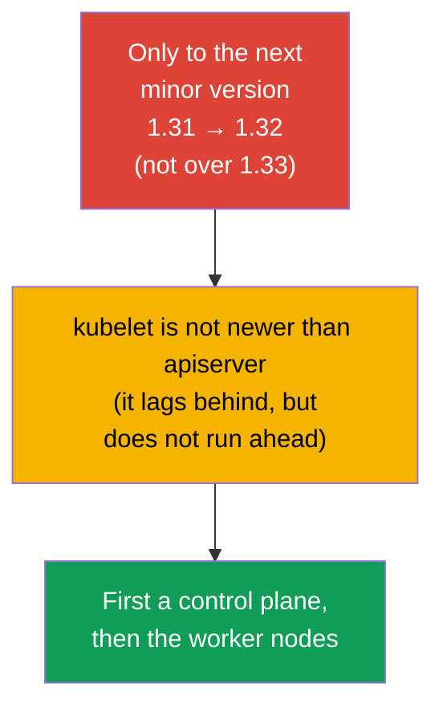
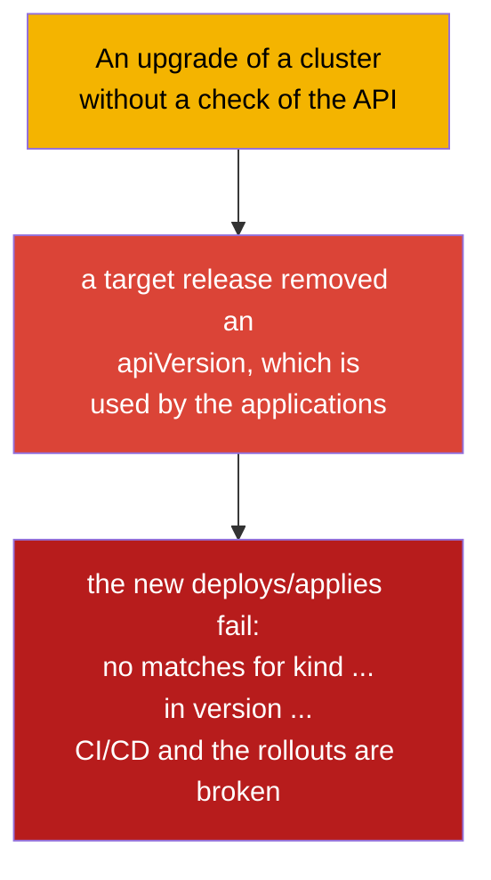
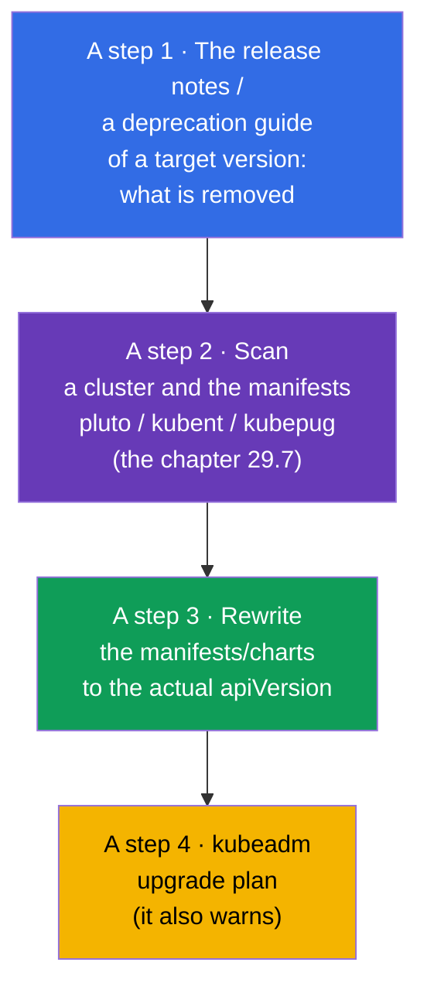
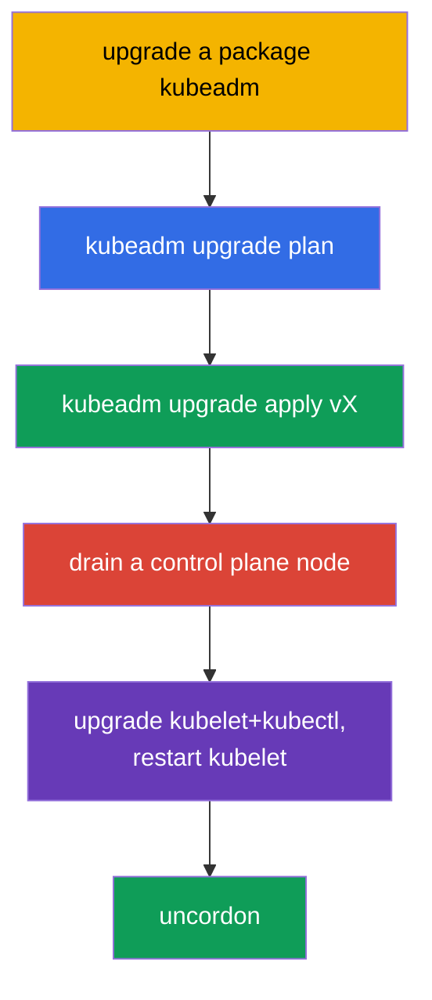
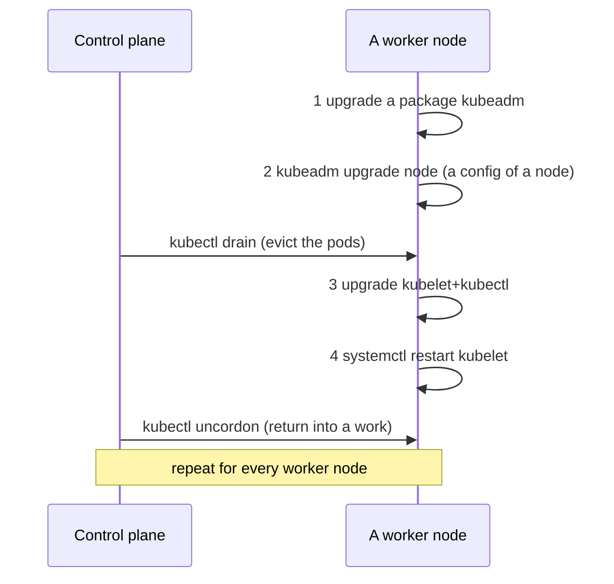
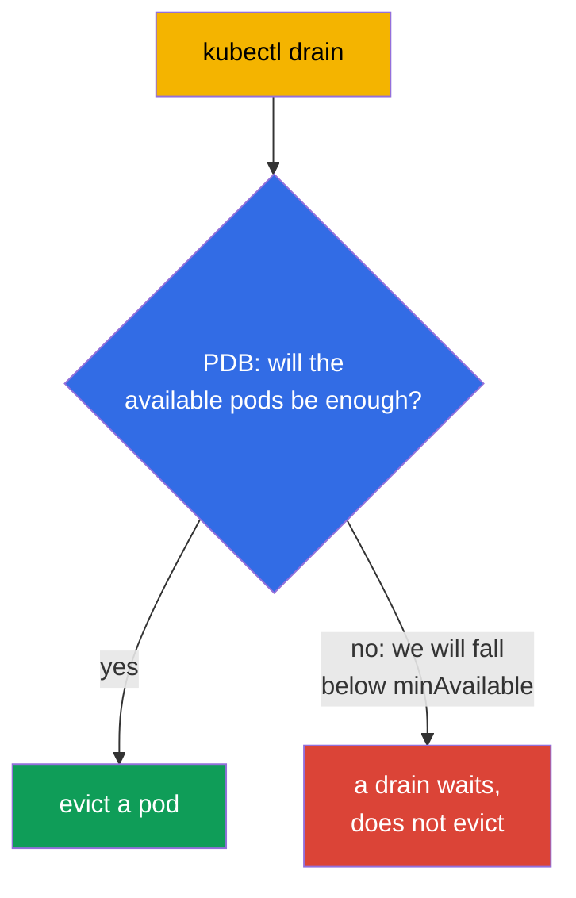

[Русская версия](ru.md) · [Versión en español](es.md) · [Version française](fr.md) · [Deutsche Version](de.md) · [ქართული ვერსია](ge.md) · [繁體中文版](tw.md) · [日本語版](jp.md)

# Chapter 36. An upgrade of a cluster (a lifecycle)

> 🟦 **A chapter for the CKA** (a domain Cluster Architecture, Installation & Configuration).
>
> **What comes next.** A cluster is assembled (the chapter 35), but Kubernetes comes out with the new versions, and
> a cluster has to be upgraded. An upgrade is a delicate operation: do it wrong, and one can
> bring down a production. We will consider a correct order of an upgrade of a control plane and of the worker nodes through
> kubeadm, a role of `cordon`/`drain` (a connection with the taints, the chapter 13) and the rules of the versions. This is a direct
> task of the CKA ("upgrade a cluster to a version X") and the most important operational skill.

## 36.1. The versions and a rule of a skew

Kubernetes has the strict rules of a compatibility of the versions of the components - they have to be known, in order not to
break a cluster.



- **Only to the next minor version.** One cannot jump over 1.31 → 1.33; one has to do 1.31 →
  1.32 → 1.33. The patch versions inside a minor one - freely.
- **Version skew.** kubelet can lag behind apiserver (within the limits of a few minor ones),
  but it **cannot be newer**. That is why a control plane is upgraded first.
- **An order.** First a control plane (apiserver and the rest), then the worker nodes.

## 36.2. A pre-flight: a check of the API before an upgrade (otherwise the applications will stop being deployed)

Before touching the nodes, one has to check a **compatibility of the API**. Kubernetes with the new
minor versions **removes the deprecated versions of the API** (the chapter 29). If an application,
a Helm chart, an operator or a CRD use a version of the API, which a target release has **removed**,
then after an upgrade:

- the already created objects apiserver returns under a new version (usually it is ok),
- but the **new `kubectl apply`/a deploy of the manifests with an old `apiVersion` fail** with an error
  `no matches for kind ... in version ...` - that is, the rollouts and CI/CD break.



The classic examples of the removed API (a frequent pain): `extensions/v1beta1` Ingress →
`networking.k8s.io/v1` (removed in 1.22), `policy/v1beta1` PodDisruptionBudget →
`policy/v1` (removed in 1.25), the old `apps/v1beta*` Deployment (removed in 1.16),
`batch/v1beta1` CronJob → `batch/v1` (removed in 1.25).

**A checklist before an upgrade:**



> **The tools for the step 2** (a scanning of a cluster and of the code for the deprecated/removed API) -
> in a detail in the [chapter 29](../29/README.md), the section **29.7 "The open-source tools of an analysis of the
> deprecated API"**: kubent, pluto, kubepug (`kubectl deprecations`), kubeconform, Popeye -
> with the commands for a cluster and for CI.

```bash
# which versions of the API a cluster really serves now
kubectl api-versions
kubectl api-resources

# find the deprecated/removed API in a live cluster and in the manifests (the chapter 29)
pluto detect-all-in-cluster
kubent                                  # kube-no-trouble
pluto detect-files -d ./manifests/

# convert a manifest to an actual version of the API
kubectl convert -f old-ingress.yaml --output-version networking.k8s.io/v1
```

Separately one checks, that the **addons are compatible** with a target version of Kubernetes: a CNI
(Calico/Cilium), the CSI drivers, an ingress controller, metrics-server, and also
the admission webhooks and the CRD of the operators - they have their own matrices of a compatibility. An incompatible
addon after an upgrade can break a network, a storage or an acceptance of a traffic.

A conclusion: **first bring the applications/charts/addons to the versions, supported by a target
release, and only then upgrade a cluster.** Otherwise a cluster will be upgraded, and the applications
will stop being rolled out.

## 36.3. A general order of an upgrade


The nodes are upgraded **one by one**, so that a cluster all the time stayed operable: while one
node is being served, the rest carry a load. This is exactly a safe upgrade without a downtime.

## 36.4. An upgrade of a control plane

On the first control plane node an order is such:

```bash
# 1. Upgrade kubeadm itself to a target version
sudo apt-mark unhold kubeadm
sudo apt-get install -y kubeadm=1.32.x-*
sudo apt-mark hold kubeadm

# 2. Look at a plan of an upgrade
sudo kubeadm upgrade plan

# 3. Apply an upgrade of a control plane
sudo kubeadm upgrade apply v1.32.x

# 4. Free a control plane node (drain), as any other one before an upgrade of kubelet
kubectl drain <control-plane> --ignore-daemonsets

# 5. Upgrade kubelet and kubectl on this node
sudo apt-mark unhold kubelet kubectl
sudo apt-get install -y kubelet=1.32.x-* kubectl=1.32.x-*
sudo apt-mark hold kubelet kubectl
sudo systemctl daemon-reload
sudo systemctl restart kubelet

# 6. Return a control plane node into a work
kubectl uncordon <control-plane>
```



> **A note.** A `kubeadm upgrade apply` is done only on the **first** control plane node.
> On the rest of the control plane nodes (in a HA, the chapter 35A) instead of an `apply` one executes
> a `kubeadm upgrade node` - as on the worker nodes (the section 36.6), but a drain of a control plane node
> is also needed.

## 36.5. cordon and drain: a preparation of a node to an upgrade

Before an upgrade of kubelet on **any** node it has to be freed from the pods, in order not to touch
a load. These are two steps:


```bash
kubectl cordon <node>                              # do not schedule here anymore
kubectl drain <node> --ignore-daemonsets --delete-emptydir-data   # evict the pods
# ... upgrade kubelet on a node ...
kubectl uncordon <node>                            # return into a pool of a scheduling
```

- **cordon** puts on a node a taint `unschedulable` (the chapter 13) - the new pods are not
  assigned here, but the already started ones work.
- **drain** additionally evicts the pods (softly, observing a graceful shutdown), moving them
  to the other nodes. A `--ignore-daemonsets` is needed, because the pods of a DaemonSet are tied to a node
  and do not move; a `--delete-emptydir-data` allows to delete the pods with an emptyDir.

## 36.6. An upgrade of the worker nodes

For every worker node (one by one). An order - as in the official documentation of kubeadm:
first the **two steps of kubeadm** (upgrade the package itself and a `kubeadm upgrade node`), and only
then a drain and an upgrade of kubelet.

```bash
# --- on the worker node itself ---
# 1. Upgrade a package kubeadm to a target version
sudo apt-mark unhold kubeadm && sudo apt-get update && sudo apt-get install -y kubeadm=1.32.x-* && sudo apt-mark hold kubeadm

# 2. kubeadm upgrade node — upgrades a local configuration of a node (kubelet-config)
sudo kubeadm upgrade node

# --- from a control plane: free a node ---
kubectl drain <worker> --ignore-daemonsets --delete-emptydir-data

# --- again on the worker node ---
# 3. Upgrade kubelet and kubectl
sudo apt-mark unhold kubelet kubectl && sudo apt-get install -y kubelet=1.32.x-* kubectl=1.32.x-* && sudo apt-mark hold kubelet kubectl
# 4. Restart kubelet
sudo systemctl daemon-reload && sudo systemctl restart kubelet

# --- from a control plane: return a node into a work ---
kubectl uncordon <worker>
```



The two key steps of kubeadm: **upgrade a package `kubeadm`** and **`kubeadm upgrade node`** (not
an `apply`!) - the last one applies an upgrade of a local configuration of a node. They go **before**
a `drain` - a `kubeadm upgrade node` does not disturb the working pods.

On the worker nodes a `kubeadm upgrade node` is used (not an `apply`) - it upgrades a local
configuration of a node.

## 36.7. PodDisruptionBudget: a protection during a drain

A `drain` evicts the pods, but what if this brings down an availability of an application (all the replicas turn out to be
on an evicted node)? A **PodDisruptionBudget (PDB)** sets a minimum of the available pods, below
which a voluntary eviction (a drain) will not go down.

```yaml
apiVersion: policy/v1
kind: PodDisruptionBudget
metadata:
  name: web-pdb
spec:
  minAvailable: 2            # always keep a minimum of 2 pods available
  selector:
    matchLabels:
      app: web
```



A PDB protects from that, so that a servicing of the nodes (or an autoscaling downwards) did not bring down an application.
During an upgrade of a cluster a PDB forces a `drain` to wait, while it is not possible to safely evict a pod.

## 36.8. An upgrade of an OS of a node

Separately from a version of Kubernetes it happens to be needed to upgrade an OS of a node itself (the patches, a kernel). An order is
the same: `cordon` → `drain` → a servicing/a reboot of a node → `uncordon`. If a node is
taken out for a long time or is being replaced, it is deleted from a cluster:

```bash
kubectl drain <node> --ignore-daemonsets
kubectl delete node <node>              # remove from a cluster
# (on a node) kubeadm reset             # clean up a state
```

## 36.9. How this is applied in a production

- **An upgrade node by node - an iron rule.** In a production the nodes are upgraded strictly
  one after another with a cordon/drain, so that an application all the time stayed available. A mass
  upgrade of all at once = a guaranteed downtime.
- **The PDB are mandatory for the critical services.** Without a PDB a `drain` can evict all the replicas
  at once. In a production to every important Deployment a PDB is set (`minAvailable`/`maxUnavailable`),
  so that a servicing of the nodes did not bring down a service.
- **The managed clusters simplify, but do not cancel.** In EKS/GKE/AKS a control plane is upgraded by
  a provider, but the worker nodes (the node pools) are upgraded by a team - with the same cordon/drain and the PDB.
  Often this is done through a recreation of the nodes (a rolling replacement).
- **A backup of etcd before an upgrade of a control plane.** The experienced teams before a `kubeadm upgrade
  apply` make a snapshot of etcd (the chapter 37) - an insurance for a case of an unsuccessful upgrade.
- **An observance of a version skew and a test environment.** They upgrade strictly by one minor version
  and first on a dev/stage, read the release notes for the removed API and the breaking
  changes, and the manifests/charts are run through the tools from the [chapter 29 (the section 29.7)](../29/README.md):
  kubent/pluto over a cluster and pluto/kubepug/kubeconform in CI.

## 36.10. A mini glossary

- **Version skew** - an allowed difference of the versions of the components; kubelet is not newer than apiserver.
- **kubeadm upgrade plan / apply / node** - a plan / an applying (the first CP) / an upgrade
  of a node.
- **cordon** - mark a node unschedulable (the new pods do not go here).
- **drain** - evict the pods from a node (gracefully), move to the others.
- **uncordon** - return a node into a pool of a scheduling.
- **--ignore-daemonsets** - during a drain do not touch the pods of a DaemonSet (they are tied to a node).
- **PodDisruptionBudget (PDB)** - a minimum of the available pods during a voluntary eviction.
- **kubeadm reset** - a cleaning of a state of kubeadm on a node.
- **pluto / kubent** - a search of the deprecated/removed API in a cluster and in the manifests (the chapter 29).
- **kubectl convert** - a conversion of a manifest to an actual version of the API.
- **a removal of an API** - a target release can take away an apiVersion → the old manifests stop being deployed.

## 36.11. The conclusions of the chapter

- **Before an upgrade a compatibility of the API is checked:** a target release can remove the versions of the API,
  which are used by the applications/charts/addons - then after an upgrade the new deploys fail
  (`no matches for kind ... in version ...`). One scans with pluto/kubent, fixes the manifests
  (`kubectl convert`) and checks the addons BEFORE an upgrade.
- One can upgrade only to the next minor version; kubelet must not be newer than
  apiserver (a version skew) - that is why a control plane is first.
- An order: a control plane → the worker nodes, one by one, in order not to lose an availability.
- A control plane: upgrade kubeadm → an `upgrade plan` → an `upgrade apply vX` → upgrade
  kubelet/kubectl and restart kubelet.
- Before an upgrade of kubelet a node is freed: a `cordon` (unschedulable) + a `drain`
  (evict the pods), after - an `uncordon`.
- The worker nodes use a `kubeadm upgrade node` (not an apply).
- A PodDisruptionBudget does not let a `drain` bring down an availability of an application below a minimum.
- An upgrade of an OS/a replacement of a node - the same cordon/drain, during a taking out - a `delete node` + a `kubeadm
  reset`.

## 36.12. How this will come in handy: at an exam and in a real work

**At an exam (the CKA).** "Upgrade a cluster to a version X" - a classic task: one has to know
an order (a control plane → a worker, one by one), the commands of a kubeadm upgrade and the mandatory
cordon/drain/uncordon. A mistake in an order or a skip of a drain - a loss of the points.

**In a real work.** An upgrade of a cluster - a regular operational procedure.
A correct order, a cordon/drain and the PDB provide an upgrade without a downtime; a backup of etcd before
an upgrade of a control plane - an insurance. These same techniques (a cordon/drain) are applied during any
servicing and a replacement of the nodes.

## 36.13. The questions for a self-check

1. Why before an upgrade of a cluster does one have to check the used versions of the API and what does a
   skip of this step threaten with? With which tools does one check?
2. Why can one not jump over a minor version and why is a control plane upgraded first?
3. What is a version skew and how is it connected with an order of an upgrade?
4. How do a `cordon` and a `drain` differ? What is a `--ignore-daemonsets` needed for?
5. In which order are a control plane and the worker nodes upgraded and why one by one?
6. How does a `kubeadm upgrade apply` differ from a `kubeadm upgrade node`?
7. What does a PodDisruptionBudget do during a drain and what is it needed for?
8. Which order of the actions is there during an upgrade of an OS of a node or its replacement?

## Practice

We have learned to safely upgrade a cluster. In the chapter 37 - the most valuable thing in an operation: a backup
and a restore of etcd, without which a loss of a control plane means a loss of a cluster.
An upgrade of a cluster is practiced in the labs on an administration.

🧪 A lab 111 (kubeadm upgrade): [tasks/cka/labs/111](../../labs/111/README.MD)

🎮 Killercoda (in a browser, no setup): [Upgrading Kubernetes](https://killercoda.com/chadmcrowell/course/cka/upgrade-k8s) · [Upgrade Kubelet](https://killercoda.com/chadmcrowell/course/cka/upgrade-kubelet)

---
[Contents](../README.md) · [Chapter 35](../35/README.md) · [Chapter 37](../37/README.md)
