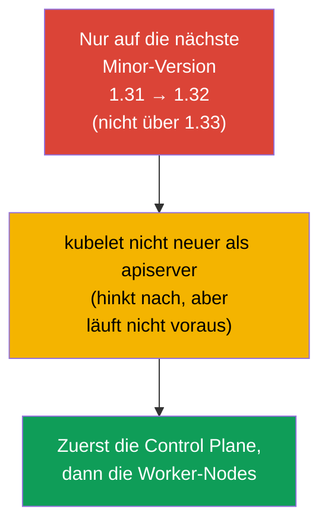
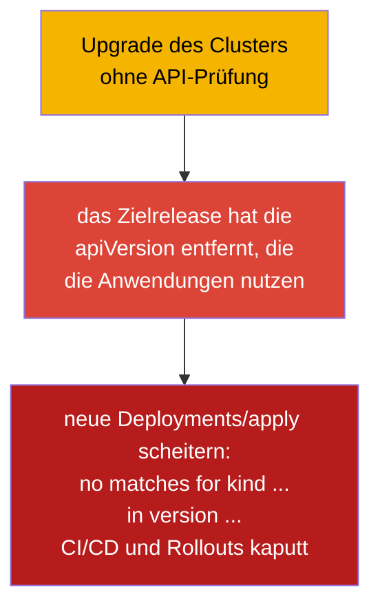
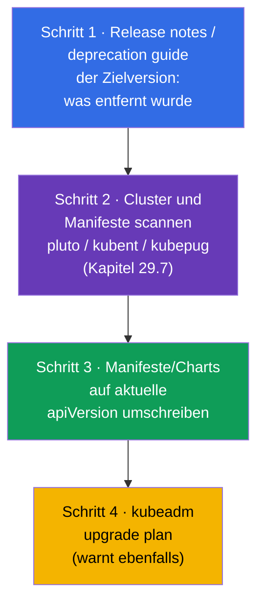
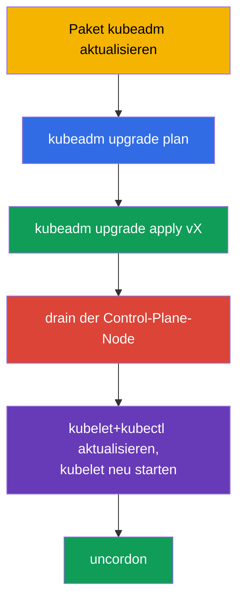
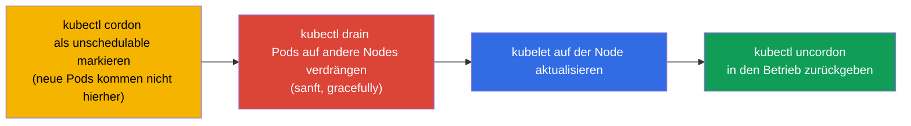
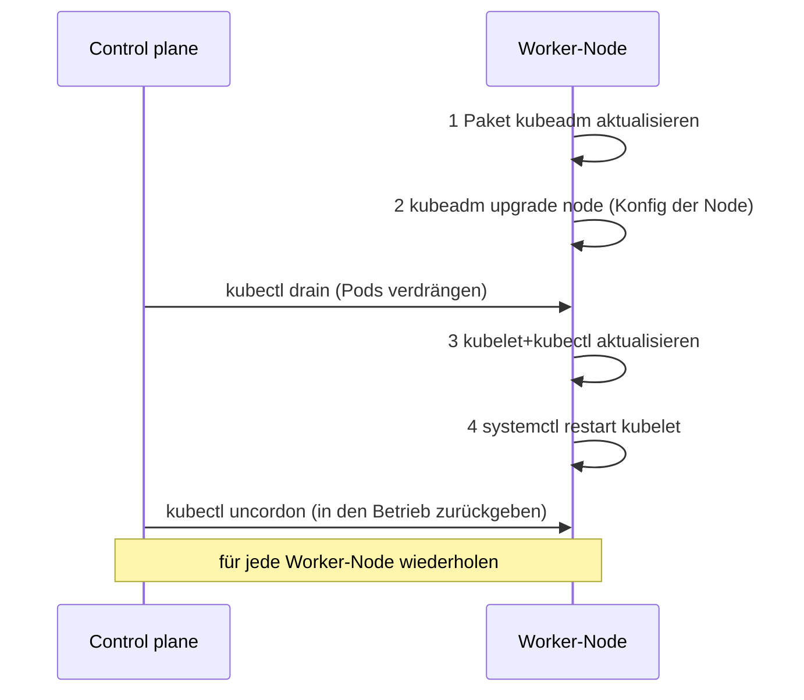
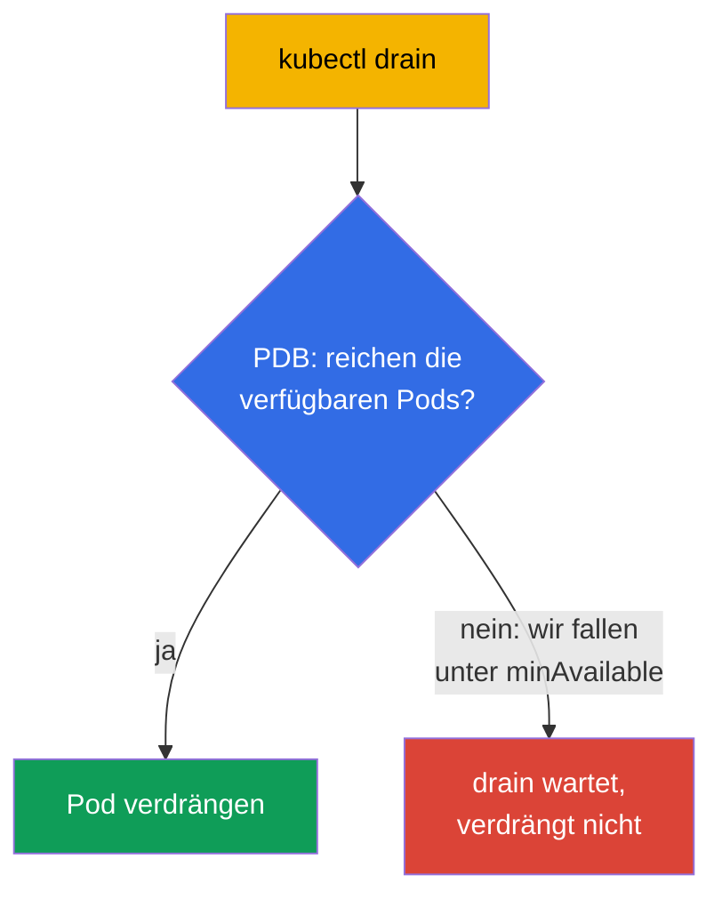

[Русская версия](ru.md) · [Eng version](README.md) · [Versión en español](es.md) · [Version française](fr.md) · [ქართული ვერსია](ge.md)

# Kapitel 36. Upgrade des Clusters (lifecycle)

> 🟦 **Kapitel für CKA** (Domäne Cluster Architecture, Installation & Configuration).
>
> **Was kommt.** Der Cluster ist gebaut (Kapitel 35), aber Kubernetes erscheint in neuen
> Versionen, und der Cluster muss aktualisiert werden. Ein Upgrade ist eine heikle Operation:
> macht man es falsch, kann man die Produktion umlegen. Wir sehen uns die richtige Reihenfolge
> beim Upgrade der Control Plane und der Worker-Nodes über kubeadm an, die Rolle von
> `cordon`/`drain` (Verbindung zu taints, Kapitel 13) und die Versionsregeln. Das ist eine
> direkte CKA-Aufgabe („aktualisiere den Cluster auf Version X“) und eine der wichtigsten
> Betriebsfähigkeiten.

## 36.1. Versionen und die skew-Regel

Kubernetes hat strenge Regeln zur Versionskompatibilität der Komponenten - die muss man
kennen, um den Cluster nicht zu zerstören.



- **Nur auf die nächste Minor-Version.** Man darf 1.31 → 1.33 nicht überspringen; es muss
  1.31 → 1.32 → 1.33 sein. Patch-Versionen innerhalb einer Minor-Version - frei.
- **Version skew.** Das kubelet darf hinter dem apiserver liegen (im Rahmen einiger
  Minor-Versionen), aber es **darf nicht neuer sein**. Deshalb wird die Control Plane zuerst
  aktualisiert.
- **Reihenfolge.** Zuerst die Control Plane (apiserver und die übrigen), dann die
  Worker-Nodes.

## 36.2. Pre-flight: Prüfung der API vor dem Upgrade (sonst lassen sich Anwendungen nicht mehr deployen)

Bevor man die Nodes anfasst, muss man die **API-Kompatibilität** prüfen. Kubernetes
**entfernt mit neuen Minor-Versionen veraltete API-Versionen** (Kapitel 29). Wenn eine
Anwendung, ein Helm-Chart, ein Operator oder ein CRD eine API-Version nutzt, die das
Zielrelease **entfernt hat**, dann gilt nach dem Upgrade:

- bereits erstellte Objekte gibt der apiserver unter der neuen Version aus (in der Regel ok),
- aber **neue `kubectl apply`/Deployments von Manifesten mit alter `apiVersion` scheitern**
  mit dem Fehler `no matches for kind ... in version ...` - also brechen Rollouts und CI/CD.



Klassische Beispiele entfernter APIs (häufiger Schmerz): `extensions/v1beta1` Ingress →
`networking.k8s.io/v1` (entfernt in 1.22), `policy/v1beta1` PodDisruptionBudget →
`policy/v1` (entfernt in 1.25), alte `apps/v1beta*` Deployment (entfernt in 1.16),
`batch/v1beta1` CronJob → `batch/v1` (entfernt in 1.25).

**Checkliste vor dem Upgrade:**



> **Werkzeuge für Schritt 2** (Scan von Cluster und Code auf veraltete/zu entfernende APIs) -
> ausführlich in [Kapitel 29](../29/de.md), Abschnitt **29.7 „Open-source-Werkzeuge zur
> Analyse veralteter APIs“**: kubent, pluto, kubepug (`kubectl deprecations`), kubeconform,
> Popeye - mit Befehlen für den Cluster und für CI.

```bash
# welche API-Versionen der Cluster jetzt tatsächlich bedient
kubectl api-versions
kubectl api-resources

# veraltete/zu entfernende API im lebenden Cluster und in Manifesten finden (Kapitel 29)
pluto detect-all-in-cluster
kubent                                  # kube-no-trouble
pluto detect-files -d ./manifests/

# ein Manifest auf die aktuelle API-Version konvertieren
kubectl convert -f old-ingress.yaml --output-version networking.k8s.io/v1
```

Separat prüft man, dass die **Addons kompatibel** mit der Zielversion von Kubernetes sind: CNI
(Calico/Cilium), CSI-Treiber, Ingress-Controller, metrics-server, außerdem
admission-webhooks und die CRDs der Operatoren - sie haben eigene
Kompatibilitätsmatrizen. Ein inkompatibles Addon kann nach dem Upgrade Netz, Storage oder die
Annahme von Traffic zerstören.

Fazit: **zuerst Anwendungen/Charts/Addons auf die vom Zielrelease unterstützten Versionen
bringen und erst dann den Cluster aktualisieren.** Sonst wird der Cluster aktualisiert, und
die Anwendungen lassen sich nicht mehr ausrollen.

## 36.3. Allgemeine Reihenfolge des Upgrades


Die Nodes aktualisiert man **eine nach der anderen**, damit der Cluster die ganze Zeit
arbeitsfähig bleibt: während eine Node gewartet wird, tragen die übrigen die Last. Genau das
ist ein sicheres Upgrade ohne Ausfallzeit.

## 36.4. Upgrade der Control Plane

Auf der ersten Control-Plane-Node ist die Reihenfolge folgende:

```bash
# 1. kubeadm selbst auf die Zielversion aktualisieren
sudo apt-mark unhold kubeadm
sudo apt-get install -y kubeadm=1.32.x-*
sudo apt-mark hold kubeadm

# 2. Den Upgrade-Plan ansehen
sudo kubeadm upgrade plan

# 3. Das Upgrade der Control Plane anwenden
sudo kubeadm upgrade apply v1.32.x

# 4. Die Control-Plane-Node freiräumen (drain), wie jede andere vor dem kubelet-Upgrade
kubectl drain <control-plane> --ignore-daemonsets

# 5. kubelet und kubectl auf dieser Node aktualisieren
sudo apt-mark unhold kubelet kubectl
sudo apt-get install -y kubelet=1.32.x-* kubectl=1.32.x-*
sudo apt-mark hold kubelet kubectl
sudo systemctl daemon-reload
sudo systemctl restart kubelet

# 6. Die Control-Plane-Node in den Betrieb zurückgeben
kubectl uncordon <control-plane>
```



> **Hinweis.** `kubeadm upgrade apply` macht man nur auf der **ersten** Control-Plane-Node.
> Auf den übrigen Control-Plane-Nodes (in HA, Kapitel 35A) führt man statt `apply`
> `kubeadm upgrade node` aus - wie auf den Worker-Nodes (Abschnitt 36.6), aber der drain der
> Control-Plane-Node ist ebenfalls nötig.

## 36.5. cordon und drain: Vorbereitung der Node auf das Upgrade

Vor dem Upgrade des kubelet muss man **jede** Node von Pods freiräumen, um die Last nicht zu
beeinträchtigen. Das sind zwei Schritte:



```bash
kubectl cordon <node>                              # hierher nicht mehr planen
kubectl drain <node> --ignore-daemonsets --delete-emptydir-data   # Pods verdrängen
# ... kubelet auf der Node aktualisieren ...
kubectl uncordon <node>                            # in den Planungspool zurückgeben
```

- **cordon** setzt auf die Node den taint `unschedulable` (Kapitel 13) - neue Pods werden
  hierher nicht zugewiesen, aber die bereits laufenden arbeiten weiter.
- **drain** verdrängt zusätzlich die Pods (sanft, unter Beachtung des graceful shutdown) und
  verlagert sie auf andere Nodes. `--ignore-daemonsets` braucht man, weil die Pods eines
  DaemonSet an die Node gebunden sind und nicht umziehen; `--delete-emptydir-data` erlaubt,
  Pods mit emptyDir zu löschen.

## 36.6. Upgrade der Worker-Nodes

Für jede Worker-Node (eine nach der anderen). Die Reihenfolge - wie in der offiziellen
kubeadm-Dokumentation: zuerst **zwei kubeadm-Schritte** (das Paket selbst aktualisieren und
`kubeadm upgrade node`), und erst danach drain und das Upgrade des kubelet.

```bash
# --- auf der Worker-Node selbst ---
# 1. Das Paket kubeadm auf die Zielversion aktualisieren
sudo apt-mark unhold kubeadm && sudo apt-get update && sudo apt-get install -y kubeadm=1.32.x-* && sudo apt-mark hold kubeadm

# 2. kubeadm upgrade node — aktualisiert die lokale Konfiguration der Node (kubelet-config)
sudo kubeadm upgrade node

# --- von der Control Plane: die Node freiräumen ---
kubectl drain <worker> --ignore-daemonsets --delete-emptydir-data

# --- wieder auf der Worker-Node ---
# 3. kubelet und kubectl aktualisieren
sudo apt-mark unhold kubelet kubectl && sudo apt-get install -y kubelet=1.32.x-* kubectl=1.32.x-* && sudo apt-mark hold kubelet kubectl
# 4. kubelet neu starten
sudo systemctl daemon-reload && sudo systemctl restart kubelet

# --- von der Control Plane: die Node in den Betrieb zurückgeben ---
kubectl uncordon <worker>
```



Die zwei zentralen kubeadm-Schritte: **das Paket `kubeadm` aktualisieren** und
**`kubeadm upgrade node`** (nicht `apply`!) - letzteres wendet das Upgrade der lokalen
Konfiguration der Node an. Sie kommen **vor** dem `drain` - `kubeadm upgrade node` stört die
laufenden Pods nicht.

Auf den Worker-Nodes verwendet man `kubeadm upgrade node` (nicht `apply`) - es aktualisiert die
lokale Konfiguration der Node.

## 36.7. PodDisruptionBudget: Schutz beim drain

`drain` verdrängt Pods, aber was, wenn das die Verfügbarkeit der Anwendung umlegt (alle
Replicas liegen auf der zu räumenden Node)? **PodDisruptionBudget (PDB)** legt das Minimum
verfügbarer Pods fest, unter das eine freiwillige Verdrängung (drain) nicht geht.

```yaml
apiVersion: policy/v1
kind: PodDisruptionBudget
metadata:
  name: web-pdb
spec:
  minAvailable: 2            # immer mindestens 2 Pods verfügbar halten
  selector:
    matchLabels:
      app: web
```



Ein PDB schützt davor, dass die Wartung von Nodes (oder ein Autoscaling nach unten) die
Anwendung umlegt. Beim Upgrade des Clusters zwingt das PDB den `drain` zu warten, solange ein
Pod nicht sicher verdrängt werden kann.

## 36.8. Upgrade des OS einer Node

Unabhängig von der Kubernetes-Version muss man manchmal das OS der Node selbst aktualisieren
(Patches, Kernel). Die Reihenfolge ist die gleiche: `cordon` → `drain` → Wartung/Neustart der
Node → `uncordon`. Wenn eine Node für längere Zeit außer Betrieb genommen oder ersetzt wird,
entfernt man sie aus dem Cluster:

```bash
kubectl drain <node> --ignore-daemonsets
kubectl delete node <node>              # aus dem Cluster entfernen
# (auf der Node) kubeadm reset           # Zustand aufräumen
```

## 36.9. Wie man das in der Produktion anwendet

- **Upgrade Node für Node - eine eiserne Regel.** In der Produktion aktualisiert man die Nodes
  strikt der Reihe nach mit cordon/drain, damit die Anwendung die ganze Zeit verfügbar bleibt.
  Ein Massen-Upgrade aller Nodes gleichzeitig = garantierter Ausfall.
- **PDBs sind für kritische Services Pflicht.** Ohne PDB kann `drain` alle Replicas auf
  einen Schlag verdrängen. In der Produktion gibt man jedem wichtigen Deployment ein PDB
  (`minAvailable`/`maxUnavailable`), damit die Wartung von Nodes den Service nicht umlegt.
- **Managed Cluster vereinfachen, ersparen es aber nicht.** In EKS/GKE/AKS aktualisiert der
  Provider die Control Plane, aber die Worker-Nodes (node pools) aktualisiert das Team - mit
  denselben cordon/drain und PDB. Häufig macht man das über das Neuaufsetzen der Nodes
  (rolling replacement).
- **Backup von etcd vor dem Upgrade der Control Plane.** Erfahrene Teams machen vor
  `kubeadm upgrade apply` einen Snapshot von etcd (Kapitel 37) - eine Versicherung für den
  Fall eines misslungenen Upgrades.
- **Einhaltung des version skew und eine Testumgebung.** Man aktualisiert strikt um eine
  Minor-Version und zuerst auf dev/stage, liest die release notes im Hinblick auf entfernte
  APIs und brechende Änderungen, und die Manifeste/Charts lässt man durch die Werkzeuge aus
  [Kapitel 29 (Abschnitt 29.7)](../29/de.md) laufen: kubent/pluto über den Cluster und
  pluto/kubepug/kubeconform in CI.

## 36.10. Mini-Glossar

- **Version skew** - die zulässige Versionsdifferenz der Komponenten; kubelet nicht neuer als apiserver.
- **kubeadm upgrade plan / apply / node** - Plan / Anwendung (erste CP) / Upgrade der
  Node.
- **cordon** - die Node als unschedulable markieren (neue Pods kommen nicht hierher).
- **drain** - Pods von der Node verdrängen (gracefully), auf andere verlagern.
- **uncordon** - die Node in den Planungspool zurückgeben.
- **--ignore-daemonsets** - beim drain die Pods eines DaemonSet nicht anfassen (sie sind an die Node gebunden).
- **PodDisruptionBudget (PDB)** - Minimum verfügbarer Pods bei freiwilliger Verdrängung.
- **kubeadm reset** - Aufräumen des kubeadm-Zustands auf der Node.
- **pluto / kubent** - Suche nach veralteten/zu entfernenden APIs im Cluster und in Manifesten (Kapitel 29).
- **kubectl convert** - Konvertierung eines Manifests auf die aktuelle API-Version.
- **Entfernen einer API** - das Zielrelease kann eine apiVersion herausnehmen → alte Manifeste lassen sich nicht mehr deployen.

## 36.11. Zusammenfassung des Kapitels

- **Vor dem Upgrade prüft man die API-Kompatibilität:** das Zielrelease kann API-Versionen
  entfernen, die die Anwendungen/Charts/Addons nutzen - dann scheitern nach dem Upgrade neue
  Deployments (`no matches for kind ... in version ...`). Man scannt mit pluto/kubent, repariert
  die Manifeste (`kubectl convert`) und prüft die Addons VOR dem Upgrade.
- Aktualisieren kann man nur auf die nächste Minor-Version; das kubelet darf nicht neuer sein
  als der apiserver (version skew) - deshalb die Control Plane zuerst.
- Reihenfolge: Control Plane → Worker-Nodes, eine nach der anderen, um die Verfügbarkeit nicht zu verlieren.
- Control Plane: kubeadm aktualisieren → `upgrade plan` → `upgrade apply vX` → kubelet/kubectl
  aktualisieren und kubelet neu starten.
- Vor dem Upgrade des kubelet räumt man die Node frei: `cordon` (unschedulable) + `drain`
  (Pods verdrängen), danach - `uncordon`.
- Worker-Nodes verwenden `kubeadm upgrade node` (nicht apply).
- Ein PodDisruptionBudget lässt `drain` die Verfügbarkeit der Anwendung nicht unter das Minimum drücken.
- Upgrade des OS/Ersatz einer Node - dieselben cordon/drain, bei der Außerbetriebnahme -
  `delete node` + `kubeadm reset`.

## 36.12. Wofür das nützlich ist: in der Prüfung und in der echten Arbeit

**In der Prüfung (CKA).** „Aktualisiere den Cluster auf Version X“ - eine klassische Aufgabe:
man muss die Reihenfolge kennen (Control Plane → Worker, eine nach der anderen), die Befehle
kubeadm upgrade und die zwingenden cordon/drain/uncordon. Ein Fehler in der Reihenfolge oder
ein übersprungener drain - Punktverlust.

**In der echten Arbeit.** Das Upgrade eines Clusters ist eine regelmäßige Betriebsprozedur.
Die richtige Reihenfolge, cordon/drain und PDB sorgen für ein Upgrade ohne Ausfallzeit; ein
Backup von etcd vor dem Upgrade der Control Plane ist die Versicherung. Dieselben Techniken
(cordon/drain) wendet man bei jeder Wartung und beim Ersatz von Nodes an.

## 36.13. Fragen zur Selbstüberprüfung

1. Warum muss man vor dem Upgrade des Clusters die genutzten API-Versionen prüfen und was
   droht, wenn man diesen Schritt überspringt? Mit welchen Werkzeugen prüft man das?
2. Warum darf man eine Minor-Version nicht überspringen und warum wird die Control Plane zuerst aktualisiert?
3. Was ist version skew und wie hängt er mit der Reihenfolge des Upgrades zusammen?
4. Wodurch unterscheiden sich `cordon` und `drain`? Wozu braucht man `--ignore-daemonsets`?
5. In welcher Reihenfolge aktualisiert man Control Plane und Worker-Nodes und warum eine nach der anderen?
6. Wodurch unterscheidet sich `kubeadm upgrade apply` von `kubeadm upgrade node`?
7. Was macht ein PodDisruptionBudget beim drain und wozu braucht man es?
8. Welche Schrittfolge gilt beim Upgrade des OS einer Node oder bei deren Ersatz?

## Praxis

Wir haben gelernt, einen Cluster sicher zu aktualisieren. In Kapitel 37 - das Wertvollste im
Betrieb: Backup und Wiederherstellung von etcd, ohne das der Verlust der Control Plane den
Verlust des Clusters bedeutet. Das Upgrade eines Clusters übt man in den Labs zur
Administration.

🧪 Lab 111 (kubeadm upgrade): [tasks/cka/labs/111](../../labs/111/README_DE.MD)

---
[Inhalt](../README_DE.md) · [Kapitel 35](../35/de.md) · [Kapitel 37](../37/de.md)
