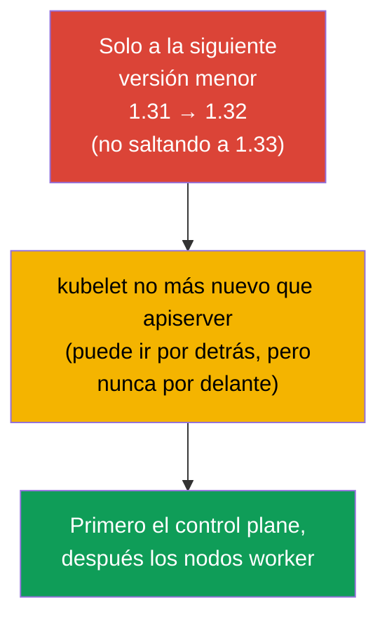
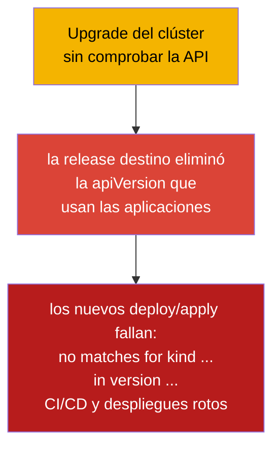
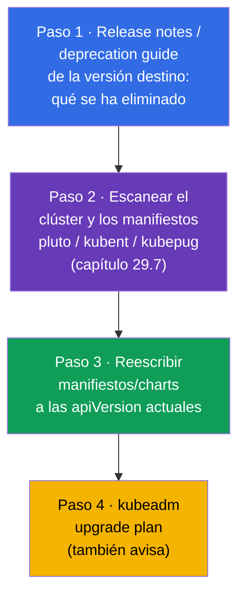
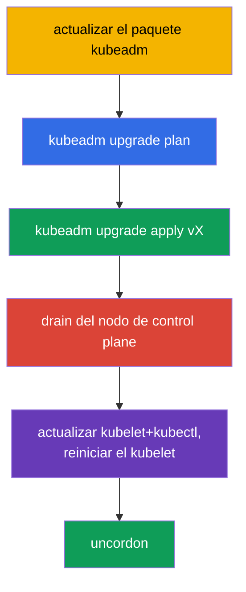
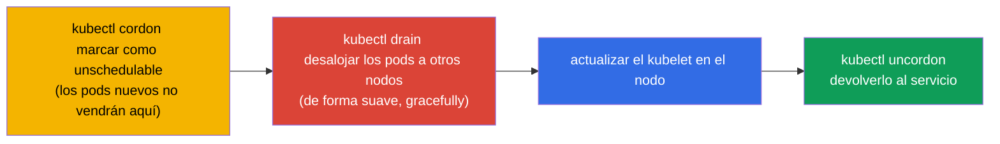
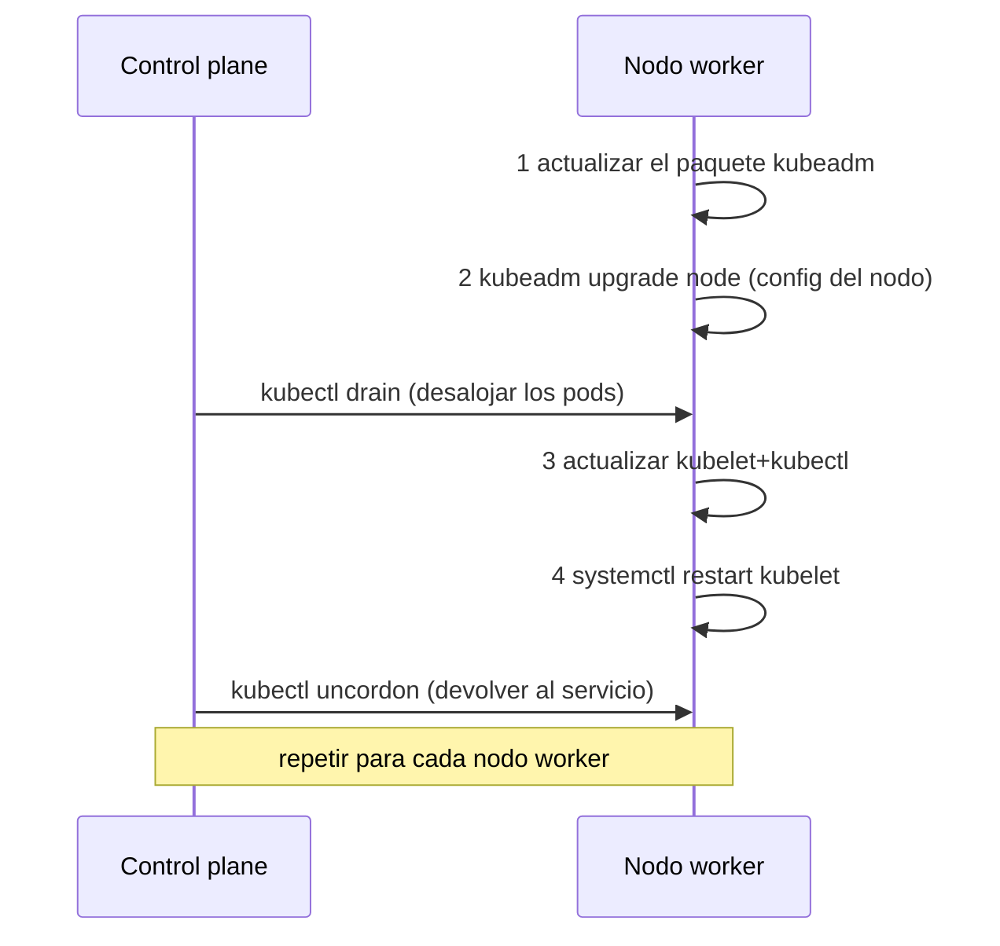
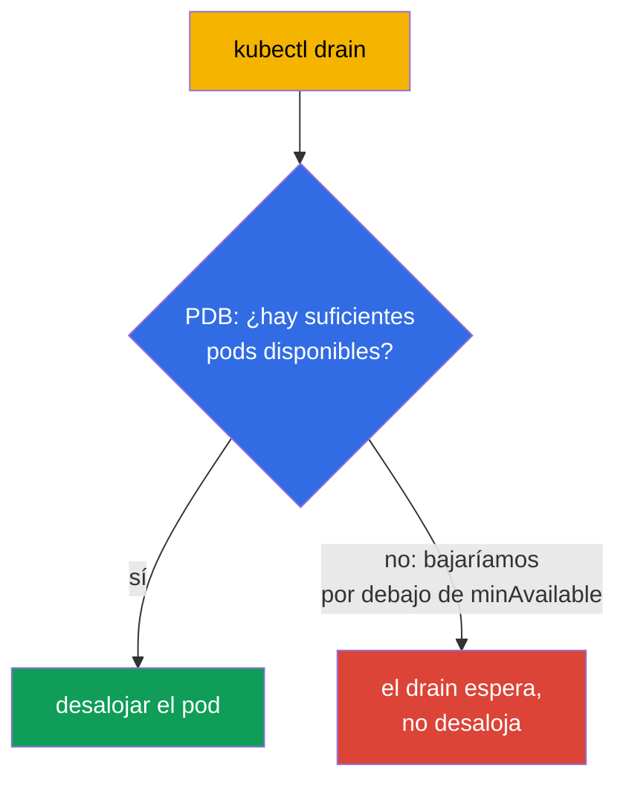

[Русская версия](ru.md) · [Eng version](README.md) · [Version française](fr.md) · [Deutsche Version](de.md) · [ქართული ვერსია](ge.md)

# Capítulo 36. Actualización del clúster (lifecycle)

> 🟦 **Capítulo para CKA** (dominio Cluster Architecture, Installation & Configuration).
>
> **Qué viene ahora.** El clúster ya está montado (capítulo 35), pero Kubernetes publica versiones
> nuevas y el clúster hay que actualizarlo. La actualización es una operación delicada: si se hace
> mal, se puede tumbar producción. Veremos el orden correcto para actualizar el control plane y los
> nodos worker con kubeadm, el papel de `cordon`/`drain` (relación con los taints, capítulo 13) y
> las reglas de versiones. Es una tarea directa del CKA («actualiza el clúster a la versión X») y
> una de las habilidades de operación más importantes.

## 36.1. Versiones y la regla del skew

Kubernetes tiene reglas estrictas de compatibilidad entre las versiones de los componentes - hay
que conocerlas para no romper el clúster.



- **Solo a la siguiente versión menor.** No se puede saltar de 1.31 a 1.33; hay que hacer 1.31 →
  1.32 → 1.33. Las versiones de parche dentro de una menor son libres.
- **Version skew.** El kubelet puede ir por detrás del apiserver (dentro de unas pocas versiones
  menores), pero **no puede ser más nuevo**. Por eso el control plane se actualiza primero.
- **Orden.** Primero el control plane (apiserver y el resto), después los nodos worker.

## 36.2. Preflight: comprobar la API antes de actualizar (si no, las aplicaciones dejarán de desplegarse)

Antes de tocar los nodos hay que comprobar la **compatibilidad de la API**. Kubernetes, con cada
versión menor nueva, **elimina versiones de API obsoletas** (capítulo 29). Si una aplicación, un
chart de Helm, un operador o un CRD usan una versión de API que la release destino **ha eliminado**,
entonces después del upgrade:

- los objetos ya creados los devuelve el apiserver bajo la versión nueva (normalmente bien),
- pero **los nuevos `kubectl apply`/despliegues de manifiestos con la `apiVersion` antigua fallan**
  con el error `no matches for kind ... in version ...` - es decir, los despliegues y el CI/CD se
  rompen.



Ejemplos clásicos de API eliminadas (un dolor frecuente): `extensions/v1beta1` Ingress →
`networking.k8s.io/v1` (eliminada en 1.22), `policy/v1beta1` PodDisruptionBudget →
`policy/v1` (eliminada en 1.25), los antiguos `apps/v1beta*` Deployment (eliminados en 1.16),
`batch/v1beta1` CronJob → `batch/v1` (eliminada en 1.25).

**Checklist antes del upgrade:**



> **Herramientas para el paso 2** (escanear el clúster y el código en busca de API
> obsoletas/eliminadas) - en detalle en el [capítulo 29](../29/es.md), sección **29.7
> «Herramientas open-source de análisis de API obsoletas»**: kubent, pluto, kubepug
> (`kubectl deprecations`), kubeconform, Popeye - con comandos para el clúster y para el CI.

```bash
# qué versiones de API sirve realmente el clúster ahora mismo
kubectl api-versions
kubectl api-resources

# encontrar API obsoletas/eliminadas en el clúster vivo y en los manifiestos (capítulo 29)
pluto detect-all-in-cluster
kubent                                  # kube-no-trouble
pluto detect-files -d ./manifests/

# convertir un manifiesto a la versión de API actual
kubectl convert -f old-ingress.yaml --output-version networking.k8s.io/v1
```

Aparte se comprueba que los **addons sean compatibles** con la versión destino de Kubernetes: CNI
(Calico/Cilium), drivers CSI, controlador de ingress, metrics-server, y también los
admission-webhook y los CRD de los operadores - cada uno tiene su matriz de compatibilidad. Un
addon incompatible tras el upgrade puede romper la red, el almacenamiento o la entrada de tráfico.

Conclusión: **primero hay que llevar las aplicaciones/charts/addons a las versiones soportadas por
la release destino, y solo después actualizar el clúster.** Si no, el clúster se actualizará y las
aplicaciones dejarán de desplegarse.

## 36.3. Orden general de la actualización


Los nodos se actualizan **de uno en uno**, para que el clúster siga operativo en todo momento:
mientras se atiende a un nodo, los demás soportan la carga. Eso es exactamente la actualización
segura sin tiempo de caída.

## 36.4. Actualización del control plane

En el primer nodo de control plane el orden es este:

```bash
# 1. Actualizar kubeadm en sí a la versión destino
sudo apt-mark unhold kubeadm
sudo apt-get install -y kubeadm=1.32.x-*
sudo apt-mark hold kubeadm

# 2. Ver el plan de actualización
sudo kubeadm upgrade plan

# 3. Aplicar la actualización del control plane
sudo kubeadm upgrade apply v1.32.x

# 4. Liberar el nodo de control plane (drain), como cualquier otro antes de actualizar el kubelet
kubectl drain <control-plane> --ignore-daemonsets

# 5. Actualizar kubelet y kubectl en este nodo
sudo apt-mark unhold kubelet kubectl
sudo apt-get install -y kubelet=1.32.x-* kubectl=1.32.x-*
sudo apt-mark hold kubelet kubectl
sudo systemctl daemon-reload
sudo systemctl restart kubelet

# 6. Devolver el nodo de control plane al servicio
kubectl uncordon <control-plane>
```



> **Nota.** `kubeadm upgrade apply` se hace solo en el **primer** nodo de control plane. En los
> demás nodos de control plane (en HA, capítulo 35A), en lugar de `apply` se ejecuta
> `kubeadm upgrade node` - igual que en los nodos worker (sección 36.6), pero el drain del nodo de
> control plane también es necesario.

## 36.5. cordon y drain: preparar el nodo para la actualización

Antes de actualizar el kubelet en **cualquier** nodo hay que liberarlo de pods, para no afectar a
la carga. Son dos pasos:



```bash
kubectl cordon <node>                              # no planificar más aquí
kubectl drain <node> --ignore-daemonsets --delete-emptydir-data   # desalojar los pods
# ... actualizar el kubelet en el nodo ...
kubectl uncordon <node>                            # devolverlo al pool de planificación
```

- **cordon** pone en el nodo el taint `unschedulable` (capítulo 13) - los pods nuevos no se asignan
  aquí, pero los que ya están en marcha siguen funcionando.
- **drain** además desaloja los pods (de forma suave, respetando el graceful shutdown),
  trasladándolos a otros nodos. `--ignore-daemonsets` es necesario porque los pods de un DaemonSet
  están ligados al nodo y no se mueven; `--delete-emptydir-data` permite eliminar pods con emptyDir.

## 36.6. Actualización de los nodos worker

Para cada nodo worker (de uno en uno). El orden es el de la documentación oficial de kubeadm:
primero **dos pasos de kubeadm** (actualizar el propio paquete y `kubeadm upgrade node`), y solo
después el drain y la actualización del kubelet.

```bash
# --- en el propio nodo worker ---
# 1. Actualizar el paquete kubeadm a la versión destino
sudo apt-mark unhold kubeadm && sudo apt-get update && sudo apt-get install -y kubeadm=1.32.x-* && sudo apt-mark hold kubeadm

# 2. kubeadm upgrade node — actualiza la configuración local del nodo (kubelet-config)
sudo kubeadm upgrade node

# --- desde el control plane: liberar el nodo ---
kubectl drain <worker> --ignore-daemonsets --delete-emptydir-data

# --- de nuevo en el nodo worker ---
# 3. Actualizar kubelet y kubectl
sudo apt-mark unhold kubelet kubectl && sudo apt-get install -y kubelet=1.32.x-* kubectl=1.32.x-* && sudo apt-mark hold kubelet kubectl
# 4. Reiniciar el kubelet
sudo systemctl daemon-reload && sudo systemctl restart kubelet

# --- desde el control plane: devolver el nodo al servicio ---
kubectl uncordon <worker>
```



Los dos pasos clave de kubeadm: **actualizar el paquete `kubeadm`** y **`kubeadm upgrade node`**
(¡no `apply`!) - este último aplica la actualización de la configuración local del nodo. Van
**antes** del `drain` - `kubeadm upgrade node` no molesta a los pods en marcha.

En los nodos worker se usa `kubeadm upgrade node` (no `apply`) - actualiza la configuración local
del nodo.

## 36.7. PodDisruptionBudget: protección durante el drain

El `drain` desaloja pods, pero ¿qué pasa si eso tumba la disponibilidad de la aplicación (todas las
réplicas están en el nodo que se vacía)? El **PodDisruptionBudget (PDB)** define el mínimo de pods
disponibles por debajo del cual el desalojo voluntario (drain) no bajará.

```yaml
apiVersion: policy/v1
kind: PodDisruptionBudget
metadata:
  name: web-pdb
spec:
  minAvailable: 2            # mantener siempre un mínimo de 2 pods disponibles
  selector:
    matchLabels:
      app: web
```



El PDB protege de que el mantenimiento de los nodos (o el autoescalado hacia abajo) tumbe la
aplicación. Durante la actualización del clúster, el PDB obliga al `drain` a esperar mientras no se
pueda desalojar un pod de forma segura.

## 36.8. Actualización del SO del nodo

Al margen de la versión de Kubernetes, a veces hay que actualizar el propio SO del nodo (parches,
kernel). El orden es el mismo: `cordon` → `drain` → mantenimiento/reinicio del nodo → `uncordon`.
Si el nodo se retira por mucho tiempo o se reemplaza, se elimina del clúster:

```bash
kubectl drain <node> --ignore-daemonsets
kubectl delete node <node>              # quitarlo del clúster
# (en el nodo) kubeadm reset            # limpiar el estado
```

## 36.9. Cómo se aplica esto en producción

- **Actualizar de un nodo en uno es una regla de hierro.** En producción los nodos se actualizan
  estrictamente por turnos con cordon/drain, para que la aplicación siga disponible todo el tiempo.
  Actualizar todos a la vez = tiempo de caída garantizado.
- **Los PDB son obligatorios para los servicios críticos.** Sin PDB, el `drain` puede desalojar
  todas las réplicas de golpe. En producción, a cada Deployment importante se le define un PDB
  (`minAvailable`/`maxUnavailable`), para que el mantenimiento de nodos no tumbe el servicio.
- **Los clústeres gestionados lo simplifican, pero no lo eliminan.** En EKS/GKE/AKS el control plane
  lo actualiza el proveedor, pero los nodos worker (node pools) los actualiza el equipo - con los
  mismos cordon/drain y PDB. A menudo se hace recreando los nodos (rolling replacement).
- **Backup de etcd antes de actualizar el control plane.** Los equipos con experiencia hacen un
  snapshot de etcd antes de `kubeadm upgrade apply` (capítulo 37) - un seguro por si la
  actualización sale mal.
- **Respetar el version skew y usar un entorno de pruebas.** Se actualiza estrictamente de una
  versión menor en una y primero en dev/stage, se leen las release notes buscando API eliminadas y
  cambios que rompan, y los manifiestos/charts se pasan por las herramientas del [capítulo 29
  (sección 29.7)](../29/es.md): kubent/pluto sobre el clúster y pluto/kubepug/kubeconform en el CI.

## 36.10. Mini-glosario

- **Version skew** - diferencia admisible entre las versiones de los componentes; el kubelet no más
  nuevo que el apiserver.
- **kubeadm upgrade plan / apply / node** - plan / aplicación (primer CP) / actualización del nodo.
- **cordon** - marcar el nodo como unschedulable (los pods nuevos no van ahí).
- **drain** - desalojar los pods del nodo (gracefully), trasladarlos a otros.
- **uncordon** - devolver el nodo al pool de planificación.
- **--ignore-daemonsets** - en el drain, no tocar los pods de DaemonSet (están ligados al nodo).
- **PodDisruptionBudget (PDB)** - mínimo de pods disponibles durante un desalojo voluntario.
- **kubeadm reset** - limpieza del estado de kubeadm en el nodo.
- **pluto / kubent** - búsqueda de API obsoletas/eliminadas en el clúster y los manifiestos (capítulo 29).
- **kubectl convert** - conversión de un manifiesto a la versión de API actual.
- **eliminación de API** - la release destino puede quitar una apiVersion → los manifiestos antiguos dejan de desplegarse.

## 36.11. Resumen del capítulo

- **Antes del upgrade se comprueba la compatibilidad de la API:** la release destino puede eliminar
  versiones de API que usan las aplicaciones/charts/addons - entonces, tras la actualización, los
  nuevos despliegues fallan (`no matches for kind ... in version ...`). Se escanea con pluto/kubent,
  se arreglan los manifiestos (`kubectl convert`) y se comprueban los addons ANTES de actualizar.
- Solo se puede actualizar a la siguiente versión menor; el kubelet no debe ser más nuevo que el
  apiserver (version skew) - por eso el control plane va primero.
- Orden: control plane → nodos worker, de uno en uno, para no perder disponibilidad.
- Control plane: actualizar kubeadm → `upgrade plan` → `upgrade apply vX` → actualizar
  kubelet/kubectl y reiniciar el kubelet.
- Antes de actualizar el kubelet, el nodo se libera: `cordon` (unschedulable) + `drain` (desalojar
  los pods), y después `uncordon`.
- Los nodos worker usan `kubeadm upgrade node` (no apply).
- El PodDisruptionBudget impide que el `drain` baje la disponibilidad de la aplicación por debajo
  del mínimo.
- Actualizar el SO/reemplazar un nodo es el mismo cordon/drain, y al retirarlo - `delete node` +
  `kubeadm reset`.

## 36.12. Para qué sirve esto: en el examen y en el trabajo real

**En el examen (CKA).** «Actualiza el clúster a la versión X» es una tarea clásica: hay que conocer
el orden (control plane → worker, de uno en uno), los comandos de kubeadm upgrade y los
cordon/drain/uncordon obligatorios. Un error en el orden u olvidar el drain cuesta puntos.

**En el trabajo real.** Actualizar el clúster es un procedimiento de operación regular. El orden
correcto, cordon/drain y los PDB garantizan un upgrade sin tiempo de caída; el backup de etcd antes
de actualizar el control plane es el seguro. Estas mismas técnicas (cordon/drain) se aplican en
cualquier mantenimiento y reemplazo de nodos.

## 36.13. Preguntas de autocomprobación

1. ¿Por qué hay que comprobar las versiones de API usadas antes de actualizar el clúster y qué
   riesgo hay si se omite ese paso? ¿Con qué herramientas se comprueba?
2. ¿Por qué no se puede saltar una versión menor y por qué el control plane se actualiza primero?
3. ¿Qué es el version skew y cómo se relaciona con el orden de actualización?
4. ¿En qué se diferencian `cordon` y `drain`? ¿Para qué sirve `--ignore-daemonsets`?
5. ¿En qué orden se actualizan el control plane y los nodos worker y por qué de uno en uno?
6. ¿En qué se diferencia `kubeadm upgrade apply` de `kubeadm upgrade node`?
7. ¿Qué hace el PodDisruptionBudget durante el drain y para qué sirve?
8. ¿Cuál es el orden de acciones al actualizar el SO de un nodo o al reemplazarlo?

## Práctica

Ya sabemos actualizar el clúster de forma segura. En el capítulo 37 viene lo más valioso de la
operación: el backup y la restauración de etcd, sin el cual perder el control plane significa
perder el clúster. La actualización del clúster se practica en los laboratorios de administración.

🧪 Laboratorio 111 (kubeadm upgrade): [tasks/cka/labs/111](../../labs/111/README_ES.MD)

---
[Índice](../README_ES.md) · [Capítulo 35](../35/es.md) · [Capítulo 37](../37/es.md)
