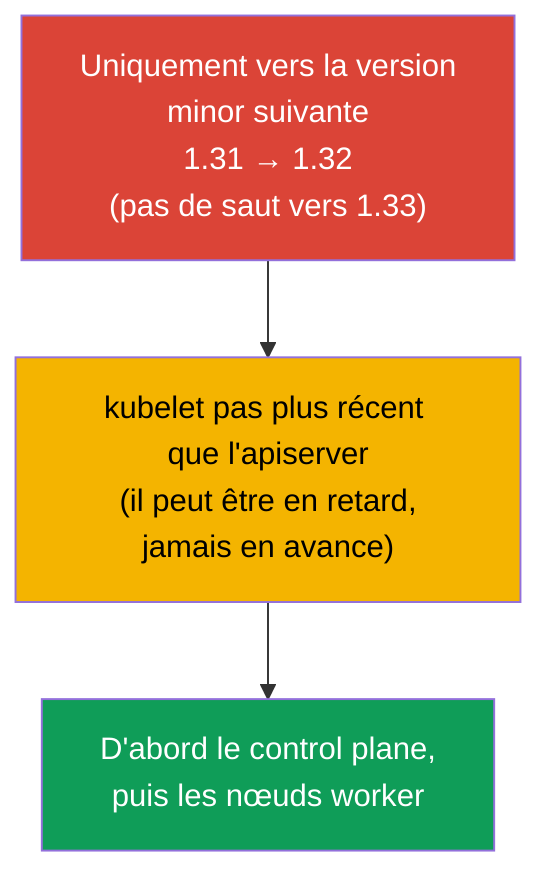
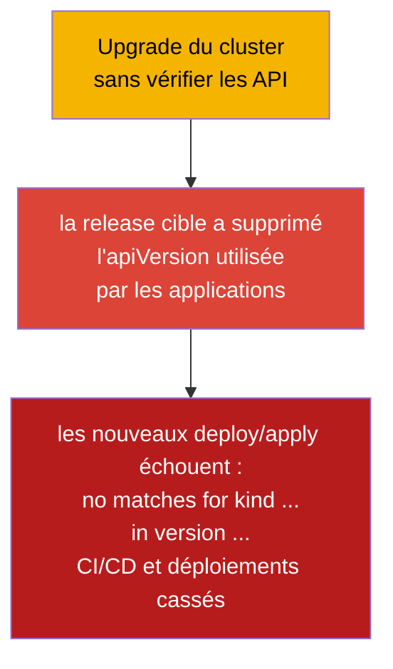
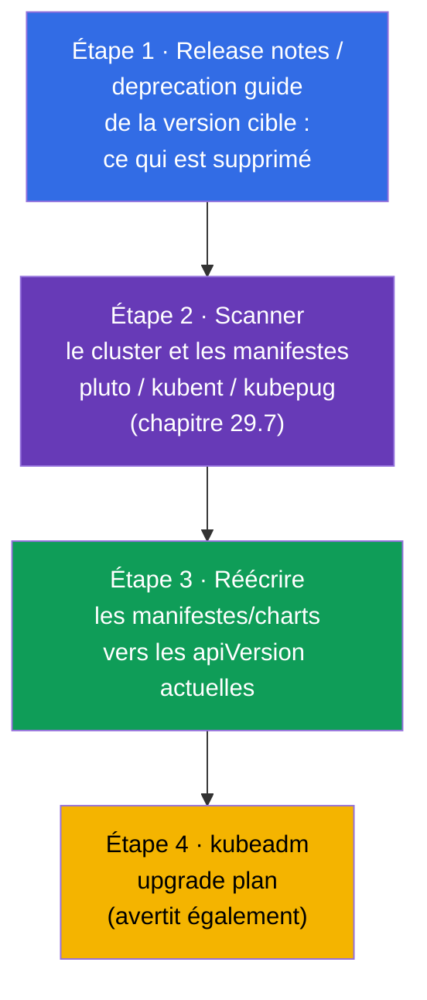
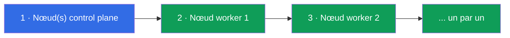
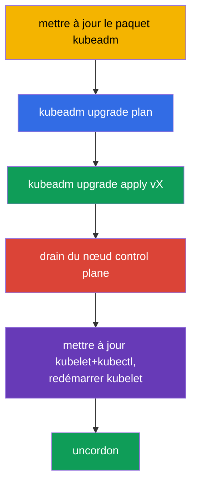
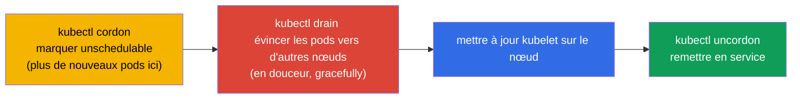
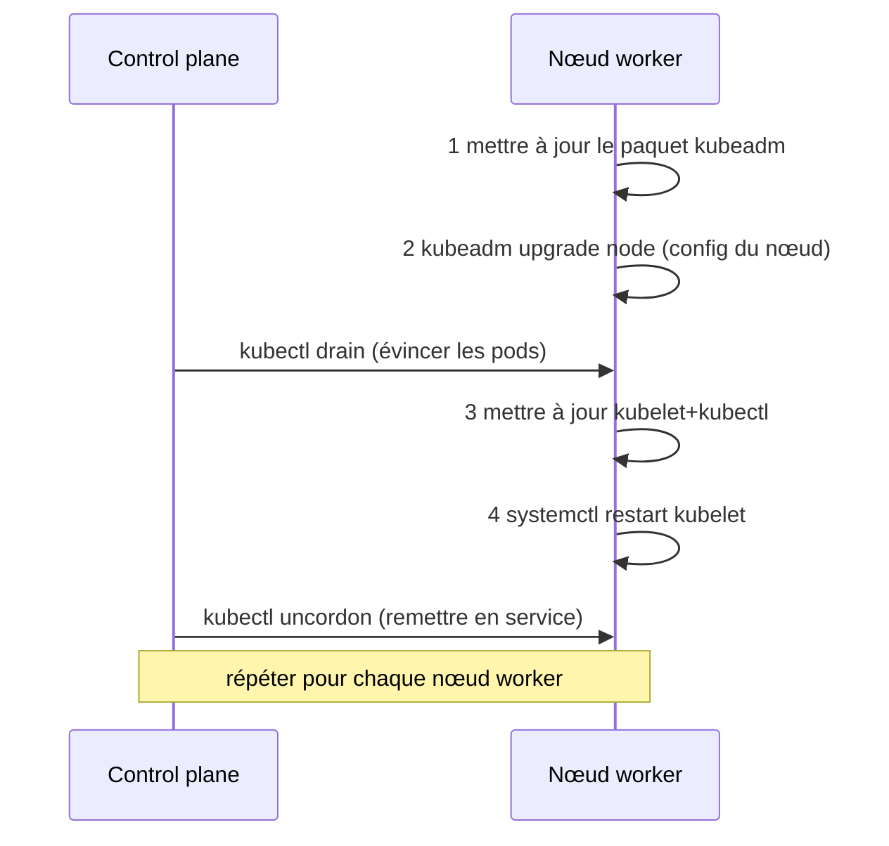
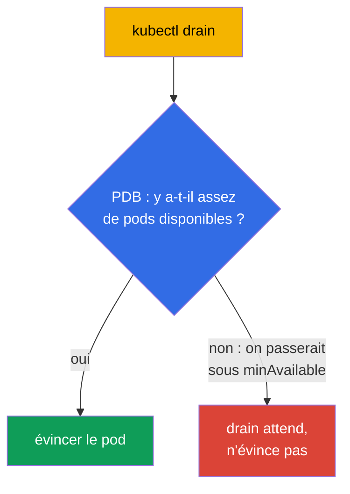

[Русская версия](ru.md) · [Eng version](README.md) · [Versión en español](es.md) · [Deutsche Version](de.md) · [ქართული ვერსია](ge.md) · [繁體中文版](tw.md) · [日本語版](jp.md)

# Chapitre 36. Mise à jour du cluster (lifecycle)

> 🟦 **Chapitre pour le CKA** (domaine Cluster Architecture, Installation & Configuration).
>
> **Ce qui suit.** Le cluster est monté (chapitre 35), mais Kubernetes publie de nouvelles versions
> et le cluster doit être mis à jour. La mise à jour est une opération délicate : mal menée, elle
> peut mettre la prod à terre. Nous verrons le bon ordre de mise à jour du control plane et des
> nœuds worker via kubeadm, le rôle de `cordon`/`drain` (lien avec les taints, chapitre 13) et les
> règles de versions. C'est un exercice CKA direct (« mets le cluster à jour vers la version X ») et
> une compétence d'exploitation essentielle.

## 36.1. Versions et règle du skew

Kubernetes impose des règles strictes de compatibilité entre versions de composants - il faut les
connaître pour ne pas casser le cluster.



- **Uniquement vers la version minor suivante.** On ne peut pas sauter de 1.31 à 1.33 ; il faut
  1.31 → 1.32 → 1.33. Les versions de patch au sein d'une minor - librement.
- **Version skew.** kubelet peut être en retard par rapport à l'apiserver (de quelques versions
  minor), mais **jamais plus récent**. C'est pourquoi le control plane est mis à jour en premier.
- **Ordre.** D'abord le control plane (apiserver et le reste), puis les nœuds worker.

## 36.2. Pré-vol : vérifier les API avant la mise à jour (sinon les applications ne se déploieront plus)

Avant de toucher aux nœuds, il faut vérifier la **compatibilité des API**. Avec chaque nouvelle
version minor, Kubernetes **supprime des versions d'API obsolètes** (chapitre 29). Si une
application, un chart Helm, un opérateur ou un CRD utilise une version d'API que la release cible a
**supprimée**, alors après l'upgrade :

- les objets déjà créés sont rendus par l'apiserver sous la nouvelle version (généralement ok),
- mais **les nouveaux `kubectl apply`/déploiements de manifestes avec l'ancienne `apiVersion`
  échouent** avec l'erreur `no matches for kind ... in version ...` - donc les déploiements et le
  CI/CD cassent.



Exemples classiques d'API supprimées (une douleur fréquente) : `extensions/v1beta1` Ingress →
`networking.k8s.io/v1` (supprimé en 1.22), `policy/v1beta1` PodDisruptionBudget →
`policy/v1` (supprimé en 1.25), les anciens `apps/v1beta*` Deployment (supprimés en 1.16),
`batch/v1beta1` CronJob → `batch/v1` (supprimé en 1.25).

**Checklist avant l'upgrade :**



> **Les outils de l'étape 2** (scan du cluster et du code à la recherche d'API obsolètes ou
> supprimées) sont détaillés au [chapitre 29](../29/fr.md), section **29.7 « Outils open-source
> d'analyse des API obsolètes »** : kubent, pluto, kubepug (`kubectl deprecations`), kubeconform,
> Popeye - avec les commandes pour le cluster et pour la CI.

```bash
# quelles versions d'API le cluster sert réellement aujourd'hui
kubectl api-versions
kubectl api-resources

# trouver les API obsolètes/supprimées dans le cluster vivant et dans les manifestes (chapitre 29)
pluto detect-all-in-cluster
kubent                                  # kube-no-trouble
pluto detect-files -d ./manifests/

# convertir un manifeste vers la version d'API actuelle
kubectl convert -f old-ingress.yaml --output-version networking.k8s.io/v1
```

On vérifie séparément que les **addons sont compatibles** avec la version cible de Kubernetes : le
CNI (Calico/Cilium), les drivers CSI, l'ingress-controller, metrics-server, ainsi que les
admission-webhooks et les CRD des opérateurs - ils ont leurs propres matrices de compatibilité. Un
addon incompatible après l'upgrade peut casser le réseau, le stockage ou la réception du trafic.

Conclusion : **d'abord amener applications/charts/addons aux versions supportées par la release
cible, et seulement ensuite mettre à jour le cluster.** Sinon le cluster sera à jour, mais les
applications ne se déploieront plus.

## 36.3. Ordre général de la mise à jour



Les nœuds sont mis à jour **un par un**, pour que le cluster reste opérationnel en permanence :
pendant qu'un nœud est en maintenance, les autres portent la charge. C'est cela, une mise à jour
sûre et sans interruption.

## 36.4. Mise à jour du control plane

Sur le premier nœud control plane, l'ordre est le suivant :

```bash
# 1. Mettre à jour kubeadm lui-même vers la version cible
sudo apt-mark unhold kubeadm
sudo apt-get install -y kubeadm=1.32.x-*
sudo apt-mark hold kubeadm

# 2. Consulter le plan de mise à jour
sudo kubeadm upgrade plan

# 3. Appliquer la mise à jour du control plane
sudo kubeadm upgrade apply v1.32.x

# 4. Libérer le nœud control plane (drain), comme tout autre nœud avant la mise à jour de kubelet
kubectl drain <control-plane> --ignore-daemonsets

# 5. Mettre à jour kubelet et kubectl sur ce nœud
sudo apt-mark unhold kubelet kubectl
sudo apt-get install -y kubelet=1.32.x-* kubectl=1.32.x-*
sudo apt-mark hold kubelet kubectl
sudo systemctl daemon-reload
sudo systemctl restart kubelet

# 6. Remettre le nœud control plane en service
kubectl uncordon <control-plane>
```



> **Remarque.** `kubeadm upgrade apply` ne se fait que sur le **premier** nœud control plane.
> Sur les autres nœuds control plane (en HA, chapitre 35A), on exécute `kubeadm upgrade node` au
> lieu d'`apply` - comme sur les nœuds worker (section 36.6), mais le drain du nœud control plane
> est nécessaire lui aussi.

## 36.5. cordon et drain : préparer un nœud à la mise à jour

Avant de mettre à jour kubelet sur **n'importe quel** nœud, il faut le libérer de ses pods pour ne
pas toucher à la charge. Cela se fait en deux étapes :



```bash
kubectl cordon <node>                              # ne plus rien planifier ici
kubectl drain <node> --ignore-daemonsets --delete-emptydir-data   # évincer les pods
# ... mettre à jour kubelet sur le nœud ...
kubectl uncordon <node>                            # remettre dans le pool de planification
```

- **cordon** pose sur le nœud le taint `unschedulable` (chapitre 13) - les nouveaux pods ne sont
  plus affectés ici, mais ceux déjà lancés continuent de tourner.
- **drain** évince en plus les pods (en douceur, en respectant le graceful shutdown), en les
  déplaçant vers d'autres nœuds. `--ignore-daemonsets` est nécessaire parce que les pods d'un
  DaemonSet sont liés au nœud et ne déménagent pas ; `--delete-emptydir-data` autorise la
  suppression des pods utilisant emptyDir.

## 36.6. Mise à jour des nœuds worker

Pour chaque nœud worker (un par un). L'ordre est celui de la documentation officielle de kubeadm :
d'abord **deux étapes kubeadm** (mettre à jour le paquet et `kubeadm upgrade node`), et seulement
ensuite le drain et la mise à jour de kubelet.

```bash
# --- sur le nœud worker lui-même ---
# 1. Mettre à jour le paquet kubeadm vers la version cible
sudo apt-mark unhold kubeadm && sudo apt-get update && sudo apt-get install -y kubeadm=1.32.x-* && sudo apt-mark hold kubeadm

# 2. kubeadm upgrade node — met à jour la configuration locale du nœud (kubelet-config)
sudo kubeadm upgrade node

# --- depuis le control plane : libérer le nœud ---
kubectl drain <worker> --ignore-daemonsets --delete-emptydir-data

# --- de nouveau sur le nœud worker ---
# 3. Mettre à jour kubelet et kubectl
sudo apt-mark unhold kubelet kubectl && sudo apt-get install -y kubelet=1.32.x-* kubectl=1.32.x-* && sudo apt-mark hold kubelet kubectl
# 4. Redémarrer kubelet
sudo systemctl daemon-reload && sudo systemctl restart kubelet

# --- depuis le control plane : remettre le nœud en service ---
kubectl uncordon <worker>
```



Les deux étapes kubeadm clés : **mettre à jour le paquet `kubeadm`** et **`kubeadm upgrade node`**
(pas `apply` !) - cette dernière applique la mise à jour de la configuration locale du nœud. Elles
viennent **avant** le `drain` - `kubeadm upgrade node` ne gêne pas les pods en cours d'exécution.

Sur les nœuds worker, on utilise `kubeadm upgrade node` (pas `apply`) - il met à jour la
configuration locale du nœud.

## 36.7. PodDisruptionBudget : protection lors du drain

`drain` évince les pods, mais que se passe-t-il si cela met à mal la disponibilité de l'application
(toutes les réplicas se trouvent sur le nœud vidé) ? Le **PodDisruptionBudget (PDB)** fixe le
minimum de pods disponibles sous lequel une éviction volontaire (drain) ne descendra pas.

```yaml
apiVersion: policy/v1
kind: PodDisruptionBudget
metadata:
  name: web-pdb
spec:
  minAvailable: 2            # toujours garder au moins 2 pods disponibles
  selector:
    matchLabels:
      app: web
```



Le PDB évite que la maintenance des nœuds (ou un autoscaling vers le bas) ne mette l'application à
terre. Lors d'une mise à jour du cluster, le PDB force `drain` à attendre tant qu'un pod ne peut pas
être évincé en sécurité.

## 36.8. Mise à jour de l'OS d'un nœud

Indépendamment de la version de Kubernetes, il faut parfois mettre à jour l'OS du nœud lui-même
(patchs, noyau). L'ordre est le même : `cordon` → `drain` → maintenance/redémarrage du nœud →
`uncordon`. Si le nœud est retiré durablement ou remplacé, on le supprime du cluster :

```bash
kubectl drain <node> --ignore-daemonsets
kubectl delete node <node>              # retirer du cluster
# (sur le nœud) kubeadm reset            # nettoyer l'état
```

## 36.9. Comment cela s'applique en production

- **Mettre à jour un nœud à la fois - une règle d'or.** En prod, les nœuds sont mis à jour
  strictement l'un après l'autre avec cordon/drain, pour que l'application reste disponible en
  permanence. Une mise à jour massive de tous les nœuds d'un coup = interruption garantie.
- **Les PDB sont obligatoires pour les services critiques.** Sans PDB, `drain` peut évincer toutes
  les réplicas d'un coup. En prod, on définit un PDB (`minAvailable`/`maxUnavailable`) pour chaque
  Deployment important, afin que la maintenance des nœuds ne casse pas le service.
- **Les clusters managés simplifient, mais ne dispensent pas.** Sur EKS/GKE/AKS, le control plane
  est mis à jour par le fournisseur, mais les nœuds worker (node pools) le sont par l'équipe - avec
  les mêmes cordon/drain et PDB. Souvent via recréation des nœuds (rolling replacement).
- **Sauvegarde d'etcd avant la mise à jour du control plane.** Les équipes expérimentées font un
  snapshot d'etcd (chapitre 37) avant `kubeadm upgrade apply` - une assurance en cas de mise à jour
  ratée.
- **Respect du version skew et environnement de test.** On met à jour strictement une version minor
  à la fois et d'abord en dev/stage, on lit les release notes pour repérer les API supprimées et les
  changements cassants, et on passe les manifestes/charts dans les outils du
  [chapitre 29 (section 29.7)](../29/fr.md) : kubent/pluto sur le cluster et
  pluto/kubepug/kubeconform en CI.

## 36.10. Mini-glossaire

- **Version skew** - l'écart de versions toléré entre composants ; kubelet pas plus récent que l'apiserver.
- **kubeadm upgrade plan / apply / node** - plan / application (premier CP) / mise à jour d'un
  nœud.
- **cordon** - marquer un nœud unschedulable (les nouveaux pods n'y vont plus).
- **drain** - évincer les pods d'un nœud (gracefully), les déplacer vers d'autres.
- **uncordon** - remettre le nœud dans le pool de planification.
- **--ignore-daemonsets** - lors du drain, ne pas toucher aux pods DaemonSet (ils sont liés au nœud).
- **PodDisruptionBudget (PDB)** - le minimum de pods disponibles lors d'une éviction volontaire.
- **kubeadm reset** - nettoyage de l'état kubeadm sur un nœud.
- **pluto / kubent** - recherche des API obsolètes/supprimées dans le cluster et les manifestes (chapitre 29).
- **kubectl convert** - conversion d'un manifeste vers la version d'API actuelle.
- **suppression d'API** - la release cible peut retirer une apiVersion → les anciens manifestes ne se déploient plus.

## 36.11. Bilan du chapitre

- **Avant l'upgrade, on vérifie la compatibilité des API :** la release cible peut supprimer des
  versions d'API utilisées par les applications/charts/addons - après la mise à jour, les nouveaux
  déploiements échouent alors (`no matches for kind ... in version ...`). On scanne avec
  pluto/kubent, on corrige les manifestes (`kubectl convert`) et on vérifie les addons AVANT la mise
  à jour.
- On ne peut monter que vers la version minor suivante ; kubelet ne doit pas être plus récent que
  l'apiserver (version skew) - d'où le control plane en premier.
- Ordre : control plane → nœuds worker, un par un, pour ne pas perdre la disponibilité.
- Control plane : mettre à jour kubeadm → `upgrade plan` → `upgrade apply vX` → mettre à jour
  kubelet/kubectl et redémarrer kubelet.
- Avant la mise à jour de kubelet, on libère le nœud : `cordon` (unschedulable) + `drain` (évincer
  les pods), puis - `uncordon`.
- Les nœuds worker utilisent `kubeadm upgrade node` (pas apply).
- Le PodDisruptionBudget empêche `drain` de faire tomber la disponibilité de l'application sous le minimum.
- Mise à jour de l'OS/remplacement d'un nœud - les mêmes cordon/drain, et au retrait - `delete node`
  + `kubeadm reset`.

## 36.12. À quoi cela sert : à l'examen et dans le travail réel

**À l'examen (CKA).** « Mets le cluster à jour vers la version X » est un exercice classique : il
faut connaître l'ordre (control plane → worker, un par un), les commandes kubeadm upgrade et les
cordon/drain/uncordon obligatoires. Une erreur d'ordre ou un drain oublié - des points perdus.

**Dans le travail réel.** La mise à jour d'un cluster est une procédure d'exploitation régulière.
Le bon ordre, cordon/drain et les PDB assurent un upgrade sans interruption ; la sauvegarde d'etcd
avant la mise à jour du control plane est l'assurance. Ces mêmes techniques (cordon/drain) servent
pour toute maintenance et tout remplacement de nœuds.

## 36.13. Questions d'auto-évaluation

1. Pourquoi faut-il vérifier les versions d'API utilisées avant la mise à jour du cluster et que
   risque-t-on en sautant cette étape ? Avec quels outils vérifie-t-on ?
2. Pourquoi ne peut-on pas sauter une version minor et pourquoi le control plane est-il mis à jour en premier ?
3. Qu'est-ce que le version skew et quel est son lien avec l'ordre de mise à jour ?
4. Quelle est la différence entre `cordon` et `drain` ? À quoi sert `--ignore-daemonsets` ?
5. Dans quel ordre met-on à jour le control plane et les nœuds worker, et pourquoi un par un ?
6. En quoi `kubeadm upgrade apply` diffère-t-il de `kubeadm upgrade node` ?
7. Que fait le PodDisruptionBudget lors d'un drain et pourquoi en a-t-on besoin ?
8. Quel est l'ordre des opérations pour mettre à jour l'OS d'un nœud ou le remplacer ?

## Pratique

Nous avons appris à mettre à jour un cluster en sécurité. Au chapitre 37 - ce qu'il y a de plus
précieux en exploitation : la sauvegarde et la restauration d'etcd, sans laquelle perdre le control
plane signifie perdre le cluster. La mise à jour du cluster se travaille dans les TP d'administration.

🧪 TP 111 (kubeadm upgrade) : [tasks/cka/labs/111](../../labs/111/README_FR.MD)

🎮 Killercoda (dans le navigateur, sans installation) : [Upgrading Kubernetes](https://killercoda.com/chadmcrowell/course/cka/upgrade-k8s) · [Upgrade Kubelet](https://killercoda.com/chadmcrowell/course/cka/upgrade-kubelet)

---
[Sommaire](../README_FR.md) · [Chapitre 35](../35/fr.md) · [Chapitre 37](../37/fr.md)
