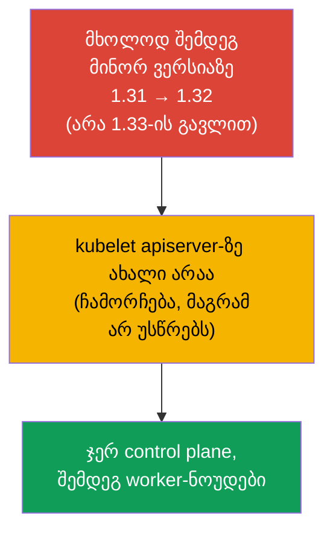
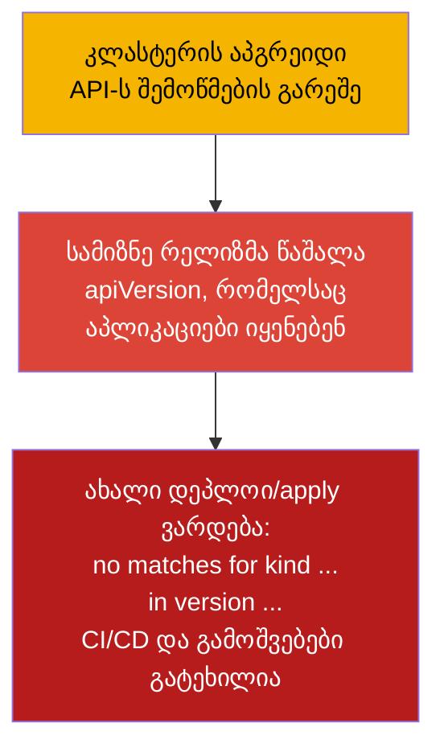
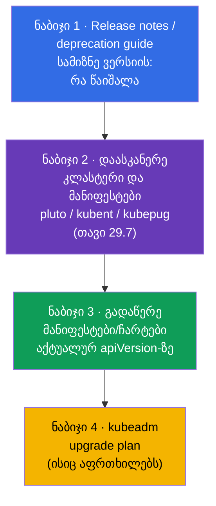
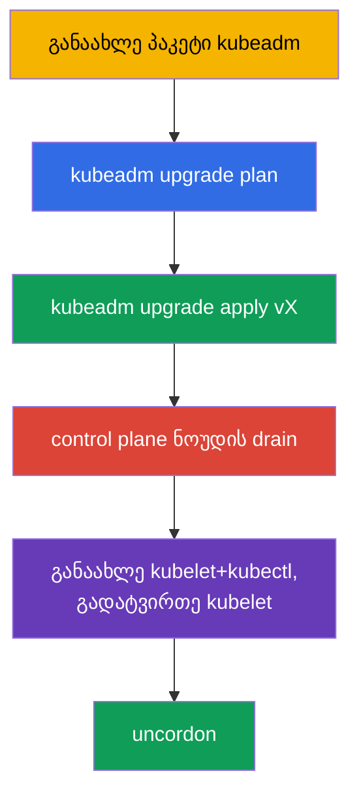
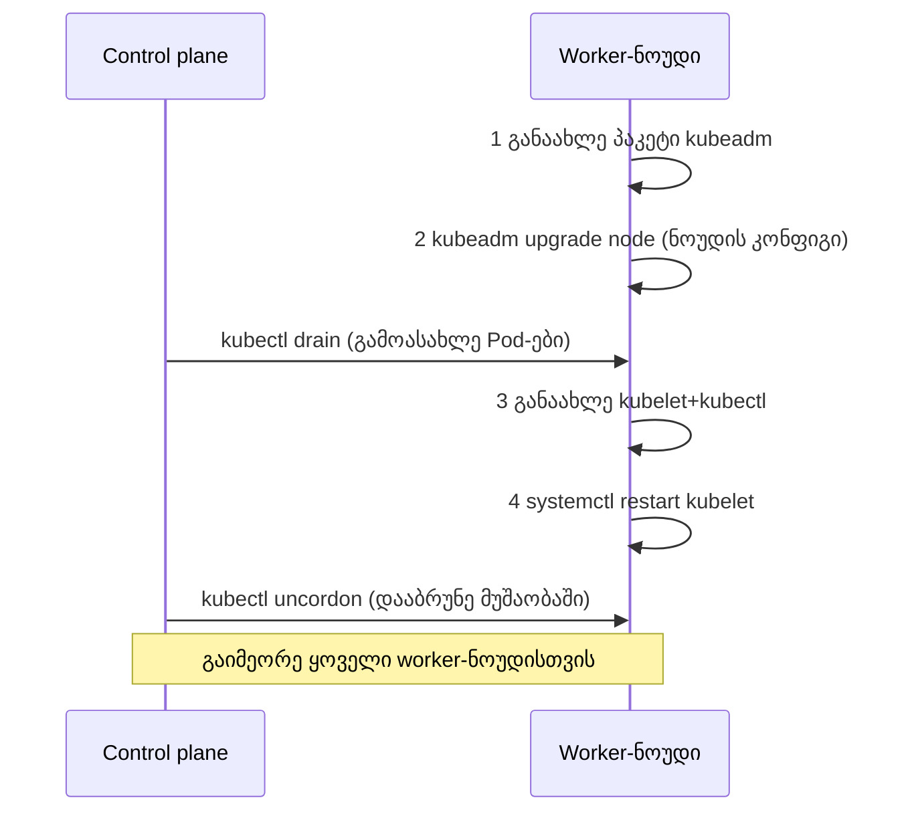
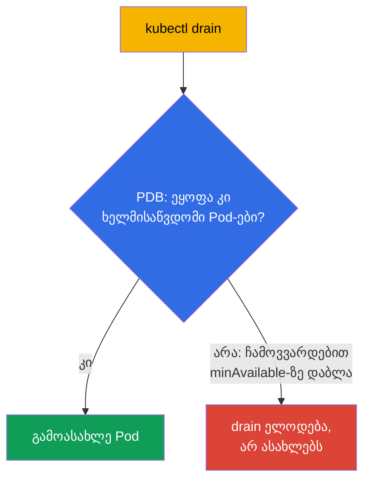

[Русская версия](ru.md) · [Eng version](README.md) · [Versión en español](es.md) · [Version française](fr.md) · [Deutsche Version](de.md) · [繁體中文版](tw.md) · [日本語版](jp.md)

# თავი 36. კლასტერის განახლება (lifecycle)

> 🟦 **თავი CKA-სთვის** (დომენი Cluster Architecture, Installation & Configuration).
>
> **რა იქნება შემდეგ.** კლასტერი აწყობილია (თავი 35), მაგრამ Kubernetes ახალი ვერსიებით გამოდის, და
> კლასტერი უნდა განვაახლოთ. განახლება - დელიკატური ოპერაციაა: არასწორად გააკეთებ და შეიძლება
> პროდი წამოაქციო. გავარჩევთ control plane-ისა და worker-ნოუდების განახლების სწორ თანმიმდევრობას
> kubeadm-ის საშუალებით, `cordon`/`drain`-ის როლს (კავშირი taints-თან, თავი 13) და ვერსიების წესებს. ეს არის
> CKA-ს პირდაპირი დავალება („განაახლე კლასტერი ვერსია X-მდე“) და ექსპლუატაციის უმნიშვნელოვანესი უნარი.

## 36.1. ვერსიები და skew-ის წესი

Kubernetes-ს აქვს კომპონენტების ვერსიების თავსებადობის მკაცრი წესები - ისინი უნდა ვიცოდეთ, რომ
კლასტერი არ გავტეხოთ.



- **მხოლოდ შემდეგ მინორ ვერსიაზე.** არ შეიძლება 1.31 → 1.33 გადახტომა; საჭიროა 1.31 →
  1.32 → 1.33. პატჩ-ვერსიები მინორის შიგნით - თავისუფლად.
- **Version skew.** kubelet შეიძლება ჩამორჩებოდეს apiserver-ს (რამდენიმე მინორის ფარგლებში),
  მაგრამ **არ შეიძლება იყოს უფრო ახალი**. ამიტომ control plane-ს პირველად ანახლებენ.
- **თანმიმდევრობა.** ჯერ control plane (apiserver და დანარჩენები), შემდეგ worker-ნოუდები.

## 36.2. პრე-ფლაიტი: API-ს შემოწმება განახლებამდე (თორემ აპლიკაციები ვეღარ დაიდეპლოება)

სანამ ნოუდებს შეეხებით, უნდა შეამოწმოთ **API-ს თავსებადობა**. Kubernetes ახალ მინორ
ვერსიებთან ერთად **შლის მოძველებულ API-ვერსიებს** (თავი 29). თუ აპლიკაცია,
Helm-ჩარტი, ოპერატორი ან CRD იყენებს API-ვერსიას, რომელიც სამიზნე რელიზმა **წაშალა**,
მაშინ აპგრეიდის შემდეგ:

- უკვე შექმნილ ობიექტებს apiserver ახალი ვერსიით გასცემს (ჩვეულებრივ ოკეია),
- მაგრამ **ახალი `kubectl apply`/მანიფესტების დეპლოი ძველი `apiVersion`-ით ვარდება** შეცდომით
  `no matches for kind ... in version ...` - ანუ გამოშვებები და CI/CD ტყდება.



წაშლილი API-ების კლასიკური მაგალითები (ხშირი ტკივილი): `extensions/v1beta1` Ingress →
`networking.k8s.io/v1` (წაშლილია 1.22-ში), `policy/v1beta1` PodDisruptionBudget →
`policy/v1` (წაშლილია 1.25-ში), ძველი `apps/v1beta*` Deployment (წაშლილია 1.16-ში),
`batch/v1beta1` CronJob → `batch/v1` (წაშლილია 1.25-ში).

**ჩეკ-ლისტი აპგრეიდამდე:**



> **ინსტრუმენტები ნაბიჯ 2-ისთვის** (კლასტერისა და კოდის სკანირება მოძველებულ/წასაშლელ API-ებზე) -
> დეტალურად [თავ 29-ში](../29/ge.md), განყოფილება **29.7 «მოძველებული API-ების ანალიზის
> ღია ინსტრუმენტები»**: kubent, pluto, kubepug (`kubectl deprecations`), kubeconform, Popeye -
> ბრძანებებით კლასტერისთვის და CI-სთვის.

```bash
# რომელ API-ვერსიებს ემსახურება კლასტერი რეალურად ახლა
kubectl api-versions
kubectl api-resources

# მოძველებული/წასაშლელი API-ების მოძებნა ცოცხალ კლასტერსა და მანიფესტებში (თავი 29)
pluto detect-all-in-cluster
kubent                                  # kube-no-trouble
pluto detect-files -d ./manifests/

# მანიფესტის კონვერტაცია API-ს აქტუალურ ვერსიაზე
kubectl convert -f old-ingress.yaml --output-version networking.k8s.io/v1
```

ცალკე ამოწმებენ, რომ **ადონები თავსებადია** Kubernetes-ის სამიზნე ვერსიასთან: CNI
(Calico/Cilium), CSI-დრაივერები, ingress-კონტროლერი, metrics-server, ასევე
admission-webhook-ები და ოპერატორების CRD-ები - მათ თავიანთი თავსებადობის მატრიცები აქვთ. არათავსებადმა
ადონმა აპგრეიდის შემდეგ შეიძლება გატეხოს ქსელი, საცავი ან ტრაფიკის მიღება.

დასკვნა: **ჯერ აპლიკაციები/ჩარტები/ადონები მიიყვანეთ სამიზნე რელიზის მიერ მხარდაჭერილ
ვერსიებამდე და მხოლოდ შემდეგ განაახლეთ კლასტერი.** თორემ კლასტერი განახლდება, ხოლო აპლიკაციები
ვეღარ გამოვა.

## 36.3. განახლების ზოგადი თანმიმდევრობა


ნოუდებს ანახლებენ **სათითაოდ**, რომ კლასტერი მთელი დროის განმავლობაში დარჩეს მუშა მდგომარეობაში: სანამ ერთ
ნოუდს ემსახურებიან, დანარჩენები დატვირთვას ატარებენ. სწორედ ეს არის უსაფრთხო განახლება შეფერხების გარეშე.

## 36.4. control plane-ის განახლება

პირველ control plane ნოუდზე თანმიმდევრობა ასეთია:

```bash
# 1. განაახლე თავად kubeadm სამიზნე ვერსიამდე
sudo apt-mark unhold kubeadm
sudo apt-get install -y kubeadm=1.32.x-*
sudo apt-mark hold kubeadm

# 2. ნახე განახლების გეგმა
sudo kubeadm upgrade plan

# 3. გამოიყენე control plane-ის განახლება
sudo kubeadm upgrade apply v1.32.x

# 4. გაათავისუფლე control plane ნოუდი (drain), როგორც ნებისმიერი სხვა kubelet-ის განახლებამდე
kubectl drain <control-plane> --ignore-daemonsets

# 5. განაახლე kubelet და kubectl ამ ნოუდზე
sudo apt-mark unhold kubelet kubectl
sudo apt-get install -y kubelet=1.32.x-* kubectl=1.32.x-*
sudo apt-mark hold kubelet kubectl
sudo systemctl daemon-reload
sudo systemctl restart kubelet

# 6. დააბრუნე control plane ნოუდი მუშაობაში
kubectl uncordon <control-plane>
```



> **შენიშვნა.** `kubeadm upgrade apply` კეთდება მხოლოდ **პირველ** control plane ნოუდზე.
> დანარჩენ control plane ნოუდებზე (HA-ში, თავი 35A) `apply`-ის ნაცვლად ასრულებენ
> `kubeadm upgrade node`-ს - როგორც worker-ნოუდებზე (განყოფილება 36.6), მაგრამ control plane ნოუდის drain
> ასევე საჭიროა.

## 36.5. cordon და drain: ნოუდის მომზადება განახლებისთვის

kubelet-ის განახლებამდე **ნებისმიერ** ნოუდზე ის უნდა გაათავისუფლოთ Pod-ებისგან, რომ არ შეეხოთ
დატვირთვას. ეს ორი ნაბიჯია:


```bash
kubectl cordon <node>                              # აქ მეტს არ დაგეგმო
kubectl drain <node> --ignore-daemonsets --delete-emptydir-data   # გამოასახლე Pod-ები
# ... განაახლე kubelet ნოუდზე ...
kubectl uncordon <node>                            # დააბრუნე დაგეგმვის პულში
```

- **cordon** ნოუდზე დებს taint-ს `unschedulable` (თავი 13) - ახალი Pod-ები აქ არ
  ინიშნება, მაგრამ უკვე გაშვებულები მუშაობს.
- **drain** დამატებით გამოასახლებს Pod-ებს (რბილად, graceful shutdown-ის დაცვით), გადაიტანს მათ
  სხვა ნოუდებზე. `--ignore-daemonsets` საჭიროა, რადგან DaemonSet-ის Pod-ები მიბმულია ნოუდზე
  და არ გადაინაცვლებს; `--delete-emptydir-data` უფლებას იძლევა წაშალოთ Pod-ები emptyDir-ით.

## 36.6. worker-ნოუდების განახლება

ყოველი worker-ნოუდისთვის (სათითაოდ). თანმიმდევრობა - როგორც kubeadm-ის ოფიციალურ დოკუმენტაციაშია:
ჯერ **kubeadm-ის ორი ნაბიჯი** (განაახლე თავად პაკეტი და `kubeadm upgrade node`), და მხოლოდ
შემდეგ drain და kubelet-ის განახლება.

```bash
# --- თავად worker-ნოუდზე ---
# 1. განაახლე პაკეტი kubeadm სამიზნე ვერსიამდე
sudo apt-mark unhold kubeadm && sudo apt-get update && sudo apt-get install -y kubeadm=1.32.x-* && sudo apt-mark hold kubeadm

# 2. kubeadm upgrade node — ანახლებს ნოუდის ლოკალურ კონფიგურაციას (kubelet-config)
sudo kubeadm upgrade node

# --- control plane-იდან: გაათავისუფლე ნოუდი ---
kubectl drain <worker> --ignore-daemonsets --delete-emptydir-data

# --- ისევ worker-ნოუდზე ---
# 3. განაახლე kubelet და kubectl
sudo apt-mark unhold kubelet kubectl && sudo apt-get install -y kubelet=1.32.x-* kubectl=1.32.x-* && sudo apt-mark hold kubelet kubectl
# 4. გადატვირთე kubelet
sudo systemctl daemon-reload && sudo systemctl restart kubelet

# --- control plane-იდან: დააბრუნე ნოუდი მუშაობაში ---
kubectl uncordon <worker>
```



kubeadm-ის ორი საკვანძო ნაბიჯი: **განაახლე პაკეტი `kubeadm`** და **`kubeadm upgrade node`** (არა
`apply`!) - ბოლო ნოუდის ლოკალური კონფიგურაციის განახლებას იყენებს. ისინი მიდის `drain`-**მდე** -
`kubeadm upgrade node` მომუშავე Pod-ებს არ უშლის ხელს.

worker-ნოუდებზე გამოიყენება `kubeadm upgrade node` (არა `apply`) - ის ანახლებს ნოუდის ლოკალურ
კონფიგურაციას.

## 36.7. PodDisruptionBudget: დაცვა drain-ის დროს

`drain` გამოასახლებს Pod-ებს, მაგრამ რა მოხდება, თუ ეს აპლიკაციის ხელმისაწვდომობას წამოაქცევს (ყველა რეპლიკა აღმოჩნდება
გამოსახლებად ნოუდზე)? **PodDisruptionBudget (PDB)** განსაზღვრავს ხელმისაწვდომი Pod-ების მინიმუმს, რომელზე
დაბლა ნებაყოფლობითი გამოსახლება (drain) არ ჩამოვა.

```yaml
apiVersion: policy/v1
kind: PodDisruptionBudget
metadata:
  name: web-pdb
spec:
  minAvailable: 2            # ყოველთვის შეინახე მინიმუმ 2 Pod ხელმისაწვდომი
  selector:
    matchLabels:
      app: web
```



PDB იცავს იმისგან, რომ ნოუდების მომსახურებამ (ან ავტოსკეილინგმა ქვევით) აპლიკაცია არ წამოაქციოს.
კლასტერის განახლების დროს PDB აიძულებს `drain`-ს დაელოდოს, სანამ Pod-ის უსაფრთხოდ გამოსახლება შეუძლებელია.

## 36.8. ნოუდის OS-ის განახლება

Kubernetes-ის ვერსიისგან დამოუკიდებლად ხდება საჭირო თავად ნოუდის OS-ის განახლება (პატჩები, ბირთვი). თანმიმდევრობა
იგივეა: `cordon` → `drain` → ნოუდის მომსახურება/გადატვირთვა → `uncordon`. თუ ნოუდი
დიდი ხნით გამოდის ან იცვლება, მას კლასტერიდან შლიან:

```bash
kubectl drain <node> --ignore-daemonsets
kubectl delete node <node>              # კლასტერიდან მოშორება
# (ნოუდზე) kubeadm reset                # მდგომარეობის გასუფთავება
```

## 36.9. როგორ იყენებენ ამას პროდაქშენში

- **ნოუდების სათითაო განახლება - რკინის წესია.** პროდში ნოუდებს ანახლებენ მკაცრად
  რიგრიგობით cordon/drain-ით, რომ აპლიკაცია მთელი დროის განმავლობაში დარჩეს ხელმისაწვდომი. მასობრივი
  განახლება ყველას ერთდროულად = გარანტირებული შეფერხება.
- **PDB სავალდებულოა კრიტიკული სერვისებისთვის.** PDB-ს გარეშე `drain`-ს შეუძლია ერთდროულად გამოასახლოს ყველა
  რეპლიკა. პროდში ყოველ მნიშვნელოვან Deployment-ს უსახავენ PDB-ს (`minAvailable`/`maxUnavailable`),
  რომ ნოუდების მომსახურებამ სერვისი არ წამოაქციოს.
- **მართული კლასტერები ამარტივებს, მაგრამ არ აუქმებს.** EKS/GKE/AKS-ში control plane-ს ანახლებს
  პროვაიდერი, მაგრამ worker-ნოუდებს (node pools) ანახლებს გუნდი - იმავე cordon/drain-ითა და PDB-ით.
  ხშირად ამას ნოუდების ხელახალი შექმნით აკეთებენ (rolling replacement).
- **etcd-ს ბექაპი control plane-ის განახლებამდე.** გამოცდილი გუნდები `kubeadm upgrade
  apply`-მდე აკეთებენ etcd-ს სნეპშოტს (თავი 37) - დაზღვევა წარუმატებელი განახლების შემთხვევისთვის.
- **version skew-ის დაცვა და სატესტო გარემო.** ანახლებენ მკაცრად სათითაოდ ერთი მინორი ვერსიით
  და ჯერ dev/stage-ზე, კითხულობენ release notes-ს წაშლილი API-ებისა და გამტეხი
  ცვლილებების შესახებ, ხოლო მანიფესტებს/ჩარტებს ატარებენ [თავ 29-ის (განყოფილება 29.7)](../29/ge.md) ინსტრუმენტებით:
  kubent/pluto კლასტერზე და pluto/kubepug/kubeconform CI-ში.

## 36.10. მინი-ლექსიკონი

- **Version skew** - კომპონენტების ვერსიების დასაშვები სხვაობა; kubelet apiserver-ზე ახალი არაა.
- **kubeadm upgrade plan / apply / node** - გეგმა / გამოყენება (პირველი CP) / ნოუდის
  განახლება.
- **cordon** - ნოუდის მონიშვნა unschedulable-ად (ახალი Pod-ები აქ არ მიდის).
- **drain** - Pod-ების გამოსახლება ნოუდიდან (gracefully), სხვებზე გადატანა.
- **uncordon** - ნოუდის დაბრუნება დაგეგმვის პულში.
- **--ignore-daemonsets** - drain-ის დროს არ შეეხო DaemonSet-ის Pod-ებს (ისინი ნოუდზე მიბმულია).
- **PodDisruptionBudget (PDB)** - ხელმისაწვდომი Pod-ების მინიმუმი ნებაყოფლობითი გამოსახლების დროს.
- **kubeadm reset** - kubeadm-ის მდგომარეობის გასუფთავება ნოუდზე.
- **pluto / kubent** - მოძველებული/წასაშლელი API-ების ძებნა კლასტერსა და მანიფესტებში (თავი 29).
- **kubectl convert** - მანიფესტის კონვერტაცია API-ს აქტუალურ ვერსიაზე.
- **API-ს წაშლა** - სამიზნე რელიზს შეუძლია მოაშოროს apiVersion → ძველი მანიფესტები ვეღარ დაიდეპლოება.

## 36.11. თავის შეჯამება

- **აპგრეიდამდე ამოწმებენ API-ს თავსებადობას:** სამიზნე რელიზმა შეიძლება წაშალოს API-ვერსიები,
  რომლებსაც აპლიკაციები/ჩარტები/ადონები იყენებენ - მაშინ განახლების შემდეგ ახალი დეპლოი ვარდება
  (`no matches for kind ... in version ...`). სკანერებენ pluto/kubent-ით, ასწორებენ მანიფესტებს
  (`kubectl convert`) და ამოწმებენ ადონებს განახლებამდე.
- განახლება შეიძლება მხოლოდ შემდეგ მინორ ვერსიაზე; kubelet არ უნდა იყოს apiserver-ზე უფრო ახალი
  (version skew) - ამიტომ control plane პირველია.
- თანმიმდევრობა: control plane → worker-ნოუდები, სათითაოდ, რომ ხელმისაწვდომობა არ დავკარგოთ.
- Control plane: განაახლე kubeadm → `upgrade plan` → `upgrade apply vX` → განაახლე
  kubelet/kubectl და გადატვირთე kubelet.
- kubelet-ის განახლებამდე ნოუდს ათავისუფლებენ: `cordon` (unschedulable) + `drain`
  (Pod-ების გამოსახლება), შემდეგ - `uncordon`.
- worker-ნოუდები იყენებს `kubeadm upgrade node`-ს (არა apply).
- PodDisruptionBudget არ აძლევს `drain`-ს საშუალებას აპლიკაციის ხელმისაწვდომობა მინიმუმზე დაბლა ჩამოაგდოს.
- OS-ის განახლება/ნოუდის შეცვლა - იგივე cordon/drain, გამოყვანის დროს - `delete node` + `kubeadm
  reset`.

## 36.12. როგორ გამოგადგებათ: გამოცდაზე და რეალურ სამუშაოში

**გამოცდაზე (CKA).** „განაახლე კლასტერი ვერსია X-მდე“ - კლასიკური დავალებაა: საჭიროა ვიცოდეთ
თანმიმდევრობა (control plane → worker, სათითაოდ), ბრძანებები kubeadm upgrade და სავალდებულო
cordon/drain/uncordon. შეცდომა თანმიმდევრობაში ან drain-ის გამოტოვება - ქულების დაკარგვაა.

**რეალურ სამუშაოში.** კლასტერის განახლება - რეგულარული ექსპლუატაციური პროცედურაა.
სწორი თანმიმდევრობა, cordon/drain და PDB უზრუნველყოფს აპგრეიდს შეფერხების გარეშე; etcd-ს ბექაპი
control plane-ის განახლებამდე - დაზღვევაა. იგივე ხერხები (cordon/drain) გამოიყენება ნებისმიერი
მომსახურებისა და ნოუდების შეცვლის დროს.

## 36.13. თვითშემოწმების კითხვები

1. რატომ უნდა შევამოწმოთ კლასტერის განახლებამდე გამოყენებული API-ვერსიები და რას გვიქადის
   ამ ნაბიჯის გამოტოვება? რომელი ინსტრუმენტებით ამოწმებენ?
2. რატომ არ შეიძლება მინორ ვერსიის გადახტომა და რატომ ანახლებენ control plane-ს პირველად?
3. რა არის version skew და როგორ არის ის დაკავშირებული განახლების თანმიმდევრობასთან?
4. რით განსხვავდება `cordon` და `drain`? რისთვის არის საჭირო `--ignore-daemonsets`?
5. რა თანმიმდევრობით ანახლებენ control plane-სა და worker-ნოუდებს და რატომ სათითაოდ?
6. რით განსხვავდება `kubeadm upgrade apply` `kubeadm upgrade node`-ისგან?
7. რას აკეთებს PodDisruptionBudget drain-ის დროს და რისთვის არის ის საჭირო?
8. რა თანმიმდევრობით მოქმედებენ ნოუდის OS-ის განახლების ან მისი შეცვლის დროს?

## პრაქტიკა

ჩვენ ვისწავლეთ კლასტერის უსაფრთხოდ განახლება. თავ 37-ში - ყველაზე ღირებული ექსპლუატაციაში: etcd-ს ბექაპი
და აღდგენა, რომლის გარეშე control plane-ის დაკარგვა კლასტერის დაკარგვას ნიშნავს.
კლასტერის განახლება მუშავდება ადმინისტრირების ლაბორატორიულ სამუშაოებში.

🧪 ლაბი 111 (kubeadm upgrade): [tasks/cka/labs/111](../../labs/111/README_GE.MD)

---
[სარჩევი](../README_GE.md) · [თავი 35](../35/ge.md) · [თავი 37](../37/ge.md)
