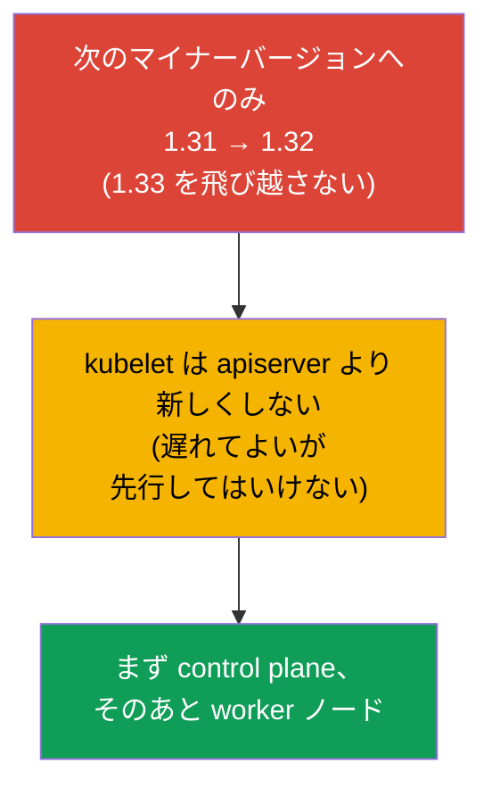
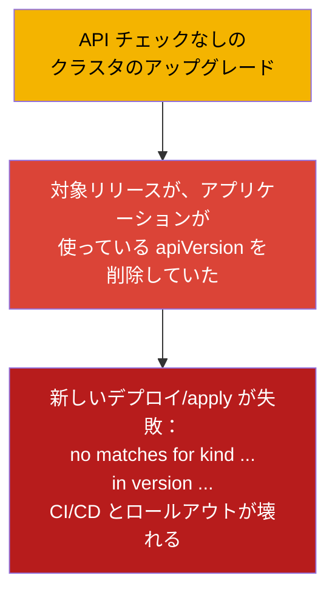
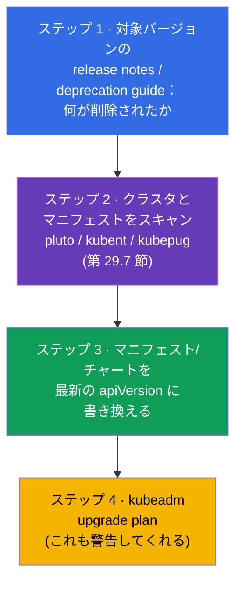
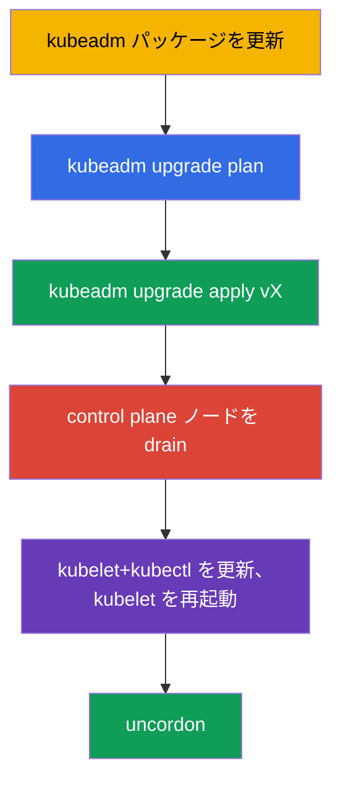
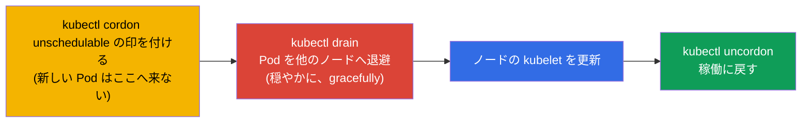
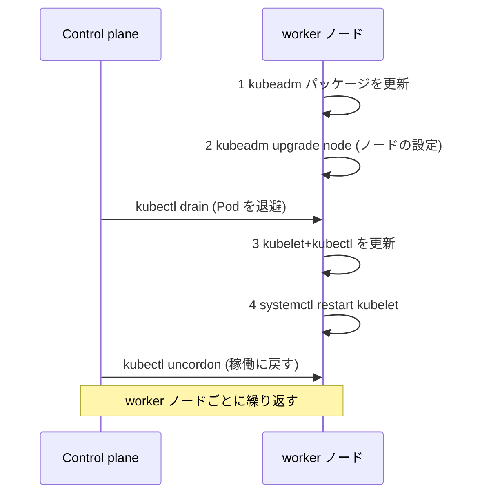
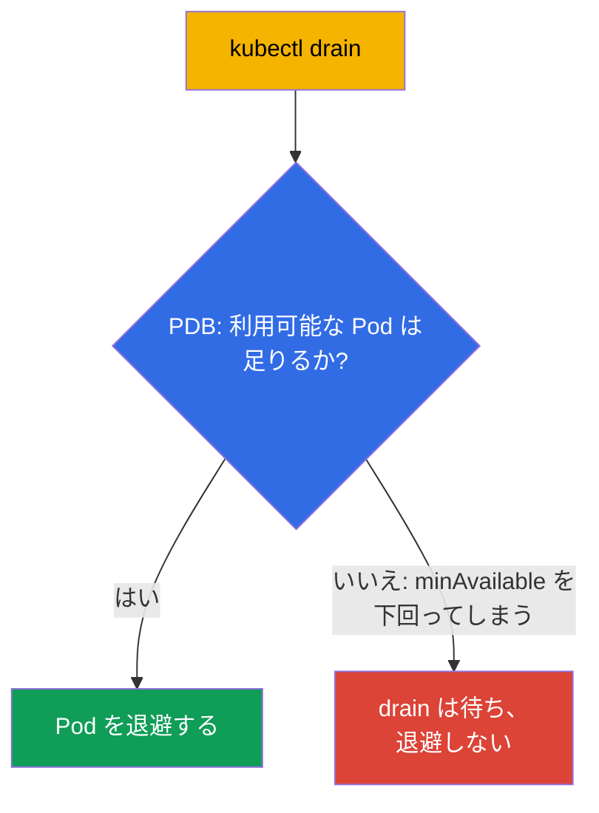

[Русская версия](ru.md) · [Eng version](README.md) · [Versión en español](es.md) · [Version française](fr.md) · [Deutsche Version](de.md) · [ქართული ვერსია](ge.md) · [繁體中文版](tw.md)

# 第 36 章。クラスタの更新 (lifecycle)

> 🟦 **CKA 向けの章**（領域 Cluster Architecture, Installation & Configuration）。
>
> **次は何か。** クラスタは組み上がりました（第 35 章）が、Kubernetes は新しい
> バージョンを出し続け、クラスタは更新しなければなりません。更新は繊細な作業です：
> やり方を間違えれば本番を落としかねません。kubeadm による control plane と worker
> ノードの正しい更新順序、`cordon`/`drain` の役割（taints とのつながり、第 13 章）、
> バージョンのルールを見ていきます。これは CKA の直接の課題（「クラスタをバージョン X
> に更新せよ」）であり、もっとも重要な運用スキルです。

## 36.1. バージョンと skew のルール

Kubernetes にはコンポーネントのバージョン互換性について厳しいルールがあります - クラスタを
壊さないために知っておく必要があります。



- **次のマイナーバージョンへのみ。** 1.31 → 1.33 と飛び越すことはできません。1.31 →
  1.32 → 1.33 と進みます。マイナー内のパッチバージョンは自由です。
- **Version skew。** kubelet は apiserver より遅れることはできます（数マイナーの範囲で）が、
  **より新しくすることはできません**。だから control plane を最初に更新します。
- **順序。** まず control plane (apiserver とその他)、そのあと worker ノード。

## 36.2. プリフライト：更新前の API チェック（さもないとアプリケーションがデプロイできなくなる）

ノードに触る前に **API の互換性** を確認する必要があります。Kubernetes は新しいマイナー
バージョンで **古い API バージョンを削除します**（第 29 章）。アプリケーション、Helm
チャート、オペレーター、CRD が、対象リリースで **削除された** API バージョンを使っていると、
アップグレード後にこうなります：

- すでに作られたオブジェクトは apiserver が新しいバージョンで返します（通常は問題なし）が、
- **古い `apiVersion` のマニフェストの新しい `kubectl apply`/デプロイは失敗します** -
  エラー `no matches for kind ... in version ...` が出て、つまりロールアウトと CI/CD が壊れます。



削除された API の古典的な例（よくある痛み）：`extensions/v1beta1` Ingress →
`networking.k8s.io/v1`（1.22 で削除）、`policy/v1beta1` PodDisruptionBudget →
`policy/v1`（1.25 で削除）、古い `apps/v1beta*` Deployment（1.16 で削除）、
`batch/v1beta1` CronJob → `batch/v1`（1.25 で削除）。

**アップグレード前のチェックリスト：**



> **ステップ 2 のためのツール**（クラスタとコードから古い/削除される API を探す）は
> [第 29 章](../29/jp.md) の **29.7「古い API を分析するオープンソースツール」** で
> 詳しく扱っています：kubent、pluto、kubepug (`kubectl deprecations`)、kubeconform、Popeye -
> クラスタ用と CI 用のコマンド付きです。

```bash
# クラスタが今実際に提供している API バージョン
kubectl api-versions
kubectl api-resources

# 稼働中のクラスタとマニフェストから古い/削除される API を探す（第 29 章）
pluto detect-all-in-cluster
kubent                                  # kube-no-trouble
pluto detect-files -d ./manifests/

# マニフェストを最新の API バージョンに変換する
kubectl convert -f old-ingress.yaml --output-version networking.k8s.io/v1
```

これとは別に、**アドオンが対象の Kubernetes バージョンと互換であること** も確認します：CNI
(Calico/Cilium)、CSI ドライバー、ingress コントローラー、metrics-server、さらに
admission webhook やオペレーターの CRD - それぞれ独自の互換性マトリクスを持っています。
互換でないアドオンは、アップグレード後にネットワーク、ストレージ、トラフィックの受け入れを
壊すことがあります。

結論：**まずアプリケーション/チャート/アドオンを対象リリースがサポートするバージョンに
そろえ、そのあとでクラスタを更新します。** さもないとクラスタは更新されても、
アプリケーションがロールアウトできなくなります。

## 36.3. 更新の全体的な順序


ノードは **1 台ずつ** 更新します。クラスタが常に動き続けるためです：1 台を作業している間、
残りが負荷を担います。これが停止のない安全な更新です。

## 36.4. control plane の更新

最初の control plane ノードでの順序はこうです：

```bash
# 1. kubeadm 自体を対象バージョンに更新する
sudo apt-mark unhold kubeadm
sudo apt-get install -y kubeadm=1.32.x-*
sudo apt-mark hold kubeadm

# 2. 更新プランを見る
sudo kubeadm upgrade plan

# 3. control plane の更新を適用する
sudo kubeadm upgrade apply v1.32.x

# 4. kubelet の更新前に、他のノードと同様に control plane ノードを空ける (drain)
kubectl drain <control-plane> --ignore-daemonsets

# 5. このノードの kubelet と kubectl を更新する
sudo apt-mark unhold kubelet kubectl
sudo apt-get install -y kubelet=1.32.x-* kubectl=1.32.x-*
sudo apt-mark hold kubelet kubectl
sudo systemctl daemon-reload
sudo systemctl restart kubelet

# 6. control plane ノードを稼働に戻す
kubectl uncordon <control-plane>
```



> **注意。** `kubeadm upgrade apply` は **最初の** control plane ノードでのみ実行します。
> 残りの control plane ノード（HA、第 35A 章）では `apply` の代わりに
> `kubeadm upgrade node` を実行します - worker ノードと同じです（36.6 節）が、
> control plane ノードの drain も必要です。

## 36.5. cordon と drain：ノードを更新に備えさせる

**どの** ノードでも kubelet を更新する前に、負荷に影響を与えないよう Pod からノードを
空ける必要があります。これは 2 つのステップです：



```bash
kubectl cordon <node>                              # もうここにはスケジュールしない
kubectl drain <node> --ignore-daemonsets --delete-emptydir-data   # Pod を退避する
# ... ノードの kubelet を更新する ...
kubectl uncordon <node>                            # スケジューリングのプールに戻す
```

- **cordon** はノードに taint `unschedulable` を付けます（第 13 章）- 新しい Pod はここに
  割り当てられませんが、すでに起動している Pod は動き続けます。
- **drain** はさらに Pod を退避し（穏やかに、graceful shutdown を守って）、他のノードへ
  移します。`--ignore-daemonsets` が必要なのは、DaemonSet の Pod はノードに紐づいていて
  移動しないためです。`--delete-emptydir-data` は emptyDir を持つ Pod の削除を許可します。

## 36.6. worker ノードの更新

各 worker ノードに対して（1 台ずつ）。順序は kubeadm の公式ドキュメントと同じです：
まず **kubeadm の 2 ステップ**（パッケージ自体の更新と `kubeadm upgrade node`）、そして
そのあとで drain と kubelet の更新です。

```bash
# --- worker ノード上で ---
# 1. kubeadm パッケージを対象バージョンに更新する
sudo apt-mark unhold kubeadm && sudo apt-get update && sudo apt-get install -y kubeadm=1.32.x-* && sudo apt-mark hold kubeadm

# 2. kubeadm upgrade node — ノードのローカル設定 (kubelet-config) を更新する
sudo kubeadm upgrade node

# --- control plane から：ノードを空ける ---
kubectl drain <worker> --ignore-daemonsets --delete-emptydir-data

# --- ふたたび worker ノード上で ---
# 3. kubelet と kubectl を更新する
sudo apt-mark unhold kubelet kubectl && sudo apt-get install -y kubelet=1.32.x-* kubectl=1.32.x-* && sudo apt-mark hold kubelet kubectl
# 4. kubelet を再起動する
sudo systemctl daemon-reload && sudo systemctl restart kubelet

# --- control plane から：ノードを稼働に戻す ---
kubectl uncordon <worker>
```



kubeadm の重要な 2 ステップ：**`kubeadm` パッケージの更新** と **`kubeadm upgrade node`**
(`apply` ではありません!) - 後者はノードのローカル設定の更新を適用します。これらは `drain`
**より前** に来ます - `kubeadm upgrade node` は動作中の Pod の邪魔をしません。

worker ノードでは `kubeadm upgrade node` を使います（`apply` ではありません）- これは
ノードのローカル設定を更新します。

## 36.7. PodDisruptionBudget：drain のときの保護

`drain` は Pod を退避しますが、それでアプリケーションの可用性が落ちてしまったら（すべての
レプリカが退避対象のノードに乗っていたら）どうでしょうか。**PodDisruptionBudget (PDB)** は
利用可能な Pod の最小数を定め、自発的な退避 (drain) はそれを下回りません。

```yaml
apiVersion: policy/v1
kind: PodDisruptionBudget
metadata:
  name: web-pdb
spec:
  minAvailable: 2            # 常に最低 2 つの Pod を利用可能に保つ
  selector:
    matchLabels:
      app: web
```



PDB は、ノードの保守（やスケールダウン）がアプリケーションを落とさないように守ります。
クラスタの更新では、PDB は安全に Pod を退避できない間、`drain` を待たせます。

## 36.8. ノードの OS の更新

Kubernetes のバージョンとは別に、ノードの OS 自体を更新する必要が出ることもあります
（パッチ、カーネル）。順序は同じです：`cordon` → `drain` → ノードの保守/再起動 →
`uncordon`。ノードを長期に外す場合や置き換える場合は、クラスタから削除します：

```bash
kubectl drain <node> --ignore-daemonsets
kubectl delete node <node>              # クラスタから外す
# (ノード上で) kubeadm reset             # 状態をクリーンにする
```

## 36.9. 本番環境でこれをどう使うか

- **1 台ずつ更新するのは鉄則。** 本番ではノードを厳密に順番に cordon/drain しながら
  更新し、アプリケーションが常に利用可能なままであるようにします。全部を一斉に更新するのは
  = 確実な停止です。
- **重要なサービスには PDB が必須。** PDB がなければ `drain` はすべてのレプリカを一度に
  退避しかねません。本番では重要な Deployment ごとに PDB (`minAvailable`/`maxUnavailable`)
  を設定し、ノードの保守がサービスを落とさないようにします。
- **マネージドクラスタは楽にしてくれますが、免除はしません。** EKS/GKE/AKS では control
  plane はプロバイダーが更新しますが、worker ノード (node pools) はチームが更新します -
  同じ cordon/drain と PDB を使って。多くの場合ノードの再作成 (rolling replacement) で行います。
- **control plane の更新前に etcd のバックアップ。** 経験のあるチームは `kubeadm upgrade
  apply` の前に etcd のスナップショットを取ります（第 37 章）- 更新が失敗したときの保険です。
- **version skew の遵守とテスト環境。** マイナーバージョンは厳密に 1 つずつ更新し、まず
  dev/stage で行い、削除された API や破壊的変更について release notes を読み、
  マニフェスト/チャートは [第 29 章 (29.7 節)](../29/jp.md) のツールにかけます：
  クラスタには kubent/pluto、CI には pluto/kubepug/kubeconform。

## 36.10. ミニ用語集

- **Version skew** - 許されるコンポーネントのバージョン差。kubelet は apiserver より新しくない。
- **kubeadm upgrade plan / apply / node** - プラン / 適用（最初の CP）/ ノードの
  更新。
- **cordon** - ノードに unschedulable の印を付ける（新しい Pod はここに来ない）。
- **drain** - ノードから Pod を退避する (gracefully)、他へ移す。
- **uncordon** - ノードをスケジューリングのプールに戻す。
- **--ignore-daemonsets** - drain のとき DaemonSet の Pod に触らない（ノードに紐づいている）。
- **PodDisruptionBudget (PDB)** - 自発的な退避のときに利用可能な Pod の最小数。
- **kubeadm reset** - ノード上の kubeadm の状態をクリーンにする。
- **pluto / kubent** - クラスタとマニフェストから古い/削除される API を探す（第 29 章）。
- **kubectl convert** - マニフェストを最新の API バージョンに変換する。
- **API の削除** - 対象リリースが apiVersion を取り除くことがある → 古いマニフェストがデプロイできなくなる。

## 36.11. 本章のまとめ

- **アップグレード前に API の互換性を確認します：** 対象リリースは、アプリケーション/
  チャート/アドオンが使っている API バージョンを削除している可能性があります - そうなると
  更新後に新しいデプロイが失敗します (`no matches for kind ... in version ...`)。pluto/kubent で
  スキャンし、マニフェストを直し (`kubectl convert`)、アドオンを更新の前に確認します。
- 更新できるのは次のマイナーバージョンだけです。kubelet は apiserver より新しくては
  いけません (version skew) - だから control plane が最初です。
- 順序：control plane → worker ノード、1 台ずつ、可用性を失わないために。
- control plane：kubeadm を更新 → `upgrade plan` → `upgrade apply vX` → kubelet/kubectl を
  更新し kubelet を再起動。
- kubelet の更新前にノードを空けます：`cordon` (unschedulable) + `drain`
  (Pod を退避)、そのあとで `uncordon`。
- worker ノードは `kubeadm upgrade node` を使います (apply ではありません)。
- PodDisruptionBudget は、`drain` がアプリケーションの可用性を最小数より下に落とすことを防ぎます。
- OS の更新/ノードの置き換え - 同じ cordon/drain、外すときは `delete node` + `kubeadm
  reset`。

## 36.12. これがどう役に立つか：試験と実際の仕事で

**試験では (CKA)。** 「クラスタをバージョン X に更新せよ」は古典的な課題です：順序
(control plane → worker、1 台ずつ)、kubeadm upgrade のコマンド、必須の
cordon/drain/uncordon を知っている必要があります。順序の間違いや drain の抜けは失点です。

**実際の仕事では。** クラスタの更新は定期的な運用手順です。正しい順序、cordon/drain、PDB が
停止のないアップグレードを実現します。control plane の更新前の etcd バックアップは保険です。
同じ手法 (cordon/drain) は、あらゆる保守やノードの置き換えでも使います。

## 36.13. 自己チェックの質問

1. なぜクラスタの更新前に使っている API バージョンを確認する必要があり、このステップを
   飛ばすと何が起こりますか？どんなツールで確認しますか？
2. なぜマイナーバージョンを飛び越せないのですか。そしてなぜ control plane を最初に更新するのですか？
3. version skew とは何で、更新の順序とどう関係しますか？
4. `cordon` と `drain` はどう違いますか？`--ignore-daemonsets` は何のために必要ですか？
5. control plane と worker ノードはどの順序で更新し、なぜ 1 台ずつなのですか？
6. `kubeadm upgrade apply` は `kubeadm upgrade node` とどう違いますか？
7. PodDisruptionBudget は drain のとき何をし、何のために必要ですか？
8. ノードの OS を更新するとき、あるいは置き換えるときの手順はどうなりますか？

## 演習

私たちはクラスタを安全に更新する方法を学びました。第 37 章では運用でもっとも価値のあるもの -
etcd のバックアップと復元を扱います。これがなければ control plane の喪失はクラスタの喪失を
意味します。クラスタの更新は管理系のラボで練習します。

🧪 ラボ 111 (kubeadm upgrade): [tasks/cka/labs/111](../../labs/111/README_JP.MD)

---
[目次](../README_JP.md) · [第 35 章](../35/jp.md) · [第 37 章](../37/jp.md)
