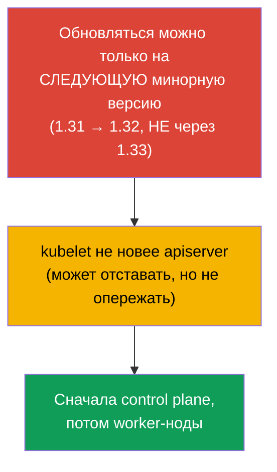
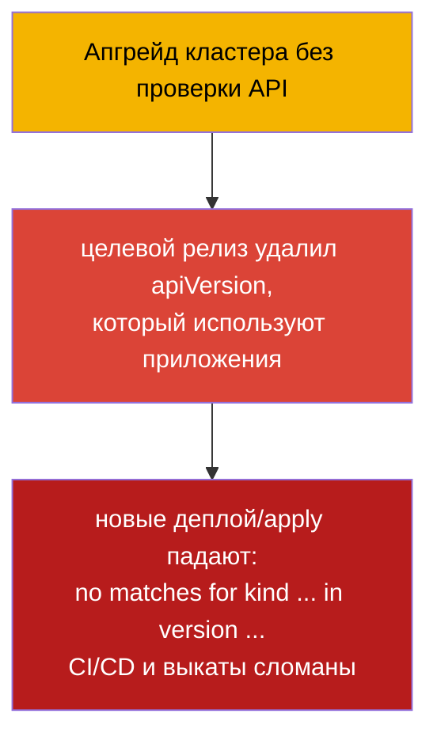
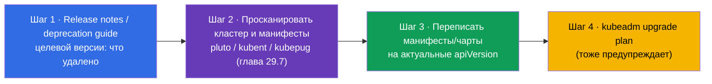
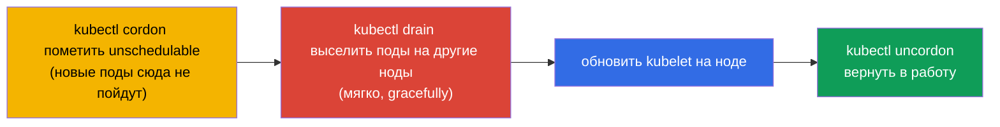
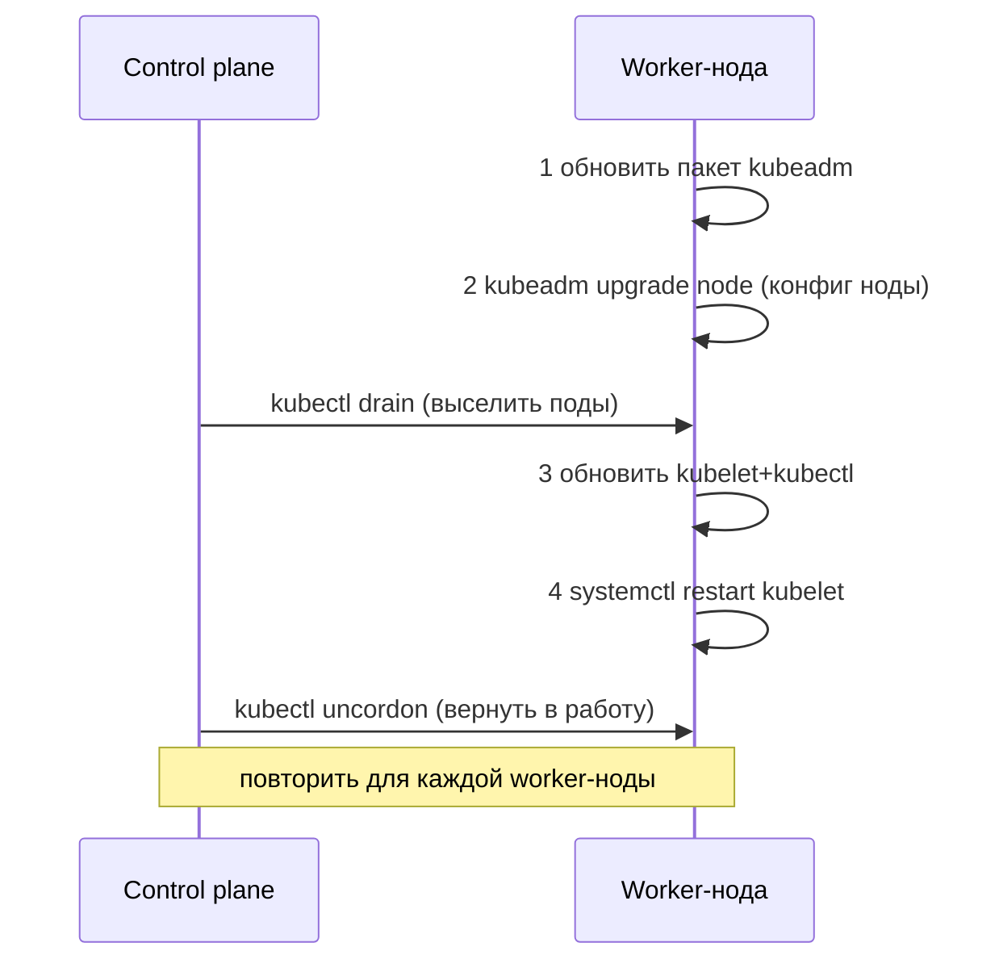
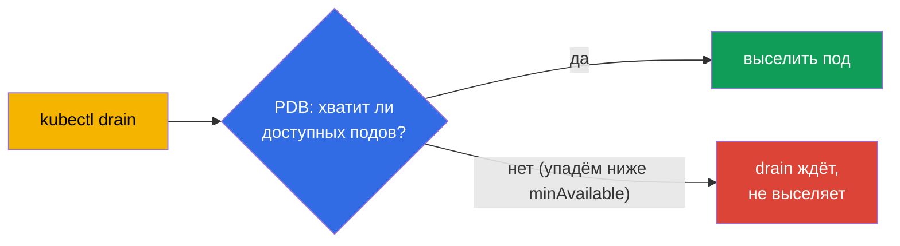

# Глава 36. Обновление кластера (lifecycle)

> 🟦 **Глава для CKA** (домен Cluster Architecture, Installation & Configuration).
>
> **Что дальше.** Кластер собран (глава 35), но Kubernetes выходит с новыми версиями, и
> кластер надо обновлять. Обновление - деликатная операция: сделать неверно, и можно
> уронить прод. Разберём правильный порядок обновления control plane и worker-нод через
> kubeadm, роль `cordon`/`drain` (связь с taints, глава 13) и правила версий. Это прямое
> задание CKA («обнови кластер до версии X») и важнейший эксплуатационный навык.

## 36.1. Версии и правило skew

У Kubernetes строгие правила совместимости версий компонентов - их надо знать, чтобы не
сломать кластер.



- **Только на следующую минорную версию.** Нельзя перепрыгнуть 1.31 → 1.33; надо 1.31 →
  1.32 → 1.33. Патч-версии внутри минорной - свободно.
- **Version skew.** kubelet может отставать от apiserver (в пределах нескольких минорных),
  но **не может быть новее**. Поэтому control plane обновляют первым.
- **Порядок.** Сначала control plane (apiserver и остальные), потом worker-ноды.

## 36.2. Пре-флайт: проверка API перед обновлением (иначе приложения перестанут деплоиться)

Прежде чем трогать ноды, надо проверить **совместимость API**. Kubernetes с новыми
минорными версиями **удаляет устаревшие версии API** (глава 29). Если приложение,
Helm-чарт, оператор или CRD используют версию API, которую целевой релиз **удалил**,
то после апгрейда:

- уже созданные объекты apiserver отдаёт под новой версией (обычно ок),
- но **новые `kubectl apply`/деплой манифестов со старой `apiVersion` падают** с ошибкой
  `no matches for kind ... in version ...` - то есть выкаты и CI/CD ломаются.



Классические примеры удалённых API (частая боль): `extensions/v1beta1` Ingress →
`networking.k8s.io/v1` (удалён в 1.22), `policy/v1beta1` PodDisruptionBudget →
`policy/v1` (удалён в 1.25), старые `apps/v1beta*` Deployment (удалены в 1.16),
`batch/v1beta1` CronJob → `batch/v1` (удалён в 1.25).

**Чек-лист перед апгрейдом:**



> **Инструменты для шага 2** (сканирование кластера и кода на устаревшие/удаляемые API) -
> подробно в [главе 29](../29/ru.md), раздел **29.7 «Open-source инструменты анализа
> устаревших API»**: kubent, pluto, kubepug (`kubectl deprecations`), kubeconform, Popeye -
> с командами для кластера и для CI.

```bash
# какие версии API реально обслуживает кластер сейчас
kubectl api-versions
kubectl api-resources

# найти устаревшие/удаляемые API в живом кластере и в манифестах (глава 29)
pluto detect-all-in-cluster
kubent                                  # kube-no-trouble
pluto detect-files -d ./manifests/

# сконвертировать манифест на актуальную версию API
kubectl convert -f old-ingress.yaml --output-version networking.k8s.io/v1
```

Отдельно проверяют, что **аддоны совместимы** с целевой версией Kubernetes: CNI
(Calico/Cilium), CSI-драйверы, ingress-контроллер, metrics-server, а также
admission-webhook'и и CRD операторов - у них свои матрицы совместимости. Несовместимый
аддон после апгрейда может сломать сеть, хранилище или приём трафика.

Вывод: **сначала привести приложения/чарты/аддоны к версиям, поддерживаемым целевым
релизом, и только потом обновлять кластер.** Иначе кластер обновится, а приложения
перестанут выкатываться.

## 36.3. Общий порядок обновления


Ноды обновляют **по одной**, чтобы кластер всё время оставался работоспособным: пока одну
ноду обслуживают, остальные несут нагрузку. Это и есть безопасное обновление без простоя.

## 36.4. Обновление control plane

На первой control plane ноде порядок такой:

```bash
# 1. Обновить сам kubeadm до целевой версии
sudo apt-mark unhold kubeadm
sudo apt-get install -y kubeadm=1.32.x-*
sudo apt-mark hold kubeadm

# 2. Посмотреть план обновления
sudo kubeadm upgrade plan

# 3. Применить обновление control plane
sudo kubeadm upgrade apply v1.32.x

# 4. Освободить control plane ноду (drain), как и любую другую перед обновлением kubelet
kubectl drain <control-plane> --ignore-daemonsets

# 5. Обновить kubelet и kubectl на этой ноде
sudo apt-mark unhold kubelet kubectl
sudo apt-get install -y kubelet=1.32.x-* kubectl=1.32.x-*
sudo apt-mark hold kubelet kubectl
sudo systemctl daemon-reload
sudo systemctl restart kubelet

# 6. Вернуть control plane ноду в работу
kubectl uncordon <control-plane>
```


> **Примечание.** `kubeadm upgrade apply` делают только на **первой** control plane ноде.
> На остальных control plane нодах (в HA, глава 35A) вместо `apply` выполняют
> `kubeadm upgrade node` - как на worker-нодах (раздел 36.6), но drain control plane ноды
> тоже нужен.

## 36.5. cordon и drain: подготовка ноды к обновлению

Перед обновлением kubelet на **любой** ноде её нужно освободить от подов, чтобы не задеть
нагрузку. Это два шага:



```bash
kubectl cordon <node>                              # больше не планировать сюда
kubectl drain <node> --ignore-daemonsets --delete-emptydir-data   # выселить поды
# ... обновить kubelet на ноде ...
kubectl uncordon <node>                            # вернуть в пул планирования
```

- **cordon** ставит на ноду taint `unschedulable` (глава 13) - новые поды сюда не
  назначаются, но уже запущенные работают.
- **drain** дополнительно выселяет поды (мягко, соблюдая graceful shutdown), перенося их
  на другие ноды. `--ignore-daemonsets` нужен, потому что поды DaemonSet привязаны к ноде
  и не переезжают; `--delete-emptydir-data` разрешает удалить поды с emptyDir.

## 36.6. Обновление worker-нод

Для каждой worker-ноды (по одной). Порядок - как в официальной документации kubeadm:
сначала **два шага kubeadm** (обновить сам пакет и `kubeadm upgrade node`), и только
потом drain и обновление kubelet.

```bash
# --- на самой worker-ноде ---
# 1. Обновить пакет kubeadm до целевой версии
sudo apt-mark unhold kubeadm && sudo apt-get update && sudo apt-get install -y kubeadm=1.32.x-* && sudo apt-mark hold kubeadm

# 2. kubeadm upgrade node — обновляет локальную конфигурацию ноды (kubelet-config)
sudo kubeadm upgrade node

# --- с control plane: освободить ноду ---
kubectl drain <worker> --ignore-daemonsets --delete-emptydir-data

# --- снова на worker-ноде ---
# 3. Обновить kubelet и kubectl
sudo apt-mark unhold kubelet kubectl && sudo apt-get install -y kubelet=1.32.x-* kubectl=1.32.x-* && sudo apt-mark hold kubelet kubectl
# 4. Перезапустить kubelet
sudo systemctl daemon-reload && sudo systemctl restart kubelet

# --- с control plane: вернуть ноду в работу ---
kubectl uncordon <worker>
```



Ключевые два шага kubeadm: **обновить пакет `kubeadm`** и **`kubeadm upgrade node`** (не
`apply`!) - последний применяет обновление локальной конфигурации ноды. Они идут **до**
`drain` - `kubeadm upgrade node` не мешает работающим подам.

На worker-нодах используется `kubeadm upgrade node` (не `apply`) - он обновляет локальную
конфигурацию ноды.

## 36.7. PodDisruptionBudget: защита при drain

`drain` выселяет поды, но что если это уронит доступность приложения (все реплики окажутся
на выселяемой ноде)? **PodDisruptionBudget (PDB)** задаёт минимум доступных подов, ниже
которого добровольное выселение (drain) не опустится.

```yaml
apiVersion: policy/v1
kind: PodDisruptionBudget
metadata:
  name: web-pdb
spec:
  minAvailable: 2            # всегда держать минимум 2 пода доступными
  selector:
    matchLabels:
      app: web
```



PDB защищает от того, чтобы обслуживание нод (или автоскейлинг вниз) не уронило приложение.
При обновлении кластера PDB заставляет `drain` ждать, пока нельзя безопасно выселить под.

## 36.8. Обновление ОС ноды

Отдельно от версии Kubernetes бывает нужно обновить саму ОС ноды (патчи, ядро). Порядок
тот же: `cordon` → `drain` → обслуживание/перезагрузка ноды → `uncordon`. Если нода
надолго выводится или заменяется, её удаляют из кластера:

```bash
kubectl drain <node> --ignore-daemonsets
kubectl delete node <node>              # убрать из кластера
# (на ноде) kubeadm reset               # очистить состояние
```

## 36.9. Как это применяют в продакшене

- **Обновление по одной ноде - железное правило.** В проде ноды обновляют строго
  поочерёдно с cordon/drain, чтобы приложение всё время оставалось доступным. Массовое
  обновление всех сразу = гарантированный простой.
- **PDB обязательны для критичных сервисов.** Без PDB `drain` может выселить все реплики
  разом. В проде каждому важному Deployment задают PDB (`minAvailable`/`maxUnavailable`),
  чтобы обслуживание нод не уронило сервис.
- **Управляемые кластеры упрощают, но не отменяют.** В EKS/GKE/AKS control plane обновляет
  провайдер, но worker-ноды (node pools) обновляет команда - с теми же cordon/drain и PDB.
  Часто это делают через пересоздание нод (rolling replacement).
- **Бэкап etcd перед обновлением control plane.** Опытные команды перед `kubeadm upgrade
  apply` делают снапшот etcd (глава 37) - страховка на случай неудачного обновления.
- **Соблюдение version skew и тестовая среда.** Обновляют строго по одной минорной версии
  и сначала на dev/stage, читают release notes на предмет удалённых API и ломающих
  изменений, а манифесты/чарты прогоняют инструментами из [главы 29 (раздел 29.7)](../29/ru.md):
  kubent/pluto по кластеру и pluto/kubepug/kubeconform в CI.

## 36.10. Мини-глоссарий

- **Version skew** - допустимая разница версий компонентов; kubelet не новее apiserver.
- **kubeadm upgrade plan / apply / node** - план / применение (первый CP) / обновление
  ноды.
- **cordon** - пометить ноду unschedulable (новые поды сюда не идут).
- **drain** - выселить поды с ноды (gracefully), перенести на другие.
- **uncordon** - вернуть ноду в пул планирования.
- **--ignore-daemonsets** - при drain не трогать поды DaemonSet (они привязаны к ноде).
- **PodDisruptionBudget (PDB)** - минимум доступных подов при добровольном выселении.
- **kubeadm reset** - очистка состояния kubeadm на ноде.
- **pluto / kubent** - поиск устаревших/удаляемых API в кластере и манифестах (глава 29).
- **kubectl convert** - конвертация манифеста на актуальную версию API.
- **удаление API** - целевой релиз может убрать apiVersion → старые манифесты перестают деплоиться.

## 36.11. Итоги главы

- **Перед апгрейдом проверяют совместимость API:** целевой релиз может удалить версии API,
  которые используют приложения/чарты/аддоны - тогда после обновления новые деплой падают
  (`no matches for kind ... in version ...`). Сканируют pluto/kubent, чинят манифесты
  (`kubectl convert`) и проверяют аддоны ДО обновления.
- Обновляться можно только на следующую минорную версию; kubelet не должен быть новее
  apiserver (version skew) - поэтому control plane первым.
- Порядок: control plane → worker-ноды, по одной, чтобы не терять доступность.
- Control plane: обновить kubeadm → `upgrade plan` → `upgrade apply vX` → обновить
  kubelet/kubectl и перезапустить kubelet.
- Перед обновлением kubelet ноду освобождают: `cordon` (unschedulable) + `drain`
  (выселить поды), после - `uncordon`.
- Worker-ноды используют `kubeadm upgrade node` (не apply).
- PodDisruptionBudget не даёт `drain` уронить доступность приложения ниже минимума.
- Обновление ОС/замена ноды - тот же cordon/drain, при выводе - `delete node` + `kubeadm
  reset`.

## 36.12. Как это пригодится: на экзамене и в реальной работе

**На экзамене (CKA).** «Обнови кластер до версии X» - классическое задание: нужно знать
порядок (control plane → worker, по одной), команды kubeadm upgrade и обязательные
cordon/drain/uncordon. Ошибка в порядке или пропуск drain - потеря баллов.

**В реальной работе.** Обновление кластера - регулярная эксплуатационная процедура.
Правильный порядок, cordon/drain и PDB обеспечивают апгрейд без простоя; бэкап etcd перед
обновлением control plane - страховка. Эти же приёмы (cordon/drain) применяются при любом
обслуживании и замене нод.

## 36.13. Вопросы для самопроверки

1. Почему перед обновлением кластера надо проверить используемые версии API и чем грозит
   пропуск этого шага? Какими инструментами проверяют?
2. Почему нельзя перепрыгнуть минорную версию и почему control plane обновляют первым?
3. Что такое version skew и как он связан с порядком обновления?
4. Чем отличаются `cordon` и `drain`? Зачем нужен `--ignore-daemonsets`?
5. В каком порядке обновляют control plane и worker-ноды и почему по одной?
6. Чем `kubeadm upgrade apply` отличается от `kubeadm upgrade node`?
7. Что делает PodDisruptionBudget при drain и зачем он нужен?
8. Какой порядок действий при обновлении ОС ноды или её замене?

## Практика

Мы научились безопасно обновлять кластер. В главе 37 - самое ценное в эксплуатации: бэкап
и восстановление etcd, без которого потеря control plane означает потерю кластера.
Обновление кластера отрабатывается в лабах по администрированию.

🧪 Лаба 111 (kubeadm upgrade): [tasks/cka/labs/111](../../labs/111/README_RU.MD)

---
[Оглавление](../README_RU.md) · [Глава 35](../35/ru.md) · [Глава 37](../37/ru.md)
