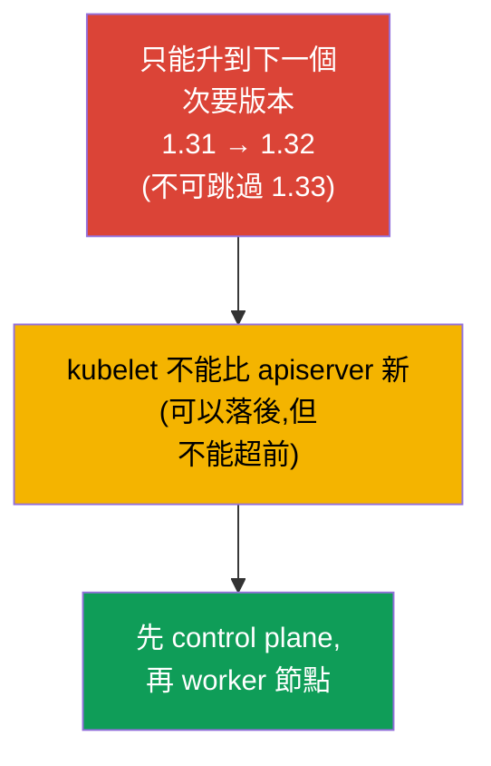
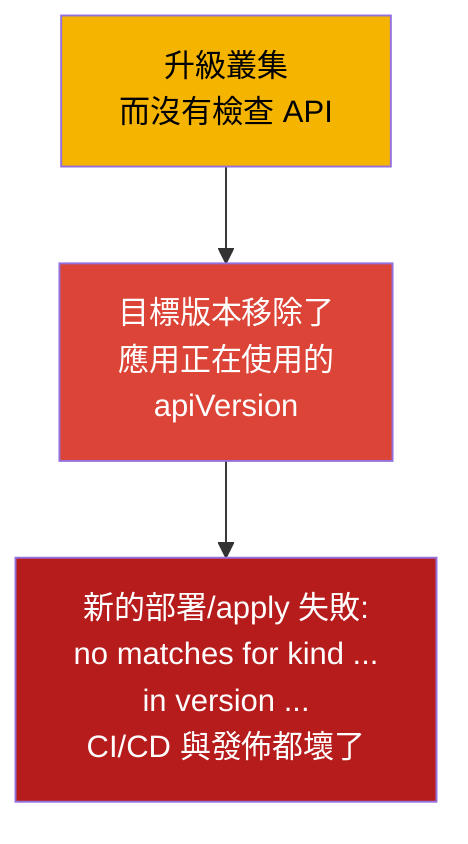
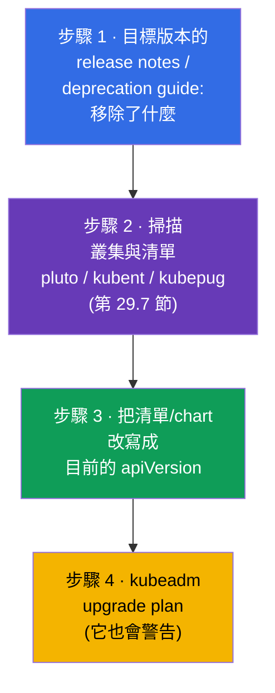
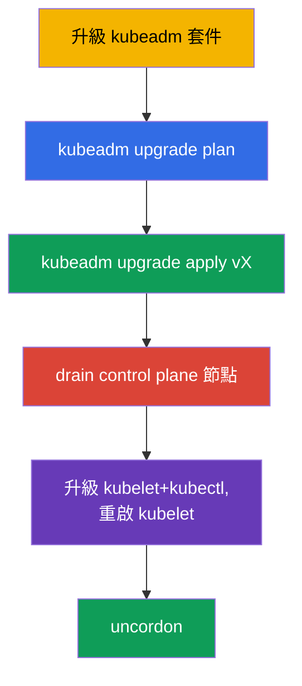
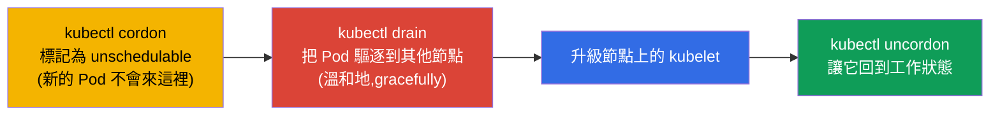
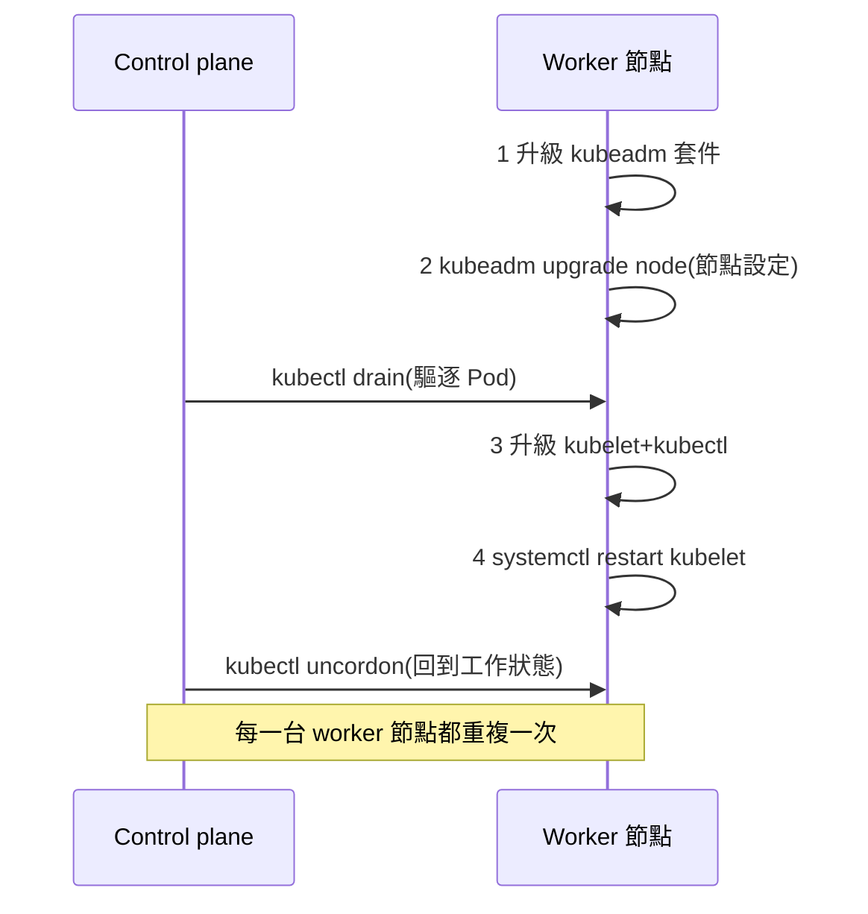
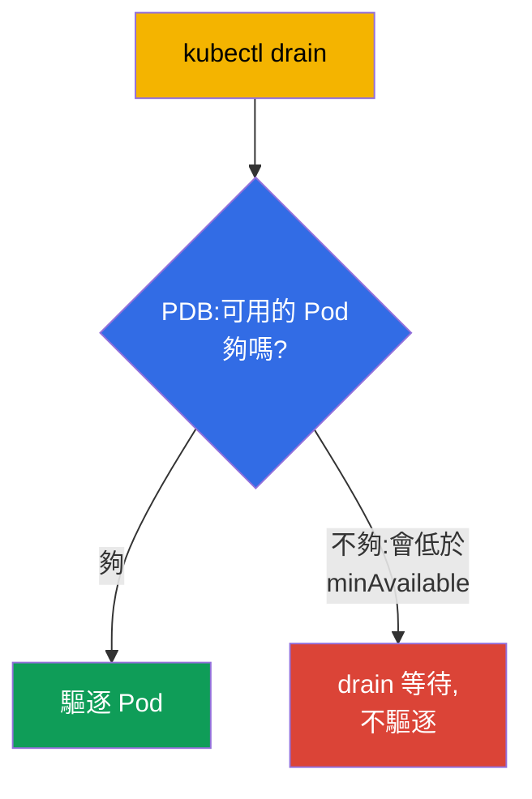

[Русская версия](ru.md) · [Eng version](README.md) · [Versión en español](es.md) · [Version française](fr.md) · [Deutsche Version](de.md) · [ქართული ვერსია](ge.md) · [日本語版](jp.md)

# 第 36 章。叢集升級(lifecycle)

> 🟦 **CKA 章節**(領域 Cluster Architecture, Installation & Configuration)。
>
> **接下來是什麼。** 叢集已經組好了(第 35 章),但 Kubernetes 會不斷發佈新版
> 本,叢集就得升級。升級是一件細緻的事:做錯了就可能把生產環境弄倒。我們會看用
> kubeadm 升級 control plane 與 worker 節點的正確順序、`cordon`/`drain` 的角色
> (與 taints 相關,第 13 章)以及版本規則。這是 CKA 的直接題目(「把叢集升級到
> 版本 X」),也是最重要的維運技能。

## 36.1. 版本與 skew 規則

Kubernetes 對元件版本的相容性有嚴格規則 - 必須知道它們,才不會把叢集弄壞。



- **只能升到下一個次要版本。** 不能從 1.31 直接跳到 1.33;要走 1.31 → 1.32 →
  1.33。同一個次要版本內的補丁版本 - 可以自由升。
- **Version skew。** kubelet 可以落後 apiserver(在幾個次要版本之內),但
  **不能比它新**。所以 control plane 要先升級。
- **順序。** 先 control plane(apiserver 以及其餘元件),再 worker 節點。

## 36.2. 預檢:升級前檢查 API(否則應用會無法部署)

在動節點之前,必須先檢查 **API 相容性**。Kubernetes 每個新的次要版本都會
**移除已棄用的 API 版本**(第 29 章)。如果應用、Helm chart、operator 或 CRD
用到目標版本**已經移除**的 API 版本,那麼升級之後:

- 已經建立的物件,apiserver 會以新版本回傳(通常沒問題),
- 但**用舊 `apiVersion` 的新 `kubectl apply`/部署清單會失敗**,錯誤是
  `no matches for kind ... in version ...` - 也就是發佈與 CI/CD 都壞了。



被移除 API 的經典例子(常見的痛):`extensions/v1beta1` Ingress →
`networking.k8s.io/v1`(1.22 移除)、`policy/v1beta1` PodDisruptionBudget →
`policy/v1`(1.25 移除)、舊的 `apps/v1beta*` Deployment(1.16 移除)、
`batch/v1beta1` CronJob → `batch/v1`(1.25 移除)。

**升級前的檢查清單:**



> **步驟 2 的工具**(掃描叢集與程式碼裡已棄用/將被移除的 API)- 在
> [第 29 章](../29/tw.md)的 **29.7「分析已棄用 API 的開源工具」** 一節有詳細
> 說明:kubent、pluto、kubepug(`kubectl deprecations`)、kubeconform、Popeye -
> 附有針對叢集與 CI 的指令。

```bash
# 叢集目前實際提供哪些 API 版本
kubectl api-versions
kubectl api-resources

# 在活著的叢集與清單裡找出已棄用/將被移除的 API(第 29 章)
pluto detect-all-in-cluster
kubent                                  # kube-no-trouble
pluto detect-files -d ./manifests/

# 把清單轉換成目前的 API 版本
kubectl convert -f old-ingress.yaml --output-version networking.k8s.io/v1
```

另外還要單獨確認 **附加元件與目標 Kubernetes 版本相容**:CNI
(Calico/Cilium)、CSI 驅動、ingress 控制器、metrics-server,以及
admission webhook 和 operator 的 CRD - 它們各自有自己的相容性矩陣。升級之後,
不相容的附加元件可能會弄壞網路、儲存或流量的接收。

結論:**先把應用/chart/附加元件調整到目標版本支援的版本,然後才升級叢集。**
否則叢集升上去了,應用卻無法發佈。

## 36.3. 升級的整體順序


節點要**一台一台**升級,讓叢集全程保持可用:當一台節點在維護時,其餘節點承擔
負載。這就是不停機的安全升級方式。

## 36.4. 升級 control plane

在第一台 control plane 節點上,順序是這樣:

```bash
# 1. 先把 kubeadm 本身升到目標版本
sudo apt-mark unhold kubeadm
sudo apt-get install -y kubeadm=1.32.x-*
sudo apt-mark hold kubeadm

# 2. 查看升級計畫
sudo kubeadm upgrade plan

# 3. 套用 control plane 的升級
sudo kubeadm upgrade apply v1.32.x

# 4. 騰空 control plane 節點(drain),和其他節點在升級 kubelet 前一樣
kubectl drain <control-plane> --ignore-daemonsets

# 5. 升級這台節點上的 kubelet 與 kubectl
sudo apt-mark unhold kubelet kubectl
sudo apt-get install -y kubelet=1.32.x-* kubectl=1.32.x-*
sudo apt-mark hold kubelet kubectl
sudo systemctl daemon-reload
sudo systemctl restart kubelet

# 6. 讓 control plane 節點回到工作狀態
kubectl uncordon <control-plane>
```



> **注意。** `kubeadm upgrade apply` 只在**第一台** control plane 節點上執行。
> 在其餘的 control plane 節點上(HA,第 35A 章)要用 `kubeadm upgrade node`
> 取代 `apply` - 就像 worker 節點那樣(36.6 節),但 control plane 節點也同樣
> 需要 drain。

## 36.5. cordon 與 drain:讓節點做好升級準備

在**任何**節點上升級 kubelet 之前,都要先把它上面的 Pod 騰空,以免影響負載。
這分成兩個步驟:



```bash
kubectl cordon <node>                              # 不再往這裡調度
kubectl drain <node> --ignore-daemonsets --delete-emptydir-data   # 驅逐 Pod
# ... 升級節點上的 kubelet ...
kubectl uncordon <node>                            # 放回調度池
```

- **cordon** 會在節點上加上 `unschedulable` taint(第 13 章)- 新的 Pod 不會被
  分派到這裡,但已經在跑的仍然照常工作。
- **drain** 還會額外驅逐 Pod(溫和地,遵守 graceful shutdown),把它們搬到其他
  節點上。`--ignore-daemonsets` 是必要的,因為 DaemonSet 的 Pod 綁在節點上,不會
  搬走;`--delete-emptydir-data` 允許刪除帶有 emptyDir 的 Pod。

## 36.6. 升級 worker 節點

對每一台 worker 節點(一台一台做)。順序和 kubeadm 官方文件一樣:先做
**kubeadm 的兩個步驟**(升級套件本身與 `kubeadm upgrade node`),之後才是 drain
與升級 kubelet。

```bash
# --- 在 worker 節點上 ---
# 1. 把 kubeadm 套件升到目標版本
sudo apt-mark unhold kubeadm && sudo apt-get update && sudo apt-get install -y kubeadm=1.32.x-* && sudo apt-mark hold kubeadm

# 2. kubeadm upgrade node — 更新節點的本地設定(kubelet-config)
sudo kubeadm upgrade node

# --- 從 control plane:騰空節點 ---
kubectl drain <worker> --ignore-daemonsets --delete-emptydir-data

# --- 再回到 worker 節點上 ---
# 3. 升級 kubelet 與 kubectl
sudo apt-mark unhold kubelet kubectl && sudo apt-get install -y kubelet=1.32.x-* kubectl=1.32.x-* && sudo apt-mark hold kubelet kubectl
# 4. 重啟 kubelet
sudo systemctl daemon-reload && sudo systemctl restart kubelet

# --- 從 control plane:讓節點回到工作狀態 ---
kubectl uncordon <worker>
```



kubeadm 的兩個關鍵步驟:**升級 `kubeadm` 套件** 與 **`kubeadm upgrade node`**
(不是 `apply`!)- 後者會套用節點本地設定的更新。它們排在 `drain` **之前** -
`kubeadm upgrade node` 不會干擾正在運行的 Pod。

在 worker 節點上用的是 `kubeadm upgrade node`(不是 `apply`)- 它更新的是節點的
本地設定。

## 36.7. PodDisruptionBudget:drain 時的保護

`drain` 會驅逐 Pod,但如果這樣會讓應用失去可用性怎麼辦(所有副本剛好都在被騰空
的那台節點上)?**PodDisruptionBudget(PDB)** 設定可用 Pod 的最小數量,自願性
驅逐(drain)不會低於這個數量。

```yaml
apiVersion: policy/v1
kind: PodDisruptionBudget
metadata:
  name: web-pdb
spec:
  minAvailable: 2            # 永遠保持至少 2 個 Pod 可用
  selector:
    matchLabels:
      app: web
```



PDB 保護的是:節點維護(或縮容自動擴縮)不要把應用弄倒。在升級叢集時,PDB 會讓
`drain` 等待,直到可以安全地驅逐 Pod。

## 36.8. 升級節點的作業系統

除了 Kubernetes 的版本之外,有時也需要升級節點的作業系統本身(補丁、核心)。
順序一樣:`cordon` → `drain` → 節點維護/重啟 → `uncordon`。如果節點要長時間下線
或被替換,就把它從叢集移除:

```bash
kubectl drain <node> --ignore-daemonsets
kubectl delete node <node>              # 從叢集移除
# (在節點上) kubeadm reset               # 清理狀態
```

## 36.9. 這在生產環境怎麼用

- **一台一台升級 - 鐵律。** 生產環境嚴格按順序逐台升級,配合 cordon/drain,讓
  應用全程保持可用。一次全部升級 = 保證停機。
- **關鍵服務必須有 PDB。** 沒有 PDB,`drain` 可能一次驅逐掉所有副本。生產環境會
  給每個重要的 Deployment 設定 PDB(`minAvailable`/`maxUnavailable`),讓節點維護
  不會弄倒服務。
- **託管叢集讓事情變簡單,但沒有取消它。** 在 EKS/GKE/AKS 裡 control plane 由
  供應商升級,但 worker 節點(node pools)由團隊升級 - 同樣要 cordon/drain 與
  PDB。常見做法是透過重建節點來完成(rolling replacement)。
- **升級 control plane 之前先備份 etcd。** 有經驗的團隊在 `kubeadm upgrade
  apply` 之前會做 etcd 快照(第 37 章)- 萬一升級失敗時的保險。
- **遵守 version skew 並先在測試環境驗證。** 嚴格一次只升一個次要版本,並且先在
  dev/stage 上做,閱讀 release notes 看有哪些被移除的 API 與破壞性變更,清單/chart
  則用[第 29 章(29.7 節)](../29/tw.md)的工具跑一遍:對叢集用 kubent/pluto,在
  CI 裡用 pluto/kubepug/kubeconform。

## 36.10. 迷你詞彙表

- **Version skew** - 元件之間允許的版本差距;kubelet 不能比 apiserver 新。
- **kubeadm upgrade plan / apply / node** - 計畫 / 套用(第一台 CP)/ 升級
  節點。
- **cordon** - 把節點標記為 unschedulable(新的 Pod 不會來這裡)。
- **drain** - 把 Pod 從節點驅逐(gracefully),搬到其他節點。
- **uncordon** - 讓節點回到調度池。
- **--ignore-daemonsets** - drain 時不動 DaemonSet 的 Pod(它們綁在節點上)。
- **PodDisruptionBudget(PDB)** - 自願性驅逐時可用 Pod 的最小數量。
- **kubeadm reset** - 清理節點上 kubeadm 的狀態。
- **pluto / kubent** - 在叢集與清單裡尋找已棄用/將被移除的 API(第 29 章)。
- **kubectl convert** - 把清單轉換成目前的 API 版本。
- **移除 API** - 目標版本可能拿掉某個 apiVersion → 舊的清單就無法再部署。

## 36.11. 本章總結

- **升級前要檢查 API 相容性:** 目標版本可能移除應用/chart/附加元件正在使用的
  API 版本 - 那麼升級之後新的部署就會失敗
  (`no matches for kind ... in version ...`)。用 pluto/kubent 掃描,用
  `kubectl convert` 修好清單,並在升級**之前**確認附加元件。
- 只能升到下一個次要版本;kubelet 不應該比 apiserver 新(version skew)- 所以
  control plane 要先升。
- 順序:control plane → worker 節點,一台一台,才不會失去可用性。
- Control plane:升級 kubeadm → `upgrade plan` → `upgrade apply vX` → 升級
  kubelet/kubectl 並重啟 kubelet。
- 升級 kubelet 之前要先騰空節點:`cordon`(unschedulable)+ `drain`
  (驅逐 Pod),之後 - `uncordon`。
- Worker 節點用的是 `kubeadm upgrade node`(不是 apply)。
- PodDisruptionBudget 不會讓 `drain` 把應用的可用性壓到最小值以下。
- 升級作業系統/替換節點 - 同樣是 cordon/drain,要下線時則是 `delete node` +
  `kubeadm reset`。

## 36.12. 這會怎麼幫到你:考試與實際工作

**在考試中(CKA)。**「把叢集升級到版本 X」- 經典題目:要知道順序
(control plane → worker,一台一台)、kubeadm upgrade 的指令,以及必備的
cordon/drain/uncordon。順序弄錯或漏掉 drain - 就會扣分。

**在實際工作中。** 升級叢集是常規的維運程序。正確的順序、cordon/drain 與 PDB
能保證不停機升級;升級 control plane 前備份 etcd 是保險。同樣的手法
(cordon/drain)也用在任何節點維護與替換上。

## 36.13. 自我檢查問題

1. 為什麼升級叢集之前要檢查正在使用的 API 版本,跳過這個步驟有什麼風險?用哪些
   工具檢查?
2. 為什麼不能跳過次要版本,以及為什麼 control plane 要先升級?
3. 什麼是 version skew,它和升級順序有什麼關係?
4. `cordon` 和 `drain` 有什麼不同?為什麼需要 `--ignore-daemonsets`?
5. control plane 與 worker 節點的升級順序是什麼,為什麼要一台一台?
6. `kubeadm upgrade apply` 和 `kubeadm upgrade node` 差在哪裡?
7. PodDisruptionBudget 在 drain 時做什麼,為什麼需要它?
8. 升級節點的作業系統或替換節點時,操作順序是什麼?

## 實踐

我們學會了安全地升級叢集。第 37 章 - 維運中最有價值的東西:etcd 的備份與還原,
沒有它,失去 control plane 就等於失去整個叢集。升級叢集會在管理相關的實驗中練習。

🧪 實驗 111(kubeadm upgrade):[tasks/cka/labs/111](../../labs/111/README_TW.MD)

---
[目錄](../README_TW.md) · [第 35 章](../35/tw.md) · [第 37 章](../37/tw.md)
