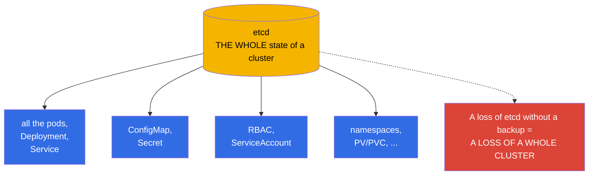
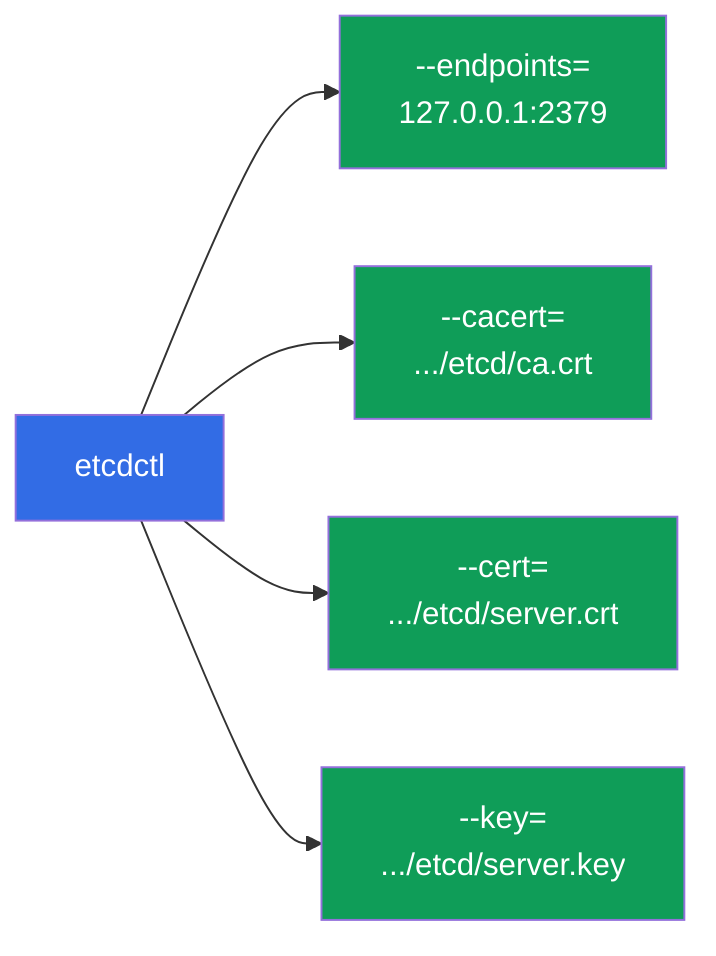
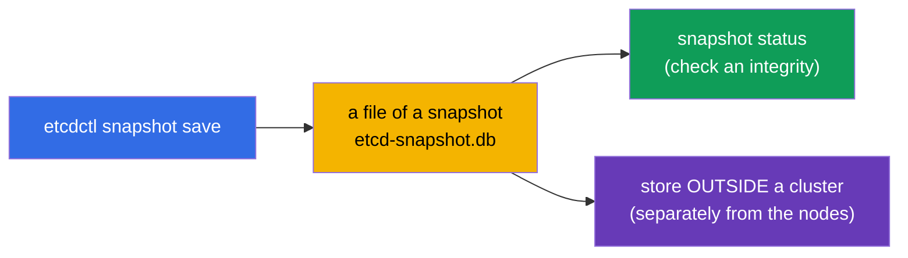
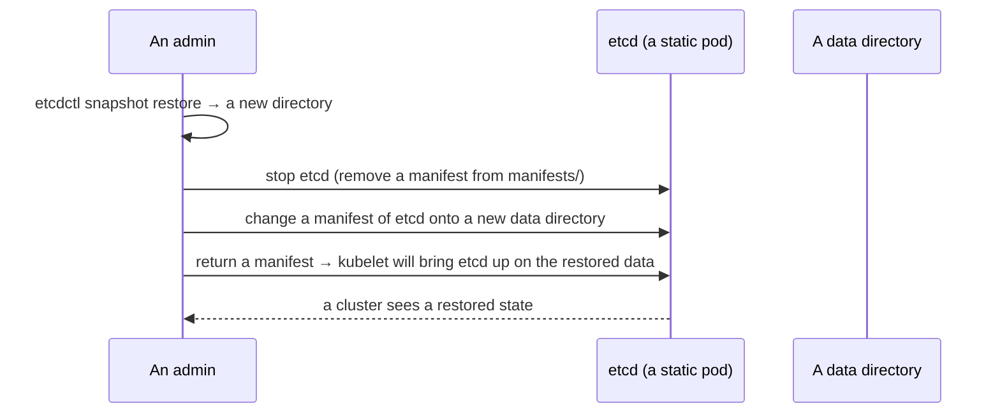

[Русская версия](ru.md) · [Versión en español](es.md) · [Version française](fr.md) · [Deutsche Version](de.md) · [ქართული ვერსია](ge.md) · [繁體中文版](tw.md) · [日本語版](jp.md)

# Chapter 37. A backup and a restore of etcd

> 🟦 **A chapter for the CKA** (a domain Cluster Architecture, Installation & Configuration).
>
> **What comes next.** From the chapter 2 we know: etcd - the only storage of the whole state
> of a cluster. A loss of etcd without a backup = a loss of a cluster entirely. That is why a backup
> and a restore of etcd - a critical skill and an almost guaranteed task at the CKA. We will consider
> an `etcdctl snapshot save/restore`, where to take the certificates from and how to bring a cluster back to a life from
> a snapshot.

## 37.1. Why etcd - this is a whole cluster

Let us repeat a key thought of the chapter 2: in etcd lies **everything** - every Deployment, Service, Secret,
ConfigMap, ServiceAccount. An API server - only a door to etcd; the data themselves are in etcd.



A conclusion is simple: **a regular backup of etcd - this is an insurance from a full loss of a cluster**. And this is
exactly what they check at the CKA.

## 37.2. Where etcd and its certificates live

In a kubeadm cluster etcd - a static pod (the chapter 15), and an access to it is protected by TLS. In order
to take a snapshot, an address and three files of the certificates are needed. All of them are written in a manifest of etcd:

```bash
# look at the parameters of etcd (an address, the paths to the certificates)
sudo cat /etc/kubernetes/manifests/etcd.yaml | grep -E 'listen-client|cert|key|trusted'
```

The typical paths (kubeadm):

| What | A path |
|-----|------|
| an endpoint of a client | `https://127.0.0.1:2379` |
| a CA certificate | `/etc/kubernetes/pki/etcd/ca.crt` |
| a client certificate | `/etc/kubernetes/pki/etcd/server.crt` |
| a client key | `/etc/kubernetes/pki/etcd/server.key` |
| the data of etcd | `/var/lib/etcd` |



## 37.3. A creation of a snapshot: etcdctl snapshot save

A snapshot is taken with a utility `etcdctl` with an indication of a version of the API v3 and of the certificates:

```bash
ETCDCTL_API=3 etcdctl snapshot save /backup/etcd-snapshot.db \
  --endpoints=https://127.0.0.1:2379 \
  --cacert=/etc/kubernetes/pki/etcd/ca.crt \
  --cert=/etc/kubernetes/pki/etcd/server.crt \
  --key=/etc/kubernetes/pki/etcd/server.key
```

Check a snapshot:

```bash
ETCDCTL_API=3 etcdctl snapshot status /backup/etcd-snapshot.db --write-out=table
```



> **Important.** An `ETCDCTL_API=3` is mandatory - without it etcdctl can use an old API.
> A snapshot is stored **outside** a cluster (not on the same node), otherwise a loss of a node will take away a backup too.

## 37.4. A restore: etcdctl snapshot restore

A restore unfolds a snapshot into a **new data directory**, after which etcd
is reconfigured onto it. A general idea:



Step by step:

```bash
# 1. Unfold a snapshot into a new directory
ETCDCTL_API=3 etcdctl snapshot restore /backup/etcd-snapshot.db \
  --data-dir=/var/lib/etcd-restore

# 2. Stop etcd: temporarily remove a manifest
sudo mv /etc/kubernetes/manifests/etcd.yaml /tmp/

# 3. In a manifest of etcd change a hostPath of a data directory to /var/lib/etcd-restore
sudo vim /tmp/etcd.yaml     # volumes: hostPath.path → /var/lib/etcd-restore

# 4. Return a manifest - kubelet will bring etcd up on the restored data
sudo mv /tmp/etcd.yaml /etc/kubernetes/manifests/
```


After etcd comes up on a restored directory, a cluster will return to a state
at a moment of a snapshot. A restart of apiserver may be needed (remove/return its manifest
or wait).

## 37.5. The important reservations of a restore

- **A restore returns a state at a moment of a snapshot.** Everything, that is created after
  a snapshot, will be lost. Hence an importance of the frequent backups.
- **Stop the consumers.** For a time of a restore etcd has to be stopped; after - its
  clients (apiserver) have to reconnect to the restored data.
- **In a HA cluster it is more complex.** With a few nodes of etcd a restore affects a whole
  quorum - a procedure is more delicate (restore one node and reinitialize
  the rest). At the CKA usually there is one node of etcd.
- **Check a `--data-dir`.** A restore must not write into a current working directory of etcd -
  it is unfolded into a new one and a manifest is switched onto it.

## 37.6. An automation and a schedule

A one-time backup is useless - a regular one is needed. As we have considered (the chapter 10), the periodic
tasks are formalized as a **CronJob**:


In a production the snapshots are taken by a schedule and are put into an external storage (an object
storage, a separate server), keeping a few generations. A backup, lying on the same node
as etcd, will not save during a loss of a node.

## 37.7. How this is applied in a production

- **A regular auto backup - is mandatory.** In a production etcd is snapshotted by a schedule (often -
  hourly and more often) and the snapshots are uploaded beyond the limits of a cluster. This is a main insurance from
  a catastrophic loss of a state.
- **A check of a restorability.** A backup without a checked restore - an illusion of a protection.
  The mature teams periodically train a restore on a test cluster, so that a procedure
  worked during a real incident.
- **A monitoring of a health of etcd.** etcd is sensitive to a disk latency; it is watched over
  (latency, a size of a DB, a quorum). A slow disk under etcd degrades a whole cluster.
- **The managed clusters back up themselves.** In EKS/GKE/AKS etcd and its backup - a zone
  of a provider, an access to etcdctl there is absent. A manual backup of etcd is actual for a self-managed/
  on-prem (and for the CKA).
- **A snapshot before the risky operations.** Before an upgrade of a control plane (the chapter 36)
  or the major changes a snapshot is taken - in order to roll back during a failure.

## 37.8. A mini glossary

- **etcd** - a storage of the whole state of a cluster (the chapter 2).
- **etcdctl** - a CLI for a work with etcd; for the snapshots an `ETCDCTL_API=3` is needed.
- **snapshot save** - a creation of a backup copy of etcd into a file.
- **snapshot restore** - an unfolding of a snapshot into a new data directory.
- **--data-dir** - a data directory of etcd (during a restore - a new one).
- **an endpoint 2379** - a client port of etcd.
- **the certificates of etcd** - a CA/cert/key in `/etc/kubernetes/pki/etcd/`.
- **a quorum** - a majority of the nodes of etcd, needed for a work (a HA).

## 37.9. The conclusions of the chapter

- etcd keeps a whole state of a cluster; its loss without a backup = a loss of a cluster. A backup of etcd -
  a critical skill and a frequent task of the CKA.
- In kubeadm etcd - a static pod; for a snapshot an endpoint (2379) and three certificates from
  `/etc/kubernetes/pki/etcd/` are needed.
- A snapshot: an `ETCDCTL_API=3 etcdctl snapshot save` with the certificates; a check -
  a `snapshot status`; store outside a cluster.
- A restore: a `snapshot restore --data-dir=<a new one>` → stop etcd (remove
  a manifest) → switch a manifest onto a new directory → return a manifest.
- A restore returns a state at a moment of a snapshot; everything later is lost - hence the frequent
  backups.
- In a production a backup is automated (a CronJob + an external storage), a restorability is checked and
  a snapshot is taken before the risky operations.

## 37.10. How this will come in handy: at an exam and in a real work

**At an exam (the CKA).** "Make a snapshot of etcd" and "restore etcd from a snapshot" - the almost
guaranteed tasks. One has to know by heart a command `etcdctl snapshot save/restore` with
the flags of the certificates (their paths are looked for in a manifest of etcd) and a procedure of a switching of a data
directory. To forget an `ETCDCTL_API=3` - a frequent mistake.

**In a real work.** A backup of etcd - a last line of a defense of a cluster. The regular
auto snapshots into an external storage, a checked procedure of a restore and a snapshot before
the upgrades - that, which separates a survivable incident from a loss of a whole cluster in
the self-managed environments.

## 37.11. The questions for a self-check

1. Why does a loss of etcd mean a loss of a whole cluster?
2. Which parameters and files are needed, in order to take a snapshot of etcd, and where to take them from?
3. Write a command of a creation of a snapshot. What is an `ETCDCTL_API=3` for?
4. Describe the steps of a restore from a snapshot. Where does a restore unfold to?
5. What is lost during a restore and why are the frequent backups important?
6. Where does one need to store the snapshots and why not on the same node?
7. How is a backup of etcd automated in a production and why check a restore?

## Practice

We have mastered an insurance of a cluster. In the chapter 38 we will move on to a security of an access - RBAC (Role,
ClusterRole, the bindings), deepening an overview from the chapter 21. A backup and a restore of etcd
are practiced in the labs on an administration.

🧪 A lab 112 (a backup and a restore of etcd): [tasks/cka/labs/112](../../labs/112/README.MD)

---
[Contents](../README.md) · [Chapter 36](../36/README.md) · [Chapter 38](../38/README.md)
