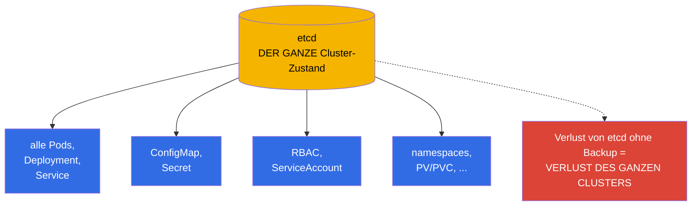
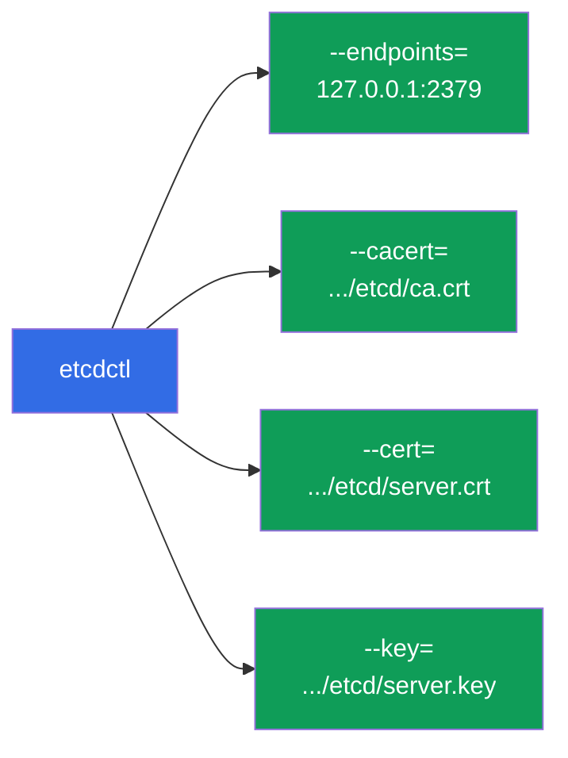
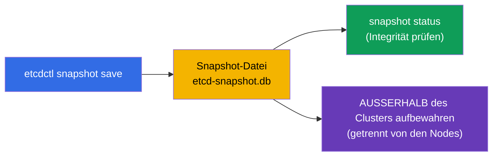
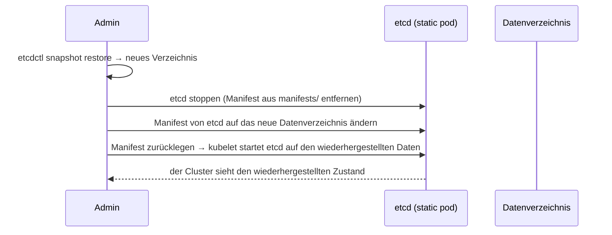
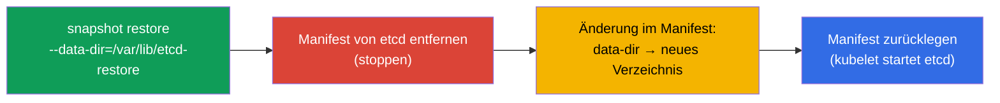

[Русская версия](ru.md) · [Eng version](README.md) · [Versión en español](es.md) · [Version française](fr.md) · [ქართული ვერსია](ge.md) · [繁體中文版](tw.md) · [日本語版](jp.md)

# Kapitel 37. Backup und Wiederherstellung von etcd

> 🟦 **Kapitel für CKA** (Domäne Cluster Architecture, Installation & Configuration).
>
> **Was kommt.** Aus Kapitel 2 wissen wir: etcd ist der einzige Speicher des gesamten
> Cluster-Zustands. Der Verlust von etcd ohne Backup = der Verlust des gesamten Clusters.
> Deshalb sind Backup und Wiederherstellung von etcd eine kritische Fähigkeit und eine fast
> garantierte Aufgabe in der CKA. Wir sehen uns `etcdctl snapshot save/restore` an, wo man die
> Zertifikate findet und wie man den Cluster aus einem Snapshot ins Leben zurückholt.

## 37.1. Warum etcd der ganze Cluster ist

Wiederholen wir den Kerngedanken aus Kapitel 2: in etcd liegt **alles** - jedes Deployment,
jeder Service, jedes Secret, jede ConfigMap, jeder ServiceAccount. Der API-Server ist nur die
Tür zu etcd; die Daten selbst liegen in etcd.



Das Fazit ist einfach: **ein regelmäßiges Backup von etcd ist die Versicherung gegen den
vollständigen Verlust des Clusters.** Und genau das wird in der CKA geprüft.

## 37.2. Wo etcd und seine Zertifikate leben

In einem kubeadm-Cluster ist etcd ein static pod (Kapitel 15), und der Zugriff darauf ist
über TLS geschützt. Um einen Snapshot zu erstellen, braucht man die Adresse und drei
Zertifikatsdateien. Alle sind im Manifest von etcd eingetragen:

```bash
# Parameter von etcd ansehen (Adresse, Pfade zu den Zertifikaten)
sudo cat /etc/kubernetes/manifests/etcd.yaml | grep -E 'listen-client|cert|key|trusted'
```

Typische Pfade (kubeadm):

| Was | Pfad |
|-----|------|
| endpoint des Clients | `https://127.0.0.1:2379` |
| CA-Zertifikat | `/etc/kubernetes/pki/etcd/ca.crt` |
| Client-Zertifikat | `/etc/kubernetes/pki/etcd/server.crt` |
| Client-Schlüssel | `/etc/kubernetes/pki/etcd/server.key` |
| Daten von etcd | `/var/lib/etcd` |



## 37.3. Einen Snapshot erstellen: etcdctl snapshot save

Den Snapshot erstellt man mit dem Werkzeug `etcdctl` unter Angabe der API-Version v3 und der
Zertifikate:

```bash
ETCDCTL_API=3 etcdctl snapshot save /backup/etcd-snapshot.db \
  --endpoints=https://127.0.0.1:2379 \
  --cacert=/etc/kubernetes/pki/etcd/ca.crt \
  --cert=/etc/kubernetes/pki/etcd/server.crt \
  --key=/etc/kubernetes/pki/etcd/server.key
```

Den Snapshot prüfen:

```bash
ETCDCTL_API=3 etcdctl snapshot status /backup/etcd-snapshot.db --write-out=table
```



> **Wichtig.** `ETCDCTL_API=3` ist zwingend - ohne das kann etcdctl die alte API verwenden.
> Den Snapshot bewahrt man **außerhalb** des Clusters auf (nicht auf derselben Node), sonst
> nimmt der Verlust der Node das Backup mit.

## 37.4. Wiederherstellung: etcdctl snapshot restore

Die Wiederherstellung entpackt den Snapshot in ein **neues Datenverzeichnis**, danach wird
etcd darauf umkonfiguriert. Die allgemeine Idee:



Schritt für Schritt:

```bash
# 1. Den Snapshot in ein neues Verzeichnis entpacken
ETCDCTL_API=3 etcdctl snapshot restore /backup/etcd-snapshot.db \
  --data-dir=/var/lib/etcd-restore

# 2. etcd stoppen: das Manifest vorübergehend entfernen
sudo mv /etc/kubernetes/manifests/etcd.yaml /tmp/

# 3. Im Manifest von etcd den hostPath des Datenverzeichnisses auf /var/lib/etcd-restore ändern
sudo vim /tmp/etcd.yaml     # volumes: hostPath.path → /var/lib/etcd-restore

# 4. Das Manifest zurücklegen — kubelet startet etcd auf den wiederhergestellten Daten
sudo mv /tmp/etcd.yaml /etc/kubernetes/manifests/
```



Nachdem etcd auf dem wiederhergestellten Verzeichnis gestartet ist, kehrt der Cluster zum
Zustand zum Zeitpunkt des Snapshots zurück. Möglicherweise ist ein Neustart des apiserver
nötig (entfernen Sie sein Manifest und legen Sie es zurück oder warten Sie ab).

## 37.5. Wichtige Vorbehalte bei der Wiederherstellung

- **Die Wiederherstellung stellt den Zustand zum Zeitpunkt des Snapshots her.** Alles, was
  nach dem Snapshot erstellt wurde, geht verloren. Daher die Bedeutung häufiger Backups.
- **Die Verbraucher stoppen.** Während des restore muss etcd gestoppt sein; danach müssen
  seine Clients (apiserver) sich mit den wiederhergestellten Daten neu verbinden.
- **In einem HA-Cluster ist es komplizierter.** Bei mehreren etcd-Knoten betrifft die
  Wiederherstellung das ganze Quorum - die Prozedur ist feiner (einen Knoten wiederherstellen
  und die übrigen neu initialisieren). In der CKA gibt es üblicherweise einen etcd-Knoten.
- **Prüfen Sie `--data-dir`.** Das restore darf nicht in das aktuelle Arbeitsverzeichnis von
  etcd schreiben - man entpackt in ein neues und schaltet das Manifest darauf um.

## 37.6. Automatisierung und Zeitplan

Ein einmaliges Backup ist nutzlos - es braucht ein regelmäßiges. Wie wir behandelt haben
(Kapitel 10), gestaltet man periodische Aufgaben als **CronJob**:


In der Produktion erstellt man Snapshots nach Zeitplan und legt sie in einen externen Speicher
(Objektspeicher, separater Server), wobei man mehrere Generationen aufbewahrt. Ein Backup, das
auf derselben Node wie etcd liegt, hilft beim Verlust der Node nicht.

## 37.7. Wie man das in der Produktion anwendet

- **Ein regelmäßiges Auto-Backup ist Pflicht.** In der Produktion snapshottet man etcd nach
  Zeitplan (häufig - stündlich und öfter) und lädt die Snapshots außerhalb des Clusters ab.
  Das ist die Hauptversicherung gegen den katastrophalen Verlust des Zustands.
- **Prüfung der Wiederherstellbarkeit.** Ein Backup ohne geprüfte Wiederherstellung ist eine
  Illusion von Schutz. Reife Teams üben das restore regelmäßig auf einem Testcluster, damit
  die Prozedur im echten Incident funktioniert.
- **Monitoring der Gesundheit von etcd.** etcd ist empfindlich gegenüber Disk-Latenz; man
  beobachtet es (latency, Größe der DB, Quorum). Eine langsame Disk unter etcd degradiert den
  ganzen Cluster.
- **Managed Cluster machen ihr Backup selbst.** In EKS/GKE/AKS sind etcd und dessen Backup die
  Zone des Providers, Zugriff auf etcdctl gibt es dort nicht. Ein manuelles Backup von etcd ist
  für self-managed/on-prem relevant (und für die CKA).
- **Snapshot vor riskanten Operationen.** Vor dem Upgrade der Control Plane (Kapitel 36) oder
  vor großen Änderungen erstellt man einen Snapshot - um bei einem Misserfolg zurückzurollen.

## 37.8. Mini-Glossar

- **etcd** - der Speicher des gesamten Cluster-Zustands (Kapitel 2).
- **etcdctl** - CLI für die Arbeit mit etcd; für Snapshots braucht man `ETCDCTL_API=3`.
- **snapshot save** - Erstellung einer Sicherungskopie von etcd in eine Datei.
- **snapshot restore** - Entpacken eines Snapshots in ein neues Datenverzeichnis.
- **--data-dir** - das Datenverzeichnis von etcd (beim restore - ein neues).
- **endpoint 2379** - der Client-Port von etcd.
- **Zertifikate von etcd** - CA/cert/key in `/etc/kubernetes/pki/etcd/`.
- **Quorum** - die Mehrheit der etcd-Knoten, die für den Betrieb nötig ist (HA).

## 37.9. Zusammenfassung des Kapitels

- etcd speichert den gesamten Cluster-Zustand; sein Verlust ohne Backup = der Verlust des
  Clusters. Ein Backup von etcd ist eine kritische Fähigkeit und eine häufige CKA-Aufgabe.
- In kubeadm ist etcd ein static pod; für den Snapshot braucht man den endpoint (2379) und drei
  Zertifikate aus `/etc/kubernetes/pki/etcd/`.
- Snapshot: `ETCDCTL_API=3 etcdctl snapshot save` mit den Zertifikaten; Prüfung -
  `snapshot status`; außerhalb des Clusters aufbewahren.
- Wiederherstellung: `snapshot restore --data-dir=<neu>` → etcd stoppen (Manifest entfernen) →
  das Manifest auf das neue Verzeichnis umschalten → das Manifest zurücklegen.
- Das restore stellt den Zustand zum Zeitpunkt des Snapshots her; alles Späteres geht verloren -
  daher häufige Backups.
- In der Produktion automatisiert man das Backup (CronJob + externer Speicher), prüft die
  Wiederherstellbarkeit und erstellt einen Snapshot vor riskanten Operationen.

## 37.10. Wofür das nützlich ist: in der Prüfung und in der echten Arbeit

**In der Prüfung (CKA).** „Erstelle einen Snapshot von etcd“ und „stelle etcd aus einem
Snapshot wieder her“ - fast garantierte Aufgaben. Man muss den Befehl
`etcdctl snapshot save/restore` mit den Zertifikatsflags auswendig kennen (deren Pfade sucht
man im Manifest von etcd) sowie die Prozedur zum Umschalten des Datenverzeichnisses.
`ETCDCTL_API=3` zu vergessen - ein häufiger Fehler.

**In der echten Arbeit.** Das Backup von etcd ist die letzte Verteidigungslinie des Clusters.
Regelmäßige Auto-Snapshots in einen externen Speicher, eine geprüfte
Wiederherstellungsprozedur und ein Snapshot vor Upgrades - das ist es, was einen überlebbaren
Incident vom Verlust des gesamten Clusters in self-managed Umgebungen trennt.

## 37.11. Fragen zur Selbstüberprüfung

1. Warum bedeutet der Verlust von etcd den Verlust des gesamten Clusters?
2. Welche Parameter und Dateien braucht man, um einen Snapshot von etcd zu erstellen, und wo bekommt man sie?
3. Schreiben Sie den Befehl zur Erstellung eines Snapshots. Wozu `ETCDCTL_API=3`?
4. Beschreiben Sie die Schritte der Wiederherstellung aus einem Snapshot. Wohin entpackt das restore?
5. Was geht bei der Wiederherstellung verloren und warum sind häufige Backups wichtig?
6. Wo muss man die Snapshots aufbewahren und warum nicht auf derselben Node?
7. Wie automatisiert man das Backup von etcd in der Produktion und wozu prüft man die Wiederherstellung?

## Praxis

Wir haben die Versicherung des Clusters gemeistert. In Kapitel 38 gehen wir zur Sicherheit des
Zugriffs über - RBAC (Role, ClusterRole, bindings) - und vertiefen den Überblick aus
Kapitel 21. Backup und Wiederherstellung von etcd übt man in den Labs zur Administration.

🧪 Lab 112 (Backup und Wiederherstellung von etcd): [tasks/cka/labs/112](../../labs/112/README_DE.MD)

---
[Inhalt](../README_DE.md) · [Kapitel 36](../36/de.md) · [Kapitel 38](../38/de.md)
