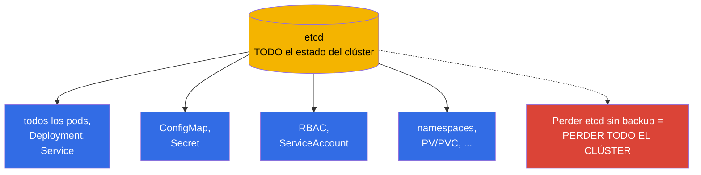
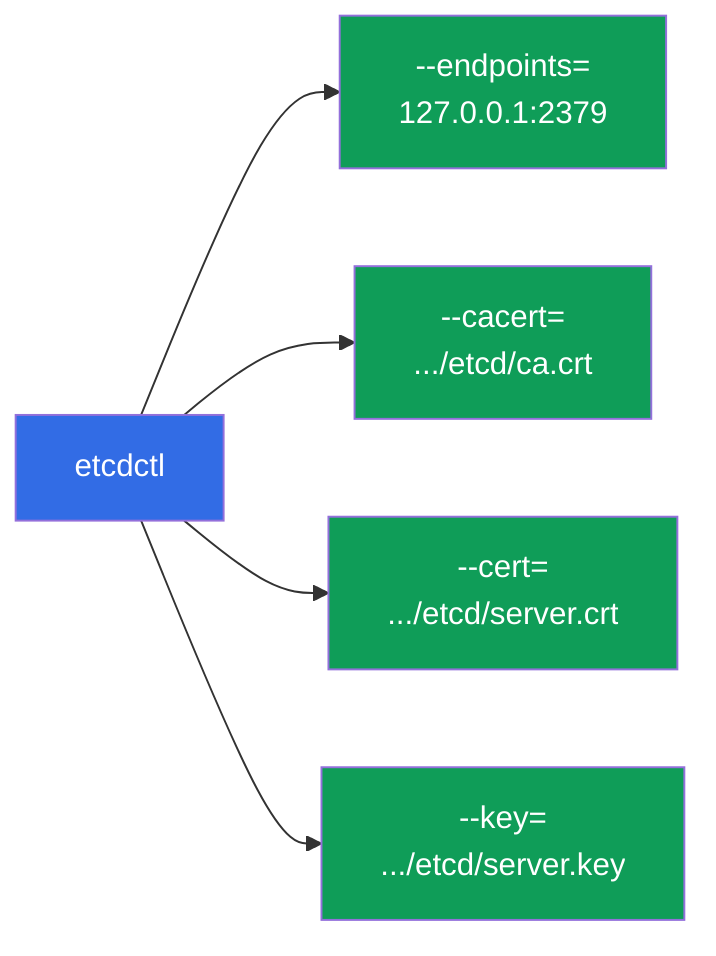
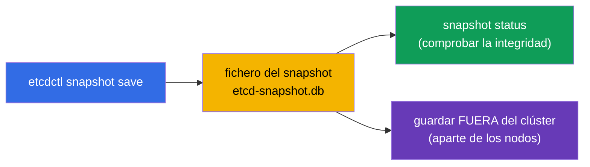
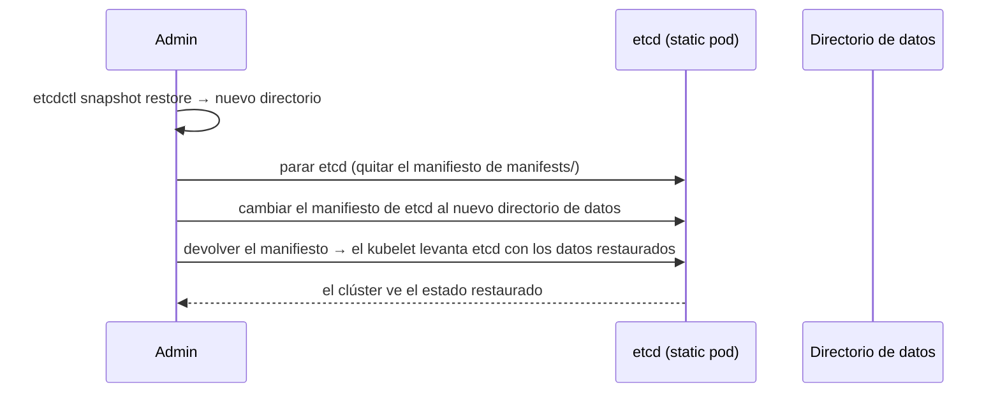
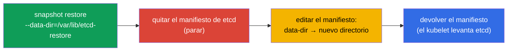

[Русская версия](ru.md) · [Eng version](README.md) · [Version française](fr.md) · [Deutsche Version](de.md) · [ქართული ვერსია](ge.md) · [繁體中文版](tw.md) · [日本語版](jp.md)

# Capítulo 37. Backup y restauración de etcd

> 🟦 **Capítulo para CKA** (dominio Cluster Architecture, Installation & Configuration).
>
> **Qué viene ahora.** Del capítulo 2 ya sabemos que etcd es el único almacén de todo el estado del
> clúster. Perder etcd sin backup = perder el clúster entero. Por eso el backup y la restauración de
> etcd son una habilidad crítica y una tarea casi garantizada en el CKA. Veremos
> `etcdctl snapshot save/restore`, de dónde sacar los certificados y cómo devolver el clúster a la
> vida desde un snapshot.

## 37.1. Por qué etcd es todo el clúster

Repitamos la idea clave del capítulo 2: en etcd está **todo** - cada Deployment, Service, Secret,
ConfigMap, ServiceAccount. El apiserver es solo la puerta hacia etcd; los datos están en etcd.



La conclusión es simple: **un backup regular de etcd es el seguro contra la pérdida total del
clúster**. Y es justo lo que se comprueba en el CKA.

## 37.2. Dónde vive etcd y sus certificados

En un clúster kubeadm, etcd es un static pod (capítulo 15) y el acceso está protegido con TLS. Para
tomar un snapshot hacen falta la dirección y tres certificados, declarados en el manifiesto de etcd:

```bash
# ver los parámetros de etcd (dirección, rutas a los certificados)
sudo cat /etc/kubernetes/manifests/etcd.yaml | grep -E 'listen-client|cert|key|trusted'
```

Rutas típicas (kubeadm):

| Qué | Ruta |
|-----|------|
| endpoint del cliente | `https://127.0.0.1:2379` |
| certificado CA | `/etc/kubernetes/pki/etcd/ca.crt` |
| certificado de cliente | `/etc/kubernetes/pki/etcd/server.crt` |
| clave de cliente | `/etc/kubernetes/pki/etcd/server.key` |
| datos de etcd | `/var/lib/etcd` |



## 37.3. Crear un snapshot: etcdctl snapshot save

El snapshot se toma con la utilidad `etcdctl`, indicando la versión v3 de la API y los certificados:

```bash
ETCDCTL_API=3 etcdctl snapshot save /backup/etcd-snapshot.db \
  --endpoints=https://127.0.0.1:2379 \
  --cacert=/etc/kubernetes/pki/etcd/ca.crt \
  --cert=/etc/kubernetes/pki/etcd/server.crt \
  --key=/etc/kubernetes/pki/etcd/server.key
```

Comprobar el snapshot:

```bash
ETCDCTL_API=3 etcdctl snapshot status /backup/etcd-snapshot.db --write-out=table
```



> **Importante.** `ETCDCTL_API=3` es obligatorio - sin él etcdctl puede usar la API antigua. El
> snapshot se guarda **fuera** del clúster (no en el mismo nodo), si no, perder el nodo se lo lleva.

## 37.4. Restauración: etcdctl snapshot restore

La restauración despliega el snapshot en un **nuevo directorio de datos**, y después se reconfigura
etcd para que lo use. La idea general:



Paso a paso:

```bash
# 1. Desplegar el snapshot en un nuevo directorio
ETCDCTL_API=3 etcdctl snapshot restore /backup/etcd-snapshot.db \
  --data-dir=/var/lib/etcd-restore

# 2. Parar etcd: quitar temporalmente el manifiesto
sudo mv /etc/kubernetes/manifests/etcd.yaml /tmp/

# 3. En el manifiesto de etcd cambiar el hostPath del directorio de datos a /var/lib/etcd-restore
sudo vim /tmp/etcd.yaml     # volumes: hostPath.path → /var/lib/etcd-restore

# 4. Devolver el manifiesto — el kubelet levantará etcd con los datos restaurados
sudo mv /tmp/etcd.yaml /etc/kubernetes/manifests/
```



Cuando etcd arranque con el directorio restaurado, el clúster volverá al estado del momento del
snapshot. Puede ser necesario reiniciar el apiserver (quitar/devolver su manifiesto o simplemente
esperar).

## 37.5. Advertencias importantes sobre la restauración

- **La restauración devuelve el estado del momento del snapshot.** Todo lo creado después del
  snapshot se perderá. De ahí la importancia de hacer backups frecuentes.
- **Parar a los consumidores.** Durante el restore, etcd debe estar parado; después, sus clientes
  (apiserver) deben reconectarse a los datos restaurados.
- **En un clúster HA es más complicado.** Con varios nodos etcd, la restauración afecta a todo el
  quórum - el procedimiento es más delicado (restaurar un nodo y reinicializar el resto). En el CKA
  normalmente hay un solo nodo etcd.
- **Comprueba `--data-dir`.** El restore no debe escribir en el directorio de trabajo actual de etcd
  - se despliega en uno nuevo y se apunta el manifiesto a él.

## 37.6. Automatización y calendario

Un backup puntual no sirve de nada - hace falta que sea regular. Como ya vimos (capítulo 10), las
tareas periódicas se definen como **CronJob**:


En producción los snapshots se toman según un calendario y se guardan en un almacenamiento externo
(almacenamiento de objetos, un servidor aparte), conservando varias generaciones. Un backup que está
en el mismo nodo que etcd no salva nada si se pierde el nodo.

## 37.7. Cómo se aplica esto en producción

- **El backup automático regular es obligatorio.** En producción se hacen snapshots de etcd según
  calendario (a menudo cada hora o más seguido) y se suben los snapshots fuera del clúster. Es el
  seguro principal contra la pérdida catastrófica del estado.
- **Verificar que se puede restaurar.** Un backup sin restauración probada es una ilusión de
  protección. Los equipos maduros ensayan periódicamente el restore en un clúster de pruebas, para
  que el procedimiento funcione en un incidente real.
- **Monitorizar la salud de etcd.** etcd es sensible a la latencia de disco; se vigila (latencia,
  tamaño de la BD, quórum). Un disco lento bajo etcd degrada todo el clúster.
- **Los clústeres gestionados se hacen el backup solos.** En EKS/GKE/AKS, etcd y su backup son cosa
  del proveedor, y allí no hay acceso a etcdctl. El backup manual de etcd es relevante en
  self-managed/on-prem (y para el CKA).
- **Snapshot antes de operaciones arriesgadas.** Antes de actualizar el control plane (capítulo 36)
  o de cambios grandes se toma un snapshot - para poder volver atrás si algo sale mal.

## 37.8. Mini-glosario

- **etcd** - almacén de todo el estado del clúster (capítulo 2).
- **etcdctl** - CLI para trabajar con etcd; para los snapshots hace falta `ETCDCTL_API=3`.
- **snapshot save** - creación de una copia de seguridad de etcd en un fichero.
- **snapshot restore** - despliegue del snapshot en un nuevo directorio de datos.
- **--data-dir** - directorio de datos de etcd (en el restore, uno nuevo).
- **endpoint 2379** - puerto de cliente de etcd.
- **certificados de etcd** - CA/cert/key en `/etc/kubernetes/pki/etcd/`.
- **quórum** - mayoría de nodos etcd necesaria para funcionar (HA).

## 37.9. Resumen del capítulo

- etcd guarda todo el estado del clúster; perderlo sin backup = perder el clúster. El backup de etcd
  es una habilidad crítica y una tarea frecuente del CKA.
- En kubeadm, etcd es un static pod; para el snapshot hacen falta el endpoint (2379) y tres
  certificados de `/etc/kubernetes/pki/etcd/`.
- Snapshot: `ETCDCTL_API=3 etcdctl snapshot save` con los certificados; comprobación -
  `snapshot status`; guardar fuera del clúster.
- Restauración: `snapshot restore --data-dir=<nuevo>` → parar etcd (quitar el manifiesto) → apuntar
  el manifiesto al nuevo directorio → devolver el manifiesto.
- El restore devuelve el estado del momento del snapshot; todo lo posterior se pierde - de ahí los
  backups frecuentes.
- En producción el backup se automatiza (CronJob + almacenamiento externo), se verifica que se pueda
  restaurar y se toma un snapshot antes de operaciones arriesgadas.

## 37.10. Para qué sirve esto: en el examen y en el trabajo real

**En el examen (CKA).** «Haz un snapshot de etcd» y «restaura etcd desde un snapshot» son tareas
casi garantizadas. Hay que saberse de memoria el comando `etcdctl snapshot save/restore` con los
flags de los certificados (sus rutas se buscan en el manifiesto de etcd) y el procedimiento de
cambio del directorio de datos. Olvidar `ETCDCTL_API=3` es un error frecuente.

**En el trabajo real.** El backup de etcd es la última línea de defensa del clúster. Los
autosnapshots regulares a un almacenamiento externo, un procedimiento de restauración probado y un
snapshot antes de los upgrades son lo que separa un incidente superable de la pérdida de todo el
clúster en entornos self-managed.

## 37.11. Preguntas de autocomprobación

1. ¿Por qué perder etcd significa perder todo el clúster?
2. ¿Qué parámetros y ficheros hacen falta para tomar un snapshot de etcd y de dónde se sacan?
3. Escribe el comando para crear un snapshot. ¿Para qué sirve `ETCDCTL_API=3`?
4. Describe los pasos de la restauración desde un snapshot. ¿Dónde se despliega el restore?
5. ¿Qué se pierde en la restauración y por qué son importantes los backups frecuentes?
6. ¿Dónde hay que guardar los snapshots y por qué no en el mismo nodo?
7. ¿Cómo se automatiza el backup de etcd en producción y para qué hay que probar la restauración?

## Práctica

Ya dominamos el seguro del clúster. En el capítulo 38 pasaremos a la seguridad del acceso - RBAC
(Role, ClusterRole, bindings), profundizando en el repaso del capítulo 21. El backup y la
restauración de etcd se practican en los laboratorios de administración.

🧪 Laboratorio 112 (backup y restauración de etcd): [tasks/cka/labs/112](../../labs/112/README_ES.MD)

🎮 Killercoda (en el navegador, sin instalación): [Backup and Restore Kubernetes etcd](https://killercoda.com/chadmcrowell/scenario/kubernetes-backup-etcd)

---
[Índice](../README_ES.md) · [Capítulo 36](../36/es.md) · [Capítulo 38](../38/es.md)
