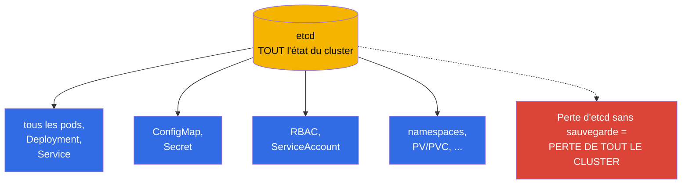
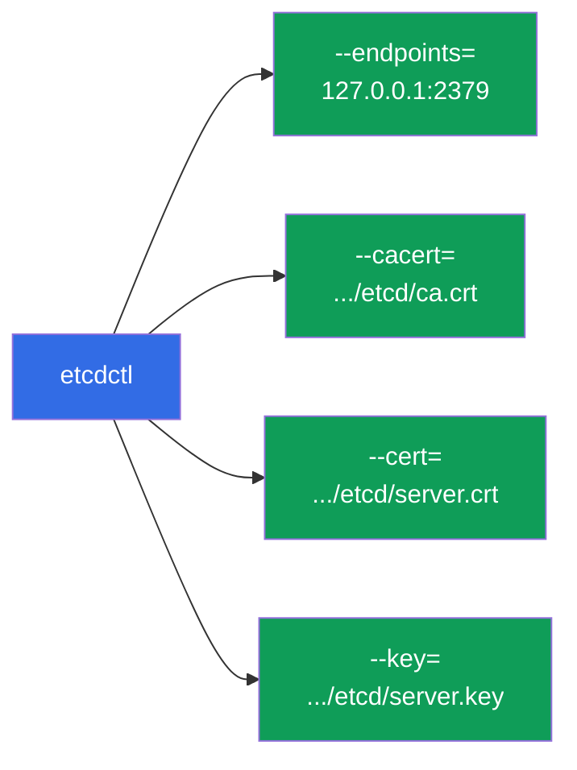
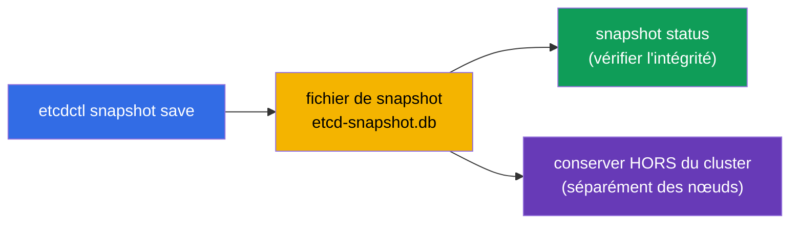
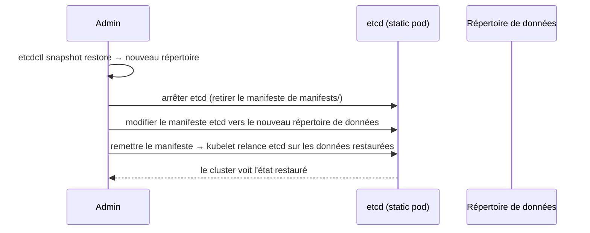
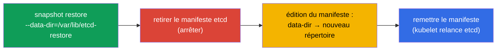

[Русская версия](ru.md) · [Eng version](README.md) · [Versión en español](es.md) · [Deutsche Version](de.md) · [ქართული ვერსია](ge.md)

# Chapitre 37. Sauvegarde et restauration d'etcd

> 🟦 **Chapitre pour le CKA** (domaine Cluster Architecture, Installation & Configuration).
>
> **Ce qui suit.** Le chapitre 2 nous l'a appris : etcd est le seul dépôt de tout l'état du
> cluster. Perdre etcd sans sauvegarde = perdre le cluster entier. La sauvegarde et la
> restauration d'etcd sont donc une compétence critique et un exercice quasi garanti au CKA. Nous
> verrons `etcdctl snapshot save/restore`, où trouver les certificats et comment ramener le cluster
> à la vie depuis un snapshot.

## 37.1. Pourquoi etcd, c'est tout le cluster

Reprenons l'idée clé du chapitre 2 : etcd contient **tout** - chaque Deployment, Service, Secret,
ConfigMap, ServiceAccount. L'API server n'est qu'une porte vers etcd ; les données sont dans etcd.



La conclusion est simple : **une sauvegarde régulière d'etcd est l'assurance contre la perte totale
du cluster**. Et c'est exactement ce que l'on vérifie au CKA.

## 37.2. Où vit etcd et où sont ses certificats

Dans un cluster kubeadm, etcd est un static pod (chapitre 15), et son accès est protégé par TLS. Pour
prendre un snapshot, il faut l'adresse et trois fichiers de certificats, tous dans le manifeste etcd :

```bash
# consulter les paramètres d'etcd (adresse, chemins des certificats)
sudo cat /etc/kubernetes/manifests/etcd.yaml | grep -E 'listen-client|cert|key|trusted'
```

Chemins typiques (kubeadm) :

| Quoi | Chemin |
|-----|------|
| endpoint client | `https://127.0.0.1:2379` |
| certificat CA | `/etc/kubernetes/pki/etcd/ca.crt` |
| certificat client | `/etc/kubernetes/pki/etcd/server.crt` |
| clé client | `/etc/kubernetes/pki/etcd/server.key` |
| données etcd | `/var/lib/etcd` |



## 37.3. Créer un snapshot : etcdctl snapshot save

Le snapshot se prend avec l'outil `etcdctl`, en précisant la version d'API v3 et les certificats :

```bash
ETCDCTL_API=3 etcdctl snapshot save /backup/etcd-snapshot.db \
  --endpoints=https://127.0.0.1:2379 \
  --cacert=/etc/kubernetes/pki/etcd/ca.crt \
  --cert=/etc/kubernetes/pki/etcd/server.crt \
  --key=/etc/kubernetes/pki/etcd/server.key
```

Vérifier le snapshot :

```bash
ETCDCTL_API=3 etcdctl snapshot status /backup/etcd-snapshot.db --write-out=table
```



> **Important.** `ETCDCTL_API=3` est obligatoire - sans lui, etcdctl peut utiliser l'ancienne API.
> Le snapshot se conserve **hors** du cluster (pas sur le même nœud), sinon la perte du nœud emporte la sauvegarde.

## 37.4. Restauration : etcdctl snapshot restore

La restauration déploie le snapshot dans un **nouveau répertoire de données**, après quoi etcd est
reconfiguré pour l'utiliser. L'idée générale :



Pas à pas :

```bash
# 1. Déployer le snapshot dans un nouveau répertoire
ETCDCTL_API=3 etcdctl snapshot restore /backup/etcd-snapshot.db \
  --data-dir=/var/lib/etcd-restore

# 2. Arrêter etcd : retirer temporairement le manifeste
sudo mv /etc/kubernetes/manifests/etcd.yaml /tmp/

# 3. Dans le manifeste etcd, changer le hostPath du répertoire de données vers /var/lib/etcd-restore
sudo vim /tmp/etcd.yaml     # volumes: hostPath.path → /var/lib/etcd-restore

# 4. Remettre le manifeste — kubelet relance etcd sur les données restaurées
sudo mv /tmp/etcd.yaml /etc/kubernetes/manifests/
```



Une fois etcd relancé sur le répertoire restauré, le cluster revient à l'état du moment du
snapshot. Un redémarrage de l'apiserver peut être nécessaire (retirez/remettez son manifeste ou
patientez).

## 37.5. Réserves importantes sur la restauration

- **La restauration ramène l'état du moment du snapshot.** Tout ce qui a été créé après le
  snapshot sera perdu. D'où l'importance de sauvegardes fréquentes.
- **Arrêter les consommateurs.** Pendant le restore, etcd doit être arrêté ; ensuite, ses clients
  (apiserver) doivent se reconnecter aux données restaurées.
- **En cluster HA, c'est plus complexe.** Avec plusieurs nœuds etcd, la restauration touche tout le
  quorum - la procédure est plus délicate (restaurer un nœud et réinitialiser les autres). Au CKA,
  il n'y a généralement qu'un seul nœud etcd.
- **Vérifiez `--data-dir`.** Le restore ne doit pas écrire dans le répertoire de travail courant
  d'etcd - on déploie dans un nouveau et on bascule le manifeste dessus.

## 37.6. Automatisation et planification

Une sauvegarde ponctuelle est inutile - il en faut une régulière. Comme nous l'avons vu
(chapitre 10), les tâches périodiques se déclarent comme un **CronJob** :


En prod, les snapshots sont pris selon une planification et déposés dans un stockage externe
(stockage objet, serveur dédié), en gardant plusieurs générations. Une sauvegarde posée sur le même
nœud qu'etcd ne sauvera rien si le nœud est perdu.

## 37.7. Comment cela s'applique en production

- **La sauvegarde automatique régulière est obligatoire.** En prod, etcd est snapshoté selon une
  planification (souvent toutes les heures, voire plus souvent) et les snapshots sont exportés hors
  du cluster. C'est l'assurance principale contre une perte catastrophique de l'état.
- **Vérifier la restaurabilité.** Une sauvegarde sans restauration testée est une illusion de
  protection. Les équipes mûres répètent périodiquement le restore sur un cluster de test, pour que
  la procédure fonctionne le jour d'un vrai incident.
- **Surveillance de la santé d'etcd.** etcd est sensible à la latence disque ; on le surveille
  (latency, taille de la base, quorum). Un disque lent sous etcd dégrade tout le cluster.
- **Les clusters managés se sauvegardent eux-mêmes.** Sur EKS/GKE/AKS, etcd et sa sauvegarde sont
  du domaine du fournisseur, et etcdctl n'y est pas accessible. La sauvegarde manuelle d'etcd
  concerne le self-managed/on-prem (et le CKA).
- **Snapshot avant les opérations risquées.** Avant une mise à jour du control plane (chapitre 36)
  ou de gros changements, on prend un snapshot - pour pouvoir revenir en arrière en cas d'échec.

## 37.8. Mini-glossaire

- **etcd** - le dépôt de tout l'état du cluster (chapitre 2).
- **etcdctl** - la CLI pour travailler avec etcd ; pour les snapshots il faut `ETCDCTL_API=3`.
- **snapshot save** - création d'une copie de sauvegarde d'etcd dans un fichier.
- **snapshot restore** - déploiement d'un snapshot dans un nouveau répertoire de données.
- **--data-dir** - le répertoire de données d'etcd (lors du restore - un nouveau).
- **endpoint 2379** - le port client d'etcd.
- **certificats etcd** - CA/cert/key dans `/etc/kubernetes/pki/etcd/`.
- **quorum** - la majorité des nœuds etcd, nécessaire au fonctionnement (HA).

## 37.9. Bilan du chapitre

- etcd conserve tout l'état du cluster ; le perdre sans sauvegarde = perdre le cluster. La
  sauvegarde d'etcd est une compétence critique et un exercice fréquent du CKA.
- Sous kubeadm, etcd est un static pod ; pour le snapshot il faut l'endpoint (2379) et trois
  certificats depuis `/etc/kubernetes/pki/etcd/`.
- Snapshot : `ETCDCTL_API=3 etcdctl snapshot save` avec les certificats ; vérification -
  `snapshot status` ; conservation hors du cluster.
- Restauration : `snapshot restore --data-dir=<nouveau>` → arrêter etcd (retirer le manifeste) →
  basculer le manifeste vers le nouveau répertoire → remettre le manifeste.
- Le restore ramène l'état du moment du snapshot ; tout ce qui suit est perdu - d'où des
  sauvegardes fréquentes.
- En prod, la sauvegarde est automatisée (CronJob + stockage externe), la restaurabilité est
  vérifiée et un snapshot est pris avant les opérations risquées.

## 37.10. À quoi cela sert : à l'examen et dans le travail réel

**À l'examen (CKA).** « Prends un snapshot d'etcd » et « restaure etcd depuis un snapshot » sont
des exercices quasi garantis. Il faut connaître par cœur la commande `etcdctl snapshot save/restore`
avec les flags de certificats (leurs chemins se trouvent dans le manifeste d'etcd) et la procédure
de bascule du répertoire de données. Oublier `ETCDCTL_API=3` est une erreur courante.

**Dans le travail réel.** La sauvegarde d'etcd est la dernière ligne de défense du cluster. Des
auto-snapshots réguliers vers un stockage externe, une procédure de restauration éprouvée et un
snapshot avant les mises à jour - voilà ce qui distingue un incident surmontable de la perte de
tout le cluster dans les environnements self-managed.

## 37.11. Questions d'auto-évaluation

1. Pourquoi la perte d'etcd signifie-t-elle la perte de tout le cluster ?
2. Quels paramètres et fichiers faut-il pour prendre un snapshot d'etcd, et où les trouver ?
3. Écrivez la commande de création d'un snapshot. À quoi sert `ETCDCTL_API=3` ?
4. Décrivez les étapes de restauration depuis un snapshot. Où le restore se déploie-t-il ?
5. Que perd-on lors d'une restauration et pourquoi les sauvegardes fréquentes sont-elles importantes ?
6. Où faut-il conserver les snapshots et pourquoi pas sur le même nœud ?
7. Comment automatise-t-on la sauvegarde d'etcd en prod et pourquoi vérifier la restauration ?

## Pratique

Nous avons acquis l'assurance du cluster. Au chapitre 38, nous passerons à la sécurité des accès -
RBAC (Role, ClusterRole, bindings), en approfondissant l'aperçu du chapitre 21. La sauvegarde et la
restauration d'etcd se travaillent dans les TP d'administration.

🧪 TP 112 (sauvegarde et restauration d'etcd) : [tasks/cka/labs/112](../../labs/112/README_FR.MD)

---
[Sommaire](../README_FR.md) · [Chapitre 36](../36/fr.md) · [Chapitre 38](../38/fr.md)
