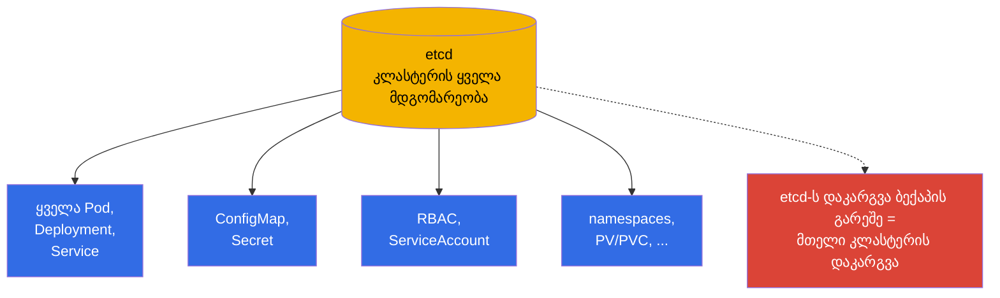
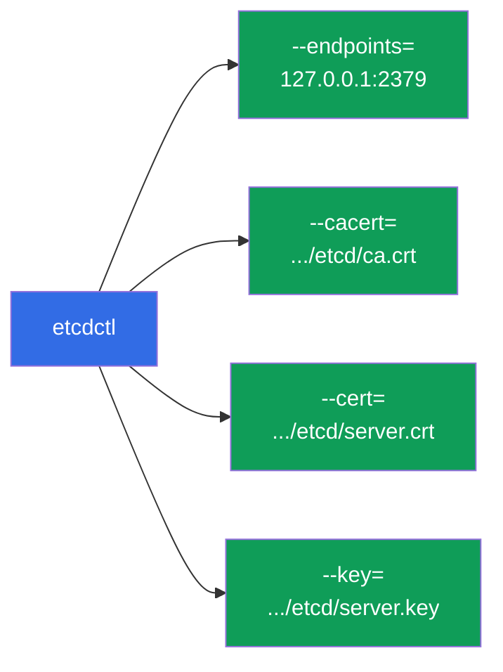
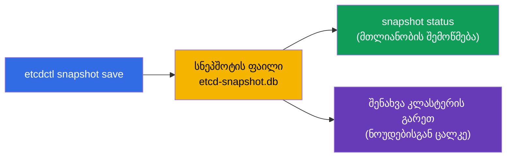
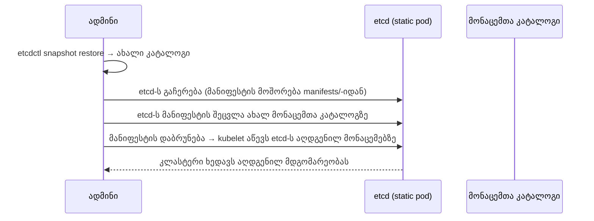
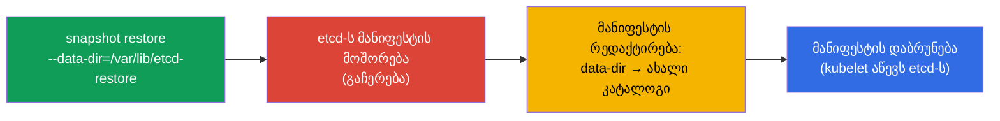

[Русская версия](ru.md) · [Eng version](README.md) · [Versión en español](es.md) · [Version française](fr.md) · [Deutsche Version](de.md)

# თავი 37. etcd-ს რეზერვული კოპირება და აღდგენა

> 🟦 **თავი CKA-სთვის** (დომენი Cluster Architecture, Installation & Configuration).
>
> **რა იქნება შემდეგ.** თავი 2-იდან ვიცით: etcd - კლასტერის მთელი მდგომარეობის ერთადერთი
> საცავია. etcd-ს დაკარგვა ბექაპის გარეშე = მთელი კლასტერის დაკარგვა. ამიტომ etcd-ს რეზერვული
> კოპირება და აღდგენა - კრიტიკული უნარი და თითქმის გარანტირებული დავალებაა CKA-ზე. გავარჩევთ
> `etcdctl snapshot save/restore`-ს, საიდან ვიღებთ სერტიფიკატებს და როგორ დავაბრუნოთ კლასტერი
> სიცოცხლეში სნეპშოტიდან.

## 37.1. რატომ არის etcd მთელი კლასტერი

გავიმეოროთ თავი 2-ის საკვანძო აზრი: etcd-ში წევს **ყველაფერი** - ყოველი Deployment, Service, Secret,
ConfigMap, ServiceAccount. API-სერვერი - მხოლოდ კარია etcd-სკენ; თავად მონაცემები etcd-შია.



დასკვნა მარტივია: **etcd-ს რეგულარული ბექაპი - კლასტერის სრული დაკარგვისგან დაზღვევაა**. და სწორედ
ეს არის, რასაც CKA-ზე ამოწმებენ.

## 37.2. სად ცხოვრობს etcd და მისი სერტიფიკატები

kubeadm-კლასტერში etcd - static pod-ია (თავი 15), ხოლო მასთან წვდომა დაცულია TLS-ით. სნეპშოტის
ასაღებად საჭიროა მისამართი და სამი სერტიფიკატის ფაილი. ყველა მათგანი ჩაწერილია etcd-ს მანიფესტში:

```bash
# etcd-ს პარამეტრების ნახვა (მისამართი, სერტიფიკატების გზები)
sudo cat /etc/kubernetes/manifests/etcd.yaml | grep -E 'listen-client|cert|key|trusted'
```

ტიპური გზები (kubeadm):

| რა | გზა |
|-----|------|
| კლიენტის endpoint | `https://127.0.0.1:2379` |
| CA-სერტიფიკატი | `/etc/kubernetes/pki/etcd/ca.crt` |
| კლიენტის სერტიფიკატი | `/etc/kubernetes/pki/etcd/server.crt` |
| კლიენტის გასაღები | `/etc/kubernetes/pki/etcd/server.key` |
| etcd-ს მონაცემები | `/var/lib/etcd` |



## 37.3. სნეპშოტის შექმნა: etcdctl snapshot save

სნეპშოტს იღებენ `etcdctl` უტილიტით, API-ს ვერსია v3-ისა და სერტიფიკატების მითითებით:

```bash
ETCDCTL_API=3 etcdctl snapshot save /backup/etcd-snapshot.db \
  --endpoints=https://127.0.0.1:2379 \
  --cacert=/etc/kubernetes/pki/etcd/ca.crt \
  --cert=/etc/kubernetes/pki/etcd/server.crt \
  --key=/etc/kubernetes/pki/etcd/server.key
```

სნეპშოტის შემოწმება:

```bash
ETCDCTL_API=3 etcdctl snapshot status /backup/etcd-snapshot.db --write-out=table
```



> **მნიშვნელოვანია.** `ETCDCTL_API=3` სავალდებულოა - მის გარეშე etcdctl-ს შეუძლია ძველი API გამოიყენოს.
> სნეპშოტს ინახავენ კლასტერის **გარეთ** (არა იმავე ნოუდზე), თორემ ნოუდის დაკარგვა ბექაპსაც წაიღებს.

## 37.4. აღდგენა: etcdctl snapshot restore

აღდგენა სნეპშოტს ხსნის **ახალ მონაცემთა კატალოგში**, რის შემდეგ etcd-ს მასზე გადაანაწილებენ.
ზოგადი იდეა:



ნაბიჯ-ნაბიჯ:

```bash
# 1. სნეპშოტის გახსნა ახალ კატალოგში
ETCDCTL_API=3 etcdctl snapshot restore /backup/etcd-snapshot.db \
  --data-dir=/var/lib/etcd-restore

# 2. etcd-ს გაჩერება: დროებით მოაშორე მანიფესტი
sudo mv /etc/kubernetes/manifests/etcd.yaml /tmp/

# 3. etcd-ს მანიფესტში შეცვალე მონაცემთა კატალოგის hostPath /var/lib/etcd-restore-ზე
sudo vim /tmp/etcd.yaml     # volumes: hostPath.path → /var/lib/etcd-restore

# 4. დააბრუნე მანიფესტი — kubelet აწევს etcd-ს აღდგენილ მონაცემებზე
sudo mv /tmp/etcd.yaml /etc/kubernetes/manifests/
```



მას შემდეგ, რაც etcd აღდგენილ კატალოგზე ავარდება, კლასტერი დაუბრუნდება სნეპშოტის მომენტის
მდგომარეობას. შეიძლება საჭირო გახდეს apiserver-ის გადატვირთვა (მოაშორეთ/დააბრუნეთ მისი მანიფესტი
ან დაელოდეთ).

## 37.5. აღდგენის მნიშვნელოვანი დათქმები

- **აღდგენა აბრუნებს მდგომარეობას სნეპშოტის მომენტისთვის.** ყველაფერი, რაც სნეპშოტის შემდეგ შეიქმნა,
  დაიკარგება. აქედან გამომდინარეობს ხშირი ბექაპების მნიშვნელობა.
- **მომხმარებლების გაჩერება.** restore-ის დროს etcd უნდა იყოს გაჩერებული; შემდეგ - მისმა
  კლიენტებმა (apiserver) უნდა ხელახლა დაუკავშირდნენ აღდგენილ მონაცემებს.
- **HA-კლასტერში უფრო რთულია.** etcd-ს რამდენიმე კვანძის დროს აღდგენა ეხება მთელ
  კვორუმს - პროცედურა უფრო დელიკატურია (ერთი კვანძის აღდგენა და დანარჩენების ხელახალი
  ინიციალიზაცია). CKA-ზე ჩვეულებრივ etcd-ს ერთი კვანძია.
- **შეამოწმეთ `--data-dir`.** restore არ უნდა წეროს etcd-ს მიმდინარე სამუშაო კატალოგში -
  ხსნიან ახალში და მანიფესტს მასზე გადაანაწილებენ.

## 37.6. ავტომატიზაცია და განრიგი

ერთჯერადი ბექაპი უსარგებლოა - საჭიროა რეგულარული. როგორც გავარჩიეთ (თავი 10), პერიოდულ
ამოცანებს **CronJob**-ის სახით აფორმებენ:


პროდში სნეპშოტებს იღებენ განრიგით და გარე საცავში ალაგებენ (ობიექტური საცავი, ცალკე სერვერი),
ინახავენ რამდენიმე თაობას. ბექაპი, რომელიც იმავე ნოუდზე წევს, სადაც etcd-ია, ნოუდის დაკარგვის
დროს არ იშველიებს.

## 37.7. როგორ იყენებენ ამას პროდაქშენში

- **რეგულარული ავტობექაპი - სავალდებულოა.** პროდში etcd-ს სნეპშოტავენ განრიგით (ხშირად -
  ყოველსაათურად და უფრო ხშირად) და სნეპშოტებს კლასტერის ფარგლებს გარეთ გადააქვთ. ეს არის
  მდგომარეობის კატასტროფული დაკარგვისგან ძირითადი დაზღვევა.
- **აღდგენადობის შემოწმება.** ბექაპი შემოწმებული აღდგენის გარეშე - დაცვის ილუზიაა.
  მოწიფული გუნდები პერიოდულად ავარჯიშებენ restore-ს სატესტო კლასტერზე, რომ პროცედურა
  რეალურ ინციდენტში იმუშაოს.
- **etcd-ს ჯანმრთელობის მონიტორინგი.** etcd მგრძნობიარეა დისკის ლატენტობის მიმართ; მას თვალს
  ადევნებენ (latency, ბაზის ზომა, კვორუმი). etcd-ს ქვეშ ნელი დისკი მთელ კლასტერს დეგრადირებს.
- **მართული კლასტერები თავად ბექაპავს.** EKS/GKE/AKS-ში etcd და მისი ბექაპი - პროვაიდერის
  ზონაა, etcdctl-თან წვდომა იქ არ არის. etcd-ს ხელით ბექაპი აქტუალურია self-managed/
  on-prem-ისთვის (და CKA-სთვის).
- **სნეპშოტი სარისკო ოპერაციებამდე.** control plane-ის განახლებამდე (თავი 36) ან მსხვილ
  ცვლილებებამდე იღებენ სნეპშოტს - რომ წარუმატებლობის შემთხვევაში უკან დაბრუნდნენ.

## 37.8. მინი-ლექსიკონი

- **etcd** - კლასტერის მთელი მდგომარეობის საცავი (თავი 2).
- **etcdctl** - CLI etcd-სთან სამუშაოდ; სნეპშოტებისთვის საჭიროა `ETCDCTL_API=3`.
- **snapshot save** - etcd-ს რეზერვული კოპიის შექმნა ფაილში.
- **snapshot restore** - სნეპშოტის გახსნა ახალ მონაცემთა კატალოგში.
- **--data-dir** - etcd-ს მონაცემთა კატალოგი (restore-ის დროს - ახალი).
- **endpoint 2379** - etcd-ს კლიენტის პორტი.
- **etcd-ს სერტიფიკატები** - CA/cert/key `/etc/kubernetes/pki/etcd/`-ში.
- **კვორუმი** - etcd-ს კვანძების უმრავლესობა, საჭირო მუშაობისთვის (HA).

## 37.9. თავის შეჯამება

- etcd ინახავს კლასტერის მთელ მდგომარეობას; მისი დაკარგვა ბექაპის გარეშე = კლასტერის დაკარგვა.
  etcd-ს ბექაპი - კრიტიკული უნარი და CKA-ს ხშირი დავალებაა.
- kubeadm-ში etcd - static pod-ია; სნეპშოტისთვის საჭიროა endpoint (2379) და სამი სერტიფიკატი
  `/etc/kubernetes/pki/etcd/`-იდან.
- სნეპშოტი: `ETCDCTL_API=3 etcdctl snapshot save` სერტიფიკატებით; შემოწმება -
  `snapshot status`; შენახვა კლასტერის გარეთ.
- აღდგენა: `snapshot restore --data-dir=<ახალი>` → etcd-ს გაჩერება (მანიფესტის
  მოშორება) → მანიფესტის გადანაწილება ახალ კატალოგზე → მანიფესტის დაბრუნება.
- restore აბრუნებს მდგომარეობას სნეპშოტის მომენტისთვის; ყველაფერი უფრო გვიანი იკარგება - აქედან ხშირი
  ბექაპები.
- პროდში ბექაპს ავტომატიზირებენ (CronJob + გარე საცავი), ამოწმებენ აღდგენადობას და
  იღებენ სნეპშოტს სარისკო ოპერაციებამდე.

## 37.10. როგორ გამოგადგებათ: გამოცდაზე და რეალურ სამუშაოში

**გამოცდაზე (CKA).** „გააკეთე etcd-ს სნეპშოტი“ და „აღადგინე etcd სნეპშოტიდან“ - თითქმის
გარანტირებული დავალებებია. საჭიროა ზეპირად ვიცოდეთ ბრძანება `etcdctl snapshot save/restore`
სერტიფიკატების ფლაგებით (მათ გზებს etcd-ს მანიფესტში ეძებენ) და მონაცემთა კატალოგის
გადანაწილების პროცედურა. `ETCDCTL_API=3`-ის დავიწყება - ხშირი შეცდომაა.

**რეალურ სამუშაოში.** etcd-ს ბექაპი - კლასტერის თავდაცვის ბოლო ხაზია. რეგულარული
ავტოსნეპშოტები გარე საცავში, შემოწმებული აღდგენის პროცედურა და სნეპშოტი აპგრეიდებამდე -
ეს არის ის, რაც გადასატან ინციდენტს მთელი კლასტერის დაკარგვისგან განასხვავებს
self-managed გარემოებში.

## 37.11. თვითშემოწმების კითხვები

1. რატომ ნიშნავს etcd-ს დაკარგვა მთელი კლასტერის დაკარგვას?
2. რომელი პარამეტრები და ფაილები არის საჭირო etcd-ს სნეპშოტის ასაღებად და საიდან ვიღებთ მათ?
3. დაწერეთ სნეპშოტის შექმნის ბრძანება. რისთვის არის `ETCDCTL_API=3`?
4. აღწერეთ სნეპშოტიდან აღდგენის ნაბიჯები. სად იხსნება restore?
5. რა იკარგება აღდგენის დროს და რატომ არის მნიშვნელოვანი ხშირი ბექაპები?
6. სად უნდა შევინახოთ სნეპშოტები და რატომ არა იმავე ნოუდზე?
7. როგორ ავტომატიზირებენ etcd-ს ბექაპს პროდში და რისთვის უნდა შევამოწმოთ აღდგენა?

## პრაქტიკა

ჩვენ ვისწავლეთ კლასტერის დაზღვევა. თავ 38-ში გადავალთ წვდომის უსაფრთხოებაზე - RBAC (Role,
ClusterRole, binding-ები), გავიღრმავებთ თავი 21-ის მიმოხილვას. etcd-ს ბექაპი და აღდგენა
მუშავდება ადმინისტრირების ლაბორატორიულ სამუშაოებში.

🧪 ლაბი 112 (etcd-ს ბექაპი და აღდგენა): [tasks/cka/labs/112](../../labs/112/README_GE.MD)

---
[სარჩევი](../README_GE.md) · [თავი 36](../36/ge.md) · [თავი 38](../38/ge.md)
