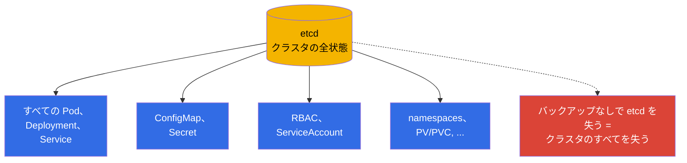
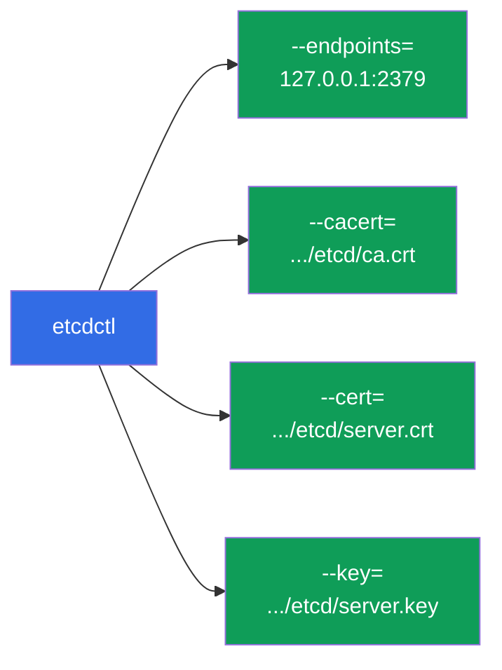
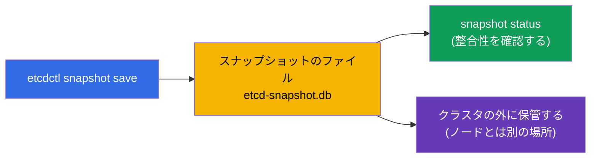
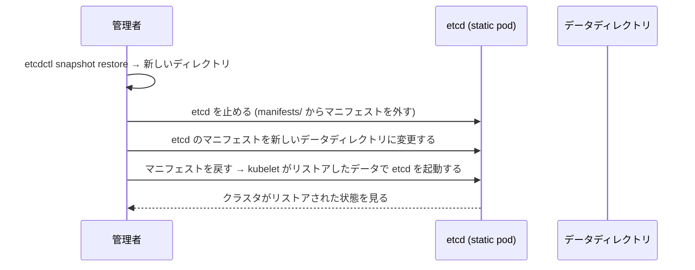
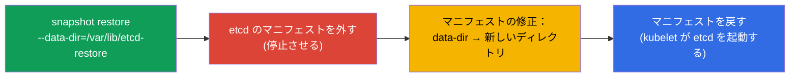

[Русская версия](ru.md) · [Eng version](README.md) · [Versión en español](es.md) · [Version française](fr.md) · [Deutsche Version](de.md) · [ქართული ვერსია](ge.md) · [繁體中文版](tw.md)

# 第 37 章。etcd のバックアップとリストア

> 🟦 **CKA 向けの章**（Cluster Architecture, Installation & Configuration 領域）。
>
> **次は何か。** 第 2 章で見たとおり、etcd はクラスタの全状態を持つ唯一のストレージです。
> バックアップなしで etcd を失うことは、クラスタを丸ごと失うことと同じです。だからこそ
> etcd のバックアップとリストアは重要なスキルであり、CKA でほぼ確実に出題されます。
> `etcdctl snapshot save/restore`、証明書をどこから取るか、そしてスナップショットから
> どうやってクラスタを生き返らせるかを見ていきます。

## 37.1. なぜ etcd がクラスタそのものなのか

第 2 章の要点をもう一度：etcd には **すべて** が入っています - すべての Deployment、
Service、Secret、ConfigMap、ServiceAccount。API サーバーは etcd への扉にすぎず、
データそのものは etcd の中にあります。



結論は単純です：**定期的な etcd のバックアップは、クラスタ全損に対する保険です**。そして
それこそが CKA で確認される点です。

## 37.2. etcd はどこにいて、証明書はどこにあるか

kubeadm クラスタでは etcd は static pod（第 15 章）で、アクセスは TLS で保護されています。
スナップショットを取るには、アドレスと 3 つの証明書ファイルが必要です。いずれも etcd の
マニフェストに書かれています：

```bash
# etcd のパラメータを見る（アドレス、証明書のパス）
sudo cat /etc/kubernetes/manifests/etcd.yaml | grep -E 'listen-client|cert|key|trusted'
```

典型的なパス（kubeadm）：

| 何か | パス |
|-----|------|
| クライアントの endpoint | `https://127.0.0.1:2379` |
| CA 証明書 | `/etc/kubernetes/pki/etcd/ca.crt` |
| クライアント証明書 | `/etc/kubernetes/pki/etcd/server.crt` |
| クライアント鍵 | `/etc/kubernetes/pki/etcd/server.key` |
| etcd のデータ | `/var/lib/etcd` |



## 37.3. スナップショットの作成：etcdctl snapshot save

スナップショットは `etcdctl` ユーティリティで、API バージョン v3 と証明書を指定して取ります：

```bash
ETCDCTL_API=3 etcdctl snapshot save /backup/etcd-snapshot.db \
  --endpoints=https://127.0.0.1:2379 \
  --cacert=/etc/kubernetes/pki/etcd/ca.crt \
  --cert=/etc/kubernetes/pki/etcd/server.crt \
  --key=/etc/kubernetes/pki/etcd/server.key
```

スナップショットを確認する：

```bash
ETCDCTL_API=3 etcdctl snapshot status /backup/etcd-snapshot.db --write-out=table
```



> **重要。** `ETCDCTL_API=3` は必須です - これがないと etcdctl が古い API を使うことが
> あります。スナップショットはクラスタの **外** に（同じノード上ではなく）保管します。
> さもないとノードの喪失がバックアップまで持っていってしまいます。

## 37.4. リストア：etcdctl snapshot restore

リストアはスナップショットを **新しいデータディレクトリ** に展開し、そのあとで etcd を
そのディレクトリに向け直します。全体の流れ：



手順を追って：

```bash
# 1. スナップショットを新しいディレクトリに展開する
ETCDCTL_API=3 etcdctl snapshot restore /backup/etcd-snapshot.db \
  --data-dir=/var/lib/etcd-restore

# 2. etcd を止める：一時的にマニフェストを外す
sudo mv /etc/kubernetes/manifests/etcd.yaml /tmp/

# 3. etcd のマニフェストでデータディレクトリの hostPath を /var/lib/etcd-restore に変える
sudo vim /tmp/etcd.yaml     # volumes: hostPath.path → /var/lib/etcd-restore

# 4. マニフェストを戻す - kubelet がリストアしたデータで etcd を起動する
sudo mv /tmp/etcd.yaml /etc/kubernetes/manifests/
```



etcd がリストアしたディレクトリで起動したあと、クラスタはスナップショット時点の状態に
戻ります。apiserver の再起動が必要になることもあります（そのマニフェストを外して戻す、
または待つ）。

## 37.5. リストアの重要な注意点

- **リストアはスナップショット時点の状態に戻します。** スナップショットのあとに作られた
  ものはすべて失われます。だからこそ頻繁なバックアップが大切です。
- **利用者を止めること。** restore の間 etcd は停止している必要があり、そのあとで
  クライアント（apiserver）がリストアされたデータに再接続しなければなりません。
- **HA クラスタではより複雑です。** etcd のノードが複数ある場合、リストアはクォーラム全体に
  影響します - 手順はもっと繊細です（1 ノードをリストアし、残りを再初期化する）。CKA では
  通常 etcd は 1 ノードです。
- **`--data-dir` を確認すること。** restore は etcd の現在の作業ディレクトリに書いては
  いけません - 新しいディレクトリに展開し、マニフェストをそちらに切り替えます。

## 37.6. 自動化とスケジュール

一度きりのバックアップは役に立ちません - 定期的なものが必要です。すでに見たとおり
（第 10 章）、定期的なタスクは **CronJob** として書きます：


本番ではスナップショットをスケジュールで取り、外部ストレージ（オブジェクトストレージ、
別のサーバー）に置き、複数世代を保持します。etcd と同じノードに置かれたバックアップは、
ノードを失ったときに助けになりません。

## 37.7. 本番環境でこれをどう使うか

- **定期的な自動バックアップは必須。** 本番では etcd のスナップショットをスケジュールで
  （多くの場合は 1 時間ごと、あるいはもっと頻繁に）取り、クラスタの外へ搬出します。これが
  状態の破滅的な喪失に対する主な保険です。
- **リストアできることの確認。** リストアを検証していないバックアップは、守られている
  という幻想です。成熟したチームはテストクラスタで定期的に restore を練習し、実際の
  インシデントで手順が動くようにしています。
- **etcd の健全性の監視。** etcd はディスクのレイテンシに敏感です。そのため監視します
  （latency、DB のサイズ、クォーラム）。etcd の下の遅いディスクはクラスタ全体を劣化させます。
- **マネージドクラスタは自分でバックアップします。** EKS/GKE/AKS では etcd とそのバックアップは
  プロバイダの領域で、etcdctl へのアクセスはありません。手動の etcd バックアップが意味を
  持つのは self-managed / on-prem（そして CKA）です。
- **危険な操作の前にスナップショット。** control plane のアップグレード（第 36 章）や
  大きな変更の前にはスナップショットを取ります - 失敗したときに戻せるようにするためです。

## 37.8. ミニ用語集

- **etcd** - クラスタの全状態のストレージ（第 2 章）。
- **etcdctl** - etcd を操作する CLI。スナップショットには `ETCDCTL_API=3` が必要です。
- **snapshot save** - etcd のバックアップをファイルに作成すること。
- **snapshot restore** - スナップショットを新しいデータディレクトリに展開すること。
- **--data-dir** - etcd のデータディレクトリ（restore では新しいもの）。
- **endpoint 2379** - etcd のクライアントポート。
- **etcd の証明書** - `/etc/kubernetes/pki/etcd/` にある CA/cert/key。
- **クォーラム** - 動作に必要な etcd ノードの過半数（HA）。

## 37.9. 本章のまとめ

- etcd はクラスタの全状態を保存します。バックアップなしでこれを失うことはクラスタの喪失です。
  etcd のバックアップは重要なスキルであり、CKA でよく出る課題です。
- kubeadm では etcd は static pod です。スナップショットには endpoint (2379) と
  `/etc/kubernetes/pki/etcd/` にある 3 つの証明書が必要です。
- スナップショット：証明書を付けた `ETCDCTL_API=3 etcdctl snapshot save`。確認は
  `snapshot status`。クラスタの外に保管します。
- リストア：`snapshot restore --data-dir=<新しいもの>` → etcd を止める（マニフェストを外す）
  → マニフェストを新しいディレクトリに切り替える → マニフェストを戻す。
- restore はスナップショット時点の状態に戻します。それより後のものはすべて失われます -
  だから頻繁なバックアップが必要です。
- 本番ではバックアップを自動化し（CronJob + 外部ストレージ）、リストアできることを確認し、
  危険な操作の前にスナップショットを取ります。

## 37.10. これがどう役に立つか：試験と実際の仕事で

**試験では (CKA)。**「etcd のスナップショットを取れ」と「スナップショットから etcd を
リストアせよ」はほぼ確実に出る課題です。証明書のフラグ付きの `etcdctl snapshot save/restore`
（フラグのパスは etcd のマニフェストで探します）と、データディレクトリを切り替える手順を
暗記しておく必要があります。`ETCDCTL_API=3` を忘れるのはよくあるミスです。

**実際の仕事では。** etcd のバックアップはクラスタ最後の防衛線です。外部ストレージへの
定期的な自動スナップショット、検証済みのリストア手順、アップグレード前のスナップショット -
これらが、self-managed 環境において「乗り越えられるインシデント」と「クラスタ全損」を
分けるものです。

## 37.11. 自己チェックの質問

1. なぜ etcd を失うことがクラスタ全体を失うことになるのですか？
2. etcd のスナップショットを取るにはどんなパラメータとファイルが必要で、それはどこから取りますか？
3. スナップショットを作成するコマンドを書いてください。なぜ `ETCDCTL_API=3` が必要ですか？
4. スナップショットからのリストアの手順を説明してください。restore はどこに展開されますか？
5. リストアで何が失われますか。そしてなぜ頻繁なバックアップが大切なのですか？
6. スナップショットはどこに保管すべきで、なぜ同じノード上ではいけないのですか？
7. 本番では etcd のバックアップをどう自動化し、なぜリストアを検証する必要があるのですか？

## 演習

クラスタの保険を身につけました。第 38 章ではアクセスのセキュリティ - RBAC（Role、
ClusterRole、binding 類）に進み、第 21 章の概観を深めます。etcd のバックアップとリストアは
運用管理のラボで練習します。

🧪 ラボ 112（etcd のバックアップとリストア）：[tasks/cka/labs/112](../../labs/112/README_JP.MD)

🎮 Killercoda（ブラウザ内、セットアップ不要）：[Backup and Restore Kubernetes etcd](https://killercoda.com/chadmcrowell/scenario/kubernetes-backup-etcd)

---
[目次](../README_JP.md) · [第 36 章](../36/jp.md) · [第 38 章](../38/jp.md)
