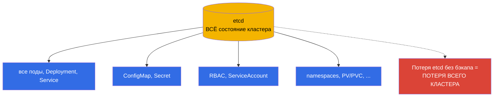
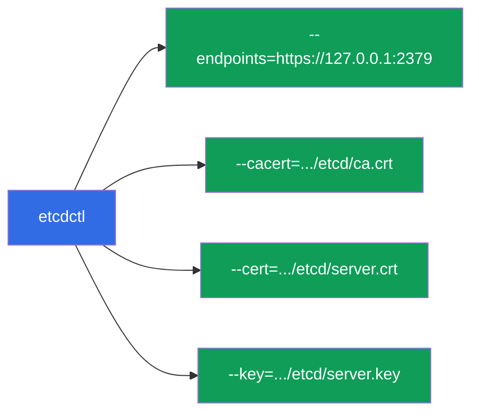
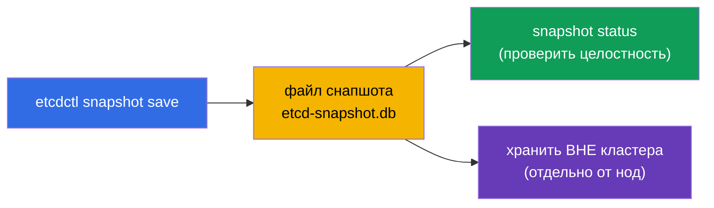
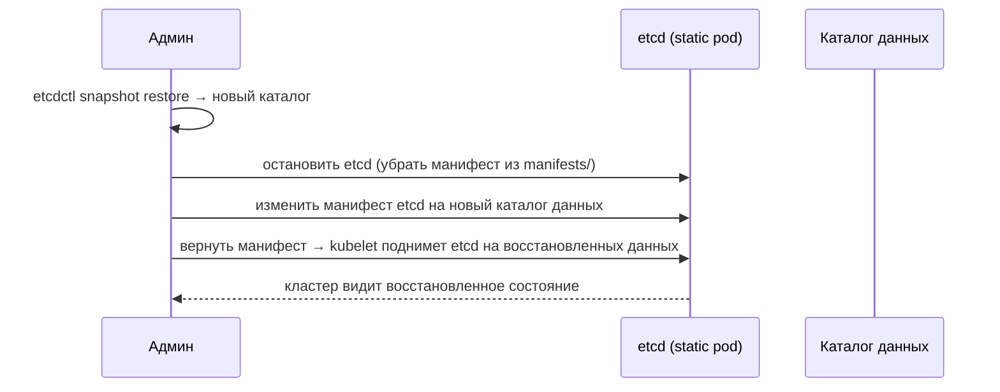
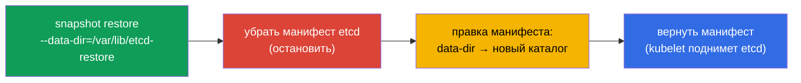

# Глава 37. Резервное копирование и восстановление etcd

> 🟦 **Глава для CKA** (домен Cluster Architecture, Installation & Configuration).
>
> **Что дальше.** Из главы 2 мы знаем: etcd - единственное хранилище всего состояния
> кластера. Потеря etcd без бэкапа = потеря кластера целиком. Поэтому резервное копирование
> и восстановление etcd - критичный навык и почти гарантированное задание на CKA. Разберём
> `etcdctl snapshot save/restore`, где брать сертификаты и как вернуть кластер к жизни из
> снапшота.

## 37.1. Почему etcd - это весь кластер

Повторим ключевую мысль главы 2: в etcd лежит **всё** - каждый Deployment, Service, Secret,
ConfigMap, ServiceAccount. API-сервер - лишь дверь к etcd; сами данные в etcd.



Вывод простой: **регулярный бэкап etcd - это страховка от полной потери кластера**. И это
именно то, что проверяют на CKA.

## 37.2. Где живёт etcd и его сертификаты

В kubeadm-кластере etcd - static pod (глава 15), а доступ к нему защищён TLS. Чтобы
снять снапшот, нужны адрес и три файла сертификатов. Все они прописаны в манифесте etcd:

```bash
# посмотреть параметры etcd (адрес, пути к сертификатам)
sudo cat /etc/kubernetes/manifests/etcd.yaml | grep -E 'listen-client|cert|key|trusted'
```

Типичные пути (kubeadm):

| Что | Путь |
|-----|------|
| endpoint клиента | `https://127.0.0.1:2379` |
| CA-сертификат | `/etc/kubernetes/pki/etcd/ca.crt` |
| клиентский сертификат | `/etc/kubernetes/pki/etcd/server.crt` |
| клиентский ключ | `/etc/kubernetes/pki/etcd/server.key` |
| данные etcd | `/var/lib/etcd` |



## 37.3. Создание снапшота: etcdctl snapshot save

Снапшот снимают утилитой `etcdctl` с указанием версии API v3 и сертификатов:

```bash
ETCDCTL_API=3 etcdctl snapshot save /backup/etcd-snapshot.db \
  --endpoints=https://127.0.0.1:2379 \
  --cacert=/etc/kubernetes/pki/etcd/ca.crt \
  --cert=/etc/kubernetes/pki/etcd/server.crt \
  --key=/etc/kubernetes/pki/etcd/server.key
```

Проверить снапшот:

```bash
ETCDCTL_API=3 etcdctl snapshot status /backup/etcd-snapshot.db --write-out=table
```



> **Важно.** `ETCDCTL_API=3` обязательно - без него etcdctl может использовать старый API.
> Снапшот хранят **вне** кластера (не на той же ноде), иначе потеря ноды унесёт и бэкап.

## 37.4. Восстановление: etcdctl snapshot restore

Восстановление разворачивает снапшот в **новый каталог данных**, после чего etcd
перенастраивают на него. Общая идея:



Пошагово:

```bash
# 1. Развернуть снапшот в новый каталог
ETCDCTL_API=3 etcdctl snapshot restore /backup/etcd-snapshot.db \
  --data-dir=/var/lib/etcd-restore

# 2. Остановить etcd: временно убрать манифест
sudo mv /etc/kubernetes/manifests/etcd.yaml /tmp/

# 3. В манифесте etcd поменять hostPath каталога данных на /var/lib/etcd-restore
sudo vim /tmp/etcd.yaml     # volumes: hostPath.path → /var/lib/etcd-restore

# 4. Вернуть манифест — kubelet поднимет etcd на восстановленных данных
sudo mv /tmp/etcd.yaml /etc/kubernetes/manifests/
```



После того как etcd поднимется на восстановленном каталоге, кластер вернётся к состоянию
на момент снапшота. Может потребоваться перезапуск apiserver (уберите/верните его манифест
или подождите).

## 37.5. Важные оговорки восстановления

- **Восстановление возвращает состояние на момент снапшота.** Всё, что создано после
  снапшота, будет потеряно. Отсюда важность частых бэкапов.
- **Остановить потребителей.** На время restore etcd должен быть остановлен; после - его
  клиенты (apiserver) должны переподключиться к восстановленным данным.
- **В HA-кластере сложнее.** При нескольких узлах etcd восстановление затрагивает весь
  кворум - процедура более тонкая (восстановить один узел и переинициализировать
  остальных). На CKA обычно один узел etcd.
- **Проверяйте `--data-dir`.** Restore не должен писать в текущий рабочий каталог etcd -
  разворачивают в новый и переключают манифест на него.

## 37.6. Автоматизация и расписание

Разовый бэкап бесполезен - нужен регулярный. Как мы разбирали (глава 10), периодические
задачи оформляют как **CronJob**:


В проде снапшоты снимают по расписанию и складывают во внешнее хранилище (объектное
хранилище, отдельный сервер), храня несколько поколений. Бэкап, лежащий на той же ноде,
что и etcd, не спасёт при потере ноды.

## 37.7. Как это применяют в продакшене

- **Регулярный автобэкап - обязателен.** В проде etcd снапшотят по расписанию (часто -
  ежечасно и чаще) и выгружают снапшоты за пределы кластера. Это основная страховка от
  катастрофической потери состояния.
- **Проверка восстановимости.** Бэкап без проверенного восстановления - иллюзия защиты.
  Зрелые команды периодически тренируют restore на тестовом кластере, чтобы процедура
  работала в реальный инцидент.
- **Мониторинг здоровья etcd.** etcd чувствителен к дисковой латентности; за ним следят
  (latency, размер БД, кворум). Медленный диск под etcd деградирует весь кластер.
- **Управляемые кластеры бэкапят сами.** В EKS/GKE/AKS etcd и его бэкап - зона
  провайдера, доступа к etcdctl там нет. Ручной бэкап etcd актуален для self-managed/
  on-prem (и для CKA).
- **Снапшот перед рискованными операциями.** Перед обновлением control plane (глава 36)
  или крупными изменениями снимают снапшот - чтобы откатиться при неудаче.

## 37.8. Мини-глоссарий

- **etcd** - хранилище всего состояния кластера (глава 2).
- **etcdctl** - CLI для работы с etcd; для снапшотов нужен `ETCDCTL_API=3`.
- **snapshot save** - создание резервной копии etcd в файл.
- **snapshot restore** - разворачивание снапшота в новый каталог данных.
- **--data-dir** - каталог данных etcd (при restore - новый).
- **endpoint 2379** - клиентский порт etcd.
- **сертификаты etcd** - CA/cert/key в `/etc/kubernetes/pki/etcd/`.
- **кворум** - большинство узлов etcd, нужное для работы (HA).

## 37.9. Итоги главы

- etcd хранит всё состояние кластера; его потеря без бэкапа = потеря кластера. Бэкап etcd -
  критичный навык и частое задание CKA.
- В kubeadm etcd - static pod; для снапшота нужны endpoint (2379) и три сертификата из
  `/etc/kubernetes/pki/etcd/`.
- Снапшот: `ETCDCTL_API=3 etcdctl snapshot save` с сертификатами; проверка -
  `snapshot status`; хранить вне кластера.
- Восстановление: `snapshot restore --data-dir=<новый>` → остановить etcd (убрать
  манифест) → переключить манифест на новый каталог → вернуть манифест.
- Restore возвращает состояние на момент снапшота; всё позднее теряется - отсюда частые
  бэкапы.
- В проде бэкап автоматизируют (CronJob + внешнее хранилище), проверяют восстановимость и
  снимают снапшот перед рискованными операциями.

## 37.10. Как это пригодится: на экзамене и в реальной работе

**На экзамене (CKA).** «Сделай снапшот etcd» и «восстанови etcd из снапшота» - почти
гарантированные задания. Нужно наизусть знать команду `etcdctl snapshot save/restore` с
флагами сертификатов (их пути ищут в манифесте etcd) и процедуру переключения каталога
данных. Забыть `ETCDCTL_API=3` - частая ошибка.

**В реальной работе.** Бэкап etcd - последняя линия обороны кластера. Регулярные
автоснапшоты во внешнее хранилище, проверенная процедура восстановления и снапшот перед
апгрейдами - то, что отделяет переживаемый инцидент от потери всего кластера в
self-managed окружениях.

## 37.11. Вопросы для самопроверки

1. Почему потеря etcd означает потерю всего кластера?
2. Какие параметры и файлы нужны, чтобы снять снапшот etcd, и где их взять?
3. Напишите команду создания снапшота. Зачем `ETCDCTL_API=3`?
4. Опишите шаги восстановления из снапшота. Куда разворачивается restore?
5. Что теряется при восстановлении и почему важны частые бэкапы?
6. Где нужно хранить снапшоты и почему не на той же ноде?
7. Как автоматизируют бэкап etcd в проде и зачем проверять восстановление?

## Практика

Мы освоили страховку кластера. В главе 38 перейдём к безопасности доступа - RBAC (Role,
ClusterRole, binding'и), углубляя обзор из главы 21. Бэкап и восстановление etcd
отрабатываются в лабах по администрированию.

🧪 Лаба 01: [tasks/cka/labs/01](../../labs/01/README_RU.MD)

---
[Оглавление](../README_RU.md) · [Глава 36](../36/ru.md) · [Глава 38](../38/ru.md)
