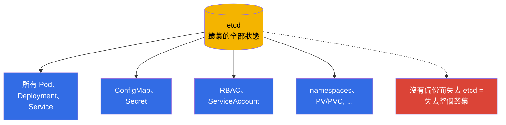
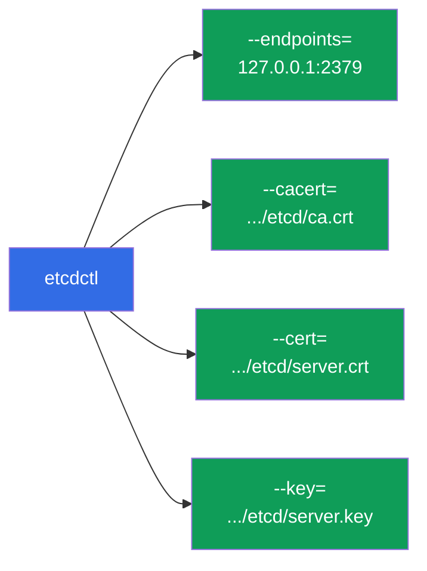
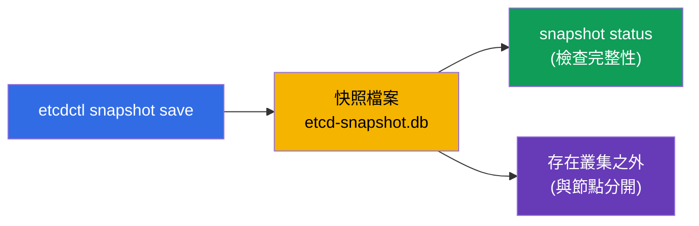
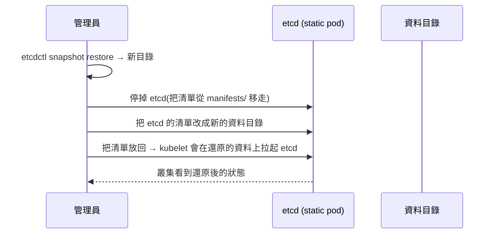
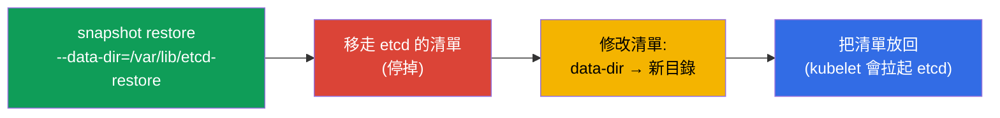

[Русская версия](ru.md) · [Eng version](README.md) · [Versión en español](es.md) · [Version française](fr.md) · [Deutsche Version](de.md) · [ქართული ვერსია](ge.md) · [日本語版](jp.md)

# 第 37 章。etcd 的備份與還原

> 🟦 **CKA 章節**(領域 Cluster Architecture, Installation & Configuration)。
>
> **接下來是什麼。** 從第 2 章我們知道:etcd 是叢集全部狀態的唯一儲存處。
> 沒有備份而失去 etcd = 整個叢集都沒了。因此 etcd 的備份與還原是關鍵技能,
> 也幾乎是 CKA 保證會出現的題目。我們會看 `etcdctl snapshot save/restore`、
> 憑證要去哪裡拿,以及怎麼從快照把叢集救回來。

## 37.1. 為什麼 etcd 就是整個叢集

重複一下第 2 章的關鍵想法:etcd 裡放著**所有東西** - 每一個 Deployment、Service、Secret、
ConfigMap、ServiceAccount。API 伺服器只是通往 etcd 的一道門;資料本身在 etcd 裡。



結論很簡單:**規律的 etcd 備份就是對叢集完全損失的保險**。而這正是 CKA 要考的東西。

## 37.2. etcd 與它的憑證住在哪裡

在 kubeadm 叢集裡 etcd 是 static pod(第 15 章),而存取它受 TLS 保護。要
取一份快照,需要位址和三個憑證檔。它們全都寫在 etcd 的清單裡:

```bash
# 查看 etcd 的參數(位址、憑證的路徑)
sudo cat /etc/kubernetes/manifests/etcd.yaml | grep -E 'listen-client|cert|key|trusted'
```

典型的路徑(kubeadm):

| 是什麼 | 路徑 |
|-----|------|
| 客戶端的 endpoint | `https://127.0.0.1:2379` |
| CA 憑證 | `/etc/kubernetes/pki/etcd/ca.crt` |
| 客戶端憑證 | `/etc/kubernetes/pki/etcd/server.crt` |
| 客戶端金鑰 | `/etc/kubernetes/pki/etcd/server.key` |
| etcd 的資料 | `/var/lib/etcd` |



## 37.3. 建立快照:etcdctl snapshot save

快照用 `etcdctl` 工具取得,並且要指定 API 版本 v3 與憑證:

```bash
ETCDCTL_API=3 etcdctl snapshot save /backup/etcd-snapshot.db \
  --endpoints=https://127.0.0.1:2379 \
  --cacert=/etc/kubernetes/pki/etcd/ca.crt \
  --cert=/etc/kubernetes/pki/etcd/server.crt \
  --key=/etc/kubernetes/pki/etcd/server.key
```

檢查快照:

```bash
ETCDCTL_API=3 etcdctl snapshot status /backup/etcd-snapshot.db --write-out=table
```



> **重要。** `ETCDCTL_API=3` 是必需的 - 少了它 etcdctl 可能會用舊的 API。
> 快照要存在叢集**之外**(不要放在同一個節點上),否則節點一沒了,備份也跟著沒了。

## 37.4. 還原:etcdctl snapshot restore

還原會把快照展開到一個**新的資料目錄**,之後再把 etcd 重新設定到那個目錄上。
大致的想法是:



一步一步來:

```bash
# 1. 把快照展開到新目錄
ETCDCTL_API=3 etcdctl snapshot restore /backup/etcd-snapshot.db \
  --data-dir=/var/lib/etcd-restore

# 2. 停掉 etcd:暫時把清單移走
sudo mv /etc/kubernetes/manifests/etcd.yaml /tmp/

# 3. 在 etcd 的清單裡把資料目錄的 hostPath 改成 /var/lib/etcd-restore
sudo vim /tmp/etcd.yaml     # volumes: hostPath.path → /var/lib/etcd-restore

# 4. 把清單放回 - kubelet 會在還原的資料上拉起 etcd
sudo mv /tmp/etcd.yaml /etc/kubernetes/manifests/
```



在 etcd 於還原後的目錄上啟動之後,叢集就會回到快照那一刻的狀態。可能需要重啟
apiserver(把它的清單移走再放回,或者等一下)。

## 37.5. 還原的重要注意事項

- **還原會回到快照那一刻的狀態。** 快照之後建立的所有東西都會遺失。
  由此可見頻繁備份的重要性。
- **停掉使用者。** 在 restore 期間 etcd 必須是停止的;之後它的客戶端
  (apiserver)必須重新連到還原後的資料。
- **在 HA 叢集裡更複雜。** 當有多個 etcd 節點時,還原會影響整個
  quorum - 程序更細膩(還原一個節點,再重新初始化其餘節點)。CKA 上通常
  只有一個 etcd 節點。
- **檢查 `--data-dir`。** Restore 不應該寫進 etcd 目前的工作目錄 -
  要展開到一個新目錄,再把清單切換過去。

## 37.6. 自動化與排程

一次性的備份沒有用 - 需要規律的備份。就像我們討論過的(第 10 章),週期性
任務會做成 **CronJob**:


在生產環境會按排程取快照,並放到外部儲存(物件儲存、另外一台伺服器),
保留好幾個世代。跟 etcd 放在同一個節點上的備份,在節點損失時救不了你。

## 37.7. 生產環境怎麼用

- **規律的自動備份是必須的。** 生產環境會按排程對 etcd 取快照(常常是
  每小時甚至更頻繁),並把快照送到叢集之外。這是對狀態災難性損失的主要保險。
- **檢查可還原性。** 沒有驗證過還原的備份只是防護的幻覺。
  成熟的團隊會定期在測試叢集上演練 restore,讓程序在真的出事時能運作。
- **監控 etcd 的健康。** etcd 對磁碟延遲很敏感;要盯著它
  (latency、資料庫大小、quorum)。etcd 底下的慢磁碟會拖垮整個叢集。
- **受管叢集自己會備份。** 在 EKS/GKE/AKS 裡 etcd 與它的備份屬於供應商的
  範圍,那裡也拿不到 etcdctl。手動備份 etcd 適用於 self-managed/
  on-prem(以及 CKA)。
- **在有風險的操作之前先取快照。** 在升級 control plane(第 36 章)
  或做大改動之前先取一份快照 - 好在失敗時回退。

## 37.8. 迷你詞彙表

- **etcd** - 叢集全部狀態的儲存處(第 2 章)。
- **etcdctl** - 操作 etcd 的 CLI;取快照需要 `ETCDCTL_API=3`。
- **snapshot save** - 把 etcd 的備份建立成檔案。
- **snapshot restore** - 把快照展開到新的資料目錄。
- **--data-dir** - etcd 的資料目錄(restore 時要用新的)。
- **endpoint 2379** - etcd 的客戶端埠。
- **etcd 的憑證** - `/etc/kubernetes/pki/etcd/` 裡的 CA/cert/key。
- **quorum** - etcd 節點的多數,運作所需(HA)。

## 37.9. 本章總結

- etcd 儲存叢集的全部狀態;沒有備份而失去它 = 失去叢集。etcd 備份是
  關鍵技能,也是 CKA 常見的題目。
- 在 kubeadm 裡 etcd 是 static pod;取快照需要 endpoint(2379)與
  `/etc/kubernetes/pki/etcd/` 裡的三個憑證。
- 快照:帶著憑證的 `ETCDCTL_API=3 etcdctl snapshot save`;檢查用
  `snapshot status`;存在叢集之外。
- 還原:`snapshot restore --data-dir=<新目錄>` → 停掉 etcd(移走
  清單) → 把清單切換到新目錄 → 把清單放回。
- Restore 會回到快照那一刻的狀態;之後的一切都會遺失 - 所以要頻繁
  備份。
- 生產環境會把備份自動化(CronJob + 外部儲存)、檢查可還原性,並在
  有風險的操作之前取快照。

## 37.10. 這些在哪裡用得上:考試與實際工作

**在考試中(CKA)。**「取一份 etcd 快照」與「從快照還原 etcd」幾乎是
保證出現的題目。要背下帶憑證旗標的 `etcdctl snapshot save/restore` 指令
(旗標的路徑在 etcd 的清單裡找)以及切換資料目錄的程序。忘記
`ETCDCTL_API=3` 是常見的錯誤。

**在實際工作中。** etcd 備份是叢集最後一道防線。規律的自動快照送到外部
儲存、驗證過的還原程序,以及升級前先取快照 - 這些正是在 self-managed
環境裡,把「撐得過去的事故」和「整個叢集全沒」區分開來的東西。

## 37.11. 自我檢查問題

1. 為什麼失去 etcd 就意味著失去整個叢集?
2. 要取一份 etcd 快照需要哪些參數和檔案,它們從哪裡拿?
3. 寫出建立快照的指令。`ETCDCTL_API=3` 是做什麼的?
4. 描述從快照還原的步驟。Restore 會展開到哪裡?
5. 還原時會遺失什麼,為什麼頻繁備份很重要?
6. 快照要存在哪裡,為什麼不要放在同一個節點上?
7. 生產環境怎麼把 etcd 備份自動化,為什麼要檢查還原?

## 實踐

我們掌握了叢集的保險。第 38 章會轉到存取的安全性 - RBAC(Role、
ClusterRole、binding),把第 21 章的概覽再深入一層。etcd 的備份與還原
會在管理主題的實驗裡練到。

🧪 實驗 112(etcd 的備份與還原):[tasks/cka/labs/112](../../labs/112/README_TW.MD)

🎮 Killercoda（在瀏覽器中，無需安裝）：[Backup and Restore Kubernetes etcd](https://killercoda.com/chadmcrowell/scenario/kubernetes-backup-etcd)

---
[目錄](../README_TW.md) · [第 36 章](../36/tw.md) · [第 38 章](../38/tw.md)
