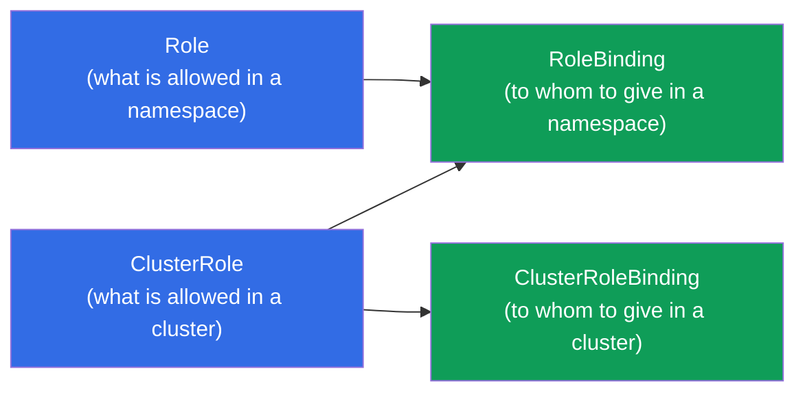
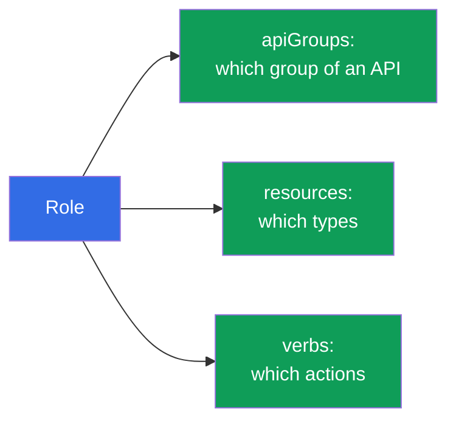
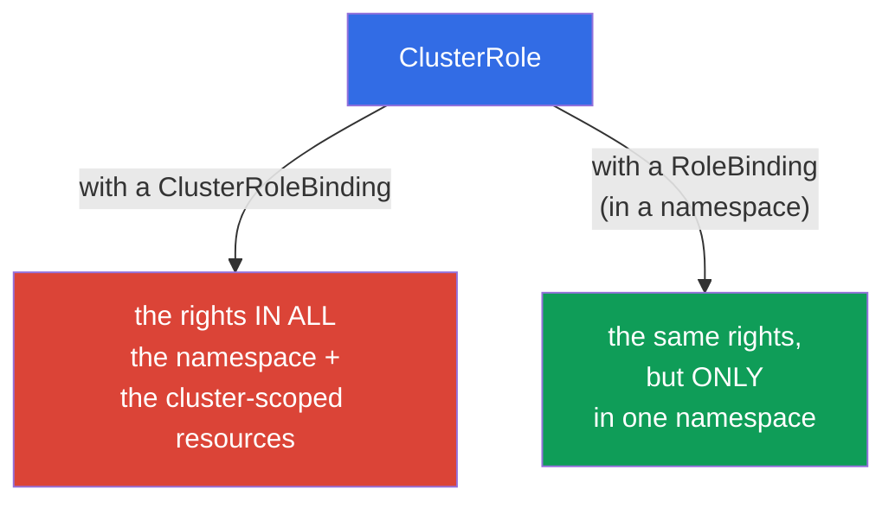
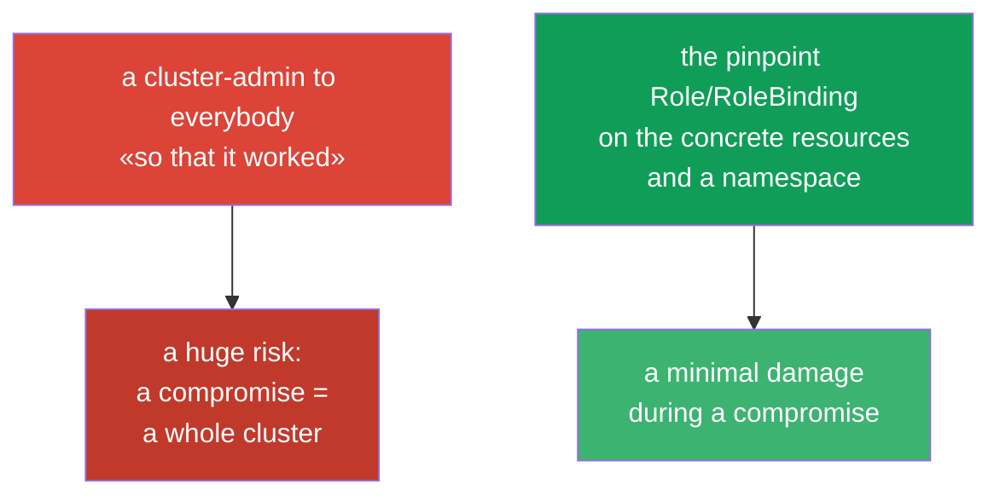

[Русская версия](ru.md) · [Versión en español](es.md) · [Version française](fr.md) · [Deutsche Version](de.md) · [ქართული ვერსია](ge.md) · [繁體中文版](tw.md) · [日本語版](jp.md)

# Chapter 38. RBAC: Role, ClusterRole and the bindings

> 🟦 **A chapter for the CKA** (the domains Cluster Architecture and a security). It is useful for the CKAD too
> (Security).
>
> **What comes next.** In the chapter 21 we have found out, that an authorization in Kubernetes is done by **RBAC**.
> Now we will consider it in a detail: how out of the permissions (Role/ClusterRole) and the bindings
> (RoleBinding/ClusterRoleBinding) an access for the users and a ServiceAccount is assembled.
> This is a frequent task of the CKA ("give a SA the rights on X") and a basis of a security of any cluster.
> A key to a topic - to understand the four objects and how they combine.

## 38.1. The four objects of RBAC

RBAC is built on a separation of "what is allowed" and "to whom to give this". Hence the four objects, in the pairs:



| An object | What it describes | An area |
|--------|---------------|---------|
| **Role** | a set of the permissions | one namespace |
| **ClusterRole** | a set of the permissions | a whole cluster / the cluster-scoped resources |
| **RoleBinding** | a binding of a role to a subject | one namespace |
| **ClusterRoleBinding** | a binding of a role to a subject | a whole cluster |

A rule: **Role/ClusterRole = what is allowed, a Binding = to whom to give**. A role without a binding does not
act; a binding without a role is impossible.

## 38.2. Role: the permissions in a namespace

Role describes, which **actions (verbs)** over which **resources (resources)** are allowed
in a concrete namespace.

```yaml
apiVersion: rbac.authorization.k8s.io/v1
kind: Role
metadata:
  namespace: dev
  name: pod-reader
rules:
- apiGroups: [""]              # "" - a core group (pods, services, ...)
  resources: ["pods"]
  verbs: ["get", "list", "watch"]
```

Let us consider the `rules`:
- **apiGroups** - a group of an API of a resource (`""` - core: pods, services; `apps` - deployments;
  `rbac.authorization.k8s.io` - the roles etc.);
- **resources** - the types of the resources (`pods`, `deployments`, `secrets`);
- **verbs** - the actions: `get`, `list`, `watch`, `create`, `update`, `patch`, `delete`.



## 38.3. RoleBinding: to whom to give

RoleBinding links Role with a **subject** - a user, a group or a ServiceAccount.

```yaml
apiVersion: rbac.authorization.k8s.io/v1
kind: RoleBinding
metadata:
  namespace: dev
  name: read-pods
subjects:
- kind: ServiceAccount        # or User, or Group
  name: my-sa
  namespace: dev
roleRef:
  kind: Role
  name: pod-reader            # which role we bind
  apiGroup: rbac.authorization.k8s.io
```


The subjects are of the three kinds: `User` (a human, out of a certificate/OIDC - the chapter 21),
`Group` (a group) and `ServiceAccount` (for the pods).

## 38.4. ClusterRole and ClusterRoleBinding

**ClusterRole** is needed in the two cases: (1) the rights on the **cluster-scoped** resources (the nodes, PV,
namespaces - the chapter 6), which are absent in a concrete namespace; (2) in order to **reuse**
one set of the rights in many namespace.



An interesting and important combination: **ClusterRole + RoleBinding**. ClusterRole defines
the rights, and RoleBinding limits them by **one namespace**. This allows to describe a role one
time (for example, a `pod-reader` as a ClusterRole) and to bind it in the different namespace through
a RoleBinding, without duplicating Role.

| A combination | An area of an action |
|-----------|------------------|
| Role + RoleBinding | one namespace |
| ClusterRole + RoleBinding | one namespace (a reusable role) |
| ClusterRole + ClusterRoleBinding | a whole cluster + the cluster-scoped resources |
| Role + ClusterRoleBinding | **impossible** (Role is bound to a namespace) |

## 38.5. An imperative creation and a check

The RBAC objects are convenient to create imperatively (it is faster at an exam):

```bash
# Role
kubectl create role pod-reader --verb=get,list,watch --resource=pods -n dev

# RoleBinding for a ServiceAccount
kubectl create rolebinding read-pods \
  --role=pod-reader --serviceaccount=dev:my-sa -n dev

# ClusterRole
kubectl create clusterrole node-reader --verb=get,list --resource=nodes

# ClusterRoleBinding for a user
kubectl create clusterrolebinding read-nodes \
  --clusterrole=node-reader --user=alice
```

A check of the rights (irreplaceable, the chapter 21):

```bash
kubectl auth can-i get pods -n dev
kubectl auth can-i delete nodes
kubectl auth can-i list secrets --as=system:serviceaccount:dev:my-sa -n dev
```


A `kubectl auth can-i ... --as=...` allows to check the rights **on behalf of** any subject - a best
way to make sure, that RBAC is configured correctly.

## 38.6. The built-in ClusterRole

In a cluster there are the ready ClusterRole "for all the cases" - they are useful to know and to reuse:

| ClusterRole | The rights |
|-------------|-------|
| `cluster-admin` | everything in a whole cluster (the super rights) |
| `admin` | almost everything within the limits of a namespace |
| `edit` | to read/write a majority of the resources of a namespace (except RBAC) |
| `view` | only a reading in a namespace |

Instead of a manual description often a `view`/`edit`/`admin` is bound to a team in its namespace.
A `cluster-admin` is given extremely carefully - this is a full access to everything.

## 38.7. A principle of the least privileges

RBAC - an instrument of a principle of the minimal privileges (it echoes with the chapters 20-21): to give
exactly as many rights, as it is needed, not more.



The typical mistakes: a handing out of a `cluster-admin` "so as not to bother", the wide `*` in verbs/resources,
a binding of the rights to a `default` ServiceAccount. Correctly - the narrow roles, the separate SA (the chapter 21),
a namespace limitation through a RoleBinding.

## 38.8. How this is applied in a production

- **RBAC - a basis of a multitenancy.** In a production the teams get an access only to their
  namespace through a RoleBinding on an `edit`/`view` or the custom roles. Nobody, except
  the administrators of a cluster, has a `cluster-admin`.
- **A separate SA + a minimal role per an application.** To the applications, which need an access to
  an API (the operators, the controllers), their own ServiceAccount is created (the chapter 21) and strictly
  the necessary rights are given - so that a compromise of a pod did not open a whole cluster.
- **An audit and a review of the rights.** RBAC is regularly audited: a `kubectl auth can-i --list`, a search
  of the excessive `cluster-admin` and the wide `*`. The excessive rights - a frequent finding during
  a security review.
- **An integration with an external identity.** The human users are created not one by one, but through
  OIDC/the groups (the chapter 21): a ClusterRole/Role is bound to the groups out of a corporate
  provider, and not to the separate `User`.
- **ClusterRole for the reusable roles.** The common sets of the rights are described as a ClusterRole
  and are bound with the RoleBindings in the needed namespace - this rids of a duplication of Role.

## 38.9. A mini glossary

- **RBAC** - a management of an access on a basis of the roles (an authorization in Kubernetes).
- **Role** - the permissions in one namespace.
- **ClusterRole** - the permissions on a cluster / the cluster-scoped resources / for a reuse.
- **RoleBinding** - a binding of a role to a subject in a namespace.
- **ClusterRoleBinding** - a binding of a role to a subject on a whole cluster.
- **rules (apiGroups/resources/verbs)** - what and over what is allowed.
- **subjects** - to whom the rights are given: User, Group, ServiceAccount.
- **roleRef** - onto which role a binding refers.
- **cluster-admin / admin / edit / view** - the built-in ClusterRole.

## 38.10. The conclusions of the chapter

- RBAC = "what is allowed" (Role/ClusterRole) + "to whom to give" (RoleBinding/ClusterRoleBinding);
  a role without a binding does not act.
- Role/RoleBinding work in one namespace; ClusterRole/ClusterRoleBinding - on a whole
  cluster and the cluster-scoped resources.
- rules set apiGroups + resources + verbs; the subjects - User, Group, ServiceAccount.
- ClusterRole + RoleBinding - a way to reuse a role, having limited it by one namespace;
  Role + ClusterRoleBinding is impossible.
- Imperatively: a `kubectl create role/rolebinding/clusterrole/clusterrolebinding`; a check -
  a `kubectl auth can-i ... --as=...`.
- There are the built-in ClusterRole: cluster-admin, admin, edit, view.
- A principle of the least privileges: the narrow roles and a namespace limitation, and not a cluster-admin
  to everybody.

## 38.11. How this will come in handy: at an exam and in a real work

**At an exam (the CKA).** "Create a Role/ClusterRole and bind to a SA/a user", "give the rights
only on a reading of the pods in a namespace", "check, whether a subject X can" - the frequent tasks.
One has to confidently create the four objects (better imperatively) and to check through
an `auth can-i --as`. An understanding of the combinations Role/ClusterRole × RoleBinding/ClusterRoleBinding -
a key one.

**In a real work.** RBAC - a foundation of a security and a multitenancy of a cluster:
the teams in their namespace, the applications with the minimal rights through the separate SA,
an integration with a corporate identity. A competent RBAC limits a damage during a compromise and
passes the security audits; the excessive rights - a typical vulnerability.

## 38.12. The questions for a self-check

1. Which four objects form RBAC and how are they divided into "what" and "to whom"?
2. How does Role differ from ClusterRole by an area of an action?
3. What is a combination ClusterRole + RoleBinding for? Why is Role +
   ClusterRoleBinding impossible?
4. What does a rule consist of and which subjects are there?
5. How to quickly create a Role and a RoleBinding for a ServiceAccount imperatively?
6. How to check the rights on behalf of a concrete subject, without logging in as it?
7. Why is a handing out of a cluster-admin a bad practice and what to do instead of this?

## Practice

We have considered an authorization. In the chapter 39 - an authentication from another side: the TLS certificates,
kubeconfig and a CSR API, that is how the users and the components get the credentials at all.
RBAC is practiced in the labs on a security.

🧪 A lab 113 (RBAC + an access for a human through a CSR and for an application through a SA): [tasks/cka/labs/113](../../labs/113/README.MD)

🧪 A lab 121 (the RBAC drills + a check through an auth can-i): [tasks/cka/labs/121](../../labs/121/README.MD)

🎮 Killercoda (in a browser, no setup): [Create a Role and Role Binding](https://killercoda.com/chadmcrowell/course/cka/create-role) · [Create a Cluster Role and Role Binding](https://killercoda.com/chadmcrowell/course/cka/create-cluster-role) · [Role and RoleBinding](https://killercoda.com/chadmcrowell/course/ckad/role-rolebinding) · [Create New User](https://killercoda.com/chadmcrowell/course/cka/kubernetes-create-user)

---
[Contents](../README.md) · [Chapter 37](../37/README.md) · [Chapter 39](../39/README.md)
