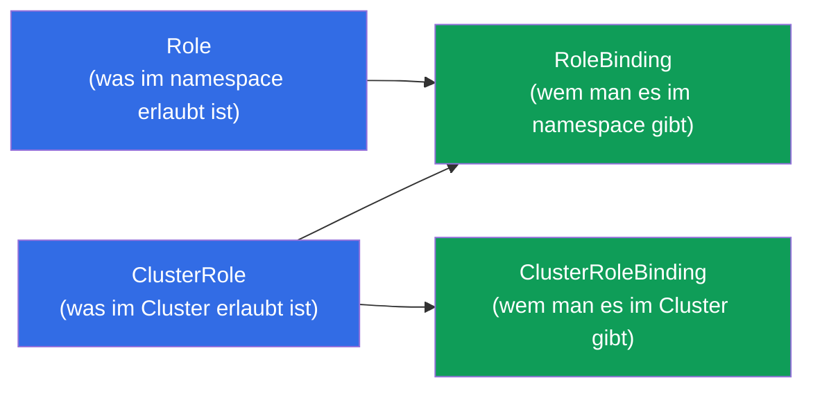
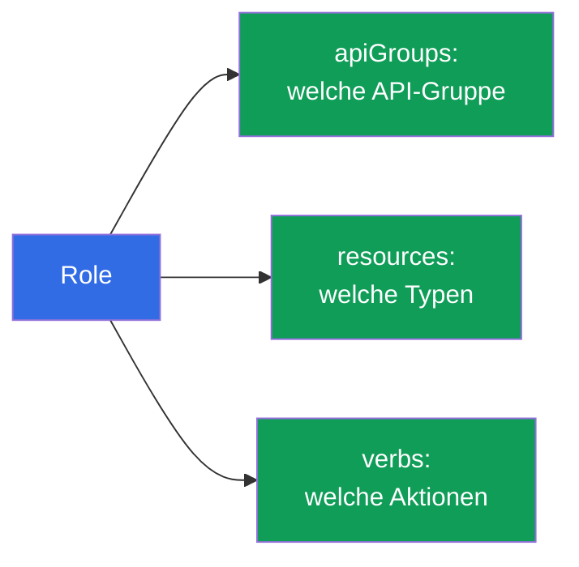
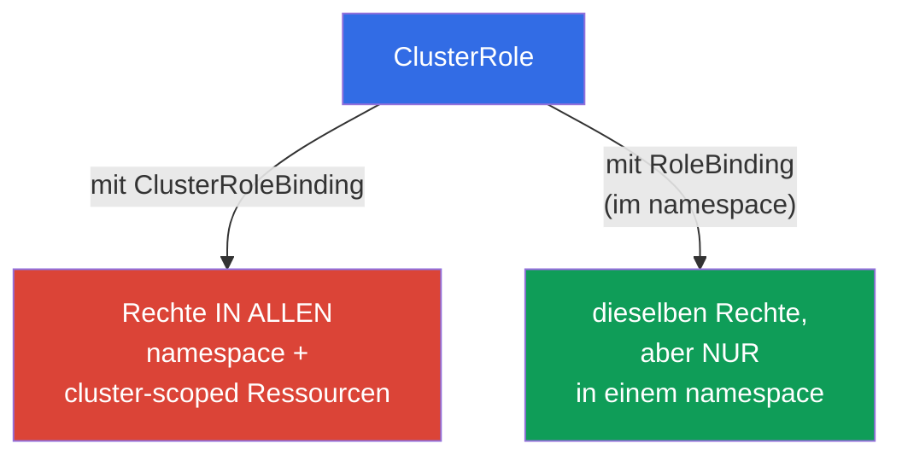
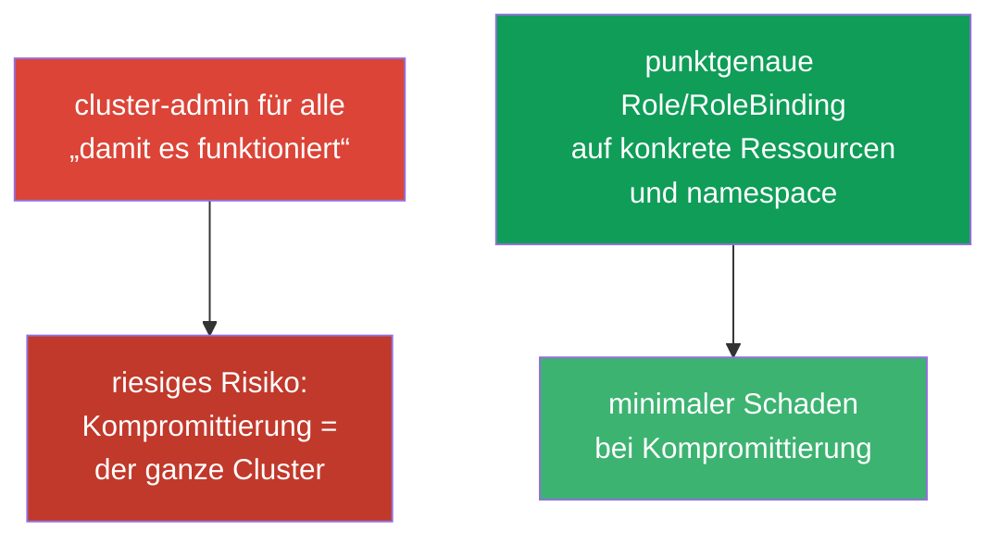

[Русская версия](ru.md) · [Eng version](README.md) · [Versión en español](es.md) · [Version française](fr.md) · [ქართული ვერსია](ge.md)

# Kapitel 38. RBAC: Role, ClusterRole und bindings

> 🟦 **Kapitel für CKA** (Domänen Cluster Architecture und Sicherheit). Nützlich auch für CKAD
> (Security).
>
> **Was kommt.** In Kapitel 21 haben wir gelernt, dass die Autorisierung in Kubernetes von
> **RBAC** erledigt wird. Jetzt sehen wir uns das im Detail an: wie aus Berechtigungen
> (Role/ClusterRole) und Bindungen (RoleBinding/ClusterRoleBinding) der Zugriff für Benutzer
> und ServiceAccount zusammengesetzt wird. Das ist eine häufige CKA-Aufgabe („gib dem SA Rechte
> auf X“) und die Grundlage der Sicherheit jedes Clusters. Der Schlüssel zum Thema ist, die vier
> Objekte und ihr Zusammenspiel zu verstehen.

## 38.1. Die vier Objekte von RBAC

RBAC baut auf der Trennung von „was erlaubt ist“ und „wem man es gibt“ auf. Daher vier Objekte,
paarweise:



| Objekt | Was es beschreibt | Bereich |
|--------|---------------|---------|
| **Role** | eine Menge von Berechtigungen | ein namespace |
| **ClusterRole** | eine Menge von Berechtigungen | der ganze Cluster / cluster-scoped Ressourcen |
| **RoleBinding** | Bindung einer Rolle an ein Subjekt | ein namespace |
| **ClusterRoleBinding** | Bindung einer Rolle an ein Subjekt | der ganze Cluster |

Die Regel: **Role/ClusterRole = was erlaubt ist, Binding = wem man es gibt**. Eine Rolle ohne
Bindung wirkt nicht; eine Bindung ohne Rolle ist unmöglich.

## 38.2. Role: Berechtigungen im namespace

Role beschreibt, welche **Aktionen (verbs)** an welchen **Ressourcen (resources)** in einem
konkreten namespace erlaubt sind.

```yaml
apiVersion: rbac.authorization.k8s.io/v1
kind: Role
metadata:
  namespace: dev
  name: pod-reader
rules:
- apiGroups: [""]              # "" — die core-Gruppe (pods, services, ...)
  resources: ["pods"]
  verbs: ["get", "list", "watch"]
```

Sehen wir uns `rules` an:
- **apiGroups** - die API-Gruppe der Ressource (`""` - core: pods, services; `apps` - deployments;
  `rbac.authorization.k8s.io` - Rollen usw.);
- **resources** - die Ressourcentypen (`pods`, `deployments`, `secrets`);
- **verbs** - die Aktionen: `get`, `list`, `watch`, `create`, `update`, `patch`, `delete`.



## 38.3. RoleBinding: wem man es gibt

RoleBinding verbindet eine Role mit einem **Subjekt** - einem Benutzer, einer Gruppe oder einem
ServiceAccount.

```yaml
apiVersion: rbac.authorization.k8s.io/v1
kind: RoleBinding
metadata:
  namespace: dev
  name: read-pods
subjects:
- kind: ServiceAccount        # oder User, oder Group
  name: my-sa
  namespace: dev
roleRef:
  kind: Role
  name: pod-reader            # welche Rolle wir binden
  apiGroup: rbac.authorization.k8s.io
```


Subjekte gibt es in drei Arten: `User` (ein Mensch, aus Zertifikat/OIDC - Kapitel 21),
`Group` (eine Gruppe) und `ServiceAccount` (für Pods).

## 38.4. ClusterRole und ClusterRoleBinding

**ClusterRole** braucht man in zwei Fällen: (1) Rechte auf **cluster-scoped** Ressourcen (Nodes,
PV, namespaces - Kapitel 6), die es in einem konkreten namespace nicht gibt; (2) um eine Menge
von Rechten in vielen namespace **wiederzuverwenden**.



Eine interessante und wichtige Kombination: **ClusterRole + RoleBinding**. Die ClusterRole
definiert die Rechte, und das RoleBinding begrenzt sie auf **einen namespace**. Damit kann man
eine Rolle einmal beschreiben (zum Beispiel `pod-reader` als ClusterRole) und sie in
verschiedenen namespace über RoleBinding binden, ohne Role zu duplizieren.

| Kombination | Wirkungsbereich |
|-----------|------------------|
| Role + RoleBinding | ein namespace |
| ClusterRole + RoleBinding | ein namespace (wiederverwendbare Rolle) |
| ClusterRole + ClusterRoleBinding | der ganze Cluster + cluster-scoped Ressourcen |
| Role + ClusterRoleBinding | **unmöglich** (Role ist an einen namespace gebunden) |

## 38.5. Imperatives Erstellen und Prüfen

RBAC-Objekte erstellt man bequem imperativ (schneller in der Prüfung):

```bash
# Role
kubectl create role pod-reader --verb=get,list,watch --resource=pods -n dev

# RoleBinding für einen ServiceAccount
kubectl create rolebinding read-pods \
  --role=pod-reader --serviceaccount=dev:my-sa -n dev

# ClusterRole
kubectl create clusterrole node-reader --verb=get,list --resource=nodes

# ClusterRoleBinding für einen Benutzer
kubectl create clusterrolebinding read-nodes \
  --clusterrole=node-reader --user=alice
```

Prüfung der Rechte (unersetzlich, Kapitel 21):

```bash
kubectl auth can-i get pods -n dev
kubectl auth can-i delete nodes
kubectl auth can-i list secrets --as=system:serviceaccount:dev:my-sa -n dev
```


`kubectl auth can-i ... --as=...` erlaubt es, die Rechte **anstelle** eines beliebigen Subjekts
zu prüfen - der beste Weg, sich zu vergewissern, dass RBAC richtig konfiguriert ist.

## 38.6. Eingebaute ClusterRole

Im Cluster gibt es fertige ClusterRole „für alle Fälle“ - die sollte man kennen und
wiederverwenden:

| ClusterRole | Rechte |
|-------------|-------|
| `cluster-admin` | alles im ganzen Cluster (Super-Rechte) |
| `admin` | fast alles innerhalb eines namespace |
| `edit` | die meisten Ressourcen des namespace lesen/schreiben (außer RBAC) |
| `view` | nur Lesen im namespace |

Statt einer manuellen Beschreibung bindet man oft `view`/`edit`/`admin` an ein Team in dessen
namespace. `cluster-admin` gibt man äußerst vorsichtig - das ist Vollzugriff auf alles.

## 38.7. Das Prinzip der geringsten Privilegien

RBAC ist das Werkzeug für das Prinzip der minimalen Privilegien (das überschneidet sich mit den
Kapiteln 20-21): genau so viele Rechte geben, wie nötig, nicht mehr.



Typische Fehler: `cluster-admin` verteilen, „um sich nicht damit herumzuschlagen“, breite `*` in
verbs/resources, Bindung von Rechten an den `default` ServiceAccount. Richtig sind schmale
Rollen, separate SA (Kapitel 21) und namespace-Begrenzung über RoleBinding.

## 38.8. Wie man das in der Produktion anwendet

- **RBAC ist die Grundlage der Mandantenfähigkeit.** In der Produktion erhalten Teams Zugriff
  nur auf ihre namespace über ein RoleBinding auf `edit`/`view` oder eigene Rollen. Niemand außer
  den Cluster-Administratoren hat `cluster-admin`.
- **Separater SA + minimale Rolle pro Anwendung.** Anwendungen, die Zugriff auf die API brauchen
  (Operatoren, Controller), bekommen einen eigenen ServiceAccount (Kapitel 21) und strikt die
  notwendigen Rechte - damit die Kompromittierung eines Pods nicht den ganzen Cluster öffnet.
- **Audit und Review der Rechte.** RBAC wird regelmäßig auditiert: `kubectl auth can-i --list`,
  Suche nach überflüssigen `cluster-admin` und breiten `*`. Überflüssige Rechte sind ein häufiger
  Fund beim Security-Review.
- **Integration mit externer identity.** Menschliche Benutzer legt man nicht einzeln an, sondern
  über OIDC/Gruppen (Kapitel 21): man bindet ClusterRole/Role an Gruppen aus dem
  Unternehmensprovider und nicht an einzelne `User`.
- **ClusterRole für wiederverwendbare Rollen.** Gemeinsame Rechtemengen beschreibt man als
  ClusterRole und bindet sie mit RoleBindings in den nötigen namespace - das erspart die
  Duplizierung von Role.

## 38.9. Mini-Glossar

- **RBAC** - rollenbasierte Zugriffssteuerung (Autorisierung in Kubernetes).
- **Role** - Berechtigungen in einem namespace.
- **ClusterRole** - Berechtigungen für den Cluster / cluster-scoped Ressourcen / zur
  Wiederverwendung.
- **RoleBinding** - Bindung einer Rolle an ein Subjekt im namespace.
- **ClusterRoleBinding** - Bindung einer Rolle an ein Subjekt für den ganzen Cluster.
- **rules (apiGroups/resources/verbs)** - was und woran erlaubt ist.
- **subjects** - wem die Rechte gegeben werden: User, Group, ServiceAccount.
- **roleRef** - auf welche Rolle das binding verweist.
- **cluster-admin / admin / edit / view** - eingebaute ClusterRole.

## 38.10. Zusammenfassung des Kapitels

- RBAC = „was erlaubt ist“ (Role/ClusterRole) + „wem man es gibt“
  (RoleBinding/ClusterRoleBinding); eine Rolle ohne Bindung wirkt nicht.
- Role/RoleBinding arbeiten in einem namespace; ClusterRole/ClusterRoleBinding - für den ganzen
  Cluster und cluster-scoped Ressourcen.
- rules legen apiGroups + resources + verbs fest; Subjekte sind User, Group, ServiceAccount.
- ClusterRole + RoleBinding - der Weg, eine Rolle wiederzuverwenden und sie auf einen namespace
  zu begrenzen; Role + ClusterRoleBinding ist unmöglich.
- Imperativ: `kubectl create role/rolebinding/clusterrole/clusterrolebinding`; Prüfung -
  `kubectl auth can-i ... --as=...`.
- Es gibt eingebaute ClusterRole: cluster-admin, admin, edit, view.
- Das Prinzip der geringsten Privilegien: schmale Rollen und namespace-Begrenzung, nicht
  cluster-admin für alle.

## 38.11. Wofür das nützlich ist: in der Prüfung und in der echten Arbeit

**In der Prüfung (CKA).** „Erstelle eine Role/ClusterRole und binde sie an einen SA/Benutzer“,
„gib nur Leserechte auf Pods im namespace“, „prüfe, ob das Subjekt X darf“ - häufige Aufgaben.
Man muss die vier Objekte sicher erstellen (besser imperativ) und über `auth can-i --as` prüfen.
Das Verständnis der Kombinationen Role/ClusterRole × RoleBinding/ClusterRoleBinding ist
entscheidend.

**In der echten Arbeit.** RBAC ist das Fundament der Sicherheit und der Mandantenfähigkeit eines
Clusters: Teams in ihren namespace, Anwendungen mit minimalen Rechten über separate SA,
Integration mit der Unternehmens-identity. Ein sauberes RBAC begrenzt den Schaden bei einer
Kompromittierung und übersteht Security-Audits; überflüssige Rechte sind eine typische
Schwachstelle.

## 38.12. Fragen zur Selbstüberprüfung

1. Welche vier Objekte bilden RBAC und wie teilen sie sich in „was“ und „wem“ auf?
2. Wodurch unterscheidet sich Role von ClusterRole im Wirkungsbereich?
3. Wozu braucht man die Kombination ClusterRole + RoleBinding? Warum ist Role +
   ClusterRoleBinding unmöglich?
4. Woraus besteht eine Regel (rule) und welche Subjekte gibt es?
5. Wie erstellt man schnell eine Role und ein RoleBinding für einen ServiceAccount imperativ?
6. Wie prüft man die Rechte anstelle eines konkreten Subjekts, ohne sich als dieses anzumelden?
7. Warum ist das Verteilen von cluster-admin eine schlechte Praxis und was tut man stattdessen?

## Praxis

Wir haben die Autorisierung behandelt. In Kapitel 39 - die Authentifizierung von der anderen
Seite: TLS-Zertifikate, kubeconfig und die CSR API, also wie Benutzer und Komponenten überhaupt
zu ihren Ausweisen kommen. RBAC übt man in den Labs zur Sicherheit.

🧪 Lab 113 (RBAC + Zugriff für einen Menschen über CSR und für eine Anwendung über SA): [tasks/cka/labs/113](../../labs/113/README_DE.MD)

🧪 Lab 121 (RBAC-Drills + Prüfung über auth can-i): [tasks/cka/labs/121](../../labs/121/README_DE.MD)

---
[Inhalt](../README_DE.md) · [Kapitel 37](../37/de.md) · [Kapitel 39](../39/de.md)
