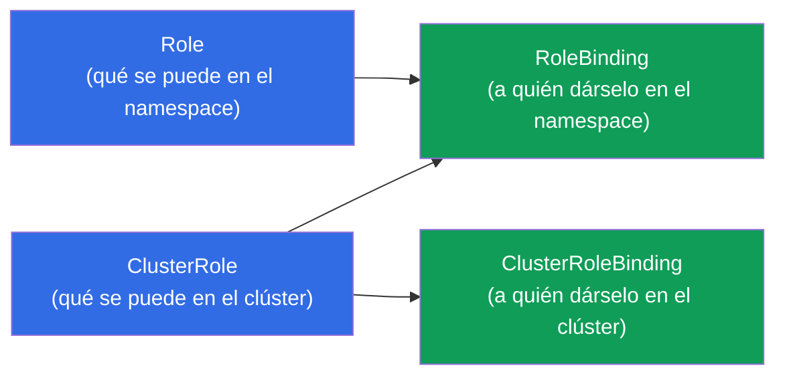
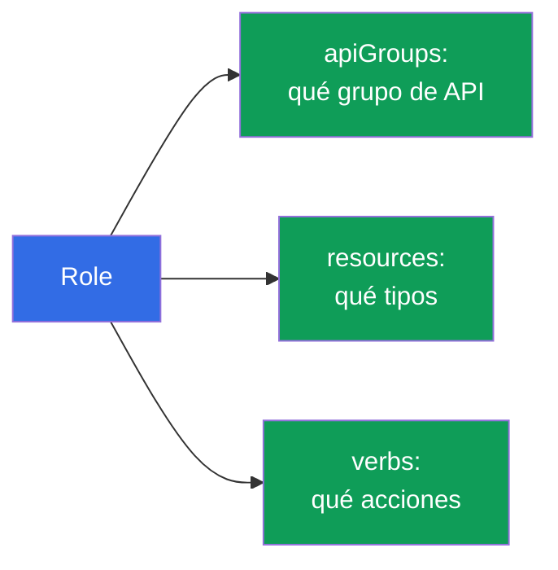
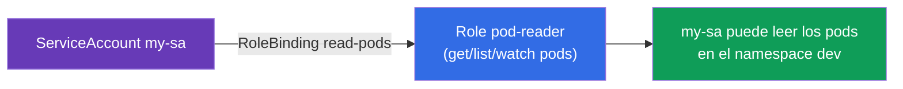
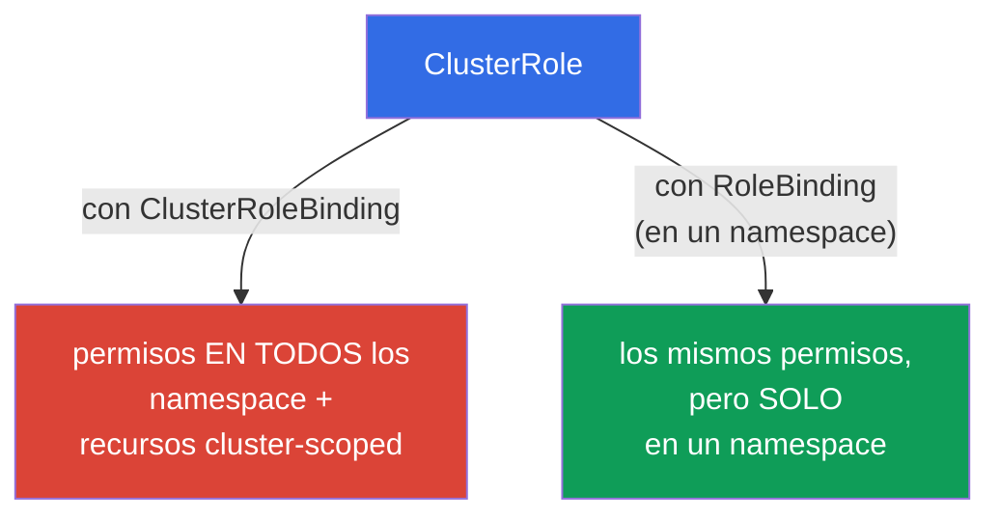
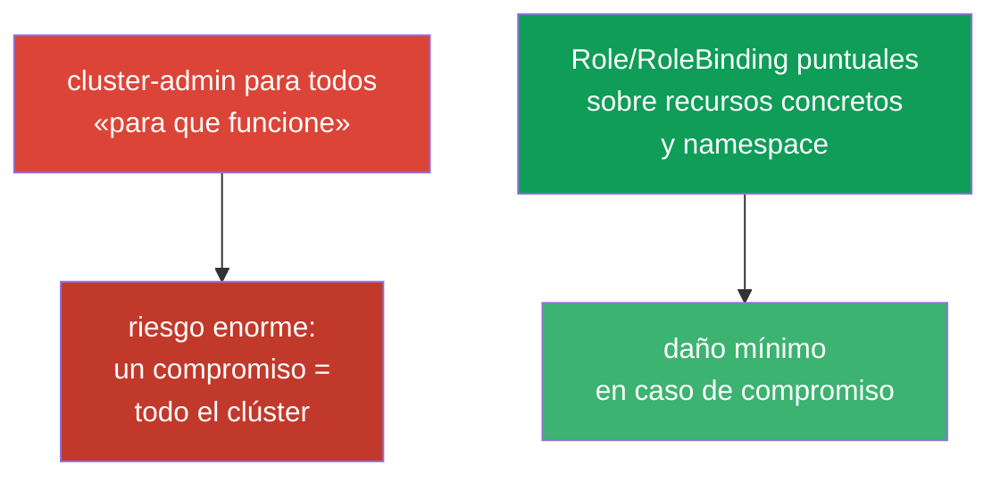

[Русская версия](ru.md) · [Eng version](README.md) · [Version française](fr.md) · [Deutsche Version](de.md) · [ქართული ვერსია](ge.md) · [繁體中文版](tw.md) · [日本語版](jp.md)

# Capítulo 38. RBAC: Role, ClusterRole y bindings

> 🟦 **Capítulo para CKA** (dominios Cluster Architecture y seguridad). Útil también para CKAD
> (Security).
>
> **Qué viene ahora.** En el capítulo 21 aprendimos que la autorización en Kubernetes la hace
> **RBAC**. Ahora lo veremos en detalle: cómo, a partir de permisos (Role/ClusterRole) y
> vinculaciones (RoleBinding/ClusterRoleBinding), se construye el acceso para usuarios y
> ServiceAccount. Es una tarea frecuente del CKA («dale al SA permisos sobre X») y la base de la
> seguridad de cualquier clúster. La clave es entender los cuatro objetos y cómo se combinan.

## 38.1. Los cuatro objetos de RBAC

RBAC se construye separando «qué se puede» de «a quién dárselo». De ahí cuatro objetos, por parejas:



| Objeto | Qué describe | Ámbito |
|--------|---------------|---------|
| **Role** | conjunto de permisos | un namespace |
| **ClusterRole** | conjunto de permisos | todo el clúster / recursos cluster-scoped |
| **RoleBinding** | vinculación de un rol a un sujeto | un namespace |
| **ClusterRoleBinding** | vinculación de un rol a un sujeto | todo el clúster |

Regla: **Role/ClusterRole = qué se puede, Binding = a quién dárselo**. Un rol sin vinculación no
tiene efecto; una vinculación sin rol es imposible.

## 38.2. Role: permisos en un namespace

Role describe qué **acciones (verbs)** sobre qué **recursos (resources)** están permitidas en un
namespace concreto.

```yaml
apiVersion: rbac.authorization.k8s.io/v1
kind: Role
metadata:
  namespace: dev
  name: pod-reader
rules:
- apiGroups: [""]              # "" — el grupo core (pods, services, ...)
  resources: ["pods"]
  verbs: ["get", "list", "watch"]
```

Veamos `rules`:
- **apiGroups** - el grupo de API del recurso (`""` - core: pods, services; `apps` - deployments;
  `rbac.authorization.k8s.io` - los roles, etc.);
- **resources** - los tipos de recursos (`pods`, `deployments`, `secrets`);
- **verbs** - las acciones: `get`, `list`, `watch`, `create`, `update`, `patch`, `delete`.



## 38.3. RoleBinding: a quién dárselo

RoleBinding vincula un Role con un **sujeto** - un usuario, un grupo o un ServiceAccount.

```yaml
apiVersion: rbac.authorization.k8s.io/v1
kind: RoleBinding
metadata:
  namespace: dev
  name: read-pods
subjects:
- kind: ServiceAccount        # o User, o Group
  name: my-sa
  namespace: dev
roleRef:
  kind: Role
  name: pod-reader            # qué rol vinculamos
  apiGroup: rbac.authorization.k8s.io
```



Los sujetos son de tres tipos: `User` (una persona, desde un certificado/OIDC - capítulo 21),
`Group` (un grupo) y `ServiceAccount` (para los pods).

## 38.4. ClusterRole y ClusterRoleBinding

**ClusterRole** hace falta en dos casos: (1) permisos sobre recursos **cluster-scoped** (nodos, PV,
namespaces - capítulo 6), que no existen dentro de un namespace concreto; (2) para **reutilizar** un
mismo conjunto de permisos en muchos namespace.



Una combinación interesante e importante: **ClusterRole + RoleBinding**. El ClusterRole define los
permisos y el RoleBinding los limita a **un solo namespace**. Esto permite describir el rol una vez
(por ejemplo, `pod-reader` como ClusterRole) y vincularlo en distintos namespace mediante
RoleBinding, sin duplicar Role.

| Combinación | Ámbito de actuación |
|-----------|------------------|
| Role + RoleBinding | un namespace |
| ClusterRole + RoleBinding | un namespace (rol reutilizable) |
| ClusterRole + ClusterRoleBinding | todo el clúster + recursos cluster-scoped |
| Role + ClusterRoleBinding | **imposible** (Role está atado a un namespace) |

## 38.5. Creación imperativa y comprobación

Los objetos RBAC es cómodo crearlos de forma imperativa (más rápido en el examen):

```bash
# Role
kubectl create role pod-reader --verb=get,list,watch --resource=pods -n dev

# RoleBinding para un ServiceAccount
kubectl create rolebinding read-pods \
  --role=pod-reader --serviceaccount=dev:my-sa -n dev

# ClusterRole
kubectl create clusterrole node-reader --verb=get,list --resource=nodes

# ClusterRoleBinding para un usuario
kubectl create clusterrolebinding read-nodes \
  --clusterrole=node-reader --user=alice
```

Comprobación de permisos (insustituible, capítulo 21):

```bash
kubectl auth can-i get pods -n dev
kubectl auth can-i delete nodes
kubectl auth can-i list secrets --as=system:serviceaccount:dev:my-sa -n dev
```


`kubectl auth can-i ... --as=...` permite comprobar los permisos **en nombre de** cualquier sujeto -
la mejor manera de asegurarse de que RBAC está bien configurado.

## 38.6. ClusterRole integrados

En el clúster hay ClusterRole ya listos «para todos los casos» - conviene conocerlos y reutilizarlos:

| ClusterRole | Permisos |
|-------------|-------|
| `cluster-admin` | todo en todo el clúster (superpermisos) |
| `admin` | casi todo dentro de un namespace |
| `edit` | leer/escribir la mayoría de recursos del namespace (excepto RBAC) |
| `view` | solo lectura en el namespace |

En lugar de describirlo a mano, a menudo se vinculan `view`/`edit`/`admin` a un equipo en su
namespace. `cluster-admin` se da con extrema precaución - es acceso total a todo.

## 38.7. El principio de mínimos privilegios

RBAC es la herramienta del principio de mínimos privilegios (en línea con los capítulos 20-21): dar
exactamente los permisos necesarios, no más.



Errores típicos: repartir `cluster-admin` «para no complicarse», `*` amplios en verbs/resources,
vincular permisos al ServiceAccount `default`. Lo correcto son roles estrechos, SA propios
(capítulo 21) y limitación por namespace mediante RoleBinding.

## 38.8. Cómo se aplica esto en producción

- **RBAC es la base de la multitenencia.** En producción los equipos reciben acceso solo a sus
  namespace mediante RoleBinding a `edit`/`view` o roles personalizados. Nadie, salvo los
  administradores del clúster, tiene `cluster-admin`.
- **Un SA propio + rol mínimo por aplicación.** A las aplicaciones que necesitan acceso a la API
  (operadores, controladores) se les crea su propio ServiceAccount (capítulo 21) y se les dan
  estrictamente los permisos necesarios - para que el compromiso de un pod no abra todo el clúster.
- **Auditoría y revisión de permisos.** RBAC se audita con regularidad: `kubectl auth can-i --list`,
  búsqueda de `cluster-admin` de más y de `*` amplios. Los permisos excesivos son un hallazgo
  frecuente en las revisiones de seguridad.
- **Integración con una identity externa.** Los usuarios humanos no se crean uno a uno, sino a través
  de OIDC/grupos (capítulo 21): se vinculan ClusterRole/Role a los grupos del proveedor corporativo,
  no a `User` individuales.
- **ClusterRole para roles reutilizables.** Los conjuntos de permisos comunes se describen como
  ClusterRole y se vinculan con RoleBinding en los namespace que hagan falta - así no se duplica Role.

## 38.9. Mini-glosario

- **RBAC** - control de acceso basado en roles (la autorización en Kubernetes).
- **Role** - permisos en un solo namespace.
- **ClusterRole** - permisos sobre el clúster / recursos cluster-scoped / para reutilizar.
- **RoleBinding** - vinculación de un rol a un sujeto en un namespace.
- **ClusterRoleBinding** - vinculación de un rol a un sujeto en todo el clúster.
- **rules (apiGroups/resources/verbs)** - qué está permitido y sobre qué.
- **subjects** - a quién se dan los permisos: User, Group, ServiceAccount.
- **roleRef** - a qué rol apunta el binding.
- **cluster-admin / admin / edit / view** - ClusterRole integrados.

## 38.10. Resumen del capítulo

- RBAC = «qué se puede» (Role/ClusterRole) + «a quién dárselo»
  (RoleBinding/ClusterRoleBinding); un rol sin vinculación no tiene efecto.
- Role/RoleBinding funcionan en un namespace; ClusterRole/ClusterRoleBinding - en todo el
  clúster y sobre recursos cluster-scoped.
- rules define apiGroups + resources + verbs; los sujetos son User, Group, ServiceAccount.
- ClusterRole + RoleBinding es la forma de reutilizar un rol limitándolo a un namespace;
  Role + ClusterRoleBinding es imposible.
- De forma imperativa: `kubectl create role/rolebinding/clusterrole/clusterrolebinding`;
  comprobación - `kubectl auth can-i ... --as=...`.
- Hay ClusterRole integrados: cluster-admin, admin, edit, view.
- Principio de mínimos privilegios: roles estrechos y limitación por namespace, no
  cluster-admin para todos.

## 38.11. Para qué sirve esto: en el examen y en el trabajo real

**En el examen (CKA).** «Crea un Role/ClusterRole y vincúlalo a un SA/usuario», «da permisos solo de
lectura de pods en un namespace», «comprueba si el sujeto X puede» son tareas frecuentes. Hay que
crear con soltura los cuatro objetos (mejor de forma imperativa) y comprobar con
`auth can-i --as`. Entender las combinaciones Role/ClusterRole × RoleBinding/ClusterRoleBinding es
clave.

**En el trabajo real.** RBAC es el cimiento de la seguridad y de la multitenencia del clúster: los
equipos en sus namespace, las aplicaciones con permisos mínimos mediante SA propios, la integración
con la identity corporativa. Un RBAC bien hecho limita el daño en caso de compromiso y pasa las
auditorías de seguridad; los permisos excesivos son una vulnerabilidad típica.

## 38.12. Preguntas de autocomprobación

1. ¿Qué cuatro objetos forman RBAC y cómo se reparten entre «qué» y «a quién»?
2. ¿En qué se diferencia Role de ClusterRole por su ámbito de actuación?
3. ¿Para qué sirve la combinación ClusterRole + RoleBinding? ¿Por qué es imposible Role +
   ClusterRoleBinding?
4. ¿De qué se compone una regla (rule) y qué tipos de sujetos existen?
5. ¿Cómo crear rápidamente un Role y un RoleBinding para un ServiceAccount de forma imperativa?
6. ¿Cómo comprobar los permisos de un sujeto concreto sin entrar como él?
7. ¿Por qué repartir cluster-admin es una mala práctica y qué hacer en su lugar?

## Práctica

Ya hemos visto la autorización. En el capítulo 39 - la autenticación desde el otro lado:
certificados TLS, kubeconfig y la CSR API, es decir, cómo obtienen sus credenciales los usuarios y
los componentes. RBAC se practica en los laboratorios de seguridad.

🧪 Laboratorio 113 (RBAC + acceso para una persona vía CSR y para una aplicación vía SA): [tasks/cka/labs/113](../../labs/113/README_ES.MD)

🧪 Laboratorio 121 (drills de RBAC + comprobación con auth can-i): [tasks/cka/labs/121](../../labs/121/README_ES.MD)

🎮 Killercoda (en el navegador, sin instalación): [Create a Role and Role Binding](https://killercoda.com/chadmcrowell/course/cka/create-role) · [Create a Cluster Role and Role Binding](https://killercoda.com/chadmcrowell/course/cka/create-cluster-role) · [Role and RoleBinding](https://killercoda.com/chadmcrowell/course/ckad/role-rolebinding) · [Create New User](https://killercoda.com/chadmcrowell/course/cka/kubernetes-create-user)

---
[Índice](../README_ES.md) · [Capítulo 37](../37/es.md) · [Capítulo 39](../39/es.md)
