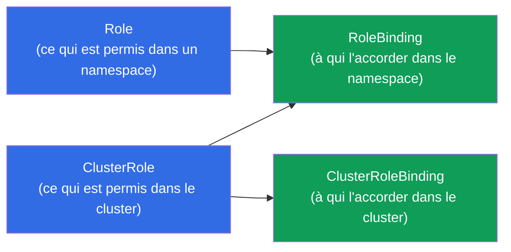
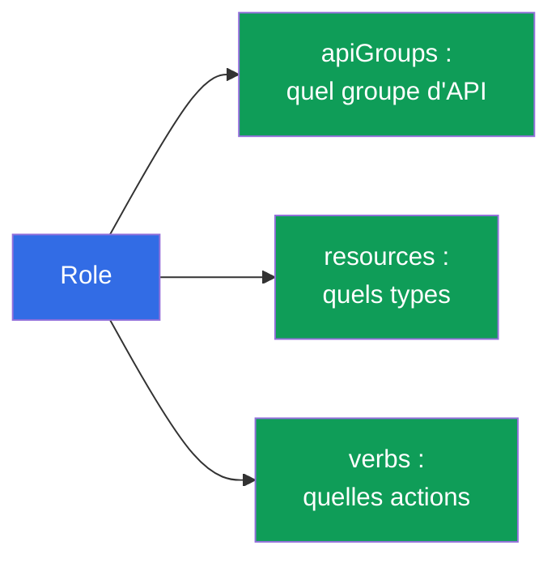
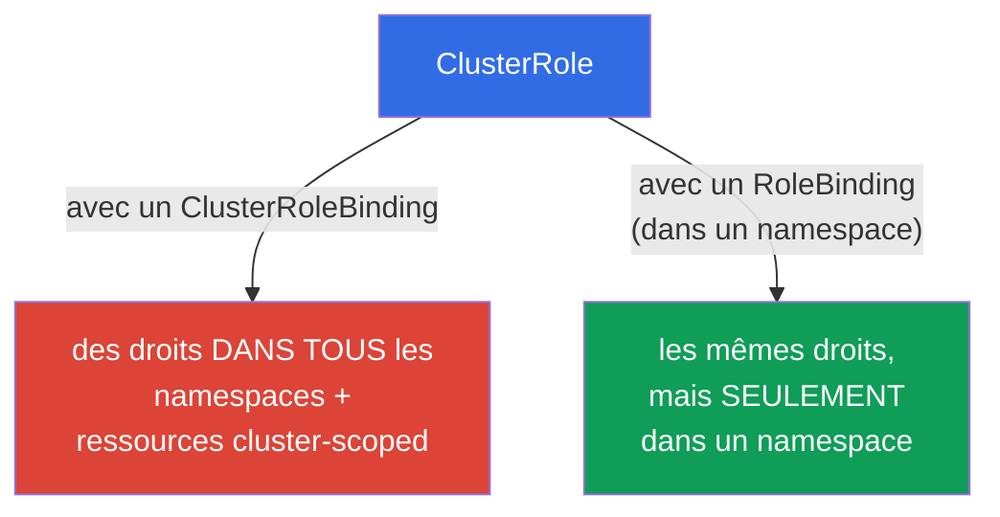
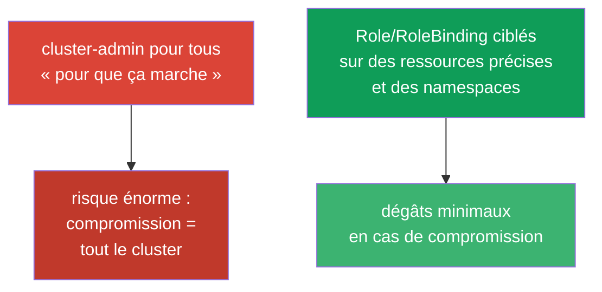

[Русская версия](ru.md) · [Eng version](README.md) · [Versión en español](es.md) · [Deutsche Version](de.md) · [ქართული ვერსია](ge.md)

# Chapitre 38. RBAC : Role, ClusterRole et bindings

> 🟦 **Chapitre pour le CKA** (domaines Cluster Architecture et sécurité). Utile aussi pour le CKAD
> (Security).
>
> **Ce qui suit.** Au chapitre 21, nous avons appris que l'autorisation dans Kubernetes est assurée
> par **RBAC**. Voyons-le en détail : comment les permissions (Role/ClusterRole) et les attributions
> (RoleBinding/ClusterRoleBinding) construisent l'accès des utilisateurs et des ServiceAccount.
> C'est un exercice fréquent du CKA (« donne à ce SA les droits sur X ») et la base de la sécurité de
> tout cluster. La clé du sujet : comprendre les quatre objets et leurs combinaisons.

## 38.1. Les quatre objets de RBAC

RBAC repose sur la séparation entre « ce qui est permis » et « à qui l'accorder ». D'où quatre objets, par paires :



| Objet | Ce qu'il décrit | Portée |
|--------|---------------|---------|
| **Role** | un ensemble de permissions | un seul namespace |
| **ClusterRole** | un ensemble de permissions | tout le cluster / ressources cluster-scoped |
| **RoleBinding** | l'attribution d'un rôle à un sujet | un seul namespace |
| **ClusterRoleBinding** | l'attribution d'un rôle à un sujet | tout le cluster |

La règle : **Role/ClusterRole = ce qui est permis, Binding = à qui l'accorder**. Un rôle sans
attribution n'a aucun effet ; une attribution sans rôle est impossible.

## 38.2. Role : les permissions dans un namespace

Un Role décrit quelles **actions (verbs)** sont autorisées sur quelles **ressources (resources)**
dans un namespace donné.

```yaml
apiVersion: rbac.authorization.k8s.io/v1
kind: Role
metadata:
  namespace: dev
  name: pod-reader
rules:
- apiGroups: [""]              # "" - le groupe core (pods, services, ...)
  resources: ["pods"]
  verbs: ["get", "list", "watch"]
```

Détaillons `rules` :
- **apiGroups** - le groupe d'API de la ressource (`""` - core : pods, services ; `apps` - deployments ;
  `rbac.authorization.k8s.io` - les rôles, etc.) ;
- **resources** - les types de ressources (`pods`, `deployments`, `secrets`) ;
- **verbs** - les actions : `get`, `list`, `watch`, `create`, `update`, `patch`, `delete`.



## 38.3. RoleBinding : à qui l'accorder

Un RoleBinding relie un Role à un **sujet** - un utilisateur, un groupe ou un ServiceAccount.

```yaml
apiVersion: rbac.authorization.k8s.io/v1
kind: RoleBinding
metadata:
  namespace: dev
  name: read-pods
subjects:
- kind: ServiceAccount        # ou User, ou Group
  name: my-sa
  namespace: dev
roleRef:
  kind: Role
  name: pod-reader            # quel rôle on attribue
  apiGroup: rbac.authorization.k8s.io
```


Les sujets sont de trois sortes : `User` (une personne, issue d'un certificat/OIDC - chapitre 21),
`Group` (un groupe) et `ServiceAccount` (pour les pods).

## 38.4. ClusterRole et ClusterRoleBinding

Un **ClusterRole** est nécessaire dans deux cas : (1) des droits sur des ressources **cluster-scoped**
(nœuds, PV, namespaces - chapitre 6), qui n'appartiennent à aucun namespace ; (2) pour **réutiliser**
un même ensemble de droits dans plusieurs namespaces.



Une combinaison intéressante et importante : **ClusterRole + RoleBinding**. Le ClusterRole définit
les droits, et le RoleBinding les limite à **un seul namespace**. Cela permet de décrire le rôle une
seule fois (par exemple `pod-reader` comme ClusterRole) et de l'attribuer dans différents namespaces
via des RoleBinding, sans dupliquer de Role.

| Combinaison | Portée |
|-----------|------------------|
| Role + RoleBinding | un seul namespace |
| ClusterRole + RoleBinding | un seul namespace (rôle réutilisable) |
| ClusterRole + ClusterRoleBinding | tout le cluster + ressources cluster-scoped |
| Role + ClusterRoleBinding | **impossible** (un Role est lié à un namespace) |

## 38.5. Création impérative et vérification

Les objets RBAC sont pratiques à créer de façon impérative (plus rapide à l'examen) :

```bash
# Role
kubectl create role pod-reader --verb=get,list,watch --resource=pods -n dev

# RoleBinding pour un ServiceAccount
kubectl create rolebinding read-pods \
  --role=pod-reader --serviceaccount=dev:my-sa -n dev

# ClusterRole
kubectl create clusterrole node-reader --verb=get,list --resource=nodes

# ClusterRoleBinding pour un utilisateur
kubectl create clusterrolebinding read-nodes \
  --clusterrole=node-reader --user=alice
```

Vérification des droits (irremplaçable, chapitre 21) :

```bash
kubectl auth can-i get pods -n dev
kubectl auth can-i delete nodes
kubectl auth can-i list secrets --as=system:serviceaccount:dev:my-sa -n dev
```


`kubectl auth can-i ... --as=...` permet de vérifier les droits **au nom de** n'importe quel sujet -
le meilleur moyen de s'assurer que RBAC est configuré correctement.

## 38.6. Les ClusterRole intégrés

Le cluster fournit des ClusterRole prêts à l'emploi « pour tous les cas » - utiles à connaître et à réutiliser :

| ClusterRole | Droits |
|-------------|-------|
| `cluster-admin` | tout, partout dans le cluster (super-droits) |
| `admin` | presque tout dans les limites d'un namespace |
| `edit` | lire/écrire la plupart des ressources du namespace (sauf RBAC) |
| `view` | lecture seule dans le namespace |

Plutôt que d'écrire des rôles à la main, on attribue souvent `view`/`edit`/`admin` à une équipe dans
son namespace. `cluster-admin` s'accorde avec une extrême prudence - c'est un accès total à tout.

## 38.7. Le principe du moindre privilège

RBAC est l'outil du principe du moindre privilège (en écho aux chapitres 20-21) : accorder
exactement les droits nécessaires, pas plus.



Erreurs typiques : distribuer `cluster-admin` « pour ne pas s'embêter », des `*` trop larges dans
verbs/resources, attribuer des droits au ServiceAccount `default`. La bonne pratique : des rôles
étroits, des SA dédiés (chapitre 21), une limitation au namespace via RoleBinding.

## 38.8. Comment cela s'applique en production

- **RBAC est la base de la multi-tenance.** En prod, les équipes n'ont accès qu'à leurs propres
  namespaces via un RoleBinding sur `edit`/`view` ou des rôles personnalisés. Personne, à part les
  administrateurs du cluster, ne possède `cluster-admin`.
- **Un SA dédié + un rôle minimal par application.** Les applications qui ont besoin d'accéder à
  l'API (opérateurs, contrôleurs) reçoivent leur propre ServiceAccount (chapitre 21) et strictement
  les droits nécessaires - afin que la compromission d'un pod n'ouvre pas tout le cluster.
- **Audit et revue des droits.** RBAC s'audite régulièrement : `kubectl auth can-i --list`, recherche
  des `cluster-admin` superflus et des `*` trop larges. Les droits excessifs sont une trouvaille
  fréquente lors des revues de sécurité.
- **Intégration avec une identity externe.** Les utilisateurs humains ne sont pas créés un par un,
  mais via OIDC/groupes (chapitre 21) : les ClusterRole/Role sont attribués à des groupes du
  fournisseur d'identité de l'entreprise, et non à des `User` individuels.
- **ClusterRole pour les rôles réutilisables.** Les ensembles de droits communs se décrivent comme des
  ClusterRole et s'attribuent via des RoleBinding dans les namespaces voulus - évitant de dupliquer des Role.

## 38.9. Mini-glossaire

- **RBAC** - contrôle d'accès basé sur les rôles (l'autorisation dans Kubernetes).
- **Role** - des permissions dans un seul namespace.
- **ClusterRole** - des permissions sur le cluster / les ressources cluster-scoped / pour la réutilisation.
- **RoleBinding** - l'attribution d'un rôle à un sujet dans un namespace.
- **ClusterRoleBinding** - l'attribution d'un rôle à un sujet sur tout le cluster.
- **rules (apiGroups/resources/verbs)** - quoi est permis et sur quoi.
- **subjects** - à qui les droits sont accordés : User, Group, ServiceAccount.
- **roleRef** - le rôle auquel le binding fait référence.
- **cluster-admin / admin / edit / view** - les ClusterRole intégrés.

## 38.10. Bilan du chapitre

- RBAC = « ce qui est permis » (Role/ClusterRole) + « à qui l'accorder » (RoleBinding/ClusterRoleBinding) ;
  un rôle sans attribution n'a aucun effet.
- Role/RoleBinding agissent dans un seul namespace ; ClusterRole/ClusterRoleBinding - sur tout le
  cluster et les ressources cluster-scoped.
- Les rules définissent apiGroups + resources + verbs ; les sujets sont User, Group, ServiceAccount.
- ClusterRole + RoleBinding - le moyen de réutiliser un rôle en le limitant à un namespace ;
  Role + ClusterRoleBinding est impossible.
- En impératif : `kubectl create role/rolebinding/clusterrole/clusterrolebinding` ; vérification -
  `kubectl auth can-i ... --as=...`.
- Il existe des ClusterRole intégrés : cluster-admin, admin, edit, view.
- Principe du moindre privilège : des rôles étroits et une limitation au namespace, pas
  cluster-admin pour tous.

## 38.11. À quoi cela sert : à l'examen et dans le travail réel

**À l'examen (CKA).** « Crée un Role/ClusterRole et attribue-le à un SA/utilisateur », « donne des
droits en lecture seule sur les pods d'un namespace », « vérifie si le sujet X peut faire ceci » -
des exercices fréquents. Il faut créer les quatre objets avec assurance (de préférence en impératif)
et vérifier avec `auth can-i --as`. Comprendre les combinaisons
Role/ClusterRole × RoleBinding/ClusterRoleBinding est essentiel.

**Dans le travail réel.** RBAC est le fondement de la sécurité et de la multi-tenance du cluster :
des équipes dans leurs namespaces, des applications aux droits minimaux via des SA dédiés, une
intégration avec l'identity de l'entreprise. Un RBAC bien conçu limite les dégâts en cas de
compromission et passe les audits de sécurité ; les droits excessifs sont une vulnérabilité typique.

## 38.12. Questions d'auto-évaluation

1. Quels quatre objets composent RBAC et comment se répartissent-ils entre « quoi » et « à qui » ?
2. En quoi un Role diffère-t-il d'un ClusterRole par sa portée ?
3. À quoi sert la combinaison ClusterRole + RoleBinding ? Pourquoi Role +
   ClusterRoleBinding est-il impossible ?
4. De quoi une règle (rule) est-elle composée et quels types de sujets existent ?
5. Comment créer rapidement un Role et un RoleBinding pour un ServiceAccount en impératif ?
6. Comment vérifier les droits au nom d'un sujet précis, sans se connecter en tant que lui ?
7. Pourquoi distribuer cluster-admin est-il une mauvaise pratique et que faire à la place ?

## Pratique

Nous avons couvert l'autorisation. Au chapitre 39 - l'authentification vue de l'autre côté :
certificats TLS, kubeconfig et l'API CSR, c'est-à-dire comment utilisateurs et composants obtiennent
leurs identités. RBAC se travaille dans les TP de sécurité.

🧪 TP 113 (RBAC + accès pour une personne via CSR et pour une application via SA) : [tasks/cka/labs/113](../../labs/113/README_FR.MD)

🧪 TP 121 (drills RBAC + vérification via auth can-i) : [tasks/cka/labs/121](../../labs/121/README_FR.MD)

---
[Sommaire](../README_FR.md) · [Chapitre 37](../37/fr.md) · [Chapitre 39](../39/fr.md)
