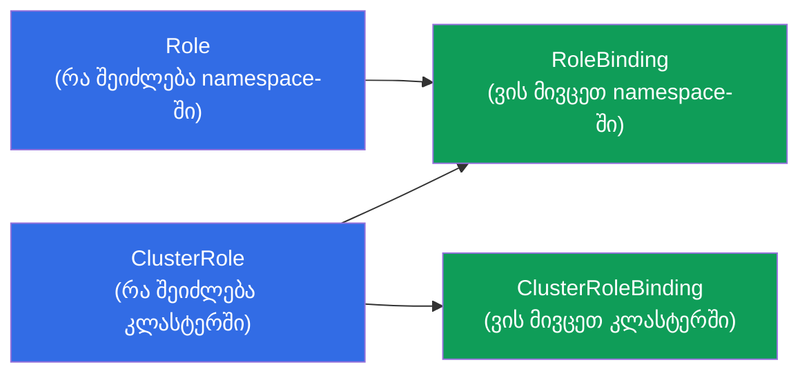
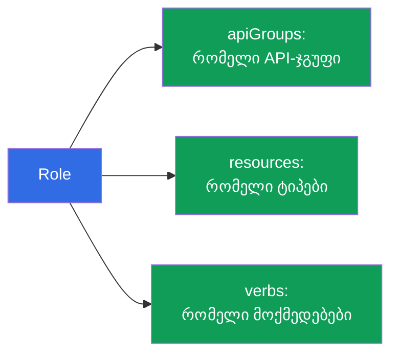
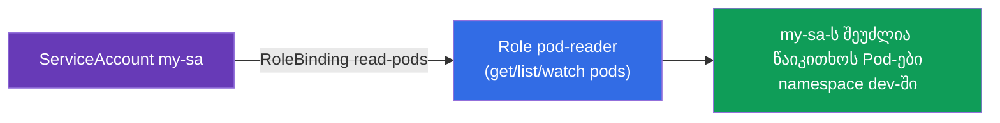
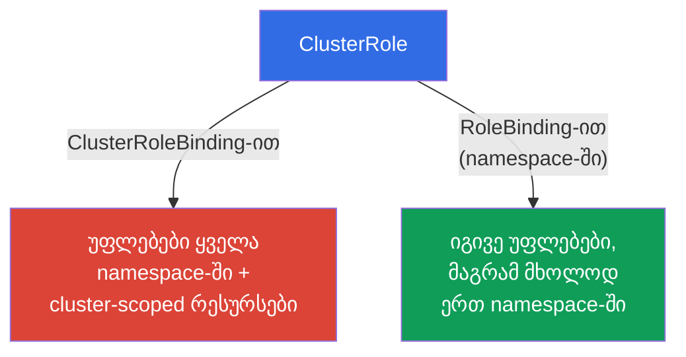
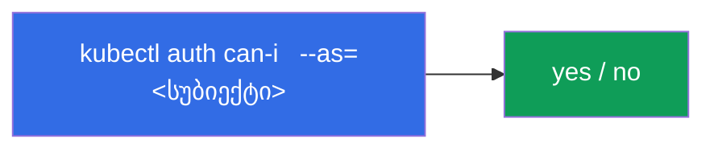
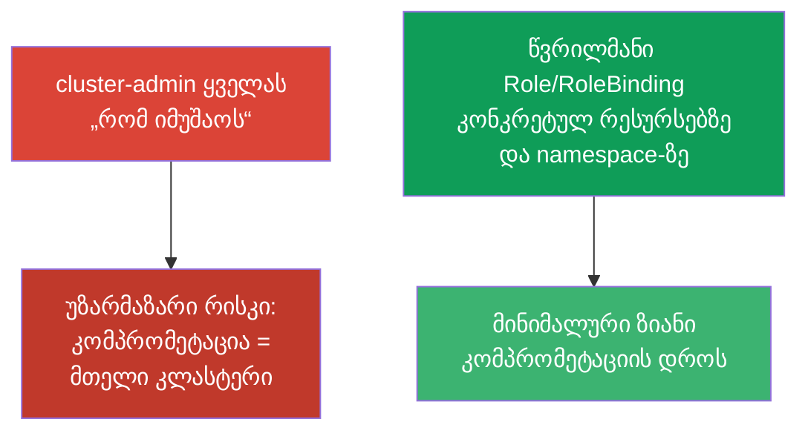

[Русская версия](ru.md) · [Eng version](README.md) · [Versión en español](es.md) · [Version française](fr.md) · [Deutsche Version](de.md) · [繁體中文版](tw.md) · [日本語版](jp.md)

# თავი 38. RBAC: Role, ClusterRole და binding-ები

> 🟦 **თავი CKA-სთვის** (დომენები Cluster Architecture და უსაფრთხოება). სასარგებლოა CKAD-სთვისაც
> (Security).
>
> **რა იქნება შემდეგ.** თავ 21-ში გავიგეთ, რომ ავტორიზაციას Kubernetes-ში აკეთებს **RBAC**.
> ახლა დეტალურად გავარჩევთ: როგორ იკრიბება მომხმარებლებისა და ServiceAccount-ების წვდომა
> ნებართვებისგან (Role/ClusterRole) და მიბმებისგან (RoleBinding/ClusterRoleBinding).
> ეს ხშირი დავალებაა CKA-ზე („მიეცი SA-ს უფლებები X-ზე“) და ნებისმიერი კლასტერის უსაფრთხოების საფუძველი.
> თემის გასაღები - გავიაზროთ ოთხი ობიექტი და როგორ ერწყმის ერთმანეთს.

## 38.1. RBAC-ის ოთხი ობიექტი

RBAC აგებულია „რა შეიძლება“-სა და „ვის მივცეთ ეს“-ის გაყოფაზე. აქედან მოდის ოთხი ობიექტი, წყვილებად:



| ობიექტი | რას აღწერს | არეალი |
|--------|---------------|---------|
| **Role** | ნებართვების ნაკრები | ერთი namespace |
| **ClusterRole** | ნებართვების ნაკრები | მთელი კლასტერი / cluster-scoped რესურსები |
| **RoleBinding** | როლის მიბმა სუბიექტზე | ერთი namespace |
| **ClusterRoleBinding** | როლის მიბმა სუბიექტზე | მთელი კლასტერი |

წესი: **Role/ClusterRole = რა შეიძლება, Binding = ვის მივცეთ**. როლი მიბმის გარეშე არ
მოქმედებს; მიბმა როლის გარეშე შეუძლებელია.

## 38.2. Role: ნებართვები namespace-ში

Role აღწერს, რომელი **მოქმედებები (verbs)** რომელ **რესურსებზე (resources)** არის დაშვებული
კონკრეტულ namespace-ში.

```yaml
apiVersion: rbac.authorization.k8s.io/v1
kind: Role
metadata:
  namespace: dev
  name: pod-reader
rules:
- apiGroups: [""]              # "" — core-ჯგუფი (pods, services, ...)
  resources: ["pods"]
  verbs: ["get", "list", "watch"]
```

გავარჩიოთ `rules`:
- **apiGroups** - რესურსის API-ჯგუფი (`""` - core: pods, services; `apps` - deployments;
  `rbac.authorization.k8s.io` - როლები და ა.შ.);
- **resources** - რესურსების ტიპები (`pods`, `deployments`, `secrets`);
- **verbs** - მოქმედებები: `get`, `list`, `watch`, `create`, `update`, `patch`, `delete`.



## 38.3. RoleBinding: ვის მივცეთ

RoleBinding აკავშირებს Role-ს **სუბიექტთან** - მომხმარებელთან, ჯგუფთან ან ServiceAccount-თან.

```yaml
apiVersion: rbac.authorization.k8s.io/v1
kind: RoleBinding
metadata:
  namespace: dev
  name: read-pods
subjects:
- kind: ServiceAccount        # ან User, ან Group
  name: my-sa
  namespace: dev
roleRef:
  kind: Role
  name: pod-reader            # რომელ როლს ვაბამთ
  apiGroup: rbac.authorization.k8s.io
```



სუბიექტები სამი სახისაა: `User` (ადამიანი, სერტიფიკატიდან/OIDC-დან - თავი 21),
`Group` (ჯგუფი) და `ServiceAccount` (Pod-ებისთვის).

## 38.4. ClusterRole და ClusterRoleBinding

**ClusterRole** საჭიროა ორ შემთხვევაში: (1) უფლებები **cluster-scoped** რესურსებზე (ნოუდები, PV,
namespaces - თავი 6), რომლებიც კონკრეტულ namespace-ში არ არსებობს; (2) რომ **ხელახლა გამოვიყენოთ**
უფლებების ერთი ნაკრები მრავალ namespace-ში.



საინტერესო და მნიშვნელოვანი კომბინაციაა: **ClusterRole + RoleBinding**. ClusterRole განსაზღვრავს
უფლებებს, ხოლო RoleBinding ზღუდავს მათ **ერთი namespace-ით**. ეს საშუალებას გვაძლევს როლი ერთხელ
აღვწეროთ (მაგალითად, `pod-reader` როგორც ClusterRole) და მივაბათ ის სხვადასხვა namespace-ში
RoleBinding-ის მეშვეობით, Role-ის დუბლირების გარეშე.

| კომბინაცია | მოქმედების არეალი |
|-----------|------------------|
| Role + RoleBinding | ერთი namespace |
| ClusterRole + RoleBinding | ერთი namespace (ხელახლა გამოყენებადი როლი) |
| ClusterRole + ClusterRoleBinding | მთელი კლასტერი + cluster-scoped რესურსები |
| Role + ClusterRoleBinding | **შეუძლებელია** (Role მიბმულია namespace-ზე) |

## 38.5. იმპერატიული შექმნა და შემოწმება

RBAC-ობიექტების იმპერატიულად შექმნა მოსახერხებელია (გამოცდაზე უფრო სწრაფია):

```bash
# Role
kubectl create role pod-reader --verb=get,list,watch --resource=pods -n dev

# RoleBinding ServiceAccount-ისთვის
kubectl create rolebinding read-pods \
  --role=pod-reader --serviceaccount=dev:my-sa -n dev

# ClusterRole
kubectl create clusterrole node-reader --verb=get,list --resource=nodes

# ClusterRoleBinding მომხმარებლისთვის
kubectl create clusterrolebinding read-nodes \
  --clusterrole=node-reader --user=alice
```

უფლებების შემოწმება (შეუცვლელია, თავი 21):

```bash
kubectl auth can-i get pods -n dev
kubectl auth can-i delete nodes
kubectl auth can-i list secrets --as=system:serviceaccount:dev:my-sa -n dev
```



`kubectl auth can-i ... --as=...` საშუალებას გვაძლევს შევამოწმოთ უფლებები ნებისმიერი სუბიექტის
**სახელით** - საუკეთესო გზაა დავრწმუნდეთ, რომ RBAC სწორად არის მოწყობილი.

## 38.6. ჩაშენებული ClusterRole-ები

კლასტერში არის მზა ClusterRole-ები „ყველა შემთხვევისთვის“ - სასარგებლოა მათი ცოდნა და ხელახლა გამოყენება:

| ClusterRole | უფლებები |
|-------------|-------|
| `cluster-admin` | ყველაფერი მთელ კლასტერში (სუპერ-უფლებები) |
| `admin` | თითქმის ყველაფერი namespace-ის ფარგლებში |
| `edit` | namespace-ის რესურსების უმეტესობის კითხვა/წერა (RBAC-ის გარდა) |
| `view` | მხოლოდ კითხვა namespace-ში |

ხელით აღწერის ნაცვლად ხშირად აბამენ `view`/`edit`/`admin`-ს გუნდზე მის namespace-ში.
`cluster-admin`-ს უკიდურესად ფრთხილად აძლევენ - ეს სრული წვდომაა ყველაფერზე.

## 38.7. უმცირესი პრივილეგიების პრინციპი

RBAC - მინიმალური პრივილეგიების პრინციპის ინსტრუმენტია (ეხმიანება თავებს 20-21): მივცეთ
ზუსტად იმდენი უფლება, რამდენიც საჭიროა, არა მეტი.



ტიპური შეცდომები: `cluster-admin`-ის დარიგება „რომ არ ვიწვალოთ“, ფართო `*` verbs/resources-ში,
უფლებების მიბმა `default` ServiceAccount-ზე. სწორია - ვიწრო როლები, ცალკე SA-ები (თავი 21),
namespace-ით შეზღუდვა RoleBinding-ის მეშვეობით.

## 38.8. როგორ იყენებენ ამას პროდაქშენში

- **RBAC - მრავალმოიჯარეობის (multitenancy) საფუძველია.** პროდში გუნდები იღებენ წვდომას მხოლოდ
  საკუთარ namespace-ებზე RoleBinding-ის მეშვეობით `edit`/`view`-ზე ან კასტომურ როლებზე. კლასტერის
  ადმინისტრატორების გარდა არავის აქვს `cluster-admin`.
- **ცალკე SA + მინიმალური როლი აპლიკაციაზე.** აპლიკაციებს, რომლებსაც სჭირდებათ წვდომა
  API-სთან (ოპერატორები, კონტროლერები), უშვებენ საკუთარ ServiceAccount-ს (თავი 21) და აძლევენ მკაცრად
  აუცილებელ უფლებებს - რომ Pod-ის კომპრომეტაციამ მთელი კლასტერი არ გააღოს.
- **აუდიტი და უფლებების რევიუ.** RBAC-ს რეგულარულად ამოწმებენ: `kubectl auth can-i --list`, ჭარბი
  `cluster-admin`-ებისა და ფართო `*`-ების ძებნა. ჭარბი უფლებები - ხშირი აღმოჩენაა
  security-რევიუს დროს.
- **ინტეგრაცია გარე identity-სთან.** ადამიან-მომხმარებლებს არ უშვებენ ცალ-ცალკე, არამედ
  OIDC/ჯგუფების მეშვეობით (თავი 21): აბამენ ClusterRole/Role-ს კორპორაციული პროვაიდერის ჯგუფებზე,
  და არა ცალკეულ `User`-ებზე.
- **ClusterRole ხელახლა გამოყენებადი როლებისთვის.** უფლებების საერთო ნაკრებებს აღწერენ როგორც ClusterRole
  და აბამენ RoleBinding-ებით საჭირო namespace-ებში - ეს Role-ის დუბლირებისგან გვიხსნის.

## 38.9. მინი-ლექსიკონი

- **RBAC** - როლებზე დაფუძნებული წვდომის მართვა (ავტორიზაცია Kubernetes-ში).
- **Role** - ნებართვები ერთ namespace-ში.
- **ClusterRole** - ნებართვები კლასტერზე / cluster-scoped რესურსებზე / ხელახლა გამოყენებისთვის.
- **RoleBinding** - როლის მიბმა სუბიექტზე namespace-ში.
- **ClusterRoleBinding** - როლის მიბმა სუბიექტზე მთელ კლასტერზე.
- **rules (apiGroups/resources/verbs)** - რა და რაზე არის დაშვებული.
- **subjects** - ვის ეძლევა უფლებები: User, Group, ServiceAccount.
- **roleRef** - რომელ როლზე მიუთითებს binding.
- **cluster-admin / admin / edit / view** - ჩაშენებული ClusterRole-ები.

## 38.10. თავის შეჯამება

- RBAC = „რა შეიძლება“ (Role/ClusterRole) + „ვის მივცეთ“ (RoleBinding/ClusterRoleBinding);
  როლი მიბმის გარეშე არ მოქმედებს.
- Role/RoleBinding მუშაობს ერთ namespace-ში; ClusterRole/ClusterRoleBinding - მთელ
  კლასტერზე და cluster-scoped რესურსებზე.
- rules განსაზღვრავს apiGroups + resources + verbs; სუბიექტები - User, Group, ServiceAccount.
- ClusterRole + RoleBinding - როლის ხელახლა გამოყენების საშუალებაა, ერთი namespace-ით შეზღუდვით;
  Role + ClusterRoleBinding შეუძლებელია.
- იმპერატიულად: `kubectl create role/rolebinding/clusterrole/clusterrolebinding`; შემოწმება -
  `kubectl auth can-i ... --as=...`.
- არსებობს ჩაშენებული ClusterRole-ები: cluster-admin, admin, edit, view.
- უმცირესი პრივილეგიების პრინციპი: ვიწრო როლები და namespace-ით შეზღუდვა, და არა cluster-admin
  ყველას.

## 38.11. როგორ გამოგადგებათ: გამოცდაზე და რეალურ სამუშაოში

**გამოცდაზე (CKA).** „შექმენი Role/ClusterRole და მიაბი SA-ს/მომხმარებელს“, „მიეცი უფლებები
მხოლოდ Pod-ების წაკითხვაზე namespace-ში“, „შეამოწმე, შეუძლია თუ არა სუბიექტ X-ს“ - ხშირი დავალებებია.
საჭიროა თავდაჯერებულად შევქმნათ ოთხი ობიექტი (უკეთესია იმპერატიულად) და შევამოწმოთ
`auth can-i --as`-ით. Role/ClusterRole × RoleBinding/ClusterRoleBinding კომბინაციების გაგება -
საკვანძოა.

**რეალურ სამუშაოში.** RBAC - კლასტერის უსაფრთხოებისა და მრავალმოიჯარეობის ფუნდამენტია:
გუნდები საკუთარ namespace-ებში, აპლიკაციები მინიმალური უფლებებით ცალკე SA-ების მეშვეობით,
ინტეგრაცია კორპორაციულ identity-სთან. გონივრული RBAC ზღუდავს ზიანს კომპრომეტაციის დროს და
გადის security-აუდიტებს; ჭარბი უფლებები - ტიპური სისუსტეა.

## 38.12. თვითშემოწმების კითხვები

1. რომელი ოთხი ობიექტი ქმნის RBAC-ს და როგორ იყოფა ისინი „რა“-სა და „ვის“-ზე?
2. რითი განსხვავდება Role ClusterRole-ისგან მოქმედების არეალით?
3. რისთვის არის საჭირო კომბინაცია ClusterRole + RoleBinding? რატომ არის შეუძლებელი Role +
   ClusterRoleBinding?
4. რისგან შედგება წესი (rule) და როგორი სუბიექტები არსებობს?
5. როგორ შევქმნათ სწრაფად Role და RoleBinding ServiceAccount-ისთვის იმპერატიულად?
6. როგორ შევამოწმოთ უფლებები კონკრეტული სუბიექტის სახელით, მისი სახელით შესვლის გარეშე?
7. რატომ არის cluster-admin-ის დარიგება ცუდი პრაქტიკა და რა უნდა გავაკეთოთ ამის ნაცვლად?

## პრაქტიკა

ჩვენ გავარჩიეთ ავტორიზაცია. თავ 39-ში - ავთენტიფიკაცია მეორე მხრიდან: TLS-სერტიფიკატები,
kubeconfig და CSR API, ანუ როგორ იღებენ მომხმარებლები და კომპონენტები საერთოდ დამადასტურებელ საბუთებს.
RBAC მუშავდება უსაფრთხოების ლაბორატორიულ სამუშაოებში.

🧪 ლაბი 113 (RBAC + წვდომა ადამიანისთვის CSR-ის მეშვეობით და აპლიკაციისთვის SA-ს მეშვეობით): [tasks/cka/labs/113](../../labs/113/README_GE.MD)

🧪 ლაბი 121 (RBAC-დრილები + შემოწმება auth can-i-ით): [tasks/cka/labs/121](../../labs/121/README_GE.MD)

---
[სარჩევი](../README_GE.md) · [თავი 37](../37/ge.md) · [თავი 39](../39/ge.md)
