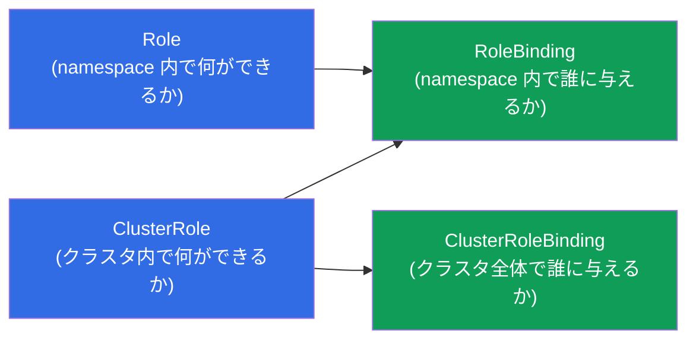
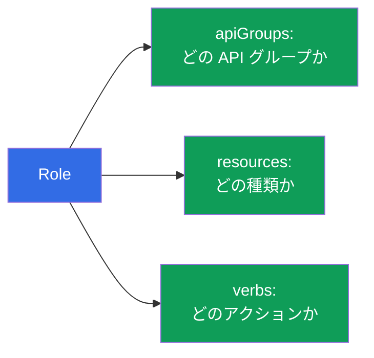
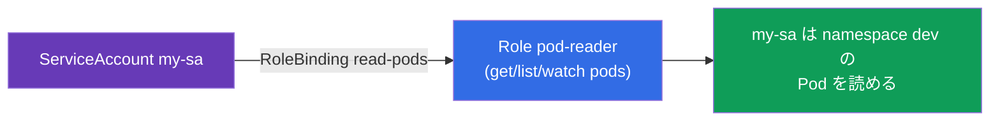
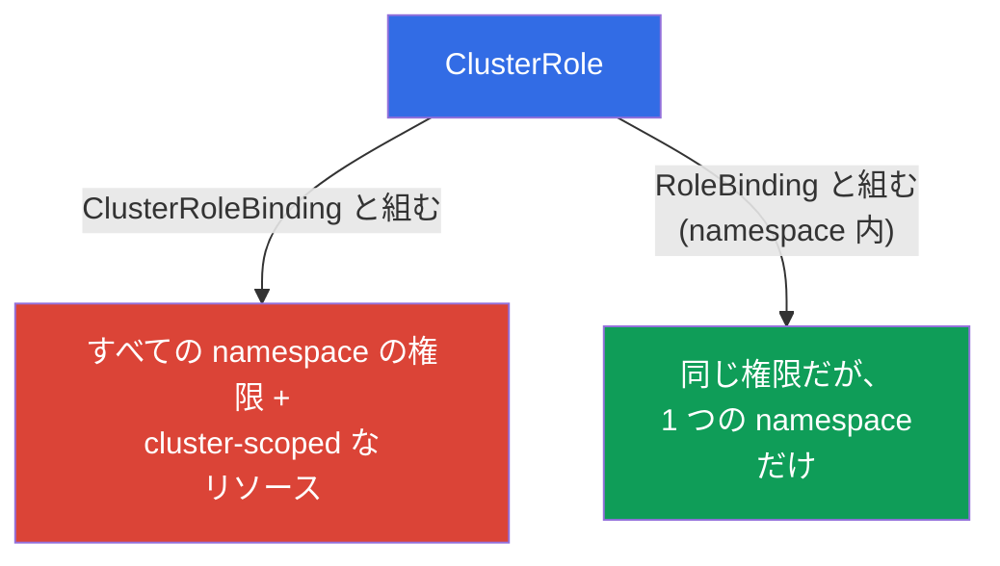
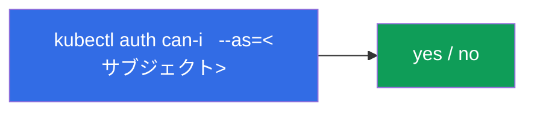
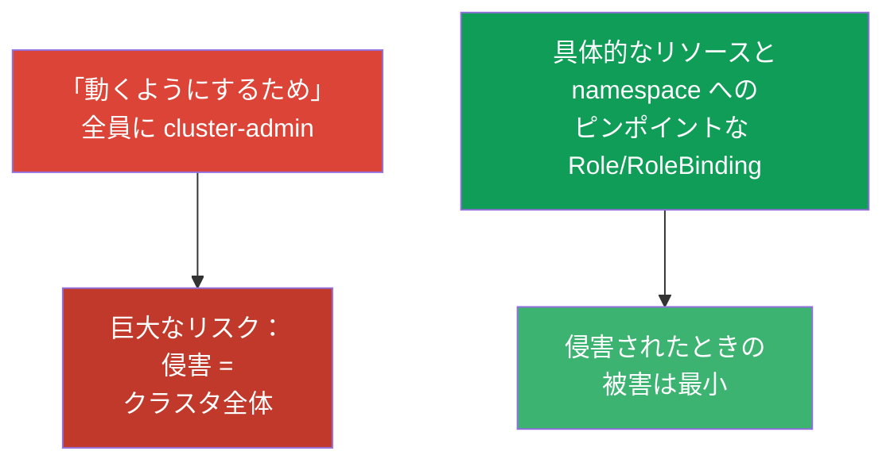

[Русская версия](ru.md) · [Eng version](README.md) · [Versión en español](es.md) · [Version française](fr.md) · [Deutsche Version](de.md) · [ქართული ვერსია](ge.md) · [繁體中文版](tw.md)

# 第 38 章。RBAC：Role、ClusterRole とバインディング

> 🟦 **CKA 向けの章**（Cluster Architecture 領域とセキュリティ）。CKAD (Security) にも
> 役立ちます。
>
> **次に何を。** 第 21 章で、Kubernetes の認可を行うのは **RBAC** だと知りました。
> ここではそれを詳しく分解します：権限 (Role/ClusterRole) とバインディング
> (RoleBinding/ClusterRoleBinding) から、ユーザーと ServiceAccount のためのアクセスが
> どう組み立てられるのか。これは CKA でよく出る課題（「SA に X の権限を与えよ」）であり、
> どのクラスタでもセキュリティの土台です。このテーマの鍵は - 4 つのオブジェクトと、
> それらがどう組み合わさるのかを理解することです。

## 38.1. RBAC の 4 つのオブジェクト

RBAC は「何ができるか」と「誰にそれを与えるか」の分離の上に成り立っています。そこから
4 つのオブジェクトが、ペアで出てきます：



| オブジェクト | 何を記述するか | 範囲 |
|--------|---------------|---------|
| **Role** | 権限のセット | 1 つの namespace |
| **ClusterRole** | 権限のセット | クラスタ全体 / cluster-scoped なリソース |
| **RoleBinding** | ロールをサブジェクトに結び付ける | 1 つの namespace |
| **ClusterRoleBinding** | ロールをサブジェクトに結び付ける | クラスタ全体 |

ルール：**Role/ClusterRole = 何ができるか、Binding = 誰に与えるか**。バインディングのない
ロールは効きません。ロールのないバインディングは作れません。

## 38.2. Role：namespace 内の権限

Role は、特定の namespace の中でどの **リソース (resources)** に対するどの
**アクション (verbs)** が許可されるかを記述します。

```yaml
apiVersion: rbac.authorization.k8s.io/v1
kind: Role
metadata:
  namespace: dev
  name: pod-reader
rules:
- apiGroups: [""]              # "" — core グループ (pods, services, ...)
  resources: ["pods"]
  verbs: ["get", "list", "watch"]
```

`rules` を分解しましょう：
- **apiGroups** - リソースの API グループ (`""` - core：pods, services；`apps` - deployments；
  `rbac.authorization.k8s.io` - ロールなど)；
- **resources** - リソースの種類 (`pods`, `deployments`, `secrets`)；
- **verbs** - アクション：`get`, `list`, `watch`, `create`, `update`, `patch`, `delete`。



## 38.3. RoleBinding：誰に与えるか

RoleBinding は Role を **サブジェクト** - ユーザー、グループ、または ServiceAccount -
に結び付けます。

```yaml
apiVersion: rbac.authorization.k8s.io/v1
kind: RoleBinding
metadata:
  namespace: dev
  name: read-pods
subjects:
- kind: ServiceAccount        # または User、または Group
  name: my-sa
  namespace: dev
roleRef:
  kind: Role
  name: pod-reader            # どのロールを結び付けるか
  apiGroup: rbac.authorization.k8s.io
```



サブジェクトには 3 種類あります：`User`（人間、証明書/OIDC から - 第 21 章）、
`Group`（グループ）、`ServiceAccount`（Pod のため）。

## 38.4. ClusterRole と ClusterRoleBinding

**ClusterRole** が必要なのは 2 つの場合です：(1) 特定の namespace には存在しない
**cluster-scoped** なリソース（ノード、PV、namespaces - 第 6 章）への権限；(2) 1 つの
権限セットを多くの namespace で **再利用** するため。



興味深く重要な組み合わせ：**ClusterRole + RoleBinding**。ClusterRole が権限を定義し、
RoleBinding がそれを **1 つの namespace** に限定します。これによりロールを一度だけ記述し
（たとえば `pod-reader` を ClusterRole として）、Role を重複させずに RoleBinding で
さまざまな namespace に結び付けられます。

| 組み合わせ | 有効範囲 |
|-----------|------------------|
| Role + RoleBinding | 1 つの namespace |
| ClusterRole + RoleBinding | 1 つの namespace（再利用可能なロール） |
| ClusterRole + ClusterRoleBinding | クラスタ全体 + cluster-scoped なリソース |
| Role + ClusterRoleBinding | **不可能**（Role は namespace に紐づく） |

## 38.5. 命令的な作成と確認

RBAC のオブジェクトは命令的に作るのが便利です（試験ではそのほうが速い）：

```bash
# Role
kubectl create role pod-reader --verb=get,list,watch --resource=pods -n dev

# ServiceAccount のための RoleBinding
kubectl create rolebinding read-pods \
  --role=pod-reader --serviceaccount=dev:my-sa -n dev

# ClusterRole
kubectl create clusterrole node-reader --verb=get,list --resource=nodes

# ユーザーのための ClusterRoleBinding
kubectl create clusterrolebinding read-nodes \
  --clusterrole=node-reader --user=alice
```

権限の確認（欠かせません、第 21 章）：

```bash
kubectl auth can-i get pods -n dev
kubectl auth can-i delete nodes
kubectl auth can-i list secrets --as=system:serviceaccount:dev:my-sa -n dev
```



`kubectl auth can-i ... --as=...` は任意のサブジェクト **の立場で** 権限を確認できます -
RBAC が正しく設定されていることを確かめる最良の方法です。

## 38.6. 組み込みの ClusterRole

クラスタには「あらゆる場合のための」既製の ClusterRole があります - 知っておいて
再利用すると役に立ちます：

| ClusterRole | 権限 |
|-------------|-------|
| `cluster-admin` | クラスタ全体のすべて（スーパー権限） |
| `admin` | namespace の範囲でほぼすべて |
| `edit` | namespace のほとんどのリソースを読み書き（RBAC を除く） |
| `view` | namespace 内で読み取りのみ |

手で記述する代わりに、`view`/`edit`/`admin` をチームの namespace でそのチームに結び付ける
ことがよくあります。`cluster-admin` は極めて慎重に与えます - すべてへの完全なアクセスです。

## 38.7. 最小権限の原則

RBAC は最小権限の原則のための道具です（第 20-21 章と響き合います）：必要なだけの権限を
ちょうど与え、それ以上は与えません。



典型的な誤り：「面倒を避けるため」に `cluster-admin` をばらまく、verbs/resources に広い `*`
を書く、`default` ServiceAccount に権限を結び付ける。正しいのは - 狭いロール、個別の SA
（第 21 章）、RoleBinding による namespace への限定です。

## 38.8. 本番環境でこれをどう使うか

- **RBAC はマルチテナンシーの土台。** 本番ではチームは、`edit`/`view` またはカスタムの
  ロールへの RoleBinding を通して、自分の namespace だけにアクセスできます。クラスタ
  管理者以外は誰も `cluster-admin` を持ちません。
- **アプリケーションごとに個別の SA + 最小のロール。** API へのアクセスが必要な
  アプリケーション（オペレーター、コントローラー）には専用の ServiceAccount（第 21 章）を
  用意し、厳密に必要な権限だけを与えます - Pod の侵害でクラスタ全体が開かないようにするためです。
- **権限の監査とレビュー。** RBAC は定期的に監査します：`kubectl auth can-i --list`、
  過剰な `cluster-admin` と広い `*` の探索。過剰な権限は security レビューでよく見つかる
  ものです。
- **外部 identity との統合。** 人間のユーザーは一人ずつ登録するのではなく、OIDC/グループを
  通して扱います（第 21 章）：個別の `User` ではなく、企業プロバイダーのグループに
  ClusterRole/Role を結び付けます。
- **再利用可能なロールのための ClusterRole。** 共通の権限セットは ClusterRole として記述し、
  必要な namespace で RoleBinding によって結び付けます - これで Role の重複がなくなります。

## 38.9. ミニ用語集

- **RBAC** - ロールに基づくアクセス制御（Kubernetes における認可）。
- **Role** - 1 つの namespace 内の権限。
- **ClusterRole** - クラスタ / cluster-scoped なリソースへの権限 / 再利用のための権限。
- **RoleBinding** - namespace 内でロールをサブジェクトに結び付けるもの。
- **ClusterRoleBinding** - クラスタ全体でロールをサブジェクトに結び付けるもの。
- **rules (apiGroups/resources/verbs)** - 何に対して何が許可されるか。
- **subjects** - 誰に権限を与えるか：User、Group、ServiceAccount。
- **roleRef** - バインディングがどのロールを参照するか。
- **cluster-admin / admin / edit / view** - 組み込みの ClusterRole。

## 38.10. 本章のまとめ

- RBAC = 「何ができるか」(Role/ClusterRole) + 「誰に与えるか」(RoleBinding/ClusterRoleBinding)；
  バインディングのないロールは効きません。
- Role/RoleBinding は 1 つの namespace で働きます。ClusterRole/ClusterRoleBinding は
  クラスタ全体と cluster-scoped なリソースに働きます。
- rules は apiGroups + resources + verbs を指定します。サブジェクトは User、Group、ServiceAccount。
- ClusterRole + RoleBinding は、ロールを 1 つの namespace に限定しつつ再利用する方法です。
  Role + ClusterRoleBinding は不可能です。
- 命令的には：`kubectl create role/rolebinding/clusterrole/clusterrolebinding`。確認は
  `kubectl auth can-i ... --as=...`。
- 組み込みの ClusterRole があります：cluster-admin, admin, edit, view。
- 最小権限の原則：全員に cluster-admin ではなく、狭いロールと namespace への限定を。

## 38.11. これがどう役に立つか：試験と実際の仕事で

**試験では (CKA)。**「Role/ClusterRole を作って SA/ユーザーに結び付けよ」「namespace 内で
Pod の読み取りだけの権限を与えよ」「サブジェクト X ができるか確認せよ」はよく出る課題です。
4 つのオブジェクトを自信をもって作れること（できれば命令的に）、そして
`auth can-i --as` で確認できることが必要です。Role/ClusterRole × RoleBinding/ClusterRoleBinding
の組み合わせの理解が鍵です。

**実際の仕事では。** RBAC はクラスタのセキュリティとマルチテナンシーの基盤です：
チームは自分の namespace で、アプリケーションは個別の SA で最小権限で、そして企業の
identity との統合。適切な RBAC は侵害されたときの被害を抑え、security 監査を通ります。
過剰な権限は典型的な脆弱性です。

## 38.12. 自己チェックの質問

1. RBAC を構成する 4 つのオブジェクトは何で、「何を」と「誰に」にどう分かれますか？
2. Role は ClusterRole と有効範囲でどう違いますか？
3. ClusterRole + RoleBinding の組み合わせは何のために必要ですか？なぜ Role +
   ClusterRoleBinding は不可能なのですか？
4. ルール (rule) は何から成り、サブジェクトにはどんな種類がありますか？
5. ServiceAccount のための Role と RoleBinding を命令的に素早く作るには？
6. あるサブジェクトになりきらずに、そのサブジェクトの立場で権限を確認するには？
7. なぜ cluster-admin をばらまくのは悪い習慣で、代わりに何をすべきですか？

## 演習

認可を分解しました。第 39 章では - 反対側からの認証：TLS 証明書、kubeconfig と CSR API、
つまりユーザーとコンポーネントがそもそもどうやって身元証明を受け取るのか。RBAC は
セキュリティのラボで練習します。

🧪 ラボ 113（RBAC + CSR を通した人間へのアクセスと SA を通したアプリケーションへのアクセス）: [tasks/cka/labs/113](../../labs/113/README_JP.MD)

🧪 ラボ 121（RBAC ドリル + auth can-i による確認）: [tasks/cka/labs/121](../../labs/121/README_JP.MD)

🎮 Killercoda（ブラウザ内、セットアップ不要）：[Create a Role and Role Binding](https://killercoda.com/chadmcrowell/course/cka/create-role) · [Create a Cluster Role and Role Binding](https://killercoda.com/chadmcrowell/course/cka/create-cluster-role) · [Role and RoleBinding](https://killercoda.com/chadmcrowell/course/ckad/role-rolebinding) · [Create New User](https://killercoda.com/chadmcrowell/course/cka/kubernetes-create-user)

---
[目次](../README_JP.md) · [第 37 章](../37/jp.md) · [第 39 章](../39/jp.md)
