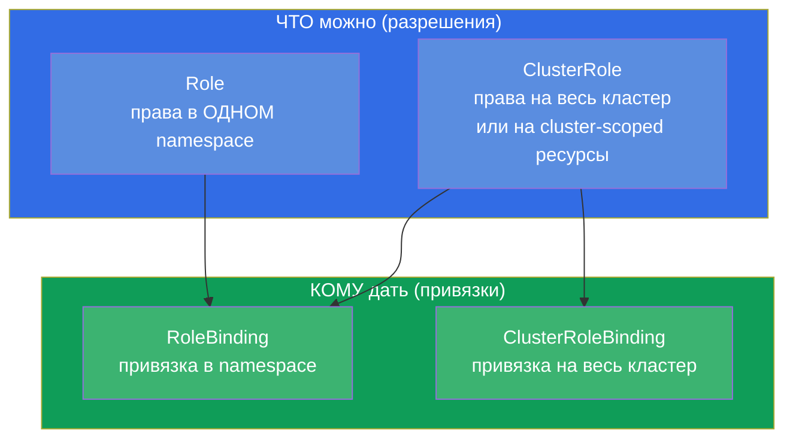
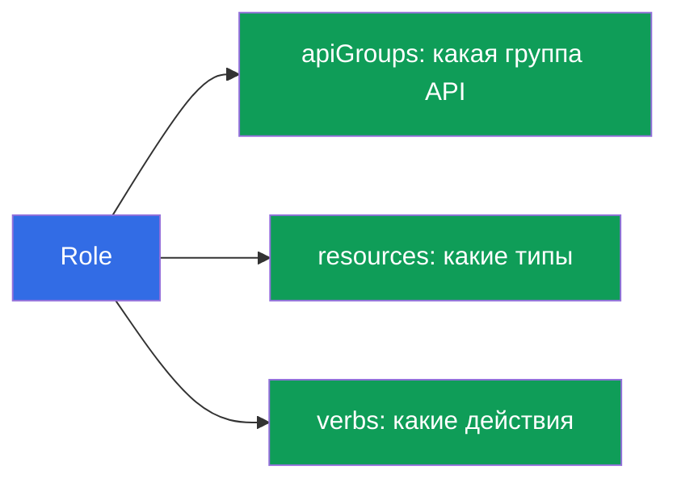
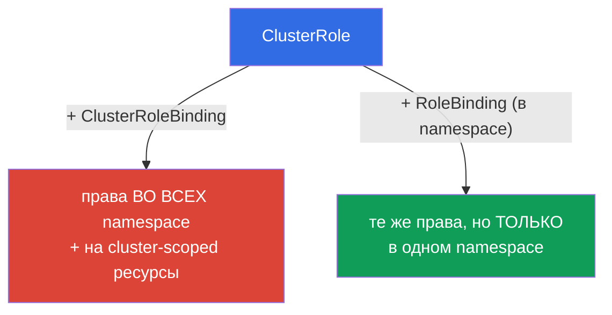
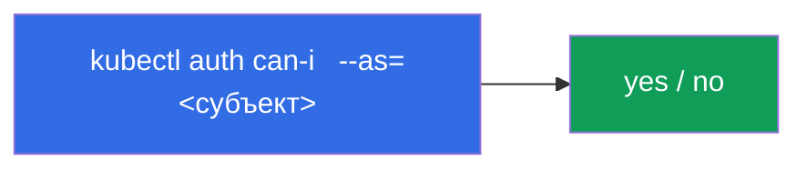
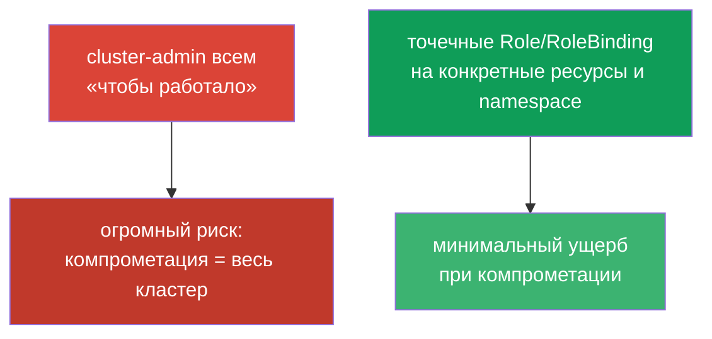

# Глава 38. RBAC: Role, ClusterRole и binding'и

> 🟦 **Глава для CKA** (домены Cluster Architecture и безопасность). Полезна и для CKAD
> (Security).
>
> **Что дальше.** В главе 21 мы узнали, что авторизацию в Kubernetes делает **RBAC**.
> Теперь разберём его детально: как из разрешений (Role/ClusterRole) и привязок
> (RoleBinding/ClusterRoleBinding) собирается доступ для пользователей и ServiceAccount.
> Это частое задание CKA («дай SA права на X») и основа безопасности любого кластера.
> Ключ к теме - понять четыре объекта и как они сочетаются.

## 38.1. Четыре объекта RBAC

RBAC строится на разделении «что можно» и «кому это дать». Отсюда четыре объекта, парами:



| Объект | Что описывает | Область |
|--------|---------------|---------|
| **Role** | набор разрешений | один namespace |
| **ClusterRole** | набор разрешений | весь кластер / cluster-scoped ресурсы |
| **RoleBinding** | привязка роли к субъекту | один namespace |
| **ClusterRoleBinding** | привязка роли к субъекту | весь кластер |

Правило: **Role/ClusterRole = что можно, Binding = кому дать**. Роль без привязки не
действует; привязка без роли невозможна.

## 38.2. Role: разрешения в namespace

Role описывает, какие **действия (verbs)** над какими **ресурсами (resources)** разрешены
в конкретном namespace.

```yaml
apiVersion: rbac.authorization.k8s.io/v1
kind: Role
metadata:
  namespace: dev
  name: pod-reader
rules:
- apiGroups: [""]              # "" — core-группа (pods, services, ...)
  resources: ["pods"]
  verbs: ["get", "list", "watch"]
```

Разберём `rules`:
- **apiGroups** - группа API ресурса (`""` - core: pods, services; `apps` - deployments;
  `rbac.authorization.k8s.io` - роли и т.д.);
- **resources** - типы ресурсов (`pods`, `deployments`, `secrets`);
- **verbs** - действия: `get`, `list`, `watch`, `create`, `update`, `patch`, `delete`.



## 38.3. RoleBinding: кому дать

RoleBinding связывает Role с **субъектом** - пользователем, группой или ServiceAccount.

```yaml
apiVersion: rbac.authorization.k8s.io/v1
kind: RoleBinding
metadata:
  namespace: dev
  name: read-pods
subjects:
- kind: ServiceAccount        # или User, или Group
  name: my-sa
  namespace: dev
roleRef:
  kind: Role
  name: pod-reader            # какую роль привязываем
  apiGroup: rbac.authorization.k8s.io
```


Субъекты бывают трёх видов: `User` (человек, из сертификата/OIDC - глава 21),
`Group` (группа) и `ServiceAccount` (для подов).

## 38.4. ClusterRole и ClusterRoleBinding

**ClusterRole** нужен в двух случаях: (1) права на **cluster-scoped** ресурсы (ноды, PV,
namespaces - глава 6), которых нет в конкретном namespace; (2) чтобы **переиспользовать**
один набор прав во многих namespace.



Интересная и важная комбинация: **ClusterRole + RoleBinding**. ClusterRole определяет
права, а RoleBinding ограничивает их **одним namespace**. Это позволяет описать роль один
раз (например, `pod-reader` как ClusterRole) и привязывать её в разных namespace через
RoleBinding, не дублируя Role.

| Комбинация | Область действия |
|-----------|------------------|
| Role + RoleBinding | один namespace |
| ClusterRole + RoleBinding | один namespace (переиспользуемая роль) |
| ClusterRole + ClusterRoleBinding | весь кластер + cluster-scoped ресурсы |
| Role + ClusterRoleBinding | **невозможно** (Role привязана к namespace) |

## 38.5. Императивное создание и проверка

RBAC-объекты удобно создавать императивно (быстрее на экзамене):

```bash
# Role
kubectl create role pod-reader --verb=get,list,watch --resource=pods -n dev

# RoleBinding для ServiceAccount
kubectl create rolebinding read-pods \
  --role=pod-reader --serviceaccount=dev:my-sa -n dev

# ClusterRole
kubectl create clusterrole node-reader --verb=get,list --resource=nodes

# ClusterRoleBinding для пользователя
kubectl create clusterrolebinding read-nodes \
  --clusterrole=node-reader --user=alice
```

Проверка прав (незаменимо, глава 21):

```bash
kubectl auth can-i get pods -n dev
kubectl auth can-i delete nodes
kubectl auth can-i list secrets --as=system:serviceaccount:dev:my-sa -n dev
```



`kubectl auth can-i ... --as=...` позволяет проверить права **за** любого субъекта - лучший
способ убедиться, что RBAC настроен верно.

## 38.6. Встроенные ClusterRole

В кластере есть готовые ClusterRole «на все случаи» - их полезно знать и переиспользовать:

| ClusterRole | Права |
|-------------|-------|
| `cluster-admin` | всё во всём кластере (супер-права) |
| `admin` | почти всё в пределах namespace |
| `edit` | читать/писать большинство ресурсов namespace (кроме RBAC) |
| `view` | только чтение в namespace |

Вместо ручного описания часто привязывают `view`/`edit`/`admin` к команде в её namespace.
`cluster-admin` дают крайне осторожно - это полный доступ ко всему.

## 38.7. Принцип наименьших привилегий

RBAC - инструмент принципа минимальных привилегий (перекликается с главами 20-21): давать
ровно столько прав, сколько нужно, не больше.



Типичные ошибки: раздача `cluster-admin` «чтобы не возиться», широкие `*` в verbs/resources,
привязка прав к `default` ServiceAccount. Правильно - узкие роли, отдельные SA (глава 21),
namespace-ограничение через RoleBinding.

## 38.8. Как это применяют в продакшене

- **RBAC - основа мультитенантности.** В проде команды получают доступ только к своим
  namespace через RoleBinding на `edit`/`view` или кастомные роли. Никто, кроме
  администраторов кластера, не имеет `cluster-admin`.
- **Отдельный SA + минимальная роль на приложение.** Приложениям, которым нужен доступ к
  API (операторы, контроллеры), заводят свой ServiceAccount (глава 21) и дают строго
  необходимые права - чтобы компрометация пода не открыла весь кластер.
- **Аудит и ревью прав.** RBAC регулярно аудируют: `kubectl auth can-i --list`, поиск
  избыточных `cluster-admin` и широких `*`. Избыточные права - частая находка при
  security-ревью.
- **Интеграция с внешней identity.** Пользователей-людей заводят не поштучно, а через
  OIDC/группы (глава 21): привязывают ClusterRole/Role к группам из корпоративного
  провайдера, а не к отдельным `User`.
- **ClusterRole для переиспользуемых ролей.** Общие наборы прав описывают как ClusterRole
  и привязывают RoleBinding'ами в нужных namespace - это избавляет от дублирования Role.

## 38.9. Мини-глоссарий

- **RBAC** - управление доступом на основе ролей (авторизация в Kubernetes).
- **Role** - разрешения в одном namespace.
- **ClusterRole** - разрешения на кластер / cluster-scoped ресурсы / для переиспользования.
- **RoleBinding** - привязка роли к субъекту в namespace.
- **ClusterRoleBinding** - привязка роли к субъекту на весь кластер.
- **rules (apiGroups/resources/verbs)** - что и над чем разрешено.
- **subjects** - кому даются права: User, Group, ServiceAccount.
- **roleRef** - на какую роль ссылается binding.
- **cluster-admin / admin / edit / view** - встроенные ClusterRole.

## 38.10. Итоги главы

- RBAC = «что можно» (Role/ClusterRole) + «кому дать» (RoleBinding/ClusterRoleBinding);
  роль без привязки не действует.
- Role/RoleBinding работают в одном namespace; ClusterRole/ClusterRoleBinding - на весь
  кластер и cluster-scoped ресурсы.
- rules задают apiGroups + resources + verbs; субъекты - User, Group, ServiceAccount.
- ClusterRole + RoleBinding - способ переиспользовать роль, ограничив её одним namespace;
  Role + ClusterRoleBinding невозможно.
- Императивно: `kubectl create role/rolebinding/clusterrole/clusterrolebinding`; проверка -
  `kubectl auth can-i ... --as=...`.
- Есть встроенные ClusterRole: cluster-admin, admin, edit, view.
- Принцип наименьших привилегий: узкие роли и namespace-ограничение, а не cluster-admin
  всем.

## 38.11. Как это пригодится: на экзамене и в реальной работе

**На экзамене (CKA).** «Создай Role/ClusterRole и привяжи к SA/пользователю», «дай права
только на чтение подов в namespace», «проверь, может ли субъект X» - частые задания.
Нужно уверенно создавать четыре объекта (лучше императивно) и проверять через
`auth can-i --as`. Понимание комбинаций Role/ClusterRole × RoleBinding/ClusterRoleBinding -
ключевое.

**В реальной работе.** RBAC - фундамент безопасности и мультитенантности кластера:
команды в своих namespace, приложения с минимальными правами через отдельные SA,
интеграция с корпоративной identity. Грамотный RBAC ограничивает ущерб при компрометации и
проходит security-аудиты; избыточные права - типичная уязвимость.

## 38.12. Вопросы для самопроверки

1. Какие четыре объекта образуют RBAC и как они делятся на «что» и «кому»?
2. Чем Role отличается от ClusterRole по области действия?
3. Зачем нужна комбинация ClusterRole + RoleBinding? Почему невозможно Role +
   ClusterRoleBinding?
4. Из чего состоит правило (rule) и какие бывают субъекты?
5. Как быстро создать Role и RoleBinding для ServiceAccount императивно?
6. Как проверить права за конкретный субъект, не входя под ним?
7. Почему раздача cluster-admin - плохая практика и что делать вместо этого?

## Практика

Мы разобрали авторизацию. В главе 39 - аутентификация с другой стороны: TLS-сертификаты,
kubeconfig и CSR API, то есть как пользователи и компоненты вообще получают удостоверения.
RBAC отрабатывается в лабах по безопасности.

🧪 Лаба 121 (RBAC-дриллы + проверка через auth can-i): [tasks/cka/labs/121](../../labs/121/README_RU.MD)

---
[Оглавление](../README_RU.md) · [Глава 37](../37/ru.md) · [Глава 39](../39/ru.md)
