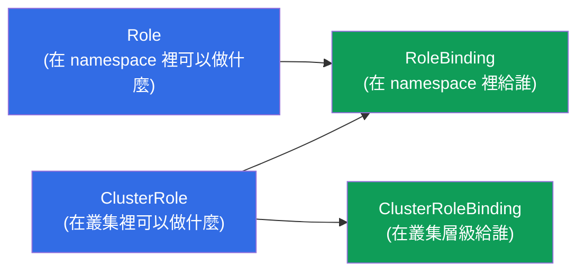
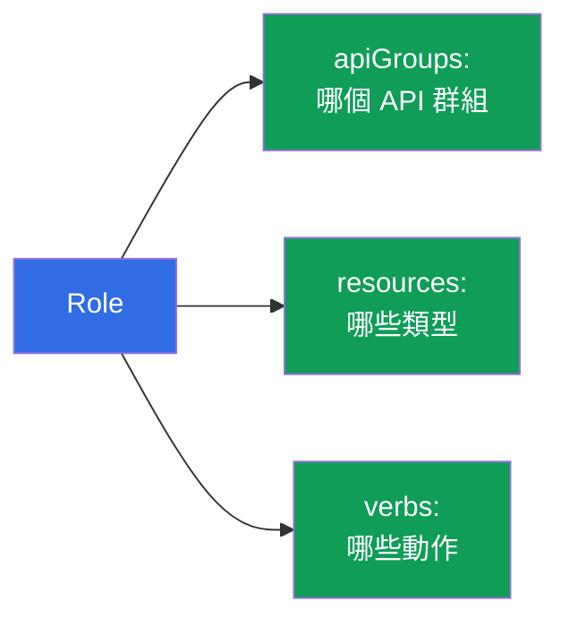
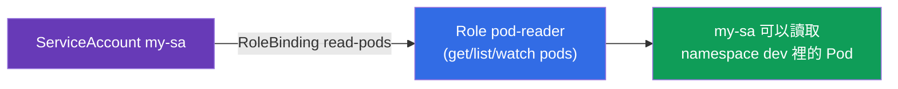
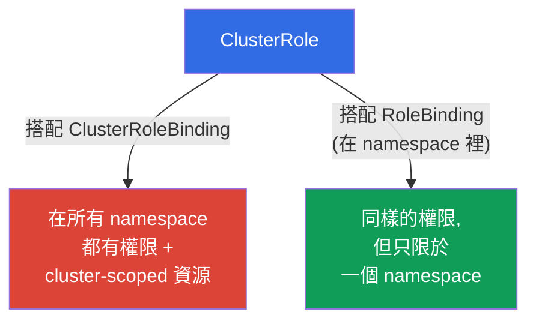
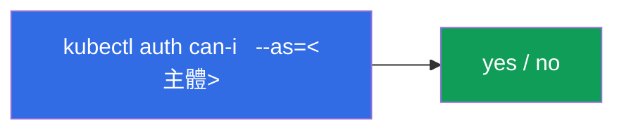
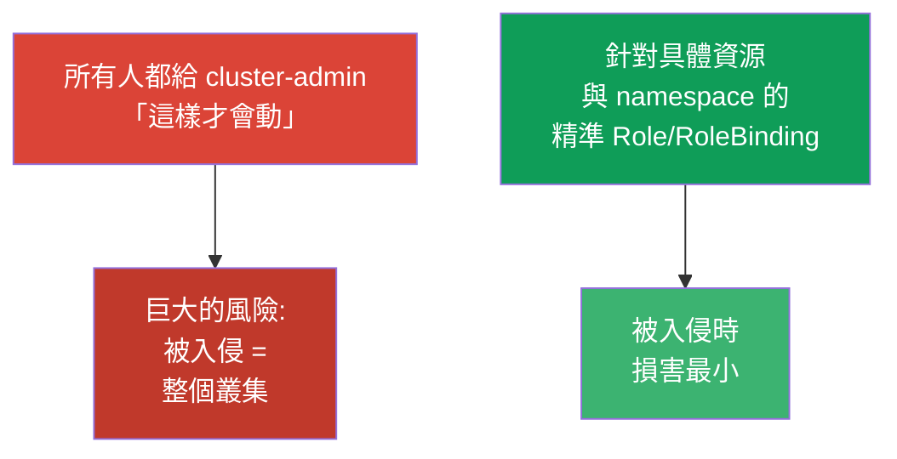

[Русская версия](ru.md) · [Eng version](README.md) · [Versión en español](es.md) · [Version française](fr.md) · [Deutsche Version](de.md) · [ქართული ვერსია](ge.md) · [日本語版](jp.md)

# 第 38 章。RBAC:Role、ClusterRole 與 binding

> 🟦 **CKA 章節**(領域 Cluster Architecture 與安全)。對 CKAD 也有用
> (Security)。
>
> **接下來是什麼。** 在第 21 章我們知道了 Kubernetes 的授權是由 **RBAC** 負責的。
> 現在來詳細拆解它:如何用權限(Role/ClusterRole)與繫結
> (RoleBinding/ClusterRoleBinding)組出使用者與 ServiceAccount 的存取權。
> 這是 CKA 常見的題目(「給某個 SA X 的權限」),也是任何叢集安全的基礎。
> 這個主題的關鍵 - 理解四個物件以及它們怎麼搭配。

## 38.1. RBAC 的四個物件

RBAC 建立在「可以做什麼」與「給誰」的分離之上。由此得到四個物件,成對出現:



| 物件 | 描述什麼 | 範圍 |
|--------|---------------|---------|
| **Role** | 一組權限 | 單一 namespace |
| **ClusterRole** | 一組權限 | 整個叢集 / cluster-scoped 資源 |
| **RoleBinding** | 把角色繫結到主體 | 單一 namespace |
| **ClusterRoleBinding** | 把角色繫結到主體 | 整個叢集 |

規則:**Role/ClusterRole = 可以做什麼,Binding = 給誰**。沒有繫結的角色不會
生效;沒有角色的繫結則不可能存在。

## 38.2. Role:namespace 裡的權限

Role 描述在某個具體的 namespace 裡,允許對哪些**資源(resources)**做哪些
**動作(verbs)**。

```yaml
apiVersion: rbac.authorization.k8s.io/v1
kind: Role
metadata:
  namespace: dev
  name: pod-reader
rules:
- apiGroups: [""]              # "" - core 群組(pods、services、...)
  resources: ["pods"]
  verbs: ["get", "list", "watch"]
```

我們來拆解 `rules`:
- **apiGroups** - 資源的 API 群組(`""` - core:pods、services;`apps` - deployments;
  `rbac.authorization.k8s.io` - 角色等等);
- **resources** - 資源的類型(`pods`、`deployments`、`secrets`);
- **verbs** - 動作:`get`、`list`、`watch`、`create`、`update`、`patch`、`delete`。



## 38.3. RoleBinding:給誰

RoleBinding 把 Role 與**主體**繫結起來 - 主體可以是使用者、群組或 ServiceAccount。

```yaml
apiVersion: rbac.authorization.k8s.io/v1
kind: RoleBinding
metadata:
  namespace: dev
  name: read-pods
subjects:
- kind: ServiceAccount        # 或 User,或 Group
  name: my-sa
  namespace: dev
roleRef:
  kind: Role
  name: pod-reader            # 要繫結哪個角色
  apiGroup: rbac.authorization.k8s.io
```



主體有三種:`User`(人,來自憑證/OIDC - 第 21 章)、
`Group`(群組)與 `ServiceAccount`(給 Pod 用)。

## 38.4. ClusterRole 與 ClusterRoleBinding

**ClusterRole** 在兩種情況下會用到:(1)對 **cluster-scoped** 資源(節點、PV、
namespaces - 第 6 章)的權限,這些資源不屬於某個具體的 namespace;(2)為了在多個
namespace 裡**重複使用**同一組權限。



有一個有趣又重要的組合:**ClusterRole + RoleBinding**。ClusterRole 定義權限,
而 RoleBinding 把它們限制在**一個 namespace** 裡。這讓你可以只描述一次角色
(例如把 `pod-reader` 寫成 ClusterRole),再用 RoleBinding 在不同的 namespace 裡
繫結它,而不用重複建立 Role。

| 組合 | 作用範圍 |
|-----------|------------------|
| Role + RoleBinding | 單一 namespace |
| ClusterRole + RoleBinding | 單一 namespace(可重複使用的角色) |
| ClusterRole + ClusterRoleBinding | 整個叢集 + cluster-scoped 資源 |
| Role + ClusterRoleBinding | **不可能**(Role 綁在 namespace 上) |

## 38.5. 命令式建立與檢查

RBAC 物件用命令式建立很方便(考試時比較快):

```bash
# Role
kubectl create role pod-reader --verb=get,list,watch --resource=pods -n dev

# 給 ServiceAccount 的 RoleBinding
kubectl create rolebinding read-pods \
  --role=pod-reader --serviceaccount=dev:my-sa -n dev

# ClusterRole
kubectl create clusterrole node-reader --verb=get,list --resource=nodes

# 給使用者的 ClusterRoleBinding
kubectl create clusterrolebinding read-nodes \
  --clusterrole=node-reader --user=alice
```

檢查權限(不可或缺,第 21 章):

```bash
kubectl auth can-i get pods -n dev
kubectl auth can-i delete nodes
kubectl auth can-i list secrets --as=system:serviceaccount:dev:my-sa -n dev
```



`kubectl auth can-i ... --as=...` 讓你可以**代替**任何主體檢查權限 -
這是確認 RBAC 設定正確的最好方法。

## 38.6. 內建的 ClusterRole

叢集裡有現成的、「應付各種場合」的 ClusterRole - 知道並重複使用它們很有幫助:

| ClusterRole | 權限 |
|-------------|-------|
| `cluster-admin` | 整個叢集裡的一切(超級權限) |
| `admin` | namespace 範圍內幾乎所有事 |
| `edit` | 讀寫 namespace 裡大多數資源(RBAC 除外) |
| `view` | namespace 裡只能讀取 |

比起手動描述,常見做法是把 `view`/`edit`/`admin` 繫結給團隊在它自己的 namespace 裡。
`cluster-admin` 要極為謹慎地給 - 那是對一切的完整存取權。

## 38.7. 最小權限原則

RBAC 是最小權限原則的工具(與第 20-21 章相呼應):只給剛好夠用的權限,不多給。



典型的錯誤:為了「省麻煩」到處發 `cluster-admin`、在 verbs/resources 裡用寬鬆的 `*`、
把權限繫結到 `default` ServiceAccount。正確做法 - 窄的角色、獨立的 SA(第 21 章)、
用 RoleBinding 做 namespace 限制。

## 38.8. 生產環境怎麼用

- **RBAC 是多租戶的基礎。** 在生產環境中,團隊只透過繫結 `edit`/`view` 或自訂角色的
  RoleBinding 取得自己 namespace 的存取權。除了叢集管理員,沒有人擁有
  `cluster-admin`。
- **每個應用一個獨立的 SA + 最小的角色。** 需要存取 API 的應用(operator、controller)
  會建立自己的 ServiceAccount(第 21 章),只給嚴格必要的權限 - 這樣某個 Pod
  被入侵時不會打開整個叢集。
- **權限的稽核與審視。** RBAC 會定期稽核:`kubectl auth can-i --list`、尋找多餘的
  `cluster-admin` 與寬鬆的 `*`。過多的權限是 security review 常見的發現。
- **與外部 identity 整合。** 人類使用者不是一個一個建立,而是透過 OIDC/群組
  (第 21 章):把 ClusterRole/Role 繫結到企業提供者的群組,而不是個別的 `User`。
- **用 ClusterRole 做可重複使用的角色。** 通用的權限集合描述成 ClusterRole,
  再用 RoleBinding 繫結到需要的 namespace - 這樣就不用重複建立 Role。

## 38.9. 迷你詞彙表

- **RBAC** - 基於角色的存取控制(Kubernetes 裡的授權)。
- **Role** - 單一 namespace 裡的權限。
- **ClusterRole** - 叢集層級 / cluster-scoped 資源的權限 / 供重複使用。
- **RoleBinding** - 在 namespace 裡把角色繫結到主體。
- **ClusterRoleBinding** - 在整個叢集把角色繫結到主體。
- **rules(apiGroups/resources/verbs)** - 允許對什麼做什麼。
- **subjects** - 權限給誰:User、Group、ServiceAccount。
- **roleRef** - binding 引用的是哪個角色。
- **cluster-admin / admin / edit / view** - 內建的 ClusterRole。

## 38.10. 本章總結

- RBAC =「可以做什麼」(Role/ClusterRole)+「給誰」(RoleBinding/ClusterRoleBinding);
  沒有繫結的角色不會生效。
- Role/RoleBinding 在單一 namespace 裡運作;ClusterRole/ClusterRoleBinding - 作用於
  整個叢集與 cluster-scoped 資源。
- rules 指定 apiGroups + resources + verbs;主體是 User、Group、ServiceAccount。
- ClusterRole + RoleBinding - 重複使用角色並把它限制在一個 namespace 的方式;
  Role + ClusterRoleBinding 不可能。
- 命令式:`kubectl create role/rolebinding/clusterrole/clusterrolebinding`;檢查用
  `kubectl auth can-i ... --as=...`。
- 有內建的 ClusterRole:cluster-admin、admin、edit、view。
- 最小權限原則:窄的角色與 namespace 限制,而不是給所有人 cluster-admin。

## 38.11. 這些在哪裡用得上:考試與實際工作

**在考試中(CKA)。**「建立 Role/ClusterRole 並繫結到 SA/使用者」、「只給某個
namespace 裡讀取 Pod 的權限」、「檢查主體 X 是否可以」- 都是常見的題目。
要能有把握地建立這四個物件(最好用命令式),並用 `auth can-i --as` 檢查。
理解 Role/ClusterRole × RoleBinding/ClusterRoleBinding 的組合是關鍵。

**在實際工作中。** RBAC 是叢集安全與多租戶的基石:團隊在自己的 namespace 裡、
應用透過獨立的 SA 只拿到最小權限、與企業 identity 整合。設計得當的 RBAC 能在
被入侵時限制損害,也能通過 security 稽核;過多的權限是典型的弱點。

## 38.12. 自我檢查問題

1. 哪四個物件組成 RBAC,它們怎麼分成「什麼」與「給誰」?
2. Role 與 ClusterRole 在作用範圍上有什麼不同?
3. 為什麼需要 ClusterRole + RoleBinding 這個組合?為什麼 Role +
   ClusterRoleBinding 不可能?
4. 一條規則(rule)由什麼組成,主體有哪幾種?
5. 怎麼用命令式快速為 ServiceAccount 建立 Role 與 RoleBinding?
6. 怎麼在不以某個主體身分登入的情況下,代替它檢查權限?
7. 為什麼到處發 cluster-admin 是壞習慣,應該改成怎麼做?

## 實踐

我們拆解了授權。第 39 章 - 從另一邊看驗證:TLS 憑證、kubeconfig 與 CSR API,
也就是使用者與元件到底是怎麼拿到身分憑證的。RBAC 會在安全相關的實驗室裡練習。

🧪 實驗 113(RBAC + 透過 CSR 給人、透過 SA 給應用的存取權):[tasks/cka/labs/113](../../labs/113/README_TW.MD)

🧪 實驗 121(RBAC 演練 + 透過 auth can-i 檢查):[tasks/cka/labs/121](../../labs/121/README_TW.MD)

🎮 Killercoda（在瀏覽器中，無需安裝）：[Create a Role and Role Binding](https://killercoda.com/chadmcrowell/course/cka/create-role) · [Create a Cluster Role and Role Binding](https://killercoda.com/chadmcrowell/course/cka/create-cluster-role) · [Role and RoleBinding](https://killercoda.com/chadmcrowell/course/ckad/role-rolebinding) · [Create New User](https://killercoda.com/chadmcrowell/course/cka/kubernetes-create-user)

---
[目錄](../README_TW.md) · [第 37 章](../37/tw.md) · [第 39 章](../39/tw.md)
