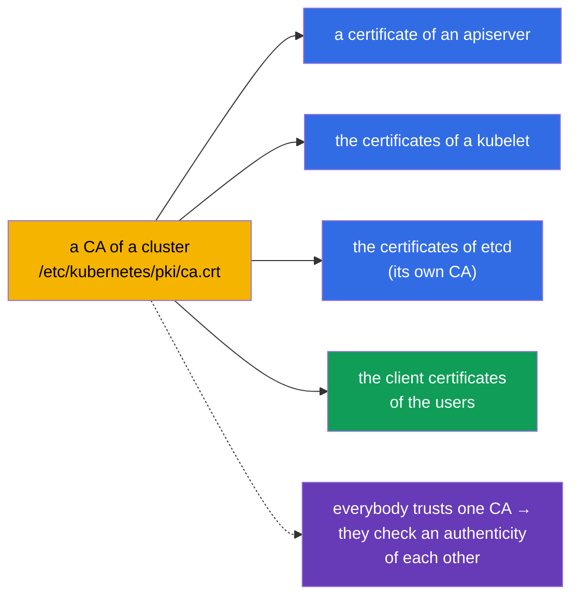
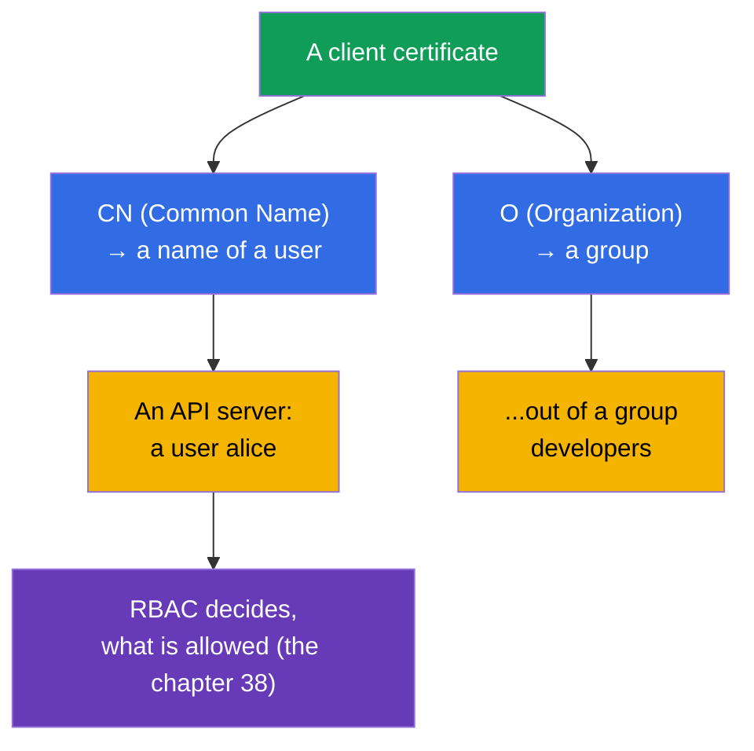
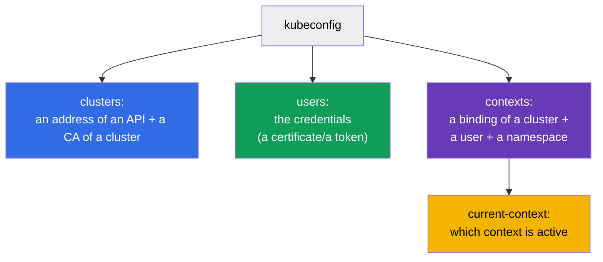
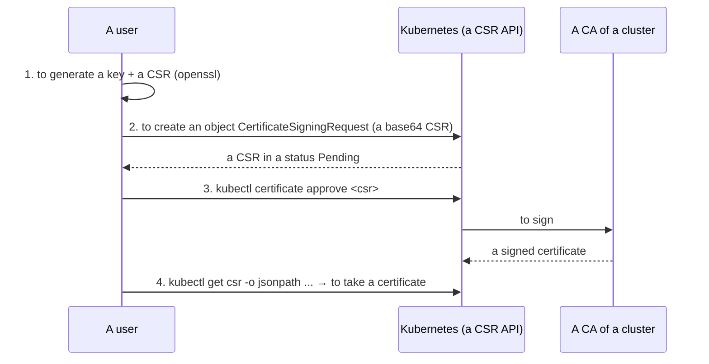
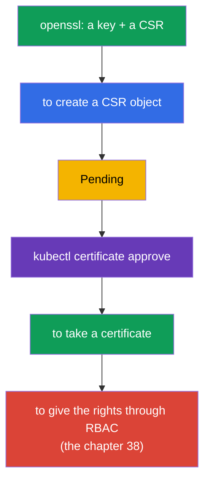
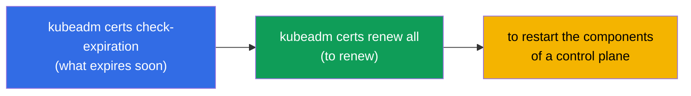
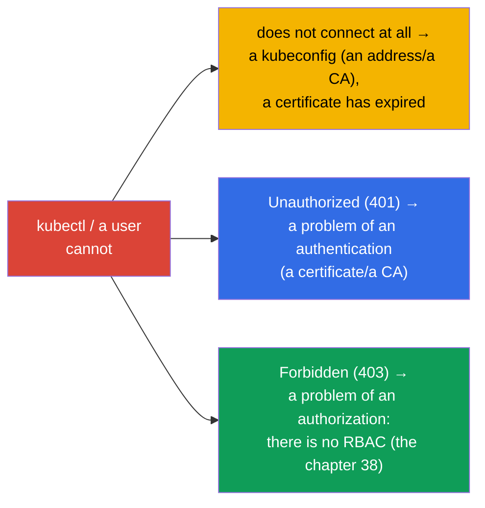

[Русская версия](ru.md) · [Versión en español](es.md) · [Version française](fr.md) · [Deutsche Version](de.md) · [ქართული ვერსია](ge.md) · [繁體中文版](tw.md) · [日本語版](jp.md)

# Chapter 39. The TLS certificates, kubeconfig and a CSR API

> 🟦 **A chapter for the CKA** (the domains Cluster Architecture and a security).
>
> **What comes next.** In the chapter 21 we have found out, that the humans are authenticated by the client
> certificates, and in the chapter 38 we were giving them the rights through RBAC. Now we will consider, where
> the credentials themselves come from: how a **kubeconfig** is arranged, how the components and the users
> are authenticated by the **TLS certificates**, and how to issue a certificate to a new user
> through a **CSR API**. This is a security domain of the CKA and a basis of a troubleshooting of "kubectl does not
> connect" and "a certificate has expired".

## 39.1. The TLS certificates as a basis of a trust

Kubernetes is built through and through on the TLS certificates: all the connections between the components are
protected by mTLS (a mutual TLS), and an authentication of the humans/the components goes by the certificates,
issued by a trusted **CA (Certificate Authority)** of a cluster.



A CA of a cluster - a root of a trust. Everything, that it has signed, a cluster considers authentic. The files of a CA and
of the certificates lie in `/etc/kubernetes/pki/` (the chapter 35). etcd usually has its own separate CA.

## 39.2. How a "user" is obtained out of a certificate

Let us recall the chapter 21: there is no object User in Kubernetes. An identity of a human is taken **out of the fields
of a client certificate**:



- **CN (Common Name)** of a certificate → a name of a user.
- **O (Organization)** → a group of a user.

That is, in order to "create a user", one issues a client certificate with a needed CN (and an O for
a group), signed by a CA of a cluster, and then gives it the rights through RBAC. There is no separate object
for a human - there is a certificate + a RoleBinding.

## 39.3. kubeconfig: a structure

A **kubeconfig** (`~/.kube/config`) - a file, which tells `kubectl`, where to connect and
under which credential. The three sections + the contexts, linking them (the chapter 3):



```yaml
apiVersion: v1
kind: Config
clusters:
- name: my-cluster
  cluster:
    server: https://10.0.0.1:6443
    certificate-authority-data: <base64 CA>      # in order to trust a server
users:
- name: alice
  user:
    client-certificate-data: <base64 cert>       # a credential of a client
    client-key-data: <base64 key>
contexts:
- name: alice@my-cluster
  context:
    cluster: my-cluster
    user: alice
    namespace: dev
current-context: alice@my-cluster
```

The commands of a work with a kubeconfig (the chapter 3):

```bash
kubectl config view
kubectl config get-contexts
kubectl config use-context alice@my-cluster
kubectl config set-context --current --namespace=dev
```

## 39.4. A CSR API: an issuing of a certificate to a user

How to issue a certificate to a new user in a correct way (without signing by a CA manually)?
Through a **CertificateSigningRequest (CSR) API** - Kubernetes itself will sign a request by its CA.



Step by step:

```bash
# 1. A user generates a private key and a request (a CSR)
openssl genrsa -out alice.key 2048
openssl req -new -key alice.key -out alice.csr -subj "/CN=alice/O=developers"

# 2. To create a CSR object in a cluster (spec.request = a base64 of an alice.csr)
cat <<EOF | kubectl apply -f -
apiVersion: certificates.k8s.io/v1
kind: CertificateSigningRequest
metadata:
  name: alice
spec:
  request: $(cat alice.csr | base64 | tr -d '\n')
  signerName: kubernetes.io/kube-apiserver-client
  usages: ["client auth"]
EOF

# 3. To approve a request
kubectl certificate approve alice

# 4. To take a signed certificate
kubectl get csr alice -o jsonpath='{.status.certificate}' | base64 -d > alice.crt

# 5. To bind a user to a role through RBAC (otherwise it is authenticated, but will get a 403)
kubectl create role pod-reader --verb=get,list,watch --resource=pods -n dev
kubectl create rolebinding alice-pod-reader \
  --role=pod-reader --user=alice -n dev

# to check, that the rights have appeared
kubectl auth can-i list pods -n dev --as=alice
```

Here a subject is **`--user=alice`**: a name has to coincide with a `CN` out of a certificate
(`/CN=alice`), then RBAC will bind the rights exactly to this credential. If the rights were
given to a group, one would use a `--group=developers` (a value of an `O` out of a certificate).

> **Important: a `--user=alice` is taken out of a `CN` of a certificate, and NOT out of a `metadata.name` of a CSR object.**
> During a connection kubectl presents a signed certificate, and an apiserver determines
> an identity by a field **`CN`** (the groups - by an `O`). Exactly with this name a subject in
> a RoleBinding is checked against. A field `metadata.name: alice` of an object `CertificateSigningRequest` - this is only
> a name of a CSR resource in a cluster (in order to do a `kubectl certificate approve alice`); it can
> be any (`alice-csr`, `req-123`) and does not influence an identity. In an example both values
> coincide (`alice`) only for a demonstrativeness. To check, what is embedded into a certificate:
>
> ```bash
> openssl x509 -in alice.crt -noout -subject
> # subject=CN = alice, O = developers
> ```

The same RoleBinding in a form of a manifest:

```yaml
apiVersion: rbac.authorization.k8s.io/v1
kind: RoleBinding
metadata:
  name: alice-pod-reader
  namespace: dev
subjects:
- kind: User                 # a subject - a user out of a CN of a certificate
  name: alice
  apiGroup: rbac.authorization.k8s.io
roleRef:
  kind: Role
  name: pod-reader
  apiGroup: rbac.authorization.k8s.io
```



After a receiving of a certificate a record in a kubeconfig is added to a user and **obligatorily**
the rights are given through RBAC - otherwise it is authenticated, but will not be able to do anything (a 403).

## 39.5. A management and a rotation of the certificates of a cluster

The certificates of the components of a cluster have an expiration date (usually 1 year) and require a renewal -
otherwise a cluster will "come to a halt". kubeadm helps to keep an eye on them:

```bash
# To check the expiration dates of the certificates
sudo kubeadm certs check-expiration

# To renew all the certificates
sudo kubeadm certs renew all
```



> **A frequent incident.** "kubectl has suddenly stopped working / x509: certificate has expired" -
> a certificate has expired. An upgrade of a cluster (the chapter 36) usually renews the certificates of a control
> plane automatically, but during the rare upgrades they have to be renewed manually. The kubelet
> certificates are able to rotate themselves (`rotateCertificates: true`).

## 39.6. A debugging of the problems with an access

A binding of this chapter, of the chapter 21 and of the 38 gives a full picture of "why there is no access":



- **does not connect / x509** - we look at a kubeconfig (an address, a CA) and an expiration date of a certificate;
- **401 Unauthorized** - an authentication: a certificate is not the right one/is signed not by the right CA;
- **403 Forbidden** - an authentication has passed, but there are no rights → RBAC (the chapter 38).

To distinguish a 401 and a 403 is critical: a 401 - "who are you" (the certificates, this chapter), a 403 - "what is
allowed to you" (RBAC, the chapter 38).

## 39.7. How this is applied in a production

- **The humans - through an external identity, and not the certificates manually.** In a production the users are rarely
  created by the static client certificates (they are hard to revoke). More often - an OIDC integration
  with a corporate provider (the chapter 21): the tokens with a short expiration, the groups, a centralized
  revocation. The certificates through a CSR - for the service/technical cases and for the CKA.
- **A monitoring of the expiration dates of the certificates.** An expired certificate of a control plane brings down a cluster, and
  an expired TLS of an Ingress - a site. In a production the expiration dates are watched and are renewed in advance (for
  an Ingress - cert-manager, the chapter 32; for a control plane - the upgrades/a kubeadm certs renew).
- **The short expiration dates and a rotation.** A trend - the short-lived certificates with an automatic
  rotation (kubelet, the projected tokens of a SA - the chapter 21), so that a leaked credential became quickly
  obsolete.
- **A protection of a CA and of the private keys.** A CA of a cluster and the private keys in `/etc/kubernetes/pki/` -
  are maximally sensitive: an access to a CA = a possibility to issue any credential. They are
  strictly limited and are backed up together with etcd.
- **A kubeconfig as a secret.** An admin.conf gives a full access to a cluster - it is stored as a
  secret, is not committed into git and is not handed out to the excessive people.

## 39.8. A mini glossary

- **CA (Certificate Authority)** - a certification authority of a cluster; a root of a trust.
- **A client certificate** - a credential of a user; CN → a name, O → a group.
- **mTLS** - a mutual TLS between the components of a cluster.
- **kubeconfig** - a file with clusters, users, contexts for a connection of kubectl.
- **context** - a binding of a cluster + a user + a namespace.
- **CSR (CertificateSigningRequest)** - a request for a signing of a certificate through an API of a cluster.
- **kubectl certificate approve** - to approve a CSR (to sign by a CA).
- **kubeadm certs renew** - to renew the certificates of a cluster.
- **401 vs 403** - not authenticated (a certificate) vs there are no rights (RBAC).

## 39.9. The conclusions of the chapter

- Kubernetes is built on TLS: the components communicate over mTLS, an authentication - by the
  certificates, signed by a CA of a cluster (`/etc/kubernetes/pki/`).
- A "user" is taken out of a certificate: CN → a name, O → a group; there is no object User.
- A kubeconfig describes clusters (an address+a CA), users (the credentials), contexts (the bindings);
  an active one - a current-context.
- To correctly issue a certificate to a user - through a CSR API: to generate a CSR → to create
  an object → a `certificate approve` → to take a certificate → to give the rights by RBAC.
- The certificates of a cluster expire; a check/a renewal - a `kubeadm certs check-expiration` /
  a `renew all`; an upgrade usually renews a control plane automatically.
- A debugging of an access: does not connect/x509 → a kubeconfig/the expiration dates; a 401 → an authentication
  (a certificate); a 403 → an authorization (RBAC).

## 39.10. How this will come in handy: at an exam and in a real work

**At an exam (the CKA).** "Give an access to a user" through a CSR API, "configure a kubeconfig/
a context", "why does kubectl not connect / a 401 / a 403" - the typical tasks. One has to know
a procedure of a CSR (an approve!), a structure of a kubeconfig and to distinguish a 401 (a certificate) from a 403 (RBAC,
the chapter 38). Often a CSR task goes in a binding with RBAC.

**In a real work.** An understanding of the certificates and of a kubeconfig - a basis of a management of an access and
of an analysis of the incidents "it does not let in". In a production the humans are created through OIDC, and a monitoring of the expiration dates
of the certificates (a control plane, an Ingress) prevents the loud failures "a certificate has expired".
A protection of a CA and of an admin.conf - is critical for a security of a cluster.

## 39.11. The questions for a self-check

1. What is a root of a trust in a cluster and where do its files lie?
2. How are a name of a user and its group obtained out of a client certificate?
3. Of which sections does a kubeconfig consist and what does a context link?
4. Describe the steps of an issuing of a certificate to a user through a CSR API. What has to be obligatorily done
   after?
5. How to check and to renew the certificates of a cluster?
6. How does a 401 differ from a 403 and where to look in each case?
7. Why in a production are the humans more often created through OIDC, and not by the static certificates?

## Practice

We have closed an authentication and an access. In the chapter 40 we will consider the interfaces of an extension of a cluster -
CNI, CSI, CRI, - which have already been mentioned and define, how a network, a storage and
a runtime are connected. The certificates, a kubeconfig and a CSR are practiced in the labs on a security.

🧪 A lab 113 (an issuing of an access to a human through a CSR API: a certificate + a Role/RoleBinding): [tasks/cka/labs/113](../../labs/113/README.MD)

🧪 A lab 118 (including a health check of the certificates): [tasks/cka/labs/118](../../labs/118/README.MD)

---
[Contents](../README.md) · [Chapter 38](../38/README.md) · [Chapter 40](../40/README.md)
