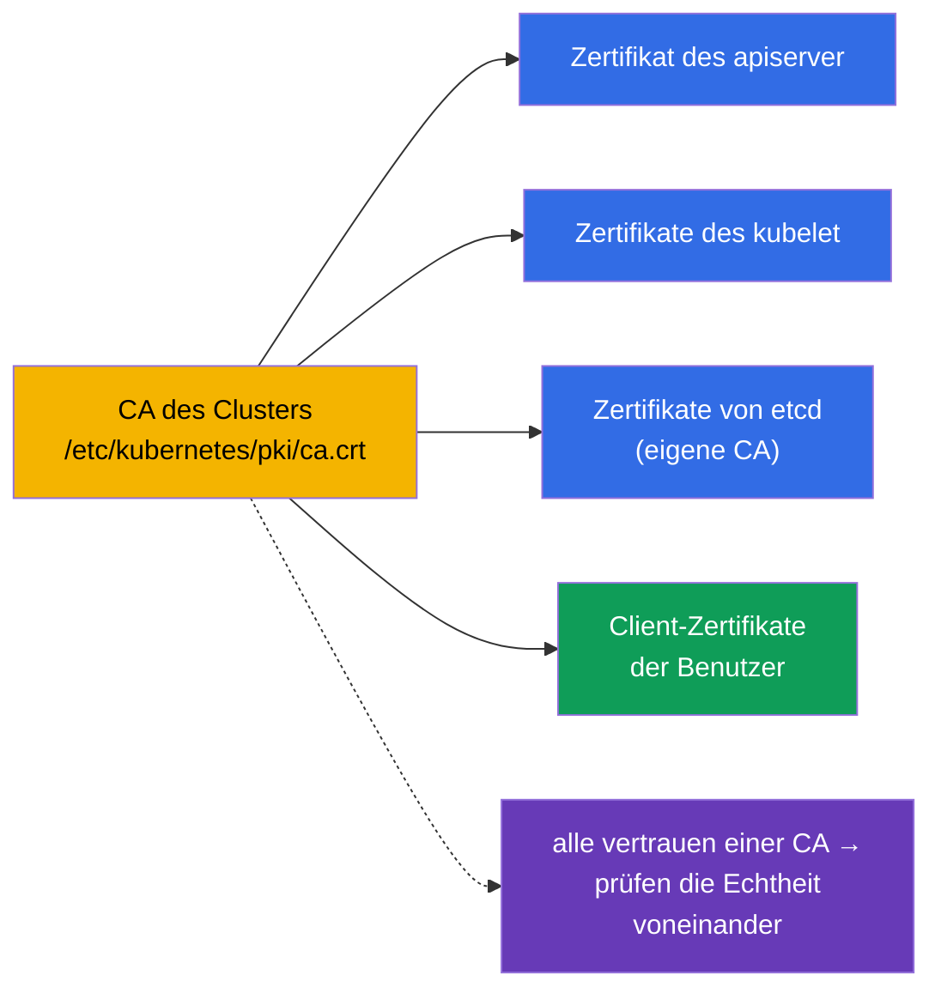
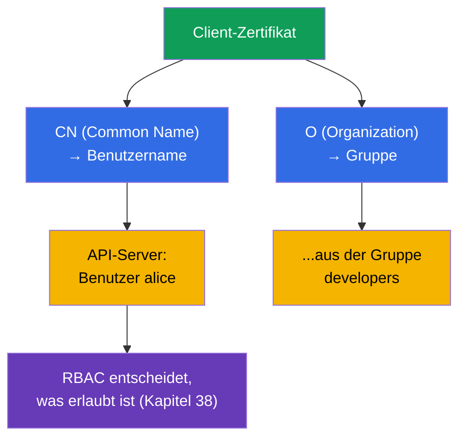
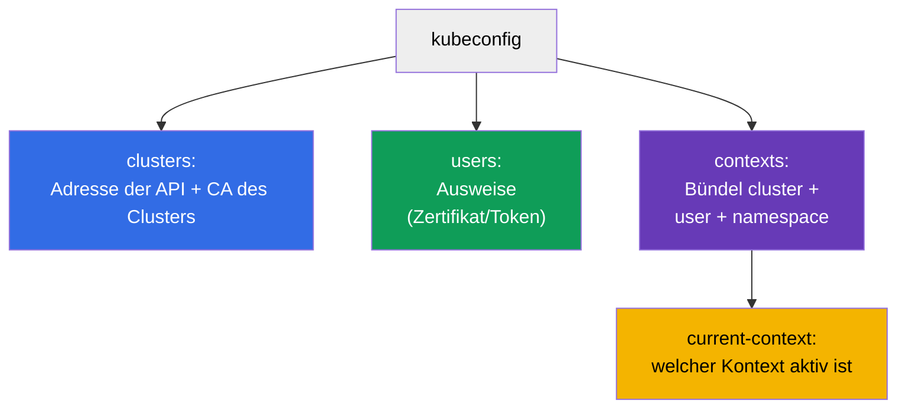
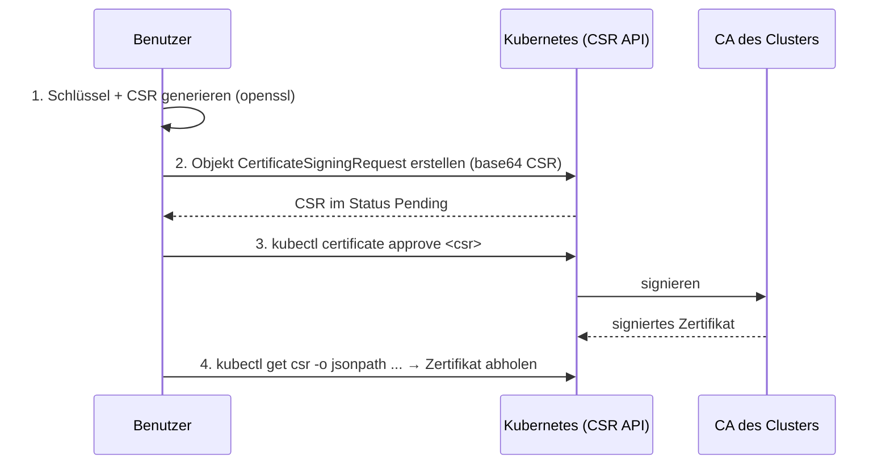
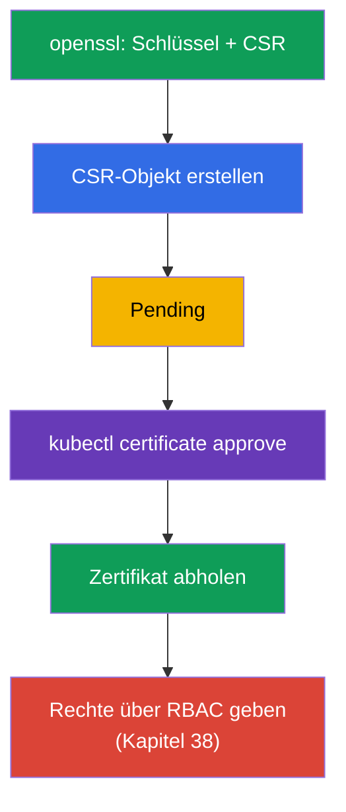
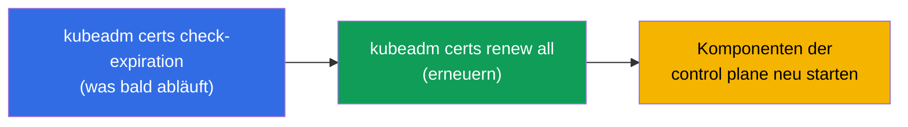
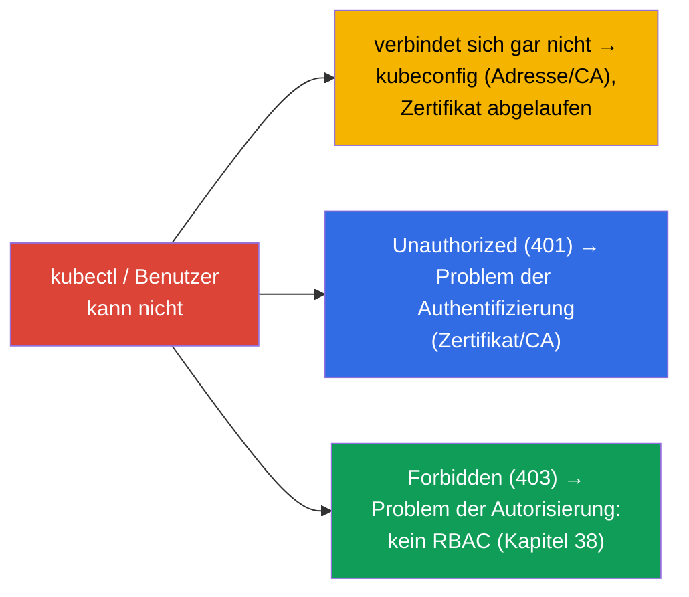

[Русская версия](ru.md) · [Eng version](README.md) · [Versión en español](es.md) · [Version française](fr.md) · [ქართული ვერსია](ge.md) · [繁體中文版](tw.md) · [日本語版](jp.md)

# Kapitel 39. TLS-Zertifikate, kubeconfig und CSR API

> 🟦 **Kapitel für CKA** (Domänen Cluster Architecture und Sicherheit).
>
> **Was kommt.** In Kapitel 21 haben wir gelernt, dass sich Menschen über
> Client-Zertifikate authentifizieren, und in Kapitel 38 haben wir ihnen Rechte über RBAC
> gegeben. Jetzt sehen wir uns an, woher die Ausweise selbst kommen: wie **kubeconfig**
> aufgebaut ist, wie sich Komponenten und Benutzer mit **TLS-Zertifikaten**
> authentifizieren und wie man einem neuen Benutzer ein Zertifikat über die **CSR API**
> ausstellt. Das ist die Sicherheitsdomäne von CKA und die Grundlage des Troubleshooting
> von „kubectl verbindet sich nicht“ und „Zertifikat abgelaufen“.

## 39.1. TLS-Zertifikate als Grundlage des Vertrauens

Kubernetes ist durchgängig auf TLS-Zertifikaten aufgebaut: alle Verbindungen zwischen den
Komponenten sind durch mTLS (gegenseitiges TLS) geschützt, und die Authentifizierung von
Menschen/Komponenten läuft über Zertifikate, die von der vertrauenswürdigen
**CA (Certificate Authority)** des Clusters ausgestellt wurden.



Die CA des Clusters ist die Wurzel des Vertrauens. Alles, was sie signiert hat, hält der
Cluster für echt. Die Dateien der CA und der Zertifikate liegen in
`/etc/kubernetes/pki/` (Kapitel 35). etcd hat üblicherweise eine eigene, separate CA.

## 39.2. Wie aus einem Zertifikat ein „Benutzer“ wird

Erinnern wir uns an Kapitel 21: ein Objekt User gibt es in Kubernetes nicht. Die Identität
eines Menschen wird **aus den Feldern des Client-Zertifikats** entnommen:



- **CN (Common Name)** des Zertifikats → Benutzername.
- **O (Organization)** → Gruppe des Benutzers.

Um also einen „Benutzer zu erstellen“, stellt man ein Client-Zertifikat mit dem nötigen CN
(und O für die Gruppe) aus, signiert von der CA des Clusters, und gibt ihm anschließend
Rechte über RBAC. Ein separates Objekt für den Menschen gibt es nicht - es gibt ein
Zertifikat + ein RoleBinding.

## 39.3. kubeconfig: Struktur

**kubeconfig** (`~/.kube/config`) ist die Datei, die `kubectl` sagt, wohin es sich
verbinden soll und mit welchem Ausweis. Drei Abschnitte + die Kontexte, die sie verbinden
(Kapitel 3):



```yaml
apiVersion: v1
kind: Config
clusters:
- name: my-cluster
  cluster:
    server: https://10.0.0.1:6443
    certificate-authority-data: <base64 CA>      # um dem Server zu vertrauen
users:
- name: alice
  user:
    client-certificate-data: <base64 cert>       # Ausweis des Clients
    client-key-data: <base64 key>
contexts:
- name: alice@my-cluster
  context:
    cluster: my-cluster
    user: alice
    namespace: dev
current-context: alice@my-cluster
```

Befehle für die Arbeit mit kubeconfig (Kapitel 3):

```bash
kubectl config view
kubectl config get-contexts
kubectl config use-context alice@my-cluster
kubectl config set-context --current --namespace=dev
```

## 39.4. CSR API: Ausstellung eines Zertifikats für einen Benutzer

Wie stellt man einem neuen Benutzer ein Zertifikat auf dem richtigen Weg aus (ohne von Hand
mit der CA zu signieren)? Über die **CertificateSigningRequest (CSR) API** - Kubernetes
signiert die Anfrage selbst mit seiner CA.



Schritt für Schritt:

```bash
# 1. Der Benutzer generiert einen privaten Schlüssel und eine Anfrage (CSR)
openssl genrsa -out alice.key 2048
openssl req -new -key alice.key -out alice.csr -subj "/CN=alice/O=developers"

# 2. Das CSR-Objekt im Cluster erstellen (spec.request = base64 von alice.csr)
cat <<EOF | kubectl apply -f -
apiVersion: certificates.k8s.io/v1
kind: CertificateSigningRequest
metadata:
  name: alice
spec:
  request: $(cat alice.csr | base64 | tr -d '\n')
  signerName: kubernetes.io/kube-apiserver-client
  usages: ["client auth"]
EOF

# 3. Die Anfrage genehmigen
kubectl certificate approve alice

# 4. Das signierte Zertifikat abholen
kubectl get csr alice -o jsonpath='{.status.certificate}' | base64 -d > alice.crt

# 5. Den Benutzer über RBAC an eine Rolle binden (sonst authentifiziert er sich, bekommt aber 403)
kubectl create role pod-reader --verb=get,list,watch --resource=pods -n dev
kubectl create rolebinding alice-pod-reader \
  --role=pod-reader --user=alice -n dev

# prüfen, dass die Rechte da sind
kubectl auth can-i list pods -n dev --as=alice
```

Hier ist das Subjekt **`--user=alice`**: der Name muss mit dem `CN` aus dem Zertifikat
übereinstimmen (`/CN=alice`), dann bindet RBAC die Rechte genau an diesen Ausweis. Würden
die Rechte einer Gruppe gegeben, würde man `--group=developers` verwenden (der Wert `O` aus
dem Zertifikat).

> **Wichtig: `--user=alice` kommt aus dem `CN` des Zertifikats und NICHT aus `metadata.name` des CSR-Objekts.**
> Beim Verbinden legt kubectl das signierte Zertifikat vor, und der apiserver bestimmt die
> Identität über das Feld **`CN`** (Gruppen - über `O`). Genau mit diesem Namen wird das
> Subjekt im RoleBinding verglichen. Das Feld `metadata.name: alice` des Objekts
> `CertificateSigningRequest` ist nur der Name der CSR-Ressource im Cluster (damit man
> `kubectl certificate approve alice` machen kann); er kann beliebig sein (`alice-csr`,
> `req-123`) und beeinflusst die Identität nicht. Im Beispiel stimmen beide Werte
> (`alice`) nur zur Anschaulichkeit überein. So prüft man, was im Zertifikat steckt:
>
> ```bash
> openssl x509 -in alice.crt -noout -subject
> # subject=CN = alice, O = developers
> ```

Dasselbe RoleBinding als Manifest:

```yaml
apiVersion: rbac.authorization.k8s.io/v1
kind: RoleBinding
metadata:
  name: alice-pod-reader
  namespace: dev
subjects:
- kind: User                 # Subjekt - der Benutzer aus dem CN des Zertifikats
  name: alice
  apiGroup: rbac.authorization.k8s.io
roleRef:
  kind: Role
  name: pod-reader
  apiGroup: rbac.authorization.k8s.io
```



Nach dem Erhalt des Zertifikats fügt man dem Benutzer einen Eintrag in kubeconfig hinzu und
gibt ihm **unbedingt** Rechte über RBAC - sonst authentifiziert er sich, kann aber nichts
tun (403).

## 39.5. Verwaltung und Rotation der Cluster-Zertifikate

Die Zertifikate der Cluster-Komponenten haben eine Gültigkeitsdauer (üblicherweise 1 Jahr)
und müssen erneuert werden - sonst „bleibt der Cluster stehen“. kubeadm hilft, sie im Blick
zu behalten:

```bash
# Die Gültigkeitsfristen der Zertifikate prüfen
sudo kubeadm certs check-expiration

# Alle Zertifikate erneuern
sudo kubeadm certs renew all
```



> **Häufiger Vorfall.** „kubectl funktioniert plötzlich nicht mehr / x509: certificate has
> expired“ - ein Zertifikat ist abgelaufen. Ein Cluster-Upgrade (Kapitel 36) verlängert die
> Zertifikate der control plane üblicherweise automatisch, aber bei seltenen Upgrades muss
> man sie manuell verlängern. Kubelet-Zertifikate können sich selbst rotieren
> (`rotateCertificates: true`).

## 39.6. Fehlersuche bei Zugriffsproblemen

Das Zusammenspiel dieses Kapitels mit Kapitel 21 und 38 ergibt das vollständige Bild
„warum kein Zugriff“:



- **verbindet sich nicht / x509** - wir schauen in kubeconfig (Adresse, CA) und auf die
  Laufzeit des Zertifikats;
- **401 Unauthorized** - Authentifizierung: das Zertifikat ist falsch / nicht von dieser CA
  signiert;
- **403 Forbidden** - die Authentifizierung war erfolgreich, aber es fehlen die Rechte →
  RBAC (Kapitel 38).

401 und 403 zu unterscheiden ist entscheidend: 401 ist „wer bist du“ (Zertifikate, dieses
Kapitel), 403 ist „was darfst du“ (RBAC, Kapitel 38).

## 39.7. Wie man das in der Produktion anwendet

- **Menschen - über externe identity, nicht über Zertifikate von Hand.** In der Produktion
  legt man Benutzer selten mit statischen Client-Zertifikaten an (sie sind schwer zu
  widerrufen). Häufiger nutzt man eine OIDC-Integration mit dem Unternehmensprovider
  (Kapitel 21): Token mit kurzer Laufzeit, Gruppen, zentraler Widerruf. Zertifikate über
  CSR sind für Service-/technische Fälle und für CKA.
- **Monitoring der Zertifikatsfristen.** Ein abgelaufenes Zertifikat der control plane legt
  den Cluster lahm, ein abgelaufenes TLS des Ingress die Website. In der Produktion
  überwacht man die Fristen und verlängert frühzeitig (für Ingress - cert-manager,
  Kapitel 32; für die control plane - Upgrades / kubeadm certs renew).
- **Kurze Laufzeiten und Rotation.** Der Trend geht zu kurzlebigen Zertifikaten mit
  automatischer Rotation (kubelet, projizierte SA-Token - Kapitel 21), damit ein
  abgeflossener Ausweis schnell veraltet.
- **Schutz der CA und der privaten Schlüssel.** Die CA des Clusters und die privaten
  Schlüssel in `/etc/kubernetes/pki/` sind maximal sensibel: Zugriff auf die CA = die
  Möglichkeit, jeden beliebigen Ausweis auszustellen. Sie werden streng eingeschränkt und
  zusammen mit etcd gesichert.
- **kubeconfig als Secret.** admin.conf gibt vollen Zugriff auf den Cluster - man bewahrt
  es wie ein Geheimnis auf, committet es nicht in git und verteilt es nicht an
  überflüssige Personen.

## 39.8. Mini-Glossar

- **CA (Certificate Authority)** - die Zertifizierungsstelle des Clusters; die Wurzel des
  Vertrauens.
- **Client-Zertifikat** - der Ausweis des Benutzers; CN → Name, O → Gruppe.
- **mTLS** - gegenseitiges TLS zwischen den Komponenten des Clusters.
- **kubeconfig** - die Datei mit clusters, users, contexts für die Verbindung von kubectl.
- **context** - das Bündel cluster + user + namespace.
- **CSR (CertificateSigningRequest)** - die Anfrage zur Signatur eines Zertifikats über die
  API des Clusters.
- **kubectl certificate approve** - eine CSR genehmigen (mit der CA signieren).
- **kubeadm certs renew** - die Zertifikate des Clusters erneuern.
- **401 vs 403** - nicht authentifiziert (Zertifikat) vs keine Rechte (RBAC).

## 39.9. Zusammenfassung des Kapitels

- Kubernetes ist auf TLS aufgebaut: die Komponenten kommunizieren über mTLS, die
  Authentifizierung läuft über Zertifikate, die von der CA des Clusters signiert sind
  (`/etc/kubernetes/pki/`).
- Der „Benutzer“ kommt aus dem Zertifikat: CN → Name, O → Gruppe; ein Objekt User gibt es
  nicht.
- kubeconfig beschreibt clusters (Adresse+CA), users (Ausweise), contexts (Bündel); aktiv
  ist current-context.
- Ein Zertifikat richtig an einen Benutzer ausstellen - über die CSR API: CSR generieren →
  Objekt erstellen → `certificate approve` → Zertifikat abholen → Rechte über RBAC geben.
- Die Zertifikate des Clusters laufen ab; Prüfung/Verlängerung -
  `kubeadm certs check-expiration` / `renew all`; ein Upgrade verlängert die control plane
  üblicherweise automatisch.
- Fehlersuche beim Zugriff: verbindet sich nicht/x509 → kubeconfig/Fristen; 401 →
  Authentifizierung (Zertifikat); 403 → Autorisierung (RBAC).

## 39.10. Wofür das nützlich ist: in der Prüfung und in der echten Arbeit

**In der Prüfung (CKA).** „Gib dem Benutzer Zugriff“ über die CSR API, „konfiguriere
kubeconfig/Kontext“, „warum verbindet sich kubectl nicht / 401 / 403“ - typische Aufgaben.
Man muss die CSR-Prozedur kennen (approve!), die Struktur von kubeconfig und 401
(Zertifikat) von 403 (RBAC, Kapitel 38) unterscheiden. Oft kommt die CSR-Aufgabe im Bündel
mit RBAC.

**In der echten Arbeit.** Das Verständnis von Zertifikaten und kubeconfig ist die Grundlage
der Zugriffsverwaltung und der Analyse von Vorfällen „lässt mich nicht rein“. In der
Produktion legt man Menschen über OIDC an, und das Monitoring der Zertifikatsfristen
(control plane, Ingress) verhindert laute Ausfälle „Zertifikat abgelaufen“. Der Schutz der
CA und von admin.conf ist kritisch für die Sicherheit des Clusters.

## 39.11. Fragen zur Selbstüberprüfung

1. Was ist die Wurzel des Vertrauens im Cluster und wo liegen ihre Dateien?
2. Wie werden aus einem Client-Zertifikat der Benutzername und seine Gruppe gewonnen?
3. Aus welchen Abschnitten besteht kubeconfig und was verbindet ein context?
4. Beschreiben Sie die Schritte der Zertifikatsausstellung für einen Benutzer über die CSR
   API. Was muss man danach unbedingt tun?
5. Wie prüft und verlängert man die Zertifikate des Clusters?
6. Wodurch unterscheidet sich 401 von 403 und wohin schaut man in jedem Fall?
7. Warum legt man Menschen in der Produktion häufiger über OIDC an und nicht mit statischen
   Zertifikaten?

## Praxis

Wir haben die Authentifizierung und den Zugriff abgeschlossen. In Kapitel 40 sehen wir uns
die Erweiterungsschnittstellen des Clusters an - CNI, CSI, CRI -, die schon erwähnt wurden
und festlegen, wie Netzwerk, Storage und Runtime angebunden werden. Zertifikate, kubeconfig
und CSR werden in den Labs zur Sicherheit geübt.

🧪 Lab 113 (Zugriff für einen Menschen über die CSR API: Zertifikat + Role/RoleBinding): [tasks/cka/labs/113](../../labs/113/README_DE.MD)

🧪 Lab 118 (u. a. Health-Check der Zertifikate): [tasks/cka/labs/118](../../labs/118/README_DE.MD)

---
[Inhalt](../README_DE.md) · [Kapitel 38](../38/de.md) · [Kapitel 40](../40/de.md)
