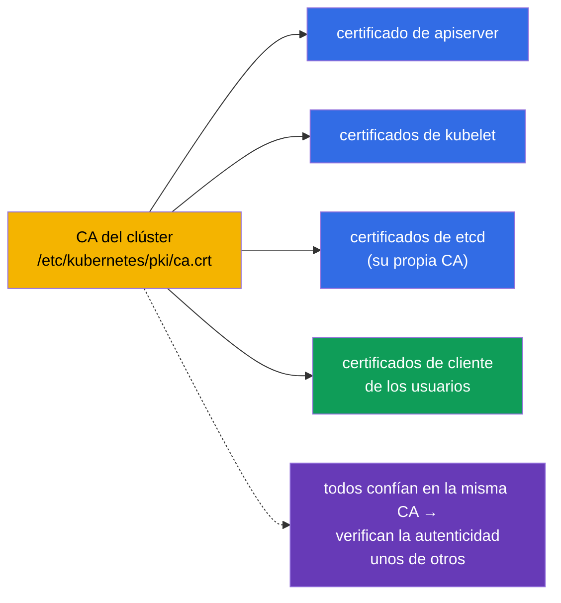
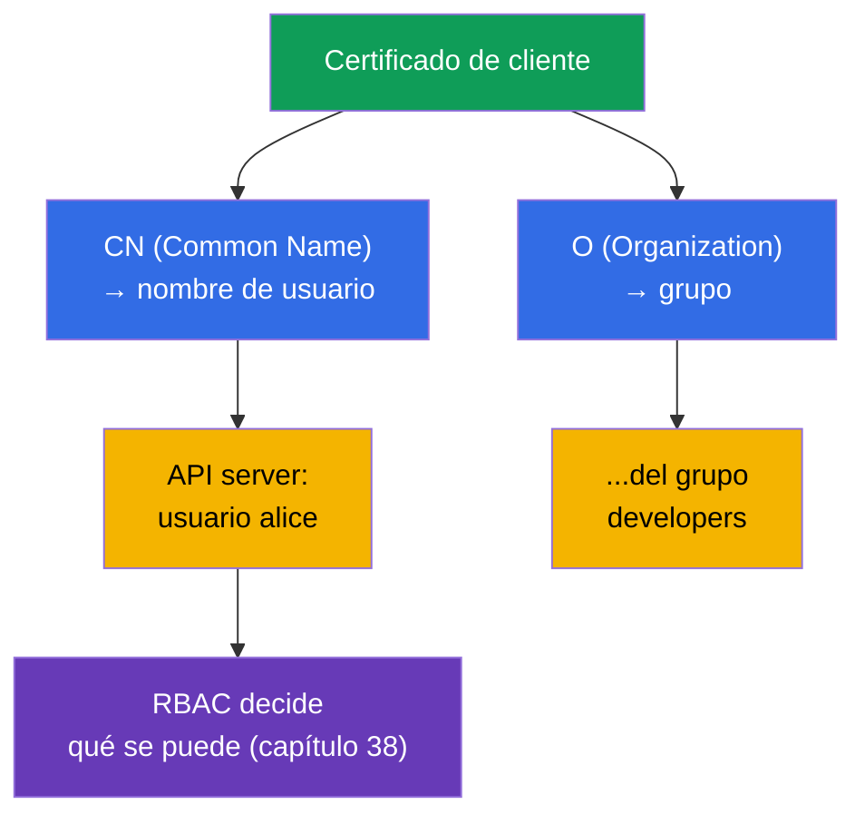
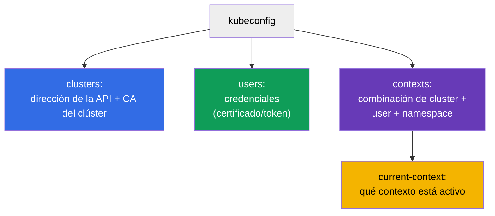
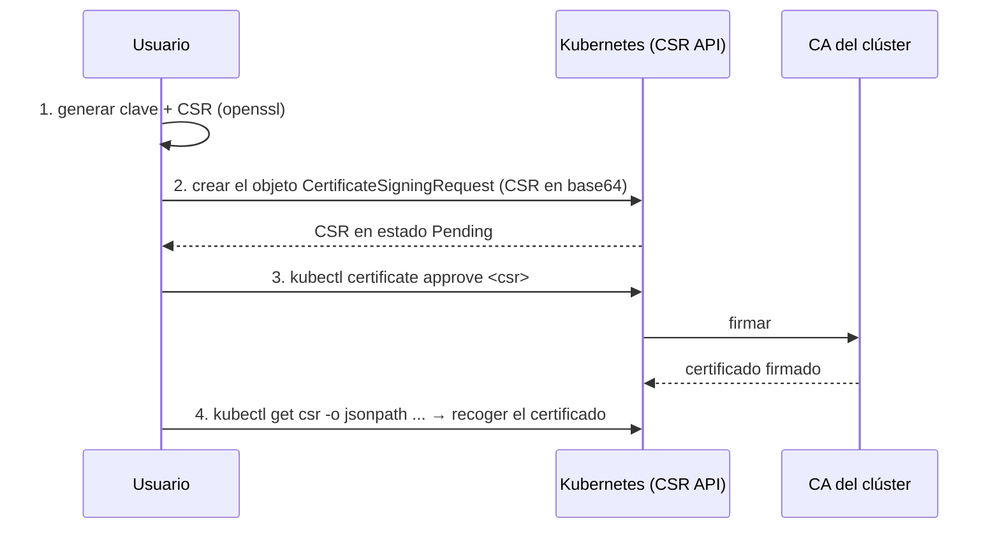
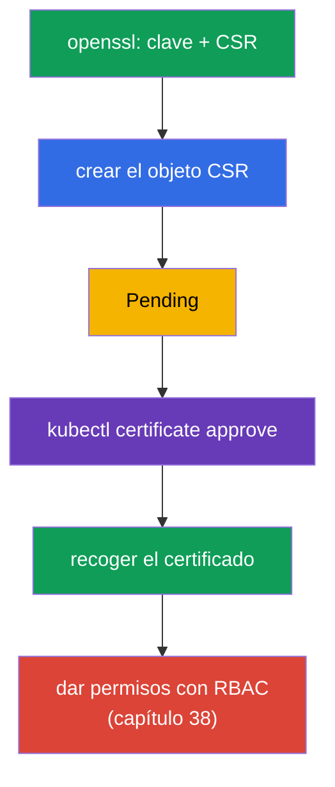
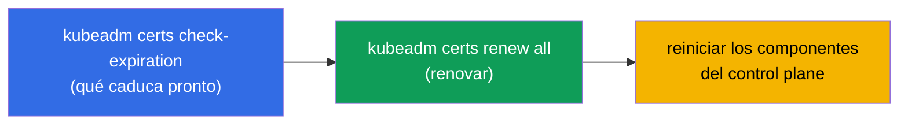
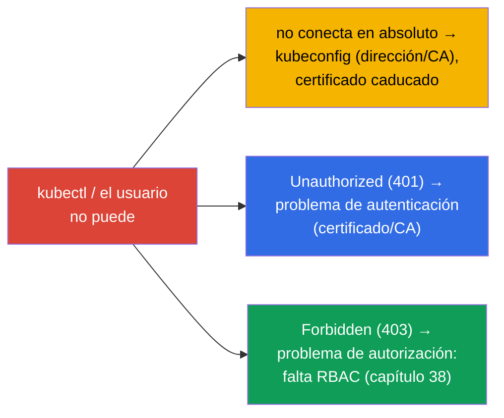

[Русская версия](ru.md) · [Eng version](README.md) · [Version française](fr.md) · [Deutsche Version](de.md) · [ქართული ვერსია](ge.md) · [繁體中文版](tw.md) · [日本語版](jp.md)

# Capítulo 39. Certificados TLS, kubeconfig y la CSR API

> 🟦 **Capítulo para CKA** (dominios Cluster Architecture y seguridad).
>
> **Qué viene ahora.** En el capítulo 21 aprendimos que las personas se autentican con
> certificados de cliente, y en el capítulo 38 les dimos permisos mediante RBAC. Ahora veremos
> de dónde salen esas credenciales: cómo está construido el **kubeconfig**, cómo se autentican
> los componentes y los usuarios con **certificados TLS**, y cómo emitir un certificado para un
> nuevo usuario a través de la **CSR API**. Es el dominio de seguridad del CKA y la base del
> troubleshooting de «kubectl no conecta» y «el certificado ha caducado».

## 39.1. Los certificados TLS como base de la confianza

Kubernetes está construido de principio a fin sobre certificados TLS: todas las conexiones entre
componentes están protegidas con mTLS (TLS mutuo), y la autenticación de personas y componentes
se hace con certificados emitidos por la **CA (Certificate Authority)** de confianza del clúster.



La CA del clúster es la raíz de confianza. Todo lo que ella firma, el clúster lo considera
auténtico. Los archivos de la CA y de los certificados están en `/etc/kubernetes/pki/`
(capítulo 35). etcd suele tener su propia CA aparte.

## 39.2. Cómo un certificado se convierte en un «usuario»

Recordemos el capítulo 21: en Kubernetes no existe el objeto User. La identidad de una persona
se toma **de los campos del certificado de cliente**:



- El **CN (Common Name)** del certificado → el nombre del usuario.
- La **O (Organization)** → el grupo del usuario.

Es decir, para «crear un usuario» se emite un certificado de cliente con el CN necesario (y la O
para el grupo), firmado por la CA del clúster, y después se le dan permisos mediante RBAC. No hay
un objeto aparte para la persona: hay certificado + RoleBinding.

## 39.3. kubeconfig: estructura

El **kubeconfig** (`~/.kube/config`) es el archivo que le dice a `kubectl` dónde conectarse y con
qué credencial. Tres secciones + los contextos que las relacionan (capítulo 3):



```yaml
apiVersion: v1
kind: Config
clusters:
- name: my-cluster
  cluster:
    server: https://10.0.0.1:6443
    certificate-authority-data: <base64 CA>      # para confiar en el servidor
users:
- name: alice
  user:
    client-certificate-data: <base64 cert>       # credencial del cliente
    client-key-data: <base64 key>
contexts:
- name: alice@my-cluster
  context:
    cluster: my-cluster
    user: alice
    namespace: dev
current-context: alice@my-cluster
```

Comandos para trabajar con kubeconfig (capítulo 3):

```bash
kubectl config view
kubectl config get-contexts
kubectl config use-context alice@my-cluster
kubectl config set-context --current --namespace=dev
```

## 39.4. CSR API: emitir un certificado para un usuario

¿Cómo emitir un certificado para un nuevo usuario de la forma correcta (sin firmar con la CA a
mano)? A través de la **CertificateSigningRequest (CSR) API**: Kubernetes firmará la petición con
su propia CA.



Paso a paso:

```bash
# 1. El usuario genera la clave privada y la petición (CSR)
openssl genrsa -out alice.key 2048
openssl req -new -key alice.key -out alice.csr -subj "/CN=alice/O=developers"

# 2. Crear el objeto CSR en el clúster (spec.request = base64 de alice.csr)
cat <<EOF | kubectl apply -f -
apiVersion: certificates.k8s.io/v1
kind: CertificateSigningRequest
metadata:
  name: alice
spec:
  request: $(cat alice.csr | base64 | tr -d '\n')
  signerName: kubernetes.io/kube-apiserver-client
  usages: ["client auth"]
EOF

# 3. Aprobar la petición
kubectl certificate approve alice

# 4. Recoger el certificado firmado
kubectl get csr alice -o jsonpath='{.status.certificate}' | base64 -d > alice.crt

# 5. Vincular el usuario a un rol mediante RBAC (si no, se autentica pero recibe 403)
kubectl create role pod-reader --verb=get,list,watch --resource=pods -n dev
kubectl create rolebinding alice-pod-reader \
  --role=pod-reader --user=alice -n dev

# comprobar que los permisos ya existen
kubectl auth can-i list pods -n dev --as=alice
```

Aquí el sujeto es **`--user=alice`**: el nombre debe coincidir con el `CN` del certificado
(`/CN=alice`), y así RBAC vinculará los permisos exactamente a esa credencial. Si los permisos se
dieran a un grupo, se usaría `--group=developers` (el valor de `O` del certificado).

> **Importante: `--user=alice` se toma del `CN` del certificado, y NO del `metadata.name` del objeto CSR.**
> Al conectarse, kubectl presenta el certificado firmado y el apiserver determina la identidad por
> el campo **`CN`** (los grupos, por `O`). Es con ese nombre con el que se compara el sujeto del
> RoleBinding. El campo `metadata.name: alice` del objeto `CertificateSigningRequest` es solo el
> nombre del recurso CSR en el clúster (para poder hacer `kubectl certificate approve alice`);
> puede ser cualquiera (`alice-csr`, `req-123`) y no influye en la identidad. En el ejemplo ambos
> valores coinciden (`alice`) solo por claridad. Para comprobar qué hay dentro del certificado:
>
> ```bash
> openssl x509 -in alice.crt -noout -subject
> # subject=CN = alice, O = developers
> ```

El mismo RoleBinding en forma de manifiesto:

```yaml
apiVersion: rbac.authorization.k8s.io/v1
kind: RoleBinding
metadata:
  name: alice-pod-reader
  namespace: dev
subjects:
- kind: User                 # el sujeto es el usuario del CN del certificado
  name: alice
  apiGroup: rbac.authorization.k8s.io
roleRef:
  kind: Role
  name: pod-reader
  apiGroup: rbac.authorization.k8s.io
```



Tras recibir el certificado, se añade una entrada para el usuario en el kubeconfig y
**obligatoriamente** se le dan permisos con RBAC; si no, se autentica pero no podrá hacer nada
(403).

## 39.5. Gestión y rotación de los certificados del clúster

Los certificados de los componentes del clúster tienen fecha de caducidad (normalmente 1 año) y
hay que renovarlos; si no, el clúster «se para». kubeadm ayuda a vigilarlos:

```bash
# Comprobar las fechas de caducidad de los certificados
sudo kubeadm certs check-expiration

# Renovar todos los certificados
sudo kubeadm certs renew all
```



> **Incidente frecuente.** «kubectl de repente ha dejado de funcionar / x509: certificate has
> expired»: ha caducado un certificado. La actualización del clúster (capítulo 36) suele renovar
> los certificados del control plane automáticamente, pero si los upgrades son poco frecuentes hay
> que renovarlos a mano. Los certificados de kubelet saben rotarse solos
> (`rotateCertificates: true`).

## 39.6. Depuración de problemas de acceso

La combinación de este capítulo con los capítulos 21 y 38 da el cuadro completo de «por qué no hay
acceso»:



- **no conecta / x509**: miramos el kubeconfig (dirección, CA) y la vigencia del certificado;
- **401 Unauthorized**: autenticación: el certificado no es el correcto o no está firmado por esa CA;
- **403 Forbidden**: la autenticación ha pasado, pero no hay permisos → RBAC (capítulo 38).

Distinguir 401 de 403 es crítico: 401 es «quién eres» (certificados, este capítulo), 403 es «qué
puedes hacer» (RBAC, capítulo 38).

## 39.7. Cómo se aplica esto en producción

- **Las personas, a través de una identity externa, no con certificados a mano.** En producción los
  usuarios rara vez se dan de alta con certificados de cliente estáticos (son difíciles de revocar).
  Lo habitual es la integración OIDC con el proveedor corporativo (capítulo 21): tokens de vida
  corta, grupos, revocación centralizada. Los certificados vía CSR son para casos de
  servicio/técnicos y para el CKA.
- **Monitorización de la vigencia de los certificados.** Un certificado caducado del control plane
  tira el clúster, y un TLS de Ingress caducado tira el sitio web. En producción se vigilan las
  fechas y se renuevan con antelación (para Ingress, cert-manager, capítulo 32; para el control
  plane, upgrades o `kubeadm certs renew`).
- **Vigencias cortas y rotación.** La tendencia son certificados de vida corta con rotación
  automática (kubelet, tokens proyectados de SA, capítulo 21), para que una credencial filtrada
  quede obsoleta rápido.
- **Protección de la CA y de las claves privadas.** La CA del clúster y las claves privadas en
  `/etc/kubernetes/pki/` son de lo más sensible: acceso a la CA = poder emitir cualquier credencial.
  Se restringen estrictamente y se respaldan junto con etcd.
- **El kubeconfig como secreto.** admin.conf da acceso total al clúster: se guarda como un secreto,
  no se comitea en git y no se reparte a gente que no lo necesita.

## 39.8. Mini-glosario

- **CA (Certificate Authority)** - la autoridad de certificación del clúster; la raíz de confianza.
- **Certificado de cliente** - la credencial del usuario; CN → nombre, O → grupo.
- **mTLS** - TLS mutuo entre los componentes del clúster.
- **kubeconfig** - archivo con clusters, users y contexts para conectar kubectl.
- **context** - combinación de cluster + user + namespace.
- **CSR (CertificateSigningRequest)** - petición de firma de un certificado a través de la API del clúster.
- **kubectl certificate approve** - aprobar un CSR (firmarlo con la CA).
- **kubeadm certs renew** - renovar los certificados del clúster.
- **401 vs 403** - no autenticado (certificado) vs sin permisos (RBAC).

## 39.9. Resumen del capítulo

- Kubernetes está construido sobre TLS: los componentes se comunican por mTLS y la autenticación
  se hace con certificados firmados por la CA del clúster (`/etc/kubernetes/pki/`).
- El «usuario» se toma del certificado: CN → nombre, O → grupo; el objeto User no existe.
- El kubeconfig describe clusters (dirección+CA), users (credenciales) y contexts (combinaciones);
  el activo es current-context.
- La forma correcta de emitir un certificado a un usuario es la CSR API: generar el CSR → crear el
  objeto → `certificate approve` → recoger el certificado → dar permisos con RBAC.
- Los certificados del clúster caducan; comprobación y renovación con
  `kubeadm certs check-expiration` / `renew all`; el upgrade suele renovar el control plane
  automáticamente.
- Depuración del acceso: no conecta/x509 → kubeconfig/vigencias; 401 → autenticación
  (certificado); 403 → autorización (RBAC).

## 39.10. Para qué sirve esto: en el examen y en el trabajo real

**En el examen (CKA).** «Da acceso a un usuario» vía CSR API, «configura el kubeconfig/el
contexto», «por qué kubectl no conecta / 401 / 403» son tareas típicas. Hay que conocer el
procedimiento del CSR (¡el approve!), la estructura del kubeconfig y distinguir 401 (certificado)
de 403 (RBAC, capítulo 38). A menudo la tarea de CSR va combinada con RBAC.

**En el trabajo real.** Entender los certificados y el kubeconfig es la base de la gestión de
accesos y del análisis de incidentes de «no me deja». En producción las personas se dan de alta vía
OIDC, y la monitorización de la vigencia de los certificados (control plane, Ingress) evita fallos
sonados de «el certificado ha caducado». Proteger la CA y admin.conf es crítico para la seguridad
del clúster.

## 39.11. Preguntas de autocomprobación

1. ¿Qué es la raíz de confianza del clúster y dónde están sus archivos?
2. ¿Cómo se obtienen el nombre del usuario y su grupo a partir del certificado de cliente?
3. ¿De qué secciones consta el kubeconfig y qué relaciona un context?
4. Describe los pasos para emitir un certificado a un usuario mediante la CSR API. ¿Qué hay que
   hacer obligatoriamente después?
5. ¿Cómo comprobar y renovar los certificados del clúster?
6. ¿En qué se diferencia 401 de 403 y dónde hay que mirar en cada caso?
7. ¿Por qué en producción las personas se dan de alta más bien vía OIDC y no con certificados
   estáticos?

## Práctica

Ya hemos cerrado la autenticación y el acceso. En el capítulo 40 veremos las interfaces de
extensión del clúster - CNI, CSI, CRI -, que ya se han mencionado y que definen cómo se conectan la
red, el almacenamiento y el runtime. Los certificados, el kubeconfig y los CSR se practican en los
laboratorios de seguridad.

🧪 Laboratorio 113 (dar acceso a una persona vía CSR API: certificado + Role/RoleBinding): [tasks/cka/labs/113](../../labs/113/README_ES.MD)

🧪 Laboratorio 118 (incluye health-check de certificados): [tasks/cka/labs/118](../../labs/118/README_ES.MD)

---
[Índice](../README_ES.md) · [Capítulo 38](../38/es.md) · [Capítulo 40](../40/es.md)
