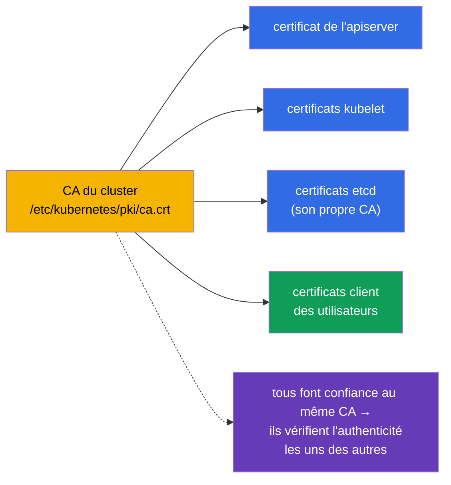
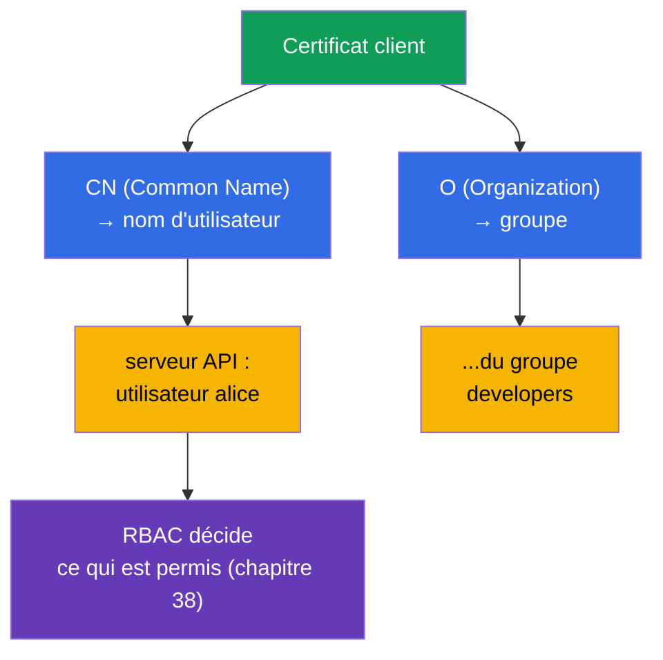
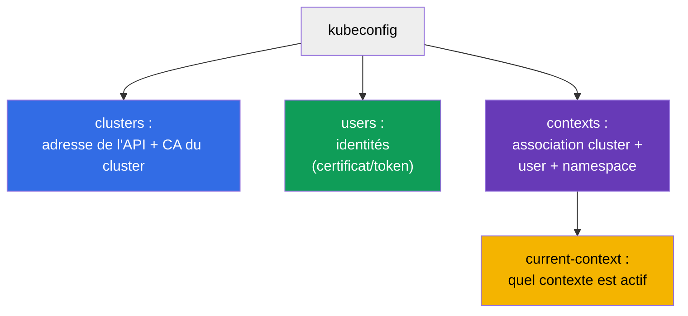
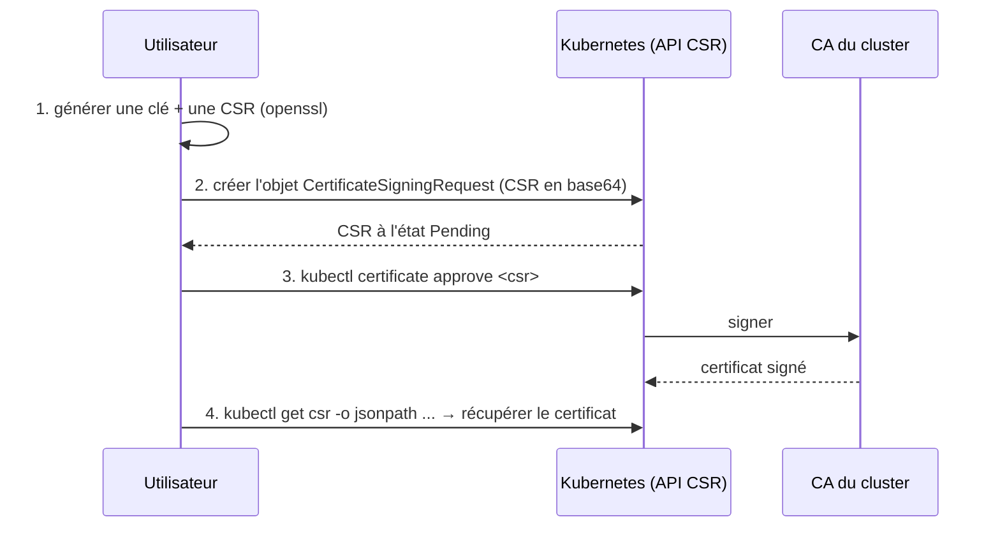
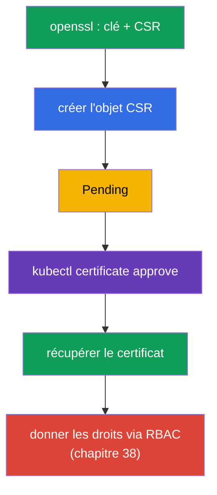
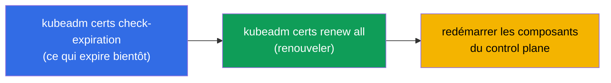
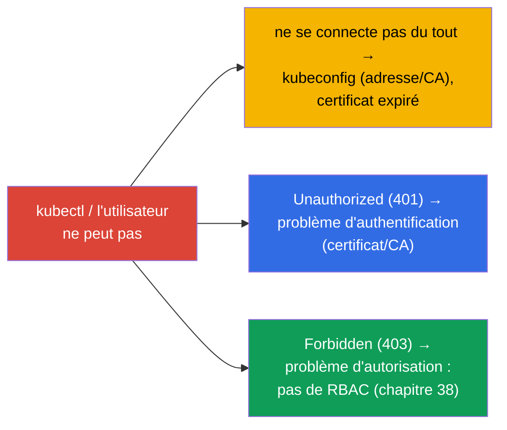

[Русская версия](ru.md) · [Eng version](README.md) · [Versión en español](es.md) · [Deutsche Version](de.md) · [ქართული ვერსია](ge.md) · [繁體中文版](tw.md) · [日本語版](jp.md)

# Chapitre 39. Certificats TLS, kubeconfig et l'API CSR

> 🟦 **Chapitre pour le CKA** (domaines Cluster Architecture et sécurité).
>
> **Ce qui suit.** Au chapitre 21, nous avons appris que les personnes s'authentifient avec des
> certificats client, et au chapitre 38 nous leur avons donné des droits via RBAC. Voyons maintenant
> d'où viennent ces identités elles-mêmes : comment est construit un **kubeconfig**, comment
> composants et utilisateurs s'authentifient avec des **certificats TLS**, et comment délivrer un
> certificat à un nouvel utilisateur via l'**API CSR**. C'est le domaine sécurité du CKA et la base du
> troubleshooting « kubectl ne se connecte pas » et « le certificat a expiré ».

## 39.1. Les certificats TLS comme fondement de la confiance

Kubernetes est construit de bout en bout sur des certificats TLS : toutes les connexions entre
composants sont protégées par mTLS (TLS mutuel), et l'authentification des personnes/composants
repose sur des certificats émis par le **CA (Certificate Authority)** de confiance du cluster.



Le CA du cluster est la racine de confiance. Tout ce qu'il a signé est considéré comme authentique par
le cluster. Les fichiers du CA et des certificats se trouvent dans `/etc/kubernetes/pki/`
(chapitre 35). etcd possède habituellement son propre CA distinct.

## 39.2. Comment un certificat devient un « utilisateur »

Rappel du chapitre 21 : il n'existe pas d'objet User dans Kubernetes. L'identité d'une personne est
tirée **des champs du certificat client** :



- **CN (Common Name)** du certificat → nom d'utilisateur.
- **O (Organization)** → groupe de l'utilisateur.

Autrement dit, pour « créer un utilisateur », on émet un certificat client avec le CN voulu (et O pour
le groupe), signé par le CA du cluster, puis on lui donne des droits via RBAC. Il n'existe pas d'objet
dédié à une personne - il y a un certificat + un RoleBinding.

## 39.3. kubeconfig : structure

Le **kubeconfig** (`~/.kube/config`) est le fichier qui indique à `kubectl` où se connecter et avec
quelle identité. Trois sections + les contextes qui les relient (chapitre 3) :



```yaml
apiVersion: v1
kind: Config
clusters:
- name: my-cluster
  cluster:
    server: https://10.0.0.1:6443
    certificate-authority-data: <base64 CA>      # pour faire confiance au serveur
users:
- name: alice
  user:
    client-certificate-data: <base64 cert>       # identité du client
    client-key-data: <base64 key>
contexts:
- name: alice@my-cluster
  context:
    cluster: my-cluster
    user: alice
    namespace: dev
current-context: alice@my-cluster
```

Les commandes de travail avec kubeconfig (chapitre 3) :

```bash
kubectl config view
kubectl config get-contexts
kubectl config use-context alice@my-cluster
kubectl config set-context --current --namespace=dev
```

## 39.4. L'API CSR : délivrer un certificat à un utilisateur

Comment délivrer un certificat à un nouvel utilisateur de la bonne manière (sans signer avec le CA à
la main) ? Via l'**API CertificateSigningRequest (CSR)** - Kubernetes signera lui-même la demande avec
son CA.



Étape par étape :

```bash
# 1. L'utilisateur génère une clé privée et une demande (CSR)
openssl genrsa -out alice.key 2048
openssl req -new -key alice.key -out alice.csr -subj "/CN=alice/O=developers"

# 2. Créer l'objet CSR dans le cluster (spec.request = base64 de alice.csr)
cat <<EOF | kubectl apply -f -
apiVersion: certificates.k8s.io/v1
kind: CertificateSigningRequest
metadata:
  name: alice
spec:
  request: $(cat alice.csr | base64 | tr -d '\n')
  signerName: kubernetes.io/kube-apiserver-client
  usages: ["client auth"]
EOF

# 3. Approuver la demande
kubectl certificate approve alice

# 4. Récupérer le certificat signé
kubectl get csr alice -o jsonpath='{.status.certificate}' | base64 -d > alice.crt

# 5. Lier l'utilisateur à un rôle via RBAC (sinon il s'authentifie mais reçoit un 403)
kubectl create role pod-reader --verb=get,list,watch --resource=pods -n dev
kubectl create rolebinding alice-pod-reader \
  --role=pod-reader --user=alice -n dev

# vérifier que les droits sont bien en place
kubectl auth can-i list pods -n dev --as=alice
```

Ici le sujet est **`--user=alice`** : le nom doit correspondre au `CN` du certificat
(`/CN=alice`), pour que RBAC rattache les droits précisément à cette identité. Si les droits étaient
accordés à un groupe, on utiliserait `--group=developers` (la valeur `O` du certificat).

> **Important : `--user=alice` provient du `CN` du certificat, et NON du `metadata.name` de l'objet CSR.**
> Lors de la connexion, kubectl présente le certificat signé, et l'apiserver détermine l'identité
> d'après le champ **`CN`** (les groupes - d'après `O`). C'est avec ce nom que le sujet du RoleBinding
> est comparé. Le champ `metadata.name: alice` de l'objet `CertificateSigningRequest` n'est que le nom
> de la ressource CSR dans le cluster (pour pouvoir faire `kubectl certificate approve alice`) ; il
> peut être quelconque (`alice-csr`, `req-123`) et n'influence pas l'identité. Dans l'exemple, les deux
> valeurs coïncident (`alice`) uniquement pour la clarté. Vérifier ce qui est inscrit dans le certificat :
>
> ```bash
> openssl x509 -in alice.crt -noout -subject
> # subject=CN = alice, O = developers
> ```

Le même RoleBinding sous forme de manifeste :

```yaml
apiVersion: rbac.authorization.k8s.io/v1
kind: RoleBinding
metadata:
  name: alice-pod-reader
  namespace: dev
subjects:
- kind: User                 # le sujet - l'utilisateur issu du CN du certificat
  name: alice
  apiGroup: rbac.authorization.k8s.io
roleRef:
  kind: Role
  name: pod-reader
  apiGroup: rbac.authorization.k8s.io
```



Après avoir obtenu le certificat, on ajoute une entrée dans le kubeconfig de l'utilisateur et on lui
donne **obligatoirement** des droits via RBAC - sinon il s'authentifie, mais ne peut rien faire (403).

## 39.5. Gestion et rotation des certificats du cluster

Les certificats des composants du cluster ont une durée de validité (généralement 1 an) et doivent
être renouvelés - sinon le cluster « s'arrête ». kubeadm aide à les surveiller :

```bash
# Vérifier les dates de validité des certificats
sudo kubeadm certs check-expiration

# Renouveler tous les certificats
sudo kubeadm certs renew all
```



> **Incident fréquent.** « kubectl a soudain cessé de fonctionner / x509: certificate has expired » -
> un certificat a expiré. La mise à jour du cluster (chapitre 36) prolonge habituellement les
> certificats du control plane automatiquement, mais si les upgrades sont rares, il faut les prolonger
> manuellement. Les certificats kubelet savent se renouveler d'eux-mêmes
> (`rotateCertificates: true`).

## 39.6. Déboguer les problèmes d'accès

L'ensemble formé par ce chapitre, le chapitre 21 et le chapitre 38 donne un tableau complet du
« pourquoi il n'y a pas d'accès » :



- **ne se connecte pas / x509** - on regarde le kubeconfig (adresse, CA) et la validité du certificat ;
- **401 Unauthorized** - authentification : le certificat n'est pas le bon / n'est pas signé par le bon CA ;
- **403 Forbidden** - l'authentification a réussi, mais il n'y a pas de droits → RBAC (chapitre 38).

Distinguer 401 et 403 est essentiel : 401 - « qui es-tu » (les certificats, ce chapitre), 403 - « ce
qui t'est permis » (RBAC, chapitre 38).

## 39.7. Comment cela s'applique en production

- **Les personnes - via une identity externe, pas des certificats faits à la main.** En prod, on crée
  rarement les utilisateurs avec des certificats client statiques (difficiles à révoquer). Plus souvent -
  une intégration OIDC avec le fournisseur d'entreprise (chapitre 21) : des tokens à durée courte, des
  groupes, une révocation centralisée. Les certificats via CSR - pour des cas de service/techniques et
  pour le CKA.
- **Surveillance des dates de validité des certificats.** Un certificat expiré du control plane fait
  tomber le cluster, et un TLS Ingress expiré - le site. En prod, on surveille les échéances et on
  renouvelle à l'avance (pour Ingress - cert-manager, chapitre 32 ; pour le control plane - les
  upgrades / kubeadm certs renew).
- **Durées courtes et rotation.** La tendance - des certificats à durée de vie courte avec rotation
  automatique (kubelet, tokens projetés des SA - chapitre 21), pour qu'une identité fuitée devienne
  rapidement obsolète.
- **Protection du CA et des clés privées.** Le CA du cluster et les clés privées dans
  `/etc/kubernetes/pki/` sont extrêmement sensibles : accès au CA = possibilité d'émettre n'importe
  quelle identité. On les restreint strictement et on les sauvegarde avec etcd.
- **Le kubeconfig comme secret.** admin.conf donne un accès total au cluster - on le conserve comme un
  secret, on ne le commite pas dans git et on ne le distribue pas à des personnes superflues.

## 39.8. Mini-glossaire

- **CA (Certificate Authority)** - l'autorité de certification du cluster ; la racine de confiance.
- **Certificat client** - l'identité d'un utilisateur ; CN → nom, O → groupe.
- **mTLS** - TLS mutuel entre les composants du cluster.
- **kubeconfig** - fichier contenant clusters, users, contexts pour la connexion de kubectl.
- **context** - association cluster + user + namespace.
- **CSR (CertificateSigningRequest)** - demande de signature de certificat via l'API du cluster.
- **kubectl certificate approve** - approuver une CSR (la faire signer par le CA).
- **kubeadm certs renew** - renouveler les certificats du cluster.
- **401 vs 403** - non authentifié (certificat) vs pas de droits (RBAC).

## 39.9. Bilan du chapitre

- Kubernetes est construit sur TLS : les composants communiquent en mTLS, l'authentification se fait
  par certificats signés par le CA du cluster (`/etc/kubernetes/pki/`).
- L'« utilisateur » est tiré du certificat : CN → nom, O → groupe ; il n'existe pas d'objet User.
- Le kubeconfig décrit les clusters (adresse+CA), les users (identités), les contexts (associations) ;
  l'actif - current-context.
- Délivrer correctement un certificat à un utilisateur - via l'API CSR : générer une CSR → créer
  l'objet → `certificate approve` → récupérer le certificat → donner les droits RBAC.
- Les certificats du cluster expirent ; vérification/prolongation - `kubeadm certs check-expiration` /
  `renew all` ; un upgrade prolonge habituellement le control plane automatiquement.
- Débogage de l'accès : ne se connecte pas/x509 → kubeconfig/échéances ; 401 → authentification
  (certificat) ; 403 → autorisation (RBAC).

## 39.10. À quoi cela sert : à l'examen et dans le travail réel

**À l'examen (CKA).** « Donne l'accès à un utilisateur » via l'API CSR, « configure un kubeconfig/
contexte », « pourquoi kubectl ne se connecte pas / 401 / 403 » - des exercices typiques. Il faut
connaître la procédure CSR (approve !), la structure du kubeconfig et distinguer 401 (certificat) de
403 (RBAC, chapitre 38). L'exercice CSR va souvent de pair avec RBAC.

**Dans le travail réel.** Comprendre les certificats et le kubeconfig est la base de la gestion des
accès et de l'analyse des incidents « ça ne passe pas ». En prod, les personnes sont créées via OIDC,
et la surveillance des échéances des certificats (control plane, Ingress) évite les pannes retentissantes
« le certificat a expiré ». La protection du CA et d'admin.conf est critique pour la sécurité du cluster.

## 39.11. Questions d'auto-évaluation

1. Qu'est-ce qui constitue la racine de confiance dans le cluster et où se trouvent ses fichiers ?
2. Comment le nom d'utilisateur et son groupe sont-ils tirés d'un certificat client ?
3. De quelles sections un kubeconfig est-il composé et qu'associe un context ?
4. Décrivez les étapes de délivrance d'un certificat à un utilisateur via l'API CSR. Que faut-il
   obligatoirement faire ensuite ?
5. Comment vérifier et prolonger les certificats du cluster ?
6. En quoi 401 diffère-t-il de 403 et où regarder dans chaque cas ?
7. Pourquoi, en prod, crée-t-on plus souvent les personnes via OIDC plutôt qu'avec des certificats statiques ?

## Pratique

Nous avons couvert l'authentification et l'accès. Au chapitre 40, nous verrons les interfaces
d'extension du cluster - CNI, CSI, CRI - déjà mentionnées et qui déterminent comment se branchent le
réseau, le stockage et le runtime. Certificats, kubeconfig et CSR se travaillent dans les TP de sécurité.

🧪 TP 113 (donner l'accès à une personne via l'API CSR : certificat + Role/RoleBinding) : [tasks/cka/labs/113](../../labs/113/README_FR.MD)

🧪 TP 118 (dont le health-check des certificats) : [tasks/cka/labs/118](../../labs/118/README_FR.MD)

---
[Sommaire](../README_FR.md) · [Chapitre 38](../38/fr.md) · [Chapitre 40](../40/fr.md)
