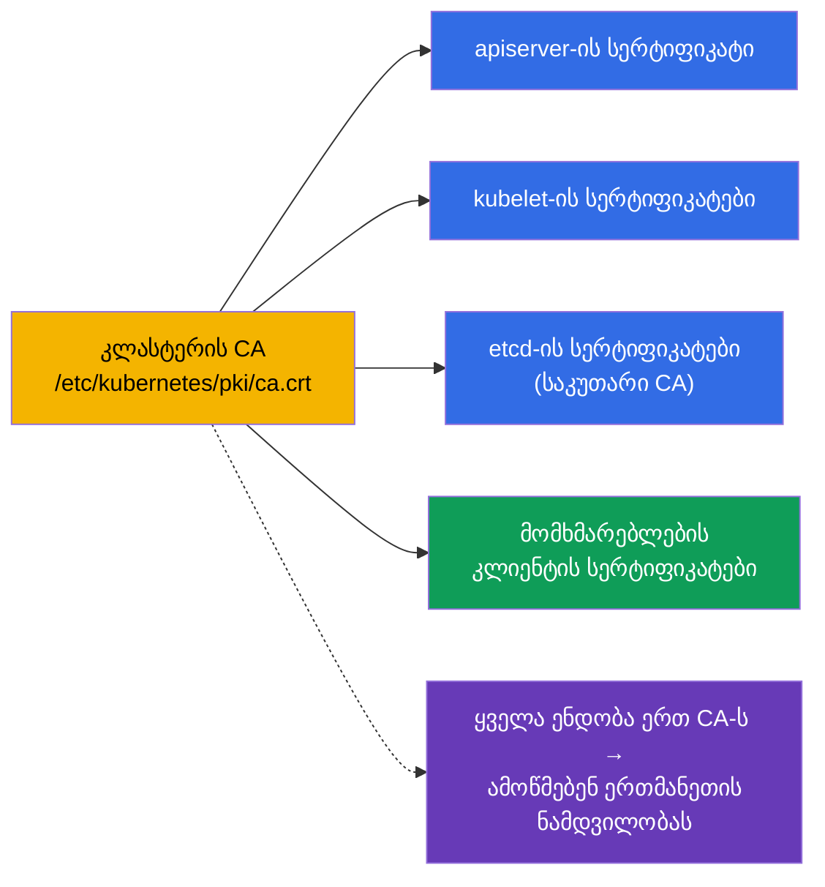
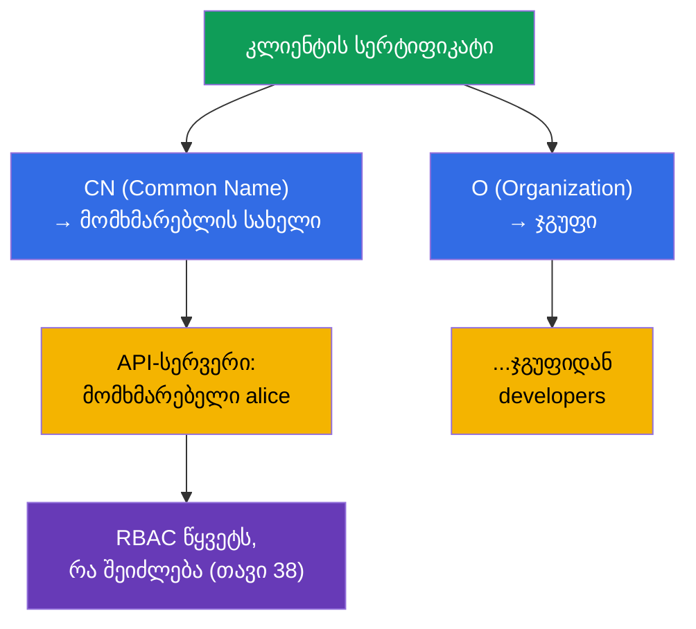
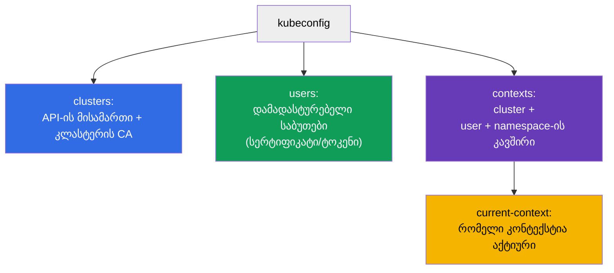
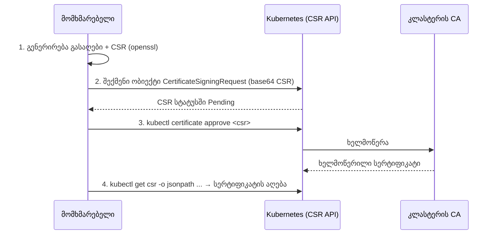
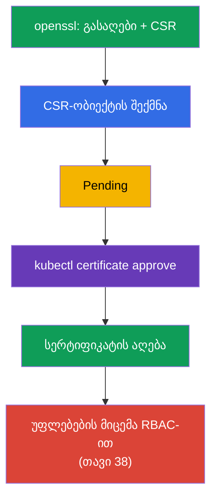
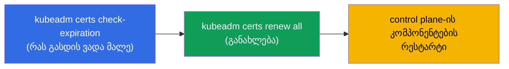
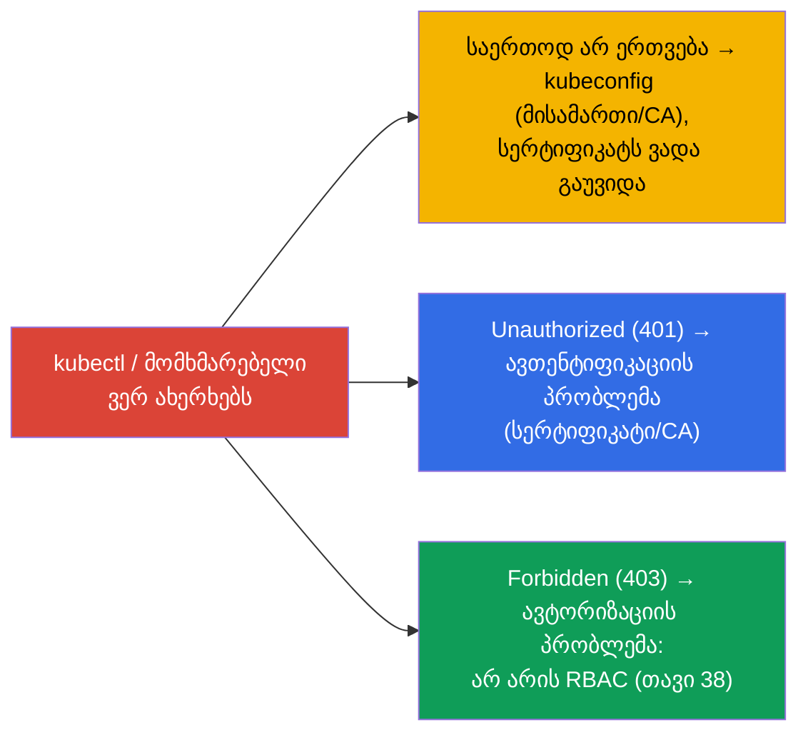

[Русская версия](ru.md) · [Eng version](README.md) · [Versión en español](es.md) · [Version française](fr.md) · [Deutsche Version](de.md)

# თავი 39. TLS-სერტიფიკატები, kubeconfig და CSR API

> 🟦 **თავი CKA-სთვის** (დომენები Cluster Architecture და უსაფრთხოება).
>
> **რა იქნება შემდეგ.** თავ 21-ში გავიგეთ, რომ ადამიანები ავთენტიფიკაციას გადიან კლიენტის
> სერტიფიკატებით, ხოლო თავ 38-ში მათ უფლებებს RBAC-ის მეშვეობით ვაძლევდით. ახლა გავარჩევთ, საიდან
> მოდის თავად დამადასტურებელი საბუთები: როგორ არის მოწყობილი **kubeconfig**, როგორ გადიან კომპონენტები და
> მომხმარებლები ავთენტიფიკაციას **TLS-სერტიფიკატებით** და როგორ გამოვწეროთ სერტიფიკატი ახალი
> მომხმარებლისთვის **CSR API**-ის მეშვეობით. ეს CKA-ის უსაფრთხოების დომენია და საფუძველი
> troubleshooting-ისთვის „kubectl არ ერთვება“ და „სერტიფიკატს ვადა გაუვიდა“.

## 39.1. TLS-სერტიფიკატები ნდობის საფუძველად

Kubernetes ბოლომდე აგებულია TLS-სერტიფიკატებზე: კომპონენტებს შორის ყველა კავშირი
დაცულია mTLS-ით (ორმხრივი TLS), ხოლო ადამიანების/კომპონენტების ავთენტიფიკაცია ხდება სერტიფიკატებით,
რომლებიც გამოშვებულია კლასტერის სანდო **CA (Certificate Authority)**-ს მიერ.



კლასტერის CA - ნდობის ფესვია. ყველაფერს, რაც მან ხელმოწერა, კლასტერი ნამდვილად მიიჩნევს. CA-ისა და
სერტიფიკატების ფაილები მდებარეობს `/etc/kubernetes/pki/`-ში (თავი 35). etcd-ს ჩვეულებრივ საკუთარი ცალკე CA აქვს.

## 39.2. როგორ მიიღება სერტიფიკატიდან „მომხმარებელი“

გავიხსენოთ თავი 21: User ობიექტი Kubernetes-ში არ არსებობს. ადამიანის ვინაობა აიღება **კლიენტის
სერტიფიკატის ველებიდან**:



- სერტიფიკატის **CN (Common Name)** → მომხმარებლის სახელი.
- **O (Organization)** → მომხმარებლის ჯგუფი.

ანუ იმისთვის, რომ „შევქმნათ მომხმარებელი“, გამოუშვებენ კლიენტის სერტიფიკატს საჭირო CN-ით (და O-ით
ჯგუფისთვის), ხელმოწერილს კლასტერის CA-ს მიერ, შემდეგ კი აძლევენ მას უფლებებს RBAC-ის მეშვეობით. ადამიანისთვის
ცალკე ობიექტი არ არსებობს - არის სერტიფიკატი + RoleBinding.

## 39.3. kubeconfig: სტრუქტურა

**kubeconfig** (`~/.kube/config`) - ფაილი, რომელიც `kubectl`-ს ეუბნება, სად დაერთოს და
რომელი დამადასტურებელი საბუთით. სამი სექცია + კონტექსტები, რომლებიც მათ აკავშირებს (თავი 3):



```yaml
apiVersion: v1
kind: Config
clusters:
- name: my-cluster
  cluster:
    server: https://10.0.0.1:6443
    certificate-authority-data: <base64 CA>      # რომ სერვერს ვენდოთ
users:
- name: alice
  user:
    client-certificate-data: <base64 cert>       # კლიენტის დამადასტურებელი საბუთი
    client-key-data: <base64 key>
contexts:
- name: alice@my-cluster
  context:
    cluster: my-cluster
    user: alice
    namespace: dev
current-context: alice@my-cluster
```

kubeconfig-თან მუშაობის ბრძანებები (თავი 3):

```bash
kubectl config view
kubectl config get-contexts
kubectl config use-context alice@my-cluster
kubectl config set-context --current --namespace=dev
```

## 39.4. CSR API: სერტიფიკატის გამოწერა მომხმარებლისთვის

როგორ გამოვწეროთ სერტიფიკატი ახალი მომხმარებლისთვის სწორი გზით (CA-ით ხელით ხელმოწერის გარეშე)?
**CertificateSigningRequest (CSR) API**-ის მეშვეობით - Kubernetes თავად მოაწერს ხელს მოთხოვნას საკუთარი CA-ით.



ნაბიჯ-ნაბიჯ:

```bash
# 1. მომხმარებელი აგენერირებს პრივატულ გასაღებს და მოთხოვნას (CSR)
openssl genrsa -out alice.key 2048
openssl req -new -key alice.key -out alice.csr -subj "/CN=alice/O=developers"

# 2. შექმენით CSR-ობიექტი კლასტერში (spec.request = base64 alice.csr-ისგან)
cat <<EOF | kubectl apply -f -
apiVersion: certificates.k8s.io/v1
kind: CertificateSigningRequest
metadata:
  name: alice
spec:
  request: $(cat alice.csr | base64 | tr -d '\n')
  signerName: kubernetes.io/kube-apiserver-client
  usages: ["client auth"]
EOF

# 3. მოთხოვნის დამტკიცება
kubectl certificate approve alice

# 4. ხელმოწერილი სერტიფიკატის აღება
kubectl get csr alice -o jsonpath='{.status.certificate}' | base64 -d > alice.crt

# 5. მომხმარებლის მიბმა როლზე RBAC-ის მეშვეობით (თორემ ავთენტიფიკაციას გაივლის, მაგრამ მიიღებს 403-ს)
kubectl create role pod-reader --verb=get,list,watch --resource=pods -n dev
kubectl create rolebinding alice-pod-reader \
  --role=pod-reader --user=alice -n dev

# შევამოწმოთ, რომ უფლებები გამოჩნდა
kubectl auth can-i list pods -n dev --as=alice
```

აქ სუბიექტია **`--user=alice`**: სახელი უნდა დაემთხვეს სერტიფიკატის `CN`-ს
(`/CN=alice`), მაშინ RBAC მიაბამს უფლებებს ზუსტად ამ დამადასტურებელ საბუთს. თუ უფლებები
ჯგუფს მიეცემოდა, გამოვიყენებდით `--group=developers`-ს (სერტიფიკატის `O` მნიშვნელობა).

> **მნიშვნელოვანია: `--user=alice` აიღება სერტიფიკატის `CN`-იდან და არა CSR-ობიექტის `metadata.name`-იდან.**
> დაერთებისას kubectl წარადგენს ხელმოწერილ სერტიფიკატს, ხოლო apiserver ვინაობას
> განსაზღვრავს ველით **`CN`** (ჯგუფებს - `O`-თი). სწორედ ამ სახელს ედარება სუბიექტი
> RoleBinding-ში. ობიექტ `CertificateSigningRequest`-ის ველი `metadata.name: alice` - ეს მხოლოდ
> CSR რესურსის სახელია კლასტერში (რომ გავაკეთოთ `kubectl certificate approve alice`); ის შეიძლება
> იყოს ნებისმიერი (`alice-csr`, `req-123`) და ვინაობაზე გავლენას არ ახდენს. მაგალითში ორივე მნიშვნელობა
> ერთმანეთს ემთხვევა (`alice`) მხოლოდ თვალსაჩინოებისთვის. შესამოწმებლად, რა არის სერტიფიკატში ჩაშენებული:
>
> ```bash
> openssl x509 -in alice.crt -noout -subject
> # subject=CN = alice, O = developers
> ```

იგივე RoleBinding მანიფესტის სახით:

```yaml
apiVersion: rbac.authorization.k8s.io/v1
kind: RoleBinding
metadata:
  name: alice-pod-reader
  namespace: dev
subjects:
- kind: User                 # სუბიექტი - მომხმარებელი სერტიფიკატის CN-იდან
  name: alice
  apiGroup: rbac.authorization.k8s.io
roleRef:
  kind: Role
  name: pod-reader
  apiGroup: rbac.authorization.k8s.io
```



სერტიფიკატის მიღების შემდეგ მომხმარებელს ამატებენ ჩანაწერს kubeconfig-ში და **აუცილებლად**
აძლევენ უფლებებს RBAC-ის მეშვეობით - თორემ ის ავთენტიფიკაციას გაივლის, მაგრამ ვერაფერს შეძლებს (403).

## 39.5. კლასტერის სერტიფიკატების მართვა და როტაცია

კლასტერის კომპონენტების სერტიფიკატებს აქვს მოქმედების ვადა (ჩვეულებრივ 1 წელი) და საჭიროებს განახლებას -
თორემ კლასტერი „გაჩერდება“. kubeadm ეხმარება მათ თვალყურის დევნებაში:

```bash
# სერტიფიკატების მოქმედების ვადების შემოწმება
sudo kubeadm certs check-expiration

# ყველა სერტიფიკატის განახლება
sudo kubeadm certs renew all
```



> **ხშირი ინციდენტი.** „kubectl უცებ აღარ მუშაობს / x509: certificate has expired“ -
> სერტიფიკატს ვადა გაუვიდა. კლასტერის განახლება (თავი 36) ჩვეულებრივ control plane-ის სერტიფიკატებს
> ავტომატურად აგრძელებს, მაგრამ იშვიათი აპგრეიდების დროს მათი გაგრძელება ხელით უწევს. Kubelet-ის
> სერტიფიკატებს თავად შეუძლიათ როტაცია (`rotateCertificates: true`).

## 39.6. წვდომის პრობლემების გამართვა

ამ თავის, თავ 21-ისა და 38-ის კავშირი იძლევა სრულ სურათს „რატომ არ არის წვდომა“:



- **არ ერთვება / x509** - ვუყურებთ kubeconfig-ს (მისამართი, CA) და სერტიფიკატის ვადას;
- **401 Unauthorized** - ავთენტიფიკაცია: სერტიფიკატი არასწორია/არასწორი CA-ით არის ხელმოწერილი;
- **403 Forbidden** - ავთენტიფიკაცია გაიარა, მაგრამ უფლებები არ არის → RBAC (თავი 38).

401-ისა და 403-ის გარჩევა კრიტიკულია: 401 - „ვინ ხარ“ (სერტიფიკატები, ეს თავი), 403 - „რა შეიძლება
შენთვის“ (RBAC, თავი 38).

## 39.7. როგორ იყენებენ ამას პროდაქშენში

- **ადამიანები - გარე identity-ის მეშვეობით, არა ხელით შექმნილი სერტიფიკატებით.** პროდში მომხმარებლებს იშვიათად
  უშვებენ სტატიკური კლიენტის სერტიფიკატებით (მათი გაუქმება რთულია). უფრო ხშირად - OIDC-ინტეგრაცია
  კორპორაციულ პროვაიდერთან (თავი 21): მოკლევადიანი ტოკენები, ჯგუფები, ცენტრალიზებული
  გაუქმება. სერტიფიკატები CSR-ის მეშვეობით - სერვისული/ტექნიკური შემთხვევებისთვის და CKA-სთვის.
- **სერტიფიკატების ვადების მონიტორინგი.** ვადაგასული control plane-ის სერტიფიკატი კლასტერს აგდებს, ხოლო
  ვადაგასული TLS Ingress - საიტს. პროდში ვადებს თვალს ადევნებენ და წინასწარ აგრძელებენ (Ingress-ისთვის -
  cert-manager, თავი 32; control plane-ისთვის - აპგრეიდები/kubeadm certs renew).
- **მოკლე ვადები და როტაცია.** ტრენდი - მოკლევადიანი სერტიფიკატები ავტომატური
  როტაციით (kubelet, SA-ს პროეცირებული ტოკენები - თავი 21), რომ გაჟონილი დამადასტურებელი საბუთი სწრაფად
  მოძველდეს.
- **CA-სა და პრივატული გასაღებების დაცვა.** კლასტერის CA და პრივატული გასაღებები `/etc/kubernetes/pki/`-ში -
  მაქსიმალურად მგრძნობიარეა: CA-სთან წვდომა = ნებისმიერი დამადასტურებელი საბუთის გამოშვების შესაძლებლობა. მათ
  მკაცრად ზღუდავენ და ბექაპავენ etcd-სთან ერთად.
- **kubeconfig როგორც საიდუმლო.** admin.conf იძლევა სრულ წვდომას კლასტერზე - მას ინახავენ როგორც
  საიდუმლოს, არ აქვეყნებენ git-ში და არ არიგებენ ზედმეტ ადამიანებს.

## 39.8. მინი-ლექსიკონი

- **CA (Certificate Authority)** - კლასტერის სერტიფიკაციის ცენტრი; ნდობის ფესვი.
- **კლიენტის სერტიფიკატი** - მომხმარებლის დამადასტურებელი საბუთი; CN → სახელი, O → ჯგუფი.
- **mTLS** - ორმხრივი TLS კლასტერის კომპონენტებს შორის.
- **kubeconfig** - ფაილი clusters, users, contexts-ით kubectl-ის დასაერთებლად.
- **context** - cluster + user + namespace-ის კავშირი.
- **CSR (CertificateSigningRequest)** - სერტიფიკატის ხელმოწერის მოთხოვნა კლასტერის API-ის მეშვეობით.
- **kubectl certificate approve** - CSR-ის დამტკიცება (CA-ით ხელმოწერა).
- **kubeadm certs renew** - კლასტერის სერტიფიკატების განახლება.
- **401 vs 403** - არ არის ავთენტიფიცირებული (სერტიფიკატი) vs არ აქვს უფლებები (RBAC).

## 39.9. თავის შეჯამება

- Kubernetes აგებულია TLS-ზე: კომპონენტები ურთიერთობენ mTLS-ით, ავთენტიფიკაცია - კლასტერის
  CA-ით ხელმოწერილი სერტიფიკატებით (`/etc/kubernetes/pki/`).
- „მომხმარებელი“ აიღება სერტიფიკატიდან: CN → სახელი, O → ჯგუფი; User ობიექტი არ არსებობს.
- kubeconfig აღწერს clusters-ს (მისამართი+CA), users-ს (დამადასტურებელი საბუთები), contexts-ს (კავშირები);
  აქტიურია - current-context.
- სერტიფიკატის სწორად გამოწერა მომხმარებლისთვის - CSR API-ის მეშვეობით: გენერირება CSR → ობიექტის
  შექმნა → `certificate approve` → სერტიფიკატის აღება → უფლებების მიცემა RBAC-ით.
- კლასტერის სერტიფიკატებს ვადა უვდება; შემოწმება/გაგრძელება - `kubeadm certs check-expiration` /
  `renew all`; აპგრეიდი ჩვეულებრივ control plane-ს ავტომატურად უგრძელებს.
- წვდომის გამართვა: არ ერთვება/x509 → kubeconfig/ვადები; 401 → ავთენტიფიკაცია
  (სერტიფიკატი); 403 → ავტორიზაცია (RBAC).

## 39.10. როგორ გამოგადგებათ: გამოცდაზე და რეალურ სამუშაოში

**გამოცდაზე (CKA).** „მიეცი მომხმარებელს წვდომა“ CSR API-ის მეშვეობით, „მოაწყე kubeconfig/
კონტექსტი“, „რატომ არ ერთვება kubectl / 401 / 403“ - ტიპური დავალებებია. საჭიროა ვიცოდეთ
CSR-ის პროცედურა (approve!), kubeconfig-ის სტრუქტურა და გავარჩიოთ 401 (სერტიფიკატი) 403-ისგან (RBAC,
თავი 38). ხშირად CSR-დავალება RBAC-თან კავშირში მოდის.

**რეალურ სამუშაოში.** სერტიფიკატებისა და kubeconfig-ის გაგება - წვდომის მართვისა და
ინციდენტების „არ უშვებს“ გარჩევის საფუძველია. პროდში ადამიანებს OIDC-ის მეშვეობით უშვებენ, ხოლო სერტიფიკატების
ვადების მონიტორინგი (control plane, Ingress) აღკვეთს ხმაურიან უარებს „სერტიფიკატს ვადა გაუვიდა“.
CA-სა და admin.conf-ის დაცვა - კრიტიკულია კლასტერის უსაფრთხოებისთვის.

## 39.11. თვითშემოწმების კითხვები

1. რა არის ნდობის ფესვი კლასტერში და სად მდებარეობს მისი ფაილები?
2. როგორ მიიღება კლიენტის სერტიფიკატიდან მომხმარებლის სახელი და მისი ჯგუფი?
3. რომელი სექციებისგან შედგება kubeconfig და რას აკავშირებს context?
4. აღწერეთ სერტიფიკატის გამოწერის ნაბიჯები მომხმარებლისთვის CSR API-ის მეშვეობით. რა უნდა გავაკეთოთ
   აუცილებლად ამის შემდეგ?
5. როგორ შევამოწმოთ და გავაგრძელოთ კლასტერის სერტიფიკატები?
6. რითი განსხვავდება 401 403-ისგან და სად ვიყუროთ თითოეულ შემთხვევაში?
7. რატომ უშვებენ პროდში ადამიანებს უფრო ხშირად OIDC-ის მეშვეობით და არა სტატიკური სერტიფიკატებით?

## პრაქტიკა

ჩვენ დავხურეთ ავთენტიფიკაცია და წვდომა. თავ 40-ში გავარჩევთ კლასტერის გაფართოების ინტერფეისებს -
CNI, CSI, CRI, - რომლებიც უკვე ვახსენეთ და რომლებიც განსაზღვრავენ, როგორ ერთვება ქსელი, საცავი და
რანტაიმი. სერტიფიკატები, kubeconfig და CSR მუშავდება უსაფრთხოების ლაბორატორიულ სამუშაოებში.

🧪 ლაბი 113 (ადამიანისთვის წვდომის გამოწერა CSR API-ის მეშვეობით: სერტიფიკატი + Role/RoleBinding): [tasks/cka/labs/113](../../labs/113/README_GE.MD)

🧪 ლაბი 118 (მათ შორის სერტიფიკატების health-check): [tasks/cka/labs/118](../../labs/118/README_GE.MD)

---
[სარჩევი](../README_GE.md) · [თავი 38](../38/ge.md) · [თავი 40](../40/ge.md)
