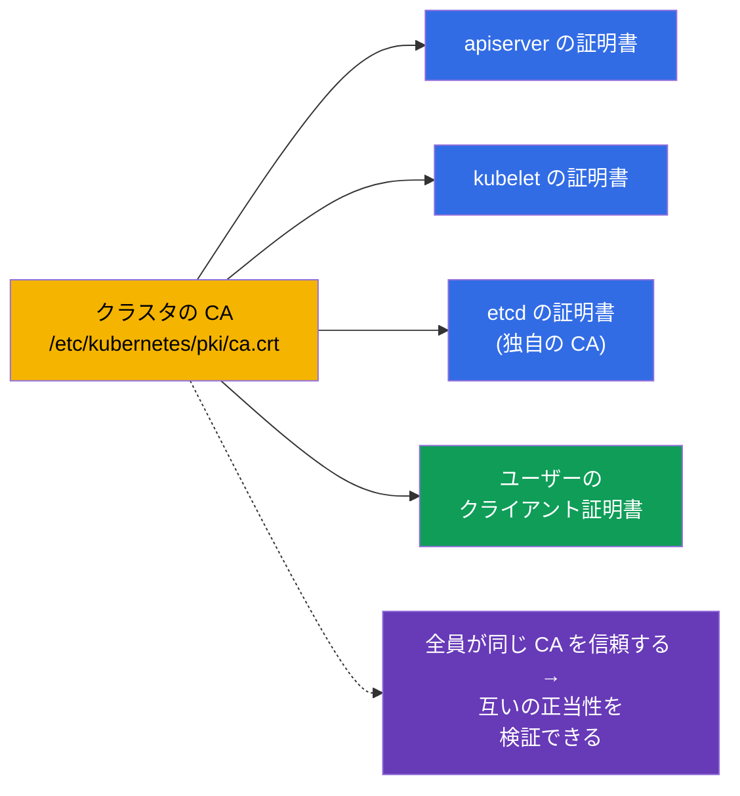
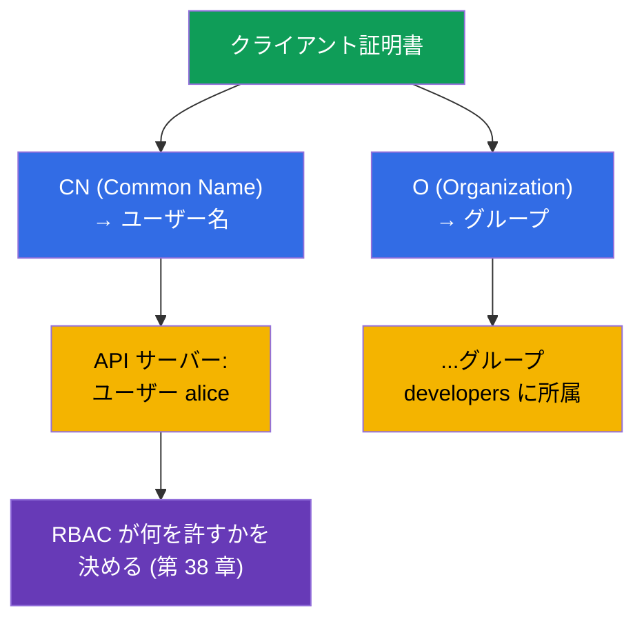
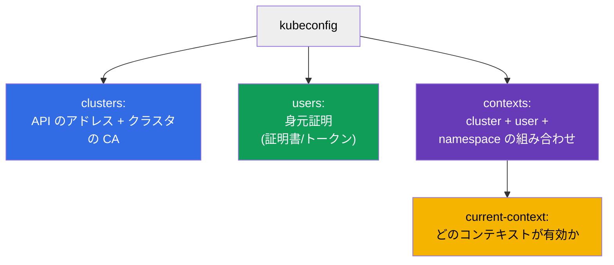
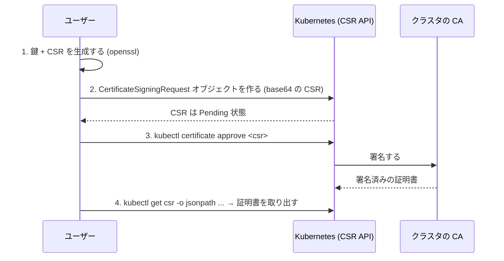
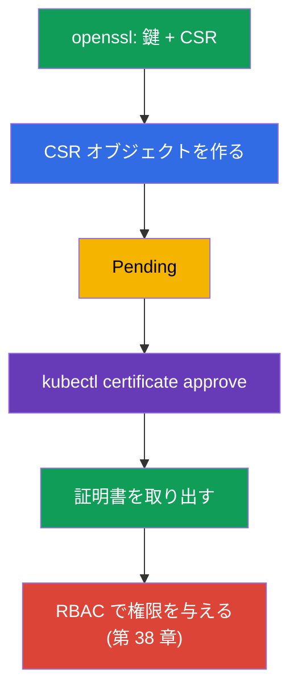
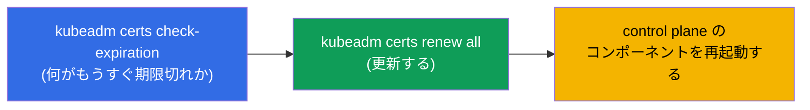
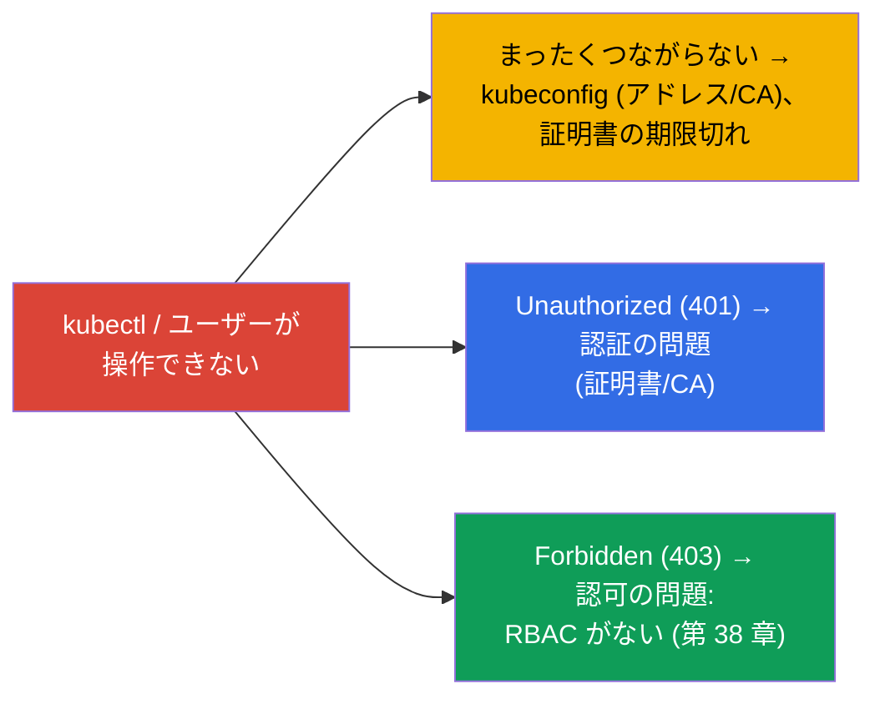

[Русская версия](ru.md) · [Eng version](README.md) · [Versión en español](es.md) · [Version française](fr.md) · [Deutsche Version](de.md) · [ქართული ვერსია](ge.md) · [繁體中文版](tw.md)

# 第 39 章。TLS 証明書、kubeconfig、CSR API

> 🟦 **CKA 向けの章**（領域 Cluster Architecture とセキュリティ）。
>
> **次は何か。** 第 21 章で、人はクライアント証明書によって認証されると学び、
> 第 38 章では RBAC で権限を与えました。今度は、その身元証明そのものがどこから
> 来るのかを分解します：**kubeconfig** はどう作られているのか、コンポーネントと
> ユーザーは **TLS 証明書** でどう認証されるのか、そして **CSR API** を通じて
> 新しいユーザーに証明書を発行する方法です。これは CKA のセキュリティ領域であり、
> 「kubectl がつながらない」「証明書が期限切れ」の troubleshooting の土台です。

## 39.1. 信頼の土台としての TLS 証明書

Kubernetes は隅々まで TLS 証明書の上に建っています：コンポーネント間のすべての接続は
mTLS（相互 TLS）で保護され、人／コンポーネントの認証は、クラスタの信頼された
**CA (Certificate Authority)** が発行した証明書によって行われます。



クラスタの CA は信頼の根です。それが署名したものはすべて、クラスタが正当だと見なします。
CA と証明書のファイルは `/etc/kubernetes/pki/` にあります（第 35 章）。etcd は通常、
自分専用の別の CA を持ちます。

## 39.2. 証明書から「ユーザー」がどう生まれるか

第 21 章を思い出しましょう：Kubernetes には User というオブジェクトはありません。人の
身元は **クライアント証明書のフィールドから** 取られます：



- 証明書の **CN (Common Name)** → ユーザー名。
- **O (Organization)** → ユーザーのグループ。

つまり「ユーザーを作る」ためには、必要な CN（グループ用には O）を持つクライアント証明書を
クラスタの CA に署名させて発行し、そのあとで RBAC を通じて権限を与えます。人に対応する
専用のオブジェクトはありません - あるのは証明書 + RoleBinding です。

## 39.3. kubeconfig：構造

**kubeconfig** (`~/.kube/config`) は、`kubectl` にどこへ接続するか、どの身元証明で
接続するかを伝えるファイルです。3 つのセクションと、それらを結びつけるコンテキストから
成ります（第 3 章）：



```yaml
apiVersion: v1
kind: Config
clusters:
- name: my-cluster
  cluster:
    server: https://10.0.0.1:6443
    certificate-authority-data: <base64 CA>      # サーバーを信頼するため
users:
- name: alice
  user:
    client-certificate-data: <base64 cert>       # クライアントの身元証明
    client-key-data: <base64 key>
contexts:
- name: alice@my-cluster
  context:
    cluster: my-cluster
    user: alice
    namespace: dev
current-context: alice@my-cluster
```

kubeconfig を扱うコマンド（第 3 章）：

```bash
kubectl config view
kubectl config get-contexts
kubectl config use-context alice@my-cluster
kubectl config set-context --current --namespace=dev
```

## 39.4. CSR API：ユーザーへの証明書の発行

新しいユーザーに正しい方法で（CA で手作業に署名するのではなく）証明書を発行するには
どうしますか。**CertificateSigningRequest (CSR) API** を通します - Kubernetes 自身が
自分の CA でリクエストに署名してくれます。



手順ごとに：

```bash
# 1. ユーザーが秘密鍵とリクエスト (CSR) を生成する
openssl genrsa -out alice.key 2048
openssl req -new -key alice.key -out alice.csr -subj "/CN=alice/O=developers"

# 2. クラスタに CSR オブジェクトを作る (spec.request = alice.csr の base64)
cat <<EOF | kubectl apply -f -
apiVersion: certificates.k8s.io/v1
kind: CertificateSigningRequest
metadata:
  name: alice
spec:
  request: $(cat alice.csr | base64 | tr -d '\n')
  signerName: kubernetes.io/kube-apiserver-client
  usages: ["client auth"]
EOF

# 3. リクエストを承認する
kubectl certificate approve alice

# 4. 署名済みの証明書を取り出す
kubectl get csr alice -o jsonpath='{.status.certificate}' | base64 -d > alice.crt

# 5. RBAC でユーザーをロールに紐づける (でなければ認証は通るが 403 になる)
kubectl create role pod-reader --verb=get,list,watch --resource=pods -n dev
kubectl create rolebinding alice-pod-reader \
  --role=pod-reader --user=alice -n dev

# 権限が付いたことを確認する
kubectl auth can-i list pods -n dev --as=alice
```

ここでの subject は **`--user=alice`** です：名前は証明書の `CN`（`/CN=alice`）と一致して
いなければならず、そうすることで RBAC はまさにその身元証明に権限を紐づけます。もし権限を
グループに与えるなら、`--group=developers`（証明書の `O` の値）を使います。

> **重要：`--user=alice` は証明書の `CN` から取られ、CSR オブジェクトの `metadata.name`
> からではありません。** 接続時に kubectl は署名済みの証明書を提示し、apiserver は
> **`CN`** フィールドで身元を判定します（グループは `O` で）。RoleBinding の subject が
> 照合されるのは、まさにこの名前です。`CertificateSigningRequest` オブジェクトの
> `metadata.name: alice` は、クラスタ内での CSR リソースの名前にすぎません
> （`kubectl certificate approve alice` を実行するためのもの）。それは何でもよく
> （`alice-csr`、`req-123`）、身元には影響しません。例では分かりやすさのために
> 両方の値を一致させている（`alice`）だけです。証明書に何が焼き込まれているかの確認：
>
> ```bash
> openssl x509 -in alice.crt -noout -subject
> # subject=CN = alice, O = developers
> ```

同じ RoleBinding をマニフェストで書くと：

```yaml
apiVersion: rbac.authorization.k8s.io/v1
kind: RoleBinding
metadata:
  name: alice-pod-reader
  namespace: dev
subjects:
- kind: User                 # subject - 証明書の CN から来るユーザー
  name: alice
  apiGroup: rbac.authorization.k8s.io
roleRef:
  kind: Role
  name: pod-reader
  apiGroup: rbac.authorization.k8s.io
```



証明書を受け取ったら、ユーザーの kubeconfig にエントリを追加し、**必ず** RBAC で権限を
与えます - でなければ認証は通るのに何もできません (403)。

## 39.5. クラスタ証明書の管理とローテーション

クラスタのコンポーネントの証明書には有効期限（通常 1 年）があり、更新が必要です -
でなければクラスタが「止まります」。kubeadm はそれらを見張る手助けをしてくれます：

```bash
# 証明書の有効期限を確認する
sudo kubeadm certs check-expiration

# すべての証明書を更新する
sudo kubeadm certs renew all
```



> **よくあるインシデント。** 「kubectl が突然動かなくなった / x509: certificate has
> expired」 - 証明書の期限切れです。クラスタのアップグレード（第 36 章）は通常
> control plane の証明書を自動的に延長しますが、アップグレードがまれな場合は手動で
> 延長する必要があります。kubelet の証明書は自分でローテーションできます
> (`rotateCertificates: true`)。

## 39.6. アクセスの問題のデバッグ

この章と第 21 章、第 38 章を合わせると、「なぜアクセスできないのか」の全体像が見えます：



- **つながらない / x509** - kubeconfig（アドレス、CA）と証明書の期限を見ます；
- **401 Unauthorized** - 認証：証明書が違う／違う CA で署名されている；
- **403 Forbidden** - 認証は通ったが権限がない → RBAC（第 38 章）。

401 と 403 を見分けることは決定的に重要です：401 は「あなたは誰か」（証明書、この章）、
403 は「あなたに何が許されるか」（RBAC、第 38 章）です。

## 39.7. 本番環境でこれをどう使うか

- **人は外部の identity で、証明書を手作業ではなく。** 本番では、静的なクライアント
  証明書でユーザーを登録することはまれです（失効させるのが難しいため）。多いのは
  企業のプロバイダとの OIDC 連携（第 21 章）です：期限の短いトークン、グループ、
  中央での失効。CSR による証明書は、サービス／技術的な用途と CKA のためのものです。
- **証明書の期限の監視。** 期限切れの control plane の証明書はクラスタを落とし、
  期限切れの TLS Ingress はサイトを落とします。本番では期限を見張り、前倒しで延長します
  （Ingress には cert-manager、第 32 章；control plane にはアップグレード /
  kubeadm certs renew）。
- **短い有効期限とローテーション。** 流れは、自動ローテーション付きの短命な証明書
  （kubelet、SA の projected トークン - 第 21 章）です。漏れた身元証明が素早く
  無効になるようにするためです。
- **CA と秘密鍵の保護。** クラスタの CA と `/etc/kubernetes/pki/` の秘密鍵は最大級に
  機微です：CA へのアクセス = どんな身元証明でも発行できるということ。それらは厳しく
  制限し、etcd と一緒にバックアップします。
- **kubeconfig は secret として。** admin.conf はクラスタへの完全なアクセスを与えます -
  secret として保管し、git にコミットせず、余計な人には配りません。

## 39.8. ミニ用語集

- **CA (Certificate Authority)** - クラスタの認証局；信頼の根。
- **クライアント証明書** - ユーザーの身元証明；CN → 名前、O → グループ。
- **mTLS** - クラスタのコンポーネント間の相互 TLS。
- **kubeconfig** - kubectl の接続のための clusters, users, contexts が入ったファイル。
- **context** - cluster + user + namespace の組み合わせ。
- **CSR (CertificateSigningRequest)** - クラスタの API を通した証明書署名のリクエスト。
- **kubectl certificate approve** - CSR を承認する（CA で署名する）。
- **kubeadm certs renew** - クラスタの証明書を更新する。
- **401 vs 403** - 認証されていない（証明書）vs 権限がない（RBAC）。

## 39.9. 本章のまとめ

- Kubernetes は TLS の上に建っています：コンポーネントは mTLS で通信し、認証は
  クラスタの CA が署名した証明書によります (`/etc/kubernetes/pki/`)。
- 「ユーザー」は証明書から取られます：CN → 名前、O → グループ；User というオブジェクトは
  ありません。
- kubeconfig は clusters（アドレス + CA）、users（身元証明）、contexts（組み合わせ）を
  記述し、有効なのは current-context です。
- ユーザーに証明書を正しく発行するには CSR API を通します：CSR を生成 → オブジェクトを
  作る → `certificate approve` → 証明書を取り出す → RBAC で権限を与える。
- クラスタの証明書は期限切れになります；確認／延長は `kubeadm certs check-expiration` /
  `renew all`；アップグレードは通常 control plane を自動的に延長します。
- アクセスのデバッグ：つながらない/x509 → kubeconfig/期限；401 → 認証
  （証明書）；403 → 認可（RBAC）。

## 39.10. これがどう役に立つか：試験と実際の仕事で

**試験では (CKA)。** CSR API を通した「ユーザーにアクセスを与えよ」、「kubeconfig /
コンテキストを設定せよ」、「なぜ kubectl がつながらない / 401 / 403 なのか」は典型的な
課題です。CSR の手順（approve を忘れずに！）、kubeconfig の構造、そして 401（証明書）と
403（RBAC、第 38 章）の区別を知っている必要があります。CSR の課題はしばしば RBAC と
組み合わせて出ます。

**実際の仕事では。** 証明書と kubeconfig の理解は、アクセス管理と「通してくれない」
インシデントの調査の土台です。本番では人を OIDC で登録し、証明書の期限の監視
（control plane、Ingress）が「証明書が期限切れ」という派手な障害を防ぎます。
CA と admin.conf の保護は、クラスタのセキュリティにとって決定的です。

## 39.11. 自己チェックの質問

1. クラスタにおける信頼の根は何で、そのファイルはどこにありますか？
2. クライアント証明書から、ユーザー名とそのグループはどのように得られますか？
3. kubeconfig はどのセクションから成り、context は何を結びつけますか？
4. CSR API を通してユーザーに証明書を発行する手順を説明してください。そのあとに必ず
   やるべきことは何ですか？
5. クラスタの証明書はどうやって確認し、延長しますか？
6. 401 は 403 とどう違い、それぞれの場合どこを見ますか？
7. なぜ本番では、静的な証明書ではなく OIDC で人を登録することが多いのですか？

## 演習

認証とアクセスは終えました。第 40 章ではクラスタの拡張インターフェイス -
CNI、CSI、CRI - を分解します。すでに触れてきたもので、ネットワーク、ストレージ、
ランタイムがどう接続されるかを決めます。証明書、kubeconfig、CSR はセキュリティ関連の
ラボで練習します。

🧪 ラボ 113（CSR API を通して人にアクセスを与える：証明書 + Role/RoleBinding）: [tasks/cka/labs/113](../../labs/113/README_JP.MD)

🧪 ラボ 118（証明書の health-check も含む）: [tasks/cka/labs/118](../../labs/118/README_JP.MD)

---
[目次](../README_JP.md) · [第 38 章](../38/jp.md) · [第 40 章](../40/jp.md)
