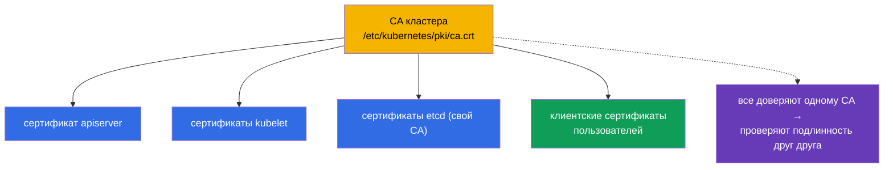
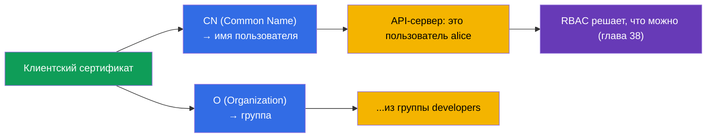
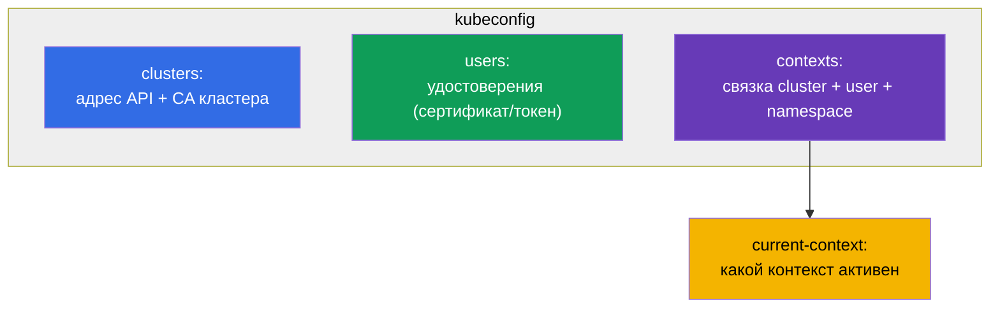
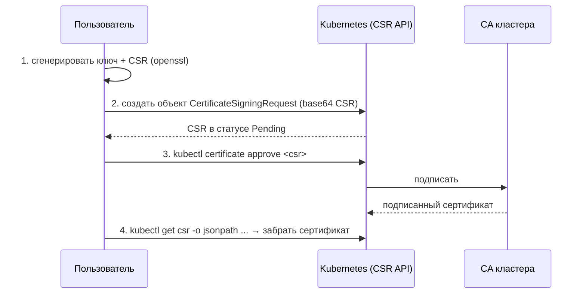
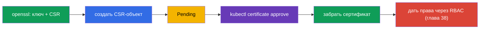
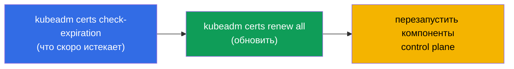
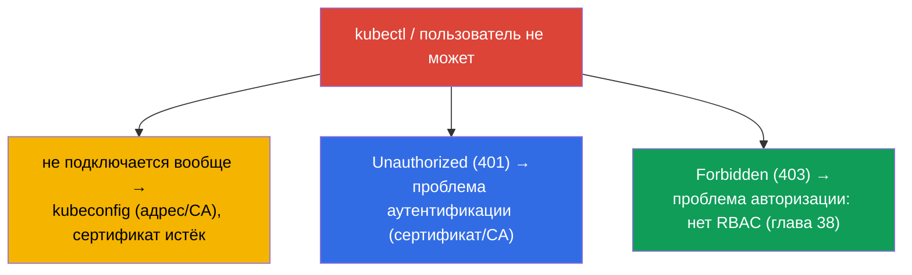

# Глава 39. TLS-сертификаты, kubeconfig и CSR API

> 🟦 **Глава для CKA** (домены Cluster Architecture и безопасность).
>
> **Что дальше.** В главе 21 мы узнали, что люди аутентифицируются по клиентским
> сертификатам, а в главе 38 давали им права через RBAC. Теперь разберём, откуда берутся
> сами удостоверения: как устроен **kubeconfig**, как компоненты и пользователи
> аутентифицируются **TLS-сертификатами**, и как выдать сертификат новому пользователю
> через **CSR API**. Это домен безопасности CKA и основа troubleshooting «kubectl не
> подключается» и «сертификат истёк».

## 39.1. TLS-сертификаты как основа доверия

Kubernetes насквозь построен на TLS-сертификатах: все соединения между компонентами
защищены mTLS (взаимный TLS), и аутентификация людей/компонентов идёт по сертификатам,
выпущенным доверенным **CA (Certificate Authority)** кластера.



CA кластера - корень доверия. Всё, что он подписал, кластер считает подлинным. Файлы CA и
сертификатов лежат в `/etc/kubernetes/pki/` (глава 35). У etcd обычно свой отдельный CA.

## 39.2. Как из сертификата получается «пользователь»

Вспомним главу 21: объекта User в Kubernetes нет. Личность человека берётся **из полей
клиентского сертификата**:



- **CN (Common Name)** сертификата → имя пользователя.
- **O (Organization)** → группа пользователя.

То есть чтобы «создать пользователя», выпускают клиентский сертификат с нужным CN (и O для
группы), подписанный CA кластера, а затем дают ему права через RBAC. Отдельного объекта
для человека нет - есть сертификат + RoleBinding.

## 39.3. kubeconfig: структура

**kubeconfig** (`~/.kube/config`) - файл, который говорит `kubectl`, куда подключаться и
под каким удостоверением. Три раздела + контексты, связывающие их (глава 3):



```yaml
apiVersion: v1
kind: Config
clusters:
- name: my-cluster
  cluster:
    server: https://10.0.0.1:6443
    certificate-authority-data: <base64 CA>      # чтобы доверять серверу
users:
- name: alice
  user:
    client-certificate-data: <base64 cert>       # удостоверение клиента
    client-key-data: <base64 key>
contexts:
- name: alice@my-cluster
  context:
    cluster: my-cluster
    user: alice
    namespace: dev
current-context: alice@my-cluster
```

Команды работы с kubeconfig (глава 3):

```bash
kubectl config view
kubectl config get-contexts
kubectl config use-context alice@my-cluster
kubectl config set-context --current --namespace=dev
```

## 39.4. CSR API: выдача сертификата пользователю

Как выдать сертификат новому пользователю правильным способом (не подписывая CA вручную)?
Через **CertificateSigningRequest (CSR) API** - Kubernetes сам подпишет запрос своим CA.



Пошагово:

```bash
# 1. Пользователь генерирует приватный ключ и запрос (CSR)
openssl genrsa -out alice.key 2048
openssl req -new -key alice.key -out alice.csr -subj "/CN=alice/O=developers"

# 2. Создать объект CSR в кластере (spec.request = base64 от alice.csr)
cat <<EOF | kubectl apply -f -
apiVersion: certificates.k8s.io/v1
kind: CertificateSigningRequest
metadata:
  name: alice
spec:
  request: $(cat alice.csr | base64 | tr -d '\n')
  signerName: kubernetes.io/kube-apiserver-client
  usages: ["client auth"]
EOF

# 3. Одобрить запрос
kubectl certificate approve alice

# 4. Забрать подписанный сертификат
kubectl get csr alice -o jsonpath='{.status.certificate}' | base64 -d > alice.crt
```



После получения сертификата пользователю добавляют запись в kubeconfig и **обязательно**
дают права через RBAC - иначе он аутентифицируется, но ничего не сможет (403).

## 39.5. Управление и ротация сертификатов кластера

Сертификаты компонентов кластера имеют срок годности (обычно 1 год) и требуют обновления -
иначе кластер «встанет». kubeadm помогает следить за ними:

```bash
# Проверить сроки действия сертификатов
sudo kubeadm certs check-expiration

# Обновить все сертификаты
sudo kubeadm certs renew all
```



> **Частый инцидент.** «kubectl вдруг перестал работать / x509: certificate has expired» -
> истёк сертификат. Обновление кластера (глава 36) обычно продлевает сертификаты control
> plane автоматически, но при редких апгрейдах их надо продлевать вручную. Kubelet-
> сертификаты умеют ротироваться сами (`rotateCertificates: true`).

## 39.6. Отладка проблем с доступом

Связка этой главы, главы 21 и 38 даёт полную картину «почему нет доступа»:



- **не подключается / x509** - смотрим kubeconfig (адрес, CA) и срок сертификата;
- **401 Unauthorized** - аутентификация: сертификат не тот/не тем CA подписан;
- **403 Forbidden** - аутентификация прошла, но нет прав → RBAC (глава 38).

Различать 401 и 403 критично: 401 - «кто ты» (сертификаты, эта глава), 403 - «что тебе
можно» (RBAC, глава 38).

## 39.7. Как это применяют в продакшене

- **Люди - через внешнюю identity, не сертификаты вручную.** В проде пользователей редко
  заводят статичными клиентскими сертификатами (их сложно отзывать). Чаще - OIDC-интеграция
  с корпоративным провайдером (глава 21): токены с коротким сроком, группы, централизованный
  отзыв. Сертификаты через CSR - для сервисных/технических случаев и для CKA.
- **Мониторинг сроков сертификатов.** Истёкший сертификат control plane роняет кластер, а
  истёкший TLS Ingress - сайт. В проде за сроками следят и продлевают заранее (для
  Ingress - cert-manager, глава 32; для control plane - апгрейды/kubeadm certs renew).
- **Короткие сроки и ротация.** Тренд - короткоживущие сертификаты с автоматической
  ротацией (kubelet, проецируемые токены SA - глава 21), чтобы утёкшее удостоверение быстро
  устаревало.
- **Защита CA и приватных ключей.** CA кластера и приватные ключи в `/etc/kubernetes/pki/` -
  максимально чувствительны: доступ к CA = возможность выпустить любое удостоверение. Их
  строго ограничивают и бэкапят вместе с etcd.
- **kubeconfig как секрет.** admin.conf даёт полный доступ к кластеру - его хранят как
  секрет, не коммитят в git и не раздают лишним людям.

## 39.8. Мини-глоссарий

- **CA (Certificate Authority)** - центр сертификации кластера; корень доверия.
- **Клиентский сертификат** - удостоверение пользователя; CN → имя, O → группа.
- **mTLS** - взаимный TLS между компонентами кластера.
- **kubeconfig** - файл с clusters, users, contexts для подключения kubectl.
- **context** - связка cluster + user + namespace.
- **CSR (CertificateSigningRequest)** - запрос на подпись сертификата через API кластера.
- **kubectl certificate approve** - одобрить CSR (подписать CA).
- **kubeadm certs renew** - обновить сертификаты кластера.
- **401 vs 403** - не аутентифицирован (сертификат) vs нет прав (RBAC).

## 39.9. Итоги главы

- Kubernetes построен на TLS: компоненты общаются по mTLS, аутентификация - по
  сертификатам, подписанным CA кластера (`/etc/kubernetes/pki/`).
- «Пользователь» берётся из сертификата: CN → имя, O → группа; объекта User нет.
- kubeconfig описывает clusters (адрес+CA), users (удостоверения), contexts (связки);
  активный - current-context.
- Правильно выдать сертификат пользователю - через CSR API: сгенерировать CSR → создать
  объект → `certificate approve` → забрать сертификат → дать права RBAC.
- Сертификаты кластера истекают; проверка/продление - `kubeadm certs check-expiration` /
  `renew all`; апгрейд обычно продлевает control plane автоматически.
- Отладка доступа: не подключается/x509 → kubeconfig/сроки; 401 → аутентификация
  (сертификат); 403 → авторизация (RBAC).

## 39.10. Как это пригодится: на экзамене и в реальной работе

**На экзамене (CKA).** «Выдай пользователю доступ» через CSR API, «настрой kubeconfig/
контекст», «почему kubectl не подключается / 401 / 403» - типовые задания. Нужно знать
процедуру CSR (approve!), структуру kubeconfig и различать 401 (сертификат) от 403 (RBAC,
глава 38). Часто CSR-задание идёт в связке с RBAC.

**В реальной работе.** Понимание сертификатов и kubeconfig - основа управления доступом и
разбора инцидентов «не пускает». В проде людей заводят через OIDC, а мониторинг сроков
сертификатов (control plane, Ingress) предотвращает громкие отказы «сертификат истёк».
Защита CA и admin.conf - критична для безопасности кластера.

## 39.11. Вопросы для самопроверки

1. Что является корнем доверия в кластере и где лежат его файлы?
2. Как из клиентского сертификата получаются имя пользователя и его группа?
3. Из каких разделов состоит kubeconfig и что связывает context?
4. Опишите шаги выдачи сертификата пользователю через CSR API. Что обязательно сделать
   после?
5. Как проверить и продлить сертификаты кластера?
6. Чем 401 отличается от 403 и куда смотреть в каждом случае?
7. Почему в проде людей чаще заводят через OIDC, а не статичными сертификатами?

## Практика

Мы закрыли аутентификацию и доступ. В главе 40 разберём интерфейсы расширения кластера -
CNI, CSI, CRI, - которые уже упоминались и определяют, как подключаются сеть, хранилище и
рантайм. Сертификаты, kubeconfig и CSR отрабатываются в лабах по безопасности.

🧪 Лаба 118 (в т.ч. health-check сертификатов): [tasks/cka/labs/118](../../labs/118/README_RU.MD)

---
[Оглавление](../README_RU.md) · [Глава 38](../38/ru.md) · [Глава 40](../40/ru.md)
