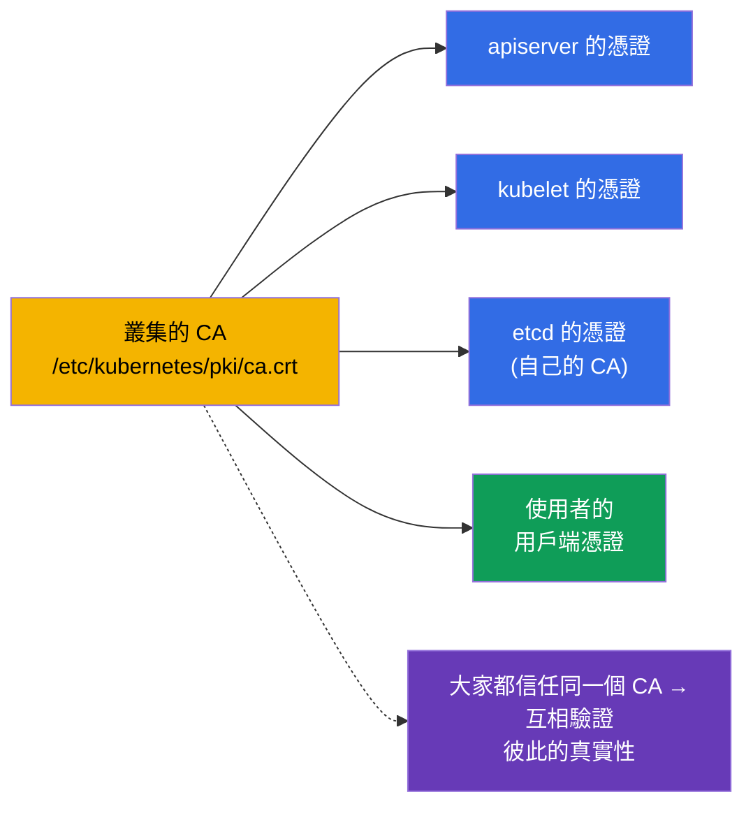
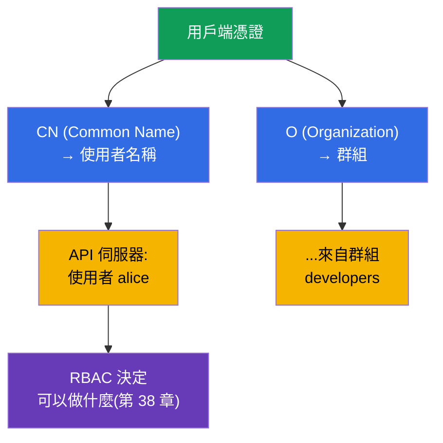
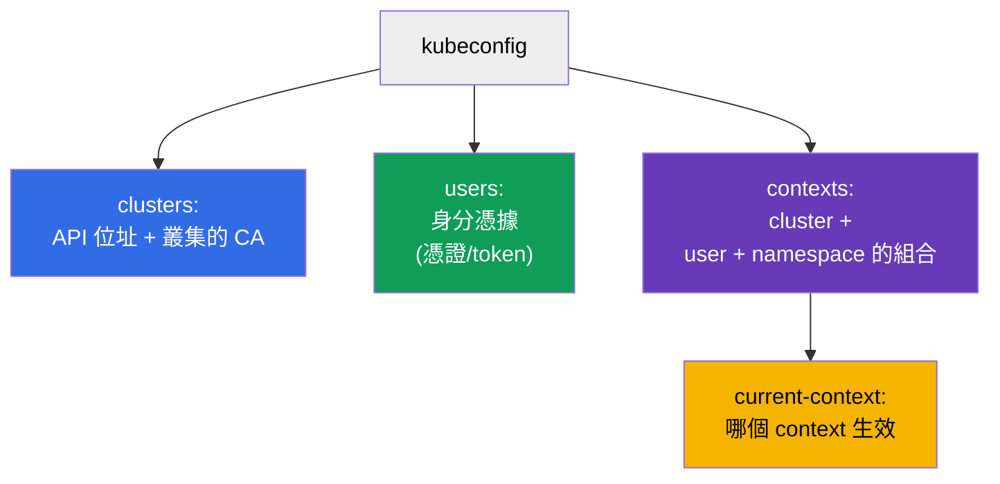
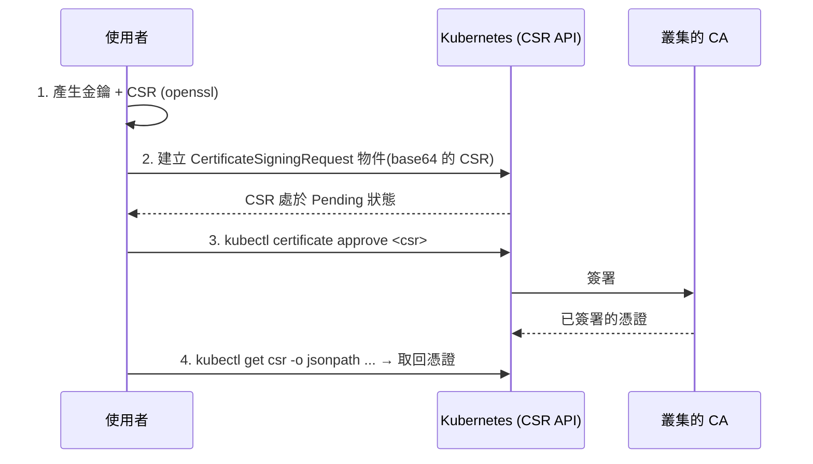
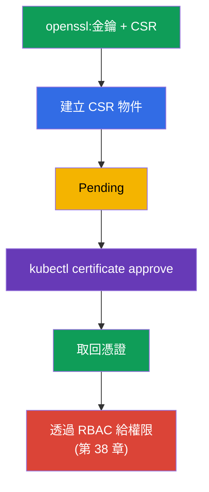
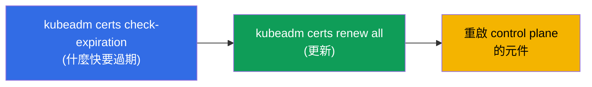
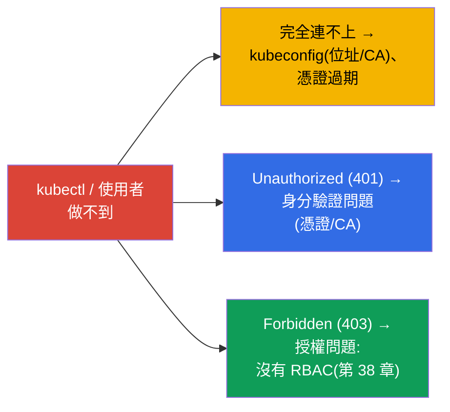

[Русская версия](ru.md) · [Eng version](README.md) · [Versión en español](es.md) · [Version française](fr.md) · [Deutsche Version](de.md) · [ქართული ვერსია](ge.md) · [日本語版](jp.md)

# 第 39 章。TLS 憑證、kubeconfig 與 CSR API

> 🟦 **CKA 章節**(領域 Cluster Architecture 與安全)。
>
> **接下來是什麼。** 在第 21 章我們知道了人是用用戶端憑證來做身分驗證的,
> 而在第 38 章我們透過 RBAC 給了他們權限。現在來拆解這些身分憑據本身是從哪裡來的:
> **kubeconfig** 是怎麼組成的、元件與使用者如何用 **TLS 憑證** 做身分驗證,
> 以及如何透過 **CSR API** 給新使用者簽發憑證。這是 CKA 的安全領域,也是
> 「kubectl 連不上」與「憑證過期」這類 troubleshooting 的基礎。

## 39.1. TLS 憑證作為信任的基礎

Kubernetes 從頭到尾都建立在 TLS 憑證之上:元件之間的所有連線都由
mTLS(雙向 TLS)保護,而人員/元件的身分驗證則依靠由叢集受信任的
**CA(Certificate Authority)** 簽發的憑證。



叢集的 CA 就是信任的根。凡是它簽署過的東西,叢集都視為真實。CA 與憑證的檔案
放在 `/etc/kubernetes/pki/`(第 35 章)。etcd 通常有自己獨立的 CA。

## 39.2. 憑證如何變成「使用者」

回想第 21 章:Kubernetes 裡沒有 User 這個物件。人的身分是**從用戶端憑證的欄位**
取得的:



- 憑證的 **CN (Common Name)** → 使用者名稱。
- **O (Organization)** → 使用者的群組。

也就是說,要「建立一個使用者」,就簽發一張帶有所需 CN(以及代表群組的 O)、
由叢集 CA 簽署的用戶端憑證,然後透過 RBAC 給它權限。人並沒有專屬的物件 -
有的只是憑證 + RoleBinding。

## 39.3. kubeconfig:結構

**kubeconfig**(`~/.kube/config`)是一個檔案,它告訴 `kubectl` 要連到哪裡、
用什麼身分憑據。三個區段 + 把它們串起來的 contexts(第 3 章):



```yaml
apiVersion: v1
kind: Config
clusters:
- name: my-cluster
  cluster:
    server: https://10.0.0.1:6443
    certificate-authority-data: <base64 CA>      # 為了信任伺服器
users:
- name: alice
  user:
    client-certificate-data: <base64 cert>       # 用戶端的身分憑據
    client-key-data: <base64 key>
contexts:
- name: alice@my-cluster
  context:
    cluster: my-cluster
    user: alice
    namespace: dev
current-context: alice@my-cluster
```

操作 kubeconfig 的命令(第 3 章):

```bash
kubectl config view
kubectl config get-contexts
kubectl config use-context alice@my-cluster
kubectl config set-context --current --namespace=dev
```

## 39.4. CSR API:為使用者簽發憑證

要怎麼用正確的方式(而不是手動拿 CA 去簽)為新使用者簽發憑證?
透過 **CertificateSigningRequest (CSR) API** - Kubernetes 會自己用它的 CA 簽署請求。



逐步來看:

```bash
# 1. 使用者產生私鑰與請求 (CSR)
openssl genrsa -out alice.key 2048
openssl req -new -key alice.key -out alice.csr -subj "/CN=alice/O=developers"

# 2. 在叢集中建立 CSR 物件(spec.request = alice.csr 的 base64)
cat <<EOF | kubectl apply -f -
apiVersion: certificates.k8s.io/v1
kind: CertificateSigningRequest
metadata:
  name: alice
spec:
  request: $(cat alice.csr | base64 | tr -d '\n')
  signerName: kubernetes.io/kube-apiserver-client
  usages: ["client auth"]
EOF

# 3. 核准請求
kubectl certificate approve alice

# 4. 取回已簽署的憑證
kubectl get csr alice -o jsonpath='{.status.certificate}' | base64 -d > alice.crt

# 5. 透過 RBAC 把使用者繫結到角色(否則身分驗證會通過,但會拿到 403)
kubectl create role pod-reader --verb=get,list,watch --resource=pods -n dev
kubectl create rolebinding alice-pod-reader \
  --role=pod-reader --user=alice -n dev

# 檢查權限是否已生效
kubectl auth can-i list pods -n dev --as=alice
```

這裡的主體是 **`--user=alice`**:名稱必須與憑證中的 `CN` 一致
(`/CN=alice`),這樣 RBAC 才會把權限繫結到這個身分憑據上。如果權限是
給群組的,就會用 `--group=developers`(憑證中 `O` 的值)。

> **重要:`--user=alice` 取自憑證的 `CN`,而不是 CSR 物件的 `metadata.name`。**
> 連線時 kubectl 出示已簽署的憑證,而 apiserver 依 **`CN`** 欄位判定身分
> (群組則依 `O`)。RoleBinding 中的主體正是與這個名稱比對。
> `CertificateSigningRequest` 物件的 `metadata.name: alice` 欄位只是
> CSR 資源在叢集中的名稱(為了能執行 `kubectl certificate approve alice`);它可以
> 是任意值(`alice-csr`、`req-123`),與身分無關。範例中兩個值
> 一致(`alice`)只是為了直觀。要檢查憑證裡寫進了什麼:
>
> ```bash
> openssl x509 -in alice.crt -noout -subject
> # subject=CN = alice, O = developers
> ```

同一個 RoleBinding 以 manifest 形式表示:

```yaml
apiVersion: rbac.authorization.k8s.io/v1
kind: RoleBinding
metadata:
  name: alice-pod-reader
  namespace: dev
subjects:
- kind: User                 # 主體 - 來自憑證 CN 的使用者
  name: alice
  apiGroup: rbac.authorization.k8s.io
roleRef:
  kind: Role
  name: pod-reader
  apiGroup: rbac.authorization.k8s.io
```



拿到憑證之後,要把對應的項目加進使用者的 kubeconfig,並且**務必**
透過 RBAC 給權限 - 否則他雖然通過身分驗證,卻什麼都做不了(403)。

## 39.5. 叢集憑證的管理與輪替

叢集元件的憑證有有效期(通常 1 年),需要更新 -
否則叢集會「停擺」。kubeadm 幫你盯著它們:

```bash
# 檢查憑證的有效期
sudo kubeadm certs check-expiration

# 更新所有憑證
sudo kubeadm certs renew all
```



> **常見事故。** 「kubectl 突然不能用了 / x509: certificate has expired」 -
> 憑證過期了。叢集升級(第 36 章)通常會自動延長 control plane 的憑證,
> 但如果很少做升級,就得手動延長。Kubelet 的
> 憑證可以自己輪替(`rotateCertificates: true`)。

## 39.6. 存取問題的排錯

這一章加上第 21 章與第 38 章,合起來就是「為什麼沒有存取權」的完整圖像:



- **連不上 / x509** - 看 kubeconfig(位址、CA)與憑證的有效期;
- **401 Unauthorized** - 身分驗證:憑證不對/不是由對的 CA 簽署;
- **403 Forbidden** - 身分驗證通過了,但沒有權限 → RBAC(第 38 章)。

分辨 401 與 403 非常關鍵:401 是「你是誰」(憑證,本章),403 是「你可以
做什麼」(RBAC,第 38 章)。

## 39.7. 生產環境怎麼用

- **人 - 透過外部 identity,而不是手動發憑證。** 在生產環境中很少用靜態的
  用戶端憑證來建立使用者(它們很難撤銷)。更常見的是與企業提供者做 OIDC 整合
  (第 21 章):有效期短的 token、群組、集中式
  撤銷。透過 CSR 發憑證 - 適合服務型/技術性場景,以及 CKA 考試。
- **監控憑證的有效期。** 過期的 control plane 憑證會讓叢集倒下,而
  過期的 Ingress TLS 憑證會讓網站掛掉。生產環境會盯著有效期並提早延長(Ingress
  用 cert-manager,第 32 章;control plane 則用升級/kubeadm certs renew)。
- **短有效期與輪替。** 趨勢是使用短生命週期的憑證並自動
  輪替(kubelet、SA 的 projected token - 第 21 章),讓洩漏的身分憑據很快
  失效。
- **保護 CA 與私鑰。** `/etc/kubernetes/pki/` 裡的叢集 CA 與私鑰
  極度敏感:拿到 CA = 可以簽發任何身分憑據。它們的
  存取權要嚴格限制,並與 etcd 一起備份。
- **kubeconfig 視為機密。** admin.conf 提供對叢集的完整存取權 - 要當成
  機密來保存,不要提交到 git,也不要隨便發給不相關的人。

## 39.8. 迷你詞彙表

- **CA (Certificate Authority)** - 叢集的憑證頒發中心;信任的根。
- **用戶端憑證** - 使用者的身分憑據;CN → 名稱,O → 群組。
- **mTLS** - 叢集元件之間的雙向 TLS。
- **kubeconfig** - 含有 clusters、users、contexts 供 kubectl 連線的檔案。
- **context** - cluster + user + namespace 的組合。
- **CSR (CertificateSigningRequest)** - 透過叢集 API 提出的憑證簽署請求。
- **kubectl certificate approve** - 核准 CSR(用 CA 簽署)。
- **kubeadm certs renew** - 更新叢集的憑證。
- **401 vs 403** - 未通過身分驗證(憑證)vs 沒有權限(RBAC)。

## 39.9. 本章總結

- Kubernetes 建立在 TLS 之上:元件之間以 mTLS 通訊,身分驗證則靠
  由叢集 CA(`/etc/kubernetes/pki/`)簽署的憑證。
- 「使用者」取自憑證:CN → 名稱,O → 群組;沒有 User 物件。
- kubeconfig 描述 clusters(位址+CA)、users(身分憑據)、contexts(組合);
  生效的是 current-context。
- 為使用者正確簽發憑證 - 透過 CSR API:產生 CSR → 建立
  物件 → `certificate approve` → 取回憑證 → 用 RBAC 給權限。
- 叢集憑證會過期;檢查/延長用 `kubeadm certs check-expiration` /
  `renew all`;升級通常會自動延長 control plane 的憑證。
- 存取排錯:連不上/x509 → kubeconfig/有效期;401 → 身分驗證
  (憑證);403 → 授權(RBAC)。

## 39.10. 這些在哪裡用得上:考試與實際工作

**在考試中(CKA)。** 透過 CSR API「給使用者存取權」、「設定 kubeconfig/
context」、「為什麼 kubectl 連不上 / 401 / 403」 - 都是典型題目。你需要知道
CSR 的流程(別忘了 approve!)、kubeconfig 的結構,並能區分 401(憑證)與 403(RBAC,
第 38 章)。CSR 題目常常和 RBAC 綁在一起出現。

**在實際工作中。** 理解憑證與 kubeconfig - 是存取管理與
處理「進不去」事故的基礎。生產環境中人是透過 OIDC 建立的,而監控憑證
(control plane、Ingress)的有效期則能避免「憑證過期」這類引人注目的故障。
保護 CA 與 admin.conf - 對叢集安全至關重要。

## 39.11. 自我檢查問題

1. 叢集中信任的根是什麼,它的檔案放在哪裡?
2. 使用者名稱與群組是如何從用戶端憑證中得出的?
3. kubeconfig 由哪些區段組成,context 串起了什麼?
4. 描述透過 CSR API 為使用者簽發憑證的步驟。之後一定要做什麼?
5. 如何檢查與延長叢集的憑證?
6. 401 與 403 有什麼不同,各自要去看哪裡?
7. 為什麼生產環境更常透過 OIDC 建立使用者,而不是用靜態憑證?

## 實踐

我們把身分驗證與存取講完了。第 40 章要拆解叢集的擴充介面 -
CNI、CSI、CRI, - 它們之前已經提過,決定了網路、儲存與
runtime 如何接上。憑證、kubeconfig 與 CSR 會在安全相關的實驗中操練。

🧪 實驗 113(透過 CSR API 給人存取權:憑證 + Role/RoleBinding):[tasks/cka/labs/113](../../labs/113/README_TW.MD)

🧪 實驗 118(其中包含憑證的 health-check):[tasks/cka/labs/118](../../labs/118/README_TW.MD)

---
[目錄](../README_TW.md) · [第 38 章](../38/tw.md) · [第 40 章](../40/tw.md)
