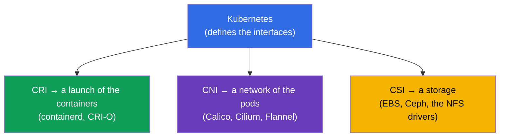
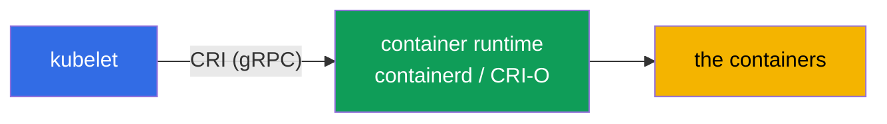
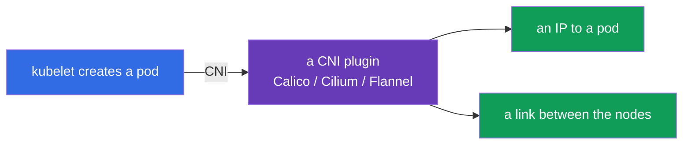
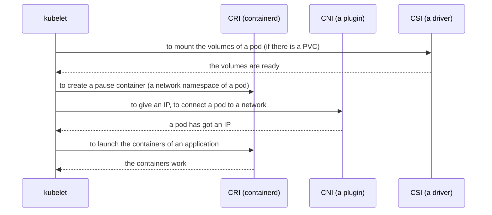
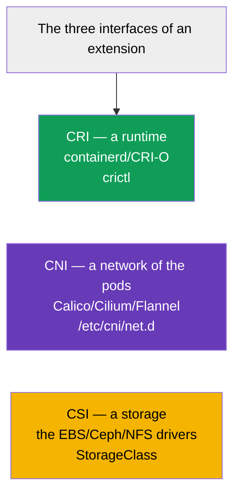

[Русская версия](ru.md) · [Versión en español](es.md) · [Version française](fr.md) · [Deutsche Version](de.md) · [ქართული ვერსია](ge.md) · [繁體中文版](tw.md) · [日本語版](jp.md)

# Chapter 40. The interfaces of an extension: CNI, CSI, CRI

> 🟦 **A chapter for the CKA** (a domain Cluster Architecture, Installation & Configuration).
>
> **What comes next.** We have met these abbreviations all over the course: CRI (a runtime,
> the chapter 2), CNI (a network of the pods, the chapter 30), CSI (a storage, the chapter 26). It is time to gather
> them into one picture. All the three - these are the **standard interfaces**, through which Kubernetes
> delegates a concrete work to the replaceable plugins, remaining independent of an implementation.
> An understanding of this architecture - a basis of an arrangement of a cluster and of its troubleshooting.

## 40.1. A general idea: Kubernetes does not do everything by itself

A key architectural principle: Kubernetes is **not tied** to a concrete runtime, to a network
or to a storage. It defines an **interface** (a contract), and a concrete work is performed by
a pluggable plugin. This way one can change an implementation without changing Kubernetes.



The three main interfaces - the "three C": **C**RI (a runtime), **C**NI (a network), **C**SI (a storage).
Each of them is responsible for its own layer.

## 40.2. CRI - a Container Runtime Interface

**CRI** - an interface between a kubelet and a container runtime. Through it a kubelet
commands "launch/stop a container", without knowing the details of a concrete runtime.



- **containerd** - now a main runtime.
- **CRI-O** - a lightweight runtime specially for Kubernetes.
- **Docker** as a runtime is removed (a dockershim is deleted in a 1.24) - the Docker images work, but
  through containerd.

A diagnostics of the containers on a node - by a utility `crictl` (it works with a CRI directly):

```bash
crictl ps                    # the launched containers on a node
crictl images                # the images
crictl logs <container-id>   # the logs of a container
```

`crictl` is irreplaceable, when a kubelet or an API do not work: it sees the containers at a level
of a runtime of a node, bypassing a cluster (the chapter 45).

## 40.3. CNI - a Container Network Interface

**CNI** - an interface of a network of the pods (in detail in the chapter 30). When a kubelet creates a pod, it through
a CNI asks a plugin to give an IP to a pod and to connect it to a network of a cluster.



- A configuration of a CNI on a node - in `/etc/cni/net.d/`.
- Without a CNI the nodes are `NotReady`, the pods do not start (the chapters 30, 35).
- Some CNI (Cilium, Calico) additionally implement a NetworkPolicy (the chapter 34).

## 40.4. CSI - a Container Storage Interface

**CSI** - an interface of a storage (in detail in the chapter 26). Through it Kubernetes creates,
attaches and mounts the volumes of any storage, without knowing its details.


- A `provisioner` in a StorageClass (the chapter 26) - this is exactly a CSI driver.
- One mechanism of a PV/PVC works with EBS, GCE PD, Ceph, NFS and others - thanks to a CSI.

```bash
kubectl get csidrivers        # the installed CSI drivers
```

## 40.5. How the three interfaces work together during a launch of a pod

Let us gather the picture: what happens on a node, when a kubelet raises a pod - the three interfaces
turn on one by one.



Each interface does its own part: CSI - a storage, CNI - a network, CRI - a launch of the containers
itself. A kubelet conducts. If something out of this is broken, a pod gets stuck at a
corresponding step (`ContainerCreating`, there is no IP, the volumes are not mounted) - and this is a hint,
where to look for a problem.

## 40.6. A summary table



| An interface | Is responsible for | The examples | Where to look |
|-----------|-------------|---------|-----------|
| **CRI** | a launch of the containers | containerd, CRI-O | `crictl`, `systemctl status containerd` |
| **CNI** | a network of the pods | Calico, Cilium, Flannel | `/etc/cni/net.d/`, the CNI pods in kube-system |
| **CSI** | a storage | the EBS/GCE/Ceph/NFS drivers | `kubectl get csidrivers`, StorageClass |

There are also the other interfaces of an extension (CRI/CNI/CSI - the main ones for the CKA), for example
the device plugins for a GPU, but it is not obligatory to know them.

## 40.7. How this is applied in a production

- **A choice of the implementations - a foundation of a cluster.** CRI (usually containerd), CNI (Calico/Cilium
  for the needs of the policies and of a performance), CSI (a driver for a used storage) -
  the basic decisions during a building of a cluster, influencing everything else.
- **An upgrade of the plugins separately from Kubernetes.** Thanks to the interfaces CNI/CSI/CRI
  the plugins are upgraded independently of a version of a cluster - this is a flexibility, but also a responsibility
  (a compatibility of the versions of the drivers).
- **A troubleshooting by the layers.** A knowledge, which interface is responsible for what, speeds up an analysis:
  a pod is `ContainerCreating` without an IP - we look at a CNI; the volumes are not mounted - a CSI; the containers do not
  start on a node - a CRI (`crictl`, containerd). This lays a problem out on the shelves.
- **crictl as an emergency instrument.** When a kubelet/an apiserver do not work, `crictl`
  remains a way to see and to take apart the containers right on a node - a key skill
  of a diagnostics of the nodes (the chapter 45).
- **Cilium/eBPF as a trend.** Many production clusters choose Cilium (a CNI on an eBPF) not
  only for a network, but also for a NetworkPolicy L7 and for a replacement of a kube-proxy - an example of how a CNI
  defines the possibilities of a cluster.

## 40.8. A mini glossary

- **CRI (Container Runtime Interface)** - an interface a kubelet ↔ a container runtime.
- **containerd / CRI-O** - the implementations of a CRI (the runtimes).
- **crictl** - a CLI for a work with the containers through a CRI on a node.
- **CNI (Container Network Interface)** - an interface of a network of the pods.
- **Calico / Cilium / Flannel** - the implementations of a CNI.
- **CSI (Container Storage Interface)** - an interface of a storage.
- **A CSI driver** - an implementation of a CSI (a provisioner in a StorageClass).
- **A pause container** - a service container, holding a network namespace of a pod.

## 40.9. The conclusions of the chapter

- Kubernetes is not tied to a runtime/a network/a storage - it sets the interfaces, and the work is done by
  the replaceable plugins.
- CRI - an interface of a launch of the containers (containerd, CRI-O); a diagnostics on a node - `crictl`;
  Docker as a runtime is removed.
- CNI - a network of the pods (Calico, Cilium, Flannel); a config in `/etc/cni/net.d/`; without it the nodes are
  NotReady.
- CSI - a storage (the EBS/Ceph/NFS drivers); a provisioner in a StorageClass - this is a CSI driver.
- During a launch of a pod the interfaces turn on one by one: CSI (the volumes) → CNI (a network) → CRI
  (the containers); a getting stuck points at a layer of a problem.
- The plugins are upgraded independently of Kubernetes; a knowledge of the layers speeds up a troubleshooting.

## 40.10. How this will come in handy: at an exam and in a real work

**At an exam (the CKA).** A program directly requires to "understand the interfaces of an extension (CNI, CSI,
CRI)". There are not many direct tasks, but an understanding is needed for an installation of a cluster (the chapter 35) and
for a troubleshooting: `crictl` for a diagnostics of the containers, a recognition of the problems of a CNI (there is no
IP) and of a CSI (the volumes). This binds together the chapters 2, 26, 30.

**In a real work.** A choice of a CRI/CNI/CSI - the basic architectural decisions of a cluster,
defining a network, a storage and the possibilities (the policies, a performance). An understanding of
the layers - a basis of a diagnostics: by a symptom of a pod it is immediately clear, which interface to check.
`crictl` - an irreplaceable instrument during a failure of a control layer of a node.

## 40.11. The questions for a self-check

1. Why does Kubernetes define the interfaces, and does not implement a runtime/a network/a storage by itself?
2. What is a CRI and how is `crictl` useful during a failure of a kubelet/an apiserver?
3. What does a CNI do and what will happen to the nodes without it?
4. What is a CSI and how is it connected with a provisioner in a StorageClass?
5. In which order do a CSI/CNI/CRI turn on during a launch of a pod?
6. By which symptoms of a pod can one understand, which interface is playing up?
7. Why is a possibility to upgrade the plugins separately from Kubernetes a plus and a risk
   at the same time?

## Practice

We have considered, how a runtime, a network and a storage are connected. In the chapter 41 we will pass to an extension
of an API itself - the CRD and the operators. The interfaces of an extension show up in all the labs on an
administration (especially during an installation of a cluster and of a CNI).

🧪 A lab 118 (including an inspection of a CNI/Pod CIDR): [tasks/cka/labs/118](../../labs/118/README.MD)

🧪 A lab 123 (an installation of a CNI from scratch): [tasks/cka/labs/123](../../labs/123/README.MD)

---
[Contents](../README.md) · [Chapter 39](../39/README.md) · [Chapter 41](../41/README.md)
