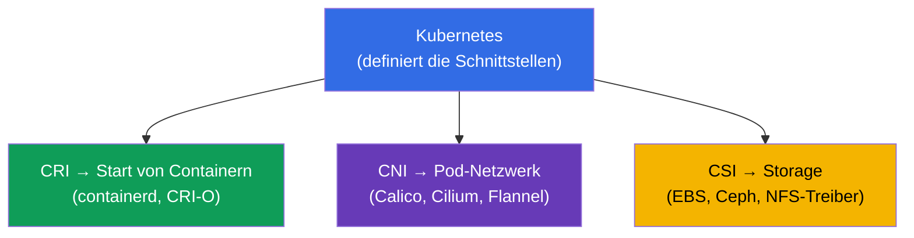
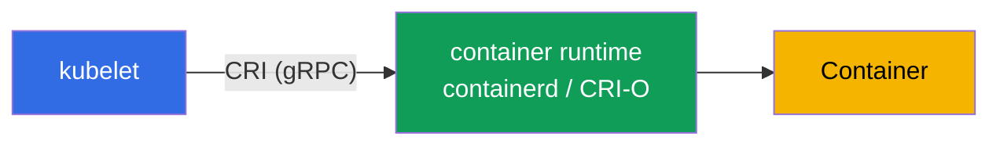
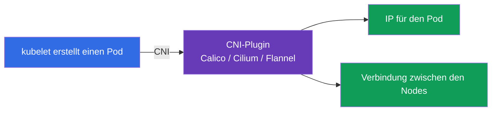
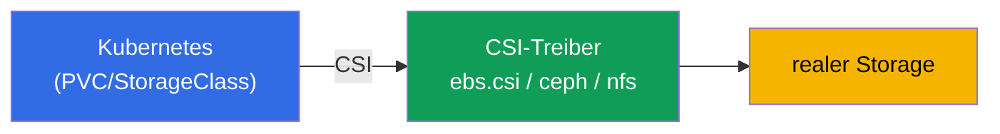
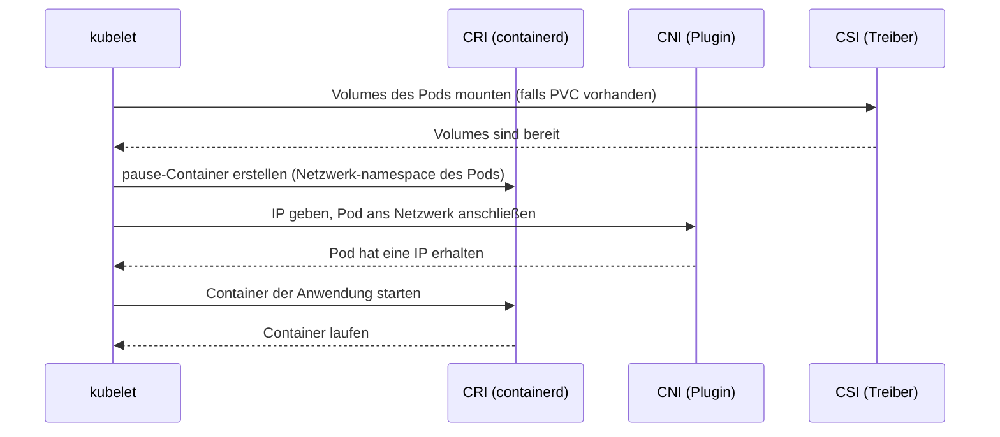
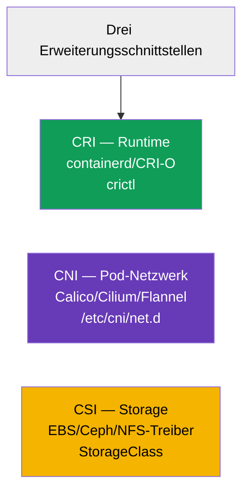

[Русская версия](ru.md) · [Eng version](README.md) · [Versión en español](es.md) · [Version française](fr.md) · [ქართული ვერსია](ge.md) · [繁體中文版](tw.md) · [日本語版](jp.md)

# Kapitel 40. Erweiterungsschnittstellen: CNI, CSI, CRI

> 🟦 **Kapitel für CKA** (Domäne Cluster Architecture, Installation & Configuration).
>
> **Was kommt.** Diese Abkürzungen haben wir im ganzen Kurs getroffen: CRI (Runtime,
> Kapitel 2), CNI (Pod-Netzwerk, Kapitel 30), CSI (Storage, Kapitel 26). Zeit, sie zu
> einem Bild zusammenzufügen. Alle drei sind **Standardschnittstellen**, über die
> Kubernetes die konkrete Arbeit an austauschbare Plugins delegiert und dabei unabhängig
> von der Implementierung bleibt. Das Verständnis dieser Architektur ist die Grundlage des
> Cluster-Aufbaus und seines Troubleshooting.

## 40.1. Die Grundidee: Kubernetes macht nicht alles selbst

Ein zentrales Architekturprinzip: Kubernetes ist **nicht gebunden** an eine konkrete
Runtime, ein Netzwerk oder einen Storage. Es definiert die **Schnittstelle** (den Vertrag),
und die konkrete Arbeit erledigt ein anschließbares Plugin. So kann man die Implementierung
wechseln, ohne Kubernetes zu ändern.



Die drei wichtigsten Schnittstellen - die „drei C“: **C**RI (runtime), **C**NI (network),
**C**SI (storage). Jede ist für ihre Ebene zuständig.

## 40.2. CRI - Container Runtime Interface

**CRI** ist die Schnittstelle zwischen kubelet und der Container-Runtime. Darüber
kommandiert kubelet „starte/stoppe den Container“, ohne die Details der konkreten Runtime
zu kennen.



- **containerd** - derzeit die wichtigste Runtime.
- **CRI-O** - eine leichte Runtime speziell für Kubernetes.
- **Docker** als Runtime ist entfernt (dockershim in 1.24 gestrichen) - Docker-Images
  funktionieren, aber über containerd.

Diagnose der Container auf einem Node - mit dem Werkzeug `crictl` (arbeitet direkt mit CRI):

```bash
crictl ps                    # laufende Container auf dem Node
crictl images                # Images
crictl logs <container-id>   # Logs des Containers
```

`crictl` ist unersetzlich, wenn kubelet oder die API nicht funktionieren: es sieht die
Container auf der Ebene der Node-Runtime, ohne den Cluster (Kapitel 45).

## 40.3. CNI - Container Network Interface

**CNI** ist die Schnittstelle des Pod-Netzwerks (im Detail in Kapitel 30). Wenn kubelet
einen Pod erstellt, bittet es über CNI das Plugin, dem Pod eine IP zu geben und ihn an das
Cluster-Netzwerk anzuschließen.



- Die CNI-Konfiguration auf dem Node liegt in `/etc/cni/net.d/`.
- Ohne CNI sind die Nodes `NotReady`, Pods starten nicht (Kapitel 30, 35).
- Manche CNI (Cilium, Calico) implementieren zusätzlich NetworkPolicy (Kapitel 34).

## 40.4. CSI - Container Storage Interface

**CSI** ist die Schnittstelle des Storage (im Detail in Kapitel 26). Darüber erstellt,
verbindet und mountet Kubernetes Volumes jedes Storage, ohne seine Details zu kennen.



- Der `provisioner` in der StorageClass (Kapitel 26) ist genau der CSI-Treiber.
- Ein einziger Mechanismus PV/PVC funktioniert mit EBS, GCE PD, Ceph, NFS u. a. - dank CSI.

```bash
kubectl get csidrivers        # installierte CSI-Treiber
```

## 40.5. Wie die drei Schnittstellen beim Start eines Pods zusammenwirken

Fügen wir das Bild zusammen: was auf dem Node passiert, wenn kubelet einen Pod hochfährt -
die drei Schnittstellen schalten sich der Reihe nach ein.



Jede Schnittstelle macht ihren Teil: CSI - Storage, CNI - Netzwerk, CRI - den eigentlichen
Start der Container. kubelet dirigiert. Wenn etwas davon kaputt ist, bleibt der Pod im
entsprechenden Schritt hängen (`ContainerCreating`, keine IP, Volumes werden nicht
gemountet) - und das ist ein Hinweis, wo man das Problem suchen muss.

## 40.6. Übersichtstabelle



| Schnittstelle | Zuständig für | Beispiele | Wo man nachsieht |
|-----------|-------------|---------|-----------|
| **CRI** | Start von Containern | containerd, CRI-O | `crictl`, `systemctl status containerd` |
| **CNI** | Pod-Netzwerk | Calico, Cilium, Flannel | `/etc/cni/net.d/`, CNI-Pods in kube-system |
| **CSI** | Storage | EBS/GCE/Ceph/NFS-Treiber | `kubectl get csidrivers`, StorageClass |

Es gibt noch weitere Erweiterungsschnittstellen (CRI/CNI/CSI sind die wichtigsten für CKA),
zum Beispiel device plugins für GPU, aber die muss man nicht kennen.

## 40.7. Wie man das in der Produktion anwendet

- **Die Wahl der Implementierungen ist das Fundament des Clusters.** CRI (üblicherweise
  containerd), CNI (Calico/Cilium je nach Anforderungen an Policies und Performance), CSI
  (Treiber für den genutzten Storage) - das sind Basisentscheidungen beim Aufbau eines
  Clusters, die alles Weitere beeinflussen.
- **Update der Plugins unabhängig von Kubernetes.** Dank der Schnittstellen CNI/CSI/CRI
  werden Plugins unabhängig von der Cluster-Version aktualisiert - das ist Flexibilität,
  aber auch Verantwortung (Versionskompatibilität der Treiber).
- **Troubleshooting nach Ebenen.** Zu wissen, welche Schnittstelle für was zuständig ist,
  beschleunigt die Analyse: Pod in `ContainerCreating` ohne IP - wir schauen auf CNI;
  Volumes werden nicht gemountet - CSI; Container starten auf dem Node nicht - CRI
  (`crictl`, containerd). Das sortiert das Problem in Schubladen.
- **crictl als Notfallwerkzeug.** Wenn kubelet/apiserver nicht funktionieren, bleibt
  `crictl` die Möglichkeit, Container direkt auf dem Node zu sehen und zu analysieren - eine
  Schlüsselfähigkeit der Node-Diagnose (Kapitel 45).
- **Cilium/eBPF als Trend.** Viele Produktions-Cluster wählen Cilium (CNI auf eBPF) nicht
  nur wegen des Netzwerks, sondern auch wegen NetworkPolicy auf L7 und dem Ersatz von
  kube-proxy - ein Beispiel dafür, wie CNI die Möglichkeiten des Clusters bestimmt.

## 40.8. Mini-Glossar

- **CRI (Container Runtime Interface)** - Schnittstelle kubelet ↔ Container-Runtime.
- **containerd / CRI-O** - Implementierungen von CRI (Runtimes).
- **crictl** - CLI für die Arbeit mit Containern über CRI auf dem Node.
- **CNI (Container Network Interface)** - Schnittstelle des Pod-Netzwerks.
- **Calico / Cilium / Flannel** - Implementierungen von CNI.
- **CSI (Container Storage Interface)** - Schnittstelle des Storage.
- **CSI-Treiber** - Implementierung von CSI (provisioner in der StorageClass).
- **pause-Container** - Hilfscontainer, der den Netzwerk-namespace des Pods hält.

## 40.9. Zusammenfassung des Kapitels

- Kubernetes ist nicht an Runtime/Netzwerk/Storage gebunden - es legt Schnittstellen fest,
  und die Arbeit machen austauschbare Plugins.
- CRI - Schnittstelle für den Start von Containern (containerd, CRI-O); Diagnose auf dem
  Node - `crictl`; Docker als Runtime ist entfernt.
- CNI - Pod-Netzwerk (Calico, Cilium, Flannel); Konfiguration in `/etc/cni/net.d/`; ohne es
  sind die Nodes NotReady.
- CSI - Storage (Treiber EBS/Ceph/NFS); der provisioner in der StorageClass ist der
  CSI-Treiber.
- Beim Start eines Pods schalten sich die Schnittstellen der Reihe nach ein: CSI (Volumes) →
  CNI (Netzwerk) → CRI (Container); ein Hängenbleiben zeigt die Ebene des Problems.
- Plugins werden unabhängig von Kubernetes aktualisiert; das Wissen um die Ebenen
  beschleunigt das Troubleshooting.

## 40.10. Wofür das nützlich ist: in der Prüfung und in der echten Arbeit

**In der Prüfung (CKA).** Das Programm fordert direkt, „die Erweiterungsschnittstellen (CNI,
CSI, CRI) zu verstehen“. Direkte Aufgaben gibt es wenige, aber das Verständnis braucht man
für die Installation des Clusters (Kapitel 35) und für Troubleshooting: `crictl` zur
Diagnose von Containern, das Erkennen von CNI-Problemen (keine IP) und CSI-Problemen
(Volumes). Das verbindet die Kapitel 2, 26, 30 zu einem Ganzen.

**In der echten Arbeit.** Die Wahl von CRI/CNI/CSI sind grundlegende Architekturentscheidungen
des Clusters, die Netzwerk, Storage und Möglichkeiten (Policies, Performance) bestimmen. Das
Verständnis der Ebenen ist die Grundlage der Diagnose: am Symptom des Pods ist sofort klar,
welche Schnittstelle man prüfen muss. `crictl` ist ein unersetzliches Werkzeug beim Ausfall
der Steuerungsebene eines Nodes.

## 40.11. Fragen zur Selbstüberprüfung

1. Warum definiert Kubernetes Schnittstellen und implementiert Runtime/Netzwerk/Storage
   nicht selbst?
2. Was ist CRI und wozu ist `crictl` beim Ausfall von kubelet/apiserver nützlich?
3. Was macht CNI und was passiert mit den Nodes ohne es?
4. Was ist CSI und wie hängt es mit dem provisioner in der StorageClass zusammen?
5. In welcher Reihenfolge schalten sich CSI/CNI/CRI beim Start eines Pods ein?
6. An welchen Symptomen eines Pods erkennt man, welche Schnittstelle klemmt?
7. Warum ist die Möglichkeit, Plugins unabhängig von Kubernetes zu aktualisieren, gleichzeitig
   ein Plus und ein Risiko?

## Praxis

Wir haben besprochen, wie Runtime, Netzwerk und Storage angebunden werden. In Kapitel 41
gehen wir zur Erweiterung der API selbst über - CRD und Operatoren. Die
Erweiterungsschnittstellen zeigen sich in allen Labs zur Administration (besonders bei der
Installation des Clusters und von CNI).

🧪 Lab 118 (u. a. Inspektion von CNI/Pod CIDR): [tasks/cka/labs/118](../../labs/118/README_DE.MD)

🧪 Lab 123 (Installation von CNI von null): [tasks/cka/labs/123](../../labs/123/README_DE.MD)

---
[Inhalt](../README_DE.md) · [Kapitel 39](../39/de.md) · [Kapitel 41](../41/de.md)
