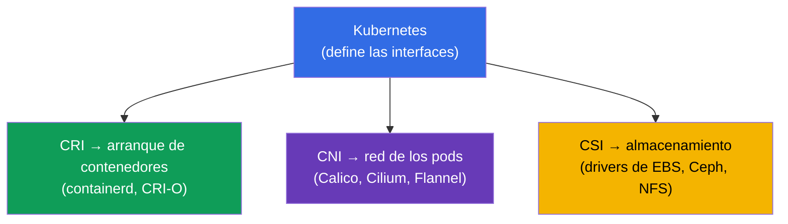
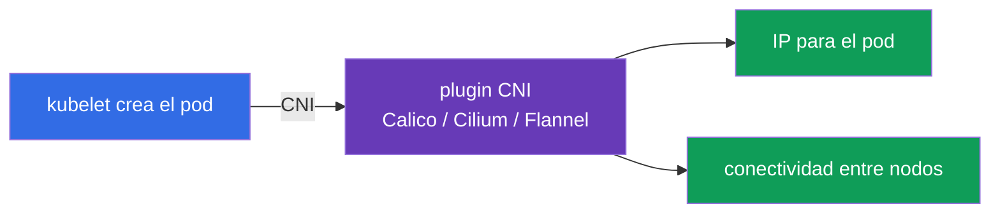
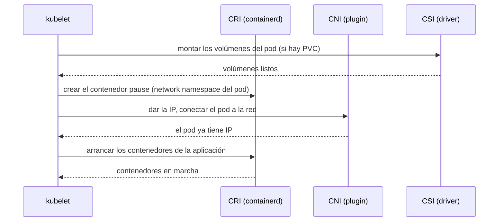
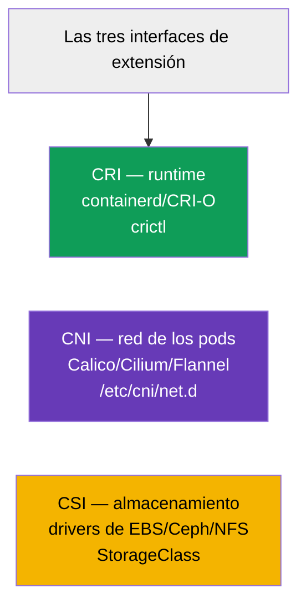

[Русская версия](ru.md) · [Eng version](README.md) · [Version française](fr.md) · [Deutsche Version](de.md) · [ქართული ვერსია](ge.md)

# Capítulo 40. Interfaces de extensión: CNI, CSI, CRI

> 🟦 **Capítulo para CKA** (dominio Cluster Architecture, Installation & Configuration).
>
> **Qué viene ahora.** Nos hemos cruzado con estas siglas por todo el curso: CRI (el runtime,
> capítulo 2), CNI (la red de los pods, capítulo 30), CSI (el almacenamiento, capítulo 26). Toca
> juntarlas en un solo cuadro. Las tres son **interfaces estándar** a través de las cuales
> Kubernetes delega el trabajo concreto en plugins intercambiables, manteniéndose independiente de
> la implementación. Entender esta arquitectura es la base de cómo está montado el clúster y de su
> troubleshooting.

## 40.1. La idea general: Kubernetes no lo hace todo él mismo

El principio arquitectónico clave: Kubernetes **no está atado** a un runtime, una red o un
almacenamiento concretos. Define una **interfaz** (un contrato) y el trabajo real lo hace un plugin
conectable. Así se puede cambiar la implementación sin cambiar Kubernetes.



Las tres interfaces principales son las «tres C»: **C**RI (runtime), **C**NI (network), **C**SI
(storage). Cada una responde por su capa.

## 40.2. CRI - Container Runtime Interface

**CRI** es la interfaz entre kubelet y el runtime de contenedores. A través de ella kubelet ordena
«arranca/para este contenedor» sin conocer los detalles del runtime concreto.


- **containerd** - hoy es el runtime principal.
- **CRI-O** - un runtime ligero pensado específicamente para Kubernetes.
- **Docker** como runtime se ha retirado (dockershim eliminado en 1.24) - las imágenes Docker
  siguen funcionando, pero a través de containerd.

El diagnóstico de contenedores en el nodo se hace con la utilidad `crictl` (habla con CRI
directamente):

```bash
crictl ps                    # contenedores en marcha en el nodo
crictl images                # imágenes
crictl logs <container-id>   # logs del contenedor
```

`crictl` es insustituible cuando kubelet o la API no funcionan: ve los contenedores al nivel del
runtime del nodo, sin pasar por el clúster (capítulo 45).

## 40.3. CNI - Container Network Interface

**CNI** es la interfaz de la red de los pods (en detalle en el capítulo 30). Cuando kubelet crea un
pod, pide vía CNI que el plugin le dé una IP y lo conecte a la red del clúster.



- La configuración de CNI en el nodo está en `/etc/cni/net.d/`.
- Sin CNI los nodos quedan `NotReady` y los pods no arrancan (capítulos 30 y 35).
- Algunos CNI (Cilium, Calico) además implementan NetworkPolicy (capítulo 34).

## 40.4. CSI - Container Storage Interface

**CSI** es la interfaz de almacenamiento (en detalle en el capítulo 26). A través de ella Kubernetes
crea, conecta y monta volúmenes de cualquier almacenamiento sin conocer sus detalles.


- El `provisioner` de una StorageClass (capítulo 26) es precisamente el driver CSI.
- Un único mecanismo PV/PVC funciona con EBS, GCE PD, Ceph, NFS y demás, gracias a CSI.

```bash
kubectl get csidrivers        # drivers CSI instalados
```

## 40.5. Cómo trabajan juntas las tres interfaces al arrancar un pod

Juntemos el cuadro: qué pasa en el nodo cuando kubelet levanta un pod - las tres interfaces entran
por turnos.



Cada interfaz hace su parte: CSI el almacenamiento, CNI la red, CRI el arranque propiamente dicho de
los contenedores. kubelet dirige la orquesta. Si algo de esto está roto, el pod se queda atascado en
el paso correspondiente (`ContainerCreating`, sin IP, volúmenes que no se montan) - y eso es una
pista de dónde buscar el problema.

## 40.6. Tabla resumen



| Interfaz | Responde por | Ejemplos | Dónde mirar |
|-----------|-------------|---------|-----------|
| **CRI** | arranque de contenedores | containerd, CRI-O | `crictl`, `systemctl status containerd` |
| **CNI** | red de los pods | Calico, Cilium, Flannel | `/etc/cni/net.d/`, pods del CNI en kube-system |
| **CSI** | almacenamiento | drivers de EBS/GCE/Ceph/NFS | `kubectl get csidrivers`, StorageClass |

Hay más interfaces de extensión (CRI/CNI/CSI son las principales para el CKA), por ejemplo los
device plugins para GPU, pero no hace falta conocerlas.

## 40.7. Cómo se aplica esto en producción

- **La elección de las implementaciones es el cimiento del clúster.** CRI (normalmente containerd),
  CNI (Calico/Cilium según las necesidades de políticas y rendimiento), CSI (el driver del
  almacenamiento que se use) son decisiones básicas al construir el clúster y afectan a todo lo
  demás.
- **Actualizar los plugins por separado de Kubernetes.** Gracias a las interfaces CNI/CSI/CRI los
  plugins se actualizan de forma independiente de la versión del clúster - eso es flexibilidad, pero
  también responsabilidad (compatibilidad de versiones de los drivers).
- **Troubleshooting por capas.** Saber de qué responde cada interfaz acelera el análisis: pod en
  `ContainerCreating` sin IP → miramos CNI; volúmenes que no se montan → CSI; contenedores que no
  arrancan en el nodo → CRI (`crictl`, containerd). Esto pone cada problema en su sitio.
- **crictl como herramienta de emergencia.** Cuando kubelet/apiserver no funcionan, `crictl` sigue
  siendo la manera de ver y analizar los contenedores directamente en el nodo - una habilidad clave
  para diagnosticar nodos (capítulo 45).
- **Cilium/eBPF como tendencia.** Muchos clústeres de producción eligen Cilium (CNI sobre eBPF) no
  solo por la red, sino también por NetworkPolicy L7 y por sustituir a kube-proxy - un ejemplo de
  cómo el CNI define las capacidades del clúster.

## 40.8. Mini-glosario

- **CRI (Container Runtime Interface)** - interfaz kubelet ↔ runtime de contenedores.
- **containerd / CRI-O** - implementaciones de CRI (runtimes).
- **crictl** - CLI para trabajar con contenedores a través de CRI en el nodo.
- **CNI (Container Network Interface)** - interfaz de la red de los pods.
- **Calico / Cilium / Flannel** - implementaciones de CNI.
- **CSI (Container Storage Interface)** - interfaz de almacenamiento.
- **Driver CSI** - implementación de CSI (el provisioner de una StorageClass).
- **Contenedor pause** - contenedor de servicio que mantiene el network namespace del pod.

## 40.9. Resumen del capítulo

- Kubernetes no está atado a un runtime/red/almacenamiento concretos: define interfaces y el trabajo
  lo hacen plugins intercambiables.
- CRI es la interfaz de arranque de contenedores (containerd, CRI-O); el diagnóstico en el nodo es
  `crictl`; Docker como runtime se ha retirado.
- CNI es la red de los pods (Calico, Cilium, Flannel); la configuración está en `/etc/cni/net.d/`;
  sin él los nodos quedan NotReady.
- CSI es el almacenamiento (drivers de EBS/Ceph/NFS); el provisioner de una StorageClass es el driver
  CSI.
- Al arrancar un pod las interfaces entran por turnos: CSI (volúmenes) → CNI (red) → CRI
  (contenedores); dónde se atasca indica la capa del problema.
- Los plugins se actualizan de forma independiente de Kubernetes; conocer las capas acelera el
  troubleshooting.

## 40.10. Para qué sirve esto: en el examen y en el trabajo real

**En el examen (CKA).** El programa pide expresamente «entender las interfaces de extensión (CNI,
CSI, CRI)». Tareas directas hay pocas, pero la comprensión hace falta para instalar el clúster
(capítulo 35) y para el troubleshooting: `crictl` para diagnosticar contenedores, reconocer
problemas de CNI (sin IP) y de CSI (volúmenes). Esto une los capítulos 2, 26 y 30.

**En el trabajo real.** La elección de CRI/CNI/CSI son decisiones arquitectónicas básicas del
clúster, que definen la red, el almacenamiento y las capacidades (políticas, rendimiento). Entender
las capas es la base del diagnóstico: por el síntoma del pod se ve enseguida qué interfaz revisar.
`crictl` es una herramienta insustituible cuando falla la capa de control del nodo.

## 40.11. Preguntas de autocomprobación

1. ¿Por qué Kubernetes define interfaces en vez de implementar él mismo el runtime, la red y el almacenamiento?
2. ¿Qué es CRI y en qué ayuda `crictl` cuando fallan kubelet/apiserver?
3. ¿Qué hace CNI y qué les pasa a los nodos sin él?
4. ¿Qué es CSI y cómo se relaciona con el provisioner de una StorageClass?
5. ¿En qué orden entran CSI/CNI/CRI al arrancar un pod?
6. ¿Por qué síntomas de un pod se sabe qué interfaz está fallando?
7. ¿Por qué poder actualizar los plugins por separado de Kubernetes es a la vez una ventaja y un
   riesgo?

## Práctica

Ya hemos visto cómo se conectan el runtime, la red y el almacenamiento. En el capítulo 41 pasaremos a
extender la propia API - CRD y operadores. Las interfaces de extensión aparecen en todos los
laboratorios de administración (sobre todo al instalar el clúster y el CNI).

🧪 Laboratorio 118 (incluye inspección de CNI/Pod CIDR): [tasks/cka/labs/118](../../labs/118/README_ES.MD)

🧪 Laboratorio 123 (instalación de CNI desde cero): [tasks/cka/labs/123](../../labs/123/README_ES.MD)

---
[Índice](../README_ES.md) · [Capítulo 39](../39/es.md) · [Capítulo 41](../41/es.md)
